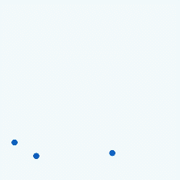
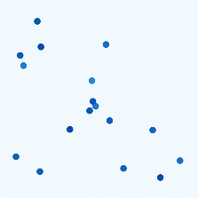
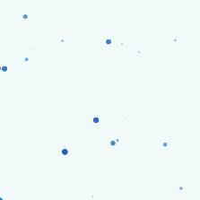

# 粒子动画

[粒子动画](../reference/apis-arkui/arkui-ts/ts-particle-animation.md)是在一定范围内随机生成的大量粒子产生运动而组成的动画。动画元素是一个个粒子，这些粒子可以是圆点、图片。开发者可以通过对粒子在颜色、透明度、大小、速度、加速度、自旋角度等维度变化做动画，来营造一种氛围感，比如下雪的动效，雪花飘舞就相当于一个个雪花粒子在做动画。

粒子动画的效果通过Particle组件展现。

基本示例代码和效果如下
```ts
@Entry
@Component
struct ParticleExample {
  build() {
    Stack() {
      Text()
        .width(300).height(300).backgroundColor(Color.Black)
      Particle({ particles: [
        {
          emitter: {
            particle: {
              type: ParticleType.POINT, //粒子类型
              config: {
                radius: 5 //圆点半径
              },
              count: 100, //粒子总数
            },
          },
        },
      ]
      }).width(250).height(250)
    }.width("100%").height("100%").align(Alignment.Center)
  }
}
```




## 发射器

粒子发射器（Particle Emitter）是粒子动画中用于生成和控制粒子的组件，主要用于定义粒子的初始属性（如类型、位置、颜色），控制粒子生成的速率，以及管理粒子的生命周期。

支持发射器位置动态更新。通过 [emitter](../reference/apis-arkui/arkui-ts/ts-particle-animation.md#emitter12) 方法调整粒子发射器的位置，发射速率和发射窗口的大小。

```ts
// ...
@State emitterProperties: Array<EmitterProperty> = [
  {
    index: 0,
    emitRate: 100,
    position: { x: 60, y: 80 },
    size: { width: 200, height: 200 }
  }
]

Particle(...).width(300).height(300).emitter(this.emitterProperties) // 动态调整粒子发射器的位置
// ...
```


## 颜色

通过 [DistributionType](../reference/apis-arkui/arkui-ts/ts-particle-animation.md#distributiontype12) 设置粒子初始颜色随机值分布。可以设置为均匀分布或者高斯（正态）分布。

```ts
// ...
color: {
  range: [Color.White, Color.Yellow], // 初始颜色范围
  distributionType: DistributionType.GAUSSIAN // 初始颜色随机值分布
},
// ...
```




## 生命周期

粒子的生命周期（Lifecycle）是粒子从生成到消亡的过程，用于指定粒子的生存时长。

通过lifetime和lifetimeRange设置粒子生命周期。

```ts
// ...
emitter: {
  particle: {
    // ...
    lifetime: 300, //粒子生命周期，单位ms
    lifetimeRange: 100 //粒子生命周期取值范围，单位ms
  },
  emitRate: 10, //每秒发射粒子数
  position: [0, 0],
  shape: ParticleEmitterShape.RECTANGLE //发射器形状
},
color: {
  range: [Color.White, Color.Yellow], // 初始颜色范围
},
// ...
```


## 扰动场

扰动场（Disturbance Field）是用来影响粒子运动的一种机制。扰动场通过在粒子所在空间区域中施加特定的力，来改变粒子的轨迹和行为，从而实现更复杂和自然的动画效果。

扰动场可以通过 [disturbanceFields](../reference/apis-arkui/arkui-ts/ts-particle-animation.md#disturbancefields12) 方法进行配置。

```ts
// ...
Particle({ particles: [
  {
    emitter: // ...
    color: // ...
    scale: {
      range: [0.0, 0.0],
      updater: {
        type: ParticleUpdater.CURVE,
        config: [
          {
            from: 0.0,
            to: 0.5,
            startMillis: 0,
            endMillis: 3000,
            curve: Curve.EaseIn
          }
        ]
      }
    },
    acceleration: { //加速度的配置，从大小和方向两个维度变化，speed表示加速度大小，angle表示加速度方向
      speed: {
        range: [3, 9],
        updater: {
          type: ParticleUpdater.RANDOM,
          config: [1, 20]
        }
      },
      angle: {
        range: [90, 90]
      }
    }

  }
]
}).width(300).height(300).disturbanceFields([{
  strength: 10,
  shape: DisturbanceFieldShape.RECT,
  size: { width: 100, height: 100 },
  position: { x: 100, y: 100 },
  feather: 15,
  noiseScale: 10,
  noiseFrequency: 15,
  noiseAmplitude: 5
}])
// ... 
```

