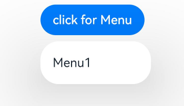

# 菜单控制（Menu）
Menu是菜单接口，一般用于鼠标右键弹窗、点击弹窗等。具体用法请参考[菜单控制](../reference/apis-arkui/arkui-ts/ts-universal-attributes-menu.md)。

使用[bindContextMenu](../reference//apis-arkui/arkui-ts/ts-universal-attributes-menu.md#bindcontextmenu12)并设置预览图，菜单弹出时有蒙层，此时为模态。

使用[bindMenu](../reference/apis-arkui/arkui-ts/ts-universal-attributes-menu.md#bindmenu11)或bindContextMenu未设置预览图时，菜单弹出无蒙层，此时为非模态。

## 生命周期

| 名称| 类型 | 说明 |
| --- | --- | --- |
| aboutToAppear  | () =>  void | 菜单显示动效前的事件回调。 |
| onAppear | () =>  void | 菜单弹出时的事件回调。 |
| aboutToDisappear | () =>  void | 菜单退出动效前的事件回调。 |
| onDisappear  | () =>  void | 菜单消失时的事件回调。 |


## 创建默认样式的菜单

菜单需要调用bindMenu接口来实现。bindMenu响应绑定组件的点击事件，绑定组件后手势点击对应组件后即可弹出。

```ts
Button('click for Menu')
  .bindMenu([
    {
      value: 'Menu1',
      action: () => {
        console.info('handle Menu1 select');
      }
    }
  ])
```



## 创建自定义样式的菜单

当默认样式不满足开发需求时，可使用[@Builder](../../application-dev/ui/state-management/arkts-builder.md)自定义菜单内容，通过bindMenu接口进行菜单的自定义。

### 使用@Builder自定义菜单内容

```ts
class Tmp {
  iconStr2: ResourceStr = $r("app.media.view_list_filled");

  set(val: Resource) {
    this.iconStr2 = val;
  }
}

@Entry
@Component
struct menuExample {
  @State select: boolean = true;
  private iconStr: ResourceStr = $r("app.media.view_list_filled");
  private iconStr2: ResourceStr = $r("app.media.view_list_filled");

  @Builder
  SubMenu() {
    Menu() {
      MenuItem({ content: "复制", labelInfo: "Ctrl+C" })
      MenuItem({ content: "粘贴", labelInfo: "Ctrl+V" })
    }
  }

  @Builder
  MyMenu() {
    Menu() {
      MenuItem({ startIcon: $r("app.media.icon"), content: "菜单选项" })
      MenuItem({ startIcon: $r("app.media.icon"), content: "菜单选项" }).enabled(false)
      MenuItem({
        startIcon: this.iconStr,
        content: "菜单选项",
        endIcon: $r("app.media.arrow_right_filled"),
        // 当builder参数进行配置时，表示与menuItem项绑定了子菜单。鼠标hover在该菜单项时，会显示子菜单。
        builder: this.SubMenu
      })
      MenuItemGroup({ header: '小标题' }) {
        MenuItem({ content: "菜单选项" })
          .selectIcon(true)
          .selected(this.select)
          .onChange((selected) => {
            console.info("menuItem select" + selected);
            let Str: Tmp = new Tmp();
            Str.set($r("app.media.icon"));
          })
        MenuItem({
          startIcon: $r("app.media.view_list_filled"),
          content: "菜单选项",
          endIcon: $r("app.media.arrow_right_filled"),
          builder: this.SubMenu
        })
      }

      MenuItem({
        startIcon: this.iconStr2,
        content: "菜单选项",
        endIcon: $r("app.media.arrow_right_filled")
      })
    }
  }

  build() {
    // ...
  }
}

```

### 使用bindMenu属性绑定组件件

```ts
Button('click for Menu')
  .bindMenu(this.MyMenu)
```


## 创建支持右键或长按的菜单

通过bindContextMenu接口自定义菜单，设置菜单弹出的触发方式，触发方式为右键或长按。使用bindContextMenu弹出的菜单项是在独立子窗口内的，可显示在应用窗口外部。

- 使用@Builder自定义菜单内容，与上文写法相同。
- 确认菜单的弹出方式，并使用bindContextMenu属性绑定组件。示例中为右键弹出菜单。
  
  ```ts
  Button('click for Menu')
    .bindContextMenu(this.MyMenu, ResponseType.RightClick)
  ```


