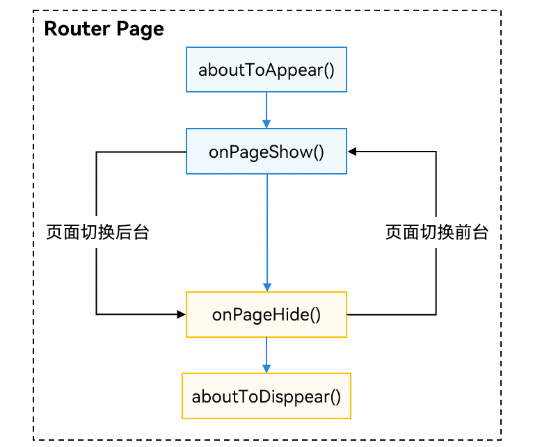

# Router切换Navigation
<!--Kit: ArkUI-->
<!--Subsystem: ArkUI-->
<!--Owner: @mayaolll-->
<!--SE: @jiangdayuan-->
<!--TSE: @lxl007-->

鉴于组件导航(Navigation)支持更丰富的动效、一次开发多端部署能力和更灵活的栈操作。本文主要从页面跳转、动效和生命周期等方面介绍如何从Router切换到Navigation。

## 页面结构

Router路由的页面是一个`@Entry`修饰的Component，每一个页面都需要在`main_page.json`中声明。

```json
// main_page.json
{
  "src": [
    "pages/Index",
    "pages/pageOne",
    "pages/pageTwo"
  ]
}
```

以下为Router页面的示例。

```ts
// index.ets
import { router } from '@kit.ArkUI';

@Entry
@Component
struct Index {
  @State message: string = 'Hello World';

  build() {
    Row() {
      Column() {
        Text(this.message)
          .fontSize(50)
          .fontWeight(FontWeight.Bold)
        Button('router to pageOne', { stateEffect: true, type: ButtonType.Capsule })
          .width('80%')
          .height(40)
          .margin(20)
          .onClick(() => {
            this.getUIContext().getRouter().pushUrl({
              url: 'pages/pageOne' // 目标url
            }, router.RouterMode.Standard, (err) => {
              if (err) {
                console.error(`Invoke pushUrl failed, code is ${err.code}, message is ${err.message}`);
                return;
              }
              console.info('Invoke pushUrl succeeded.');
            })
          })
      }
      .width('100%')
    }
    .height('100%')
  }
}
```

```ts
// pageOne.ets
@Entry
@Component
struct pageOne {
  @State message: string = 'This is pageOne';

  build() {
    Row() {
      Column() {
        Text(this.message)
          .fontSize(50)
          .fontWeight(FontWeight.Bold)
        Button('router back to Index', { stateEffect: true, type: ButtonType.Capsule })
          .width('80%')
          .height(40)
          .margin(20)
          .onClick(() => {
            this.getUIContext().getRouter().back();
          })
      }
      .width('100%')
    }
    .height('100%')
  }
}
```

而基于Navigation的路由页面分为导航页和子页，导航页又叫Navbar，是Navigation包含的子组件，子页是NavDestination包含的子组件。

以下为Navigation导航页的示例。

```ts
// index.ets
@Entry
@Component
struct Index {
  pathStack: NavPathStack = new NavPathStack();

  build() {
    Navigation(this.pathStack) {
      Column() {
        Button('Push PageOne', { stateEffect: true, type: ButtonType.Capsule })
          .width('80%')
          .height(40)
          .margin(20)
          .onClick(() => {
            this.pathStack.pushPathByName('pageOne', null);
          })
      }.width('100%').height('100%')
    }
    .title("Navigation")
    .mode(NavigationMode.Stack)
  }
}
```
以下为Navigation子页的示例。

```ts
// PageOne.ets

@Builder
export function PageOneBuilder() {
  PageOne();
}

@Component
export struct PageOne {
  pathStack: NavPathStack = new NavPathStack();

  build() {
    NavDestination() {
      Column() {
        Button('回到首页', { stateEffect: true, type: ButtonType.Capsule })
          .width('80%')
          .height(40)
          .margin(20)
          .onClick(() => {
            this.pathStack.clear();
          })
      }.width('100%').height('100%')
    }.title('PageOne')
    .onReady((context: NavDestinationContext) => {
      this.pathStack = context.pathStack;
    })
  }
}
```

每个子页也需要配置到系统配置文件`route_map.json`中（参考[系统路由表](arkts-navigation-navigation.md#系统路由表)）。

```json
// 工程配置文件module.json5中配置 {"routerMap": "$profile:route_map"}
// route_map.json
{
  "routerMap": [
    {
      "name": "pageOne",
      "pageSourceFile": "src/main/ets/pages/PageOne.ets",
      "buildFunction": "PageOneBuilder",
      "data": {
        "description": "this is pageOne"
      }
    }
  ]
}
```

## 路由操作

Router通过`@ohos.router`模块提供的方法来操作页面，建议使用[UIContext](../reference/apis-arkui/arkts-apis-uicontext-uicontext.md)中的[getRouter](../reference/apis-arkui/arkts-apis-uicontext-uicontext.md#getrouter)获取[Router](../reference/apis-arkui/arkts-apis-uicontext-router.md)对象。

```ts
// push page
router.pushUrl({ url:"pages/pageOne", params: null });

// pop page
this.getUIContext().getRouter().back({ url: "pages/pageOne" });

// replace page
router.replaceUrl({ url: "pages/pageOne" });

// clear all page
this.getUIContext().getRouter().clear();

// 获取页面栈大小
let size = this.getUIContext().getRouter().getLength();

// 获取页面状态
let pageState = this.getUIContext().getRouter().getState();
```

Navigation通过导航控制器对象[NavPathStack](../reference/apis-arkui/arkui-ts/ts-basic-components-navigation.md#navpathstack10)提供的方法来操作页面，需要创建一个栈对象并传入Navigation中。

```ts
@Entry
@Component
struct Index {
  pathStack: NavPathStack = new NavPathStack();

  build() {
    // 设置NavPathStack并传入Navigation
    Navigation(this.pathStack) {
      // ...
    }.width('100%').height('100%')
    .title("Navigation")
    .mode(NavigationMode.Stack)
  }
}


// push page
this.pathStack.pushPath({ name: 'pageOne' });

// pop page
this.pathStack.pop();
this.pathStack.popToIndex(1);
this.pathStack.popToName('pageOne');

// replace page
this.pathStack.replacePath({ name: 'pageOne' });

// clear all page
this.pathStack.clear();

// 获取路由栈大小
let size: number = this.pathStack.size();

// 删除栈中name为PageOne的所有页面
this.pathStack.removeByName("pageOne");

// 删除指定索引的页面
this.pathStack.removeByIndexes([1, 3, 5]);

// 获取栈中所有页面name集合
this.pathStack.getAllPathName();

// 获取索引为1的页面参数
this.pathStack.getParamByIndex(1);

// 获取PageOne页面的参数
this.pathStack.getParamByName("pageOne");

// 获取PageOne页面的索引集合
this.pathStack.getIndexByName("pageOne");
// ...
```

Router作为全局通用模块，可以在任意页面中调用，Navigation作为组件，子页面想要做路由需要拿到Navigation持有的导航控制器对象NavPathStack，可以通过如下几种方式获取：

**方式一**：通过`@Provide`和`@Consume`传递给子页面（有耦合，不推荐）。

```ts
// Navigation根容器
@Entry
@Component
struct Index {
  // Navigation创建一个Provide修饰的NavPathStack
 @Provide('pathStack') pathStack: NavPathStack = new NavPathStack();

  build() {
    Navigation(this.pathStack) {
        // ...
    }
    .title("Navigation")
    .mode(NavigationMode.Stack)
  }
}

// Navigation子页面
@Component
export struct PageOne {
  // NavDestination通过Consume获取到
  @Consume('pathStack') pathStack: NavPathStack;

  build() {
    NavDestination() {
      // ...
    }
    .title("PageOne")
  }
}
```

**方式二**：子页面通过`OnReady`回调获取。

```ts
@Component
export struct PageOne {
  pathStack: NavPathStack = new NavPathStack();

  build() {
    NavDestination() {
      // ...
    }.title('PageOne')
    .onReady((context: NavDestinationContext) => {
      this.pathStack = context.pathStack;
    })
  }
}
```

**方式三**： 通过全局的`AppStorage`接口设置获取。

```ts
@Entry
@Component
struct Index {
  pathStack: NavPathStack = new NavPathStack();

  // 全局设置一个NavPathStack
  aboutToAppear(): void {
     AppStorage.setOrCreate("PathStack", this.pathStack);
   }

  build() {
    Navigation(this.pathStack) {
      // ...
    }.title("Navigation")
    .mode(NavigationMode.Stack)
  }
}

// Navigation子页面
@Component
export struct PageOne {
  // 子页面中获取全局的NavPathStack
  pathStack: NavPathStack = AppStorage.get("PathStack") as NavPathStack;

  build() {
    NavDestination() {
      // ...
    }
    .title("PageOne")
  }
}
```

**方式四**：通过自定义组件查询接口获取，参考[queryNavigationInfo](../reference/apis-arkui/arkui-ts/ts-custom-component-api.md#querynavigationinfo12)。

```ts
// 子页面中的自定义组件
@Component
struct CustomNode {
  pathStack: NavPathStack = new NavPathStack();

  aboutToAppear() {
    // query navigation info
    let navigationInfo: NavigationInfo = this.queryNavigationInfo() as NavigationInfo;
    this.pathStack = navigationInfo.pathStack;
  }

  build() {
    Row() {
      Button('跳转到PageTwo')
        .onClick(() => {
          this.pathStack.pushPath({ name: 'pageTwo' });
        })
    }
  }
}
```

## 生命周期

> **说明：**
>
> router页面的生命周期和Navigation页面的生命周期关系如下：
>
> 1.router页面的跳转会影响其内部Navigation页面的生命周期。
>
> 2.Navigation页面的跳转不会影响其所在router页面的生命周期。
>
> 3.应用前后台切换会同时触发router页面和Navigation页面的生命周期。

[Router页面生命周期](../reference/apis-arkui/arkui-ts/ts-custom-component-lifecycle.md#onpageshow)为`@Entry`页面中的通用方法，主要有如下四个生命周期：

```ts
// 页面创建后挂树的回调
aboutToAppear(): void {
}

// 页面销毁前下树的回调  
aboutToDisappear(): void {
}

// 页面显示时的回调  
onPageShow(): void {
}

// 页面隐藏时的回调  
onPageHide(): void {
}
```

其生命周期时序如下图所示：



Navigation作为路由容器，其生命周期承载在NavDestination组件上，以组件事件的形式开放。
具体生命周期描述请参考Navigation[页面生命周期](arkts-navigation-navigation.md#页面生命周期)。

```ts
@Component
struct PageOne {
  aboutToDisappear() {
  }

  aboutToAppear() {
  }

  build() {
    NavDestination() {
      // ...
    }
    .onWillAppear(() => {
    })
    .onAppear(() => {
    })
    .onWillShow(() => {
    })
    .onShown(() => {
    })
    .onWillHide(() => {
    })
    .onHidden(() => {
    })
    .onWillDisappear(() => {
    })
    .onDisAppear(() => {
    })
  }
}
```

## 转场动画

Router和Navigation都提供了系统的转场动画也提供了自定义转场的能力。

其中Router自定义页面转场通过通用方法`pageTransition()`实现，具体可参考Router[页面转场动画](arkts-page-transition-animation.md)。

Navigation作为路由容器组件，其内部的页面切换动画本质上属于组件跟组件之间的属性动画，可以通过Navigation中的[customNavContentTransition](../reference/apis-arkui/arkui-ts/ts-basic-components-navigation.md#customnavcontenttransition11)事件提供自定义转场动画的能力，具体实现可以参考Navigation[自定义转场](arkts-navigation-navigation.md#自定义转场)。（注意：API version 13之前，Dialog类型的页面默认无转场动画。从API version13开始，Dialog类型的页面支持系统转场动画。）

## 共享元素转场

页面和页面之间跳转的时候需要进行共享元素过渡动画，Router可以通过通用属性`sharedTransition`来实现共享元素转场，具体可以参考如下链接：
[Router共享元素转场动画](../reference/apis-arkui/arkui-ts/ts-transition-animation-shared-elements.md)。

Navigation也提供了共享元素一镜到底的转场能力，需要配合`geometryTransition`属性，在子页面（NavDestination）之间切换时，可以实现共享元素转场，具体可参考[Navigation共享元素转场动画](arkts-navigation-navigation.md#共享元素转场)。

## 跨包路由

Router可以通过命名路由的方式实现跨包跳转。

1. 在想要跳转到的共享包[HAR](../quick-start/har-package.md)或者[HSP](../quick-start/in-app-hsp.md)页面里，给@Entry修饰的自定义组件[EntryOptions](../ui/state-management/arkts-create-custom-components.md#entry)命名。

   ```ts
   // library/src/main/ets/pages/Index.ets
   // library为新建共享包自定义的名字
   @Entry({ routeName: 'myPage' })
   @Component
   export struct MyComponent {
     build() {
       Row() {
         Column() {
           Text('Library Page')
             .fontSize(50)
             .fontWeight(FontWeight.Bold)
         }
         .width('100%')
       }
       .height('100%')
     }
   }
   ```

2. 配置成功后需要在跳转的页面中引入命名路由的页面并跳转。

   ```ts
   import { router } from '@kit.ArkUI';
   import { BusinessError } from '@kit.BasicServicesKit';
   import('library/src/main/ets/pages/Index');  // 引入共享包中的命名路由页面
   
   @Entry
   @Component
   struct Index {
     build() {
       Flex({ direction: FlexDirection.Column, alignItems: ItemAlign.Center, justifyContent: FlexAlign.Center }) {
         Text('Hello World')
           .fontSize(50)
           .fontWeight(FontWeight.Bold)
           .margin({ top: 20 })
           .backgroundColor('#ccc')
           .onClick(() => { // 点击跳转到其他共享包中的页面
             try {
               this.getUIContext().getRouter().pushNamedRoute({
                 name: 'myPage',
                 params: {
                   data1: 'message',
                   data2: {
                     data3: [123, 456, 789]
                   }
                 }
               })
             } catch (err) {
               let message = (err as BusinessError).message
               let code = (err as BusinessError).code
               console.error(`pushNamedRoute failed, code is ${code}, message is ${message}`);
             }
           })
       }
       .width('100%')
       .height('100%')
     }
   }
   ```

Navigation作为路由组件，默认支持跨包跳转。

1. 从HSP（HAR）中完成自定义组件（需要跳转的目标页面）开发，将自定义组件申明为export。

   ```ts
   @Component
   export struct PageInHSP {
     build() {
       NavDestination() {
           // ...
       }
     }
   }
   ```

2. 在HSP（HAR）的index.ets中导出组件。

   ```ts
   export { PageInHSP } from "./src/main/ets/pages/PageInHSP"
   ```

3. 配置好HSP（HAR）的项目依赖后，在mainPage中导入自定义组件，并添加到pageMap中，即可正常调用。

   ```
   // 1.导入跨包的路由页面
   import { PageInHSP } from 'library/src/main/ets/pages/PageInHSP'
   
   @Entry
   @Component
   struct mainPage {
    pageStack: NavPathStack = new NavPathStack();
   
    @Builder pageMap(name: string) {
      if (name === 'PageInHSP') {
   	    // 2.定义路由映射表
   	    PageInHSP();
      }
    }

    build() {
      Navigation(this.pageStack) {
        Button("Push HSP Page")
          .onClick(() => {
            // 3.跳转到Hsp中的页面
            this.pageStack.pushPath({ name: "PageInHSP" });
          })
      }
      .mode(NavigationMode.Stack)
      .navDestination(this.pageMap)
    }
   }
   ```

以上是通过**静态依赖**的形式完成了跨包的路由，在大型的项目中一般跨模块的开发需要解耦，那就需要依赖动态路由的能力。

## 动态路由

动态路由设计的目的是解决多个产品（Hap）之间可以复用相同的业务模块，各个业务模块之间解耦（模块之间跳转通过路由表跳转，不需要互相依赖）和路由功能扩展整合。

业务特性模块对外暴露的就是模块内支持完成具体业务场景的多个页面的集合；路由管理就是将每个模块支持的页面都用统一的路由表结构管理起来。 当产品需要某个业务模块时，就会注册对应的模块的路由表。

**动态路由的优势：**

1. 路由定义除了跳转的URL以外，可以丰富的配置任意扩展信息，如横竖屏默认模式，是否需要鉴权等等，做路由跳转时的统一处理。
2. 给每个路由设置一个名字，按照名称进行跳转而不是ets文件路径。
3. 页面的加载可以使用动态Import（按需加载），防止首个页面加载大量代码导致卡顿。

**Router实现动态路由主要有下面三个过程：**

1. 定义过程： 路由表定义新增路由 -> 页面文件绑定路由名称（装饰器） -> 加载函数和页面文件绑定（动态import函数）<br>
2. 定义注册过程： 路由注册（可在入口ability中按需注入依赖模块的路由表）。<br>
3. 跳转过程： 路由表检查(是否注册过对应路由名称) -> 路由前置钩子（路由页面加载-动态Import） -> 路由跳转  -> 路由后置钩子（公共处理，如打点）。

**Navigation实现动态路由有如下两种实现方案：**

**方案一：** 自定义路由表

基本实现跟上述Router动态路由类似。
1. 开发者自定义路由管理模块，各个提供路由页面的模块均依赖此模块；
2. 构建Navigation组件时，将NavPathStack注入路由管理模块，路由管理模块对NavPathStack进行封装，对外提供路由能力；
3. 各个路由页面不再提供组件，转为提供@build封装的构建函数，并再通过WrappedBuilder封装后，实现全局封装；
4. 各个路由页面将模块名称、路由名称、WrappedBuilder封装后构建函数注册如路由模块；
5. 当路由需要跳转到指定路由时，路由模块完成对指定路由模块的动态导入，并完成路由跳转。

具体的构建过程，可以参考Navigation[自动生成动态路由](https://gitee.com/harmonyos-cases/cases/blob/master/CommonAppDevelopment/common/routermodule/README_AUTO_GENERATE.md)示例。

**方案二：** 系统路由表

从API version 12版本开始，Navigation支持系统跨模块的路由表方案，整体设计是将路由表方案下沉到系统中管理，即在需要路由的各个业务模块（HSP/HAR）中独立配置`router_map.json`文件，在触发路由跳转时，应用只需要通过`NavPathStack`进行路由跳转，此时系统会自动完成路由模块的动态加载、组件构建，并完成路由跳转功能，从而实现了开发层面的模块解耦。
具体可参考Navigation[系统路由表](arkts-navigation-navigation.md#系统路由表)。

## 生命周期监听

Router可以通过observer实现注册监听，接口定义请参考Router无感监听[observer.on('routerPageUpdate')](../reference/apis-arkui/js-apis-arkui-observer.md#uiobserveronrouterpageupdate11)。


```ts
import { uiObserver } from '@kit.ArkUI';

function callBackFunc(info: uiObserver.RouterPageInfo) {
    console.info("RouterPageInfo is : " + JSON.stringify(info));
}

// used in ability context.
uiObserver.on('routerPageUpdate', this.context, callBackFunc);

// used in UIContext.
uiObserver.on('routerPageUpdate', this.getUIContext(), callBackFunc);
```

在页面状态发生变化时，注册的回调将会触发，开发者可以通过回调中传入的入参拿到页面的相关信息，如：页面的名字，索引，路径，生命周期状态等。

Navigation同样可以通过在observer中实现注册监听。

```ts
// EntryAbility.ets
import { BusinessError } from '@kit.BasicServicesKit';
import { UIObserver } from '@kit.ArkUI';

export default class EntryAbility extends UIAbility {
  // ...
  onWindowStageCreate(windowStage: window.WindowStage): void {
    // ...
    windowStage.getMainWindow((err: BusinessError, data) => {
      // ...
      let windowClass = data;
      // 获取UIContext实例。
      let uiContext: UIContext = windowClass.getUIContext();
      // 获取UIObserver实例。
      let uiObserver : UIObserver = uiContext.getUIObserver();
      // 注册DevNavigation的状态监听.
      uiObserver.on("navDestinationUpdate",(info) => {
        // NavDestinationState.ON_SHOWN = 0, NavDestinationState.ON_HIDE = 1
        if (info.state == 0) {
          // NavDestination组件显示时操作
          console.info('page ON_SHOWN:' + info.name.toString());
        }
      })
    })
  }
}
```

## 页面信息查询

为了实现页面内自定义组件跟页面解耦，自定义组件中提供了全局查询页面信息的接口。

Router可以通过[queryRouterPageInfo](../reference/apis-arkui/arkui-ts/ts-custom-component-api.md#queryrouterpageinfo12)接口查询当前自定义组件所在的Page页面的信息，其返回值包含如下几个属性，其中pageId是页面的唯一标识符：

| 名称                 | 类型                        | 必填 | 说明                           |
| -------------------- | --------------------------- | ---- | ------------------------------ |
| context              | UIAbilityContext/ UIContext | 是   | routerPage页面对应的上下文信息。 |
| index                | number                      | 是   | routerPage在栈中的位置。       |
| name                 | string                      | 是   | routerPage页面的名称。         |
| path                 | string                      | 是   | routerPage页面的路径。         |
| state                | RouterPageState             | 是   | routerPage页面的状态。           |
| pageId<sup>12+</sup> | string                      | 是   | routerPage页面的唯一标识。       |

```ts
import { uiObserver } from '@kit.ArkUI';

// 页面内的自定义组件
@Component
struct MyComponent {
  aboutToAppear() {
    let info: uiObserver.RouterPageInfo | undefined = this.queryRouterPageInfo();
  }

  build() {
    // ...
  }
}
```

Navigation也可以通过[queryNavDestinationInfo](../reference/apis-arkui/arkui-ts/ts-custom-component-api.md#querynavdestinationinfo)接口查询当前自定义组件所在的NavDestination的信息，其返回值包含如下几个属性，其中navDestinationId是页面的唯一标识符：

| 名称                          | 类型                | 必填 | 说明                                         |
| ----------------------------- | ------------------- | ---- | -------------------------------------------- |
| navigationId                  | ResourceStr         | 是   | 包含NavDestination组件的Navigation组件的id。 |
| name                          | ResourceStr         | 是   | NavDestination组件的名称。                   |
| state                         | NavDestinationState | 是   | NavDestination组件的状态。                   |
| index<sup>12+<sup>            | number              | 是   | NavDestination在路由栈中的索引。             |
| param<sup>12+<sup>            | Object              | 否   | NavDestination组件的参数。                   |
| navDestinationId<sup>12+<sup> | string              | 是   | NavDestination组件的唯一标识ID。             |

```ts
import { uiObserver } from '@kit.ArkUI';

@Component
export struct NavDestinationExample {
  build() {
    NavDestination() {
      MyComponent();
    }
  }
}

@Component
struct MyComponent {
  navDesInfo: uiObserver.NavDestinationInfo | undefined

  aboutToAppear() {
    this.navDesInfo = this.queryNavDestinationInfo();
    console.log('get navDestinationInfo: ' + JSON.stringify(this.navDesInfo))
  }

  build() {
    // ...
  }
}
```

## 路由拦截

Router没有提供路由拦截的能力，开发者需要自行封装路由跳转接口，并在自己封装的接口中做路由拦截的判断并重定向路由。

Navigation提供了[setInterception](../reference/apis-arkui/arkui-ts/ts-basic-components-navigation.md#setinterception12)方法，用于设置Navigation页面跳转拦截回调。具体可以参考文档：Navigation[路由拦截](arkts-navigation-navigation.md#路由拦截)