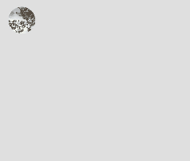
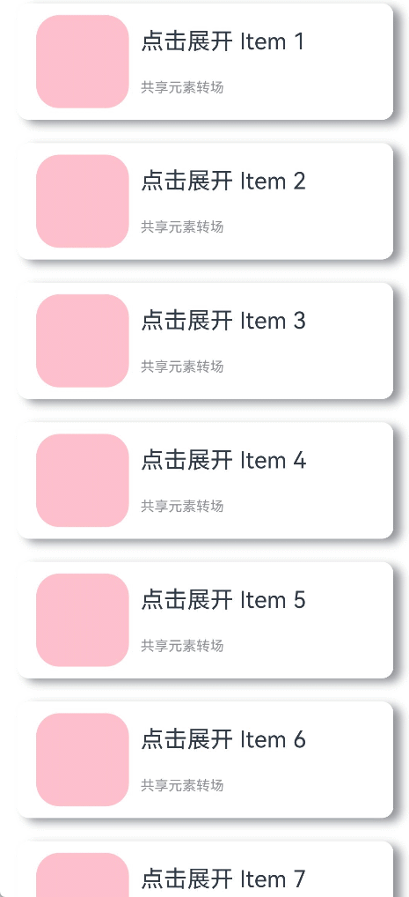
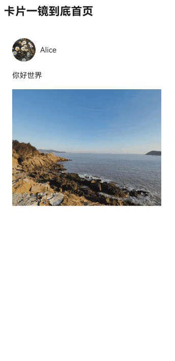
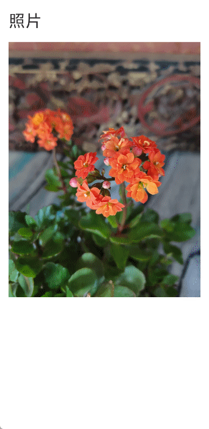
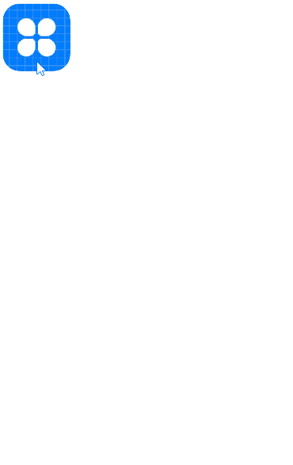
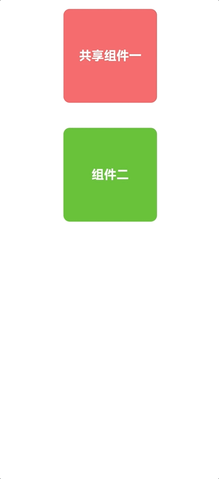

# 共享元素转场 (一镜到底)

共享元素转场是一种界面切换时对相同或者相似的两个元素做的一种位置和大小匹配的过渡动画效果，也称一镜到底动效。

如下例所示，在点击图片后，该图片消失，同时在另一个位置出现新的图片，二者之间内容相同，可以对它们添加一镜到底动效。左图为不添加一镜到底动效的效果，右图为添加一镜到底动效的效果，一镜到底的效果能够让二者的出现消失产生联动，使得内容切换过程显得灵动自然而不生硬。

|
---|---

一镜到底的动效有多种实现方式，在实际开发过程中，应根据具体场景选择合适的方法进行实现。

以下是不同实现方式的对比：

| 一镜到底实现方式 | 特点 | 适用场景 |
| ------ | ---- | ---- |
| 不新建容器直接变化原容器 | 不发生路由跳转，需要在一个组件中实现展开及关闭两种状态的布局，展开后组件层级不变。| 适用于转场开销小的简单场景，如点开页面无需加载大量数据及组件。 |
| 新建容器并跨容器迁移组件 | 通过使用NodeController，将组件从一个容器迁移到另一个容器，在开始迁移时，需要根据前后两个布局的位置大小等信息对组件添加位移及缩放，确保迁移开始时组件能够对齐初始布局，避免出现视觉上的跳变现象。之后再添加动画将位移及缩放等属性复位，实现组件从初始布局到目标布局的一镜到底过渡效果。 | 适用于新建对象开销大的场景，如视频直播组件点击转为全屏等。 |
| 使用geometryTransition共享元素转场 | 利用系统能力，转场前后两个组件调用geometryTransition接口绑定同一id，同时将转场逻辑置于animateTo动画闭包内，这样系统侧会自动为二者添加一镜到底的过渡效果。 | 系统将调整绑定的两个组件的宽高及位置至相同值，并切换二者的透明度，以实现一镜到底过渡效果。因此，为了实现流畅的动画效果，需要确保对绑定geometryTransition的节点添加宽高动画不会有跳变。此方式适用于创建新节点开销小的场景。 |

## 不新建容器并直接变化原容器

该方法不新建容器，通过在已有容器上增删组件触发[transition](../reference/apis-arkui/arkui-ts/ts-transition-animation-component.md)，搭配组件[属性动画](./arkts-attribute-animation-apis.md)实现一镜到底效果。

对于同一个容器展开，容器内兄弟组件消失或者出现的场景，可通过对同一个容器展开前后进行宽高位置变化并配置属性动画，对兄弟组件配置出现消失转场动画实现一镜到底效果。基本步骤为：

1. 构建需要展开的页面，并通过状态变量构建好普通状态和展开状态的界面。

2. 将需要展开的页面展开，通过状态变量控制兄弟组件消失或出现，并通过绑定出现消失转场实现兄弟组件转场效果。

以点击卡片后显示卡片内容详情场景为例：

```ts
class PostData {
  avatar: Resource = $r('app.media.flower');
  name: string = '';
  message: string = '';
  images: Resource[] = [];
}

@Entry
@Component
struct Index {
  @State isExpand: boolean = false;
  @State @Watch('onItemClicked') selectedIndex: number = -1;

  private allPostData: PostData[] = [
    { avatar: $r('app.media.flower'), name: 'Alice', message: '天气晴朗',
      images: [$r('app.media.spring'), $r('app.media.tree')] },
    { avatar: $r('app.media.sky'), name: 'Bob', message: '你好世界',
      images: [$r('app.media.island')] },
    { avatar: $r('app.media.tree'), name: 'Carl', message: '万物生长',
      images: [$r('app.media.flower'), $r('app.media.sky'), $r('app.media.spring')] }];

  private onItemClicked(): void {
    if (this.selectedIndex < 0) {
      return;
    }
    this.getUIContext()?.animateTo({
      duration: 350,
      curve: Curve.Friction
    }, () => {
      this.isExpand = !this.isExpand;
    });
  }

  build() {
    Column({ space: 20 }) {
      ForEach(this.allPostData, (postData: PostData, index: number) => {
        // 当点击了某个post后，会使其余的post消失下树
        if (!this.isExpand || this.selectedIndex === index) {
          Column() {
            Post({ data: postData, selecteIndex: this.selectedIndex, index: index })
          }
          .width('100%')
          // 对出现消失的post添加透明度转场和位移转场效果
          .transition(TransitionEffect.OPACITY
            .combine(TransitionEffect.translate({ y: index < this.selectedIndex ? -250 : 250 }))
            .animation({ duration: 350, curve: Curve.Friction}))
        }
      }, (postData: PostData, index: number) => index.toString())
    }
    .size({ width: '100%', height: '100%' })
    .backgroundColor('#40808080')
  }
}

@Component
export default struct  Post {
  @Link selecteIndex: number;

  @Prop data: PostData;
  @Prop index: number;

  @State itemHeight: number = 250;
  @State isExpand: boolean = false;
  @State expandImageSize: number = 100;
  @State avatarSize: number = 50;

  build() {
    Column({ space: 20 }) {
      Row({ space: 10 }) {
        Image(this.data.avatar)
          .size({ width: this.avatarSize, height: this.avatarSize })
          .borderRadius(this.avatarSize / 2)
          .clip(true)

        Text(this.data.name)
      }
      .justifyContent(FlexAlign.Start)

      Text(this.data.message)

      Row({ space: 15 }) {
        ForEach(this.data.images, (imageResource: Resource, index: number) => {
          Image(imageResource)
            .size({ width: this.expandImageSize, height: this.expandImageSize })
        }, (imageResource: Resource, index: number) => index.toString())
      }

      // 展开态下组件增加的内容
      if (this.isExpand) {
        Column() {
          Text('评论区')
            // 对评论区文本添加出现消失转场效果
            .transition( TransitionEffect.OPACITY
              .animation({ duration: 350, curve: Curve.Friction }))
            .padding({ top: 10 })
        }
        .transition(TransitionEffect.asymmetric(
          TransitionEffect.opacity(0.99)
            .animation({ duration: 350, curve: Curve.Friction }),
          TransitionEffect.OPACITY.animation({ duration: 0 })
        ))
        .size({ width: '100%'})
      }
    }
    .backgroundColor(Color.White)
    .size({ width: '100%', height: this.itemHeight })
    .alignItems(HorizontalAlign.Start)
    .padding({ left: 10, top: 10 })
    .onClick(() => {
      this.selecteIndex = -1;
      this.selecteIndex = this.index;
      this.getUIContext()?.animateTo({
        duration: 350,
        curve: Curve.Friction
      }, () => {
        // 对展开的post做宽高动画，并对头像尺寸和图片尺寸加动画
        this.isExpand = !this.isExpand;
        this.itemHeight = this.isExpand ? 780 : 250;
        this.avatarSize = this.isExpand ? 75: 50;
        this.expandImageSize = (this.isExpand && this.data.images.length > 0)
          ? (360 - (this.data.images.length + 1) * 15) / this.data.images.length : 100;
      })
    })
  }
}
```


## 新建容器并跨容器迁移组件

通过[NodeContainer](../reference/apis-arkui/arkui-ts/ts-basic-components-nodecontainer.md)[自定义占位节点](arkts-user-defined-place-holder.md)，利用[NodeController](../reference/apis-arkui/js-apis-arkui-nodeController.md)实现组件的跨节点迁移，配合属性动画给组件的迁移过程赋予一镜到底效果。这种一镜到底的实现方式可以结合多种转场方式使用，如导航转场（[Navigation](../reference/apis-arkui/arkui-ts/ts-basic-components-navigation.md)）、半模态转场（[bindSheet](../reference/apis-arkui/arkui-ts/ts-universal-attributes-sheet-transition.md#bindsheet)）等。

### 结合Stack使用

可以利用Stack内后定义组件在最上方的特性控制组件在跨节点迁移后位z序最高，以展开收起卡片的场景为例，实现步骤为：

- 展开卡片时，获取节点A的位置信息，将其中的组件迁移到与节点A位置一致的节点B处，节点B的层级高于节点A。

- 对节点B添加属性动画，使之展开并运动到展开后的位置，完成一镜到底的动画效果。

- 收起卡片时，对节点B添加属性动画，使之收起并运动到收起时的位置，即节点A的位置，实现一镜到底的动画效果。

- 在动画结束时利用回调将节点B中的组件迁移回节点A处。

```ts
// Index.ets
import { createPostNode, getPostNode, PostNode } from "../PostNode"
import { componentUtils, curves, UIContext } from '@kit.ArkUI';

@Entry
@Component
struct Index {
  // 新建一镜到底动画类
  private uiContext: UIContext = this.getUIContext();
  @State AnimationProperties: AnimationProperties = new AnimationProperties(this.uiContext);
  private listArray: Array<number> = [1, 2, 3, 4, 5, 6, 7, 8, 9, 10];

  build() {
    // 卡片折叠态，展开态的共同父组件
    Stack() {
      List({ space: 20 }) {
        ForEach(this.listArray, (item: number) => {
          ListItem() {
            // 卡片折叠态
            PostItem({ index: item, AnimationProperties: this.AnimationProperties })
          }
        })
      }
      .clip(false)
      .alignListItem(ListItemAlign.Center)

      if (this.AnimationProperties.isExpandPageShow) {
        // 卡片展开态
        ExpandPage({ AnimationProperties: this.AnimationProperties })
      }
    }
    .key('rootStack')
    .enabled(this.AnimationProperties.isEnabled)
  }
}

@Component
struct PostItem {
  @Prop index: number
  @Link AnimationProperties: AnimationProperties;
  @State nodeController: PostNode | undefined = undefined;
  // 折叠时详细内容隐藏
  private showDetailContent: boolean = false;

  aboutToAppear(): void {
    this.nodeController = createPostNode(this.getUIContext(), this.index.toString(), this.showDetailContent);
    if (this.nodeController != undefined) {
      // 设置回调，当卡片从展开态回到折叠态时触发
      this.nodeController.setCallback(this.resetNode.bind(this));
    }
  }

  resetNode() {
    this.nodeController = getPostNode(this.index.toString());
  }

  build() {
    Stack() {
      NodeContainer(this.nodeController)
    }
    .width('100%')
    .height(100)
    .key(this.index.toString())
    .onClick(() => {
      if (this.nodeController != undefined) {
        // 卡片从折叠态节点下树
        this.nodeController.onRemove();
      }
      // 触发卡片从折叠到展开态的动画
      this.AnimationProperties.expandAnimation(this.index);
    })
  }
}

@Component
struct ExpandPage {
  @Link AnimationProperties: AnimationProperties;
  @State nodeController: PostNode | undefined = undefined;
  // 展开时详细内容出现
  private showDetailContent: boolean = true;

  aboutToAppear(): void {
    // 获取对应序号的卡片组件
    this.nodeController = getPostNode(this.AnimationProperties.curIndex.toString())
    // 更新为详细内容出现
    this.nodeController?.update(this.AnimationProperties.curIndex.toString(), this.showDetailContent)
  }

  build() {
    Stack() {
      NodeContainer(this.nodeController)
    }
    .width('100%')
    .height(this.AnimationProperties.changedHeight ? '100%' : 100)
    .translate({ x: this.AnimationProperties.translateX, y: this.AnimationProperties.translateY })
    .position({ x: this.AnimationProperties.positionX, y: this.AnimationProperties.positionY })
    .onClick(() => {
      this.getUIContext()?.animateTo({ curve: curves.springMotion(0.6, 0.9),
        onFinish: () => {
          if (this.nodeController != undefined) {
            // 执行回调，折叠态节点获取卡片组件
            this.nodeController.callCallback();
            // 当前展开态节点的卡片组件下树
            this.nodeController.onRemove();
          }
          // 卡片展开态节点下树
          this.AnimationProperties.isExpandPageShow = false;
          this.AnimationProperties.isEnabled = true;
        }
      }, () => {
        // 卡片从展开态回到折叠态
        this.AnimationProperties.isEnabled = false;
        this.AnimationProperties.translateX = 0;
        this.AnimationProperties.translateY = 0;
        this.AnimationProperties.changedHeight = false;
        // 更新为详细内容消失
        this.nodeController?.update(this.AnimationProperties.curIndex.toString(), false);
      })
    })
  }
}

class RectInfo {
  left: number = 0;
  top: number = 0;
  right: number = 0;
  bottom: number = 0;
  width: number = 0;
  height: number = 0;
}

// 封装的一镜到底动画类
@Observed
class AnimationProperties {
  public isExpandPageShow: boolean = false;
  // 控制组件是否响应点击事件
  public isEnabled: boolean = true;
  // 展开卡片的序号
  public curIndex: number = -1;
  public translateX: number = 0;
  public translateY: number = 0;
  public positionX: number = 0;
  public positionY: number = 0;
  public changedHeight: boolean = false;
  private calculatedTranslateX: number = 0;
  private calculatedTranslateY: number = 0;
  // 设置卡片展开后相对父组件的位置
  private expandTranslateX: number = 0;
  private expandTranslateY: number = 0;
  private uiContext: UIContext;

  constructor(uiContext: UIContext) {
    this.uiContext = uiContext
  }

  public expandAnimation(index: number): void {
    // 记录展开态卡片的序号
    if (index != undefined) {
      this.curIndex = index;
    }
    // 计算折叠态卡片相对父组件的位置
    this.calculateData(index.toString());
    // 展开态卡片上树
    this.isExpandPageShow = true;
    // 卡片展开的属性动画
    this.uiContext?.animateTo({ curve: curves.springMotion(0.6, 0.9)
    }, () => {
      this.translateX = this.calculatedTranslateX;
      this.translateY = this.calculatedTranslateY;
      this.changedHeight = true;
    })
  }

  // 获取需要跨节点迁移的组件的位置，及迁移前后节点的公共父节点的位置，用以计算做动画组件的动画参数
  public calculateData(key: string): void {
    let clickedImageInfo = this.getRectInfoById(this.uiContext, key);
    let rootStackInfo = this.getRectInfoById(this.uiContext, 'rootStack');
    this.positionX = this.uiContext.px2vp(clickedImageInfo.left - rootStackInfo.left);
    this.positionY = this.uiContext.px2vp(clickedImageInfo.top - rootStackInfo.top);
    this.calculatedTranslateX = this.uiContext.px2vp(rootStackInfo.left - clickedImageInfo.left) + this.expandTranslateX;
    this.calculatedTranslateY = this.uiContext.px2vp(rootStackInfo.top - clickedImageInfo.top) + this.expandTranslateY;
  }

  // 根据组件的id获取组件的位置信息
  private getRectInfoById(context: UIContext, id: string): RectInfo {
    let componentInfo: componentUtils.ComponentInfo = context.getComponentUtils().getRectangleById(id);

    if (!componentInfo) {
      throw Error('object is empty');
    }

    let rstRect: RectInfo = new RectInfo();
    const widthScaleGap = componentInfo.size.width * (1 - componentInfo.scale.x) / 2;
    const heightScaleGap = componentInfo.size.height * (1 - componentInfo.scale.y) / 2;
    rstRect.left = componentInfo.translate.x + componentInfo.windowOffset.x + widthScaleGap;
    rstRect.top = componentInfo.translate.y + componentInfo.windowOffset.y + heightScaleGap;
    rstRect.right =
    componentInfo.translate.x + componentInfo.windowOffset.x + componentInfo.size.width - widthScaleGap;
    rstRect.bottom =
    componentInfo.translate.y + componentInfo.windowOffset.y + componentInfo.size.height - heightScaleGap;
    rstRect.width = rstRect.right - rstRect.left;
    rstRect.height = rstRect.bottom - rstRect.top;

    return {
      left: rstRect.left,
      right: rstRect.right,
      top: rstRect.top,
      bottom: rstRect.bottom,
      width: rstRect.width,
      height: rstRect.height
    }
  }
}
```

```ts
// PostNode.ets
// 跨容器迁移能力
import { UIContext } from '@ohos.arkui.UIContext';
import { NodeController, BuilderNode, FrameNode } from '@ohos.arkui.node';
import { curves } from '@kit.ArkUI';

class Data {
  item: string | null = null
  isExpand: Boolean | false = false
}

@Builder
function PostBuilder(data: Data) {
  // 跨容器迁移组件置于@Builder内
  Column() {
      Row() {
        Row()
          .backgroundColor(Color.Pink)
          .borderRadius(20)
          .width(80)
          .height(80)

        Column() {
          Text('点击展开 Item ' + data.item)
            .fontSize(20)
          Text('共享元素转场')
            .fontSize(12)
            .fontColor(0x909399)
        }
        .alignItems(HorizontalAlign.Start)
        .justifyContent(FlexAlign.SpaceAround)
        .margin({ left: 10 })
        .height(80)
      }
      .width('90%')
      .height(100)
      // 展开后显示细节内容
      if (data.isExpand) {
        Row() {
          Text('展开态')
            .fontSize(28)
            .fontColor(0x909399)
            .textAlign(TextAlign.Center)
            .transition(TransitionEffect.OPACITY.animation({ curve: curves.springMotion(0.6, 0.9) }))
        }
        .width('90%')
        .justifyContent(FlexAlign.Center)
      }
    }
    .width('90%')
    .height('100%')
    .alignItems(HorizontalAlign.Center)
    .borderRadius(10)
    .margin({ top: 15 })
    .backgroundColor(Color.White)
    .shadow({
      radius: 20,
      color: 0x909399,
      offsetX: 20,
      offsetY: 10
    })

}

class __InternalValue__{
  flag:boolean =false;
};

export class PostNode extends NodeController {
  private node: BuilderNode<Data[]> | null = null;
  private isRemove: __InternalValue__ = new __InternalValue__();
  private callback: Function | undefined = undefined
  private data: Data | null = null

  makeNode(uiContext: UIContext): FrameNode | null {
    if(this.isRemove.flag == true){
      return null;
    }
    if (this.node != null) {
      return this.node.getFrameNode();
    }

    return null;
  }

  init(uiContext: UIContext, id: string, isExpand: boolean) {
    if (this.node != null) {
      return;
    }
    // 创建节点，需要uiContext
    this.node = new BuilderNode(uiContext)
    // 创建离线组件
    this.data = { item: id, isExpand: isExpand }
    this.node.build(wrapBuilder<Data[]>(PostBuilder), this.data)
  }

  update(id: string, isExpand: boolean) {
    if (this.node !== null) {
      // 调用update进行更新。
      this.data = { item: id, isExpand: isExpand }
      this.node.update(this.data);
    }
  }

  setCallback(callback: Function | undefined) {
    this.callback = callback
  }

  callCallback() {
    if (this.callback != undefined) {
      this.callback();
    }
  }

  onRemove(){
    this.isRemove.flag = true;
    // 组件迁移出节点时触发重建
    this.rebuild();
    this.isRemove.flag = false;
  }
}

let gNodeMap: Map<string, PostNode | undefined> = new Map();

export const createPostNode =
  (uiContext: UIContext, id: string, isExpand: boolean): PostNode | undefined => {
    let node = new PostNode();
    node.init(uiContext, id, isExpand);
    gNodeMap.set(id, node);
    return node;
  }

export const getPostNode = (id: string): PostNode | undefined => {
  if (!gNodeMap.has(id)) {
    return undefined
  }
  return gNodeMap.get(id);
}

export const deleteNode = (id: string) => {
  gNodeMap.delete(id)
}
```



### 结合Navigation使用

可以利用[Navigation](../reference/apis-arkui/arkui-ts/ts-basic-components-navigation.md)的自定义导航转场动画能力（[customNavContentTransition](../reference/apis-arkui/arkui-ts/ts-basic-components-navigation.md#customnavcontenttransition11)，可参考Navigation[示例3](../reference/apis-arkui/arkui-ts/ts-basic-components-navigation.md#示例3)）实现一镜到底动效。共享元素转场期间，组件由消失页面迁移至出现页面。

以展开收起缩略图的场景为例，实现步骤为：

- 通过customNavContentTransition配置PageOne与PageTwo的自定义导航转场动画。

- 自定义的共享元素转场效果由属性动画实现，具体实现方式为抓取页面内组件相对窗口的位置信息从而正确匹配组件在PageOne与PageTwo的位置、缩放等，即动画开始和结束的属性信息。

- 点击缩略图后共享元素组件从PageOne被迁移至PageTwo，随后触发由PageOne至PageTwo的自定义转场动画，即PageTwo的共享元素组件从原来的缩略图状态做动画到全屏状态。

- 由全屏状态返回到缩略图时，触发由PageTwo至PageOne的自定义转场动画，即PageTwo的共享元素组件从全屏状态做动画到原PageOne的缩略图状态，转场结束后共享元素组件从PageTwo被迁移回PageOne。

```
├──entry/src/main/ets                 // 代码区
│  ├──CustomTransition
│  │  ├──AnimationProperties.ets      // 一镜到底转场动画封装
│  │  └──CustomNavigationUtils.ets    // Navigation自定义转场动画配置
│  ├──entryability
│  │  └──EntryAbility.ets             // 程序入口类
│  ├──NodeContainer
│  │  └──CustomComponent.ets          // 自定义占位节点
│  ├──pages
│  │  ├──Index.ets                    // 导航页面
│  │  ├──PageOne.ets                  // 缩略图页面
│  │  └──PageTwo.ets                  // 全屏展开页面
│  └──utils
│     ├──ComponentAttrUtils.ets       // 组件位置获取
│     └──WindowUtils.ets              // 窗口信息
└──entry/src/main/resources           // 资源文件
```

```ts
// Index.ets
import { AnimateCallback, CustomTransition } from '../CustomTransition/CustomNavigationUtils';

const TAG: string = 'Index';

@Entry
@Component
struct Index {
  private pageInfos: NavPathStack = new NavPathStack();
  // 允许进行自定义转场的页面名称
  private allowedCustomTransitionFromPageName: string[] = ['PageOne'];
  private allowedCustomTransitionToPageName: string[] = ['PageTwo'];

  aboutToAppear(): void {
    this.pageInfos.pushPath({ name: 'PageOne' });
  }

  private isCustomTransitionEnabled(fromName: string, toName: string): boolean {
    // 点击和返回均需要进行自定义转场，因此需要分别判断
    if ((this.allowedCustomTransitionFromPageName.includes(fromName)
      && this.allowedCustomTransitionToPageName.includes(toName))
      || (this.allowedCustomTransitionFromPageName.includes(toName)
        && this.allowedCustomTransitionToPageName.includes(fromName))) {
      return true;
    }
    return false;
  }

  build() {
    Navigation(this.pageInfos)
      .hideNavBar(true)
      .customNavContentTransition((from: NavContentInfo, to: NavContentInfo, operation: NavigationOperation) => {
        if ((!from || !to) || (!from.name || !to.name)) {
          return undefined;
        }

        // 通过from和to的name对自定义转场路由进行管控
        if (!this.isCustomTransitionEnabled(from.name, to.name)) {
          return undefined;
        }

        // 需要对转场页面是否注册了animation进行判断，来决定是否进行自定义转场
        let fromParam: AnimateCallback = CustomTransition.getInstance().getAnimateParam(from.index);
        let toParam: AnimateCallback = CustomTransition.getInstance().getAnimateParam(to.index);
        if (!fromParam.animation || !toParam.animation) {
          return undefined;
        }

        // 一切判断完成后，构造customAnimation给系统侧调用，执行自定义转场动画
        let customAnimation: NavigationAnimatedTransition = {
          onTransitionEnd: (isSuccess: boolean) => {
            console.log(TAG, `current transition result is ${isSuccess}`);
          },
          timeout: 2000,
          transition: (transitionProxy: NavigationTransitionProxy) => {
            console.log(TAG, 'trigger transition callback');
            if (fromParam.animation) {
              fromParam.animation(operation == NavigationOperation.PUSH, true, transitionProxy);
            }
            if (toParam.animation) {
              toParam.animation(operation == NavigationOperation.PUSH, false, transitionProxy);
            }
          }
        };
        return customAnimation;
      })
  }
}
```

```ts
// PageOne.ets
import { CustomTransition } from '../CustomTransition/CustomNavigationUtils';
import { MyNodeController, createMyNode, getMyNode } from '../NodeContainer/CustomComponent';
import { ComponentAttrUtils, RectInfoInPx } from '../utils/ComponentAttrUtils';
import { WindowUtils } from '../utils/WindowUtils';

@Builder
export function PageOneBuilder() {
  PageOne();
}

@Component
export struct PageOne {
  private pageInfos: NavPathStack = new NavPathStack();
  private pageId: number = -1;
  @State myNodeController: MyNodeController | undefined = new MyNodeController(false);

  aboutToAppear(): void {
    let node = getMyNode();
    if (node == undefined) {
      // 新建自定义节点
      createMyNode(this.getUIContext());
    }
    this.myNodeController = getMyNode();
  }

  private doFinishTransition(): void {
    // PageTwo结束转场时将节点从PageTwo迁移回PageOne
    this.myNodeController = getMyNode();
  }

  private registerCustomTransition(): void {
    // 注册自定义动画协议
    CustomTransition.getInstance().registerNavParam(this.pageId,
      (isPush: boolean, isExit: boolean, transitionProxy: NavigationTransitionProxy) => {}, 500);
  }

  private onCardClicked(): void {
    let cardItemInfo: RectInfoInPx =
      ComponentAttrUtils.getRectInfoById(WindowUtils.window.getUIContext(), 'card');
    let param: Record<string, Object> = {};
    param['cardItemInfo'] = cardItemInfo;
    param['doDefaultTransition'] = (myController: MyNodeController) => {
      this.doFinishTransition()
    };
    this.pageInfos.pushPath({ name: 'PageTwo', param: param });
    // 自定义节点从PageOne下树
    if (this.myNodeController != undefined) {
      (this.myNodeController as MyNodeController).onRemove();
    }
  }

  build() {
    NavDestination() {
      Stack() {
        Column({ space: 20 }) {
          Row({ space: 10 }) {
            Image($r("app.media.avatar"))
              .size({ width: 50, height: 50 })
              .borderRadius(25)
              .clip(true)

            Text('Alice')
          }
          .justifyContent(FlexAlign.Start)

          Text('你好世界')

          NodeContainer(this.myNodeController)
            .size({ width: 320, height: 250 })
            .onClick(() => {
              this.onCardClicked()
            })
        }
        .alignItems(HorizontalAlign.Start)
        .margin(30)
      }
    }
    .onReady((context: NavDestinationContext) => {
      this.pageInfos = context.pathStack;
      this.pageId = this.pageInfos.getAllPathName().length - 1;
      this.registerCustomTransition();
    })
    .onDisAppear(() => {
      CustomTransition.getInstance().unRegisterNavParam(this.pageId);
      // 自定义节点从PageOne下树
      if (this.myNodeController != undefined) {
        (this.myNodeController as MyNodeController).onRemove();
      }
    })
  }
}
```

```ts
// PageTwo.ets
import { CustomTransition } from '../CustomTransition/CustomNavigationUtils';
import { AnimationProperties } from '../CustomTransition/AnimationProperties';
import { RectInfoInPx } from '../utils/ComponentAttrUtils';
import { getMyNode, MyNodeController } from '../NodeContainer/CustomComponent';

@Builder
export function PageTwoBuilder() {
  PageTwo();
}

@Component
export struct PageTwo {
  @State pageInfos: NavPathStack = new NavPathStack();
  @State AnimationProperties: AnimationProperties = new AnimationProperties();
  @State myNodeController: MyNodeController | undefined = new MyNodeController(false);

  private pageId: number = -1;

  private shouldDoDefaultTransition: boolean = false;
  private prePageDoFinishTransition: () => void = () => {};
  private cardItemInfo: RectInfoInPx = new RectInfoInPx();

  @StorageProp('windowSizeChanged') @Watch('unRegisterNavParam') windowSizeChangedTime: number = 0;
  @StorageProp('onConfigurationUpdate') @Watch('unRegisterNavParam') onConfigurationUpdateTime: number = 0;

  aboutToAppear(): void {
    // 迁移自定义节点至当前页面
    this.myNodeController = getMyNode();
  }

  private unRegisterNavParam(): void {
    this.shouldDoDefaultTransition = true;
  }

  private onBackPressed(): boolean {
    if (this.shouldDoDefaultTransition) {
      CustomTransition.getInstance().unRegisterNavParam(this.pageId);
      this.pageInfos.pop();
      this.prePageDoFinishTransition();
      this.shouldDoDefaultTransition = false;
      return true;
    }
    this.pageInfos.pop();
    return true;
  }

  build() {
    NavDestination() {
      // Stack需要设置alignContent为TopStart，否则在高度变化过程中，截图和内容都会随高度重新布局位置
      Stack({ alignContent: Alignment.TopStart }) {
        Stack({ alignContent: Alignment.TopStart }) {
          Column({space: 20}) {
            NodeContainer(this.myNodeController)
            if (this.AnimationProperties.showDetailContent)
              Text('展开态内容')
                .fontSize(20)
                .transition(TransitionEffect.OPACITY)
                .margin(30)
          }
          .alignItems(HorizontalAlign.Start)
        }
        .position({ y: this.AnimationProperties.positionValue })
      }
      .scale({ x: this.AnimationProperties.scaleValue, y: this.AnimationProperties.scaleValue })
      .translate({ x: this.AnimationProperties.translateX, y: this.AnimationProperties.translateY })
      .width(this.AnimationProperties.clipWidth)
      .height(this.AnimationProperties.clipHeight)
      .borderRadius(this.AnimationProperties.radius)
      // expandSafeArea使得Stack做沉浸式效果，向上扩到状态栏，向下扩到导航条
      .expandSafeArea([SafeAreaType.SYSTEM])
      // 对高度进行裁切
      .clip(true)
    }
    .backgroundColor(this.AnimationProperties.navDestinationBgColor)
    .hideTitleBar(true)
    .onReady((context: NavDestinationContext) => {
      this.pageInfos = context.pathStack;
      this.pageId = this.pageInfos.getAllPathName().length - 1;
      let param = context.pathInfo?.param as Record<string, Object>;
      this.prePageDoFinishTransition = param['doDefaultTransition'] as () => void;
      this.cardItemInfo = param['cardItemInfo'] as RectInfoInPx;
      CustomTransition.getInstance().registerNavParam(this.pageId,
        (isPush: boolean, isExit: boolean, transitionProxy: NavigationTransitionProxy) => {
          this.AnimationProperties.doAnimation(
            this.cardItemInfo, isPush, isExit, transitionProxy, 0,
            this.prePageDoFinishTransition, this.myNodeController);
        }, 500);
    })
    .onBackPressed(() => {
      return this.onBackPressed();
    })
    .onDisAppear(() => {
      CustomTransition.getInstance().unRegisterNavParam(this.pageId);
    })
  }
}
```

```ts
// CustomNavigationUtils.ets
// 配置Navigation自定义转场动画
export interface AnimateCallback {
  animation: ((isPush: boolean, isExit: boolean, transitionProxy: NavigationTransitionProxy) => void | undefined)
    | undefined;
  timeout: (number | undefined) | undefined;
}

const customTransitionMap: Map<number, AnimateCallback> = new Map();

export class CustomTransition {
  private constructor() {};

  static delegate = new CustomTransition();

  static getInstance() {
    return CustomTransition.delegate;
  }

  // 注册页面的动画回调，name是注册页面的动画的回调
  // animationCallback是需要执行的动画内容，timeout是转场结束的超时时间
  registerNavParam(
    name: number,
    animationCallback: (operation: boolean, isExit: boolean, transitionProxy: NavigationTransitionProxy) => void,
    timeout: number): void {
    if (customTransitionMap.has(name)) {
      let param = customTransitionMap.get(name);
      if (param != undefined) {
        param.animation = animationCallback;
        param.timeout = timeout;
        return;
      }
    }
    let params: AnimateCallback = { timeout: timeout, animation: animationCallback };
    customTransitionMap.set(name, params);
  }

  unRegisterNavParam(name: number): void {
    customTransitionMap.delete(name);
  }

  getAnimateParam(name: number): AnimateCallback {
    let result: AnimateCallback = {
      animation: customTransitionMap.get(name)?.animation,
      timeout: customTransitionMap.get(name)?.timeout,
    };
    return result;
  }
}
```

```ts
// 工程配置文件module.json5中配置 {"routerMap": "$profile:route_map"}
// route_map.json
{
  "routerMap": [
    {
      "name": "PageOne",
      "pageSourceFile": "src/main/ets/pages/PageOne.ets",
      "buildFunction": "PageOneBuilder"
    },
    {
      "name": "PageTwo",
      "pageSourceFile": "src/main/ets/pages/PageTwo.ets",
      "buildFunction": "PageTwoBuilder"
    }
  ]
}
```

```ts
// AnimationProperties.ets
// 一镜到底转场动画封装
import { curves, UIContext } from '@kit.ArkUI';
import { RectInfoInPx } from '../utils/ComponentAttrUtils';
import { WindowUtils } from '../utils/WindowUtils';
import { MyNodeController } from '../NodeContainer/CustomComponent';

const TAG: string = 'AnimationProperties';

const DEVICE_BORDER_RADIUS: number = 34;

// 将自定义一镜到底转场动画进行封装，其他界面也需要做自定义一镜到底转场的话，可以直接复用，减少工作量
@Observed
export class AnimationProperties {
  public navDestinationBgColor: ResourceColor = Color.Transparent;
  public translateX: number = 0;
  public translateY: number = 0;
  public scaleValue: number = 1;
  public clipWidth: Dimension = 0;
  public clipHeight: Dimension = 0;
  public radius: number = 0;
  public positionValue: number = 0;
  public showDetailContent: boolean = false;
  private uiContext: UIContext;

  constructor(uiContext: UIContext) {
    this.uiContext = uiContext
  }

  public doAnimation(cardItemInfo_px: RectInfoInPx, isPush: boolean, isExit: boolean,
                     transitionProxy: NavigationTransitionProxy, extraTranslateValue: number, prePageOnFinish: (index: MyNodeController) => void, myNodeController: MyNodeController | undefined): void {
    // 首先计算卡片的宽高与窗口宽高的比例
    let widthScaleRatio = cardItemInfo_px.width / WindowUtils.windowWidth_px;
    let heightScaleRatio = cardItemInfo_px.height / WindowUtils.windowHeight_px;
    let isUseWidthScale = widthScaleRatio > heightScaleRatio;
    let initScale: number = isUseWidthScale ? widthScaleRatio : heightScaleRatio;

    let initTranslateX: number = 0;
    let initTranslateY: number = 0;
    let initClipWidth: Dimension = 0;
    let initClipHeight: Dimension = 0;
    // 使得PageTwo卡片向上扩到状态栏
    let initPositionValue: number = -this.uiContext.px2vp(WindowUtils.topAvoidAreaHeight_px + extraTranslateValue);

    if (isUseWidthScale) {
      initTranslateX = this.uiContext.px2vp(cardItemInfo_px.left - (WindowUtils.windowWidth_px - cardItemInfo_px.width) / 2);
      initClipWidth = '100%';
      initClipHeight = this.uiContext.px2vp((cardItemInfo_px.height) / initScale);
      initTranslateY = this.uiContext.px2vp(cardItemInfo_px.top - ((vp2px(initClipHeight) - vp2px(initClipHeight) * initScale) / 2));
    } else {
      initTranslateY = this.uiContext.px2vp(cardItemInfo_px.top - (WindowUtils.windowHeight_px - cardItemInfo_px.height) / 2);
      initClipHeight = '100%';
      initClipWidth = this.uiContext.px2vp((cardItemInfo_px.width) / initScale);
      initTranslateX = this.uiContext.px2vp(cardItemInfo_px.left - (WindowUtils.windowWidth_px / 2 - cardItemInfo_px.width / 2));
    }

    // 转场动画开始前通过计算scale、translate、position和clip height & width，确定节点迁移前后位置一致
    console.log(TAG, 'initScale: ' + initScale + ' initTranslateX ' + initTranslateX +
    ' initTranslateY ' + initTranslateY + ' initClipWidth ' + initClipWidth +
    ' initClipHeight ' + initClipHeight + ' initPositionValue ' + initPositionValue);
    // 转场至新页面
    if (isPush && !isExit) {
      this.scaleValue = initScale;
      this.translateX = initTranslateX;
      this.clipWidth = initClipWidth;
      this.clipHeight = initClipHeight;
      this.translateY = initTranslateY;
      this.positionValue = initPositionValue;

      this.uiContext?.animateTo({
        curve: curves.interpolatingSpring(0, 1, 328, 36),
        onFinish: () => {
          if (transitionProxy) {
            transitionProxy.finishTransition();
          }
        }
      }, () => {
        this.scaleValue = 1.0;
        this.translateX = 0;
        this.translateY = 0;
        this.clipWidth = '100%';
        this.clipHeight = '100%';
        // 页面圆角与系统圆角一致
        this.radius = DEVICE_BORDER_RADIUS;
        this.showDetailContent = true;
      })

      this.uiContext?.animateTo({
        duration: 100,
        curve: Curve.Sharp,
      }, () => {
        // 页面由透明逐渐变为设置背景色
        this.navDestinationBgColor = '#00ffffff';
      })

      // 返回旧页面
    } else if (!isPush && isExit) {

      this.uiContext?.animateTo({
        duration: 350,
        curve: Curve.EaseInOut,
        onFinish: () => {
          if (transitionProxy) {
            transitionProxy.finishTransition();
          }
          prePageOnFinish(myNodeController);
          // 自定义节点从PageTwo下树
          if (myNodeController != undefined) {
            (myNodeController as MyNodeController).onRemove();
          }
        }
      }, () => {
        this.scaleValue = initScale;
        this.translateX = initTranslateX;
        this.translateY = initTranslateY;
        this.radius = 0;
        this.clipWidth = initClipWidth;
        this.clipHeight = initClipHeight;
        this.showDetailContent = false;
      })

      this.uiContext?.animateTo({
        duration: 200,
        delay: 150,
        curve: Curve.Friction,
      }, () => {
        this.navDestinationBgColor = Color.Transparent;
      })
    }
  }
}
```

```ts
// ComponentAttrUtils.ets
// 获取组件相对窗口的位置
import { componentUtils, UIContext } from '@kit.ArkUI';
import { JSON } from '@kit.ArkTS';

export class ComponentAttrUtils {
  // 根据组件的id获取组件的位置信息
  public static getRectInfoById(context: UIContext, id: string): RectInfoInPx {
    if (!context || !id) {
      throw Error('object is empty');
    }
    let componentInfo: componentUtils.ComponentInfo = context.getComponentUtils().getRectangleById(id);

    if (!componentInfo) {
      throw Error('object is empty');
    }

    let rstRect: RectInfoInPx = new RectInfoInPx();
    const widthScaleGap = componentInfo.size.width * (1 - componentInfo.scale.x) / 2;
    const heightScaleGap = componentInfo.size.height * (1 - componentInfo.scale.y) / 2;
    rstRect.left = componentInfo.translate.x + componentInfo.windowOffset.x + widthScaleGap;
    rstRect.top = componentInfo.translate.y + componentInfo.windowOffset.y + heightScaleGap;
    rstRect.right =
      componentInfo.translate.x + componentInfo.windowOffset.x + componentInfo.size.width - widthScaleGap;
    rstRect.bottom =
      componentInfo.translate.y + componentInfo.windowOffset.y + componentInfo.size.height - heightScaleGap;
    rstRect.width = rstRect.right - rstRect.left;
    rstRect.height = rstRect.bottom - rstRect.top;
    return {
      left: rstRect.left,
      right: rstRect.right,
      top: rstRect.top,
      bottom: rstRect.bottom,
      width: rstRect.width,
      height: rstRect.height
    }
  }
}

export class RectInfoInPx {
  left: number = 0;
  top: number = 0;
  right: number = 0;
  bottom: number = 0;
  width: number = 0;
  height: number = 0;
}

export class RectJson {
  $rect: Array<number> = [];
}
```

```ts
// WindowUtils.ets
// 窗口信息
import { window } from '@kit.ArkUI';

export class WindowUtils {
  public static window: window.Window;
  public static windowWidth_px: number;
  public static windowHeight_px: number;
  public static topAvoidAreaHeight_px: number;
  public static navigationIndicatorHeight_px: number;
}
```

```ts
// EntryAbility.ets
// 程序入口处的onWindowStageCreate增加对窗口宽高等的抓取

import { AbilityConstant, UIAbility, Want } from '@kit.AbilityKit';
import { hilog } from '@kit.PerformanceAnalysisKit';
import { display, window } from '@kit.ArkUI';
import { WindowUtils } from '../utils/WindowUtils';

const TAG: string = 'EntryAbility';

export default class EntryAbility extends UIAbility {
  private currentBreakPoint: string = '';

  onCreate(want: Want, launchParam: AbilityConstant.LaunchParam): void {
    hilog.info(0x0000, 'testTag', '%{public}s', 'Ability onCreate');
  }

  onDestroy(): void {
    hilog.info(0x0000, 'testTag', '%{public}s', 'Ability onDestroy');
  }

  onWindowStageCreate(windowStage: window.WindowStage): void {
    // Main window is created, set main page for this ability
    hilog.info(0x0000, 'testTag', '%{public}s', 'Ability onWindowStageCreate');

    // 获取窗口宽高
    WindowUtils.window = windowStage.getMainWindowSync();
    WindowUtils.windowWidth_px = WindowUtils.window.getWindowProperties().windowRect.width;
    WindowUtils.windowHeight_px = WindowUtils.window.getWindowProperties().windowRect.height;

    this.updateBreakpoint(WindowUtils.windowWidth_px);

    // 获取上方避让区(状态栏等)高度
    let avoidArea = WindowUtils.window.getWindowAvoidArea(window.AvoidAreaType.TYPE_SYSTEM);
    WindowUtils.topAvoidAreaHeight_px = avoidArea.topRect.height;

    // 获取导航条高度
    let navigationArea = WindowUtils.window.getWindowAvoidArea(window.AvoidAreaType.TYPE_NAVIGATION_INDICATOR);
    WindowUtils.navigationIndicatorHeight_px = navigationArea.bottomRect.height;

    console.log(TAG, 'the width is ' + WindowUtils.windowWidth_px + '  ' + WindowUtils.windowHeight_px + '  ' +
    WindowUtils.topAvoidAreaHeight_px + '  ' + WindowUtils.navigationIndicatorHeight_px);

    // 监听窗口尺寸、状态栏高度及导航条高度的变化并更新
    try {
      WindowUtils.window.on('windowSizeChange', (data) => {
        console.log(TAG, 'on windowSizeChange, the width is ' + data.width + ', the height is ' + data.height);
        WindowUtils.windowWidth_px = data.width;
        WindowUtils.windowHeight_px = data.height;
        this.updateBreakpoint(data.width);
        AppStorage.setOrCreate('windowSizeChanged', Date.now())
      })

      WindowUtils.window.on('avoidAreaChange', (data) => {
        if (data.type == window.AvoidAreaType.TYPE_SYSTEM) {
          let topRectHeight = data.area.topRect.height;
          console.log(TAG, 'on avoidAreaChange, the top avoid area height is ' + topRectHeight);
          WindowUtils.topAvoidAreaHeight_px = topRectHeight;
        } else if (data.type == window.AvoidAreaType.TYPE_NAVIGATION_INDICATOR) {
          let bottomRectHeight = data.area.bottomRect.height;
          console.log(TAG, 'on avoidAreaChange, the navigation indicator height is ' + bottomRectHeight);
          WindowUtils.navigationIndicatorHeight_px = bottomRectHeight;
        }
      })
    } catch (exception) {
      console.log('register failed ' + JSON.stringify(exception));
    }

    windowStage.loadContent('pages/Index', (err) => {
      if (err.code) {
        hilog.error(0x0000, 'testTag', 'Failed to load the content. Cause: %{public}s', JSON.stringify(err) ?? '');
        return;
      }
      hilog.info(0x0000, 'testTag', 'Succeeded in loading the content.');
    });
  }

  updateBreakpoint(width: number) {
    let windowWidthVp = width / (display.getDefaultDisplaySync().densityDPI / 160);
    let newBreakPoint: string = '';
    if (windowWidthVp < 400) {
      newBreakPoint = 'xs';
    } else if (windowWidthVp < 600) {
      newBreakPoint = 'sm';
    } else if (windowWidthVp < 800) {
      newBreakPoint = 'md';
    } else {
      newBreakPoint = 'lg';
    }
    if (this.currentBreakPoint !== newBreakPoint) {
      this.currentBreakPoint = newBreakPoint;
      // 使用状态变量记录当前断点值
      AppStorage.setOrCreate('currentBreakpoint', this.currentBreakPoint);
    }
  }

  onWindowStageDestroy(): void {
    // Main window is destroyed, release UI related resources
    hilog.info(0x0000, 'testTag', '%{public}s', 'Ability onWindowStageDestroy');
  }

  onForeground(): void {
    // Ability has brought to foreground
    hilog.info(0x0000, 'testTag', '%{public}s', 'Ability onForeground');
  }

  onBackground(): void {
    // Ability has back to background
    hilog.info(0x0000, 'testTag', '%{public}s', 'Ability onBackground');
  }
}
```

```ts
// CustomComponent.ets
// 自定义占位节点，跨容器迁移能力
import { BuilderNode, FrameNode, NodeController } from '@kit.ArkUI';

@Builder
function CardBuilder() {
  Image($r("app.media.card"))
    .width('100%')
    .id('card')
}

export class MyNodeController extends NodeController {
  private CardNode: BuilderNode<[]> | null = null;
  private wrapBuilder: WrappedBuilder<[]> = wrapBuilder(CardBuilder);
  private needCreate: boolean = false;
  private isRemove: boolean = false;

  constructor(create: boolean) {
    super();
    this.needCreate = create;
  }

  makeNode(uiContext: UIContext): FrameNode | null {
    if(this.isRemove == true){
      return null;
    }
    if (this.needCreate && this.CardNode == null) {
      this.CardNode = new BuilderNode(uiContext);
      this.CardNode.build(this.wrapBuilder)
    }
    if (this.CardNode == null) {
      return null;
    }
    return this.CardNode!.getFrameNode()!;
  }

  getNode(): BuilderNode<[]> | null {
    return this.CardNode;
  }

  setNode(node: BuilderNode<[]> | null) {
    this.CardNode = node;
    this.rebuild();
  }

  onRemove() {
    this.isRemove = true;
    this.rebuild();
    this.isRemove = false;
  }

  init(uiContext: UIContext) {
    this.CardNode = new BuilderNode(uiContext);
    this.CardNode.build(this.wrapBuilder)
  }
}

let myNode: MyNodeController | undefined;

export const createMyNode =
  (uiContext: UIContext) => {
    myNode = new MyNodeController(false);
    myNode.init(uiContext);
  }

export const getMyNode = (): MyNodeController | undefined => {
  return myNode;
}
```



### 结合BindSheet使用

想实现半模态转场（[bindSheet](../reference/apis-arkui/arkui-ts/ts-universal-attributes-sheet-transition.md#bindsheet)）的同时，组件从初始界面做一镜到底动画到半模态页面的效果，可以使用这样的设计思路。将[SheetOptions](../reference/apis-arkui/arkui-ts/ts-universal-attributes-sheet-transition.md#sheetoptions)中的mode设置为SheetMode.EMBEDDED，该模式下新起的页面可以覆盖在半模态弹窗上，页面返回后该半模态依旧存在，半模态面板内容不丢失。在半模态转场的同时设置一全模态转场（[bindContentCover](../reference/apis-arkui/arkui-ts/ts-universal-attributes-modal-transition.md#bindcontentcover)）页面无转场出现，该页面仅有需要做共享元素转场的组件，通过属性动画，展示组件从初始界面至半模态页面的一镜到底动效，并在动画结束时关闭页面，并将该组件迁移至半模态页面。

以点击图片展开半模态页的场景为例，实现步骤为：

- 在初始界面挂载半模态转场和全模态转场两个页面，半模态页按需布局，全模态页面仅放置一镜到底动效需要的组件，抓取布局信息，使其初始位置为初始界面图片的位置。点击初始界面图片时，同时触发半模态和全模态页面出现，因设置为SheetMode.EMBEDDED模式，此时全模态页面层级最高。

- 设置不可见的占位图片置于半模态页上，作为一镜到底动效结束时图片的终止位置。利用[布局回调](../reference/apis-arkui/js-apis-arkui-inspector.md)监听该占位图片布局完成的时候，此时执行回调抓取占位图片的位置信息，随后全模态页面上的图片利用属性动画开始进行共享元素转场。

- 全模态页面的动画结束时触发结束回调，关闭全模态页面，将共享元素图片的节点迁移至半模态页面，替换占位图片。

- 需注意，半模态页面的弹起高度不同，其页面起始位置也有所不同，而全模态则是全屏显示，两者存在一高度差，做一镜到底动画时，需要计算差值并进行修正，具体可见demo。

- 还可以配合一镜到底动画，给初始界面图片也增加一个从透明到出现的动画，使得动效更为流畅。

```
├──entry/src/main/ets                 // 代码区
│  ├──entryability
│  │  └──EntryAbility.ets             // 程序入口类
│  ├──NodeContainer
│  │  └──CustomComponent.ets          // 自定义占位节点
│  ├──pages
│  │  └──Index.ets                    // 进行共享元素转场的主页面
│  └──utils
│     ├──ComponentAttrUtils.ets       // 组件位置获取
│     └──WindowUtils.ets              // 窗口信息
└──entry/src/main/resources           // 资源文件
```

```ts
// index.ets
import { MyNodeController, createMyNode, getMyNode } from '../NodeContainer/CustomComponent';
import { ComponentAttrUtils, RectInfoInPx } from '../utils/ComponentAttrUtils';
import { WindowUtils } from '../utils/WindowUtils';
import { inspector } from '@kit.ArkUI'

class AnimationInfo {
  scale: number = 0;
  translateX: number = 0;
  translateY: number = 0;
  clipWidth: Dimension = 0;
  clipHeight: Dimension = 0;
}

@Entry
@Component
struct Index {
  @State isShowSheet: boolean = false;
  @State isShowImage: boolean = false;
  @State isShowOverlay: boolean = false;
  @State isAnimating: boolean = false;
  @State isEnabled: boolean = true;

  @State scaleValue: number = 0;
  @State translateX: number = 0;
  @State translateY: number = 0;
  @State clipWidth: Dimension = 0;
  @State clipHeight: Dimension = 0;
  @State radius: number = 0;
  // 原图的透明度
  @State opacityDegree: number = 1;

  // 抓取照片原位置信息
  private originInfo: AnimationInfo = new AnimationInfo;
  // 抓取照片在半模态页上位置信息
  private targetInfo: AnimationInfo = new AnimationInfo;
  // 半模态高度
  private bindSheetHeight: number = 450;
  // 半模态上图片圆角
  private sheetRadius: number = 20;

  // 设置半模态上图片的布局监听
  listener:inspector.ComponentObserver = this.getUIContext().getUIInspector().createComponentObserver('target');
  aboutToAppear(): void {
    // 设置半模态上图片的布局完成回调
    let onLayoutComplete:()=>void=():void=>{
      // 目标图片布局完成时抓取布局信息
      this.targetInfo = this.calculateData('target');
      // 仅半模态正确布局且此时无动画时触发一镜到底动画
      if (this.targetInfo.scale != 0 && this.targetInfo.clipWidth != 0 && this.targetInfo.clipHeight != 0 && !this.isAnimating) {
        this.isAnimating = true;
        // 用于一镜到底的模态页的属性动画
        this.getUIContext()?.animateTo({
          duration: 1000,
          curve: Curve.Friction,
          onFinish: () => {
            // 模态转场页（overlay）上的自定义节点下树
            this.isShowOverlay = false;
            // 半模态上的自定义节点上树，由此完成节点迁移
            this.isShowImage = true;
          }
        }, () => {
          this.scaleValue = this.targetInfo.scale;
          this.translateX = this.targetInfo.translateX;
          this.clipWidth = this.targetInfo.clipWidth;
          this.clipHeight = this.targetInfo.clipHeight;
          // 修正因半模态高度和缩放导致的高度差
          this.translateY = this.targetInfo.translateY +
            (this.getUIContext().px2vp(WindowUtils.windowHeight_px) - this.bindSheetHeight
              - this.getUIContext().px2vp(WindowUtils.navigationIndicatorHeight_px) - this.getUIContext().px2vp(WindowUtils.topAvoidAreaHeight_px));
          // 修正因缩放导致的圆角差异
          this.radius = this.sheetRadius / this.scaleValue
        })
        // 原图从透明到出现的动画
        this.getUIContext()?.animateTo({
          duration: 2000,
          curve: Curve.Friction,
        }, () => {
          this.opacityDegree = 1;
        })
      }
    }
    // 打开布局监听
    this.listener.on('layout', onLayoutComplete)
  }

  // 获取对应id的组件相对窗口左上角的属性
  calculateData(id: string): AnimationInfo {
    let itemInfo: RectInfoInPx =
      ComponentAttrUtils.getRectInfoById(WindowUtils.window.getUIContext(), id);
    // 首先计算图片的宽高与窗口宽高的比例
    let widthScaleRatio = itemInfo.width / WindowUtils.windowWidth_px;
    let heightScaleRatio = itemInfo.height / WindowUtils.windowHeight_px;
    let isUseWidthScale = widthScaleRatio > heightScaleRatio;
    let itemScale: number = isUseWidthScale ? widthScaleRatio : heightScaleRatio;
    let itemTranslateX: number = 0;
    let itemClipWidth: Dimension = 0;
    let itemClipHeight: Dimension = 0;
    let itemTranslateY: number = 0;

    if (isUseWidthScale) {
      itemTranslateX = this.getUIContext().px2vp(itemInfo.left - (WindowUtils.windowWidth_px - itemInfo.width) / 2);
      itemClipWidth = '100%';
      itemClipHeight = this.getUIContext().px2vp((itemInfo.height) / itemScale);
      itemTranslateY = this.getUIContext().px2vp(itemInfo.top - ((this.getUIContext().vp2px(itemClipHeight) - this.getUIContext().vp2px(itemClipHeight) * itemScale) / 2));
    } else {
      itemTranslateY = this.getUIContext().px2vp(itemInfo.top - (WindowUtils.windowHeight_px - itemInfo.height) / 2);
      itemClipHeight = '100%';
      itemClipWidth = this.getUIContext().px2vp((itemInfo.width) / itemScale);
      itemTranslateX = this.getUIContext().px2vp(itemInfo.left - (WindowUtils.windowWidth_px / 2 - itemInfo.width / 2));
    }

    return {
      scale: itemScale,
      translateX: itemTranslateX ,
      translateY: itemTranslateY,
      clipWidth: itemClipWidth,
      clipHeight: itemClipHeight,
    }
  }

  // 照片页
  build() {
    Column() {
      Text('照片')
        .textAlign(TextAlign.Start)
        .width('100%')
        .fontSize(30)
        .padding(20)
      Image($r("app.media.flower"))
        .opacity(this.opacityDegree)
        .width('90%')
        .id('origin')// 挂载半模态页
        .enabled(this.isEnabled)
        .onClick(() => {
          // 获取原始图像的位置信息，将模态页上图片移动缩放至该位置
          this.originInfo = this.calculateData('origin');
          this.scaleValue = this.originInfo.scale;
          this.translateX = this.originInfo.translateX;
          this.translateY = this.originInfo.translateY;
          this.clipWidth = this.originInfo.clipWidth;
          this.clipHeight = this.originInfo.clipHeight;
          this.radius = 0;
          this.opacityDegree = 0;
          // 启动半模态页和模态页
          this.isShowSheet = true;
          this.isShowOverlay = true;
          // 设置原图为不可交互抗打断
          this.isEnabled = false;
        })
    }
    .width('100%')
    .height('100%')
    .padding({ top: 20 })
    .alignItems(HorizontalAlign.Center)
    .bindSheet(this.isShowSheet, this.mySheet(), {
      // Embedded模式使得其他页面可以高于半模态页
      mode: SheetMode.EMBEDDED,
      height: this.bindSheetHeight,
      onDisappear: () => {
        // 保证半模态消失时状态正确
        this.isShowImage = false;
        this.isShowSheet = false;
        // 设置一镜到底动画又进入可触发状态
        this.isAnimating = false;
        // 原图重新变为可交互状态
        this.isEnabled = true;
      }
    }) // 挂载模态页作为一镜到底动画的实现页
    .bindContentCover(this.isShowOverlay, this.overlayNode(), {
      // 模态页面设置为无转场
      transition: TransitionEffect.IDENTITY,
    })
  }

  // 半模态页面
  @Builder
  mySheet() {
    Column({space: 20}) {
      Text('半模态页面')
        .fontSize(30)
      Row({space: 40}) {
        Column({space: 20}) {
          ForEach([1, 2, 3, 4], () => {
            Stack()
              .backgroundColor(Color.Pink)
              .borderRadius(20)
              .width(60)
              .height(60)
          })
        }
        Column() {
          if (this.isShowImage) {
            // 半模态页面的自定义图片节点
            ImageNode()
          }
          else {
            // 抓取布局和占位用，实际不显示
            Image($r("app.media.flower"))
              .visibility(Visibility.Hidden)
          }
        }
        .height(300)
        .width(200)
        .borderRadius(20)
        .clip(true)
        .id('target')
      }
      .alignItems(VerticalAlign.Top)
    }
    .alignItems(HorizontalAlign.Start)
    .height('100%')
    .width('100%')
    .margin(40)
  }

  @Builder
  overlayNode() {
    // Stack需要设置alignContent为TopStart，否则在高度变化过程中，截图和内容都会随高度重新布局位置
    Stack({ alignContent: Alignment.TopStart }) {
      ImageNode()
    }
    .scale({ x: this.scaleValue, y: this.scaleValue, centerX: undefined, centerY: undefined})
    .translate({ x: this.translateX, y: this.translateY })
    .width(this.clipWidth)
    .height(this.clipHeight)
    .borderRadius(this.radius)
    .clip(true)
  }
}

@Component
struct ImageNode {
  @State myNodeController: MyNodeController | undefined = new MyNodeController(false);

  aboutToAppear(): void {
    // 获取自定义节点
    let node = getMyNode();
    if (node == undefined) {
      // 新建自定义节点
      createMyNode(this.getUIContext());
    }
    this.myNodeController = getMyNode();
  }

  aboutToDisappear(): void {
    if (this.myNodeController != undefined) {
      // 节点下树
      this.myNodeController.onRemove();
    }
  }
  build() {
    NodeContainer(this.myNodeController)
  }
}
```

```ts
// CustomComponent.ets
// 自定义占位节点，跨容器迁移能力
import { BuilderNode, FrameNode, NodeController } from '@kit.ArkUI';

@Builder
function CardBuilder() {
  Image($r("app.media.flower"))
    // 避免第一次加载图片时图片闪烁
    .syncLoad(true)
}

export class MyNodeController extends NodeController {
  private CardNode: BuilderNode<[]> | null = null;
  private wrapBuilder: WrappedBuilder<[]> = wrapBuilder(CardBuilder);
  private needCreate: boolean = false;
  private isRemove: boolean = false;

  constructor(create: boolean) {
    super();
    this.needCreate = create;
  }

  makeNode(uiContext: UIContext): FrameNode | null {
    if(this.isRemove == true){
      return null;
    }
    if (this.needCreate && this.CardNode == null) {
      this.CardNode = new BuilderNode(uiContext);
      this.CardNode.build(this.wrapBuilder)
    }
    if (this.CardNode == null) {
      return null;
    }
    return this.CardNode!.getFrameNode()!;
  }

  getNode(): BuilderNode<[]> | null {
    return this.CardNode;
  }

  setNode(node: BuilderNode<[]> | null) {
    this.CardNode = node;
    this.rebuild();
  }

  onRemove() {
    this.isRemove = true;
    this.rebuild();
    this.isRemove = false;
  }

  init(uiContext: UIContext) {
    this.CardNode = new BuilderNode(uiContext);
    this.CardNode.build(this.wrapBuilder)
  }
}

let myNode: MyNodeController | undefined;

export const createMyNode =
  (uiContext: UIContext) => {
    myNode = new MyNodeController(false);
    myNode.init(uiContext);
  }

export const getMyNode = (): MyNodeController | undefined => {
  return myNode;
}
```

```ts
// ComponentAttrUtils.ets
// 获取组件相对窗口的位置
import { componentUtils, UIContext } from '@kit.ArkUI';
import { JSON } from '@kit.ArkTS';

export class ComponentAttrUtils {
  // 根据组件的id获取组件的位置信息
  public static getRectInfoById(context: UIContext, id: string): RectInfoInPx {
    if (!context || !id) {
      throw Error('object is empty');
    }
    let componentInfo: componentUtils.ComponentInfo = context.getComponentUtils().getRectangleById(id);

    if (!componentInfo) {
      throw Error('object is empty');
    }

    let rstRect: RectInfoInPx = new RectInfoInPx();
    const widthScaleGap = componentInfo.size.width * (1 - componentInfo.scale.x) / 2;
    const heightScaleGap = componentInfo.size.height * (1 - componentInfo.scale.y) / 2;
    rstRect.left = componentInfo.translate.x + componentInfo.windowOffset.x + widthScaleGap;
    rstRect.top = componentInfo.translate.y + componentInfo.windowOffset.y + heightScaleGap;
    rstRect.right =
      componentInfo.translate.x + componentInfo.windowOffset.x + componentInfo.size.width - widthScaleGap;
    rstRect.bottom =
      componentInfo.translate.y + componentInfo.windowOffset.y + componentInfo.size.height - heightScaleGap;
    rstRect.width = rstRect.right - rstRect.left;
    rstRect.height = rstRect.bottom - rstRect.top;
    return {
      left: rstRect.left,
      right: rstRect.right,
      top: rstRect.top,
      bottom: rstRect.bottom,
      width: rstRect.width,
      height: rstRect.height
    }
  }
}

export class RectInfoInPx {
  left: number = 0;
  top: number = 0;
  right: number = 0;
  bottom: number = 0;
  width: number = 0;
  height: number = 0;
}

export class RectJson {
  $rect: Array<number> = [];
}
```

```ts
// WindowUtils.ets
// 窗口信息
import { window } from '@kit.ArkUI';

export class WindowUtils {
  public static window: window.Window;
  public static windowWidth_px: number;
  public static windowHeight_px: number;
  public static topAvoidAreaHeight_px: number;
  public static navigationIndicatorHeight_px: number;
}
```

```ts
// EntryAbility.ets
// 程序入口处的onWindowStageCreate增加对窗口宽高等的抓取

import { AbilityConstant, UIAbility, Want } from '@kit.AbilityKit';
import { hilog } from '@kit.PerformanceAnalysisKit';
import { display, window } from '@kit.ArkUI';
import { WindowUtils } from '../utils/WindowUtils';

const TAG: string = 'EntryAbility';

export default class EntryAbility extends UIAbility {
  private currentBreakPoint: string = '';

  onCreate(want: Want, launchParam: AbilityConstant.LaunchParam): void {
    hilog.info(0x0000, 'testTag', '%{public}s', 'Ability onCreate');
  }

  onDestroy(): void {
    hilog.info(0x0000, 'testTag', '%{public}s', 'Ability onDestroy');
  }

  onWindowStageCreate(windowStage: window.WindowStage): void {
    // Main window is created, set main page for this ability
    hilog.info(0x0000, 'testTag', '%{public}s', 'Ability onWindowStageCreate');

    // 获取窗口宽高
    WindowUtils.window = windowStage.getMainWindowSync();
    WindowUtils.windowWidth_px = WindowUtils.window.getWindowProperties().windowRect.width;
    WindowUtils.windowHeight_px = WindowUtils.window.getWindowProperties().windowRect.height;

    this.updateBreakpoint(WindowUtils.windowWidth_px);

    // 获取上方避让区(状态栏等)高度
    let avoidArea = WindowUtils.window.getWindowAvoidArea(window.AvoidAreaType.TYPE_SYSTEM);
    WindowUtils.topAvoidAreaHeight_px = avoidArea.topRect.height;

    // 获取导航条高度
    let navigationArea = WindowUtils.window.getWindowAvoidArea(window.AvoidAreaType.TYPE_NAVIGATION_INDICATOR);
    WindowUtils.navigationIndicatorHeight_px = navigationArea.bottomRect.height;

    console.log(TAG, 'the width is ' + WindowUtils.windowWidth_px + '  ' + WindowUtils.windowHeight_px + '  ' +
    WindowUtils.topAvoidAreaHeight_px + '  ' + WindowUtils.navigationIndicatorHeight_px);

    // 监听窗口尺寸、状态栏高度及导航条高度的变化并更新
    try {
      WindowUtils.window.on('windowSizeChange', (data) => {
        console.log(TAG, 'on windowSizeChange, the width is ' + data.width + ', the height is ' + data.height);
        WindowUtils.windowWidth_px = data.width;
        WindowUtils.windowHeight_px = data.height;
        this.updateBreakpoint(data.width);
        AppStorage.setOrCreate('windowSizeChanged', Date.now())
      })

      WindowUtils.window.on('avoidAreaChange', (data) => {
        if (data.type == window.AvoidAreaType.TYPE_SYSTEM) {
          let topRectHeight = data.area.topRect.height;
          console.log(TAG, 'on avoidAreaChange, the top avoid area height is ' + topRectHeight);
          WindowUtils.topAvoidAreaHeight_px = topRectHeight;
        } else if (data.type == window.AvoidAreaType.TYPE_NAVIGATION_INDICATOR) {
          let bottomRectHeight = data.area.bottomRect.height;
          console.log(TAG, 'on avoidAreaChange, the navigation indicator height is ' + bottomRectHeight);
          WindowUtils.navigationIndicatorHeight_px = bottomRectHeight;
        }
      })
    } catch (exception) {
      console.log('register failed ' + JSON.stringify(exception));
    }

    windowStage.loadContent('pages/Index', (err) => {
      if (err.code) {
        hilog.error(0x0000, 'testTag', 'Failed to load the content. Cause: %{public}s', JSON.stringify(err) ?? '');
        return;
      }
      hilog.info(0x0000, 'testTag', 'Succeeded in loading the content.');
    });
  }

  updateBreakpoint(width: number) {
    let windowWidthVp = width / (display.getDefaultDisplaySync().densityDPI / 160);
    let newBreakPoint: string = '';
    if (windowWidthVp < 400) {
      newBreakPoint = 'xs';
    } else if (windowWidthVp < 600) {
      newBreakPoint = 'sm';
    } else if (windowWidthVp < 800) {
      newBreakPoint = 'md';
    } else {
      newBreakPoint = 'lg';
    }
    if (this.currentBreakPoint !== newBreakPoint) {
      this.currentBreakPoint = newBreakPoint;
      // 使用状态变量记录当前断点值
      AppStorage.setOrCreate('currentBreakpoint', this.currentBreakPoint);
    }
  }

  onWindowStageDestroy(): void {
    // Main window is destroyed, release UI related resources
    hilog.info(0x0000, 'testTag', '%{public}s', 'Ability onWindowStageDestroy');
  }

  onForeground(): void {
    // Ability has brought to foreground
    hilog.info(0x0000, 'testTag', '%{public}s', 'Ability onForeground');
  }

  onBackground(): void {
    // Ability has back to background
    hilog.info(0x0000, 'testTag', '%{public}s', 'Ability onBackground');
  }
}
```



## 使用geometryTransition共享元素转场

[geometryTransition](../reference/apis-arkui/arkui-ts/ts-transition-animation-geometrytransition.md)用于组件内隐式共享元素转场，在视图状态切换过程中提供丝滑的上下文继承过渡体验。

geometryTransition的使用方式为对需要添加一镜到底动效的两个组件使用geometryTransition接口绑定同一id，这样在其中一个组件消失同时另一个组件创建出现的时候，系统会对二者添加一镜到底动效。

geometryTransition绑定两个对象的实现方式使得geometryTransition区别于其他方法，最适合用于两个不同对象之间完成一镜到底。

### geometryTransition的简单使用

对于同一个页面中的两个元素的一镜到底效果，geometryTransition接口的简单使用示例如下：

```ts
import { curves } from '@kit.ArkUI';

@Entry
@Component
struct IfElseGeometryTransition {
  @State isShow: boolean = false;

  build() {
    Stack({ alignContent: Alignment.Center }) {
      if (this.isShow) {
        Image($r('app.media.spring'))
          .autoResize(false)
          .clip(true)
          .width(200)
          .height(200)
          .borderRadius(100)
          .geometryTransition("picture")
          .transition(TransitionEffect.OPACITY)
          // 在打断场景下，即动画过程中点击页面触发下一次转场，如果不加id，则会出现重影
          // 加了id之后，新建的spring图片会复用之前的spring图片节点，不会重新创建节点，也就不会有重影问题
          // 加id的规则为加在if和else下的第一个节点上，有多个并列节点则也需要进行添加
          .id('item1')
      } else {
        // geometryTransition此处绑定的是容器，那么容器内的子组件需设为相对布局跟随父容器变化，
        // 套多层容器为了说明相对布局约束传递
        Column() {
          Column() {
            Image($r('app.media.sky'))
              .size({ width: '100%', height: '100%' })
          }
          .size({ width: '100%', height: '100%' })
        }
        .width(100)
        .height(100)
        // geometryTransition会同步圆角，但仅限于geometryTransition绑定处，此处绑定的是容器
        // 则对容器本身有圆角同步而不会操作容器内部子组件的borderRadius
        .borderRadius(50)
        .clip(true)
        .geometryTransition("picture")
        // transition保证节点离场不被立即析构，设置通用转场效果
        .transition(TransitionEffect.OPACITY)
        .position({ x: 40, y: 40 })
        .id('item2')
      }
    }
    .onClick(() => {
      this.getUIContext()?.animateTo({
        curve: curves.springMotion()
      }, () => {
        this.isShow = !this.isShow;
      })
    })
    .size({ width: '100%', height: '100%' })
  }
}
```



### geometryTransition结合模态转场使用

更多的场景中，需要对一个页面的元素与另一个页面的元素添加一镜到底动效。可以通过geometryTransition搭配模态转场接口实现。以点击头像弹出个人信息页的demo为例：

```ts
class PostData {
  avatar: Resource = $r('app.media.flower');
  name: string = '';
  message: string = '';
  images: Resource[] = [];
}

@Entry
@Component
struct Index {
  @State isPersonalPageShow: boolean = false;
  @State selectedIndex: number = 0;
  @State alphaValue: number = 1;

  private allPostData: PostData[] = [
    { avatar: $r('app.media.flower'), name: 'Alice', message: '天气晴朗',
      images: [$r('app.media.spring'), $r('app.media.tree')] },
    { avatar: $r('app.media.sky'), name: 'Bob', message: '你好世界',
      images: [$r('app.media.island')] },
    { avatar: $r('app.media.tree'), name: 'Carl', message: '万物生长',
      images: [$r('app.media.flower'), $r('app.media.sky'), $r('app.media.spring')] }];

  private onAvatarClicked(index: number): void {
    this.selectedIndex = index;
    this.getUIContext()?.animateTo({
      duration: 350,
      curve: Curve.Friction
    }, () => {
      this.isPersonalPageShow = !this.isPersonalPageShow;
      this.alphaValue = 0;
    });
  }

  private onPersonalPageBack(index: number): void {
    this.getUIContext()?.animateTo({
      duration: 350,
      curve: Curve.Friction
    }, () => {
      this.isPersonalPageShow = !this.isPersonalPageShow;
      this.alphaValue = 1;
    });
  }

  @Builder
  PersonalPageBuilder(index: number) {
    Column({ space: 20 }) {
      Image(this.allPostData[index].avatar)
        .size({ width: 200, height: 200 })
        .borderRadius(100)
        // 头像配置共享元素效果，与点击的头像的id匹配
        .geometryTransition(index.toString())
        .clip(true)
        .transition(TransitionEffect.opacity(0.99))

      Text(this.allPostData[index].name)
        .font({ size: 30, weight: 600 })
        // 对文本添加出现转场效果
        .transition(TransitionEffect.asymmetric(
          TransitionEffect.OPACITY
            .combine(TransitionEffect.translate({ y: 100 })),
          TransitionEffect.OPACITY.animation({ duration: 0 })
        ))

      Text('你好，我是' + this.allPostData[index].name)
        // 对文本添加出现转场效果
        .transition(TransitionEffect.asymmetric(
          TransitionEffect.OPACITY
            .combine(TransitionEffect.translate({ y: 100 })),
          TransitionEffect.OPACITY.animation({ duration: 0 })
        ))
    }
    .padding({ top: 20 })
    .size({ width: 360, height: 780 })
    .backgroundColor(Color.White)
    .onClick(() => {
      this.onPersonalPageBack(index);
    })
    .transition(TransitionEffect.asymmetric(
      TransitionEffect.opacity(0.99),
      TransitionEffect.OPACITY
    ))
  }

  build() {
    Column({ space: 20 }) {
      ForEach(this.allPostData, (postData: PostData, index: number) => {
        Column() {
          Post({ data: postData, index: index, onAvatarClicked: (index: number) => { this.onAvatarClicked(index) } })
        }
        .width('100%')
      }, (postData: PostData, index: number) => index.toString())
    }
    .size({ width: '100%', height: '100%' })
    .backgroundColor('#40808080')
    .bindContentCover(this.isPersonalPageShow,
      this.PersonalPageBuilder(this.selectedIndex), { modalTransition: ModalTransition.NONE })
    .opacity(this.alphaValue)
  }
}

@Component
export default struct  Post {
  @Prop data: PostData;
  @Prop index: number;

  @State expandImageSize: number = 100;
  @State avatarSize: number = 50;

  private onAvatarClicked: (index: number) => void = (index: number) => { };

  build() {
    Column({ space: 20 }) {
      Row({ space: 10 }) {
        Image(this.data.avatar)
          .size({ width: this.avatarSize, height: this.avatarSize })
          .borderRadius(this.avatarSize / 2)
          .clip(true)
          .onClick(() => {
            this.onAvatarClicked(this.index);
          })
          // 对头像绑定共享元素转场的id
          .geometryTransition(this.index.toString(), {follow:true})
          .transition(TransitionEffect.OPACITY.animation({ duration: 350, curve: Curve.Friction }))

        Text(this.data.name)
      }
      .justifyContent(FlexAlign.Start)

      Text(this.data.message)

      Row({ space: 15 }) {
        ForEach(this.data.images, (imageResource: Resource, index: number) => {
          Image(imageResource)
            .size({ width: 100, height: 100 })
        }, (imageResource: Resource, index: number) => index.toString())
      }
    }
    .backgroundColor(Color.White)
    .size({ width: '100%', height: 250 })
    .alignItems(HorizontalAlign.Start)
    .padding({ left: 10, top: 10 })
  }
}
```

效果为点击主页的头像后，弹出模态页面显示个人信息，并且两个页面之间的头像做一镜到底动效：



<!--RP1--><!--RP1End-->