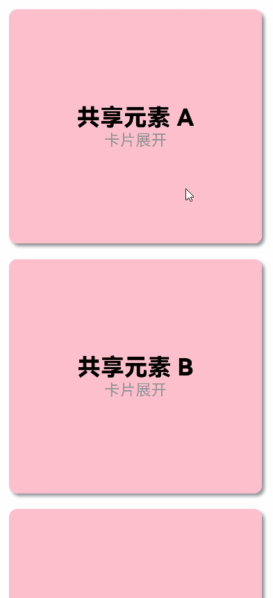

# 共享元素转场


共享元素转场是一种界面切换时对相同或者相似的元素做的一种位置和大小匹配的过渡动画效果。共享元素动画一般和模态转场一起配合使用以实现对应的效果，除此之外，通过转场动画和属性动画的配合，可以适用更多的共享元素转场场景。


## 使用transition和属性动画实现共享元素转场

对于同一个容器展开，容器内兄弟组件消失或者出现的场景，可通过对同一个容器展开前后进行宽高位置变化并配置属性动画，对兄弟组件配置出现消失转场动画实现共享元素转场。

1. 构建需要展开的页面，并通过状态变量构建好普通状态和展开状态的界面。

      ```ts
      class Tmp{
        set(item:CradData):CradData{
          return item
        }
      }
      // 通过状态变量的判断，在同一个组件内构建普通状态和展开状态的界面
      @Component
      export struct MyExtendView {
        // 声明与父组件进行交互的是否展开状态变量
        @Link isExpand: boolean;
        @State cardList: Array<CardData> = xxxx;
      
        build() {
          List() {
            // 根据需要定制展开后的组件
            if (this.isExpand) {
              Text('expand')
                .transition(TransitionEffect.translate({y:300}).animation({ curve: curves.springMotion(0.6, 0.8) }))
            }
      
            ForEach(this.cardList, (item: CradData) => {
              let Item:Tmp = new Tmp()
              let Imp:Tmp = Item.set(item)
              let Mc:Record<string,Tmp> = {'cardData':Imp}
              MyCard(Mc) // 封装的卡片组件，需自行实现
            })
          }
          .width(this.isExpand ? 200 : 500) // 根据需要定义展开后组件的属性
          .animation({ curve: curves.springMotion() }) // 为组件属性绑定动画
        }
      }
      ... 
      ```

2. 将需要展开的页面展开，通过状态变量控制兄弟组件消失或出现，并通过绑定出现消失转场实现兄弟组件转场效果。

      ```ts
      class Tmp{
        isExpand: boolean = false;
        set(){
          this.isExpand = !this.isExpand;
        }
      }
      let Exp:Record<string,boolean> = {'isExpand': false}
        @State isExpand: boolean = false
        
        ...
        List() {
          // 通过是否展开状态变量控制兄弟组件的出现或者消失，并配置出现消失转场动画
          if (!this.isExpand) {
            Text('收起')
              .transition(TransitionEffect.translate({y:300}).animation({ curve: curves.springMotion(0.6, 0.9) }))
          }
        
          MyExtendView(Exp)
            .onClick(() => {
              let Epd:Tmp = new Tmp()
              Epd.set()
            })
        
          // 通过是否展开状态变量控制兄弟组件的出现或者消失，并配置出现消失转场动画
          if (this.isExpand) {
            Text('展开')
              .transition(TransitionEffect.translate({y:300}).animation({ curve: curves.springMotion() }))
          }
        }
      ...
      ```


完整示例和效果如下。


```ts
// utils.ets
import curves from '@ohos.curves';

// 通过状态变量的判断，在同一个组件内构建普通状态和展开状态的界面
@Component
export struct share_transition_expand {
  // 声明与父组件进行交互的是否展开状态变量
  // 元素展开
  @State isExpand: boolean = false;
  // 当前展开元素
  @State curIndex: number = 0;
  @State listArray: Array<number> = [1, 2, 3, 4, 5, 6];
  build() {
    Column() {
      List() {
        ForEach(this.listArray, (item:number, index?:number|undefined) => {
          // 根据需要定制展开后的组件
          if (!this.isExpand || this.curIndex == index) {
            ListItem() {
              Column() {
                Row() {
                  Row()
                    .backgroundColor(Color.Pink)
                    .borderRadius(20)
                    .width(80)
                    .height(80)

                  Column() {
                    Text('点击展开 Item ' + item)
                      .fontSize(20)
                    Text('共享元素转场')
                      .fontSize(12)
                      .fontColor(0x909399)
                  }
                  .alignItems(HorizontalAlign.Start)
                  .justifyContent(FlexAlign.SpaceAround)
                  .margin({ left: 10 })
                  .height(80)
                }
                .width('90%')
                .height(100)

                if (this.isExpand) {
                  Row() {
                    Text('展开态')
                      .fontSize(28)
                      .fontColor(0x909399)
                      .textAlign(TextAlign.Center)
                      .transition(TransitionEffect.OPACITY.animation({ curve: curves.springMotion(0.6, 0.9) }))
                  }
                  .width('90%')
                  .justifyContent(FlexAlign.Center)
                }
              }
              .onClick(() => {
                // 定义展开收起的动画参数
                animateTo({ curve: curves.springMotion(0.6, 0.9) }, () => {
                  if(index){
                    this.curIndex = index;
                  }
                  this.isExpand = !this.isExpand;
                })
              })
              .width('90%')
              .height(this.isExpand && this.curIndex == index ? '85%' : 100) // 根据需要定义展开后的组件的属性
              .alignItems(HorizontalAlign.Center)
              .borderRadius(10)
              .margin({ top: 15 })
              .backgroundColor(Color.White)
              .shadow({ radius: 20, color: 0x909399, offsetX: 20, offsetY: 10 })
              // 通过是否展开状态变量控制兄弟节点的出现或者消失，并配置出现消失转场动画
              .transition(TransitionEffect.scale({ x: 0, y: 0 }).animation({ curve: curves.springMotion(0.3, 1.5) }))
            }
            .zIndex(this.curIndex == index ? 1 : 0)
          }
        })
      }
      .height('100%')
      .alignListItem(ListItemAlign.Center)
    }
    .width('100%')
    .height('100%')
    .justifyContent(FlexAlign.Start)
  }
}
```


```ts
// Index.ets
import { share_transition_expand } from './utils';
@Entry
@Component
struct ShareTransitionDemo {
  @State isExpand: boolean = false;
  @State Tmp:Record<string,boolean> = { 'isExpand': false }
  private scroller: Scroller = new Scroller();
  build() {
    Scroll(this.scroller) {
    Column() {
      Text('兄弟节点出现消失')
        .fontWeight(FontWeight.Bold)
        .fontSize(30)
        .fontColor(Color.Black)
        .margin(10)

      share_transition_expand(this.Tmp)

    }
    .width('100%')
    .height('100%')
    .justifyContent(FlexAlign.Start)
    }
  }
}
```


## 使用transition搭配zIndex实现共享元素转场

对于同一个容器展开，兄弟组件不消失的场景，可以配合改变Z轴让展开组件显示在最上层，从而实现共享元素转场。

- 同时构建普通状态和展开状态：通过是否展开的状态变量，在同一个组件内构建普通状态和展开状态的界面。

- 通过zIndex改变层级：展开状态将zIndex置为1，因为zIndex默认为0，设置为1就会置于zIndex值为0的兄弟组件上层。

- 通过仿射属性改变位置：根据卡片当前的位置，通过translate在展开的时候移到父容器的顶部。

- 通过占位容器不影响兄弟节点位置：外层容器占位，内部容器改变大小。

完整示例和效果如下。


```ts
// utils.ets
import curves from '@ohos.curves';

// 通过状态变量的判断，在同一个组件内构建普通状态和展开状态的界面
@Component
export struct share_zIndex_expand {
  // 声明与父组件进行交互的是否展开状态变量
  @State isExpand: boolean = false;
  @State curIndex: number = 0;
  @State listArray: Array<number> = [1, 2, 3, 4, 5, 6];
  private parentScroller: Scroller = new Scroller(); // 上层滑动组件控制器

  build() {
    Column() {
      List() {
        ForEach(this.listArray, (item:number, index?:number|undefined) => {
          // 根据需要定制展开后的组件
          if (!this.isExpand || this.curIndex == index) {
            ListItem() {
              Column() {
                Row() {
                  Row()
                    .backgroundColor(Color.Pink)
                    .borderRadius(20)
                    .width(80)
                    .height(80)

                  Column() {
                    Text('点击展开 Item ' + item)
                      .fontSize(20)
                    Text('共享元素转场')
                      .fontSize(12)
                      .fontColor(0x909399)
                  }
                  .alignItems(HorizontalAlign.Start)
                  .justifyContent(FlexAlign.SpaceAround)
                  .margin({ left: 10 })
                  .height(80)
                }
                .width('90%')
                .height(100)

                if (this.isExpand && this.curIndex == index) {
                  Row() {
                    Text('展开态')
                      .fontSize(28)
                      .fontColor(0x909399)
                      .textAlign(TextAlign.Center)
                      .transition(TransitionEffect.OPACITY.animation({ curve: curves.springMotion(0.6, 0.9) }))
                  }
                  .width('90%')
                  .justifyContent(FlexAlign.Center)
                }
              }
              .width('90%')
              .height(this.isExpand && this.curIndex == index ? 750 : 100)
              .alignItems(HorizontalAlign.Center)
              .borderRadius(10)
              .margin({ top: 15 })
              .backgroundColor(Color.White)
              .shadow({ radius: 20, color: 0x909399, offsetX: 20, offsetY: 10 })
            }
            .onClick(() => {
              // 定义展开收起的动画参数
              animateTo({ curve: curves.springMotion(0.6, 0.9) }, () => {
                if(index >= 0){
                  this.curIndex = index;
                }
                this.isExpand = !this.isExpand;
              })
            })
            .zIndex(this.curIndex == index ? 1 : 0) // 当前ListItem被选中时，zIndex置1，会显示在其他zIndex为0的兄弟组件之上
            .translate({ // 根据卡片当前的位置，通过translate在展开的时候移到父容器的顶端
                y: this.isExpand && this.curIndex == index ? -60 - this.parentScroller.currentOffset()['yOffset'] : 0
            })
          }
        })
      }
      .clip(false)
      .height('100%') // 占位容器固定大小
      .alignListItem(ListItemAlign.Center)
    }
    .zIndex(1)
    .width('100%')
    .height('100%')
    .justifyContent(FlexAlign.Start)
  }
}
```


```ts
// Index.ets
import { share_zIndex_expand } from './utils'
@Entry
@Component
struct ShareZIndexDemo {
  @State isExpand: boolean = false;
  @State curIndex: number = 0;
  private scroller: Scroller = new Scroller();
  @State Sze:Record<string,boolean|number|Scroller> = { 'isExpand': this.isExpand, 'curIndex': this.curIndex, 'parentScroller': this.scroller }

  build() {
    Scroll(this.scroller) {
      Column() {
        Text('ZIndex改变Z轴')
          .fontWeight(FontWeight.Bold)
          .fontSize(30)
          .fontColor(Color.Black)
          .zIndex(0)
          .margin(10)

        share_zIndex_expand(this.Sze)
      }
      .width('100%')
      .height('100%')
      .justifyContent(FlexAlign.Start)
    }
  }
}
```


## 使用geometryTransition实现共享元素转场

[geometryTransition](../reference/arkui-ts/ts-transition-animation-geometrytransition.md)用于组件内隐式共享元素转场，在视图状态切换过程中提供丝滑的上下文继承过渡体验。

通过if/else范式使用geometryTransition实现共享元素转场的完整示例和效果如下。


```ts
@Entry
@Component
struct IfElseGeometryTransition {
  @State isShow: boolean = false;

  build() {
    Stack({ alignContent: Alignment.Center }) {
      if (this.isShow) {
        Image($r('app.media.test'))
          .autoResize(false)
          .clip(true)
          .width(300)
          .height(400)
          .offset({ y: 100 })
          .geometryTransition("picture")
          .transition(TransitionEffect.OPACITY)
      } else {
        // geometryTransition此处绑定的是容器，那么容器内的子组件需设为相对布局跟随父容器变化，
        // 套多层容器为了说明相对布局约束传递
        Column() {
          Column() {
            Image($r('app.media.icon'))
              .width('100%').height('100%')
          }.width('100%').height('100%')
        }
        .width(80)
        .height(80)
        // geometryTransition会同步圆角，但仅限于geometryTransition绑定处，此处绑定的是容器
        // 则对容器本身有圆角同步而不会操作容器内部子组件的borderRadius
        .borderRadius(20)
        .clip(true)
        .geometryTransition("picture")
        // transition保证节点离场不被立即析构，设置通用转场效果
        .transition(TransitionEffect.OPACITY)
      }
    }
    .onClick(() => {
      animateTo({ duration: 1000 }, () => {
        this.isShow = !this.isShow;
      })
    })
  }
}
```


结合模态接口使用geometryTransition的示例和效果如下。


```ts
import curves from '@ohos.curves';

@Entry
@Component
struct GeometryTransitionDemo {
  // 用于控制模态转场的状态变量
  @State isPresent: boolean = false;
  @State alpha: boolean = false;
  // 通过@Builder构建模态展示界面
  @Builder
  MyBuilder() {
    Column() {
      Row() {
        Text('共享组件一')
          .fontWeight(FontWeight.Bold)
          .fontSize(20)
          .fontColor(Color.White)
      }
      .justifyContent(FlexAlign.Center)
      .borderRadius(10)
      .backgroundColor(0xf56c6c)
      .width('100%')
      .aspectRatio(1)
      .margin({ bottom: 20, top: 20})
      // 新增的共享元素Row组件，ID是share1
      .geometryTransition('share1')

      Column() {
        Text('展开页')
          .textAlign(TextAlign.Center)
          .fontSize(15)
          .fontColor(this.isPresent ? Color.White : Color.Transparent)
          .margin(20)

        Text('点击任意位置返回')
          .textAlign(TextAlign.Center)
          .fontSize(15)
          .fontColor(this.isPresent ? Color.White : Color.Transparent)
      }
      .width('100%')
      .transition(TransitionEffect.OPACITY.animation({ curve: curves.springMotion(0.6, 1.2) }))

    }
    .onAppear(()=> {
      animateTo({}, ()=>{
        this.alpha = ! this.alpha;
      })
    })
    .width('100%')
    .height('100%')
    .justifyContent(FlexAlign.Start)
    .transition(TransitionEffect.opacity(0.99))
    .backgroundColor(this.alpha ? 0x909399 : Color.Transparent)
    .clip(true)
    .onClick(() => {
      animateTo({ duration: 1000 }, () => {
        this.alpha = ! this.alpha;
        this.isPresent = !this.isPresent;
      })
    })
  }

  build() {
    Column() {
      Row() {
        Text('共享组件一')
          .fontWeight(FontWeight.Bold)
          .fontSize(20)
          .fontColor(Color.White)
      }
      .justifyContent(FlexAlign.Center)
      .borderRadius(10)
      .backgroundColor(0xf56c6c)
      .width(150)
      .height(150)
      .margin(20)
      // 模态转场组件
      .bindContentCover(this.isPresent, this.MyBuilder, ModalTransition.NONE)
      // 这里配置了Row组件有共享元素效果，ID是share1
      .geometryTransition('share1')
      .onClick(() => {
        animateTo({ curve: curves.springMotion(0.6, 1.2) }, () => {
          // 在动画闭包内改变状态变量，让模态界面显示
          this.isPresent = !this.isPresent;
        })
      })

      Text('组件二')
        .fontWeight(FontWeight.Bold)
        .fontSize(20)
        .fontColor(Color.White)
        .textAlign(TextAlign.Center)
        .borderRadius(10)
        .backgroundColor(0x67C23A)
        .width(150)
        .height(150)
        .margin(20)
    }
    .width('100%')
    .height('100%')
    .justifyContent(FlexAlign.Start)
    .backgroundColor(Color.White)
  }
}
```


## 使用属性动画实现共享元素转场效果


```ts
import curves from '@ohos.curves';
class itTmp{
  $rect:Array<number> = []
}
@Entry
@Component
struct AutoAchieveShareTransitionDemo {
  private items: string[] = ['A', 'B', 'C', 'D', 'E', 'F', 'G', 'H', 'I', 'J'];

  // 卡片是否展开
  @State expand: boolean = false;
  @State scrollState: boolean = true; // 滚动条状态

  // 共享元素相关属性
  @State rect_top: number = 0; // 共享元素position
  @State rect_bottom: number = 0;
  @State rect_left: number = 0;
  @State rect_right: number = 0;

  // 新建元素相关属性
  @State rootPosition: number = 0; // 状态栏高度
  @State item: string = ''; // 记录展开元素
  @State cardHeight: number = 300; // 卡片高度
  @State cardOpacity: number = 1; // 卡片透明度
  @State layoutHeight: number = 300; // 展开页高度
  @State layoutWidth: string = '90%'; // 展开页宽度
  @State layoutOffset: number = 0; // 展开页偏移量
  @State layoutOpacity: number = 0; // 展开页透明度

  // 用于结束回调中进行判断
  @State count: number = 0;

  build() {
    Stack() {
      Scroll() {
        Column({ space: 20 }) {
          ForEach(this.items, (item:string, index?:number|undefined) => {
            Row() {
              Column() {
                Text('共享元素 ' + item)
                  .fontSize(30)
                  .fontColor(Color.Black)
                  .fontWeight(FontWeight.Bolder)
                Text('卡片展开')
                  .fontSize(20)
                  .fontColor(0x909399)
              }
              .width('100%')
              .height('100%')
              .justifyContent(FlexAlign.Center)
            }
            .width('90%')
            .height(this.cardHeight)
            .padding(20)
            .backgroundColor(Color.Pink)
            .borderRadius(10)
            .shadow({ radius: 10, color: 0x909399, offsetX: 10, offsetY: 10 })
            .opacity(this.expand && this.item == item ? 0 : 1)
            // 设置唯一ID，获取该ID对应组件的属性信息
            .id(item)
            .onClick(() => {
              let rootStrJson = getInspectorByKey('root');
              let rootRect: itTmp = JSON.parse(rootStrJson);
              let rootRectInfo: Array<object> = JSON.parse('[' + rootRect.$rect + ']');
              let root_rect_top: string = JSON.parse('[' + rootRectInfo[0] + ']')[1];
              this.rootPosition = Number(root_rect_top);
              // 获取对应组件的位置、大小信息
              let strJson = getInspectorByKey(item);
              let rect:itTmp = JSON.parse(strJson);
              let rectInfo:Array<object> = JSON.parse('[' + rect.$rect + ']');
              let rect_left:string = JSON.parse('[' + rectInfo[0] + ']')[0];
              let rect_top:string = JSON.parse('[' + rectInfo[0] + ']')[1];
              let rect_right:string = JSON.parse('[' + rectInfo[1] + ']')[0];
              let rect_bottom:string = JSON.parse('[' + rectInfo[1] + ']')[1];
              let rect_value:Record<string,string> = {
                "left": rect_left, "top": rect_top, "right": rect_right, "bottom": rect_bottom
              };

              // 设置共享元素的位置、内容、状态
              this.rect_top = Number(rect_top);
              this.item = item;
              this.expand = true;
              this.count += 1;
              this.scrollState = false;

              animateTo({ curve: curves.springMotion() }, () => {
                this.layoutHeight = px2vp(2772);
                this.layoutWidth = '100%';
                this.layoutOffset = -px2vp(this.rect_top - this.rootPosition);
              })
            })
          })
        }
        .width('100%')
        .margin({ top: 20 })
      }
      .enabled(this.scrollState)
      .height('100%')

      // 根据获取的组件信息新建与该组件相同的元素
      if (this.expand) {
        Column() {
          // 共享元素
          Row() {
            Column() {
              Text('共享元素 ' + this.item)
                .fontSize(30)
                .fontColor(Color.Black)
                .fontWeight(FontWeight.Bolder)
              Text('卡片展开')
                .fontSize(20)
                .fontColor(0x909399)
            }
            .width('100%')
            .height('100%')
            .justifyContent(FlexAlign.Center)
          }
          .width('100%')
          .height(this.cardHeight)
          .padding(20)
          .backgroundColor(Color.Pink)

          // 新增元素
          Text('展开页面\n\n展开页面\n\n展开页面\n\n展开页面\n\n展开页面\n\n展开页面\n\n展开页面\n\n展开页面')
            .fontSize(20)
            .fontColor(0xcccccc)
            .margin({ top: 20 })
            .width(100)

        }
        .borderRadius(this.layoutWidth == '100%' ? 0 : 10)
        .shadow({ radius: 10, color: 0x909399, offsetX: 10, offsetY: 10 })
        .width(this.layoutWidth)
        .height(this.layoutHeight)
        .clip(true)
        .backgroundColor(Color.White)
        // 计算新建组件绝对位置
        .position({
          x: this.layoutWidth == '90%' ? '5%' : 0,
          y: px2vp(this.rect_top - this.rootPosition)
        })
        .translate({
          y: this.layoutOffset
        })
        .onClick(() => {
          this.count -= 1;
          this.scrollState = false;

          animateTo({
            curve: curves.springMotion(),
            onFinish: (() => {
              this.scrollState = true;
              if (this.count == 0) {
                this.expand = false;
              }
            })
          }, () => {
            this.layoutHeight = this.cardHeight;
            this.layoutWidth = '90%';
            this.layoutOffset = 0;
          })
        })
      }
    }
    .id('root')
  }
}
```




## 相关实例

针对共享元素转场开发，有以下相关实例可供参考：

- [电子相册（ArkTS）（API9）](https://gitee.com/openharmony/codelabs/tree/master/ETSUI/ElectronicAlbum)
