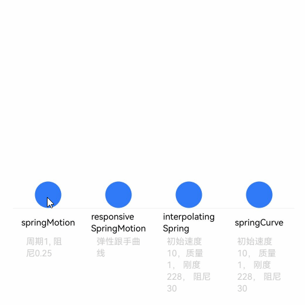

# 弹簧曲线


阻尼弹簧曲线（以下简称弹簧曲线）对应的阻尼弹簧系统中，偏离平衡位置的物体一方面受到弹簧形变产生的反向作用力，被迫发生振动。另一方面，阻尼的存在为物体振动提供阻力。除阻尼为0的特殊情况，物体在振动过程中振幅不断减小，且最终趋于0，其轨迹对应的动画曲线自然连续。


采用弹簧曲线的动画在达终点时动画速度为0，不会产生动画“戛然而止”的观感，以避免影响用户体验。


ArkUI提供了四种阻尼弹簧曲线接口。


- [springMotion](../reference/apis-arkui/js-apis-curve.md#curvesspringmotion9)：创建弹性动画，动画时长由曲线参数、属性变化值大小和弹簧初速度自动计算，开发者指定的动画时长不生效。
    springMotion不提供速度设置接口，速度通过继承获得，无需开发者指定。对于某个属性，如果当前存在正在运行的springMotion或者responsiveSpringMotion类型动画，新创建的弹簧动画将停止正在运行的动画，并继承其当前时刻的动画属性值和速度作为新建动画的初始状态。此外，接口提供默认参数，便于开发者直接使用。

  ```ts
  function springMotion(response?: number, dampingFraction?: number, overlapDuration?: number): ICurve;
  ```


- [responsiveSpringMotion](../reference/apis-arkui/js-apis-curve.md#curvesresponsivespringmotion9)：是springMotion动画的一种特例，仅默认参数不同。一般用于跟手做成动画的场景，离手时可用springMotion创建动画，此时离手阶段动画将自动继承跟手阶段动画速度，完成动画衔接。
  当新动画的overlapDuration参数不为0，且当前属性的上一个springMotion动画还未结束时，response和dampingFraction将在overlapDuration指定的时间内，从旧动画的参数值过渡到新动画的参数值。


  ```ts
  function responsiveSpringMotion(response?: number, dampingFraction?: number, overlapDuration?: number): ICurve;
  ```


- [interpolatingSpring](../reference/apis-arkui/js-apis-curve.md#curvesinterpolatingspring10)：适合于需要指定初速度的动效场景，动画时长同样由接口参数自动计算，开发者在动画接口中指定的时长不生效。
  曲线接口提供速度入参，且由于接口对应一条从0到1的阻尼弹簧曲线，实际动画值根据曲线进行插值计算。所以速度也应该为归一化速度，其值等于动画属性改变的绝对速度除以动画属性改变量。因此不适合于动画起点属性值和终点属性值相同的场景，此时动画属性改变量为0，归一化速度不存在。


  ```ts
  function interpolatingSpring(velocity: number, mass: number, stiffness: number, damping: number): ICurve;
  ```


- [springCurve](../reference/apis-arkui/js-apis-curve.md#curvesspringcurve9)：适合于需要直接指定动画时长的场景。springCurve接口与interpolatingSpring接口几乎一致，但是对于采用springCurve的动画，会将曲线的物理时长映射到指定的时长，相当于在时间轴上拉伸或压缩曲线，破坏曲线原本的物理规律，因此不建议开发者使用。

  ```ts
  function springCurve(velocity: number, mass: number, stiffness: number, damping: number): ICurve;
  ```


关于弹簧曲线完整的使用示例和参考效果如下，开发者也可参考[动画衔接](arkts-animation-smoothing.md)，掌握使用responsiveSpringMotion和springMotion进行手势和动画之间的衔接。


弹簧曲线的示例代码和效果如下。


```ts
import { curves } from '@kit.ArkUI';

class Spring {
  public title: string;
  public subTitle: string;
  public iCurve: ICurve;

  constructor(title: string, subTitle: string, iCurve: ICurve) {
    this.title = title;
    this.iCurve = iCurve;
    this.subTitle = subTitle;
  }
}

// 弹簧组件
@Component
struct Motion {
  @Prop dRotate: number = 0
  private title: string = ""
  private subTitle: string = ""
  private iCurve: ICurve | undefined = undefined

  build() {
    Column() {
      Circle()
        .translate({ y: this.dRotate })
        .animation({ curve: this.iCurve, iterations: -1 })
        .foregroundColor('#317AF7')
        .width(30)
        .height(30)

      Column() {
        Text(this.title)
          .fontColor(Color.Black)
          .fontSize(10).height(30)
        Text(this.subTitle)
          .fontColor(0xcccccc)
          .fontSize(10).width(50)
      }
      .borderWidth({ top: 1 })
      .borderColor(0xf5f5f5)
      .width(80)
      .alignItems(HorizontalAlign.Center)
      .height(100)

    }
    .height(110)
    .margin({ bottom: 5 })
    .alignItems(HorizontalAlign.Center)
  }
}

@Entry
@Component
export struct SpringCurve {
  @State dRotate: number = 0;
  private springs: Spring[] = [
    new Spring('springMotion', '周期1, 阻尼0.25', curves.springMotion(1, 0.25)),
    new Spring('responsive' + '\n' + 'SpringMotion', '弹性跟手曲线', curves.responsiveSpringMotion(1, 0.25)),
    new Spring('interpolating' + '\n' + 'Spring', '初始速度10，质量1， 刚度228， 阻尼30', curves.interpolatingSpring(10, 1, 228, 30)),
    new Spring('springCurve', '初始速度10， 质量1， 刚度228， 阻尼30', curves.springCurve(10, 1, 228, 30))
  ];

  build() {
    Row() {
      ForEach(this.springs, (item: Spring) => {
        Motion({ title: item.title, subTitle: item.subTitle, iCurve: item.iCurve, dRotate: this.dRotate })
      })
    }
    .justifyContent(FlexAlign.Center).alignItems(VerticalAlign.Bottom)
    .width('100%')
    .height(437)
    .margin({ top: 20 })
    .onClick(() => {
      this.dRotate = -50;
    })
  }
}
```




