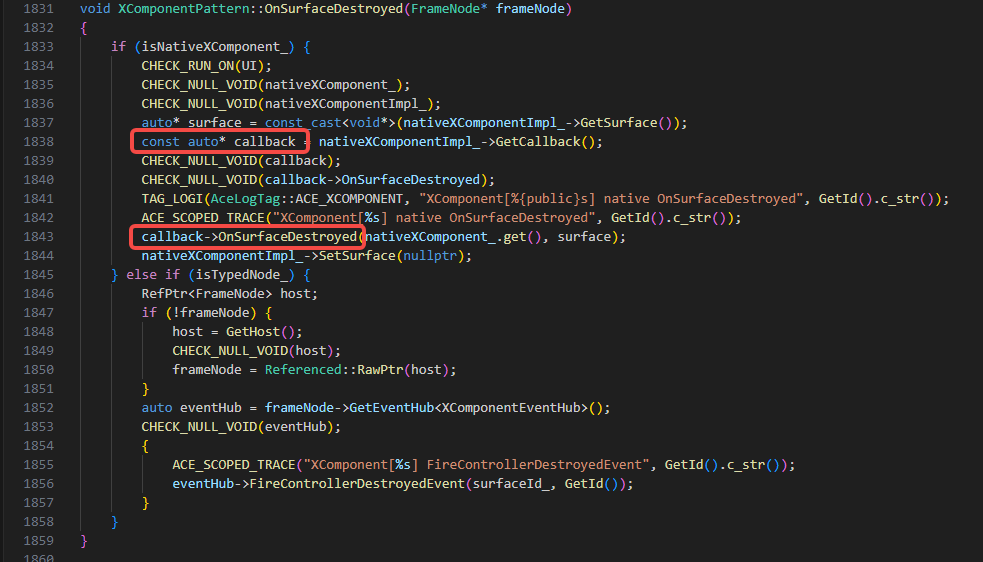
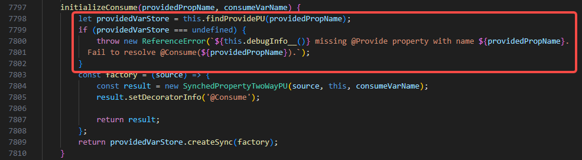
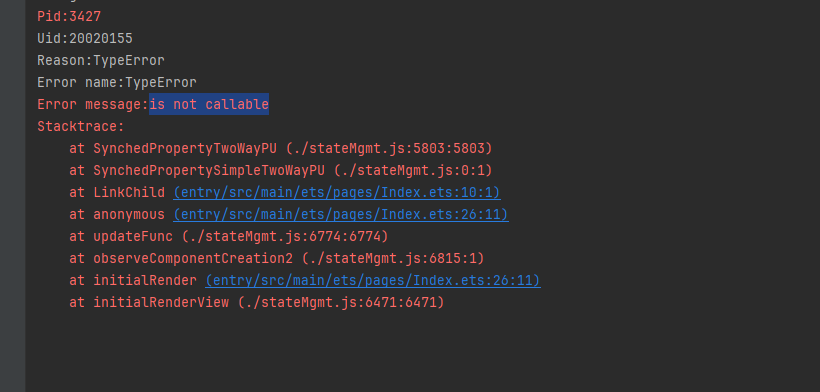
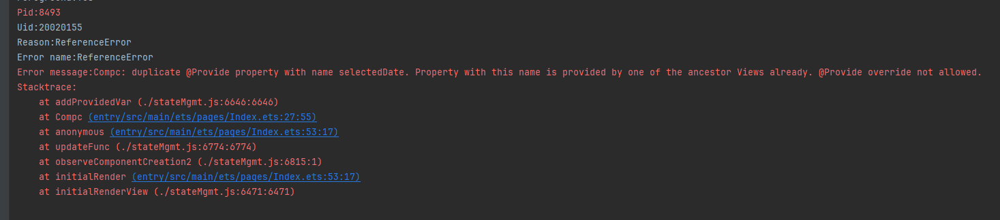
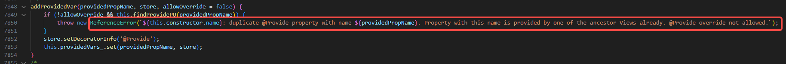

# UI相关应用崩溃常见问题

本文档收集整理了一些常见的会导致应用崩溃的ArkUI API错误用法，旨在帮助开发者了解一些常见的会导致应用崩溃问题的错误用法，从而避免在实际应用开发过程中犯类似错误。

## OH_NativeXComponent注册的回调函数对象被提前释放

**问题现象**

应用闪退并生成如下cppcrash崩溃栈：

```cpp
Reason:Signal:SIGSEGV(SEGV_ACCERR)@0x0000005c5f09a280 

#00 pc 0000000000ac9280 [anon:native_heap:jemalloc]
#01 pc 0000000002615120 /system/lib64/platformsdk/libace_compatible.z.so(OHOS::Ace::NG::XComponentPattern::OnSurfaceDestroyed()+468)
#02 pc 0000000002614b18 /system/lib64/platformsdk/libace_compatible.z.so(OHOS::Ace::NG::XComponentPattern::OnDetachFromFrameNode(OHOS::Ace::NG::FrameNode*)+88)
#03 pc 0000000000875294 /system/lib64/platformsdk/libace_compatible.z.so(OHOS::Ace::NG::FrameNode::~FrameNode()+264)
```

其中`libace_compatible.z.so`栈的最后一个调用帧为`XComponentPattern`类的`OnSurfaceCreated`、`OnSurfaceChanged`、`OnSurfaceDestroyed`、`DispatchTouchEvent`方法之一，且`#00`帧的`pc`是一个异常地址，通常其最后几位与`Reason`后面的地址内容一致，这表明某个函数指针存在问题，导致执行时跳转到异常地址。

**可能原因**

应用通过[OH_NativeXComponent_RegisterCallback](../reference/apis-arkui/capi-native-interface-xcomponent-h.md#oh_nativexcomponent_registercallback)接口注册的[OH_NativeXComponent_Callback](../reference/apis-arkui/capi-oh-nativexcomponent-native-xcomponent-oh-nativexcomponent-callback.md)回调函数对象以裸指针形式保存在`XComponentPattern`对象中。这些回调的生命周期由应用控制。如果应用提前销毁了`OH_NativeXComponent_Callback`回调函数对象，将导致裸指针指向非法内存，引发Use-After-Free问题。



**解决措施**

`onSurfaceDestroy`回调是`XComponentPattern`销毁时调用的最后一个回调，该回调执行完表示组件已经销毁。因此，应用必须确保在`onSurfaceDestroy`回调执行前，这些回调是有效的。

**参考链接**

相关接口详见[OH_NativeXComponent Native XComponent](../reference/apis-arkui/capi-oh-nativexcomponent-native-xcomponent.md)。


## OH_NativeXComponent对象被提前释放

**问题现象**

应用闪退并生成如下cppcrash崩溃栈：

```cpp
#00 pc 00000000000c8b3c /system/lib64/libc++.so(std::__h::basic_string<char, std::__h::char_traits<char>, std::__h::allocator<char>>::basic_string(std::__h::basic_string<char, std::__h::char_traits<char>, std::__h::allocator<char>> const&)+16)
#01 pc 0000000000034f64 /system/lib64/libace_ndk.z.so(OH_NativeXComponent::GetXComponentId(char*, unsigned long*)+76)
#02 pc 00000000000867c0 /data/storage/el1/bundle/libs/arm64/librenderer.so
```

其中栈顶附近内容为`libace_ndk.z.so(OH_NativeXComponent::XXX...)`，且下一帧是应用so。

**可能原因**

`OH_NativeXComponent`使用裸指针管理。应用侧持有其裸指针。如果在其生命周期结束后仍然调用相关接口，会导致Use-After-Free问题。

**解决措施**

系统通过`onSurfaceDestroy`回调通知应用`OH_NativeXComponent`已销毁。应用必须确保在`onSurfaceDestroy`回调执行完毕后不再调用`OH_NativeXComponent`相关接口。

**参考链接**

相关接口详见[OH_NativeXComponent Native XComponent](../reference/apis-arkui/capi-oh-nativexcomponent-native-xcomponent.md)。


## @Consume缺少匹配的@Provide

**问题现象**

应用闪退并生成如下jscrash崩溃栈：


**可能原因**

报错发生在`@Consume`初始化阶段，原因是`@Consume`初始化时仅通过key匹配对应的`@Provide`变量。如果未找到对应的`@Provide`，就会出现报错（missing @Provide）。



**解决措施**

排查组件树时，确保`@Provide`装饰的变量在祖先组件中定义，这些变量被视为提供给后代的状态变量。`@Consume`装饰的变量在后代组件中使用，用于绑定祖先组件提供的变量。如果`@Consume`绑定的key在祖先组件中未定义，会导致报错。请从用法角度进行排查。

**参考链接**

[跨组件层级双向同步](state-management/arkts-new-Provider-and-Consumer.md)。


## @Link数据源类型错误

**问题现象**

应用闪退并生成如下jscrash崩溃栈：



**可能原因**

报错发生在`@Link`初始化阶段，原因是`@Link`初始化时会注册到父组件并调用父组件的`addSubscriber`方法。如果此时数据源的类型与`@Link`不完全一致，或者使用常量初始化`@Link`，会导致该方法无法调用，从而引发“is not callable”错误。


**解决措施**

排查`@Link`的数据源，确认其是否为状态变量，并确保数据源的类型与`@Link`的类型一致。

**参考链接**

[父子双向同步](state-management/arkts-link.md)。


## @Provide缺少重写声明

**问题现象**

应用闪退并生成如下jscrash崩溃栈：



**可能原因**

报错发生在`@Provide`初始化阶段，原因是`@Provide`重写需要声明`allowOverride`。声明后，别名和属性名都可以被覆盖。如果未声明且存在重复的别名或属性名，将导致错误（duplicate @Provide property with name xxxxx）。



**解决措施**

需要检查`@Provide`是否使用了`allowOverride`声明。如果没有使用`allowOverride`，则这样使用是不合规的。只有在声明了`allowOverride`之后，才会允许重写，并且子组件的`@Consume`会根据别名或属性名找到并使用距离它最近的父节点上的`@Provide`值。

**参考链接**

[跨组件层级双向同步](state-management/arkts-new-Provider-and-Consumer.md)。
