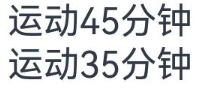
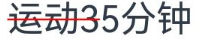
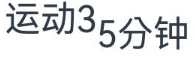
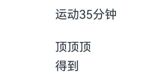
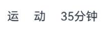
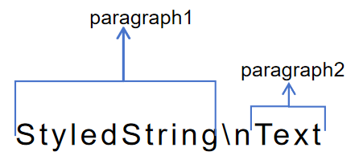
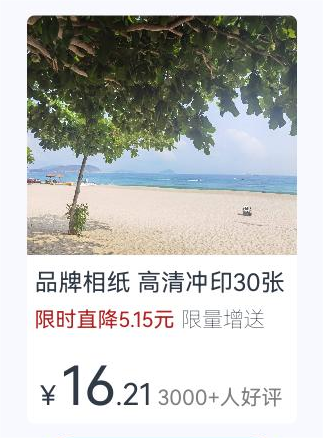

# 属性字符串（StyledString/MutableStyledString）

属性字符串StyledString/MutableStyledString（其中MutableStyledString继承自StyledString，下文统称为StyledString），可用于在字符或段落级别上设置文本样式。将StyledString应用到文本组件上，可以采用多种方式修改文本，包括调整字号、添加字体颜色、使文本具备可点击性，以及通过自定义方式绘制文本等。具体使用方法请参考[属性字符串](../reference/apis-arkui/arkui-ts/ts-universal-styled-string.md#属性字符串)的文档。

属性字符串提供多种类型样式对象，涵盖各种常见的文本样式格式，例如文本装饰线样式、文本行高样式、文本阴影样式等。也可以自行创建CustomSpan，以应用自定义样式。 

## 创建并应用StyledString和MutableStyledString

  可以通过TextController提供的[setStyledString](../reference/apis-arkui/arkui-ts/ts-basic-components-text.md#setstyledstring12)方法，将属性字符串附加到文本组件，并推荐在[onPageShow](../reference/apis-arkui/arkui-ts/ts-custom-component-lifecycle.md#onpageshow)中触发绑定。
  > **说明：**
  >
  > 在aboutToAppear中调用setStyledString方法时，由于该方法运行阶段组件尚未完成创建并成功挂载节点树，因此无法在页面初始化时显示属性字符串。

  ```ts
  @Entry
  @Component
  struct styled_string_demo1 {
    styledString1: StyledString = new StyledString("运动45分钟");
    mutableStyledString1: MutableStyledString = new MutableStyledString("运动35分钟");
    controller1: TextController = new TextController();
    controller2: TextController = new TextController();

    async onPageShow() {
      this.controller1.setStyledString(this.styledString1);
      this.controller2.setStyledString(this.mutableStyledString1);
    }

    build() {
      Column() {
        // 显示属性字符串
        Text(undefined, { controller: this.controller1 })
        Text(undefined, { controller: this.controller2 })
      }
      .width('100%')
    }
  }
  ```
  

## 设置文本样式

属性字符串目前提供了[TextStyle](../reference/apis-arkui/arkui-ts/ts-universal-styled-string.md#textstyle)、[TextShadowStyle](../reference/apis-arkui/arkui-ts/ts-universal-styled-string.md#textshadowstyle)、[DecorationStyle](../reference/apis-arkui/arkui-ts/ts-universal-styled-string.md#decorationstyle)、[BaselineOffsetStyle](../reference/apis-arkui/arkui-ts/ts-universal-styled-string.md#baselineoffsetstyle)、[LineHeightStyle](../reference/apis-arkui/arkui-ts/ts-universal-styled-string.md#lineheightstyle)、[LetterSpacingStyle](../reference/apis-arkui/arkui-ts/ts-universal-styled-string.md#letterspacingstyle)各种Style对象来实现设置文本的各类样式。

- 创建及应用文本字体样式对象（TextStyle）

  ```ts
  import { LengthMetrics } from '@kit.ArkUI';

  @Entry
  @Component
  struct styled_string_demo2 {
    textStyleAttrs: TextStyle =
      new TextStyle({ fontWeight: FontWeight.Bolder, fontSize: LengthMetrics.vp(24), fontStyle: FontStyle.Italic });
    mutableStyledString: MutableStyledString = new MutableStyledString("运动35分钟 目标达成", [
      {
        start: 2,
        length: 2,
        styledKey: StyledStringKey.FONT,
        styledValue: this.textStyleAttrs
      },
      {
        start: 7,
        length: 4,
        styledKey: StyledStringKey.FONT,
        styledValue: new TextStyle({ fontColor: Color.Orange, fontSize: LengthMetrics.vp(12) })
      }
    ]);
    controller: TextController = new TextController();

    async onPageShow() {
      this.controller.setStyledString(this.mutableStyledString);
    }

    build() {
      Column() {
        // 显示属性字符串
        Text(undefined, { controller: this.controller })
          .margin({ top: 10 })
      }
      .width('100%')
    }
  }
  ```
  

- 创建及应用文本阴影对象（TextShadowStyle）

  ```ts
  // xxx.ets
  @Entry
  @Component
  struct styled_string_demo3 {
    mutableStyledString: MutableStyledString = new MutableStyledString("运动35分钟", [
      {
        start: 0,
        length: 3,
        styledKey: StyledStringKey.TEXT_SHADOW,
        styledValue: new TextShadowStyle({
          radius: 5,
          type: ShadowType.COLOR,
          color: Color.Red,
          offsetX: 10,
          offsetY: 10
        })
      }
    ]);
    controller: TextController = new TextController();

    async onPageShow() {
      this.controller.setStyledString(this.mutableStyledString);
    }

    build() {
      Column() {
        // 显示属性字符串
        Text(undefined, { controller: this.controller })
      }
      .width('100%')
    }
  }
  ```
  

- 创建及应用文本装饰线对象（DecorationStyle）

  ```ts
  // xxx.ets
  @Entry
  @Component
  struct styled_string_demo4 {
    mutableStyledString: MutableStyledString = new MutableStyledString("运动35分钟", [
      {
        start: 0,
        length: 3,
        styledKey: StyledStringKey.DECORATION,
        styledValue: new DecorationStyle({ type: TextDecorationType.LineThrough, color: Color.Red })
      }
    ]);
    controller: TextController = new TextController();

    async onPageShow() {
      this.controller.setStyledString(this.mutableStyledString);
    }

    build() {
      Column() {
        // 显示属性字符串
        Text(undefined, { controller: this.controller })
      }
      .width('100%')
    }
  }
  ```
  

- 创建及应用文本基线偏移量对象（BaselineOffsetStyle）

  ```ts
  import { LengthMetrics } from '@kit.ArkUI';

  // xxx.ets
  @Entry
  @Component
  struct styled_string_demo5 {
    mutableStyledString: MutableStyledString = new MutableStyledString("运动35分钟", [
      {
        start: 0,
        length: 3,
        styledKey: StyledStringKey.BASELINE_OFFSET,
        styledValue: new BaselineOffsetStyle(LengthMetrics.px(20))
      }
    ]);
    controller: TextController = new TextController();

    async onPageShow() {
      this.controller.setStyledString(this.mutableStyledString);
    }

    build() {
      Column() {
        // 显示属性字符串
        Text(undefined, { controller: this.controller })
      }
      .width('100%')
    }
  }
  ```
  

- 创建及应用文本行高对象（LineHeightStyle）

  ```ts
  import { LengthMetrics } from '@kit.ArkUI';

  // xxx.ets
  @Entry
  @Component
  struct styled_string_demo6 {
    mutableStyledString: MutableStyledString = new MutableStyledString("运动35分钟\n顶顶顶\n得到", [
      {
        start: 8,
        length: 3,
        styledKey: StyledStringKey.LINE_HEIGHT,
        styledValue: new LineHeightStyle(LengthMetrics.vp(50))
      }
    ]);
    controller: TextController = new TextController();

    async onPageShow() {
      this.controller.setStyledString(this.mutableStyledString);
    }

    build() {
      Column() {
        // 显示属性字符串
        Text(undefined, { controller: this.controller })
      }
      .width('100%')
      .margin({ top: 10 })
    }
  }
  ```
  

- 创建及应用文本字符间距对象（LetterSpacingStyle）

  ```ts
  import { LengthMetrics, LengthUnit } from '@kit.ArkUI';

  // xxx.ets
  @Entry
  @Component
  struct styled_string_demo7 {
    mutableStyledString: MutableStyledString = new MutableStyledString("运动35分钟", [
      {
        start: 0,
        length: 2,
        styledKey: StyledStringKey.LETTER_SPACING,
        styledValue: new LetterSpacingStyle(new LengthMetrics(20, LengthUnit.VP))
      }
    ]);
    controller: TextController = new TextController();

    async onPageShow() {
      this.controller.setStyledString(this.mutableStyledString);
    }

    build() {
      Column() {
        // 显示属性字符串
        Text(undefined, { controller: this.controller })
      }
      .width('100%')
    }
  }
  ```
  

## 设置段落样式

可通过[ParagraphStyle](../reference/apis-arkui/arkui-ts/ts-universal-styled-string.md#paragraphstyle)设置段落样式布局。下图显示了如何分割文本中的段落，段落以换行符 \n 结尾。



以下代码示例展示了如何创建ParagraphStyle并应用。如果将ParagraphStyle附加到段落开头末尾或之间的任何位置，均会应用样式，非段落区间内则不会应用样式。

  ```ts
  import { LengthMetrics } from '@kit.ArkUI';
  titleParagraphStyleAttr: ParagraphStyle = new ParagraphStyle({ textAlign: TextAlign.Center });
  //段落首行缩进15vp
  paragraphStyleAttr1: ParagraphStyle = new ParagraphStyle({ textIndent: LengthMetrics.vp(15) });
  //行高样式对象
  lineHeightStyle1: LineHeightStyle= new LineHeightStyle(new LengthMetrics(24));
  //创建含段落样式的对象paragraphStyledString1
  paragraphStyledString1: MutableStyledString = new MutableStyledString("段落标题\n正文第一段落开始0123456789正文第一段落结束。", [
    {
      start: 0,
      length: 4,
      styledKey: StyledStringKey.PARAGRAPH_STYLE,
      styledValue: this.titleParagraphStyleAttr
    },
    {
      start: 0,
      length: 4,
      styledKey: StyledStringKey.LINE_HEIGHT,
      styledValue: new LineHeightStyle(new LengthMetrics(50))
    },{
    start: 0,
    length: 4,
    styledKey: StyledStringKey.FONT,
    styledValue: new TextStyle({ fontSize: LengthMetrics.vp(24), fontWeight: FontWeight.Bolder })
  },
    {
      start: 5,
      length: 3,
      styledKey: StyledStringKey.PARAGRAPH_STYLE,
      styledValue: this.paragraphStyleAttr1
    },
    {
      start: 5,
      length: 20,
      styledKey: StyledStringKey.LINE_HEIGHT,
      styledValue: this.lineHeightStyle1
    }
  ]);
  ```

  除了可以在创建属性字符串时就预设样式，也可以后续通过[replaceStyle](../reference/apis-arkui/arkui-ts/ts-universal-styled-string.md#replacestyle)清空原样式替换新样式, 同时需要在附加的文本组件controller上主动触发更新绑定的属性字符串。

  ```ts
  import { LengthMetrics } from '@kit.ArkUI';
  //段落不设置缩进配置最大行数及超长显示方式
  paragraphStyleAttr3: ParagraphStyle = new ParagraphStyle({ textAlign: TextAlign.End, maxLines: 1, wordBreak: WordBreak.BREAK_ALL, overflow: TextOverflow.Ellipsis});
  // 后续某个节点触发更新段落样式
  controller: TextController = new TextController();
  this.paragraphStyledString1.replaceStyle({
    start: 5,
    length: 3,
    styledKey: StyledStringKey.PARAGRAPH_STYLE,
    styledValue: this.paragraphStyleAttr3
  });
  this.controller.setStyledString(this.paragraphStyledString1);
  ```

## 使用图片

可通过[ImageAttachment](../reference/apis-arkui/arkui-ts/ts-universal-styled-string.md#imageattachment)来添加图片。

以下示例展示了如何将图片和文本附加到同一个MutableStyledString对象上，并实现图文混排。

  ```ts
  // xxx.ets
  import { image } from '@kit.ImageKit';
  import { LengthMetrics } from '@kit.ArkUI';

  @Entry
  @Component
  struct styled_string_demo4 {
    @State message: string = 'Hello World';
    imagePixelMap: image.PixelMap | undefined = undefined;
    @State imagePixelMap3: image.PixelMap | undefined = undefined;
    mutableStr: MutableStyledString = new MutableStyledString('123');
    controller: TextController = new TextController();
    mutableStr2: MutableStyledString = new MutableStyledString('This is set decoration line style to the mutableStr2', [{
      start: 0,
      length: 15,
      styledKey: StyledStringKey.DECORATION,
      styledValue: new DecorationStyle({
        type: TextDecorationType.Overline,
        color: Color.Orange,
        style: TextDecorationStyle.DOUBLE
      })
    }]);

    async aboutToAppear() {
      console.info("aboutToAppear initial imagePixelMap");
      this.imagePixelMap = await this.getPixmapFromMedia($r('app.media.sea'));
    }

    private async getPixmapFromMedia(resource: Resource) {
      let unit8Array = await this.getUIContext().getHostContext()?.resourceManager?.getMediaContent({
        bundleName: resource.bundleName,
        moduleName: resource.moduleName,
        id: resource.id
      });
      let imageSource = image.createImageSource(unit8Array?.buffer?.slice(0, unit8Array?.buffer?.byteLength));
      let createPixelMap: image.PixelMap = await imageSource.createPixelMap({
        desiredPixelFormat: image.PixelMapFormat.RGBA_8888
      });
      await imageSource.release();
      return createPixelMap;
    }

    leadingMarginValue: ParagraphStyle = new ParagraphStyle({ leadingMargin: LengthMetrics.vp(5)});
    //行高样式对象
    lineHeightStyle1: LineHeightStyle= new LineHeightStyle(new LengthMetrics(24));
    //Bold样式
    boldTextStyle: TextStyle = new TextStyle({ fontWeight: FontWeight.Bold });
    //创建含段落样式的对象paragraphStyledString1
    paragraphStyledString1: MutableStyledString = new MutableStyledString("\n品牌相纸 高清冲印30张\n限时直降5.15元 限量增送", [
      {
        start: 0,
        length: 28,
        styledKey: StyledStringKey.PARAGRAPH_STYLE,
        styledValue: this.leadingMarginValue
      },
      {
        start: 14,
        length: 9,
        styledKey: StyledStringKey.FONT,
        styledValue: new TextStyle({ fontSize: LengthMetrics.vp(14), fontColor: '#B22222' })
      },
      {
        start: 24,
        length: 4,
        styledKey: StyledStringKey.FONT,
        styledValue: new TextStyle({ fontSize: LengthMetrics.vp(14), fontWeight: FontWeight.Lighter })
      },
      {
        start: 11,
        length: 4,
        styledKey: StyledStringKey.LINE_HEIGHT,
        styledValue: this.lineHeightStyle1
      }
    ]);
    paragraphStyledString2: MutableStyledString = new MutableStyledString("\n￥16.21 3000+人好评", [
      {
        start: 0,
        length: 5,
        styledKey: StyledStringKey.PARAGRAPH_STYLE,
        styledValue: this.leadingMarginValue
      },
      {
        start: 0,
        length: 4,
        styledKey: StyledStringKey.LINE_HEIGHT,
        styledValue: new LineHeightStyle(new LengthMetrics(60))
      },
      {
        start: 0,
        length: 7,
        styledKey: StyledStringKey.FONT,
        styledValue: this.boldTextStyle
      },
      {
        start: 1,
        length: 1,
        styledKey: StyledStringKey.FONT,
        styledValue: new TextStyle({ fontSize: LengthMetrics.vp(18) })
      },
      {
        start: 2,
        length: 2,
        styledKey: StyledStringKey.FONT,
        styledValue: new TextStyle({ fontSize: LengthMetrics.vp(36) })
      },
      {
        start: 4,
        length: 3,
        styledKey: StyledStringKey.FONT,
        styledValue: new TextStyle({ fontSize: LengthMetrics.vp(20) })
      },
      {
        start: 7,
        length: 9,
        styledKey: StyledStringKey.FONT,
        styledValue: new TextStyle({ fontColor: Color.Grey, fontSize: LengthMetrics.vp(14)})
      }
    ]);

    build() {
      Row() {
        Column({ space: 10 }) {
          Text(undefined, { controller: this.controller })
            .copyOption(CopyOptions.InApp)
            .draggable(true)
            .backgroundColor('#FFFFFF')
            .borderRadius(5)

          Button('点击查看商品卡片')
            .onClick(() => {
              if (this.imagePixelMap !== undefined) {
                this.mutableStr = new MutableStyledString(new ImageAttachment({
                  value: this.imagePixelMap,
                  size: { width: 180, height: 160 },
                  verticalAlign: ImageSpanAlignment.BASELINE,
                  objectFit: ImageFit.Fill
                }));
                this.paragraphStyledString1.appendStyledString(this.paragraphStyledString2);
                this.mutableStr.appendStyledString(this.paragraphStyledString1);
                this.controller.setStyledString(this.mutableStr);
              }
            })
        }
        .width('100%')
      }
      .height('100%')
      .backgroundColor('#F8F8FF')
    }
  }
  ```
  

## 设置事件

可通过[GestureStyle](../reference/apis-arkui/arkui-ts/ts-universal-styled-string.md#gesturestyle)设置onClick、onLongPress事件来使文本响应点击长按事件。

除了初始化属性字符串对象即初始样式对象，亦可通过[setStyle](../reference/apis-arkui/arkui-ts/ts-universal-styled-string.md#setstyle)接口再叠加新样式或更新已有样式，同时需要在附加的文本组件controller上主动触发更新绑定的属性字符串。

  ```ts
  import { drawing } from '@kit.ArkGraphics2D';

  class MyCustomSpan extends CustomSpan {
    constructor(word: string, width: number, height: number, fontSize: number) {
      super();
      this.word = word;
      this.width = width;
      this.height = height;
      this.fontSize = fontSize;
    }

    onMeasure(measureInfo: CustomSpanMeasureInfo): CustomSpanMetrics {
      return { width: this.width, height: this.height };
    } 

    onDraw(context: DrawContext, options: CustomSpanDrawInfo) {
      let canvas = context.canvas;

      const brush = new drawing.Brush();
      brush.setColor({
        alpha: 255,
        red: 0,
        green: 0,
        blue: 0
      });
      const font = new drawing.Font();
      font.setSize(vp2px(this.fontSize));
      const textBlob =
        drawing.TextBlob.makeFromString(this.word.substring(0, 5), font, drawing.TextEncoding.TEXT_ENCODING_UTF8);
      canvas.attachBrush(brush);

      this.onDrawRectByRadius(context, options.x, options.x + vp2px(this.width), options.lineTop, options.lineBottom, 20);
      brush.setColor({
        alpha: 255,
        red: 255,
        green: 255,
        blue: 255
      });
      canvas.attachBrush(brush);
      canvas.drawTextBlob(textBlob, options.x, options.lineBottom - 30);
      brush.setColor({
        alpha: 255,
        red: 255,
        green: 228,
        blue: 196
      });
      canvas.attachBrush(brush);
      const textBlob1 =
        drawing.TextBlob.makeFromString(this.word.substring(5), font, drawing.TextEncoding.TEXT_ENCODING_UTF8);
      canvas.drawTextBlob(textBlob1, options.x + vp2px(100), options.lineBottom - 30);

      canvas.detachBrush();
    }

    onDrawRectByRadius(context: DrawContext, left: number, right: number, top: number, bottom: number, radius: number) {
      let canvas = context.canvas;
      let path = new drawing.Path();

      // 画带radius的rect
      path.moveTo(left + radius, top);
      path.lineTo(right - radius, top);
      path.arcTo(right - 2 * radius, top, right, top + 2 * radius, 270, 90);
      path.lineTo(right, bottom - radius);
      path.arcTo(right - 2 * radius, bottom - 2 * radius, right, bottom, 0, 90);

      path.lineTo(left + 2 * radius, bottom);
      path.arcTo(left, bottom - 2 * radius, left + 2 * radius, bottom, 90, 90);
      path.lineTo(left, top + 2 * radius);
      path.arcTo(left, top, left + 2 * radius, top + 2 * radius, 180, 90);

      canvas.drawPath(path);
    }

    setWord(word: string) {
      this.word = word;
    }

    width: number = 160;
    word: string = "drawing";
    height: number = 10;
    fontSize: number = 16;
  }

  @Entry
  @Component
  struct styled_string_demo6 {
    customSpan3: MyCustomSpan = new MyCustomSpan("99VIP88%off", 200, 40, 30);
    textStyle: MutableStyledString = new MutableStyledString("123");
    textController: TextController = new TextController();
    isPageShow: boolean = true;

    async onPageShow() {
      if (!this.isPageShow) {
        return;
      }
      this.isPageShow = false;
      this.textController.setStyledString(new StyledString(this.customSpan3));
    }

    build() {
      Row() {
        Column() {
          Text(undefined, { controller: this.textController })
            .copyOption(CopyOptions.InApp)
            .fontSize(30)
        }
        .width('100%')
      }
      .height('100%')
    }
  }
  ```


## 场景示例

该示例通过ParagraphStyle、LineHeightStyle、TextStyle对象展示了会员过期提示的效果。

```ts
import { LengthMetrics } from '@kit.ArkUI';

@Entry
@Component
struct Index {
  alignCenterParagraphStyleAttr: ParagraphStyle = new ParagraphStyle({ textAlign: TextAlign.Center });
  //行高样式对象
  lineHeightStyle1: LineHeightStyle = new LineHeightStyle(LengthMetrics.vp(24));
  //Bold样式
  boldTextStyle: TextStyle = new TextStyle({ fontWeight: FontWeight.Bold });
  //创建含段落样式的对象paragraphStyledString1
  paragraphStyledString1: MutableStyledString =
    new MutableStyledString("您的豪华钻石已过期1天\n续费可继续享受会员专属权益", [
      {
        start: 0,
        length: 4,
        styledKey: StyledStringKey.PARAGRAPH_STYLE,
        styledValue: this.alignCenterParagraphStyleAttr
      },
      {
        start: 0,
        length: 4,
        styledKey: StyledStringKey.LINE_HEIGHT,
        styledValue: new LineHeightStyle(LengthMetrics.vp(40))
      },
      {
        start: 11,
        length: 14,
        styledKey: StyledStringKey.FONT,
        styledValue: new TextStyle({ fontSize: LengthMetrics.vp(14), fontColor: Color.Grey })
      },
      {
        start: 11,
        length: 4,
        styledKey: StyledStringKey.PARAGRAPH_STYLE,
        styledValue: this.alignCenterParagraphStyleAttr
      },
      {
        start: 11,
        length: 4,
        styledKey: StyledStringKey.LINE_HEIGHT,
        styledValue: this.lineHeightStyle1
      }
    ]);
  paragraphStyledString2: MutableStyledString = new MutableStyledString("\n￥4.88￥15", [
    {
      start: 0,
      length: 4,
      styledKey: StyledStringKey.PARAGRAPH_STYLE,
      styledValue: this.alignCenterParagraphStyleAttr
    },
    {
      start: 0,
      length: 4,
      styledKey: StyledStringKey.LINE_HEIGHT,
      styledValue: new LineHeightStyle(LengthMetrics.vp(60))
    },
    {
      start: 0,
      length: 6,
      styledKey: StyledStringKey.FONT,
      styledValue: this.boldTextStyle
    },
    {
      start: 1,
      length: 1,
      styledKey: StyledStringKey.FONT,
      styledValue: new TextStyle({ fontSize: LengthMetrics.vp(18) })
    },
    {
      start: 2,
      length: 4,
      styledKey: StyledStringKey.FONT,
      styledValue: new TextStyle({ fontSize: LengthMetrics.vp(40) })
    },
    {
      start: 6,
      length: 3,
      styledKey: StyledStringKey.FONT,
      styledValue: new TextStyle({ fontColor: Color.Grey, fontSize: LengthMetrics.vp(14) })
    },
    {
      start: 6,
      length: 3,
      styledKey: StyledStringKey.DECORATION,
      styledValue: new DecorationStyle({ type: TextDecorationType.LineThrough, color: Color.Grey })
    }
  ]);
  paragraphStyledString3: MutableStyledString = new MutableStyledString("\n02时06分后将失去该优惠", [
    {
      start: 0,
      length: 4,
      styledKey: StyledStringKey.PARAGRAPH_STYLE,
      styledValue: this.alignCenterParagraphStyleAttr
    },
    {
      start: 0,
      length: 4,
      styledKey: StyledStringKey.LINE_HEIGHT,
      styledValue: new LineHeightStyle(LengthMetrics.vp(30))
    },
    {
      start: 1,
      length: 2,
      styledKey: StyledStringKey.FONT,
      styledValue: new TextStyle({ fontColor: '#FFD700', fontWeight: FontWeight.Bold })
    },
    {
      start: 4,
      length: 2,
      styledKey: StyledStringKey.FONT,
      styledValue: new TextStyle({ fontColor: '#FFD700', fontWeight: FontWeight.Bold })
    }
  ]);
  controller: TextController = new TextController();

  build() {
    Row() {
      Column({ space: 5 }) {
        Text(undefined, { controller: this.controller })
          .width(240)
          .copyOption(CopyOptions.InApp)
          .draggable(true)
          .onAppear(() => {
            this.paragraphStyledString2.appendStyledString(this.paragraphStyledString3);
            this.paragraphStyledString1.appendStyledString(this.paragraphStyledString2);
            this.controller.setStyledString(this.paragraphStyledString1);
          })

        Button("限时4.88元 立即续费")
          .width(200)
          .fontColor(Color.White)
          .fontSize(18)
          .backgroundColor('#3CB371')
          .margin({ bottom: 10 })
      }
      .borderWidth(1).borderColor('#FFDEAD')
      .margin({ left: 10 })
    }
    .height('60%')
  }
}
```

