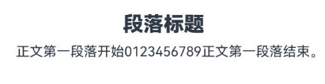
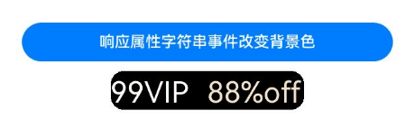

# 属性字符串（StyledString/MutableStyledString）

属性字符串StyledString/MutableStyledString（其中MutableStyledString继承自StyledString，下文统称为StyledString），可用于在字符或段落级别上设置文本样式。将StyledString应用到文本组件上，可以采用多种方式修改文本，包括调整字号、添加字体颜色、使文本具备可点击性，以及通过自定义方式绘制文本等。具体使用方法请参考[属性字符串](../reference/apis-arkui/arkui-ts/ts-universal-styled-string.md)的文档。

属性字符串提供多种类型样式对象，涵盖各种常见的文本样式格式，例如文本装饰线样式、文本行高样式、文本阴影样式等。也可以自行创建CustomSpan，以应用自定义样式。 

## 创建并应用StyledString和MutableStyledString

  可以通过TextController提供的[setStyledString](../reference/apis-arkui/arkui-ts/ts-basic-components-text.md#setstyledstring12)方法，将属性字符串附加到文本组件，并推荐在[onPageShow](../reference/apis-arkui/arkui-ts/ts-custom-component-lifecycle.md#onpageshow)或者文本组件的[onAppear](../reference/apis-arkui/arkui-ts/ts-universal-events-show-hide.md#onappear)回调中触发绑定。
  > **说明：**
  >
  > 在aboutToAppear中调用setStyledString方法时，由于该方法运行阶段组件尚未完成创建并成功挂载节点树，因此无法在页面初始化时显示属性字符串。
  >
  > 从API version 15开始，在aboutToAppear中调用setStyledString方法，页面初始化时可以显示属性字符串。

  ```ts
  @Entry
  @Component
  struct styled_string_demo1 {
    styledString1: StyledString = new StyledString("运动45分钟");
    mutableStyledString1: MutableStyledString = new MutableStyledString("运动35分钟");
    controller1: TextController = new TextController();
    controller2: TextController = new TextController();

    async onPageShow() {
      // 在生命周期onPageShow回调中绑定属性字符串
      this.controller1.setStyledString(this.styledString1);
    }

    build() {
      Column() {
        // 显示属性字符串
        Text(undefined, { controller: this.controller1 })
        Text(undefined, { controller: this.controller2 })
          .onAppear(() => {
            // 在组件onAppear回调中绑定属性字符串
            this.controller2.setStyledString(this.mutableStyledString1);
          })
      }
      .width('100%')
    }
  }
  ```
  

## 设置文本样式

属性字符串目前提供了多种Style对象，包括[TextStyle](../reference/apis-arkui/arkui-ts/ts-universal-styled-string.md#textstyle)、[TextShadowStyle](../reference/apis-arkui/arkui-ts/ts-universal-styled-string.md#textshadowstyle)、[DecorationStyle](../reference/apis-arkui/arkui-ts/ts-universal-styled-string.md#decorationstyle)、[BaselineOffsetStyle](../reference/apis-arkui/arkui-ts/ts-universal-styled-string.md#baselineoffsetstyle)、[LineHeightStyle](../reference/apis-arkui/arkui-ts/ts-universal-styled-string.md#lineheightstyle)、[LetterSpacingStyle](../reference/apis-arkui/arkui-ts/ts-universal-styled-string.md#letterspacingstyle)，用于设置文本的各类样式。

- 创建及应用文本字体样式对象（TextStyle）

  ```ts
  import { LengthMetrics } from '@kit.ArkUI';

  @Entry
  @Component
  struct styled_string_demo2 {
    textStyleAttrs: TextStyle =
      new TextStyle({ fontWeight: FontWeight.Bolder, fontSize: LengthMetrics.vp(24), fontStyle: FontStyle.Italic, strokeWidth: LengthMetrics.px(5), strokeColor: Color.Green });
    mutableStyledString: MutableStyledString = new MutableStyledString("运动45分钟 目标达成", [
      {
        start: 2,
        length: 2,
        styledKey: StyledStringKey.FONT,
        styledValue: this.textStyleAttrs
      },
      {
        start: 7,
        length: 4,
        styledKey: StyledStringKey.FONT,
        styledValue: new TextStyle({ fontColor: Color.Orange, fontSize: LengthMetrics.vp(12),
        superscript: SuperscriptStyle.SUPERSCRIPT })
      }
    ]);
    controller: TextController = new TextController();

    async onPageShow() {
      this.controller.setStyledString(this.mutableStyledString);
    }

    build() {
      Column() {
        // 显示属性字符串
        Text(undefined, { controller: this.controller })
          .margin({ top: 10 })
      }
      .width('100%')
    }
  }
  ```
  

- 创建及应用文本阴影对象（TextShadowStyle）

  ```ts
  // xxx.ets
  @Entry
  @Component
  struct styled_string_demo3 {
    mutableStyledString: MutableStyledString = new MutableStyledString("运动35分钟", [
      {
        start: 0,
        length: 3,
        styledKey: StyledStringKey.TEXT_SHADOW,
        styledValue: new TextShadowStyle({
          radius: 5,
          type: ShadowType.COLOR,
          color: Color.Red,
          offsetX: 10,
          offsetY: 10
        })
      }
    ]);
    controller: TextController = new TextController();

    async onPageShow() {
      this.controller.setStyledString(this.mutableStyledString);
    }

    build() {
      Column() {
        // 显示属性字符串
        Text(undefined, { controller: this.controller })
      }
      .width('100%')
    }
  }
  ```
  

- 创建及应用文本装饰线对象（DecorationStyle）

  ```ts
  // xxx.ets
  @Entry
  @Component
  struct styled_string_demo4 {
    mutableStyledString: MutableStyledString = new MutableStyledString("运动35分钟", [
      {
        start: 0,
        length: 4,
        styledKey: StyledStringKey.DECORATION,
        styledValue: new DecorationStyle({ type: TextDecorationType.LineThrough, color: Color.Red, thicknessScale: 3 })
      },
      {
        start: 4,
        length: 2,
        styledKey: StyledStringKey.DECORATION,
        styledValue: new DecorationStyle(
          {
            type: TextDecorationType.Underline,
          },
          {
            // 开启多装饰线
            enableMultiType: true
          }
        )
      },
      {
        start: 4,
        length: 2,
        styledKey: StyledStringKey.DECORATION,
        styledValue: new DecorationStyle(
          {
            type: TextDecorationType.LineThrough,
          },
          {
            // 开启多装饰线
            enableMultiType: true
          }
        )
      },
    ]);
    controller: TextController = new TextController();

    async onPageShow() {
      this.controller.setStyledString(this.mutableStyledString);
    }

    build() {
      Column() {
        // 显示属性字符串
        Text(undefined, { controller: this.controller })
      }
      .width('100%')
    }
  }
  ```
  

- 创建及应用文本基线偏移量对象（BaselineOffsetStyle）

  ```ts
  import { LengthMetrics } from '@kit.ArkUI';

  // xxx.ets
  @Entry
  @Component
  struct styled_string_demo5 {
    mutableStyledString: MutableStyledString = new MutableStyledString("运动35分钟", [
      {
        start: 0,
        length: 3,
        styledKey: StyledStringKey.BASELINE_OFFSET,
        styledValue: new BaselineOffsetStyle(LengthMetrics.px(20))
      }
    ]);
    controller: TextController = new TextController();

    async onPageShow() {
      this.controller.setStyledString(this.mutableStyledString);
    }

    build() {
      Column() {
        // 显示属性字符串
        Text(undefined, { controller: this.controller })
      }
      .width('100%')
    }
  }
  ```
  

- 创建及应用文本行高对象（LineHeightStyle）

  ```ts
  import { LengthMetrics } from '@kit.ArkUI';

  // xxx.ets
  @Entry
  @Component
  struct styled_string_demo6 {
    mutableStyledString: MutableStyledString = new MutableStyledString("运动35分钟\n顶顶顶\n得到", [
      {
        start: 8,
        length: 3,
        styledKey: StyledStringKey.LINE_HEIGHT,
        styledValue: new LineHeightStyle(LengthMetrics.vp(50))
      }
    ]);
    controller: TextController = new TextController();

    async onPageShow() {
      this.controller.setStyledString(this.mutableStyledString);
    }

    build() {
      Column() {
        // 显示属性字符串
        Text(undefined, { controller: this.controller })
      }
      .width('100%')
      .margin({ top: 10 })
    }
  }
  ```
  

- 创建及应用文本字符间距对象（LetterSpacingStyle）

  ```ts
  import { LengthMetrics, LengthUnit } from '@kit.ArkUI';

  // xxx.ets
  @Entry
  @Component
  struct styled_string_demo7 {
    mutableStyledString: MutableStyledString = new MutableStyledString("运动35分钟", [
      {
        start: 0,
        length: 2,
        styledKey: StyledStringKey.LETTER_SPACING,
        styledValue: new LetterSpacingStyle(new LengthMetrics(20, LengthUnit.VP))
      }
    ]);
    controller: TextController = new TextController();

    async onPageShow() {
      this.controller.setStyledString(this.mutableStyledString);
    }

    build() {
      Column() {
        // 显示属性字符串
        Text(undefined, { controller: this.controller })
      }
      .width('100%')
    }
  }
  ```
  

## 设置段落样式

可通过[ParagraphStyle](../reference/apis-arkui/arkui-ts/ts-universal-styled-string.md#paragraphstyle)设置段落样式布局。下图显示了如何分割文本中的段落，段落以换行符 \n 结尾。


以下代码示例展示了如何创建ParagraphStyle并应用。如果将ParagraphStyle附加到段落开头、末尾或之间的任何位置，均会应用样式，非段落区间内则不会应用样式。

  ```ts
  import { LengthMetrics} from '@kit.ArkUI';

  // xxx.ets
  @Entry
  @Component
  struct Index {
    titleParagraphStyleAttr: ParagraphStyle = new ParagraphStyle({ textAlign: TextAlign.Center });
    // 段落首行缩进15vp
    paragraphStyleAttr1: ParagraphStyle = new ParagraphStyle({ textIndent: LengthMetrics.vp(15) });
    // 行高样式对象
    lineHeightStyle1: LineHeightStyle = new LineHeightStyle(new LengthMetrics(24));
    // 创建含段落样式的对象paragraphStyledString1
    paragraphStyledString1: MutableStyledString =
      new MutableStyledString("段落标题\n正文第一段落开始0123456789正文第一段落结束。", [
        {
          start: 0,
          length: 4,
          styledKey: StyledStringKey.PARAGRAPH_STYLE,
          styledValue: this.titleParagraphStyleAttr
        },
        {
          start: 0,
          length: 4,
          styledKey: StyledStringKey.LINE_HEIGHT,
          styledValue: new LineHeightStyle(new LengthMetrics(50))
        }, {
        start: 0,
        length: 4,
        styledKey: StyledStringKey.FONT,
        styledValue: new TextStyle({ fontSize: LengthMetrics.vp(24), fontWeight: FontWeight.Bolder })
      },
        {
          start: 5,
          length: 3,
          styledKey: StyledStringKey.PARAGRAPH_STYLE,
          styledValue: this.paragraphStyleAttr1
        },
        {
          start: 5,
          length: 20,
          styledKey: StyledStringKey.LINE_HEIGHT,
          styledValue: this.lineHeightStyle1
        }
      ]);
    controller: TextController = new TextController();

    async onPageShow() {
      this.controller.setStyledString(this.paragraphStyledString1);
    }

    build() {
      Column() {
        // 显示属性字符串
        Text(undefined, { controller: this.controller })
      }
      .width('100%')
    }
  }
  ```
  
  
  
  除了可以在创建属性字符串时就预设样式，也可以后续通过[replaceStyle](../reference/apis-arkui/arkui-ts/ts-universal-styled-string.md#replacestyle)清空原样式替换新样式，同时需要在附加的文本组件controller上主动触发更新绑定的属性字符串。

  ```ts
  import { LengthMetrics } from '@kit.ArkUI';

  // xxx.ets
  @Entry
  @Component
  struct Index {
    titleParagraphStyleAttr: ParagraphStyle = new ParagraphStyle({ textAlign: TextAlign.Center });
    // 段落首行缩进15vp
    paragraphStyleAttr1: ParagraphStyle = new ParagraphStyle({ textIndent: LengthMetrics.vp(15) });
    // 行高样式对象
    lineHeightStyle1: LineHeightStyle = new LineHeightStyle(new LengthMetrics(24));
    // 创建含段落样式的对象paragraphStyledString1
    paragraphStyledString1: MutableStyledString =
      new MutableStyledString("段落标题\n正文第一段落开始0123456789正文第一段落结束，通过replaceStyle清空原样式替换新样式。", [
        {
          start: 0,
          length: 4,
          styledKey: StyledStringKey.PARAGRAPH_STYLE,
          styledValue: this.titleParagraphStyleAttr
        },
        {
          start: 0,
          length: 4,
          styledKey: StyledStringKey.LINE_HEIGHT,
          styledValue: new LineHeightStyle(new LengthMetrics(50))
        }, {
        start: 0,
        length: 4,
        styledKey: StyledStringKey.FONT,
        styledValue: new TextStyle({ fontSize: LengthMetrics.vp(24), fontWeight: FontWeight.Bolder })
      },
        {
          start: 5,
          length: 3,
          styledKey: StyledStringKey.PARAGRAPH_STYLE,
          styledValue: this.paragraphStyleAttr1
        },
        {
          start: 5,
          length: 20,
          styledKey: StyledStringKey.LINE_HEIGHT,
          styledValue: this.lineHeightStyle1
        }
      ]);
    paragraphStyleAttr3: ParagraphStyle = new ParagraphStyle({
      textAlign: TextAlign.End,
      maxLines: 1,
      wordBreak: WordBreak.BREAK_ALL,
      overflow: TextOverflow.Ellipsis
    });
    controller: TextController = new TextController();

    async onPageShow() {
      this.controller.setStyledString(this.paragraphStyledString1);
    }

    build() {
      Column() {
        // 显示属性字符串
        Text(undefined, { controller: this.controller }).width(300)
        Button('替换段落样式')
          .onClick(() => {
            this.paragraphStyledString1.replaceStyle({
              start: 5,
              length: 3,
              styledKey: StyledStringKey.PARAGRAPH_STYLE,
              styledValue: this.paragraphStyleAttr3
            });
            this.controller.setStyledString(this.paragraphStyledString1);
          })
      }
      .width('100%')
    }
  }
  ```
  
  

## 支持将属性字符串转换成Paragraph

可通过[getParagraphs](../reference/apis-arkui/arkts-apis-uicontext-measureutils.md#getparagraphs20)将属性字符串根据文本布局选项转换成对应的[Paragraph](../reference/apis-arkgraphics2d/js-apis-graphics-text.md#paragraph)数组。

- 以下示例展示了通过MeasureUtils的getParagraphs方法测算文本，当内容超出最大显示行数的时候，截断文本显示并展示“...全文”的效果。

  ```ts
  import { LengthMetrics } from '@kit.ArkUI';
  import { drawing, text } from '@kit.ArkGraphics2D';
  
  class MyCustomSpan extends CustomSpan {
    constructor(word: string, width: number, height: number, context: UIContext) {
      super();
      this.word = word;
      this.width = width;
      this.height = height;
      this.context = context;
    }
  
    onMeasure(measureInfo: CustomSpanMeasureInfo): CustomSpanMetrics {
      return { width: this.width, height: this.height };
    }
  
    onDraw(context: DrawContext, options: CustomSpanDrawInfo) {
      let canvas = context.canvas;
      const brush = new drawing.Brush();
      brush.setColor({
        alpha: 255,
        red: 0,
        green: 74,
        blue: 175
      });
      const font = new drawing.Font();
      font.setSize(25);
      const textBlob = drawing.TextBlob.makeFromString(this.word, font, drawing.TextEncoding.TEXT_ENCODING_UTF8);
      canvas.attachBrush(brush);
      canvas.drawRect({
        left: options.x + 10,
        right: options.x + this.context.vp2px(this.width) - 10,
        top: options.lineTop + 10,
        bottom: options.lineBottom - 10
      });
      brush.setColor({
        alpha: 255,
        red: 23,
        green: 169,
        blue: 141
      });
      canvas.attachBrush(brush);
      canvas.drawTextBlob(textBlob, options.x + 20, options.lineBottom - 15);
      canvas.detachBrush();
    }
  
    setWord(word: string) {
      this.word = word;
    }
  
    width: number = 160;
    word: string = "drawing";
    height: number = 10;
    context: UIContext;
  }
  
  @Entry
  @Component
  struct Index {
    @State pixelMap?: PixelMap = undefined;
    str: string =
      "Four score and seven years ago our fathers brought forth on this continent, a new nation, conceived in Liberty,   and dedicated to the proposition that all men are created equal."
    mutableStr2 = new MutableStyledString(this.str, [
      {
        start: 0,
        length: 3,
        styledKey: StyledStringKey.FONT,
        styledValue: new TextStyle({ fontSize: LengthMetrics.px(20) })
      },
      {
        start: 3,
        length: 3,
        styledKey: StyledStringKey.FONT,
        styledValue: new TextStyle({ fontColor: Color.Brown })
      }
    ])
  
    getLineNum(styledString: StyledString, width: LengthMetrics) {
      let paragraphArr = this.getUIContext().getMeasureUtils().getParagraphs(styledString, { constraintWidth: width })
      let res = 0
      for (let i = 0; i < paragraphArr.length; ++i) {
        res += paragraphArr[i].getLineCount()
      }
      return res
    }
  
    getCorrectIndex(styledString: MutableStyledString, maxLines: number, width: LengthMetrics) {
      let low = 0
      let high = styledString.length - 1;
      while (low <= high) {
        let mid = (low + high) >> 1;
        console.log("demo: get " + low + " " + high + " " + mid)
        let moreStyledString = new MutableStyledString("... 全文", [{
          start: 4,
          length: 2,
          styledKey: StyledStringKey.FONT,
          styledValue: new TextStyle({ fontColor: Color.Blue })
        }])
        moreStyledString.insertStyledString(0, styledString.subStyledString(0, mid))
        let lineNum = this.getLineNum(moreStyledString, LengthMetrics.px(500))
        if (lineNum <= maxLines) {
          low = mid + 1;
        } else {
          high = mid - 1;
        }
      }
      return high
    }
  
    mutableStrAllContent = new MutableStyledString(this.str, [
      {
        start: 0,
        length: 3,
        styledKey: StyledStringKey.FONT,
        styledValue: new TextStyle({ fontSize: LengthMetrics.px(40) })
      },
      {
        start: 3,
        length: 3,
        styledKey: StyledStringKey.FONT,
        styledValue: new TextStyle({ fontColor: Color.Brown })
      }
    ])
    customSpan1: MyCustomSpan = new MyCustomSpan("Hello", 120, 10, this.getUIContext());
    mutableStrAllContent2 = new MutableStyledString(this.str, [
      {
        start: 0,
        length: 3,
        styledKey: StyledStringKey.FONT,
        styledValue: new TextStyle({ fontSize: LengthMetrics.px(100) })
      },
      {
        start: 3,
        length: 3,
        styledKey: StyledStringKey.FONT,
        styledValue: new TextStyle({ fontColor: Color.Brown })
      }
    ])
    controller: TextController = new TextController()
    controller2: TextController = new TextController()
    textController: TextController = new TextController()
    textController2: TextController = new TextController()
  
    aboutToAppear() {
      this.mutableStrAllContent2.insertStyledString(0, new StyledString(this.customSpan1));
      this.mutableStr2.insertStyledString(0, new StyledString(this.customSpan1));
    }
  
    build() {
      Scroll() {
        Column() {
          Text('原文')
          Text(undefined, { controller: this.controller }).width('500px').onAppear(() => {
            this.controller.setStyledString(this.mutableStrAllContent)
          })
          Divider().strokeWidth(8).color('#F1F3F5')
          Text('排版后')
          Text(undefined, { controller: this.textController }).onAppear(() => {
            let now = this.getCorrectIndex(this.mutableStrAllContent, 3, LengthMetrics.px(500))
            if (now != this.mutableStrAllContent.length - 1) {
              let moreStyledString = new MutableStyledString("... 全文", [{
                start: 4,
                length: 2,
                styledKey: StyledStringKey.FONT,
                styledValue: new TextStyle({ fontColor: Color.Blue })
              }])
              moreStyledString.insertStyledString(0, this.mutableStrAllContent.subStyledString(0, now))
              this.textController.setStyledString(moreStyledString)
            } else {
              this.textController.setStyledString(this.mutableStrAllContent)
            }
          })
            .width('500px')
          Divider().strokeWidth(8).color('#F1F3F5')
          Text('原文')
          Text(undefined, { controller: this.controller2 }).width('500px').onAppear(() => {
            this.controller2.setStyledString(this.mutableStrAllContent2)
          })
          Divider().strokeWidth(8).color('#F1F3F5')
          Text('排版后')
          Text(undefined, { controller: this.textController2 }).onAppear(() => {
            let now = this.getCorrectIndex(this.mutableStrAllContent2, 3, LengthMetrics.px(500))
            let moreStyledString = new MutableStyledString("... 全文", [{
              start: 4,
              length: 2,
              styledKey: StyledStringKey.FONT,
              styledValue: new TextStyle({ fontColor: Color.Blue })
            }])
            moreStyledString.insertStyledString(0, this.mutableStrAllContent2.subStyledString(0, now))
            this.textController2.setStyledString(moreStyledString)
          })
            .width('500px')
        }.width('100%')
      }
    }
  }
  ```

  


## 使用图片

可通过[ImageAttachment](../reference/apis-arkui/arkui-ts/ts-universal-styled-string.md#imageattachment)来添加图片。

以下示例展示了如何将图片和文本附加到同一个MutableStyledString对象上，并实现图文混排。

  ```ts
  // xxx.ets
  import { image } from '@kit.ImageKit';
  import { LengthMetrics } from '@kit.ArkUI';

  @Entry
  @Component
  struct styled_string_demo4 {
    @State message: string = 'Hello World';
    imagePixelMap: image.PixelMap | undefined = undefined;
    @State imagePixelMap3: image.PixelMap | undefined = undefined;
    mutableStr: MutableStyledString = new MutableStyledString('123');
    controller: TextController = new TextController();
    mutableStr2: MutableStyledString = new MutableStyledString('This is set decoration line style to the mutableStr2', [{
      start: 0,
      length: 15,
      styledKey: StyledStringKey.DECORATION,
      styledValue: new DecorationStyle({
        type: TextDecorationType.Overline,
        color: Color.Orange,
        style: TextDecorationStyle.DOUBLE
      })
    }]);

    async aboutToAppear() {
      console.info("aboutToAppear initial imagePixelMap");
      this.imagePixelMap = await this.getPixmapFromMedia($r('app.media.sea'));
    }

    private async getPixmapFromMedia(resource: Resource) {
      let unit8Array = await this.getUIContext().getHostContext()?.resourceManager?.getMediaContent({
        bundleName: resource.bundleName,
        moduleName: resource.moduleName,
        id: resource.id
      });
      let imageSource = image.createImageSource(unit8Array?.buffer?.slice(0, unit8Array?.buffer?.byteLength));
      let createPixelMap: image.PixelMap = await imageSource.createPixelMap({
        desiredPixelFormat: image.PixelMapFormat.RGBA_8888
      });
      await imageSource.release();
      return createPixelMap;
    }

    leadingMarginValue: ParagraphStyle = new ParagraphStyle({ leadingMargin: LengthMetrics.vp(5)});
    // 行高样式对象
    lineHeightStyle1: LineHeightStyle= new LineHeightStyle(new LengthMetrics(24));
    // Bold样式
    boldTextStyle: TextStyle = new TextStyle({ fontWeight: FontWeight.Bold });
    // 创建含段落样式的对象paragraphStyledString1
    paragraphStyledString1: MutableStyledString = new MutableStyledString("\n品牌相纸 高清冲印30张\n限时直降5.15元 限量增送", [
      {
        start: 0,
        length: 28,
        styledKey: StyledStringKey.PARAGRAPH_STYLE,
        styledValue: this.leadingMarginValue
      },
      {
        start: 14,
        length: 9,
        styledKey: StyledStringKey.FONT,
        styledValue: new TextStyle({ fontSize: LengthMetrics.vp(14), fontColor: '#B22222' })
      },
      {
        start: 24,
        length: 4,
        styledKey: StyledStringKey.FONT,
        styledValue: new TextStyle({ fontSize: LengthMetrics.vp(14), fontWeight: FontWeight.Lighter })
      },
      {
        start: 11,
        length: 4,
        styledKey: StyledStringKey.LINE_HEIGHT,
        styledValue: this.lineHeightStyle1
      }
    ]);
    paragraphStyledString2: MutableStyledString = new MutableStyledString("\n￥16.21 3000+人好评", [
      {
        start: 0,
        length: 5,
        styledKey: StyledStringKey.PARAGRAPH_STYLE,
        styledValue: this.leadingMarginValue
      },
      {
        start: 0,
        length: 4,
        styledKey: StyledStringKey.LINE_HEIGHT,
        styledValue: new LineHeightStyle(new LengthMetrics(60))
      },
      {
        start: 0,
        length: 7,
        styledKey: StyledStringKey.FONT,
        styledValue: this.boldTextStyle
      },
      {
        start: 1,
        length: 1,
        styledKey: StyledStringKey.FONT,
        styledValue: new TextStyle({ fontSize: LengthMetrics.vp(18) })
      },
      {
        start: 2,
        length: 2,
        styledKey: StyledStringKey.FONT,
        styledValue: new TextStyle({ fontSize: LengthMetrics.vp(36) })
      },
      {
        start: 4,
        length: 3,
        styledKey: StyledStringKey.FONT,
        styledValue: new TextStyle({ fontSize: LengthMetrics.vp(20) })
      },
      {
        start: 7,
        length: 9,
        styledKey: StyledStringKey.FONT,
        styledValue: new TextStyle({ fontColor: Color.Grey, fontSize: LengthMetrics.vp(14)})
      }
    ]);

    build() {
      Row() {
        Column({ space: 10 }) {
          Text(undefined, { controller: this.controller })
            .copyOption(CopyOptions.InApp)
            .draggable(true)
            .backgroundColor('#FFFFFF')
            .borderRadius(5)

          Button('点击查看商品卡片')
            .onClick(() => {
              if (this.imagePixelMap !== undefined) {
                this.mutableStr = new MutableStyledString(new ImageAttachment({
                  value: this.imagePixelMap,
                  size: { width: 180, height: 160 },
                  verticalAlign: ImageSpanAlignment.BASELINE,
                  objectFit: ImageFit.Fill
                }));
                this.paragraphStyledString1.appendStyledString(this.paragraphStyledString2);
                this.mutableStr.appendStyledString(this.paragraphStyledString1);
                this.controller.setStyledString(this.mutableStr);
              }
            })
        }
        .width('100%')
      }
      .height('100%')
      .backgroundColor('#F8F8FF')
    }
  }
  ```
  

## 设置事件

可通过[GestureStyle](../reference/apis-arkui/arkui-ts/ts-universal-styled-string.md#gesturestyle)设置onClick、onLongPress事件来使文本响应点击长按事件。

除了初始化属性字符串对象即初始样式对象，亦可通过[setStyle](../reference/apis-arkui/arkui-ts/ts-universal-styled-string.md#setstyle)接口再叠加新样式或更新已有样式，同时需要在附加的文本组件controller上主动触发更新绑定的属性字符串。

  ```ts
  import { drawing } from '@kit.ArkGraphics2D';

  let gUIContext: UIContext;

  class MyCustomSpan extends CustomSpan {
    constructor(word: string, width: number, height: number, fontSize: number) {
      super();
      this.word = word;
      this.width = width;
      this.height = height;
      this.fontSize = fontSize;
    }

    onMeasure(measureInfo: CustomSpanMeasureInfo): CustomSpanMetrics {
      return { width: this.width, height: this.height };
    }

    onDraw(context: DrawContext, options: CustomSpanDrawInfo) {
      let canvas = context.canvas;

      const brush = new drawing.Brush();
      brush.setColor({
        alpha: 255,
        red: 0,
        green: 0,
        blue: 0
      });
      const font = new drawing.Font();
      font.setSize(gUIContext.vp2px(this.fontSize));
      const textBlob =
        drawing.TextBlob.makeFromString(this.word.substring(0, 5), font, drawing.TextEncoding.TEXT_ENCODING_UTF8);
      canvas.attachBrush(brush);

      this.onDrawRectByRadius(context, options.x, options.x + gUIContext.vp2px(this.width), options.lineTop,
        options.lineBottom, 20);
      brush.setColor({
        alpha: 255,
        red: 255,
        green: 255,
        blue: 255
      });
      canvas.attachBrush(brush);
      canvas.drawTextBlob(textBlob, options.x, options.baseline);
      brush.setColor({
        alpha: 255,
        red: 255,
        green: 228,
        blue: 196
      });
      canvas.attachBrush(brush);
      const textBlob1 =
        drawing.TextBlob.makeFromString(this.word.substring(5), font, drawing.TextEncoding.TEXT_ENCODING_UTF8);
      canvas.drawTextBlob(textBlob1, options.x + gUIContext.vp2px(100), options.baseline);

      canvas.detachBrush();
    }

    onDrawRectByRadius(context: DrawContext, left: number, right: number, top: number, bottom: number, radius: number) {
      let canvas = context.canvas;
      let path = new drawing.Path();

      // 画带radius的rect
      path.moveTo(left + radius, top);
      path.lineTo(right - radius, top);
      path.arcTo(right - 2 * radius, top, right, top + 2 * radius, 270, 90);
      path.lineTo(right, bottom - radius);
      path.arcTo(right - 2 * radius, bottom - 2 * radius, right, bottom, 0, 90);

      path.lineTo(left + 2 * radius, bottom);
      path.arcTo(left, bottom - 2 * radius, left + 2 * radius, bottom, 90, 90);
      path.lineTo(left, top + 2 * radius);
      path.arcTo(left, top, left + 2 * radius, top + 2 * radius, 180, 90);

      canvas.drawPath(path);
    }

    setWord(word: string) {
      this.word = word;
    }

    width: number = 160;
    word: string = "drawing";
    height: number = 10;
    fontSize: number = 16;
  }

  @Entry
  @Component
  struct styled_string_demo6 {
    customSpan3: MyCustomSpan = new MyCustomSpan("99VIP88%off", 200, 40, 30);
    customSpanStyledString: MutableStyledString = new MutableStyledString(this.customSpan3);
    textController: TextController = new TextController();
    isPageShow: boolean = true;
    @State backgroundColor1: ResourceColor | undefined = undefined;
    gestureStyleAttr: GestureStyle = new GestureStyle({
      onClick: () => {
        this.backgroundColor1 = Color.Green;
      },
      onLongPress: () => {
        this.backgroundColor1 = Color.Grey;
      }
    });

    aboutToAppear() {
      gUIContext = this.getUIContext();
    }

    async onPageShow() {
      if (!this.isPageShow) {
        return;
      }
      this.isPageShow = false;
      this.customSpanStyledString.setStyle({
        start: 0,
        length: 1,
        styledKey: StyledStringKey.GESTURE,
        styledValue: this.gestureStyleAttr
      })
      this.textController.setStyledString(this.customSpanStyledString);
    }

    build() {
      Row() {
        Column() {
          Button("响应属性字符串事件改变背景色").backgroundColor(this.backgroundColor1).width('80%').margin(10)
          Text(undefined, { controller: this.textController })
            .copyOption(CopyOptions.InApp)
            .fontSize(30)
        }
        .width('100%')
      }
      .height('100%')
    }
  }
  ```
  

## 格式转换

可以通过[toHtml](../reference/apis-arkui/arkui-ts/ts-universal-styled-string.md#tohtml14)、[fromHtml](../reference/apis-arkui/arkui-ts/ts-universal-styled-string.md#fromhtml)接口实现属性字符串与HTML格式字符串的相关转换，当前支持转换的HTML标签范围：\<p>、\<span>、\、\<br>、\<strong>、\<b>、\<a>、\<i>、\<em>、\<s>、\<u>、\<del>、\<sup>、\<sub>。

- 以下示例展示了如何将属性字符串转换成HTML格式，并展示了如何从HTML格式转换回属性字符串。
```ts
// xxx.ets
import { image } from '@kit.ImageKit';
import { LengthMetrics } from '@kit.ArkUI';

@Entry
@Component
struct styled_string_demo8 {
  imagePixelMap: image.PixelMap | undefined = undefined;
  @State html: string | undefined = undefined;
  @State styledString: StyledString | undefined = undefined;
  controller1: TextController = new TextController;
  controller2: TextController = new TextController;
  private uiContext: UIContext = this.getUIContext();

  async aboutToAppear() {
    console.info("aboutToAppear initial imagePixelMap");
    this.imagePixelMap = await this.getPixmapFromMedia($r('app.media.startIcon'));
  }

  private async getPixmapFromMedia(resource: Resource) {
    let unit8Array = await this.uiContext.getHostContext()?.resourceManager?.getMediaContent({
      bundleName: resource.bundleName,
      moduleName: resource.moduleName,
      id: resource.id
    });
    let imageSource = image.createImageSource(unit8Array?.buffer.slice(0, unit8Array.buffer.byteLength));
    let createPixelMap: image.PixelMap = await imageSource.createPixelMap({
      desiredPixelFormat: image.PixelMapFormat.RGBA_8888
    });
    await imageSource.release();
    return createPixelMap;
  }

  build() {
    Column() {
      Text(undefined, { controller: this.controller1 }).height(100)
      Row() {
        Button("添加属性字符串").onClick(() => {
          let mutableStyledString1: MutableStyledString = new MutableStyledString("属性字符串", [{
            start: 0,
            length: 6,
            styledKey: StyledStringKey.FONT,
            styledValue: new TextStyle({ fontColor: Color.Green, fontSize: LengthMetrics.px(50) })
          }]);
          if (this.imagePixelMap !== undefined) {
            let mutableStyledString2 = new MutableStyledString(new ImageAttachment({
              value: this.imagePixelMap,
              size: { width: 50, height: 50 },
            }));
            mutableStyledString1.appendStyledString(mutableStyledString2);
          }
          this.styledString = mutableStyledString1;
          this.controller1.setStyledString(mutableStyledString1);
        }).margin(5)
        Button("toHtml").onClick(() => {
          this.html = StyledString.toHtml(this.styledString);
        }).margin(5)
        Button("fromHtml").onClick(async () => {
          let styledString = await StyledString.fromHtml(this.html);
          this.controller2.setStyledString(styledString);
        }).margin(5)
      }

      Text(undefined, { controller: this.controller2 }).height(100)
      Text(this.html)
    }.width("100%")
  }
}
```


- 将HTML中\<strong>、\<b>、\<a>、\<i>、\<em>、\<s>、\<u>、\<del>、\<sup>、\<sub>标签及其style属性中的background-color转换为属性字符串并转回HTML。
  ```ts
  // xxx.ets
  @Entry
  @Component
  struct HtmlSpanStringDemo {
    @State html: string =
      "<p>This is <b>b</b> <strong>strong</strong> <em>em</em> <i>i</i> <u>u</u> <del>del</del> <s>s</s> <span style =   \"foreground-color:blue\"> <a href='https://www.example.com'>www.example</a> </span> <span   style=\"background-color: red;\">red span</span> <sup>superscript</sup> and <sub>subscript</sub></p>";
    @State spanString: StyledString | undefined = undefined;
    @State resultText: string = ""; // 保存结果文本的状态
    controller: TextController = new TextController;
  
    build() {
      Column() {
        // 显示转换后的spanString
        Text(undefined, { controller: this.controller }).height(100)
  
        // TextArea显示每个步骤的结果
        TextArea({ text: this.html })
          .width("100%")
          .height(100)
          .margin(5)
  
        // 按钮1:将HTML转换为SpanString
        Button("Converted HTML to SpanString").onClick(async () => {
          this.spanString = await StyledString.fromHtml(this.html);
          this.controller.setStyledString(this.spanString);
          this.resultText = "Converted HTML to SpanString successfully.";
        }).margin(5)
  
        // 按钮2:将SpanString转换为HTML
        Button("Converted SpanString to HTML").onClick(() => {
          if (this.spanString) {
            // 将spanString转换为HTML并替换当前的HTML状态
            const newHtml = StyledString.toHtml(this.spanString);
            if (newHtml !== this.html) { // 通过检查内容是否已经相同来防止重复
              this.html = newHtml;
            }
            this.resultText = "Converted SpanString to HTML successfully.";
          } else {
            this.resultText = "SpanString is undefined.";
          }
        }).margin(5)
  
        // 按钮3:将HTML转换回SpanString
        Button("Converted HTML back to SpanString").onClick(async () => {
          this.spanString = await StyledString.fromHtml(this.html);
          this.controller.setStyledString(this.spanString);
          this.resultText = "Converted HTML back to SpanString successfully.";
        }).margin(5)
  
        // 重置：重置HTML和SpanString
        Button("Reset").onClick(() => {
          this.html =
            "<p>This is <b>b</b> <strong>strong</strong> <em>em</em> <i>i</i> <u>u</u> <del>del</del> <s>s</s> <span   style = \"foreground-color:blue\"> <a href='https://www.example.com'>www.example</a> </span> <span   style=\"background-color: red;\">red span</span> <sup>superscript</sup> and <sub>subscript</sub></p>";
          this.spanString = undefined;
          this.controller.setStyledString(new StyledString("")); // 使用空的StyledString实例
          this.resultText = "Reset HTML and SpanString successfully.";
        }).margin(5)
      }.width("100%").padding(20)
    }
  }
  ```

  

## 场景示例

该示例通过ParagraphStyle、LineHeightStyle、TextStyle对象展示了会员过期提示的效果。

```ts
import { LengthMetrics } from '@kit.ArkUI';

@Entry
@Component
struct Index {
  alignCenterParagraphStyleAttr: ParagraphStyle = new ParagraphStyle({ textAlign: TextAlign.Center });
  // 行高样式对象
  lineHeightStyle1: LineHeightStyle = new LineHeightStyle(LengthMetrics.vp(24));
  // Bold样式
  boldTextStyle: TextStyle = new TextStyle({ fontWeight: FontWeight.Bold });
  // 创建含段落样式的对象paragraphStyledString1
  paragraphStyledString1: MutableStyledString =
    new MutableStyledString("您的豪华钻石已过期1天\n续费可继续享受会员专属权益", [
      {
        start: 0,
        length: 4,
        styledKey: StyledStringKey.PARAGRAPH_STYLE,
        styledValue: this.alignCenterParagraphStyleAttr
      },
      {
        start: 0,
        length: 4,
        styledKey: StyledStringKey.LINE_HEIGHT,
        styledValue: new LineHeightStyle(LengthMetrics.vp(40))
      },
      {
        start: 11,
        length: 14,
        styledKey: StyledStringKey.FONT,
        styledValue: new TextStyle({ fontSize: LengthMetrics.vp(14), fontColor: Color.Grey })
      },
      {
        start: 11,
        length: 4,
        styledKey: StyledStringKey.PARAGRAPH_STYLE,
        styledValue: this.alignCenterParagraphStyleAttr
      },
      {
        start: 11,
        length: 4,
        styledKey: StyledStringKey.LINE_HEIGHT,
        styledValue: this.lineHeightStyle1
      }
    ]);
  paragraphStyledString2: MutableStyledString = new MutableStyledString("\n￥4.88￥15", [
    {
      start: 0,
      length: 4,
      styledKey: StyledStringKey.PARAGRAPH_STYLE,
      styledValue: this.alignCenterParagraphStyleAttr
    },
    {
      start: 0,
      length: 4,
      styledKey: StyledStringKey.LINE_HEIGHT,
      styledValue: new LineHeightStyle(LengthMetrics.vp(60))
    },
    {
      start: 0,
      length: 6,
      styledKey: StyledStringKey.FONT,
      styledValue: this.boldTextStyle
    },
    {
      start: 1,
      length: 1,
      styledKey: StyledStringKey.FONT,
      styledValue: new TextStyle({ fontSize: LengthMetrics.vp(18) })
    },
    {
      start: 2,
      length: 4,
      styledKey: StyledStringKey.FONT,
      styledValue: new TextStyle({ fontSize: LengthMetrics.vp(40) })
    },
    {
      start: 6,
      length: 3,
      styledKey: StyledStringKey.FONT,
      styledValue: new TextStyle({ fontColor: Color.Grey, fontSize: LengthMetrics.vp(14) })
    },
    {
      start: 6,
      length: 3,
      styledKey: StyledStringKey.DECORATION,
      styledValue: new DecorationStyle({ type: TextDecorationType.LineThrough, color: Color.Grey })
    }
  ]);
  paragraphStyledString3: MutableStyledString = new MutableStyledString("\n02时06分后将失去该优惠", [
    {
      start: 0,
      length: 4,
      styledKey: StyledStringKey.PARAGRAPH_STYLE,
      styledValue: this.alignCenterParagraphStyleAttr
    },
    {
      start: 0,
      length: 4,
      styledKey: StyledStringKey.LINE_HEIGHT,
      styledValue: new LineHeightStyle(LengthMetrics.vp(30))
    },
    {
      start: 1,
      length: 2,
      styledKey: StyledStringKey.FONT,
      styledValue: new TextStyle({ fontColor: '#FFD700', fontWeight: FontWeight.Bold })
    },
    {
      start: 4,
      length: 2,
      styledKey: StyledStringKey.FONT,
      styledValue: new TextStyle({ fontColor: '#FFD700', fontWeight: FontWeight.Bold })
    }
  ]);
  controller: TextController = new TextController();

  build() {
    Row() {
      Column({ space: 5 }) {
        Text(undefined, { controller: this.controller })
          .width(240)
          .copyOption(CopyOptions.InApp)
          .draggable(true)
          .onAppear(() => {
            this.paragraphStyledString2.appendStyledString(this.paragraphStyledString3);
            this.paragraphStyledString1.appendStyledString(this.paragraphStyledString2);
            this.controller.setStyledString(this.paragraphStyledString1);
          })

        Button("限时4.88元 立即续费")
          .width(200)
          .fontColor(Color.White)
          .fontSize(18)
          .backgroundColor('#3CB371')
          .margin({ bottom: 10 })
      }
      .borderWidth(1).borderColor('#FFDEAD')
      .margin({ left: 10 })
    }
    .height('60%')
  }
}
```

