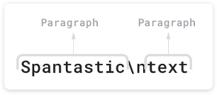

# 属性字符串（StyledString/MutableStyledString）
## 概述

属性字符串StyledString/MutableStyledString（MutableStyledString继承于StyledString，以下统一简称StyledString）是功能强大的标记对象，可用于字符或段落级别设置文本样式。通过将StyledString附加到文本组件，您可以通过多种方式更改文本，包括修改字号、添加字体颜色、使文本可点击以及自定义方式绘制文本等。具体用法可参考[StyledString](../reference/apis-arkui/arkui-ts/ts-universal-styled-string.md#属性字符串)。

Arkts提供多种类型样式对象，涵盖各种常见的文本样式格式。您也可以创建自己的CustomSpan, 以应用自定义样式。 

- 创建并应用StyledString和MutableStyledString

  从示例可见，您可以通过TextController提供的setStyledString(StyledString)方法将属性字符串附加到文本组件，并推荐您在onPageShow中触发绑定，在aboutToAppear中调用setStyledString无法实现页面初始即可见属性字符串文本内容，因为aboutToAppear运行时组件还没有完成创建并成功挂载节点树。

  ```ts
  @Entry
  @Component
  struct styled_string_demo1 {
    styledString1: StyledString = new StyledString("运动45分钟");
    mutableStyledString1: MutableStyledString = new MutableStyledString("运动35分钟");
    controller1: TextController = new TextController();
    controller2: TextController = new TextController();

    async onPageShow() {
      this.controller1.setStyledString(this.styledString1)
      this.controller2.setStyledString(this.mutableStyledString1)
    }

    build() {
      Column() {
        // 显示属性字符串
        Text(undefined, { controller: this.controller1 })
        Text(undefined, { controller: this.controller2 })
      }
      .width('100%')
    }
  }
  ```

## 设置文本样式

Arkts目前提供了TextStyle、TextShadowStyle、DecorationStyle、BaselineOffsetStyle、LineHeightStyle、LetterSpacingStyle各种Style对象来实现设置文本的各类样式。

- 创建及应用TextStyle

  ```ts
  // xxx.ets
  @Entry
  @Component
  struct styled_string_demo2 {
    mutableStyledString: MutableStyledString = new MutableStyledString("运动35分钟", [
    {
      start: 0,
      length: 3,
      styledKey: StyledStringKey.FONT,
      styledValue: new TextStyle({ fontColor: Color.Pink })
    }
    ]);
    controller: TextController = new TextController();

    async onPageShow() {
      this.controller.setStyledString(this.mutableStyledString)
    }

    build() {
      Column() {
        // 显示属性字符串
        Text(undefined, { controller: this.controller })
      }
      .width('100%')
    }
  }
  ```

- 创建及应用TextShadowStyle

  ```ts
  // xxx.ets
  @Entry
  @Component
  struct styled_string_demo3 {
    mutableStyledString: MutableStyledString = new MutableStyledString("运动35分钟", [
    {
      start: 0,
      length: 3,
      styledKey: StyledStringKey.TEXT_SHADOW,
      styledValue: new TextShadowStyle({
        radius: 5,
        type: ShadowType.COLOR,
        color: Color.Red,
        offsetX: 10,
        offsetY: 10
      })
    }
    ]);
    controller: TextController = new TextController();

    async onPageShow() {
      this.controller.setStyledString(this.mutableStyledString)
    }

    build() {
      Column() {
        // 显示属性字符串
        Text(undefined, { controller: this.controller })
      }
      .width('100%')
    }
  }
  ```

- 创建及应用DecorationStyle

  ```ts
  // xxx.ets
  @Entry
  @Component
  struct styled_string_demo4 {
    mutableStyledString: MutableStyledString = new MutableStyledString("运动35分钟", [
    {
      start: 0,
      length: 3,
      styledKey: StyledStringKey.DECORATION,
      styledValue: new DecorationStyle({type: TextDecorationType.LineThrough, color: Color.Red})
    }
    ]);
    controller: TextController = new TextController();

    async onPageShow() {
      this.controller.setStyledString(this.mutableStyledString)
    }

    build() {
      Column() {
        // 显示属性字符串
        Text(undefined, { controller: this.controller })
      }
      .width('100%')
    }
  }
  ```

- 创建及应用BaselineOffsetStyle

  ```ts
  import { LengthMetrics, LengthUnit } from '@ohos.arkui.node'
  // xxx.ets
  @Entry
  @Component
  struct styled_string_demo5 {
    mutableStyledString: MutableStyledString = new MutableStyledString("运动35分钟", [
      {
        start: 0,
        length: 3,
        styledKey: StyledStringKey.BASELINE_OFFSET,
        styledValue: new BaselineOffsetStyle(LengthMetrics.px(20))
      }
    ]);
    controller: TextController = new TextController();

    async onPageShow() {
      this.controller.setStyledString(this.mutableStyledString)
    }

    build() {
      Column() {
        // 显示属性字符串
        Text(undefined, { controller: this.controller })
      }
      .width('100%')
    }
  }
  ```

- 创建及应用LineHeightStyle

  ```ts
  import { LengthMetrics, LengthUnit } from '@ohos.arkui.node'
  // xxx.ets
  @Entry
  @Component
  struct styled_string_demo6 {
    mutableStyledString: MutableStyledString = new MutableStyledString("运动35分钟\n顶顶顶\n得到", [
      {
        start: 8,
        length: 3,
        styledKey: StyledStringKey.LINE_HEIGHT,
        styledValue: new LineHeightStyle(LengthMetrics.vp(50))
      }
    ]);
    controller: TextController = new TextController();

    async onPageShow() {
      this.controller.setStyledString(this.mutableStyledString)
    }

    build() {
      Column() {
        // 显示属性字符串
        Text(undefined, { controller: this.controller })
      }
      .width('100%')
      .margin({ top: 10 })
    }
  }
  ```

- 创建及应用LetterSpacingStyle

  ```ts
  import { LengthMetrics, LengthUnit } from '@ohos.arkui.node'
  // xxx.ets
  @Entry
  @Component
  struct styled_string_demo7 {
    mutableStyledString: MutableStyledString = new MutableStyledString("运动35分钟", [
      {
        start: 0,
        length: 2,
        styledKey: StyledStringKey.LETTER_SPACING,
        styledValue: new LetterSpacingStyle(new LengthMetrics(20, LengthUnit.VP))
      }
    ]);
    controller: TextController = new TextController();

    async onPageShow() {
      this.controller.setStyledString(this.mutableStyledString)
    }

    build() {
      Column() {
        // 显示属性字符串
        Text(undefined, { controller: this.controller })
      }
      .width('100%')
    }
  }
  ```

## 设置段落样式

可通过ParagraphStyle设置段落样式布局。下图显示了Arkts如何分割文本中的段落，段落以换行符 \n 结尾。



以下代码示例将 ParagraphStyle 应用于段落。请注意，如果您将 ParagraphStyle 附加到段落开头末尾或之间的任何位置均会应用样式，非段落区间内则不会应用样式。

  ```ts
  
  ```

## 使用事件

可通过GestureStyle设置onClick、onLongPress事件来使文本可点击可长按。

- 创建GestureStyle

  ```ts
  
  ```


## 使用图片

可通过ImageAttachment来绑定图片。

- 创建ImageAttachment

  ```ts

  ```

## 使用自定义绘制

可通过CustomSpan来实现自定义绘制。

以下示例展示了如何创建自定义Span。您可以通过继承[CustomSpan](../reference/apis-arkui/arkui-ts/ts-universal-styled-string.md#customspan)定义一个自己的Span，在自定义Span中重写onDraw和onMeasure来实现自定义绘制的效果。

```ts
import drawing from '@ohos.graphics.drawing';

class MyCustomSpan extends CustomSpan {
  constructor(word: string, width: number, height: number) {
    super();
    this.word = word;
    this.width = width
    this.height = height
  }

  onMeasure(measureInfo: CustomSpanMeasureInfo): CustomSpanMetrics {
    return { width: this.width, height: this.height }
  }

  onDraw(context: DrawContext, options: CustomSpanDrawInfo) {
    let canvas = context.canvas;

    const brush = new drawing.Brush();
    brush.setColor({ alpha: 255, red: 0, green: 0, blue: 0 })
    const font = new drawing.Font()
    font.setSize(px2fp(60))
    const textBlob = drawing.TextBlob.makeFromString(this.word.substr(0, 5), font, drawing.TextEncoding.TEXT_ENCODING_UTF8)
    canvas.attachBrush(brush)

    this.onDrawRectByRadius(context, options.x, options.x + vp2px(this.width), options.lineTop, options.lineBottom, 20)
    brush.setColor({ alpha: 255, red: 255, green: 255, blue: 255 })
    canvas.attachBrush(brush)
    canvas.drawTextBlob(textBlob, options.x, options.lineBottom - 15)
    brush.setColor({ alpha: 255, red: 255, green: 228 , blue: 196 })
    canvas.attachBrush(brush)
    const textBlob1 = drawing.TextBlob.makeFromString(this.word.substr(6), font, drawing.TextEncoding.TEXT_ENCODING_UTF8)
    canvas.drawTextBlob(textBlob1, options.x + 130, options.lineBottom - 15)

    canvas.detachBrush()
  }
  onDrawRectByRadius(context: DrawContext, left: number, right: number, top: number, bottom: number, radius: number) {
    let canvas = context.canvas
    let path = new drawing.Path()

    // 画带radius的rect
    path.moveTo(left  + radius, top)
    path.lineTo(right - radius, top)
    path.arcTo(right - 2 * radius, top, right, top + 2 * radius, 270, 90)
    path.lineTo(right, bottom - radius)
    path.arcTo(right - 2 * radius, bottom - 2 * radius, right, bottom, 0, 90)

    path.lineTo(left + 2 * radius, bottom)
    path.arcTo(left, bottom - 2 * radius, left + 2 * radius, bottom, 90, 90)
    path.lineTo(left, top + 2 * radius)
    path.arcTo(left, top, left + 2 * radius, top + 2 * radius, 180, 90)

    canvas.drawPath(path)
  }
  setWord(word: string) {
    this.word = word;
  }

  width: number = 160
  word: string = "drawing"
  height: number = 10
}

@Entry
@Component
struct styled_string_demo6 {
  customSpan3: MyCustomSpan = new MyCustomSpan("88VIP 9.5折", 150, 40)
  textStyle: MutableStyledString = new MutableStyledString("123");
  textController: TextController = new TextController()
  isPageShow: boolean = true
  
  async onPageShow() {
    if (!this.isPageShow) {
      return
    }
    this.isPageShow = false
    this.textController.setStyledString(new StyledString(this.customSpan3))
  }

  build() {
    Row() {
      Column() {
        Text(undefined, { controller: this.textController })
          .copyOption(CopyOptions.InApp)
          .fontSize(30)
      }
      .width('100%')
    }
    .height('100%')
  }
}
```
