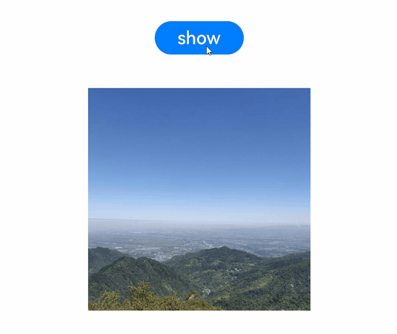
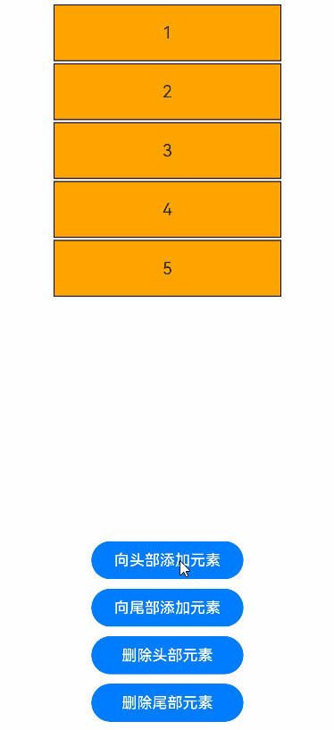

# 组件内转场动画


组件的插入、删除过程即为组件本身的转场过程，组件的插入、删除动画称为组件内转场动画。通过组件内转场动画，可定义组件出现、消失的效果。


组件内转场动画的接口为：


```ts
transition(value: TransitionOptions)
```


[transition](../reference/arkui-ts/ts-transition-animation-component.md)函数的入参为组件内转场的效果，可以定义平移、透明度、旋转、缩放这几种转场样式的单个或者组合的转场效果，必须和[animateTo](arkts-layout-update-animation.md#使用显式动画产生布局更新动画)一起使用才能产生组件转场效果。


## transition常见用法

type用于指定当前的transition动效生效在组件的变化场景，类型为[TransitionType](../reference/arkui-ts/ts-appendix-enums.md#transitiontype)。

- 组件的插入、删除使用同一个动画效果

  ```ts
  Button()
    .transition({ type: TransitionType.All, scale: { x: 0, y: 0 } })
  ```

  当type属性为TransitionType.All时，表示指定转场动效生效在组件的所有变化（插入和删除）场景。此时，删除动画和插入动画是相反的过程，删除动画是插入动画的逆播。例如，以上代码定义了一个Button控件。在插入时，组件从scale的x、y均为0的状态，变化到scale的x、y均为1（即完整显示）的默认状态，以逐渐放大的方式出现。在删除时，组件从scale的x、y均为1的默认状态，变化到指定的scale的x、y均为0的状态，逐渐缩小至尺寸为0。


- 组件的插入、删除使用不同的动画效果

  ```ts
  Button()
    .transition({ type: TransitionType.Insert, translate: { x: 200, y: -200 }, opacity: 0 })
    .transition({ type: TransitionType.Delete, rotate: { x: 0, y: 0, z: 1, angle: 360 } })
  ```

  当组件的插入和删除需要实现不同的转场动画效果时，可以调用两次transition函数，分别设置type属性为TransitionType.Insert和TransitionType.Delete。例如，以上代码定义了一个Button控件。在插入时，组件从相对于组件正常布局位置x方向平移200vp、y方向平移-200vp的位置、透明度为0的初始状态，变化到x、y方向平移量为0、透明度为1的默认状态，插入动画为平移动画和透明度动画的组合。在删除时，组件从旋转角为0的默认状态，变化到绕z轴旋转360度的终止状态，即绕z轴旋转一周。


- 只定义组件的插入或删除其中一种动画效果。

  ```ts
  Button()
    .transition({ type: TransitionType.Delete, translate: { x: 200, y: -200 } })
  ```

  当只需要组件的插入或删除的转场动画效果时，仅需设置type属性为TransitionType.Insert或TransitionType.Delete的transition效果。例如，以上代码定义了一个Button控件。删除时，组件从正常位置、没有平移的默认状态，变化到从相对于正常布局位置x方向平移200vp、y方向平移-200vp的位置的状态。插入该组件并不会产生该组件的转场动画。


## if/else产生组件内转场动画

if/else语句可以控制组件的插入和删除。如下代码即可通过Button的点击事件，控制if的条件是否满足，来控制if下的Image组件是否显示。


```ts
@Entry
@Component
struct IfElseTransition {
  @State flag: boolean = true;
  @State show: string = 'show';

  build() {
    Column() {
      Button(this.show).width(80).height(30).margin(30)
        .onClick(() => {
          if (this.flag) {
            this.show = 'hide';
          } else {
            this.show = 'show';
          }
          // 点击Button控制Image的显示和消失
          this.flag = !this.flag;
        })
      if (this.flag) {
          Image($r('app.media.mountain')).width(200).height(200)
      }
    }.height('100%').width('100%')
  }
}
```


以上代码没有配置任何动画。接下来，我们将给以上代码加入组件内转场的效果。首先Image组件是由if控制的组件，需要给其加上transition的参数，以指定组件内转场的具体效果。例如，可以如以下代码，给其插入时加上平移效果，删除时加上缩放和透明度效果。


```ts
if (this.flag) {
  Image($r('app.media.mountain')).width(200).height(200)
    .transition({ type: TransitionType.Insert, translate: { x: 200, y: -200 } })
    .transition({ type: TransitionType.Delete, opacity: 0, scale: { x: 0, y: 0 } })
}
```


以上代码虽然指定了动画的样式，但是未指定动画参数，尚不知道需要用多长时间、怎样的曲线完成该动画。transition必须配合animateTo一起使用，并在animateTo的闭包中，控制组件的插入、删除。对于以上示例代码，即为在animateTo闭包中改变flag的值，该部分代码如下所示。指定动画时长为1000ms，曲线使用animateTo函数默认的曲线，改变flag的值。则由flag变化所引起的一切变化，都会按照该动画参数，产生动画。在这里，flag会影响Image的出现和消失。


```ts
animateTo({ duration: 1000 }, () => {
  this.flag = !this.flag;
})
```


经过以上过程，当animateTo和transition一起使用时，即产生了组件内转场动画。完整示例代码如下：


```ts
@Entry
@Component
struct IfElseTransition {
  @State flag: boolean = true;
  @State show: string = 'show';

  build() {
    Column() {
      Button(this.show).width(80).height(30).margin(30)
        .onClick(() => {
          if (this.flag) {
            this.show = 'hide';
          } else {
            this.show = 'show';
          }
          
          animateTo({ duration: 1000 }, () => {
            // 动画闭包内控制Image组件的出现和消失
            this.flag = !this.flag;
          })
        })
      if (this.flag) {
        // Image的出现和消失配置为不同的过渡效果
        Image($r('app.media.mountain')).width(200).height(200)
          .transition({ type: TransitionType.Insert, translate: { x: 200, y: -200 } })
          .transition({ type: TransitionType.Delete, opacity: 0, scale: { x: 0, y: 0 } })
      }
    }.height('100%').width('100%')
  }
}
```





>**说明：**
>
>当配置transition的效果为translate或scale时，本身位置叠加上平移或放大倍数后，动画过程中有可能超过父组件的范围。如果超出父组件的范围时，希望子组件完整的显示，那么可以设置父组件的clip属性为false，使父组件不对子组件产生裁剪。如果超出父组件的范围时，希望超出的子组件部分不显示，那么可以设置父组件的clip属性为true，裁剪掉子组件超出的部分。


## ForEach产生组件内转场动画

和if/else类似，ForEach可以通过控制数组中的元素个数，来控制组件的插入和删除。通过ForEach来产生组件内转场动画，仍然需要两个条件：

- ForEach里的组件配置了transition效果。

- 在animateTo的闭包中控制组件的插入或删除，即控制数组的元素添加和删除。


以下代码是使用ForEach产生组件内转场动画的一个示例。


```ts
@Entry
@Component
struct ForEachTransition {
  @State numbers: string[] = ["1", "2", "3", "4", "5"]
  startNumber: number = 6;

  build() {
    Column({ space: 10 }) {
      Column() {
        ForEach(this.numbers, (item) => {
          // ForEach下的直接组件需配置transition效果
          Text(item)
            .width(240)
            .height(60)
            .fontSize(18)
            .borderWidth(1)
            .backgroundColor(Color.Orange)
            .textAlign(TextAlign.Center)
            .transition({ type: TransitionType.All, translate: { x: 200 }, scale: { x: 0, y: 0 } })
        }, item => item)
      }
      .margin(10)
      .justifyContent(FlexAlign.Start)
      .alignItems(HorizontalAlign.Center)
      .width("90%")
      .height("70%")

      Button('向头部添加元素')
        .fontSize(16)
        .width(160)
        .onClick(() => {
          animateTo({ duration: 1000 }, () => {
            // 往数组头部插入一个元素，导致ForEach在头部增加对应的组件
            this.numbers.unshift(this.startNumber.toString());
            this.startNumber++;
          })
        })
      Button('向尾部添加元素')
        .width(160)
        .fontSize(16)
        .onClick(() => {
          animateTo({ duration: 1000 }, () => {
            // 往数组尾部插入一个元素，导致ForEach在尾部增加对应的组件
            this.numbers.push(this.startNumber.toString());
            this.startNumber++;
          })
        })
      Button('删除头部元素')
        .width(160)
        .fontSize(16)
        .onClick(() => {
          animateTo({ duration: 1000 }, () => {
            // 删除数组的头部元素，导致ForEach删除头部的组件
            this.numbers.shift();
          })
        })
      Button('删除尾部元素')
        .width(160)
        .fontSize(16)
        .onClick(() => {
          animateTo({ duration: 1000 }, () => {
            // 删除数组的尾部元素，导致ForEach删除尾部的组件
            this.numbers.pop();
          })
        })
    }
    .width('100%')
    .height('100%')
  }
}
```


效果如下图：





由于Column布局方式设为了FlexAlign.Start，即竖直方向从头部开始布局。所以往数组末尾添加元素时，并不会对数组中现存元素对应的组件位置造成影响，只会触发新增组件的插入动画。而往数组头部添加元素时，原来数组中的所有元素的下标都增加了，虽然不会触发其添加或者删除，但是会影响到对应组件的位置。所以除新增的组件会做transition动画以外，之前存在于ForEach中组件也会做位置动画。


>**说明：**
>
>if/else、ForEach为语法节点，配置组件内转场效果的组件应直接作为语法节点的孩子。由语法节点的增删引起的组件增删，只能触发其直接孩子组件的组件内转场动画，开发者不应期望其对更深层次的组件产生组件转场动画。
