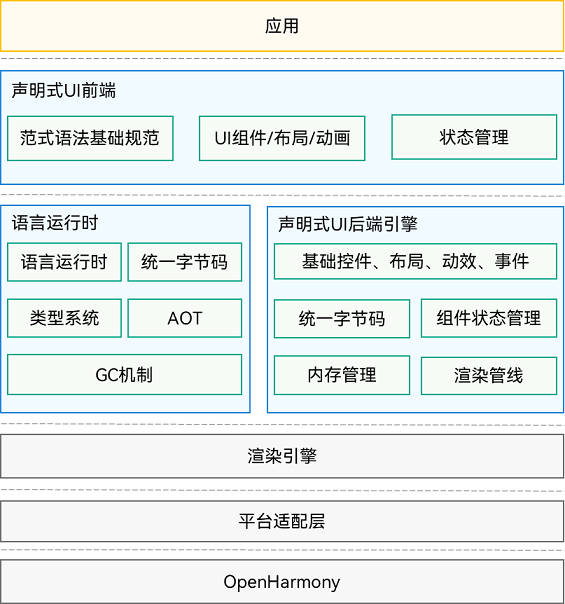

# UI开发（ArkTS声明式开发范式）概述

基于ArkTS的声明式开发范式的方舟开发框架是一套开发极简、高性能、支持跨设备的UI开发框架，提供了构建OpenHarmony应用UI所必需的能力，主要包括：

- **ArkTS**

  ArkTS是UI开发语言，基于TypeScript（简称TS）语言扩展而来，是TS的超集。扩展能力包含各种装饰器、自定义组件、UI描述机制。状态数据管理作为基于ArkTS的声明式开发范式的特色，通过功能不同的装饰器给开发者提供了清晰的页面更新渲染流程和管道。状态管理包括UI组件状态和应用程序状态，两者协作可以使开发者完整地构建整个应用的数据更新和UI渲染。ArkTS语言的基础知识请参考[学习ArkTS语言](../quick-start/arkts-get-started.md)。

- **布局**

  布局是UI的必要元素，它定义了组件在界面中的位置。ArkUI框架提供了多种布局方式，除了基础的线性布局、层叠布局、弹性布局、相对布局、栅格布局外，也提供了相对复杂的列表、宫格、轮播。

- **组件**

  组件是UI的必要元素，形成了在界面中的样子，由框架直接提供的称为**系统组件**，由开发者定义的称为**自定义组件**。系统内置组件包括按钮、单选框、进度条、文本等。开发者可以通过链式调用的方式设置系统内置组件的渲染效果。开发者可以将系统内置组件组合为自定义组件，通过这种方式将页面组件化为一个个独立的UI单元，实现页面不同单元的独立创建、开发和复用，具有更强的工程性。

- **页面路由和组件导航**

  应用可能包含多个页面，可通过页面路由实现页面间的跳转。一个页面内可能存在组件间的导航如典型的分栏，可通过导航组件实现组件间的导航。

- **图形**

  方舟开发框架提供了多种类型图片的显示能力和多种自定义绘制的能力，以满足开发者的自定义绘图需求，支持绘制形状、填充颜色、绘制文本、变形与裁剪、嵌入图片等。

- **动画**

  动画是UI的重要元素之一。优秀的动画设计能够极大地提升用户体验，框架提供了丰富的动画能力，除了组件内置动画效果外，还包括属性动画、显式动画、自定义转场动画以及动画API等，开发者可以通过封装的物理模型或者调用动画能力API来实现自定义动画轨迹。

- **交互事件**

  交互事件是UI和用户交互的必要元素。方舟开发框架提供了多种交互事件，除了触摸事件、鼠标事件、键盘按键事件、焦点事件等通用事件外，还包括基于通用事件进行进一步识别的手势事件。手势事件有单一手势如点击手势、长按手势、拖动手势、捏合手势、旋转手势、滑动手势，以及通过单一手势事件进行组合的组合手势事件。

## 特点

- 开发效率高，开发体验好
  - 代码简洁：通过接近自然语义的方式描述UI，不必关心框架如何实现UI绘制和渲染。
  - 数据驱动UI变化：让开发者更专注自身业务逻辑的处理。当UI发生变化时，开发者无需编写在不同的UI之间进行切换的UI代码， 开发人员仅需要编写引起界面变化的数据，具体UI如何变化交给框架。
  - 开发体验好：界面也是代码，让开发者的编程体验得到提升。

- 性能优越
  - 声明式UI前端和UI后端分层：UI后端采用C++语言构建，提供对应前端的基础组件、布局、动效、交互事件、组件状态管理和渲染管线。
  - 语言编译器和运行时的优化：统一字节码、高效FFI-Foreign Function Interface、AOT-Ahead Of Time、引擎极小化、类型优化等。

- 生态容易快速推进
  能够借力主流语言生态快速推进，语言相对中立友好，有相应的标准组织可以逐步演进。

## 整体架构

  **图1** 整体架构图  

- **声明式UI前端**
  提供了UI开发范式的基础语言规范，并提供内置的UI组件、布局和动画，提供了多种状态管理机制，为应用开发者提供一系列接口支持。

- **语言运行时**
  选用方舟语言运行时，提供了针对UI范式语法的解析能力、跨语言调用支持的能力和TS语言高性能运行环境。

- **声明式UI后端引擎**
  后端引擎提供了兼容不同开发范式的UI渲染管线，提供多种基础组件、布局计算、动效、交互事件，提供了状态管理和绘制能力。

- **渲染引擎**
  提供了高效的绘制能力，将渲染管线收集的渲染指令，绘制到屏幕的能力。

- **平台适配层**
  提供了对系统平台的抽象接口，具备接入不同系统的能力，如系统渲染管线、生命周期调度等。

## 开发流程

使用UI开发框架开发应用时，主要涉及如下开发过程。开发者可以先通过[第一个入门](../quick-start/start-with-ets-stage.md)实例了解整个应用的UI开发过程。

| 任务          | 简介                                  | 相关指导                                     |
| ----------- | ----------------------------------- | ---------------------------------------- |
| 学习ArkTS     | 介绍了ArkTS的基本语法、状态管理和渲染控制的场景。         | - [基本语法](../quick-start/arkts-basic-syntax-overview.md) - [状态管理](../quick-start/arkts-state-management-overview.md) - [渲染控制](../quick-start/arkts-rendering-control-overview.md) |
| 开发布局        | 介绍了几种常用的布局方式以及如何提升布局性能。             | -&nbsp;[常用布局](arkts-layout-development-overview.md) -&nbsp;[布局性能](arkts-layout-development-performance-boost.md) |
| 添加组件        | 介绍了几种常用的内置组件、自定义组件以及通过API方式支持的界面元素。 | -&nbsp;[常用组件](arkts-common-components-button.md) - [自定义组件](../quick-start/arkts-create-custom-components.md) -&nbsp;[气泡和菜单](arkts-popup-and-menu-components-popup.md) |
| 设置页面路由和组件导航 | 介绍了如何设置页面路由以及组件间的导航。                | -&nbsp;[页面路由](arkts-routing.md) -&nbsp;[组件导航](arkts-navigation-navigation.md) |
| 显示图形        | 介绍了如何显示图片、绘制自定义几何图形以及使用画布绘制自定义图形。   | -&nbsp;[图片](arkts-graphics-display.md) -&nbsp;[几何图形](arkts-geometric-shape-drawing.md) -&nbsp;[画布](arkts-drawing-customization-on-canvas.md) |
| 使用动画        | 介绍了组件和页面使用动画的典型场景。                  | -&nbsp;[页面内的动画](arkts-layout-update-animation.md) -&nbsp;[页面间的动画](arkts-zoom-animation.md) |
| 绑定事件        | 介绍了事件的基本概念和如何使用通用事件和手势事件。           | -&nbsp;[通用事件](arkts-common-events-touch-screen-event.md) -&nbsp;[手势事件](arkts-gesture-events-binding.md) |
