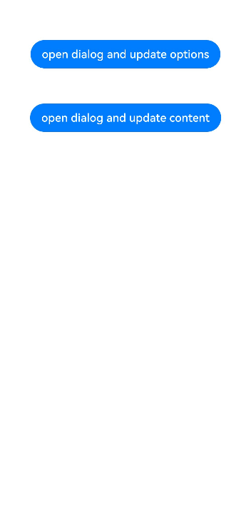

# 不依赖UI组件的全局自定义弹出框 (openCustomDialog)（推荐）

推荐使用UIContext中获取到的PromptAction对象提供的[openCustomDialog](../reference/apis-arkui/arkts-apis-uicontext-promptaction.md#opencustomdialog12)接口在相对应用复杂的场景来实现自定义弹出框，相较于[CustomDialogController](../reference/apis-arkui/arkui-ts/ts-methods-custom-dialog-box.md#customdialogcontroller)优势点在于页面解耦，支持[动态刷新](../reference/apis-arkui/js-apis-arkui-ComponentContent.md#update)。

> **说明：**
> 
> 弹出框（openCustomDialog）存在两种入参方式创建自定义弹出框：
> - openCustomDialog（传参为ComponentContent形式）：通过ComponentContent封装内容可以与UI界面解耦，调用更加灵活，可以满足开发者的封装诉求。具有较高的灵活性，弹出框样式完全自定义，并且在弹出框打开后可以使用updateCustomDialog方法动态更新弹出框的参数。
> - openCustomDialog（传builder的形式）：相对于ComponentContent，builder必须要与上下文做绑定，与UI存在一定耦合。此方法有用默认的弹出框样式，适合于开发者想要实现与系统弹窗默认风格一致的效果。
> 
> 本文介绍通过入参形式为ComponentContent创建自定义弹出框，传builder形式的弹出框使用方法可参考[openCustomDialog](../reference/apis-arkui/arkts-apis-uicontext-promptaction.md#opencustomdialog12-1)。

弹出框（openCustomDialog）默认为模态弹窗且有蒙层，不可与蒙层下方控件进行交互（不支持点击和手势等向下透传）。可以通过配置[isModal](../reference/apis-arkui/arkts-apis-uicontext-promptaction.md#opencustomdialog12)来实现模态和非模态弹窗，详细说明可参考[弹窗的种类](arkts-dialog-overview.md#弹窗的种类)。

当isModal为true时，弹出框为模态弹窗，且弹窗周围的蒙层区不支持透传。isModal为false时，弹出框为非模态弹窗，且弹窗周围的蒙层区可以透传。因此如果需要同时允许弹出框的交互和弹出框外页面的交互行为，需要将弹出框设置为非模态。

## 生命周期

弹出框提供了生命周期函数用于通知用户该弹出框的生命周期。生命周期的触发时序依次为：onWillAppear -> onDidAppear -> onWillDisappear -> onDidDisappear。

| 名称            |类型| 说明                       |
| ----------------- | ------ | ---------------------------- |
| onDidAppear    | () => void  | 弹出框弹出时的事件回调。    |
| onDidDisappear |() => void  | 弹出框消失时的事件回调。    |
| onWillAppear    | () => void | 弹出框显示动效前的事件回调。 |
| onWillDisappear | () => void | 弹出框退出动效前的事件回调。 |

## 自定义弹出框的打开与关闭

> **说明：**
> 
> 详细变量定义请参考[完整示例](#完整示例)。

1. 创建ComponentContent。
   
   ComponentContent用于定义自定义弹出框的内容。其中，wrapBuilder(buildText)封装自定义组件，new Params(this.message)是自定义组件的入参，可以缺省，也可以传入基础数据类型。
   
   ```ts
   private contentNode: ComponentContent<Object> = new ComponentContent(this.ctx, wrapBuilder(buildText), new Params(this.message));
   ```
2. 打开自定义弹出框。
   
   调用openCustomDialog接口打开的弹出框默认customStyle为true，即弹出框的内容样式完全按照contentNode自定义样式显示。
   
   ```ts
   PromptActionClass.ctx.getPromptAction().openCustomDialog(PromptActionClass.contentNode, PromptActionClass.options)
     .then(() => {
       console.info('OpenCustomDialog complete.');
     })
     .catch((error: BusinessError) => {
       let message = (error as BusinessError).message;
       let code = (error as BusinessError).code;
       console.error(`OpenCustomDialog args error code is ${code}, message is ${message}`);
     })
   ```
3. 关闭自定义弹出框。
   
   由于closeCustomDialog接口需要传入待关闭弹出框对应的ComponentContent。因此，如果需要在弹出框中设置关闭方法，则可参考完整示例封装静态方法来实现。
   
   关闭弹出框之后若需要释放对应的ComponentContent，则需要调用ComponentContent的[dispose](../reference/apis-arkui/js-apis-arkui-ComponentContent.md#dispose)方法。
   
   ```ts

   PromptActionClass.ctx.getPromptAction().closeCustomDialog(PromptActionClass.contentNode)
     .then(() => {
       console.info('CloseCustomDialog complete.');
       if (this.contentNode !== null) {
            this.contentNode.dispose();   // 释放contentNode
        }
     })
     .catch((error: BusinessError) => {
       let message = (error as BusinessError).message;
       let code = (error as BusinessError).code;
       console.error(`CloseCustomDialog args error code is ${code}, message is ${message}`);
     })
   ```

## 更新自定义弹出框的内容

ComponentContent与[BuilderNode](../reference/apis-arkui/js-apis-arkui-builderNode.md)有相同的使用限制，不支持自定义组件使用[@Reusable](../../application-dev/ui/state-management/arkts-create-custom-components.md#自定义组件的基本结构)、[@Link](../../application-dev/ui/state-management/arkts-link.md)、[@Provide](../../application-dev/ui/state-management/arkts-provide-and-consume.md)、[@Consume](../../application-dev/ui/state-management/arkts-provide-and-consume.md)等装饰器，来同步弹出框弹出的页面与ComponentContent中自定义组件的状态。因此，若需要更新弹出框中自定义组件的内容可以通过ComponentContent提供的update方法来实现。

```ts
this.contentNode.update(new Params('update'))
```

## 更新自定义弹出框的属性

通过updateCustomDialog可以动态更新弹出框的属性。目前支持更新弹出框的对齐方式、基于对齐方式的偏移量、是否点击蒙层自动关闭以及蒙层颜色，对应的属性分别为alignment、offset、autoCancel、maskColor。

更新属性时，未设置的属性会恢复为默认值。例如，初始设置{ alignment: DialogAlignment.Top, offset: { dx: 0, dy: 50 } }，更新时设置{ alignment: DialogAlignment.Bottom }，则初始设置的offset: { dx: 0, dy: 50 }不会保留，会恢复为默认值。

```ts
PromptActionClass.ctx.getPromptAction().updateCustomDialog(PromptActionClass.contentNode, options)
  .then(() => {
    console.info('UpdateCustomDialog complete.');
  })
  .catch((error: BusinessError) => {
    let message = (error as BusinessError).message;
    let code = (error as BusinessError).code;
    console.error(`UpdateCustomDialog args error code is ${code}, message is ${message}`);
  })
```

## 为弹出框内容和蒙层设置不同的动画效果

当弹出框出现时，内容与蒙层显示动效一致。若开发者希望为弹出框内容及蒙层设定不同动画效果，从API version 19开始，可通过[BaseDialogOptions](../reference/apis-arkui/js-apis-promptAction.md#basedialogoptions11)中dialogTransition和maskTransition属性单独配置弹窗内容与蒙层的动画。具体的动画效果请参考[组件内转场 (transition)](../reference/apis-arkui/arkui-ts/ts-transition-animation-component.md)。

> **说明：** 
>
> 当isModal为true时，蒙层将显示，此时可以设置蒙层的动画效果；否则，maskTransition将不生效。

```ts
import { BusinessError } from '@kit.BasicServicesKit';

@Entry
@Component
struct Index {
  private customDialogComponentId: number = 0
  @Builder
  customDialogComponent() {
    Row({ space: 50 }) {
      Button("这是一个弹窗")
    }.height(200).padding(5)
  }

  build() {
    Row() {
      Row({ space: 20 }) {
        Text('打开弹窗')
          .fontSize(30)
          .onClick(() => {
            this.getUIContext().getPromptAction().openCustomDialog({
              builder: () => {
                this.customDialogComponent()
              },
              isModal:true,
              showInSubWindow:false,
              maskColor: Color.Pink,
              maskRect:{ x: 20, y: 20, width: '90%', height: '90%' },

              dialogTransition: // 设置弹窗内容显示的过渡效果
              TransitionEffect.translate({ x: 0, y: 290, z: 0 })
                .animation({ duration: 4000, curve: Curve.Smooth }),// 四秒钟的偏移渐变动画

              maskTransition: // 设置蒙层显示的过渡效果
              TransitionEffect.opacity(0)
                .animation({ duration: 4000, curve: Curve.Smooth }) // 四秒钟的透明渐变动画

            }).then((dialogId: number) => {
              this.customDialogComponentId = dialogId
            })
              .catch((error: BusinessError) => {
                console.error(`openCustomDialog error code is ${error.code}, message is ${error.message}`)
              })
          })
      }
      .width('100%')
    }
    .height('100%')
  }
}
```

 

## 设置弹出框避让软键盘的距离

为显示弹出框的独立性，弹出框弹出时会与周边进行避让，包括状态栏、导航条以及键盘等留有间距。故当软键盘弹出时，默认情况下，弹出框会自动避开软键盘，并与之保持16vp的距离。从API version 15开始，开发者可以利用[BaseDialogOptions](../reference/apis-arkui/js-apis-promptAction.md#basedialogoptions11)中的keyboardAvoidMode和keyboardAvoidDistance这两个配置项，来设置弹出框在软键盘弹出时的行为，包括是否需要避开软键盘以及与软键盘之间的距离。

设置软键盘间距时，需要将keyboardAvoidMode值设为KeyboardAvoidMode.DEFAULT。

```ts
import { BusinessError } from '@kit.BasicServicesKit';
import { LengthMetrics } from '@kit.ArkUI'

@Entry
@Component
struct Index {
  @Builder
  customDialogComponent() {
      Column() {
        Text('keyboardAvoidDistance: 0vp')
          .fontSize(20)
          .margin({ bottom: 36 })
        TextInput({ placeholder: '' })
      }.backgroundColor('#FFF0F0F0')
  }

  build() {
    Row() {
      Row({ space: 20 }) {
        Text('打开弹窗')
          .fontSize(30)
          .onClick(() => {
            this.getUIContext().getPromptAction().openCustomDialog({
              builder: () => {
                this.customDialogComponent()
              },
              alignment:DialogAlignment.Bottom,
              keyboardAvoidMode: KeyboardAvoidMode.DEFAULT, // 软键盘弹出时，弹出框自动避让
              keyboardAvoidDistance: LengthMetrics.vp(0) // 软键盘弹出时与弹出框的距离为0vp
            }).catch((error: BusinessError) => {
                console.error(`openCustomDialog error code is ${error.code}, message is ${error.message}`)
              })
          })
      }
      .width('100%')
    }
    .height('100%')
  }
}
```

 


## 完整示例

```ts
// PromptActionClass.ets
import { BusinessError } from '@kit.BasicServicesKit';
import { ComponentContent, promptAction, UIContext } from '@kit.ArkUI';

export class PromptActionClass {
  static ctx: UIContext;
  static contentNode: ComponentContent<Object>;
  static options: promptAction.BaseDialogOptions;

  static setContext(context: UIContext) {
    PromptActionClass.ctx = context;
  }

  static setContentNode(node: ComponentContent<Object>) {
    PromptActionClass.contentNode = node;
  }

  static setOptions(options: promptAction.BaseDialogOptions) {
    PromptActionClass.options = options;
  }

  static openDialog() {
    if (PromptActionClass.contentNode !== null) {
      PromptActionClass.ctx.getPromptAction().openCustomDialog(PromptActionClass.contentNode, PromptActionClass.options)
        .then(() => {
          console.info('OpenCustomDialog complete.');
        })
        .catch((error: BusinessError) => {
          let message = (error as BusinessError).message;
          let code = (error as BusinessError).code;
          console.error(`OpenCustomDialog args error code is ${code}, message is ${message}`);
        })
    }
  }

  static closeDialog() {
    if (PromptActionClass.contentNode !== null) {
      PromptActionClass.ctx.getPromptAction().closeCustomDialog(PromptActionClass.contentNode)
        .then(() => {
          console.info('CloseCustomDialog complete.');
        })
        .catch((error: BusinessError) => {
          let message = (error as BusinessError).message;
          let code = (error as BusinessError).code;
          console.error(`CloseCustomDialog args error code is ${code}, message is ${message}`);
        })
    }
  }

  static updateDialog(options: promptAction.BaseDialogOptions) {
    if (PromptActionClass.contentNode !== null) {
      PromptActionClass.ctx.getPromptAction().updateCustomDialog(PromptActionClass.contentNode, options)
        .then(() => {
          console.info('UpdateCustomDialog complete.');
        })
        .catch((error: BusinessError) => {
          let message = (error as BusinessError).message;
          let code = (error as BusinessError).code;
          console.error(`UpdateCustomDialog args error code is ${code}, message is ${message}`);
        })
    }
  }
}
```

```ts
// Index.ets
import { ComponentContent } from '@kit.ArkUI';
import { PromptActionClass } from './PromptActionClass';

class Params {
  text: string = "";

  constructor(text: string) {
    this.text = text;
  }
}

@Builder
function buildText(params: Params) {
  Column() {
    Text(params.text)
      .fontSize(50)
      .fontWeight(FontWeight.Bold)
      .margin({ bottom: 36 })
    Button('Close')
      .onClick(() => {
        PromptActionClass.closeDialog();
      })
  }.backgroundColor('#FFF0F0F0')
}

@Entry
@Component
struct Index {
  @State message: string = "hello";
  private ctx: UIContext = this.getUIContext();
  private contentNode: ComponentContent<Object> =
    new ComponentContent(this.ctx, wrapBuilder(buildText), new Params(this.message));

  aboutToAppear(): void {
    PromptActionClass.setContext(this.ctx);
    PromptActionClass.setContentNode(this.contentNode);
    PromptActionClass.setOptions({ alignment: DialogAlignment.Top, offset: { dx: 0, dy: 50 } });
  }

  build() {
    Row() {
      Column() {
        Button("open dialog and update options")
          .margin({ top: 50 })
          .onClick(() => {
            PromptActionClass.openDialog();

            setTimeout(() => {
              PromptActionClass.updateDialog({
                alignment: DialogAlignment.Bottom,
                offset: { dx: 0, dy: -50 }
              });
            }, 1500)
          })
        Button("open dialog and update content")
          .margin({ top: 50 })
          .onClick(() => {
            PromptActionClass.openDialog();

            setTimeout(() => {
              this.contentNode.update(new Params('update'));
            }, 1500)
          })
      }
      .width('100%')
      .height('100%')
    }
    .height('100%')
  }
}
```

 


