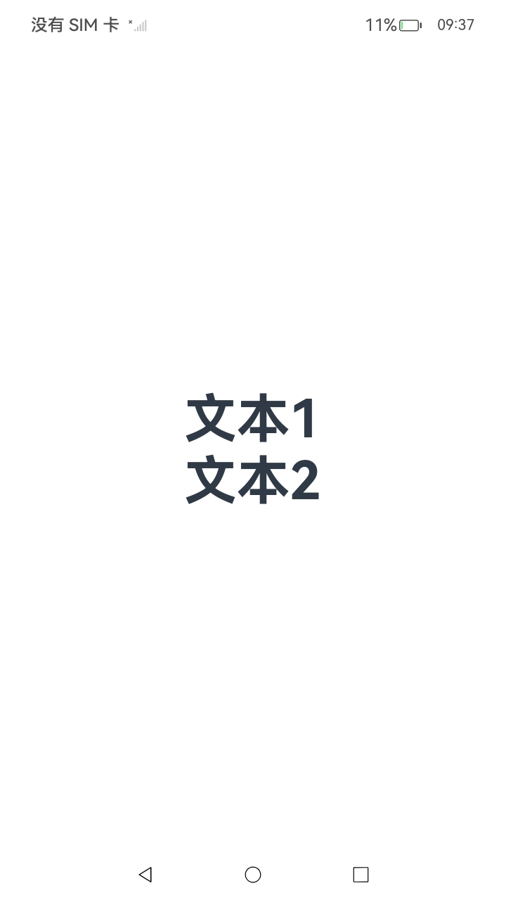

# 支持无障碍

## 概述

ArkUI提供了丰富的无障碍能力，使开发者能够创建可访问的应用界面，满足视觉、听觉、运动和认知障碍等用户的需求。

组件的无障碍属性值变化时，会触发辅助工具重新读取组件信息、无障碍服务重新扫描组件树、状态播报、虚拟节点动态更新等响应，这些机制确保辅助工具（如屏幕朗读）能及时感知并适配变化，为障碍用户提供连贯的体验。

## 设置无障碍分组

accessibilityGroup属性，用于设置是否启用无障碍分组。若启用，则该组件及其所有子组件将作为一个整体处理，无障碍服务不再单独处理各子组件。accessibilityGroup属性支持以下值：

- false（默认）：不启用无障碍分组。

- true：启用无障碍分组。

这里以Column组件为例，启用无障碍分组：

```ts
Column() {
}
.accessibilityGroup(true)
```

## 设置无障碍重要性

accessibilityLevel属性表示组件的无障碍重要性，用于控制组件是否能被无障碍服务识别，支持以下值：

- "auto"（默认）：当前组件由无障碍分组服务和ArkUI进行综合判断组件是否可被无障碍辅助服务所识别。

- "yes"：当前组件可被无障碍辅助服务所识别。

- "no"：当前组件不可被无障碍辅助服务所识别。

- "no-hide-descendants"：当前组件及其所有子组件均不可被无障碍辅助服务所识别。

这里以Column组件为例，设置其无障碍重要性为可被无障碍辅助服务所识别：

```ts
Column() {
}
.accessibilityGroup(true)
.accessibilityLevel("yes")
```

## 设置无障碍文本

accessibilityText属性用于为无文本内容的组件提供朗读文本。若组件已有文本，则优先播报无障碍文本。

支持字符串或资源引用。

这里以Column组件为例，设置其无障碍文本为“分组”：

```ts
Column() {
}
.accessibilityGroup(true)
.accessibilityLevel("yes")
.accessibilityText("分组")
```

## 设置无障碍说明

accessibilityDescription属性用于提供更详细的组件说明，播报时紧随文本内容之后。

这里以Column组件为例，设置其无障碍说明为“分组”：

```ts
Column() {
}
.accessibilityGroup(true)
.accessibilityLevel("yes")
.accessibilityText("分组")
.accessibilityDescription("Column组件可以被选中，播报的内容是“分组”")
```

## 设置无障碍虚拟子节点

accessibilityVirtualNode属性，用于为自绘制组件添加虚拟无障碍节点，辅助工具会读取这些节点的信息而非实际显示内容。

```ts
@Entry
@Component
struct VirtualNodeExample {
  @Builder customAccessibilityNode() {
    Text("文本2")
      .fontSize(50)
      .fontWeight(FontWeight.Bold)
  }

  build() {
    Column() {
      Text("文本1")
        .fontSize(50)
        .fontWeight(FontWeight.Bold)
    }
    .accessibilityGroup(true)
    .accessibilityLevel("yes")
    .accessibilityVirtualNode(this.customAccessibilityNode)
  }
}
```

## 设置无障碍节点是否被选中

accessibilityChecked和accessibilitySelected是两个用于增强无障碍体验的属性，主要用于向屏幕朗读等辅助工具传达组件的选中状态。

### 在支持多选的情况下，设置无障碍节点是否被选中

accessibilityChecked属性，用于表示组件在支持多选的情况下是否被勾选（如复选框、开关按钮等二态或三态组件），适用于需要明确“选中/未选中”语义的场景，支持以下值：

- undefined（默认）：由系统自动判断（依赖组件自身的状态，如Toggle组件的isOn属性）。

- false：未选中。

- true：选中（如复选框打勾）。

这里以Column组件为例，设置其在支持多选的情况下被选中：

```ts
Column() {
}
.accessibilityGroup(true)
.accessibilityLevel("yes")
.accessibilityText("分组")
.accessibilityDescription("Column组件可以被选中，播报的内容是“分组”")
.accessibilityChecked(true)
```

### 在支持单选的情况下，设置无障碍节点是否被选中

accessibilitySelected属性，用于表示组件在支持单选的情况下是否被选择（如单选列表项、标签页等），适用于需要区分“当前选中项”的场景（如单选组、导航菜单），支持以下值：

- undefined（默认）：由系统自动判断。

- false：未选中。

- true：当前选中。

这里以Column组件为例，设置在支持单选的情况下由系统自行确定其选中状态：

```ts
Column() {
}
.accessibilityGroup(true)
.accessibilityLevel("yes")
.accessibilityText("分组")
.accessibilityDescription("Column组件可以被选中，播报的内容是“分组”")
.accessibilitySelected(undefined)
```

### accessibilityChecked属性与accessibilitySelected属性的关键区别

在ArkUI无障碍属性中，accessibilityChecked和accessibilitySelected均用于表示组件的状态，但二者应用场景与语义含义存在本质差异。以下是二者的对比：

| 属性    | accessibilityChecked     | accessibilitySelected |
| ------- | ------------------------ | --------------------- |
| 常见场景 | 复选框、开关等二态/三态组件。 | 单选列表、标签页等互斥选择场景。 |
| 语义目标 | 控件物理状态（如开关是否打开）。 | 导航焦点项（如列表当前选中项）。 |
| 状态持久性 | 通常需显式保存（如表单提交）。 | 临时性（随焦点移动变化）。 |
| 典型组件 | Checkbox，Toggle。         | List，Tabs。        |

## 使用建议

- 优先级控制

  通过accessibilityLevel确保关键操作可被识别。

- 语义化描述

  为图标、图片等非文本元素添加accessibilityText和accessibilityDescription。

- 分组优化

  对复杂布局使用accessibilityGroup减少冗余播报。

## 场景示例

该示例主要演示accessibilityText无障碍文本和accessibilityDescription无障碍说明的播报内容。

其中，对于该组件的无障碍文本的内容，在既拥有文本属性又拥有无障碍文本属性的情况下，当组件被选中时，仅播报无障碍文本内容。

```ts
@Entry
@Component
struct Index {

  @Builder customAccessibilityNode() {
    Column() {
      Text(`virtual node`)
    }
    .width(10)
    .height(10)
  }

  build() {
    Row() {
      Column() {
        Text("文本1")
          .fontSize(50)
          .fontWeight(FontWeight.Bold)
        Text("文本2")
          .fontSize(50)
          .fontWeight(FontWeight.Bold)
      }
      .width('100%')
      .accessibilityGroup(true)
      .accessibilityLevel("yes")
      .accessibilityText("分组")
      .accessibilityDescription("Column组件可以被选中，播报的内容是“分组”")
      .accessibilityVirtualNode(this.customAccessibilityNode)
      .accessibilityChecked(true)
      .accessibilitySelected(undefined)
    }
    .height('100%')
  }
}
```


