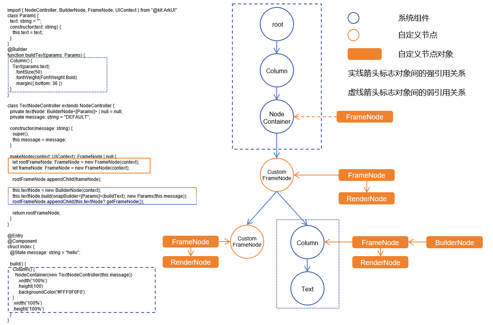

# BuilderNode

## 概述

[BuilderNode](../reference/apis-arkui/js-apis-arkui-builderNode.md)提供能够挂载原生组件的能力，支持通过无状态的UI方法[全局自定义构建函数](../quick-start/arkts-builder.md#全局自定义构建函数)@Builder生成组件树，并通过[getFrameNode](../reference/apis-arkui/js-apis-arkui-builderNode.md#getframenode)获取组件树的根[FrameNode](../reference/apis-arkui/js-apis-arkui-frameNode.md)节点。该节点可以通过[NodeController](../reference/apis-arkui/js-apis-arkui-nodeController.md)直接返回，挂载在[NodeContainer](../reference/apis-arkui/arkui-ts/ts-basic-components-nodecontainer.md)节点下，也可以在FrameNode树结构和[RenderNode](../reference/apis-arkui/js-apis-arkui-renderNode.md)树结构嵌入声明式的组件结构，实现混合显示的能力。同时BuilderNode可以提供纹理导出的功能，导出的纹理用于在[XComponent](../reference/apis-arkui/arkui-ts/ts-basic-components-xcomponent.md)中进行同层渲染显示。

BuilderNode创建的ArkTS原生控件树支持与自定义节点(例如：FrameNode、RenderNode)进行关联使用，实现了原生组件与自定义节点的混合显示。对于使用自定义节点的能力进行对接的三方框架，BuilderNode为其提供了嵌入原生组件的能力。

BuilderNode提供了组件预创建的能力，能够自定义原生组件的创建开始的时间，在后续的业务中动态挂载显示。对于一些在创建初始化耗时较长的声明式组件，比如[Web](../reference/apis-arkweb/ts-basic-components-web.md)、[XComponent](../reference/apis-arkui/arkui-ts/ts-basic-components-xcomponent.md)等，预创建可以有效减少组件初始化的耗时。



BuilderNode仅可作为叶子节点进行使用。如有更新需要，建议通过BuilderNode中的Update方式触发更新，不建议通过BuilderNode中获取的RenderNode对节点进行修改操作。

> **说明：**
> 
> - BuilderNode只支持一个由[wrapBuilder](../quick-start/arkts-wrapBuilder.md)包装的[全局自定义构建函数](../quick-start/arkts-builder.md#全局自定义构建函数)@Builder。
> 
> - 一个新建的BuildNode在[build](../reference/apis-arkui/js-apis-arkui-builderNode.md#build)之后才能通过[getFrameNode](../reference/apis-arkui/js-apis-arkui-builderNode.md#getframenode)获取到一个指向根节点的FrameNode对象，否则返回null。
> 
> - 如果传入的Builder的根节点为语法节点（if/else/foreach/...），需要额外生成一个FrameNode，在节点树中的显示为“BuilderProxyNode”。
> 
> - 如果BuilderNode通过getFrameNode将节点挂载在另一个FrameNode上，或者将其作为子节点挂载在NodeContainer节点上。则节点中使用父组件的布局约束进行布局。
> 
> - 如果BuilderNode的FrameNode通过[getRenderNode](../reference/apis-arkui/js-apis-arkui-frameNode.md#getrendernode)形式将自己的节点挂载在RenderNode节点上，由于其FrameNode未上树，其大小默认为0，需要通过构造函数中的[selfIdeaSize](../reference/apis-arkui/js-apis-arkui-builderNode.md#renderoptions)显式指定布局约束大小，才能正常显示。
> 
> - BuilderNode的预加载并不会减少组件的创建时间。Web组件创建的时候需要在内核中加载资源，预创建不能减少Web组件的创建的时间，但是可以让内核进行预加载，减少正式使用时候内核的加载耗时。

## 创建BuilderNode对象

BuilderNode对象为一个模板类，需要在创建的时候指定类型。该类型需要与后续build方法中传入的[WrappedBuilder](../quick-start/arkts-wrapBuilder.md#wrapbuilder封装全局builder)的类型保持一致，否则会存在编译告警导致编译失败。

## 创建原生组件树

通过BuilderNode的build可以实现原生组件树的创建。依照传入的WrappedBuilder对象创建组件树，并持有组件树的根节点。

> **说明：**
>
> 无状态的UI方法全局@Builder最多拥有一个根节点。
>
> build方法中对应的@Builder支持一个参数作为入参。
>
> build中对于@Builder嵌套@Builder进行使用的场景，需要保证嵌套的参数与build的中提供的入参一致。
> 
> 对于@Builder嵌套@Builder进行使用的场景，如果入参类型不一致，则要求增加[BuilderOptions](../reference/apis-arkui/js-apis-arkui-builderNode.md#buildoptions12)字段作为[build](../reference/apis-arkui/js-apis-arkui-builderNode.md#build12)的入参。
> 
> 需要操作BuilderNode中的对象时，需要保证其引用不被回收。当BuilderNode对象被虚拟机回收之后，它的FrameNode、RenderNode对象也会与后端节点解引用。即从BuilderNode中获取的FrameNode对象不对应任何一个节点。

创建离线节点以及原生组件树，结合FrameNode进行使用。

BuilderNode的根节点直接作为[NodeController](../reference/apis-arkui/js-apis-arkui-nodeController.md)的[makeNode](../reference/apis-arkui/js-apis-arkui-nodeController.md#makenode)返回值。

```ts
import { BuilderNode, FrameNode, NodeController, UIContext } from '@kit.ArkUI'

class Params {
  text: string = ""

  constructor(text: string) {
    this.text = text;
  }
}

@Builder
function buildText(params: Params) {
  Column() {
    Text(params.text)
      .fontSize(50)
      .fontWeight(FontWeight.Bold)
      .margin({ bottom: 36 })
  }
}

class TextNodeController extends NodeController {
  private textNode: BuilderNode<[Params]> | null = null;
  private message: string = "DEFAULT";

  constructor(message: string) {
    super();
    this.message = message;
  }

  makeNode(context: UIContext): FrameNode | null {
    this.textNode = new BuilderNode(context);
    this.textNode.build(wrapBuilder<[Params]>(buildText), new Params(this.message))
    return this.textNode.getFrameNode();
  }
}

@Entry
@Component
struct Index {
  @State message: string = "hello"

  build() {
    Row() {
      Column() {
        NodeContainer(new TextNodeController(this.message))
          .width('100%')
          .height(100)
          .backgroundColor('#FFF0F0F0')
      }
      .width('100%')
      .height('100%')
    }
    .height('100%')
  }
}
```

将BuilderNode与RenderNode进行结合使用。

BuilderNode的RenderNode挂载其它RenderNode下时，需要明确定义[selfIdeaSize](../reference/apis-arkui/js-apis-arkui-builderNode.md#renderoptions)的大小作为BuilderNode的布局约束。不推荐通过该方式挂载节点。

```ts
import { NodeController, BuilderNode, FrameNode, UIContext, RenderNode } from "@kit.ArkUI"

class Params {
  text: string = ""

  constructor(text: string) {
    this.text = text;
  }
}

@Builder
function buildText(params: Params) {
  Column() {
    Text(params.text)
      .fontSize(50)
      .fontWeight(FontWeight.Bold)
      .margin({ bottom: 36 })
  }
}

class TextNodeController extends NodeController {
  private rootNode: FrameNode | null = null;
  private textNode: BuilderNode<[Params]> | null = null;
  private message: string = "DEFAULT";

  constructor(message: string) {
    super();
    this.message = message;
  }

  makeNode(context: UIContext): FrameNode | null {
    this.rootNode = new FrameNode(context);
    let renderNode = new RenderNode();
    renderNode.clipToFrame = false;
    this.textNode = new BuilderNode(context, { selfIdealSize: { width: 150, height: 150 } });
    this.textNode.build(wrapBuilder<[Params]>(buildText), new Params(this.message));
    const textRenderNode = this.textNode?.getFrameNode()?.getRenderNode();

    const rootRenderNode = this.rootNode.getRenderNode();
    if (rootRenderNode !== null) {
      rootRenderNode.appendChild(renderNode);
      renderNode.appendChild(textRenderNode);
    }

    return this.rootNode;
  }
}

@Entry
@Component
struct Index {
  @State message: string = "hello"

  build() {
    Row() {
      Column() {
        NodeContainer(new TextNodeController(this.message))
          .width('100%')
          .height(100)
          .backgroundColor('#FFF0F0F0')
      }
      .width('100%')
      .height('100%')
    }
    .height('100%')
  }
}
```

## 更新原生组件树

通过BuilderNode对象的build创建原生组件树。依照传入的WrappedBuilder对象创建组件树，并持有组件树的根节点。

自定义组件的更新遵循[状态管理](../quick-start/arkts-state-management-overview.md)的更新机制。WrappedBuilder中直接使用的自定义组件其父组件为BuilderNode对象。因此，更新子组件即WrappedBuilder中定义的自定义组件，需要遵循状态管理的定义将相关的状态变量定义为[\@Prop](../quick-start/arkts-prop.md)或者[\@ObjectLink](../quick-start/arkts-observed-and-objectlink.md)。装饰器的选择请参照状态管理的装饰器规格结合应用开发需求进行选择。


使用update更新BuilderNode中的节点。

使用[updateConfiguration](../reference/apis-arkui/js-apis-arkui-builderNode.md#updateconfiguration12)触发BuilderNode中节点的全量更新。

更新BuilderNode中的节点。

```ts
import { NodeController, BuilderNode, FrameNode, UIContext } from "@kit.ArkUI"

class Params {
  text: string = ""
  constructor(text: string) {
    this.text = text;
  }
}

// 自定义组件
@Component
struct TextBuilder {
  // 作为自定义组件中需要更新的属性，数据类型为基础属性，定义为@Prop
  @Prop message: string = "TextBuilder";

  build() {
    Row() {
      Column() {
        Text(this.message)
          .fontSize(50)
          .fontWeight(FontWeight.Bold)
          .margin({ bottom: 36 })
          .backgroundColor(Color.Gray)
      }
    }
  }
}

@Builder
function buildText(params: Params) {
  Column() {
    Text(params.text)
      .fontSize(50)
      .fontWeight(FontWeight.Bold)
      .margin({ bottom: 36 })
    TextBuilder({ message: params.text }) // 自定义组件
  }
}

class TextNodeController extends NodeController {
  private textNode: BuilderNode<[Params]> | null = null;
  private message: string = "";

  constructor(message: string) {
    super()
    this.message = message
  }

  makeNode(context: UIContext): FrameNode | null {
    this.textNode = new BuilderNode(context);
    this.textNode.build(wrapBuilder<[Params]>(buildText), new Params(this.message))
    return this.textNode.getFrameNode();
  }

  update(message: string) {
    if (this.textNode !== null) {
      // 调用update进行更新。
      this.textNode.update(new Params(message));
    }
  }
}

@Entry
@Component
struct Index {
  @State message: string = "hello"
  private textNodeController: TextNodeController = new TextNodeController(this.message);
  private count = 0;

  build() {
    Row() {
      Column() {
        NodeContainer(this.textNodeController)
          .width('100%')
          .height(200)
          .backgroundColor('#FFF0F0F0')
        Button('Update')
          .onClick(() => {
            this.count += 1;
            const message = "Update " + this.count.toString();
            this.textNodeController.update(message);
          })
      }
      .width('100%')
      .height('100%')
    }
    .height('100%')
  }
}
```

## 解除实体节点引用关系

由于BuilderNode对应的是后端的实体节点，正常的内存释放依赖前端对象的回收。如果期望直接释放后端的节点对象，则可以通过调用[dispose](../reference/apis-arkui/js-apis-arkui-builderNode.md#dispose12)与实体节点解除引用关系，此时持有的前端BuilderNode对象不再影响实体节点的生命周期。

> **说明：**
>
> 当BuilderNode对象调用dispose之后，不仅BuilderNode对象与后端实体节点解除引用关系，BuilderNode中的FrameNode与RenderNode也会同步和实体节点解除引用关系。

## 注入触摸事件

BuilderNode中提供了[postTouchEvent](../reference/apis-arkui/js-apis-arkui-builderNode.md#posttouchevent)，可以通过该接口向BuilderNode中绑定的组件注入[触摸事件](../reference/apis-arkui/arkui-ts/ts-universal-events-touch.md#触摸事件)，实现事件的模拟转发。

通过postTouchEvent向BuilderNode对应的节点树中注入触摸事件。

向BuilderNode中的Column组件转发另一个Column的接收事件，即点击下方的Column组件，上方的Colum组件也会收到同样的触摸事件。当Button中的事件被成功识别的时候，返回值为true。

```ts
import { NodeController, BuilderNode, FrameNode, UIContext } from '@kit.ArkUI';

class Params {
  text: string = "this is a text"
}

@Builder
function ButtonBuilder(params: Params) {
  Column() {
    Button(`button ` + params.text)
      .borderWidth(2)
      .backgroundColor(Color.Orange)
      .width("100%")
      .height("100%")
      .gesture(
        TapGesture()
          .onAction((event: GestureEvent) => {
            console.log("TapGesture");
          })
      )
  }
  .width(500)
  .height(300)
  .backgroundColor(Color.Gray)
}

class MyNodeController extends NodeController {
  private rootNode: BuilderNode<[Params]> | null = null;
  private wrapBuilder: WrappedBuilder<[Params]> = wrapBuilder(ButtonBuilder);

  makeNode(uiContext: UIContext): FrameNode | null {
    this.rootNode = new BuilderNode(uiContext);
    this.rootNode.build(this.wrapBuilder, { text: "this is a string" })
    return this.rootNode.getFrameNode();
  }

  postTouchEvent(touchEvent: TouchEvent): void {
    if (this.rootNode == null) {
      return;
    }
    let result = this.rootNode.postTouchEvent(touchEvent);
    console.log("result " + result);
  }
}

@Entry
@Component
struct MyComponent {
  private nodeController: MyNodeController = new MyNodeController();

  build() {
    Column() {
      NodeContainer(this.nodeController)
        .height(300)
        .width(500)
      Column()
        .width(500)
        .height(300)
        .backgroundColor(Color.Pink)
        .onTouch((event) => {
          if (event != undefined) {
            this.nodeController.postTouchEvent(event);
          }
        })
    }
  }
}
```

