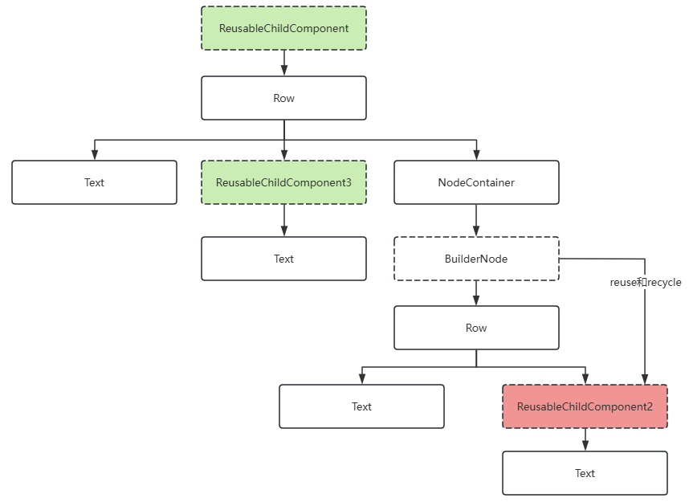
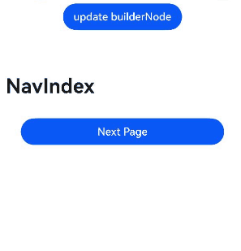

# 自定义声明式节点 (BuilderNode)

## 概述

自定义声明式节点 ([BuilderNode](../reference/apis-arkui/js-apis-arkui-builderNode.md))提供能够挂载系统组件的能力，支持采用无状态的UI方式，通过[全局自定义构建函数](../ui/state-management/arkts-builder.md#全局自定义构建函数)@Builder定制组件树。组件树的根[FrameNode](../reference/apis-arkui/js-apis-arkui-frameNode.md)节点可通过[getFrameNode](../reference/apis-arkui/js-apis-arkui-builderNode.md#getframenode)获取，该节点既可直接由[NodeController](../reference/apis-arkui/js-apis-arkui-nodeController.md)返回并挂载于[NodeContainer](../reference/apis-arkui/arkui-ts/ts-basic-components-nodecontainer.md)节点下，亦可在FrameNode树与[RenderNode](../reference/apis-arkui/js-apis-arkui-renderNode.md)树中嵌入声明式组件，实现混合显示。同时，BuilderNode具备纹理导出功能，导出的纹理可在[XComponent](../reference/apis-arkui/arkui-ts/ts-basic-components-xcomponent.md)中实现同层渲染。

由BuilderNode构建的ArkTS组件树，支持与自定义节点（如FrameNode、RenderNode）关联使用，确保了系统组件与自定义节点的混合显示效果。对于需与自定义节点对接的第三方框架，BuilderNode提供了嵌入系统组件的方法。

此外，BuilderNode还提供了组件预创建的能力，能够自定义系统组件的创建开始的时间，在后续业务中实现动态挂载与显示。此功能尤其适用于初始化耗时较长的声明式组件，如[Web](../reference/apis-arkweb/arkts-basic-components-web.md)、[XComponent](../reference/apis-arkui/arkui-ts/ts-basic-components-xcomponent.md)等，通过预创建，可以有效减少初始化时间，优化组件加载效率。


## 基本概念

- 系统组件：组件是UI的必要元素，形成了在界面中的样子，由ArkUI直接提供的称为[系统组件](arkts-ui-development-overview.md)。

- 实体节点：由后端创建的Native节点。

BuilderNode仅可作为叶子节点进行使用。如有更新需要，建议通过BuilderNode中的[update](../reference/apis-arkui/js-apis-arkui-builderNode.md#update)方式触发更新，不建议通过BuilderNode中获取的RenderNode对节点进行修改操作。

> **说明：**
> 
> - BuilderNode只支持一个由[wrapBuilder](../ui/state-management/arkts-wrapBuilder.md)包装的[全局自定义构建函数](../ui/state-management/arkts-builder.md#全局自定义构建函数)@Builder。
> 
> - 一个新建的BuilderNode在[build](../reference/apis-arkui/js-apis-arkui-builderNode.md#build)之后才能通过[getFrameNode](../reference/apis-arkui/js-apis-arkui-builderNode.md#getframenode)获取到一个指向根节点的FrameNode对象，否则返回null。
> 
> - 如果传入的Builder的根节点为语法节点（if/else/foreach/...），需要额外生成一个FrameNode，在节点树中的显示为“BuilderProxyNode”。
> 
> - 如果BuilderNode通过getFrameNode将节点挂载在另一个FrameNode上，或者将其作为子节点挂载在NodeContainer节点上。则节点中使用父组件的布局约束进行布局。
> 
> - 如果BuilderNode的FrameNode通过[getRenderNode](../reference/apis-arkui/js-apis-arkui-frameNode.md#getrendernode)形式将自己的节点挂载在RenderNode节点上，由于其FrameNode未上树，其大小默认为0，需要通过构造函数中的[selfIdeaSize](../reference/apis-arkui/js-apis-arkui-builderNode.md#renderoptions)显式指定布局约束大小，才能正常显示。
> 
> - BuilderNode的预加载并不会减少组件的创建时间。Web组件创建的时候需要在内核中加载资源，预创建不能减少Web组件的创建的时间，但是可以让内核进行预加载，减少正式使用时候内核的加载耗时。

## 创建BuilderNode对象

BuilderNode对象为一个模板类，需要在创建的时候指定类型。该类型需要与后续build方法中传入的[WrappedBuilder](../ui/state-management/arkts-wrapBuilder.md#wrapbuilder封装全局builder)的类型保持一致，否则会存在编译告警导致编译失败。

## 创建组件树

通过BuilderNode的build可以实现组件树的创建。依照传入的WrappedBuilder对象创建组件树，并持有组件树的根节点。

> **说明：**
>
> 无状态的UI方法全局@Builder最多拥有一个根节点。
>
> build方法中对应的@Builder支持一个参数作为入参。
>
> build中对于@Builder嵌套@Builder进行使用的场景，需要保证嵌套的参数与build的中提供的入参一致。
> 
> 对于@Builder嵌套@Builder进行使用的场景，如果入参类型不一致，则要求增加[BuilderOptions](../reference/apis-arkui/js-apis-arkui-builderNode.md#buildoptions12)字段作为[build](../reference/apis-arkui/js-apis-arkui-builderNode.md#build12)的入参。
> 
> 需要操作BuilderNode中的对象时，需要保证其引用不被回收。当BuilderNode对象被虚拟机回收之后，它的FrameNode、RenderNode对象也会与后端节点解引用。即从BuilderNode中获取的FrameNode对象不对应任何一个节点。

创建离线节点以及组件树，结合FrameNode进行使用。

BuilderNode的根节点直接作为[NodeController](../reference/apis-arkui/js-apis-arkui-nodeController.md)的[makeNode](../reference/apis-arkui/js-apis-arkui-nodeController.md#makenode)返回值。

```ts
import { BuilderNode, FrameNode, NodeController, UIContext } from '@kit.ArkUI';

class Params {
  text: string = "";

  constructor(text: string) {
    this.text = text;
  }
}

@Builder
function buildText(params: Params) {
  Column() {
    Text(params.text)
      .fontSize(50)
      .fontWeight(FontWeight.Bold)
      .margin({ bottom: 36 })
  }
}

class TextNodeController extends NodeController {
  private textNode: BuilderNode<[Params]> | null = null;
  private message: string = "DEFAULT";

  constructor(message: string) {
    super();
    this.message = message;
  }

  makeNode(context: UIContext): FrameNode | null {
    this.textNode = new BuilderNode(context);
    this.textNode.build(wrapBuilder<[Params]>(buildText), new Params(this.message))
    return this.textNode.getFrameNode();
  }
}

@Entry
@Component
struct Index {
  @State message: string = "hello";

  build() {
    Row() {
      Column() {
        NodeContainer(new TextNodeController(this.message))
          .width('100%')
          .height(100)
          .backgroundColor('#FFF0F0F0')
      }
      .width('100%')
      .height('100%')
    }
    .height('100%')
  }
}
```

将BuilderNode与RenderNode进行结合使用。

BuilderNode的RenderNode挂载其它RenderNode下时，需要明确定义[selfIdeaSize](../reference/apis-arkui/js-apis-arkui-builderNode.md#renderoptions)的大小作为BuilderNode的布局约束。不推荐通过该方式挂载节点。

```ts
import { NodeController, BuilderNode, FrameNode, UIContext, RenderNode } from "@kit.ArkUI";

class Params {
  text: string = "";

  constructor(text: string) {
    this.text = text;
  }
}

@Builder
function buildText(params: Params) {
  Column() {
    Text(params.text)
      .fontSize(50)
      .fontWeight(FontWeight.Bold)
      .margin({ bottom: 36 })
  }
}

class TextNodeController extends NodeController {
  private rootNode: FrameNode | null = null;
  private textNode: BuilderNode<[Params]> | null = null;
  private message: string = "DEFAULT";

  constructor(message: string) {
    super();
    this.message = message;
  }

  makeNode(context: UIContext): FrameNode | null {
    this.rootNode = new FrameNode(context);
    let renderNode = new RenderNode();
    renderNode.clipToFrame = false;
    this.textNode = new BuilderNode(context, { selfIdealSize: { width: 150, height: 150 } });
    this.textNode.build(wrapBuilder<[Params]>(buildText), new Params(this.message));
    const textRenderNode = this.textNode?.getFrameNode()?.getRenderNode();

    const rootRenderNode = this.rootNode.getRenderNode();
    if (rootRenderNode !== null) {
      rootRenderNode.appendChild(renderNode);
      renderNode.appendChild(textRenderNode);
    }

    return this.rootNode;
  }
}

@Entry
@Component
struct Index {
  @State message: string = "hello";

  build() {
    Row() {
      Column() {
        NodeContainer(new TextNodeController(this.message))
          .width('100%')
          .height(100)
          .backgroundColor('#FFF0F0F0')
      }
      .width('100%')
      .height('100%')
    }
    .height('100%')
  }
}
```

## 更新组件树

通过BuilderNode对象的build创建组件树。依照传入的WrappedBuilder对象创建组件树，并持有组件树的根节点。

自定义组件的更新遵循[状态管理](../ui/state-management/arkts-state-management-overview.md)的更新机制。WrappedBuilder中直接使用的自定义组件其父组件为BuilderNode对象。因此，更新子组件即WrappedBuilder中定义的自定义组件，需要遵循状态管理的定义将相关的状态变量定义为[\@Prop](../ui/state-management/arkts-prop.md)或者[\@ObjectLink](../ui/state-management/arkts-observed-and-objectlink.md)。装饰器的选择请参照状态管理的装饰器规格结合应用开发需求进行选择。


使用update更新BuilderNode中的节点。

使用[updateConfiguration](../reference/apis-arkui/js-apis-arkui-builderNode.md#updateconfiguration12)触发BuilderNode中节点的全量更新。

更新BuilderNode中的节点。

```ts
import { NodeController, BuilderNode, FrameNode, UIContext } from "@kit.ArkUI";

class Params {
  text: string = "";
  constructor(text: string) {
    this.text = text;
  }
}

// 自定义组件
@Component
struct TextBuilder {
  // 作为自定义组件中需要更新的属性，数据类型为基础属性，定义为@Prop
  @Prop message: string = "TextBuilder";

  build() {
    Row() {
      Column() {
        Text(this.message)
          .fontSize(50)
          .fontWeight(FontWeight.Bold)
          .margin({ bottom: 36 })
          .backgroundColor(Color.Gray)
      }
    }
  }
}

@Builder
function buildText(params: Params) {
  Column() {
    Text(params.text)
      .fontSize(50)
      .fontWeight(FontWeight.Bold)
      .margin({ bottom: 36 })
    TextBuilder({ message: params.text }) // 自定义组件
  }
}

class TextNodeController extends NodeController {
  private textNode: BuilderNode<[Params]> | null = null;
  private message: string = "";

  constructor(message: string) {
    super()
    this.message = message
  }

  makeNode(context: UIContext): FrameNode | null {
    this.textNode = new BuilderNode(context);
    this.textNode.build(wrapBuilder<[Params]>(buildText), new Params(this.message))
    return this.textNode.getFrameNode();
  }

  update(message: string) {
    if (this.textNode !== null) {
      // 调用update进行更新。
      this.textNode.update(new Params(message));
    }
  }
}

@Entry
@Component
struct Index {
  @State message: string = "hello";
  private textNodeController: TextNodeController = new TextNodeController(this.message);
  private count = 0;

  build() {
    Row() {
      Column() {
        NodeContainer(this.textNodeController)
          .width('100%')
          .height(200)
          .backgroundColor('#FFF0F0F0')
        Button('Update')
          .onClick(() => {
            this.count += 1;
            const message = "Update " + this.count.toString();
            this.textNodeController.update(message);
          })
      }
      .width('100%')
      .height('100%')
    }
    .height('100%')
  }
}
```

## 解除实体节点引用关系

由于BuilderNode对应的是后端的实体节点，正常的内存释放依赖前端对象的回收。如果期望直接释放后端的节点对象，则可以通过调用[dispose](../reference/apis-arkui/js-apis-arkui-builderNode.md#dispose12)与实体节点解除引用关系，此时持有的前端BuilderNode对象不再影响实体节点的生命周期。

> **说明：**
>
> 当BuilderNode对象调用dispose之后，不仅BuilderNode对象与后端实体节点解除引用关系，BuilderNode中的FrameNode与RenderNode也会同步和实体节点解除引用关系。
>
> 若前端对象BuilderNode无法释放，容易导致内存泄漏。建议在不再需要对该BuilderNode对象进行操作时，开发者应主动调用dispose释放后端节点，以减少引用关系的复杂性，降低内存泄漏的风险。

## 注入触摸事件

BuilderNode中提供了[postTouchEvent](../reference/apis-arkui/js-apis-arkui-builderNode.md#posttouchevent)，可以通过该接口向BuilderNode中绑定的组件注入[触摸事件](../reference/apis-arkui/arkui-ts/ts-universal-events-touch.md#触摸事件)，实现事件的模拟转发。

通过postTouchEvent向BuilderNode对应的节点树中注入触摸事件。

向BuilderNode中的Column组件转发另一个Column接收的事件，即点击下方的Column组件，上方的Column组件也会收到同样的触摸事件。当Button中的事件被成功识别的时候，返回值为true。

```ts
import { NodeController, BuilderNode, FrameNode, UIContext } from '@kit.ArkUI';

class Params {
  text: string = "this is a text";
}

@Builder
function ButtonBuilder(params: Params) {
  Column() {
    Button(`button ` + params.text)
      .borderWidth(2)
      .backgroundColor(Color.Orange)
      .width("100%")
      .height("100%")
      .gesture(
        TapGesture()
          .onAction((event: GestureEvent) => {
            console.log("TapGesture");
          })
      )
  }
  .width(500)
  .height(300)
  .backgroundColor(Color.Gray)
}

class MyNodeController extends NodeController {
  private rootNode: BuilderNode<[Params]> | null = null;
  private wrapBuilder: WrappedBuilder<[Params]> = wrapBuilder(ButtonBuilder);

  makeNode(uiContext: UIContext): FrameNode | null {
    this.rootNode = new BuilderNode(uiContext);
    this.rootNode.build(this.wrapBuilder, { text: "this is a string" })
    return this.rootNode.getFrameNode();
  }

  postTouchEvent(touchEvent: TouchEvent): void {
    if (this.rootNode == null) {
      return;
    }
    let result = this.rootNode.postTouchEvent(touchEvent);
    console.log("result " + result);
  }
}

@Entry
@Component
struct MyComponent {
  private nodeController: MyNodeController = new MyNodeController();

  build() {
    Column() {
      NodeContainer(this.nodeController)
        .height(300)
        .width(500)
      Column()
        .width(500)
        .height(300)
        .backgroundColor(Color.Pink)
        .onTouch((event) => {
          if (event != undefined) {
            this.nodeController.postTouchEvent(event);
          }
        })
    }
  }
}
```

## 节点复用能力

调用[reuse](../reference/apis-arkui/js-apis-arkui-builderNode.md#reuse12)接口和[recycle](../reference/apis-arkui/js-apis-arkui-builderNode.md#recycle12)接口，将复用和回收事件传递至BuilderNode中的自定义组件，以实现BuilderNode节点内部的自定义组件的复用。

以下面的Demo为例，被复用的自定义组件ReusableChildComponent可以传递复用和回收事件到其下的自定义组件ReusableChildComponent3，但无法传递给自定义组件ReusableChildComponent2，因为被BuilderNode所隔断。因此需要主动调用BuilderNode的reuse和recycle接口，将复用和回收事件传递给自定义组件ReusableChildComponent2，以达成复用效果。



```ts
import { FrameNode, NodeController, BuilderNode, UIContext } from "@kit.ArkUI";

const TEST_TAG: string = "Reuse+Recycle";

class MyDataSource {
  private dataArray: string[] = [];
  private listener: DataChangeListener | null = null

  public totalCount(): number {
    return this.dataArray.length;
  }

  public getData(index: number) {
    return this.dataArray[index];
  }

  public pushData(data: string) {
    this.dataArray.push(data);
  }

  public reloadListener(): void {
    this.listener?.onDataReloaded();
  }

  public registerDataChangeListener(listener: DataChangeListener): void {
    this.listener = listener;
  }

  public unregisterDataChangeListener(): void {
    this.listener = null;
  }
}

class Params {
  item: string = '';

  constructor(item: string) {
    this.item = item;
  }
}

@Builder
function buildNode(param: Params = new Params("hello")) {
  Row() {
    Text(`C${param.item} -- `)
    ReusableChildComponent2({ item: param.item }) //该自定义组件在BuilderNode中无法被正确复用
  }
}

class MyNodeController extends NodeController {
  public builderNode: BuilderNode<[Params]> | null = null;
  public item: string = "";

  makeNode(uiContext: UIContext): FrameNode | null {
    if (this.builderNode == null) {
      this.builderNode = new BuilderNode(uiContext, { selfIdealSize: { width: 300, height: 200 } });
      this.builderNode.build(wrapBuilder<[Params]>(buildNode), new Params(this.item));
    }
    return this.builderNode.getFrameNode();
  }
}

// 被回收复用的自定义组件，其状态变量会更新，而子自定义组件ReusableChildComponent3中的状态变量也会更新，但BuilderNode会阻断这一传递过程
@Reusable
@Component
struct ReusableChildComponent {
  @Prop item: string = '';
  @Prop switch: string = '';
  private controller: MyNodeController = new MyNodeController();

  aboutToAppear() {
    this.controller.item = this.item;
  }

  aboutToRecycle(): void {
    console.log(`${TEST_TAG} ReusableChildComponent aboutToRecycle ${this.item}`);

    // 当开关为open，通过BuilderNode的reuse接口和recycle接口传递给其下的自定义组件，例如ReusableChildComponent2，完成复用
    if (this.switch === 'open') {
      this.controller?.builderNode?.recycle();
    }
  }

  aboutToReuse(params: object): void {
    console.log(`${TEST_TAG} ReusableChildComponent aboutToReuse ${JSON.stringify(params)}`);

    // 当开关为open，通过BuilderNode的reuse接口和recycle接口传递给其下的自定义组件，例如ReusableChildComponent2，完成复用
    if (this.switch === 'open') {
      this.controller?.builderNode?.reuse(params);
    }
  }

  build() {
    Row() {
      Text(`A${this.item}--`)
      ReusableChildComponent3({ item: this.item })
      NodeContainer(this.controller);
    }
  }
}

@Component
struct ReusableChildComponent2 {
  @Prop item: string = "false";

  aboutToReuse(params: Record<string, object>) {
    console.log(`${TEST_TAG} ReusableChildComponent2 aboutToReuse ${JSON.stringify(params)}`);
  }

  aboutToRecycle(): void {
    console.log(`${TEST_TAG} ReusableChildComponent2 aboutToRecycle ${this.item}`);
  }

  build() {
    Row() {
      Text(`D${this.item}`)
        .fontSize(20)
        .backgroundColor(Color.Yellow)
        .margin({ left: 10 })
    }.margin({ left: 10, right: 10 })
  }
}

@Component
struct ReusableChildComponent3 {
  @Prop item: string = "false";

  aboutToReuse(params: Record<string, object>) {
    console.log(`${TEST_TAG} ReusableChildComponent3 aboutToReuse ${JSON.stringify(params)}`);
  }

  aboutToRecycle(): void {
    console.log(`${TEST_TAG} ReusableChildComponent3 aboutToRecycle ${this.item}`);
  }

  build() {
    Row() {
      Text(`B${this.item}`)
        .fontSize(20)
        .backgroundColor(Color.Yellow)
        .margin({ left: 10 })
    }.margin({ left: 10, right: 10 })
  }
}


@Entry
@Component
struct Index {
  @State data: MyDataSource = new MyDataSource();

  aboutToAppear() {
    for (let i = 0; i < 100; i++) {
      this.data.pushData(i.toString());
    }
  }

  build() {
    Column() {
      List({ space: 3 }) {
        LazyForEach(this.data, (item: string) => {
          ListItem() {
            ReusableChildComponent({
              item: item,
              switch: 'open' // 将open改为close可观察到，BuilderNode不通过reuse和recycle接口传递复用时，BuilderNode内部的自定义组件的行为表现
            })
          }
        }, (item: string) => item)
      }
      .width('100%')
      .height('100%')
    }
  }
}
```


## 通过系统环境变化更新节点

使用[updateConfiguration](../reference/apis-arkui/js-apis-arkui-builderNode.md#updateconfiguration12)来监听[系统环境变化](../reference/apis-ability-kit/js-apis-app-ability-configuration.md)事件，以触发节点的全量更新。

> **说明：**
>
> updateConfiguration接口用于通知对象进行更新，更新所使用的系统环境取决于应用当前系统环境的变化。

```ts
import { NodeController, BuilderNode, FrameNode, UIContext } from "@kit.ArkUI";
import { AbilityConstant, Configuration, EnvironmentCallback } from '@kit.AbilityKit';

class Params {
  text: string = ""

  constructor(text: string) {
    this.text = text;
  }
}

// 自定义组件
@Component
struct TextBuilder {
  // 作为自定义组件中需要更新的属性，数据类型为基础属性，定义为@Prop
  @Prop message: string = "TextBuilder";

  build() {
    Row() {
      Column() {
        Text(this.message)
          .fontSize(50)
          .fontWeight(FontWeight.Bold)
          .margin({ bottom: 36 })
          .fontColor($r(`app.color.text_color`))
          .backgroundColor($r(`app.color.start_window_background`))
      }
    }
  }
}

@Builder
function buildText(params: Params) {
  Column() {
    Text(params.text)
      .fontSize(50)
      .fontWeight(FontWeight.Bold)
      .margin({ bottom: 36 })
      .fontColor($r(`app.color.text_color`))
    TextBuilder({ message: params.text }) // 自定义组件
  }.backgroundColor($r(`app.color.start_window_background`))
}

class TextNodeController extends NodeController {
  private textNode: BuilderNode<[Params]> | null = null;
  private message: string = "";

  constructor(message: string) {
    super()
    this.message = message;
  }

  makeNode(context: UIContext): FrameNode | null {
    return this.textNode?.getFrameNode() ? this.textNode?.getFrameNode() : null;
  }

  createNode(context: UIContext) {
    this.textNode = new BuilderNode(context);
    this.textNode.build(wrapBuilder<[Params]>(buildText), new Params(this.message));
    builderNodeMap.push(this.textNode);
  }

  deleteNode() {
    let node = builderNodeMap.pop();
    node?.dispose();
  }

  update(message: string) {
    if (this.textNode !== null) {
      // 调用update进行更新。
      this.textNode.update(new Params(message));
    }
  }
}

// 记录创建的自定义节点对象
const builderNodeMap: Array<BuilderNode<[Params]>> = new Array();

function updateColorMode() {
  builderNodeMap.forEach((value, index) => {
    // 通知BuilderNode环境变量改变
    value.updateConfiguration();
  })
}

@Entry
@Component
struct Index {
  @State message: string = "hello"
  private textNodeController: TextNodeController = new TextNodeController(this.message);
  private count = 0;

  aboutToAppear(): void {
    let environmentCallback: EnvironmentCallback = {
      onMemoryLevel: (level: AbilityConstant.MemoryLevel): void => {
        console.log('onMemoryLevel');
      },
      onConfigurationUpdated: (config: Configuration): void => {
        console.log('onConfigurationUpdated ' + JSON.stringify(config));
        updateColorMode();
      }
    }
    // 注册监听回调
    this.getUIContext().getHostContext()?.getApplicationContext().on('environment', environmentCallback);
    //创建自定义节点并添加至map
    this.textNodeController.createNode(this.getUIContext());
  }

  aboutToDisappear(): void {
    //移除map中的引用，并将自定义节点释放
    this.textNodeController.deleteNode();
  }

  build() {
    Row() {
      Column() {
        NodeContainer(this.textNodeController)
          .width('100%')
          .height(200)
          .backgroundColor('#FFF0F0F0')
        Button('Update')
          .onClick(() => {
            this.count += 1;
            const message = "Update " + this.count.toString();
            this.textNodeController.update(message);
          })
      }
      .width('100%')
      .height('100%')
    }
    .height('100%')
  }
}
```

## 跨页面复用注意事项

在使用[路由](../reference/apis-arkui/js-apis-arkui-UIContext.md#router)接口[router.replaceUrl](../reference/apis-arkui/js-apis-arkui-UIContext.md#replaceurl)、[router.back](../reference/apis-arkui/js-apis-arkui-UIContext.md#back)、[router.clear](../reference/apis-arkui/js-apis-arkui-UIContext.md#clear)、[router.replaceNamedRoute](../reference/apis-arkui/js-apis-arkui-UIContext.md#replacenamedroute)操作页面时，若某个被缓存的BuilderNode位于即将销毁的页面内，那么在新页面中复用该BuilderNode时，可能会存在数据无法更新或新创建节点无法显示的问题。以[router.replaceNamedRoute](../reference/apis-arkui/js-apis-arkui-UIContext.md#replacenamedroute)为例，在以下示例代码中，当点击“router replace”按钮后，页面将切换至PageTwo，同时标志位isShowText会被设定为false。

```ts
// ets/pages/Index.ets
import { NodeController, BuilderNode, FrameNode, UIContext } from "@kit.ArkUI";
import "ets/pages/PageTwo"

@Builder
function buildText() {
  // @Builder中使用语法节点生成BuilderProxyNode
  if (true) {
    MyComponent()
  }
}

@Component
struct MyComponent {
  @StorageLink("isShowText") isShowText: boolean = true;

  build() {
    if (this.isShowText) {
      Column() {
        Text("BuilderNode Reuse")
          .fontSize(36)
          .fontWeight(FontWeight.Bold)
          .padding(16)
      }
    }
  }
}

class TextNodeController extends NodeController {
  private rootNode: FrameNode | null = null;
  private textNode: BuilderNode<[]> | null = null;

  makeNode(context: UIContext): FrameNode | null {
    this.rootNode = new FrameNode(context);

    if (AppStorage.has("textNode")) {
      // 复用AppStorage中的BuilderNode
      this.textNode = AppStorage.get<BuilderNode<[]>>("textNode") as BuilderNode<[]>;
      const parent = this.textNode.getFrameNode()?.getParent();
      if (parent) {
        parent.removeChild(this.textNode.getFrameNode());
      }
    } else {
      this.textNode = new BuilderNode(context);
      this.textNode.build(wrapBuilder<[]>(buildText));
      // 将创建的BuilderNode存入AppStorage
      AppStorage.setOrCreate<BuilderNode<[]>>("textNode", this.textNode);
    }
    this.rootNode.appendChild(this.textNode.getFrameNode());

    return this.rootNode;
  }
}

@Entry({ routeName: "myIndex" })
@Component
struct Index {
  aboutToAppear(): void {
    AppStorage.setOrCreate<boolean>("isShowText", true);
  }

  build() {
    Row() {
      Column() {
        NodeContainer(new TextNodeController())
          .width('100%')
          .backgroundColor('#FFF0F0F0')
        Button('Router pageTwo')
          .onClick(() => {
            // 改变AppStorage中的状态变量触发Text节点的重新创建
            AppStorage.setOrCreate<boolean>("isShowText", false);

            this.getUIContext().getRouter().replaceNamedRoute({ name: "pageTwo" });
          })
          .margin({ top: 16 })
      }
      .width('100%')
      .height('100%')
      .padding(16)
    }
    .height('100%')
  }
}
```

PageTwo的实现如下：

```ts
// ets/pages/PageTwo.ets
// 该页面中存在一个按钮，可跳转回主页面，回到主页面后，原有的文字消失
import "ets/pages/Index"

@Entry({ routeName: "pageTwo" })
@Component
struct PageTwo {
  build() {
    Column() {
      Button('Router replace to index')
        .onClick(() => {
          this.getUIContext().getRouter().replaceNamedRoute({ name: "myIndex" });
        })
    }
    .height('100%')
    .width('100%')
    .alignItems(HorizontalAlign.Center)
    .padding(16)
  }
}
```


在API version 16之前，解决该问题的方法是在页面销毁时，将页面上的BuilderNode从缓存中移除。以上述例子为例，可以在页面跳转前，通过点击事件将BuilderNode从AppStorage中移除，以此达到预期效果。

API version 16及之后版本，BuilderNode在新页面被复用时，会自动刷新自身内容，无需在页面销毁时将BuilderNode从缓存中移除。

```ts
// ets/pages/Index.ets
import { NodeController, BuilderNode, FrameNode, UIContext } from "@kit.ArkUI";
import "ets/pages/PageTwo"

@Builder
function buildText() {
  // @Builder中使用语法节点生成BuilderProxyNode
  if (true) {
    MyComponent()
  }
}

@Component
struct MyComponent {
  @StorageLink("isShowText") isShowText: boolean = true;

  build() {
    if (this.isShowText) {
      Column() {
        Text("BuilderNode Reuse")
          .fontSize(36)
          .fontWeight(FontWeight.Bold)
          .padding(16)
      }
    }
  }
}

class TextNodeController extends NodeController {
  private rootNode: FrameNode | null = null;
  private textNode: BuilderNode<[]> | null = null;

  makeNode(context: UIContext): FrameNode | null {
    this.rootNode = new FrameNode(context);

    if (AppStorage.has("textNode")) {
      // 复用AppStorage中的BuilderNode
      this.textNode = AppStorage.get<BuilderNode<[]>>("textNode") as BuilderNode<[]>;
      const parent = this.textNode.getFrameNode()?.getParent();
      if (parent) {
        parent.removeChild(this.textNode.getFrameNode());
      }
    } else {
      this.textNode = new BuilderNode(context);
      this.textNode.build(wrapBuilder<[]>(buildText));
      // 将创建的BuilderNode存入AppStorage
      AppStorage.setOrCreate<BuilderNode<[]>>("textNode", this.textNode);
    }
    this.rootNode.appendChild(this.textNode.getFrameNode());

    return this.rootNode;
  }
}

@Entry({ routeName: "myIndex" })
@Component
struct Index {
  aboutToAppear(): void {
    AppStorage.setOrCreate<boolean>("isShowText", true);
  }

  build() {
    Row() {
      Column() {
        NodeContainer(new TextNodeController())
          .width('100%')
          .backgroundColor('#FFF0F0F0')
        Button('Router pageTwo')
          .onClick(() => {
            // 改变AppStorage中的状态变量触发Text节点的重新创建
            AppStorage.setOrCreate<boolean>("isShowText", false);
            // 将BuilderNode从AppStorage中移除
            AppStorage.delete("textNode");

            this.getUIContext().getRouter().replaceNamedRoute({ name: "pageTwo" });
          })
          .margin({ top: 16 })
      }
      .width('100%')
      .height('100%')
      .padding(16)
    }
    .height('100%')
  }
}
```


## BuilderNode中使用LocalStorage

从API version 12开始，自定义组件支持接收[LocalStorage](../ui/state-management/arkts-localstorage.md)实例。可以通过[传递LocalStorage实例](../ui/state-management/arkts-localstorage.md#自定义组件接收localstorage实例)来使用LocalStorage相关的装饰器[@LocalStorageProp](../ui/state-management/arkts-localstorage.md#localstorageprop)、[@LocalStorageLink](../ui/state-management/arkts-localstorage.md#localstoragelink)。

```ts
import { BuilderNode, NodeController, UIContext } from '@kit.ArkUI';

let localStorage1: LocalStorage = new LocalStorage();
localStorage1.setOrCreate('PropA', 'PropA');

let localStorage2: LocalStorage = new LocalStorage();
localStorage2.setOrCreate('PropB', 'PropB');

@Entry(localStorage1)
@Component
struct Index {
  // 'PropA'，和localStorage1中'PropA'的双向同步
  @LocalStorageLink('PropA') PropA: string = 'Hello World';
  @State count: number = 0;
  private controller: NodeController = new MyNodeController(this.count, localStorage2);

  build() {
    Row() {
      Column() {
        Text(this.PropA)
          .fontSize(50)
          .fontWeight(FontWeight.Bold)
        // 使用LocalStorage 实例localStorage2
        Child({ count: this.count }, localStorage2)
        NodeContainer(this.controller)
      }
      .width('100%')
    }
    .height('100%')
  }
}

interface Params {
  count: number;
  localStorage: LocalStorage;
}

@Builder
function CreateChild(params: Params) {
  //构造过程中传递localStorage
  Child({ count: params.count }, params.localStorage)
}

class MyNodeController extends NodeController {
  private count?: number;
  private localStorage ?: LocalStorage;

  constructor(count: number, localStorage: LocalStorage) {
    super();
    this.count = count;
    this.localStorage = localStorage;
  }

  makeNode(uiContext: UIContext): FrameNode | null {
    let builderNode = new BuilderNode<[Params]>(uiContext);
    //构造过程中传递localStorage
    builderNode.build(wrapBuilder(CreateChild), { count: this.count, localStorage: this.localStorage });
    return builderNode.getFrameNode();
  }
}

@Component
struct Child {
  @Prop count: number;
  //  'Hello World'，和localStorage2中'PropB'的双向同步，如果localStorage2中没有'PropB'，则使用默认值'Hello World'
  @LocalStorageLink('PropB') PropB: string = 'Hello World';

  build() {
    Text(this.PropB)
      .fontSize(50)
      .fontWeight(FontWeight.Bold)
  }
}
```

## 查询当前BuilderNode是否解除引用

前端节点均绑定有相应的后端实体节点，当节点调用dispose接口解除绑定后，再次调用接口可能会出现crash、返回默认值的情况。

从API version 20开始，使用[isDisposed](../reference/apis-arkui/js-apis-arkui-builderNode.md#isdisposed20)接口查询当前BuilderNode对象是否已解除与后端实体节点的引用关系，从而可以在操作节点前检查其有效性，避免潜在风险。

```ts
import { NodeController, FrameNode, BuilderNode } from '@kit.ArkUI';

@Builder
function buildText() {
  Text("Test")
    .fontSize(20)
    .fontWeight(FontWeight.Bold)
}

class MyNodeController extends NodeController {
  private rootNode: FrameNode | null = null;
  private builderNode: BuilderNode<[]> | null = null;

  makeNode(uiContext: UIContext): FrameNode | null {
    this.rootNode = new FrameNode(uiContext);
    this.rootNode.commonAttribute.width(100).height(100).backgroundColor(Color.Pink);
    this.builderNode = new BuilderNode<[]>(uiContext);
    this.builderNode.build(wrapBuilder<[]>(buildText));

    // 挂载BuilderNode
    this.rootNode.appendChild(this.builderNode.getFrameNode());
    return this.rootNode;
  }

  disposeBuilderNode() {
    // 解除BuilderNode与后端实体节点的引用关系
    this.builderNode?.dispose();
  }

  isDisposed() : string {
    if (this.builderNode !== null) {
      // 查询BuilderNode是否解除引用
      if (this.builderNode.isDisposed()) {
        return 'builderNode isDisposed is true';
      }
      else {
        return 'builderNode isDisposed is false';
      }
    }
    return 'builderNode is null';
  }
}

@Entry
@Component
struct Index {
  @State text: string = ''
  private myNodeController: MyNodeController = new MyNodeController();

  build() {
    Column({ space: 4 }) {
      NodeContainer(this.myNodeController)
      Button('BuilderNode dispose')
        .onClick(() => {
          this.myNodeController.disposeBuilderNode();
          this.text = '';
        })
        .width(200)
        .height(50)
      Button('BuilderNode isDisposed')
        .onClick(() => {
          this.text = this.myNodeController.isDisposed();
        })
        .width(200)
        .height(50)
      Text(this.text)
        .fontSize(25)
    }
    .width('100%')
    .height('100%')
  }
}
```

## 设置BuilderNode继承冻结能力

ArkUI支持[自定义组件冻结](./state-management/arkts-custom-components-freeze.md)，该功能冻结非激活状态组件的刷新能力。当组件处于非激活状态时，即便其绑定状态变量发生变化，也不会触发组件UI的重新渲染，从而减少复杂UI场景的刷新负载。

从API version 20开始，BuilderNode节点可以通过[inheritFreezeOptions](../reference/apis-arkui/js-apis-arkui-builderNode.md#inheritfreezeoptions20)接口继承父自定义组件（即从该BuilderNode节点向上查找的第一个自定义组件）的冻结策略。当BuilderNode节点继承父自定义组件的冻结策略时，若父自定义组件的冻结策略设置为开启组件冻结（即[freezeWhenInactive](./state-management/arkts-create-custom-components.md#freezewheninactive11)选项设为true），则BuilderNode节点在不活跃时将会冻结，当切换至活跃状态时解冻，并使用缓存的数据更新节点。

```ts

import { BuilderNode, FrameNode, NodeController } from '@kit.ArkUI';

class Params {
  count: number = 0;

  constructor(count: number) {
    this.count = count;
  }
}

@Builder
function buildText(params: Params) {

  Column() {
    TextBuilder({ message: params.count })
  }
}

class TextNodeController extends NodeController {
  private rootNode: FrameNode | null = null;
  private textNode: BuilderNode<[Params]> | null = null;
  private count: number = 0;

  makeNode(context: UIContext): FrameNode | null {
    this.rootNode = new FrameNode(context);
    this.textNode = new BuilderNode(context, { selfIdealSize: { width: 150, height: 150 } });
    this.textNode.build(wrapBuilder<[Params]>(buildText), new Params(this.count));
    this.textNode.inheritFreezeOptions(true); //设置BuilderNode的冻结继承状态为true
    if (this.rootNode !== null) {
      this.rootNode.appendChild(this.textNode.getFrameNode()); //将BuilderNode上树
    }
    return this.rootNode;
  }

  update(): void {
    if (this.textNode !== null) {
      this.count += 1;
      this.textNode.update(new Params(this.count)); //更新BuilderNode中的数据，可以触发Log
    }

  }
}

const textNodeController: TextNodeController = new TextNodeController();

@Entry
@Component
struct MyNavigationTestStack {
  @Provide('pageInfo') pageInfo: NavPathStack = new NavPathStack();
  @State message: number = 0;
  @State logNumber: number = 0;

  @Builder
  PageMap(name: string) {
    if (name === 'pageOne') {
      pageOneStack({ message: this.message, logNumber: this.logNumber })
    } else if (name === 'pageTwo') {
      pageTwoStack({ message: this.message, logNumber: this.logNumber })
    }
  }

  build() {
    Column() {
      Button('update builderNode') //点击更新BuildrNode
        .onClick(() => {
          textNodeController.update();
        })
      Navigation(this.pageInfo) {
        Column() {
          Button('Next Page', { stateEffect: true, type: ButtonType.Capsule })
            .width('80%')
            .height(40)
            .margin(20)
            .onClick(() => {
              this.pageInfo.pushPath({ name: 'pageOne' }); //将name指定的NavDestination页面信息入栈
            })
        }
      }.title('NavIndex')
      .navDestination(this.PageMap)
      .mode(NavigationMode.Stack)
    }
  }
}

@Component
struct pageOneStack {
  @Consume('pageInfo') pageInfo: NavPathStack;
  @State index: number = 1;
  @Link message: number;
  @Link logNumber: number;

  build() {
    NavDestination() {
      Column() {
        NavigationContentMsgStack({ message: this.message, index: this.index, logNumber: this.logNumber })
        Button('Next Page', { stateEffect: true, type: ButtonType.Capsule })
          .width('80%')
          .height(40)
          .margin(20)
          .onClick(() => {
            this.pageInfo.pushPathByName('pageTwo', null);
          })
        Button('Back Page', { stateEffect: true, type: ButtonType.Capsule })
          .width('80%')
          .height(40)
          .margin(20)
          .onClick(() => {
            this.pageInfo.pop();
          })
      }.width('100%').height('100%')
    }.title('pageOne')
    .onBackPressed(() => {
      this.pageInfo.pop();
      return true;
    })
  }
}

@Component
struct pageTwoStack {
  @Consume('pageInfo') pageInfo: NavPathStack;
  @State index: number = 2;
  @Link message: number;
  @Link logNumber: number;

  build() {
    NavDestination() {
      Column() {
        NavigationContentMsgStack({ message: this.message, index: this.index, logNumber: this.logNumber })
        Text('BuilderNode处于冻结')
          .fontWeight(FontWeight.Bold)
          .margin({ top: 48, bottom: 48 })
        Button('Back Page', { stateEffect: true, type: ButtonType.Capsule })
          .width('80%')
          .height(40)
          .margin(20)
          .onClick(() => {
            this.pageInfo.pop();
          })
      }.width('100%').height('100%')
    }.title('pageTwo')
    .onBackPressed(() => {
      this.pageInfo.pop();
      return true;
    })
  }
}

@Component({ freezeWhenInactive: true }) // 设置冻结策略为不活跃冻结
struct NavigationContentMsgStack {
  @Link message: number;
  @Link index: number;
  @Link logNumber: number;

  build() {
    Column() {
      if (this.index === 1) {
        NodeContainer(textNodeController)
      }
    }
  }
}

@Component({ freezeWhenInactive: true }) // 设置冻结策略为不活跃冻结
struct TextBuilder {
  @Prop @Watch("info") message: number = 0;

  info() {
    console.info(`freeze-test TextBuilder message callback ${this.message}`); //根据message内容变化来打印日志来判断是否冻结
  }

  build() {
    Row() {
      Column() {
        Text(`文本更新次数： ${this.message}`)
          .fontWeight(FontWeight.Bold)
          .margin({ top: 48, bottom: 48 })
      }
    }
  }
}
```

