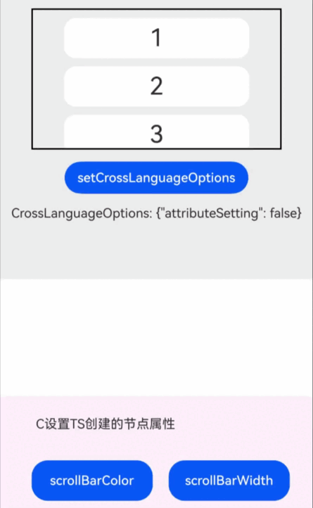

# 设置自定义节点跨语言属性
<!--Kit: ArkUI-->
<!--Subsystem: ArkUI-->
<!--Owner: @xiang-shouxing-->
<!--SE: @xiang-shouxing-->
<!--TSE: @sally__-->

## 概述

ArkUI支持在前端使用ArkTS语言创建命令式节点，即[FrameNode](../reference/apis-arkui/js-apis-arkui-frameNode.md)节点，也可以在Native侧使用C语言创建命令式节点，并且可以混合使用两类节点构建页面。

针对上述场景，ArkUI提供命令式节点跨语言属性设置功能，即使用ArkTS语言创建的命令式节点，可以在Native侧进行属性设置。使用C语言创建的节点，可以在ArkTS侧进行属性设置。

> **说明：**
>
> 下述示例中，需要先进行Native侧配置，请参考[接入ArkTS页面](./ndk-access-the-arkts-page.md)完成。

## 设置和获取跨语言配置

跨语言指的是跨越ArkTS语言和C语言。跨语言配置指的是命令式节点上对于跨语言操作的权限配置。

可以通过[setCrossLanguageOptions](../reference/apis-arkui/js-apis-arkui-frameNode.md#setcrosslanguageoptions15)与[OH_ArkUI_NodeUtils_SetCrossLanguageOption](../reference/apis-arkui/capi-native-node-h.md#oh_arkui_nodeutils_setcrosslanguageoption)接口设置当前节点的跨语言配置。如果当前节点无法修改或设置跨语言配置，则会抛出异常信息。

可以使用[getCrossLanguageOptions](../reference/apis-arkui/js-apis-arkui-frameNode.md#getcrosslanguageoptions15)与[OH_ArkUI_NodeUtils_GetCrossLanguageOption](../reference/apis-arkui/capi-native-node-h.md#oh_arkui_nodeutils_getcrosslanguageoption)接口获取当前节点的跨语言配置。

以下示例描述了如何设置和获取ArkTS命令式节点的跨语言配置。

```ts
import { NodeController, UIContext, FrameNode, typeNode, BuilderNode } from '@kit.ArkUI';

@Builder
function insideScroll() {
  Column() {
    ForEach([1, 2, 3, 4, 5, 6, 7, 8, 9, 10], (item: number) => {
      Text(item.toString())
        .width("75%")
        .height(50)
        .backgroundColor(0xFFFFFF)
        .borderRadius(15)
        .fontSize(30)
        .textAlign(TextAlign.Center)
        .margin({ top: 10 })
    }, (item: string) => item)
  }
  .width("100%")
}

class MyNodeController extends NodeController {
  uiContext: UIContext | null = null;
  rootNode: FrameNode | null = null;
  scrollNode: FrameNode | null = null;
  scroller: Scroller = new Scroller();

  makeNode(uiContext: UIContext): FrameNode | null {
    this.uiContext = uiContext;
    this.rootNode = new FrameNode(uiContext);
    this.rootNode.commonAttribute.width("80%").height("50%").borderWidth(2).margin(15);
    const scroll = typeNode.createNode(uiContext, 'Scroll');
    scroll.initialize(this.scroller).id("scroll");
    this.scrollNode = scroll;
    this.rootNode.appendChild(this.scrollNode);
    const builderNode = new BuilderNode(uiContext);
    builderNode.build(wrapBuilder(insideScroll));
    this.scrollNode?.appendChild(builderNode.getFrameNode());
    return this.rootNode;
  }
}

@Entry
@Component
struct CrossLanguage {
  myNodeController: MyNodeController = new MyNodeController()
  @State attributeSetting: boolean = false;
  @State getCrossLanguageOptions: string = '{"attributeSetting": false}';

  build() {
    Scroll() {
      Column({ space: 15 }) {
        Column() {
          Scroll() {
            Column() {
              NodeContainer(this.myNodeController)
              Button("setCrossLanguageOptions").margin({ bottom: 15})
                .onClick(() => {
                  this.attributeSetting = !this.attributeSetting;
                  this.myNodeController.scrollNode?.setCrossLanguageOptions({
                    attributeSetting: this.attributeSetting
                  });
                  // 若attributeSetting为true，表示scrollNode支持通过非ArkTS语言进行属性设置，否则为不支持
                  this.getCrossLanguageOptions = JSON.stringify(this.myNodeController.scrollNode?.getCrossLanguageOptions());
                })
              Text("CrossLanguageOptions: " + this.getCrossLanguageOptions)
            }
          }.scrollBarColor(Color.Transparent)
        }
        .width('100%')
        .height(350)
        .backgroundColor(0xeeeeee)
        .id('Part_TS')
      }
      .width('100%')
    }.scrollBarColor(Color.Transparent)
  }
}
```

## 跨语言设置节点属性

获取节点后，若节点的跨语言配置设置为允许属性设置，ArkTS侧可利用getAttribute接口获取修改Native节点属性的对象，Native侧可利用[setAttribute](../reference/apis-arkui/capi-arkui-nativemodule-arkui-nativenodeapi-1.md#setattribute)接口修改ArkTS节点属性。

以下示例创建了ArkTS的[Scroll](../reference/apis-arkui/js-apis-arkui-frameNode.md#scroll12)类型节点，并在Native侧修改了Scroll的属性。

1. 在ArkTS侧创建组件类型为Scroll的命令式节点。
    ```ts
    import nativeNode from 'libentry.so';
    import { NodeController, UIContext, FrameNode, typeNode, BuilderNode, NodeContent } from '@kit.ArkUI';

    @Builder
    function insideScroll() {
      Column() {
        ForEach([1, 2, 3, 4, 5, 6, 7, 8, 9, 10], (item: number) => {
          Text(item.toString())
            .width("75%")
            .height(50)
            .backgroundColor(0xFFFFFF)
            .borderRadius(15)
            .fontSize(30)
            .textAlign(TextAlign.Center)
            .margin({ top: 10 })
        }, (item: string) => item)
      }
      .width("100%")
    }

    class MyNodeController extends NodeController {
      uiContext: UIContext | null = null;
      rootNode: FrameNode | null = null;
      scrollNode: FrameNode | null = null;
      scroller: Scroller = new Scroller();

      makeNode(uiContext: UIContext): FrameNode | null {
        this.uiContext = uiContext;
        this.rootNode = new FrameNode(uiContext);
        this.rootNode.commonAttribute.width("80%").height("50%").borderWidth(2).margin(15);
        const scroll = typeNode.createNode(uiContext, 'Scroll');
        scroll.initialize(this.scroller).id("scroll");
        this.scrollNode = scroll;
        this.rootNode.appendChild(this.scrollNode);
        const builderNode = new BuilderNode(uiContext);
        builderNode.build(wrapBuilder(insideScroll));
        this.scrollNode?.appendChild(builderNode.getFrameNode());
        return this.rootNode;
      }
    }

    @Entry
    @Component
    struct CrossLanguage {
      private myNodeController: MyNodeController = new MyNodeController();
      @State attributeSetting: boolean = false;
      @State getCrossLanguageOptions: string = '{"attributeSetting": false}';
      private rootSlot = new NodeContent();

      aboutToAppear(): void {
        nativeNode.createNativeRoot(this.rootSlot);
      }

      build() {
        Scroll() {
          Column({ space: 15 }) {
            Column() {
              Scroll() {
                Column() {
                  NodeContainer(this.myNodeController)
                  Button("setCrossLanguageOptions").margin({ bottom: 15})
                    .onClick(() => {
                      this.attributeSetting = !this.attributeSetting;
                      this.myNodeController.scrollNode?.setCrossLanguageOptions({
                        attributeSetting: this.attributeSetting
                      });
                      // 若attributeSetting为true，表示scrollNode支持通过非ArkTS语言进行属性设置，否则为不支持
                      this.getCrossLanguageOptions = JSON.stringify(this.myNodeController.scrollNode?.getCrossLanguageOptions());
                    })
                  Text("CrossLanguageOptions: " + this.getCrossLanguageOptions)
                }
              }.scrollBarColor(Color.Transparent)
            }
            .width('100%')
            .height(350)
            .backgroundColor(0xeeeeee)
            .id('Part_TS')

            Column() {
              ContentSlot(this.rootSlot)
            }
            .width(500)
            .height(400)
            .id('Part_C')
          }
          .width('100%')
        }.scrollBarColor(Color.Transparent)
      }
    }
    ```

2. 新建`CrossLanguageExample.h`文件，在其中获取到目标节点（该节点在ArkTS侧创建），并设置属性。
    ```c
    #ifndef MYAPPLICATION_CROSSLANGUAGEEXAMPLE_H
    #define MYAPPLICATION_CROSSLANGUAGEEXAMPLE_H

    #include "ArkUINode.h"
    #include <hilog/log.h>

    namespace NativeModule {

    std::shared_ptr<ArkUIBaseNode> CreateCrossLanguageExample() {
        auto nodeAPI = NativeModuleInstance::GetInstance()->GetNativeNodeAPI();
        
        // 创建根节点Scroll
        ArkUI_NodeHandle scroll = nodeAPI->createNode(ARKUI_NODE_SCROLL);
        ArkUI_NumberValue length_value[] = {{.f32 = 480}};
        ArkUI_AttributeItem length_item = {length_value, sizeof(length_value) / sizeof(ArkUI_NumberValue)};
        nodeAPI->setAttribute(scroll, NODE_WIDTH, &length_item);
        ArkUI_NumberValue length_value1[] = {{.f32 = 650}};
        ArkUI_AttributeItem length_item1 = {length_value1, sizeof(length_value1) / sizeof(ArkUI_NumberValue)};
        nodeAPI->setAttribute(scroll, NODE_HEIGHT, &length_item1);
        ArkUI_AttributeItem scroll_id = {.string = "Scroll_CAPI"};
        nodeAPI->setAttribute(scroll, NODE_ID, &scroll_id);
        
        // 创建Column
        ArkUI_NodeHandle column = nodeAPI->createNode(ARKUI_NODE_COLUMN);
        ArkUI_NumberValue value[] = {480};
        ArkUI_AttributeItem item = {value, sizeof(value) / sizeof(ArkUI_NumberValue)};
        nodeAPI->setAttribute(column, NODE_WIDTH, &item);
        ArkUI_NumberValue column_bc[] = {{.u32 = 0xFFF00BB}};
        ArkUI_AttributeItem column_item = {column_bc, 1};
        nodeAPI->setAttribute(column, NODE_BACKGROUND_COLOR, &column_item);
        ArkUI_AttributeItem column_id = {.string = "Column_CAPI"};
        nodeAPI->setAttribute(column, NODE_ID, &column_id);
        
        // 创建Text
        ArkUI_NodeHandle text0 = nodeAPI->createNode(ARKUI_NODE_TEXT);
        ArkUI_NumberValue text_width[] = {300};
        ArkUI_AttributeItem text_item0 = {text_width, sizeof(text_width) / sizeof(ArkUI_NumberValue)};
        nodeAPI->setAttribute(text0, NODE_WIDTH, &text_item0);
        ArkUI_NumberValue text_height[] = {50};
        ArkUI_AttributeItem text_item1 = {text_height, sizeof(text_height) / sizeof(ArkUI_NumberValue)};
        nodeAPI->setAttribute(text0, NODE_HEIGHT, &text_item1);
        ArkUI_AttributeItem text_item = {.string = "C设置TS创建的节点属性"};
        nodeAPI->setAttribute(text0, NODE_TEXT_CONTENT, &text_item);
        ArkUI_NumberValue margin[] = {10};
        ArkUI_AttributeItem item_margin = {margin, sizeof(margin) / sizeof(ArkUI_NumberValue)};
        nodeAPI->setAttribute(text0, NODE_MARGIN, &item_margin);
        
        // 创建Row
        ArkUI_NodeHandle row0 = nodeAPI->createNode(ARKUI_NODE_ROW);
        ArkUI_NumberValue width_value[] = {{.f32=330}};
        ArkUI_AttributeItem width_item = {width_value, sizeof(width_value) / sizeof(ArkUI_NumberValue)};
        nodeAPI->setAttribute(row0, NODE_WIDTH, &width_item);
        nodeAPI->setAttribute(row0, NODE_HEIGHT, &text_item1);
        nodeAPI->setAttribute(row0, NODE_MARGIN, &item_margin);
        
        // 创建Button
        ArkUI_NodeHandle bt0 = nodeAPI->createNode(ARKUI_NODE_BUTTON);
        ArkUI_NumberValue btn_width[] = {150};
        ArkUI_AttributeItem btn_item0 = {btn_width, sizeof(btn_width) / sizeof(ArkUI_NumberValue)};
        nodeAPI->setAttribute(bt0, NODE_WIDTH, &btn_item0);
        nodeAPI->setAttribute(bt0, NODE_HEIGHT, &text_item1);
        nodeAPI->setAttribute(bt0, NODE_MARGIN, &item_margin);
        ArkUI_AttributeItem bt0_item = {.string = "scrollBarColor"};
        nodeAPI->setAttribute(bt0, NODE_BUTTON_LABEL, &bt0_item);
        nodeAPI->registerNodeEvent(bt0, NODE_ON_CLICK, 0, nullptr);
        
        ArkUI_NodeHandle bt1 = nodeAPI->createNode(ARKUI_NODE_BUTTON);
        nodeAPI->setAttribute(bt1, NODE_WIDTH, &btn_item0);
        nodeAPI->setAttribute(bt1, NODE_HEIGHT, &text_item1);
        nodeAPI->setAttribute(bt1, NODE_MARGIN, &item_margin);
        ArkUI_AttributeItem bt1_item = {.string = "scrollBarWidth"};
        nodeAPI->setAttribute(bt1, NODE_BUTTON_LABEL, &bt1_item);
        nodeAPI->registerNodeEvent(bt1, NODE_ON_CLICK, 1, nullptr);
        
        // 注册事件
        auto onClick = [](ArkUI_NodeEvent *event) {
            ArkUI_NodeHandle node = OH_ArkUI_NodeEvent_GetNodeHandle(event);
            auto nodeAPI = NativeModuleInstance::GetInstance()->GetNativeNodeAPI();
            
            if (OH_ArkUI_NodeEvent_GetTargetId(event) == 0) {  // scrollBarColor
                ArkUI_NodeHandle node_ptr = nullptr;
                OH_ArkUI_NodeUtils_GetAttachedNodeHandleById("scroll", &node_ptr);
                try {
                    ArkUI_NumberValue scroll_color_value[] = {{.u32 = 0xff00ff00}};
                    ArkUI_AttributeItem scroll_color_item = {scroll_color_value, sizeof(scroll_color_value) / sizeof(ArkUI_NumberValue)};
                    nodeAPI->setAttribute(node_ptr, NODE_SCROLL_BAR_COLOR, &scroll_color_item);
                } catch (...) {
                    OH_LOG_Print(LOG_APP, LOG_ERROR, 0xFF00, "CrossLanguageExample", "crossLanguage setAttribute error");
                }
            }
            
            if (OH_ArkUI_NodeEvent_GetTargetId(event) == 1) {  // scrollBarWidth
                ArkUI_NodeHandle node_ptr = nullptr;
                OH_ArkUI_NodeUtils_GetAttachedNodeHandleById("scroll", &node_ptr);
                try {
                    ArkUI_NumberValue scroll_width_value[] = {{20}};
                    ArkUI_AttributeItem scroll_width_item = {scroll_width_value, sizeof(scroll_width_value) / sizeof(ArkUI_NumberValue)};
                    nodeAPI->setAttribute(node_ptr, NODE_SCROLL_BAR_WIDTH, &scroll_width_item);
                } catch (...) {
                    OH_LOG_Print(LOG_APP, LOG_ERROR, 0xFF00, "CrossLanguageExample", "crossLanguage setAttribute error");
                }
            }
        };
        nodeAPI->registerNodeEventReceiver(onClick);
        
        // 节点添加
        nodeAPI->addChild(scroll, column);
        nodeAPI->addChild(column, text0);
        nodeAPI->addChild(column, row0);
        nodeAPI->addChild(row0, bt0);
        nodeAPI->addChild(row0, bt1);
        
        return std::make_shared<ArkUINode>(scroll);
    }
    } // namespace NativeModule

    #endif //MYAPPLICATION_CROSSLANGUAGEEXAMPLE_H
    ```

3. 在`NativeEntry.cpp`中，挂载Native节点。
    ```c
    // NativeEntry.cpp


    #include <arkui/native_node_napi.h>
    #include <hilog/log.h>
    #include <js_native_api.h>
    #include "NativeEntry.h"
    #include "CrossLanguageExample.h"


    namespace NativeModule {


    napi_value CreateNativeRoot(napi_env env, napi_callback_info info) {
        size_t argc = 1;
        napi_value args[1] = {nullptr};


        napi_get_cb_info(env, info, &argc, args, nullptr, nullptr);


        // 获取NodeContent
        ArkUI_NodeContentHandle contentHandle;
        OH_ArkUI_GetNodeContentFromNapiValue(env, args[0], &contentHandle);
        NativeEntry::GetInstance()->SetContentHandle(contentHandle);


        // 创建节点
        auto node = CreateCrossLanguageExample();


        // 保持Native侧对象到管理类中，维护生命周期。
        NativeEntry::GetInstance()->SetRootNode(node);
        return nullptr;
    }


    napi_value DestroyNativeRoot(napi_env env, napi_callback_info info) {
        // 从管理类中释放Native侧对象。
        NativeEntry::GetInstance()->DisposeRootNode();
        return nullptr;
    }


    } // namespace NativeModule
    ```

4. 运行程序，在ArkTS侧点击按钮，设置当前attributeSetting为true，在Native侧点击按钮，设置ArkTS侧Scroll组件滚动条的颜色和粗细属性。



## 支持跨语言设置属性的节点类型

仅以下节点类型支持跨语言设置节点属性。

| ArkTS侧[TypedFrameNode](../reference/apis-arkui/js-apis-arkui-frameNode.md#typedframenode12)类型 | Native侧[ArkUI_NodeType](../reference/apis-arkui/capi-native-node-h.md#arkui_nodetype)类型 | ArkTS属性获取接口 | ArkTS控制器获取/绑定接口 |
| -------- | -------- | -------- | -------- |
| [Button](../reference/apis-arkui/js-apis-arkui-frameNode.md#button12) | ARKUI_NODE_BUTTON | [getAttribute](../reference/apis-arkui/js-apis-arkui-frameNode.md#getattributebutton20) | NA |
| [Checkbox](../reference/apis-arkui/js-apis-arkui-frameNode.md#checkbox18) | ARKUI_NODE_CHECKBOX | [getAttribute](../reference/apis-arkui/js-apis-arkui-frameNode.md#getattributecheckbox20) | NA |
| [Radio](../reference/apis-arkui/js-apis-arkui-frameNode.md#radio18) | ARKUI_NODE_RADIO | [getAttribute](../reference/apis-arkui/js-apis-arkui-frameNode.md#getattributeradio20) | NA |
| [Slider](../reference/apis-arkui/js-apis-arkui-frameNode.md#slider18) | ARKUI_NODE_SLIDER | [getAttribute](../reference/apis-arkui/js-apis-arkui-frameNode.md#getattributeslider20) | NA |
| [Toggle](../reference/apis-arkui/js-apis-arkui-frameNode.md#toggle18) | ARKUI_NODE_TOGGLE | [getAttribute](../reference/apis-arkui/js-apis-arkui-frameNode.md#getattributetoggle20) | NA |
| [Progress](../reference/apis-arkui/js-apis-arkui-frameNode.md#progress12) | ARKUI_NODE_PROGRESS | [getAttribute](../reference/apis-arkui/js-apis-arkui-frameNode.md#getattributeprogress20) | NA |
| [LoadingProgress](../reference/apis-arkui/js-apis-arkui-frameNode.md#loadingprogress12) | ARKUI_NODE_LOADING_PROGRESS | [getAttribute](../reference/apis-arkui/js-apis-arkui-frameNode.md#getattributeloadingprogress20) | NA |
| [Image](../reference/apis-arkui/js-apis-arkui-frameNode.md#image12) | ARKUI_NODE_IMAGE | [getAttribute](../reference/apis-arkui/js-apis-arkui-frameNode.md#getattributeimage20) | NA |
| [XComponent](../reference/apis-arkui/js-apis-arkui-frameNode.md#xcomponent12) | ARKUI_NODE_XCOMPONENT | [getAttribute](../reference/apis-arkui/js-apis-arkui-frameNode.md#getattributexcomponent20) | getController |
| [Column](../reference/apis-arkui/js-apis-arkui-frameNode.md#column12) | ARKUI_NODE_COLUMN | [getAttribute](../reference/apis-arkui/js-apis-arkui-frameNode.md#getattributecolumn20) | NA |
| [Row](../reference/apis-arkui/js-apis-arkui-frameNode.md#row12) | ARKUI_NODE_ROW | [getAttribute](../reference/apis-arkui/js-apis-arkui-frameNode.md#getattributerow20) | NA |
| [Stack](../reference/apis-arkui/js-apis-arkui-frameNode.md#stack12) | ARKUI_NODE_STACK | [getAttribute](../reference/apis-arkui/js-apis-arkui-frameNode.md#getattributestack20) | NA |
| [Flex](../reference/apis-arkui/js-apis-arkui-frameNode.md#flex12) | ARKUI_NODE_FLEX | [getAttribute](../reference/apis-arkui/js-apis-arkui-frameNode.md#getattributeflex20) | NA |
| [RelativeContainer](../reference/apis-arkui/js-apis-arkui-frameNode.md#relativecontainer12) | ARKUI_NODE_RELATIVE_CONTAINER | [getAttribute](../reference/apis-arkui/js-apis-arkui-frameNode.md#getattributerelativecontainer20) | NA |
| [Swiper](../reference/apis-arkui/js-apis-arkui-frameNode.md#swiper12) | ARKUI_NODE_SWIPER | [getAttribute](../reference/apis-arkui/js-apis-arkui-frameNode.md#getattributeswiper20) | [bindController](../reference/apis-arkui/js-apis-arkui-frameNode.md#bindcontrollerswiper20) |
| [Scroll](../reference/apis-arkui/js-apis-arkui-frameNode.md#scroll12) | ARKUI_NODE_SCROLL | [getAttribute](../reference/apis-arkui/js-apis-arkui-frameNode.md#getattributescroll15) | [bindController](../reference/apis-arkui/js-apis-arkui-frameNode.md#bindcontrollerscroll15) |
| [List](../reference/apis-arkui/js-apis-arkui-frameNode.md#list12) | ARKUI_NODE_LIST | [getAttribute](../reference/apis-arkui/js-apis-arkui-frameNode.md#getattributelist20) | [bindController](../reference/apis-arkui/js-apis-arkui-frameNode.md#bindcontrollerlist20) |
| [ListItem](../reference/apis-arkui/js-apis-arkui-frameNode.md#listitem12) | ARKUI_NODE_LIST_ITEM | [getAttribute](../reference/apis-arkui/js-apis-arkui-frameNode.md#getattributelistitem20) | NA |
| [ListItemGroup](../reference/apis-arkui/js-apis-arkui-frameNode.md#listitemgroup12) | ARKUI_NODE_LIST_ITEM_GROUP | [getAttribute](../reference/apis-arkui/js-apis-arkui-frameNode.md#getattributelistitemgroup20) | NA |
| [WaterFlow](../reference/apis-arkui/js-apis-arkui-frameNode.md#waterflow12) | ARKUI_NODE_WATER_FLOW | [getAttribute](../reference/apis-arkui/js-apis-arkui-frameNode.md#getattributewaterflow20) | [bindController](../reference/apis-arkui/js-apis-arkui-frameNode.md#bindcontrollerwaterflow20) |
| [FlowItem](../reference/apis-arkui/js-apis-arkui-frameNode.md#flowitem12) | ARKUI_NODE_FLOW_ITEM | [getAttribute](../reference/apis-arkui/js-apis-arkui-frameNode.md#getattributeflowitem20) | NA |
| [Grid](../reference/apis-arkui/js-apis-arkui-frameNode.md#grid14) | ARKUI_NODE_GRID | [getAttribute](../reference/apis-arkui/js-apis-arkui-frameNode.md#getattributegrid20) | [bindController](../reference/apis-arkui/js-apis-arkui-frameNode.md#bindcontrollergrid20) |
| [GridItem](../reference/apis-arkui/js-apis-arkui-frameNode.md#griditem14) | ARKUI_NODE_GRID_ITEM | [getAttribute](../reference/apis-arkui/js-apis-arkui-frameNode.md#getattributegriditem20) | NA |
| [Text](../reference/apis-arkui/js-apis-arkui-frameNode.md#text12) | ARKUI_NODE_TEXT | [getAttribute](../reference/apis-arkui/js-apis-arkui-frameNode.md#getattributetext20) | [bindController](../reference/apis-arkui/js-apis-arkui-frameNode.md#bindcontrollertext20) |
| [TextInput](../reference/apis-arkui/js-apis-arkui-frameNode.md#textinput12) | ARKUI_NODE_TEXT_INPUT | [getAttribute](../reference/apis-arkui/js-apis-arkui-frameNode.md#getattributetextinput20) | [bindController](../reference/apis-arkui/js-apis-arkui-frameNode.md#bindcontrollertextinput20) |
| [TextArea](../reference/apis-arkui/js-apis-arkui-frameNode.md#textarea14) | ARKUI_NODE_TEXT_AREA | [getAttribute](../reference/apis-arkui/js-apis-arkui-frameNode.md#getattributetextarea20) | [bindController](../reference/apis-arkui/js-apis-arkui-frameNode.md#bindcontrollertextarea20) |