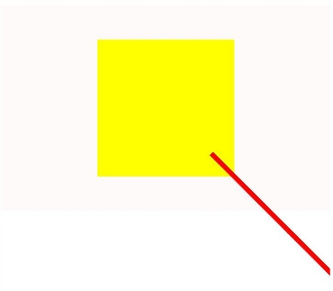

# 自定义绘制
当监听到注册的事件为绘制类型时，可通过自定义绘制功能执行绘制逻辑，自定义绘制的内容。
> **说明：**
> - 在事件注册过程中，需将事件注册为绘制事件（如ARKUI_NODE_CUSTOM_EVENT_ON_DRAW），通过查阅[ArkUI_NodeCustomEventType](../reference/apis-arkui/_ark_u_i___native_module.md#arkui_nodecustomeventtype)枚举值获取事件类型及含义。
> 
> - 若需实现自定义绘制逻辑，应自定义UserData，并在事件注册时进行传递。

- 自定义节点的创建，通过ArkUI_NativeNodeAPI_1的create接口，传入ARKUI_NODE_CUSTOM创建自定义节点。
    ```c++
    auto customNode = nodeAPI->createNode(ARKUI_NODE_CUSTOM);
    ```

- 在事件注册时将自定义节点、事件类型（例如ARKUI_NODE_CUSTOM_EVENT_ON_FOREGROUND_DRAW，获取NDK接口支持的事件类型范围可通过查询[ArkUI_NodeCustomEventType](../reference/apis-arkui/_ark_u_i___native_module.md#arkui_nodecustomeventtype)枚举值）、事件ID和UserData作为参数传入。
    ```c++
    //UserData
    struct A {
        int32_t a =6;
        bool flag = true;
        ArkUI_NodeHandle node;
    };
    A *a = new A;
    a->node = customNode;
    nodeAPI->registerNodeCustomEvent(customNode,ARKUI_NODE_CUSTOM_EVENT_ON_FOREGROUND_DRAW,1,a);
    nodeAPI->registerNodeCustomEventReceiver([](ArkUI_NodeCustomEvent *event) {
    //事件回调函数逻辑
    });
    ```

- 在回调函数中，获取自定义事件的事件类型（通过[OH_ArkUI_NodeCustomEvent_GetEventType](../reference/apis-arkui/_ark_u_i___native_module.md#oh_arkui_nodecustomevent_geteventtype)）、事件ID（通过[OH_ArkUI_NodeCustomEvent_GetEventTargetId](../reference/apis-arkui/_ark_u_i___native_module.md#oh_arkui_nodecustomevent_geteventtargetid)获取）、UserData（通过[OH_ArkUI_NodeCustomEvent_GetUserData](../reference/apis-arkui/_ark_u_i___native_module.md#oh_arkui_nodecustomevent_getuserdata)获取）进行判断，以执行不同的逻辑。

    ```c++
    auto type = OH_ArkUI_NodeCustomEvent_GetEventType(event);
    auto targetId = OH_ArkUI_NodeCustomEvent_GetEventTargetId(event);
    auto userData =reinterpret_cast<A *>( OH_ArkUI_NodeCustomEvent_GetUserData(event));
    ```

- [OH_ArkUI_NodeCustomEvent_GetDrawContextInDraw](../reference/apis-arkui/_ark_u_i___native_module.md#oh_arkui_nodecustomevent_getdrawcontextindraw)通过自定义组件事件获取绘制上下文，并将其传入 [OH_ArkUI_DrawContext_GetCanvas](../reference/apis-arkui/_ark_u_i___native_module.md#oh_arkui_drawcontext_getcanvas)中以获取绘制canvas指针，该指针随后转换为OH_Drawing_Canvas指针进行绘制。
    ```c++
    //获取自定事件绘制的上下文。
    auto *drawContext = OH_ArkUI_NodeCustomEvent_GetDrawContextInDraw(event);
    //获取绘制canvas指针。
    auto *canvas1 = OH_ArkUI_DrawContext_GetCanvas(drawContext);
    //转换为OH_Drawing_Canvas指针进行绘制。
    OH_Drawing_Canvas *canvas = reinterpret_cast<OH_Drawing_Canvas *>(canvas1);
    //绘制逻辑。
    int32_t width = 1000;
    int32_t height = 1000;
    auto path = OH_Drawing_PathCreate();
    OH_Drawing_PathMoveTo(path, width / 4, height / 4);
    OH_Drawing_PathLineTo(path, width * 3 / 4, height * 3 / 4);
    OH_Drawing_PathLineTo(path, width * 3 / 4, height * 3 / 4);
    OH_Drawing_PathLineTo(path, width * 3 / 4, height * 3 / 4);
    OH_Drawing_PathLineTo(path, width * 3 / 4, height * 3 / 4);
    OH_Drawing_PathClose(path);
    auto pen = OH_Drawing_PenCreate();
    OH_Drawing_PenSetWidth(pen, 10);
    OH_Drawing_PenSetColor(pen, OH_Drawing_ColorSetArgb(0xFF, 0xFF, 0x00, 0x00));
    OH_Drawing_CanvasAttachPen(canvas, pen);
    OH_Drawing_CanvasDrawPath(canvas, path);
    ```
**完整示例：** 
   
```c++
ArkUI_NodeHandle test(ArkUI_NativeNodeAPI_1 *nodeAPI) {
    //创建节点
    auto column = nodeAPI->createNode(ARKUI_NODE_COLUMN);
    auto customNode = nodeAPI->createNode(ARKUI_NODE_CUSTOM);
    ArkUI_NumberValue value[] = {480};
    ArkUI_AttributeItem item = {value, 1};
    //属性设置
    nodeAPI->setAttribute(column, NODE_WIDTH, &item);
    value[0].i32 = 720;
    nodeAPI->setAttribute(column, NODE_HEIGHT, &item);
    ArkUI_NumberValue NODE_WIDTH_value[] = {200};
    ArkUI_AttributeItem NODE_WIDTH_Item[] = {NODE_WIDTH_value, 1};
    ArkUI_NumberValue NODE_HEIGHT_value[] = {200};
    ArkUI_AttributeItem NODE_HEIGHT_Item[] = {NODE_HEIGHT_value, 1};
    ArkUI_NumberValue NODE_BACKGROUND_COLOR_item_value[] = {{.u32 = 0xFFFFFF00}};
    ArkUI_AttributeItem NODE_BACKGROUND_COLOR_Item[] = {NODE_BACKGROUND_COLOR_item_value, 1};
    //自定义UserData。
    struct A {
        int32_t a =6;
        bool flag = true;
        ArkUI_NodeHandle node;
    };
    A *a = new A;
    a->node = customNode;
    nodeAPI->setAttribute(customNode, NODE_WIDTH, NODE_WIDTH_Item);
    nodeAPI->setAttribute(customNode, NODE_HEIGHT, NODE_HEIGHT_Item);
    nodeAPI->setAttribute(customNode, NODE_BACKGROUND_COLOR, NODE_BACKGROUND_COLOR_Item);
    //进行事件注册
    nodeAPI->registerNodeCustomEvent(customNode,ARKUI_NODE_CUSTOM_EVENT_ON_FOREGROUND_DRAW,1,a);
    //事件回调函数的编写
    nodeAPI->registerNodeCustomEventReceiver([](ArkUI_NodeCustomEvent *event) {
        //获取自定义事件的相关信息。
        auto type = OH_ArkUI_NodeCustomEvent_GetEventType(event);
        auto targetId = OH_ArkUI_NodeCustomEvent_GetEventTargetId(event);
        auto userData =reinterpret_cast<A *>( OH_ArkUI_NodeCustomEvent_GetUserData(event));
        if (type == ARKUI_NODE_CUSTOM_EVENT_ON_FOREGROUND_DRAW && targetId == 1 && userData->flag) {
            //获取自定事件绘制的上下文。
            auto *drawContext = OH_ArkUI_NodeCustomEvent_GetDrawContextInDraw(event);
            //获取绘制canvas指针。
            auto *canvas1 = OH_ArkUI_DrawContext_GetCanvas(drawContext);
            //转换为OH_Drawing_Canvas指针进行绘制。
            OH_Drawing_Canvas *canvas = reinterpret_cast<OH_Drawing_Canvas *>(canvas1);
            int32_t width = 1000;
            int32_t height = 1000;
            auto path = OH_Drawing_PathCreate();
            OH_Drawing_PathMoveTo(path, width / 4, height / 4);
            OH_Drawing_PathLineTo(path, width * 3 / 4, height * 3 / 4);
            OH_Drawing_PathLineTo(path, width * 3 / 4, height * 3 / 4);
            OH_Drawing_PathLineTo(path, width * 3 / 4, height * 3 / 4);
            OH_Drawing_PathLineTo(path, width * 3 / 4, height * 3 / 4);
            OH_Drawing_PathClose(path);
            auto pen = OH_Drawing_PenCreate();
            OH_Drawing_PenSetWidth(pen, 10);
            OH_Drawing_PenSetColor(pen, OH_Drawing_ColorSetArgb(0xFF, 0xFF, 0x00, 0x00));
            OH_Drawing_CanvasAttachPen(canvas, pen);
            OH_Drawing_CanvasDrawPath(canvas, path);
        }
    });
    //自定义节点上树
    nodeAPI->addChild(column, customNode);
    return column;
    }
```
