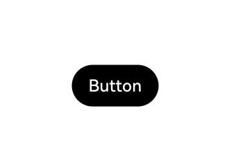
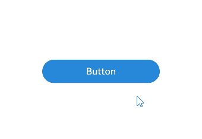

# 属性修改器 (AttributeModifier)

## 概述
声明式语法引入了[@Styles](../ui/state-management/arkts-style.md)和[@Extend](../ui/state-management/arkts-extend.md)两个装饰器，可以解决复用相同自定义样式的问题，但是存在以下受限场景：
- @Styles和@Extend均是编译期处理，不支持跨文件的导出复用。
- @Styles仅能支持通用属性、事件，不支持组件特有的属性。
- @Styles虽然支持在多态样式下使用，但不支持传参，无法对外开放一些属性。
- @Extend虽然能支持特定组件的私有属性、事件，但同样不支持跨文件导出复用。
- @Styles、@Extend对于属性设置，无法支持业务逻辑编写，动态决定是否设置某些属性，只能通过三元表达式对所有可能设置的属性进行全量设置，设置大量属性时效率较低。


为了解决上述问题，ArkUI引入了AttributeModifier机制，可以通过Modifier对象动态修改属性。能力对比如下：
|  能力  |  @Styles  |  @Extend  |  AttributeModifier  |
| :-----: | :-----: | :-----: | :-----: |
|  跨文件导出  |  不支持  |  不支持  |  支持  |
|  通用属性设置  |  支持  |  支持  |  支持  |
|  通用事件设置  |  支持  |  支持  |  部分支持  |
|  组件特有属性设置  |  不支持  |  支持  |  部分支持  |
|  组件特有事件设置  |  不支持  |  支持  |  部分支持  |
|  参数传递  |  不支持  |  支持  |  支持  |
|  多态样式  |  支持  |  不支持  |  支持  |
|  业务逻辑  |  不支持  |  不支持  |  支持  |

可以看出，与@Styles和@Extend相比，AttributeModifier提供了更强的能力和灵活性，且在持续完善全量的属性和事件设置能力，因此推荐优先使用AttributeModifier。

## 接口定义

```ts
declare interface AttributeModifier<T> {

  applyNormalAttribute?(instance: T): void;
  
  applyPressedAttribute?(instance: T): void;
  
  applyFocusedAttribute?(instance: T): void;
  
  applyDisabledAttribute?(instance: T): void;
  
  applySelectedAttribute?(instance: T): void;

}
```

`AttributeModifier`是一个接口，开发者需要实现其中的`applyXxxAttribute`方法来实现对应场景的属性设置。`Xxx`表示多态的场景，支持默认态（`Normal`）、按压态（`Pressed`）、焦点态（`Focused`）、禁用态（`Disabled`）、选择态（`Selected`）。`T`是组件的属性类型，开发者可以在回调中获取到属性对象，通过该对象设置属性。

```ts
declare class CommonMethod<T> {
  attributeModifier(modifier: AttributeModifier<T>): T;
}
```

组件的通用方法增加了`attributeModifier`方法，支持传入自定义的Modifier。由于组件在实例化时会明确`T`的类型，所以调用该方法时，`T`必须指定为组件对应的Attribute类型，或者是`CommonAttribute`。

## 使用说明

- 组件通用方法`attributeModifier`支持传入一个实现`AttributeModifier<T>`接口的实例，`T`必须指定为组件对应的Attribute类型，或者是`CommonAttribute`。
- 在组件首次初始化或者关联的状态变量发生变化时，如果传入的实例实现了对应接口，会触发`applyNormalAttribute`。
- 回调`applyNormalAttribute`时，会传入组件属性对象，通过该对象可以设置当前组件的属性/事件。
- 暂未支持的属性/事件，执行时会抛异常。
- 属性变化触发`applyXxxAttribute`函数时，该组件之前已设置的属性，在本次变化后未设置的属性会恢复为属性的默认值。
- 可以通过该接口使用多态样式的功能，例如如果需要在组件进入按压态时设置某些属性，就可以通过自定义实现`applyPressedAttribute`方法完成。
- 一个组件上同时使用属性方法和`applyNormalAttribute`设置相同的属性，遵循属性覆盖原则，即后设置的属性生效。
- 一个Modifier实例对象可以在多个组件上使用。
- 一个组件上多次使用`applyNormalAttribute`设置不同的Modifier实例，每次状态变量刷新均会按顺序执行这些实例的方法属性设置，同样遵循属性覆盖原则。

## 设置和修改组件属性

AttributeModifier可以分离UI与样式，支持参数传递及业务逻辑编写，并且通过状态变量触发刷新。

  ```ts
  // button_modifier.ets
  export class MyButtonModifier implements AttributeModifier<ButtonAttribute> {
    // 可以实现一个Modifier，定义私有的成员变量，外部可动态修改
    isDark: boolean = false

    // 通过构造函数，创建时传参
    constructor(dark?: boolean) {
      this.isDark = dark ? dark : false
    }

    applyNormalAttribute(instance: ButtonAttribute): void {
      // instance为Button的属性对象，可以通过instance对象对属性进行修改
      if (this.isDark) { // 支持业务逻辑的编写
        // 属性变化触发apply函数时，变化前已设置并且变化后未设置的属性会恢复为默认值
        instance.backgroundColor('#707070')
      } else {
        // 支持属性的链式调用
        instance.backgroundColor('#17A98D')
          .borderColor('#707070')
          .borderWidth(2)
      }
    }
  }
  ```
  ```ts
  // demo.ets
  import { MyButtonModifier } from './button_modifier'

  @Entry
  @Component
  struct attributeDemo {
    // 支持用状态装饰器修饰，行为和普通的对象一致
    @State modifier: MyButtonModifier = new MyButtonModifier(true);

    build() {
      Row() {
        Column() {
          Button("Button")
            .attributeModifier(this.modifier)
            .onClick(() => {
              // 对象的一层属性被修改时，会触发UI刷新，重新执行applyNormalAttribute
              this.modifier.isDark = !this.modifier.isDark
            })
        }
        .width('100%')
      }
      .height('100%')
    }
  }
  ```
  

当一个组件上同时使用属性方法和`applyNormalAttribute`设置相同的属性时，遵循属性覆盖原则，即后设置的属性生效。

  ```ts
  // button_modifier.ets
  export class MyButtonModifier implements AttributeModifier<ButtonAttribute> {
    isDark: boolean = false

    constructor(dark?: boolean) {
      this.isDark = dark ? dark : false
    }

    applyNormalAttribute(instance: ButtonAttribute): void {
      if (this.isDark) {
        instance.backgroundColor('#707070')
      } else {
        instance.backgroundColor('#17A98D')
          .borderColor('#707070')
          .borderWidth(2)
      }
    }
  }
  ```
  ```ts
  // demo.ets
  import { MyButtonModifier } from './button_modifier';

  @Entry
  @Component
  struct attributeDemo {
    @State modifier: MyButtonModifier = new MyButtonModifier(true);

    build() {
      Row() {
        Column() {
          // 先设置属性，后设置modifier，按钮颜色会跟随modifier的值改变
          Button("Button")
            .backgroundColor('#2787D9')
            .attributeModifier(this.modifier)
            .onClick(() => {
              this.modifier.isDark = !this.modifier.isDark
            })
        }
        .width('100%')
      }
      .height('100%')
    }
  }
  ```
   

当一个组件上多次使用`applyNormalAttribute`设置不同的Modifier实例时，每次状态变量刷新均会按顺序执行这些实例的方法属性设置，遵循属性覆盖原则，即后设置的属性生效。

  ```ts
  // button_modifier.ets
  export class MyButtonModifier implements AttributeModifier<ButtonAttribute> {
    isDark: boolean = false

    constructor(dark?: boolean) {
      this.isDark = dark ? dark : false
    }

    applyNormalAttribute(instance: ButtonAttribute): void {
      if (this.isDark) {
        instance.backgroundColor(Color.Black)
          .width(200)
      } else {
        instance.backgroundColor(Color.Red)
          .width(100)
      }
    }
  }
  ```
  ```ts
  // button_modifier2.ets
  export class MyButtonModifier2 implements AttributeModifier<ButtonAttribute> {
    isDark2: boolean = false

    constructor(dark?: boolean) {
      this.isDark2 = dark ? dark : false
    }

    applyNormalAttribute(instance: ButtonAttribute): void {
      if (this.isDark2) {
        instance.backgroundColor('#2787D9')
      } else {
        instance.backgroundColor('#707070')
      }
    }
  }
  ```
  ```ts
  // demo.ets
  import { MyButtonModifier } from './button_modifier';
  import { MyButtonModifier2 } from './button_modifier2';

  @Entry
  @Component
  struct attributeDemo {
    @State modifier: MyButtonModifier = new MyButtonModifier(true);
    @State modifier2: MyButtonModifier2 = new MyButtonModifier2(true);

    build() {
      Row() {
        Column() {
          Button("Button")
            .attributeModifier(this.modifier)
            .attributeModifier(this.modifier2)
            .onClick(() => {
              this.modifier.isDark = !this.modifier.isDark
              this.modifier2.isDark2 = !this.modifier2.isDark2
            })
        }
        .width('100%')
      }
      .height('100%')
    }
  }
  ```
   

## 设置多态样式、事件

使用`AttributeModifier`设置多态样式、事件，实现事件逻辑的复用，支持默认态（`Normal`）、按压态（`Pressed`）、焦点态（`Focused`）、禁用态（`Disabled`）、选择态（`Selected`）。例如如果需要在组件进入按压态时设置某些属性，就可以通过自定义实现`applyPressedAttribute`方法完成。

  ```ts
  // button_modifier.ets
  export class MyButtonModifier implements AttributeModifier<ButtonAttribute> {
    applyNormalAttribute(instance: ButtonAttribute): void {
      // instance为Button的属性对象，设置正常状态下属性值
      instance.backgroundColor('#17A98D')
        .borderColor('#707070')
        .borderWidth(2)
    }

    applyPressedAttribute(instance: ButtonAttribute): void {
      // instance为Button的属性对象，设置按压状态下属性值
      instance.backgroundColor('#2787D9')
        .borderColor('#FFC000')
        .borderWidth(5)
    }
  }
  ```
  ```ts
  // demo.ets
  import { MyButtonModifier } from './button_modifier'

  @Entry
  @Component
  struct attributeDemo {
    @State modifier: MyButtonModifier = new MyButtonModifier();

    build() {
      Row() {
        Column() {
          Button("Button")
            .attributeModifier(this.modifier)
        }
        .width('100%')
      }
      .height('100%')
    }
  }

  ```
   