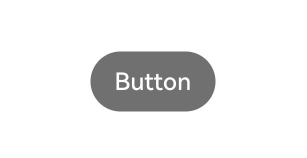
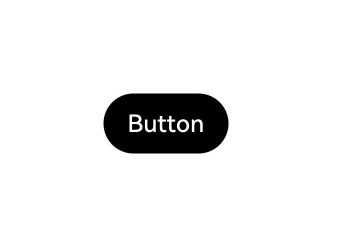
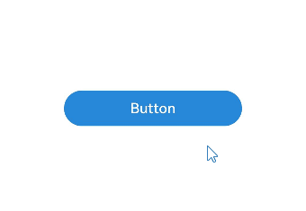
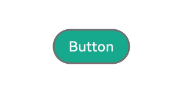

# 属性修改器 (AttributeModifier)
<!--Kit: ArkUI-->
<!--Subsystem: ArkUI-->
<!--Owner: @wangyang2022-->
<!--Designer: @wangyang2022-->
<!--Tester: @sally__-->
<!--Adviser: @Brilliantry_Rui-->

## 概述
声明式语法引入了[@Styles](../ui/state-management/arkts-style.md)和[@Extend](../ui/state-management/arkts-extend.md)两个装饰器，可以解决复用相同自定义样式的问题，但是存在以下受限场景：
- @Styles和@Extend均是编译期处理，不支持跨文件的导出复用。
- @Styles仅能支持通用属性、事件，不支持组件特有的属性。
- @Styles虽然支持在多态样式下使用，但不支持传参，无法对外开放一些属性。
- @Extend虽然能支持特定组件的私有属性、事件，但同样不支持跨文件导出复用。
- @Styles、@Extend对于属性设置，无法支持业务逻辑编写，动态决定是否设置某些属性，只能通过三元表达式对所有可能设置的属性进行全量设置，设置大量属性时效率较低。


为了解决上述问题，ArkUI引入了AttributeModifier机制，可以通过Modifier对象动态修改属性。能力对比如下：
|  能力  |  @Styles  |  @Extend  |  AttributeModifier  |
| :-----: | :-----: | :-----: | :-----: |
|  跨文件导出  |  不支持  |  不支持  |  支持  |
|  通用属性设置  |  支持  |  支持  |  支持  |
|  通用事件设置  |  支持  |  支持  |  部分支持  |
|  组件特有属性设置  |  不支持  |  支持  |  部分支持  |
|  组件特有事件设置  |  不支持  |  支持  |  部分支持  |
|  参数传递  |  不支持  |  支持  |  支持  |
|  多态样式  |  支持  |  不支持  |  支持  |
|  业务逻辑  |  不支持  |  不支持  |  支持  |

可以看出，与@Styles和@Extend相比，AttributeModifier提供了更强的能力和灵活性，且在持续完善全量的属性和事件设置能力，因此推荐优先使用AttributeModifier。

## 接口定义

  <!-- @[Common_AttributeModifier](https://gitcode.com/openharmony/applications_app_samples/blob/master/code/DocsSample/ArkUISample/ButtonAttribute/entry/src/main/ets/Common/ButtonModifier01.ets) -->
  
  ``` TypeScript
  declare interface AttributeModifier<T> {
  
    applyNormalAttribute?(instance: T): void;
  
    applyPressedAttribute?(instance: T): void;
  
    applyFocusedAttribute?(instance: T): void;
  
    applyDisabledAttribute?(instance: T): void;
  
    applySelectedAttribute?(instance: T): void;
  
  }
  ```


`AttributeModifier`是一个接口，开发者需要实现其中的`applyXxxAttribute`方法来实现对应场景的属性设置。`Xxx`表示多态的场景，支持默认态（`Normal`）、按压态（`Pressed`）、焦点态（`Focused`）、禁用态（`Disabled`）、选择态（`Selected`）。`T`是组件的属性类型，开发者可以在回调中获取到属性对象，通过该对象设置属性。

  <!-- @[Common_CommonMethod](https://gitcode.com/openharmony/applications_app_samples/blob/master/code/DocsSample/ArkUISample/ButtonAttribute/entry/src/main/ets/Common/ButtonModifier01.ets) -->
  
  ``` TypeScript
  declare class CommonMethod<T> {
    attributeModifier(modifier: AttributeModifier<T>): T;
  }
  ```


组件的通用方法增加了`attributeModifier`方法，支持传入自定义的Modifier。由于组件在实例化时会明确`T`的类型，所以调用该方法时，`T`必须指定为组件对应的Attribute类型，或者是`CommonAttribute`。

## 使用说明

- 组件通用方法`attributeModifier`支持传入一个实现`AttributeModifier<T>`接口的实例，`T`必须指定为组件对应的Attribute类型，或者是[通用属性](../reference/apis-arkui/arkui-ts/ts-component-general-attributes.md)（CommonAttribute）。
- 在组件首次初始化或者关联的状态变量发生变化时，如果传入的实例实现了对应接口，会触发`applyNormalAttribute`。
- 回调[applyNormalAttribute](../reference/apis-arkui/arkui-ts/ts-universal-attributes-attribute-modifier.md#applynormalattribute)时，会传入组件属性对象，通过该对象可以设置当前组件的属性/事件。
- 暂未支持的属性/事件，执行时会抛异常。
- 属性变化触发`applyXxxAttribute`函数时，该组件之前已设置的属性，在本次变化后未设置的属性会恢复为属性的默认值。
- 可以通过该接口使用多态样式的功能，例如如果需要在组件进入按压态时设置某些属性，就可以通过自定义实现[applyPressedAttribute](../reference/apis-arkui/arkui-ts/ts-universal-attributes-attribute-modifier.md#applypressedattribute)方法完成。
- 在attributeModifier中设置的属性尽量不要与其他方法设置的属性相同，避免在页面刷新时attributeModifier不生效。
- 一个Modifier实例对象可以在多个组件上使用。
- 一个组件上多次使用`applyNormalAttribute`设置不同的Modifier实例，每次状态变量刷新均会按顺序执行这些实例的方法属性设置，同样遵循属性覆盖原则。

## 设置和修改组件属性

AttributeModifier可以分离UI与样式，支持参数传递及业务逻辑编写，并且通过状态变量触发刷新。

  <!-- @[Common_MyButtonModifier](https://gitcode.com/openharmony/applications_app_samples/blob/master/code/DocsSample/ArkUISample/ButtonAttribute/entry/src/main/ets/Common/ButtonModifier01.ets) -->
  
  ``` TypeScript
  export class MyButtonModifier implements AttributeModifier<ButtonAttribute> {
    // 可以实现一个Modifier，定义私有的成员变量，外部可动态修改
    public isDark: boolean = false
  
    // 通过构造函数，创建时传参
    constructor(dark?: boolean) {
      this.isDark = dark ?? false
    }
  
    applyNormalAttribute(instance: ButtonAttribute): void {
      // instance为Button的属性对象，可以通过instance对象对属性进行修改
      if (this.isDark) { // 支持业务逻辑的编写
        // 属性变化触发apply函数时，变化前已设置并且变化后未设置的属性会恢复为默认值
        instance.backgroundColor('#707070')
      } else {
        // 支持属性的链式调用
        instance.backgroundColor('#17A98D')
          .borderColor('#707070')
          .borderWidth(2)
      }
    }
  }
  ```

  <!-- @[main_button1](https://gitcode.com/openharmony/applications_app_samples/blob/master/code/DocsSample/ArkUISample/ButtonAttribute/entry/src/main/ets/pages/Button1.ets) -->
  
  ``` TypeScript
  
  // pages/Button1.ets
  import { MyButtonModifier } from '../Common/ButtonModifier01'
  
  @Entry
  @Component
  struct Button1 {
    // 支持用状态装饰器修饰，行为和普通的对象一致
    @State modifier: MyButtonModifier = new MyButtonModifier(true);
  
    build() {
      Row() {
        Column() {
          Button('Button')
            .attributeModifier(this.modifier)
            .onClick(() => {
              // 对象的一层属性被修改时，会触发UI刷新，重新执行applyNormalAttribute
              this.modifier.isDark = !this.modifier.isDark
            })
        }
        .width('100%')
      }
      .height('100%')
    }
  }
  ```

  


  <!-- @[Common_MyButtonModifier](https://gitcode.com/openharmony/applications_app_samples/blob/master/code/DocsSample/ArkUISample/ButtonAttribute/entry/src/main/ets/Common/ButtonModifier01.ets) -->
  
  ``` TypeScript
  export class MyButtonModifier implements AttributeModifier<ButtonAttribute> {
    // 可以实现一个Modifier，定义私有的成员变量，外部可动态修改
    public isDark: boolean = false
  
    // 通过构造函数，创建时传参
    constructor(dark?: boolean) {
      this.isDark = dark ?? false
    }
  
    applyNormalAttribute(instance: ButtonAttribute): void {
      // instance为Button的属性对象，可以通过instance对象对属性进行修改
      if (this.isDark) { // 支持业务逻辑的编写
        // 属性变化触发apply函数时，变化前已设置并且变化后未设置的属性会恢复为默认值
        instance.backgroundColor('#707070')
      } else {
        // 支持属性的链式调用
        instance.backgroundColor('#17A98D')
          .borderColor('#707070')
          .borderWidth(2)
      }
    }
  }
  ```
  <!-- @[main_button2](https://gitcode.com/openharmony/applications_app_samples/blob/master/code/DocsSample/ArkUISample/ButtonAttribute/entry/src/main/ets/pages/Button2.ets) -->
  
  ``` TypeScript
  
  // pages/Button2.ets
  import { MyButtonModifier } from '../Common/ButtonModifier01'
  
  @Entry
  @Component
  struct Button2 {
    @State modifier: MyButtonModifier = new MyButtonModifier(true);
  
    build() {
      Row() {
        Column() {
          // 先设置属性，后设置modifier，按钮颜色会跟随modifier的值改变
          Button('Button')
            .backgroundColor('#2787D9')
            .attributeModifier(this.modifier)
            .onClick(() => {
              this.modifier.isDark = !this.modifier.isDark
            })
        }
        .width('100%')
      }
      .height('100%')
    }
  }
  ```

   

当一个组件上多次使用`applyNormalAttribute`设置不同的Modifier实例时，每次状态变量刷新均会按顺序执行这些实例的方法属性设置，遵循属性覆盖原则，即后设置的属性生效。

  <!-- @[Common_MyButtonModifier2](https://gitcode.com/openharmony/applications_app_samples/blob/master/code/DocsSample/ArkUISample/ButtonAttribute/entry/src/main/ets/Common/ButtonModifier02.ets) -->
  
  ``` TypeScript
  export class MyButtonModifier2 implements AttributeModifier<ButtonAttribute> {
    public isDark: boolean = false
  
    constructor(dark?: boolean) {
      this.isDark = dark ?? false
    }
  
    applyNormalAttribute(instance: ButtonAttribute): void {
      if (this.isDark) {
        instance.backgroundColor(Color.Black)
          .width(200)
      } else {
        instance.backgroundColor(Color.Red)
          .width(100)
      }
    }
  }
  ```
  <!-- @[Common_MyButtonModifier3](https://gitcode.com/openharmony/applications_app_samples/blob/master/code/DocsSample/ArkUISample/ButtonAttribute/entry/src/main/ets/Common/ButtonModifier03.ets) -->
  
  ``` TypeScript
  export class MyButtonModifier3 implements AttributeModifier<ButtonAttribute> {
    public isDark2: boolean = false
  
    constructor(dark?: boolean) {
      this.isDark2 = dark ? dark : false
    }
  
    applyNormalAttribute(instance: ButtonAttribute): void {
      if (this.isDark2) {
        instance.backgroundColor('#2787D9')
      } else {
        instance.backgroundColor('#707070')
      }
    }
  }
  ```
  <!-- @[main_button3](https://gitcode.com/openharmony/applications_app_samples/blob/master/code/DocsSample/ArkUISample/ButtonAttribute/entry/src/main/ets/pages/Button3.ets) -->
  
  ``` TypeScript
  
  // pages/Button3.ets
  import { MyButtonModifier2 } from '../Common/ButtonModifier02';
  import { MyButtonModifier3 } from '../Common/ButtonModifier03';
  
  @Entry
  @Component
  struct Button3 {
    @State modifier: MyButtonModifier2 = new MyButtonModifier2(true);
    @State modifier2: MyButtonModifier3 = new MyButtonModifier3(true);
  
    build() {
      Row() {
        Column() {
          Button('Button')
            .attributeModifier(this.modifier)
            .attributeModifier(this.modifier2)
            .onClick(() => {
              this.modifier.isDark = !this.modifier.isDark
              this.modifier2.isDark2 = !this.modifier2.isDark2
            })
        }
        .width('100%')
      }
      .height('100%')
    }
  }
  ```

   

## 设置多态样式、事件

使用`AttributeModifier`设置多态样式、事件，实现事件逻辑的复用，支持默认态（`Normal`）、按压态（`Pressed`）、焦点态（`Focused`）、禁用态（`Disabled`）、选择态（`Selected`）。例如如果需要在组件进入按压态时设置某些属性，就可以通过自定义实现`applyPressedAttribute`方法完成。

  <!-- @[Common_MyButtonModifier4](https://gitcode.com/openharmony/applications_app_samples/blob/master/code/DocsSample/ArkUISample/ButtonAttribute/entry/src/main/ets/Common/ButtonModifier04.ets) -->
  
  ``` TypeScript
  export class MyButtonModifier4 implements AttributeModifier<ButtonAttribute> {
    applyNormalAttribute(instance: ButtonAttribute): void {
      // instance为Button的属性对象，设置正常状态下属性值
      instance.backgroundColor('#17A98D')
        .borderColor('#707070')
        .borderWidth(2)
    }
  
    applyPressedAttribute(instance: ButtonAttribute): void {
      // instance为Button的属性对象，设置按压状态下属性值
      instance.backgroundColor('#2787D9')
        .borderColor('#FFC000')
        .borderWidth(5)
    }
  }
  ```
  <!-- @[main_button4](https://gitcode.com/openharmony/applications_app_samples/blob/master/code/DocsSample/ArkUISample/ButtonAttribute/entry/src/main/ets/pages/Button4.ets) -->
  
  ``` TypeScript
  
  // pages/Button4.ets
  import { MyButtonModifier4 } from '../Common/ButtonModifier04'
  
  @Entry
  @Component
  struct Button4 {
    @State modifier: MyButtonModifier4 = new MyButtonModifier4();
  
    build() {
      Row() {
        Column() {
          Button('Button')
            .attributeModifier(this.modifier)
        }
        .width('100%')
      }
      .height('100%')
    }
  }
  ```
  
   

  ## 属性或事件对attributeModifier的支持情况
  
  通过attributeModifier动态设置属性或事件的能力从API version 11开始支持。
  
  ### 属性或事件不支持attributeModifier的范围
  
  下表说明了当前不支持attributeModifier的属性或事件。若无特殊说明，属性或事件默认在首次开放时支持attributeModifier。
  
  | 组件通用信息/系统组件的名称 | 属性/事件的名称             | 告警信息                  | 说明                                    |
  | ------------------------ | -------- | ----------------------------------------- | ------------------------ |
  | CommonAttribute | [accessibilityText](../reference/apis-arkui/arkui-ts/ts-universal-attributes-accessibility.md#accessibilitytext12)     | -   | -  |
  | CommonAttribute | [accessibilityDescription](../reference/apis-arkui/arkui-ts/ts-universal-attributes-accessibility.md#accessibilitydescription12)     | -   | -  |
  | CommonAttribute | [animation](../reference/apis-arkui/arkui-ts/ts-animatorproperty.md#animation)                | Method not implemented.   | 不支持animation相关属性。                 |
  | CommonAttribute | [attributeModifier](../reference/apis-arkui/arkui-ts/ts-universal-attributes-attribute-modifier.md#attributemodifier)        | -                         | attributeModifier不支持嵌套使用，不生效。 |
  | CommonAttribute | [backgroundFilter](../reference/apis-arkui/arkui-ts/ts-universal-attributes-filter-effect.md#backgroundfilter)         | is not callable           | -                                         |
  | CommonAttribute | [compositingFilter](../reference/apis-arkui/arkui-ts/ts-universal-attributes-filter-effect.md#compositingfilter)        | is not callable           | -                                         |
  | CommonAttribute | [drawModifier](../reference/apis-arkui/arkui-ts/ts-universal-attributes-draw-modifier.md#drawmodifier)             | is not callable           | 不支持modifier相关的属性。                |
  | CommonAttribute | [foregroundFilter](../reference/apis-arkui/arkui-ts/ts-universal-attributes-filter-effect.md#foregroundfilter)         | is not callable           | -                                         |
  | CommonAttribute    | [freeze](../reference/apis-arkui/arkui-ts/ts-universal-attributes-image-effect.md#freeze18)                   | is not callable           | -                                         |
  | CommonAttribute    | [gesture](../reference/apis-arkui/arkui-ts/ts-gesture-settings.md#gesture)                   | Method not implemented.   | 不支持gesture相关的属性。                 |
  | CommonAttribute | [gestureModifier](../reference/apis-arkui/arkui-ts/ts-universal-attributes-gesture-modifier.md#gesturemodifier)          | is not callable           | 不支持modifier相关的属性。                |
  | CommonAttribute | [onAccessibilityHover](../reference/apis-arkui/arkui-ts/ts-universal-accessibility-hover-event.md#onaccessibilityhover)      | is not callable           | -                                         |
  | CommonAttribute | [onDigitalCrown](../reference/apis-arkui/arkui-ts/ts-universal-events-crown.md#ondigitalcrown)            | is not callable.          | -                                       |
  | CommonAttribute | [parallelGesture](../reference/apis-arkui/arkui-ts/ts-gesture-settings.md#parallelgesture)          | Method not implemented.   | 不支持gesture相关的属性。                 |
  | CommonAttribute | [priorityGesture](../reference/apis-arkui/arkui-ts/ts-gesture-settings.md#prioritygesture)          | Method not implemented.   | 不支持gesture相关的属性。                 |
  | CommonAttribute   | [reuseId](../reference/apis-arkui/arkui-ts/ts-universal-attributes-reuse-id.md#reuseid)                  | Method not implemented.   | -                                         |
  | CommonAttribute | [stateStyles](../reference/apis-arkui/arkui-ts/ts-universal-attributes-polymorphic-style.md#statestyles)              | Method not implemented.   | 不支持stateStyles相关的属性。             |
  | CommonAttribute | [useSizeType](../reference/apis-arkui/arkui-ts/ts-universal-attributes-grid.md#属性)            | Method not implemented.   | 不支持已废弃属性。                        |
  | CommonAttribute | [visualEffect](../reference/apis-arkui/arkui-ts/ts-universal-attributes-filter-effect.md#visualeffect)             | is not callable           | -                                         |
  | CommonAttribute | [bindContextMenu](../reference/apis-arkui/arkui-ts/ts-universal-attributes-menu.md#bindcontextmenu12) | Method not implemented. | 不支持入参为CustomBuilder。 |
  | CommonAttribute | [bindContentCover](../reference/apis-arkui/arkui-ts/ts-universal-attributes-modal-transition.md#bindcontentcover) | Method not implemented. | 不支持入参为CustomBuilder。 |
  | CommonAttribute | [bindSheet](../reference/apis-arkui/arkui-ts/ts-universal-attributes-sheet-transition.md#bindsheet) | Method not implemented. | 不支持入参为CustomBuilder。 |
  | CommonAttribute | [dragPreview](../reference/apis-arkui/arkui-ts/ts-universal-attributes-drag-drop.md#dragpreview15) | Builder is not supported. | 不支持入参为CustomBuilder。 |
  | CommonAttribute | [bindPopup](../reference/apis-arkui/arkui-ts/ts-universal-attributes-popup.md#bindpopup) | Method not implemented. | 不支持入参为CustomBuilder。 |
  | CommonAttribute | [accessibilityVirtualNode](../reference/apis-arkui/arkui-ts/ts-universal-attributes-accessibility.md#accessibilityvirtualnode11) | is not callable | 不支持入参为CustomBuilder。 |
  | CommonAttribute | [chainWeight](../reference/apis-arkui/arkui-ts/ts-universal-attributes-location.md#chainweight14) | - | - |
  | CheckboxGroup |  [contentModifier](../reference/apis-arkui/arkui-ts/ts-basic-components-checkboxgroup.md#contentmodifier21)| - | - |
  | CommonAttribute  | [backgroundImage](../reference/apis-arkui/arkui-ts/ts-universal-attributes-background.md#backgroundimage18) | - | - |
  | CommonAttribute  | [onClick](../reference/apis-arkui/arkui-ts/ts-universal-events-click.md#onclick12) | - | - |
  | CommonAttribute  | [toolbar](../reference/apis-arkui/arkui-ts/ts-universal-attributes-toolbar.md#toolbar) | - | - |
  | CommonAttribute  | [accessibilityGroup](../reference/apis-arkui/arkui-ts/ts-universal-attributes-accessibility.md#accessibilitygroup14) | - | - |
  | CommonAttribute  | [reuse](../reference/apis-arkui/arkui-ts/ts-universal-attributes-reuse.md#reuse) | - | - |
  | CommonAttribute  | [onGestureRecognizerJudgeBegin](../reference/apis-arkui/arkui-ts/ts-gesture-blocking-enhancement.md#ongesturerecognizerjudgebegin13) | - | - |
  | EmbeddedComponent  | [onError](../reference/apis-arkui/arkui-ts/ts-container-embedded-component.md#onerror) | - | - |
  | EmbeddedComponent  | [onTerminated](../reference/apis-arkui/arkui-ts/ts-container-embedded-component.md#onterminated) | - | - |
  | NavDestination | [backButtonIcon<sup>19+</sup>](../reference/apis-arkui/arkui-ts/ts-basic-components-navdestination.md#backbuttonicon19) | - | - |
  | NavDestination | [menus<sup>19+</sup>](../reference/apis-arkui/arkui-ts/ts-basic-components-navdestination.md#menus19) | - | - |
  | NavDestination | [customTransition](../reference/apis-arkui/arkui-ts/ts-basic-components-navdestination.md#customtransition15) | - | - |
  | Navigation | [backButtonIcon](../reference/apis-arkui/arkui-ts/ts-basic-components-navigation.md#backbuttonicon19) | - | - |
  | Navigation | [menus](../reference/apis-arkui/arkui-ts/ts-basic-components-navigation.md#menus19) | - | - |
  | Repeat | [each](../reference/apis-arkui/arkui-ts/ts-rendering-control-repeat.md#each) | - | - |
  | Repeat | [key](../reference/apis-arkui/arkui-ts/ts-rendering-control-repeat.md#key) | - | - |
  | Repeat | [virtualScroll](../reference/apis-arkui/arkui-ts/ts-rendering-control-repeat.md#virtualscroll) | - | - |
  | Repeat | [template](../reference/apis-arkui/arkui-ts/ts-rendering-control-repeat.md#template) | - | - |
  | Repeat | [templateId](../reference/apis-arkui/arkui-ts/ts-rendering-control-repeat.md#templateid) | - | - |
  | Search | [customKeyboard](../reference/apis-arkui/arkui-ts/ts-basic-components-search.md#customkeyboard10) | - | - |
  | Search | [onWillAttachIME](../reference/apis-arkui/arkui-ts/ts-basic-components-search.md#onwillattachime20) | - | - |
  | Select | [menuItemContentModifier<sup>12+</sup>](../reference/apis-arkui/arkui-ts/ts-basic-components-select.md#menuitemcontentmodifier12) | - | - |
  | Select | [menuItemContentModifier<sup>18+</sup>](../reference/apis-arkui/arkui-ts/ts-basic-components-select.md#menuitemcontentmodifier18) | - | - |
  | Select | [textModifier](../reference/apis-arkui/arkui-ts/ts-basic-components-select.md#textmodifier20) | - | - |
  | Select | [arrowModifier](../reference/apis-arkui/arkui-ts/ts-basic-components-select.md#arrowmodifier20) | - | - |
  | Select | [optionTextModifier](../reference/apis-arkui/arkui-ts/ts-basic-components-select.md#optiontextmodifier20) | - | - |
  | Select | [selectedOptionTextModifier](../reference/apis-arkui/arkui-ts/ts-basic-components-select.md#selectedoptiontextmodifier20) | - | - |
  | Slider | [digitalCrownSensitivity](../reference/apis-arkui/arkui-ts/ts-basic-components-slider.md#digitalcrownsensitivity18) | - | - |
  | Swiper | [prevMargin](../reference/apis-arkui/arkui-ts/ts-container-swiper.md#prevmargin10) | - | - |
  | Swiper | [nextMargin](../reference/apis-arkui/arkui-ts/ts-container-swiper.md#nextmargin10) | - | - |
  | TextArea | [customKeyboard](../reference/apis-arkui/arkui-ts/ts-basic-components-textarea.md#customkeyboard10) | - | - |
  | Text | [bindSelectionMenu](../reference/apis-arkui/arkui-ts/ts-basic-components-text.md#bindselectionmenu11) | - | - |
  | TextInput | [customKeyboard](../reference/apis-arkui/arkui-ts/ts-basic-components-textinput.md#customkeyboard10) | - | - |
  | TextInput | [onWillAttachIME](../reference/apis-arkui/arkui-ts/ts-basic-components-textinput.md#onwillattachime20) | - | - |
  | TextPicker | [onEnterSelectedArea](../reference/apis-arkui/arkui-ts/ts-basic-components-textpicker.md#onenterselectedarea18) | - | - |
  | TimePicker | [onEnterSelectedArea](../reference/apis-arkui/arkui-ts/ts-basic-components-timepicker.md#onenterselectedarea18) | - | - |
  
  ### 属性或事件的起始版本与支持attributeModifier版本不一致的范围
  
  下表说明了属性或事件的起始版本与默认支持attributeModifier版本不一致的情况。若无特殊说明，属性或事件默认在首次开放时支持attributeModifier。
  
  | 组件通用信息/系统组件的名称 | 属性/事件的名称                                              | 属性/事件的起始版本 | 支持attributeModifier的版本 |
  | --------------------------- | ------------------------------------------------------------ | ------------------- | --------------------------- |
  | AlphabetIndexer | [autoCollapse](../reference/apis-arkui/arkui-ts/ts-container-alphabet-indexer.md#autocollapse11) | 11 | 12 |
  | Button | [buttonStyle](../reference/apis-arkui/arkui-ts/ts-basic-components-button.md#buttonstyle11) |11  |12  |
  | Button | [controlSize](../reference/apis-arkui/arkui-ts/ts-basic-components-button.md#controlsize11) |11  |12  |
  | CalendarPicker |[onChange](../reference/apis-arkui/arkui-ts/ts-basic-components-calendarpicker.md#onchange18)  | 18 |20  |
  | Canvas | [enableAnalyzer](../reference/apis-arkui/arkui-ts/ts-components-canvas-canvas.md#enableanalyzer12) | 12 | 20 |
  | CommonAttribute | [accessibilityTextHint](../reference/apis-arkui/arkui-ts/ts-universal-attributes-accessibility.md#accessibilitytexthint12)    | 12   | 20|
  | CommonAttribute | [accessibilityChecked](../reference/apis-arkui/arkui-ts/ts-universal-attributes-accessibility.md#accessibilitychecked13)     | 13 | 20  |
  | CommonAttribute | [accessibilitySelected](../reference/apis-arkui/arkui-ts/ts-universal-attributes-accessibility.md#accessibilityselected13)    | 13 | 20 |
  | CommonAttribute | [background](../reference/apis-arkui/arkui-ts/ts-universal-attributes-background.md#background10) | 10 | 20|
  | CommonAttribute  | [visualEffect](../reference/apis-arkui/arkui-ts/ts-universal-attributes-filter-effect.md#visualeffect) | 12 | 20 |
  | CommonAttribute | [onDragStart](../reference/apis-arkui/arkui-ts/ts-universal-events-drag-drop.md#ondragstart) | 8 | 13 |
  | CommonAttribute  | [onVisibleAreaApproximateChange](../reference/apis-arkui/arkui-ts/ts-universal-component-visible-area-change-event.md#onvisibleareaapproximatechange17) | 17     | 23     |
  | CommonAttribute  | [onVisibleAreaChange](../reference/apis-arkui/arkui-ts/ts-universal-component-visible-area-change-event.md#onvisibleareachange) | 9     | 20     |
  | CommonAttribute  | [onTouchIntercept](../reference/apis-arkui/arkui-ts/ts-universal-attributes-on-touch-intercept.md#ontouchintercept) | 12       | 20    |
  | CommonAttribute  | [onPreDrag](../reference/apis-arkui/arkui-ts/ts-universal-events-drag-drop.md#onpredrag12)    | 12                  | 20             |
  | CommonAttribute  | [onChildTouchTest](../reference/apis-arkui/arkui-ts/ts-universal-attributes-on-child-touch-test.md#onchildtouchtest11) | 11      | 20  |
  | CommonAttribute  | [backgroundFilter](../reference/apis-arkui/arkui-ts/ts-universal-attributes-filter-effect.md#backgroundfilter) | 12 | 20 |
  | CommonAttribute  | [foregroundFilter](../reference/apis-arkui/arkui-ts/ts-universal-attributes-filter-effect.md#foregroundfilter) | 12 | 20 |
  | CommonAttribute  | [compositingFilter](../reference/apis-arkui/arkui-ts/ts-universal-attributes-filter-effect.md#compositingfilter) | 12 | 20 |
  | CommonAttribute  | [foregroundBlurStyle](../reference/apis-arkui/arkui-ts/ts-universal-attributes-foreground-blur-style.md#foregroundblurstyle) | 10 | 18 |
  | CommonAttribute  | [freeze<sup>12+</sup>](../reference/apis-arkui/arkui-ts/ts-universal-attributes-image-effect.md#freeze12) | 12 | 20 |
  | CommonAttribute  | [freeze<sup>18+</sup>](../reference/apis-arkui/arkui-ts/ts-universal-attributes-image-effect.md#freeze18) | 18 | 20 |
  | CommonAttribute  | [dragPreviewOptions](../reference/apis-arkui/arkui-ts/ts-universal-attributes-drag-drop.md#dragpreviewoptions11) | 11 | 12 |
  | CommonAttribute  | [bindMenu](../reference/apis-arkui/arkui-ts/ts-universal-attributes-menu.md#bindmenu) | 11| 20|
  | CommonAttribute  | [transition](../reference/apis-arkui/arkui-ts/ts-transition-animation-component.md#transition12) | 12| 20|
  | CommonAttribute  | [safeAreaPadding](../reference/apis-arkui/arkui-ts/ts-universal-attributes-size.md#safeareapadding14) | 14| 18|
  | CommonAttribute  | [pixelRound](../reference/apis-arkui/arkui-ts/ts-universal-attributes-pixelRoundForComponent.md#pixelround) | 11| 12|
  | ContainerSpan  | [textBackgroundStyle](../reference/apis-arkui/arkui-ts/ts-basic-components-containerspan.md#textbackgroundstyle) | 11 | 12 |
  | DatePicker  | [onDateChange](../reference/apis-arkui/arkui-ts/ts-basic-components-datepicker.md#ondatechange18) | 18 | 20 |
  | FolderStack  | [alignContent](../reference/apis-arkui/arkui-ts/ts-container-folderstack.md#aligncontent) | 11 | 12 |
  | FolderStack  | [onFolderStateChange](../reference/apis-arkui/arkui-ts/ts-container-folderstack.md#onfolderstatechange) | 11 | 20 |
  | FolderStack  | [onHoverStatusChange](../reference/apis-arkui/arkui-ts/ts-container-folderstack.md#onhoverstatuschange12) | 11 | 20 |
  | FolderStack  | [enableAnimation](../reference/apis-arkui/arkui-ts/ts-container-folderstack.md#enableanimation) | 11 | 12 |
  | FolderStack  | [autoHalfFold](../reference/apis-arkui/arkui-ts/ts-container-folderstack.md#autohalffold) | 11 | 12 |
  | Gauge  | [privacySensitive](../reference/apis-arkui/arkui-ts/ts-basic-components-gauge.md#privacysensitive12) | 12 | 20 |
  | Image  | [enableAnalyzer](../reference/apis-arkui/arkui-ts/ts-basic-components-image.md#enableanalyzer11) | 11 | 12 |
  | Image  | [resizable](../reference/apis-arkui/arkui-ts/ts-basic-components-image.md#resizable11) | 11 | 20 |
  | List  | [OnScrollVisibleContentChangeCallback](../reference/apis-arkui/arkui-ts/ts-container-list.md#onscrollvisiblecontentchangecallback12) | 12 | 14 |
  | List  | [onItemDragStart](../reference/apis-arkui/arkui-ts/ts-container-list.md#onitemdragstart8) | 8 | 14 |
  | NavDestination | [title](../reference/apis-arkui/arkui-ts/ts-basic-components-navdestination.md#title) | 9 | 12 |
  | NavDestination | [mode](../reference/apis-arkui/arkui-ts/ts-basic-components-navdestination.md#mode11) | 11 | 12 |
  | NavDestination | [backButtonIcon<sup>11+</sup>](../reference/apis-arkui/arkui-ts/ts-basic-components-navdestination.md#backbuttonicon11) | 11 | 12 |
  | NavDestination | [menus<sup>12+</sup>](../reference/apis-arkui/arkui-ts/ts-basic-components-navdestination.md#menus12) | 12 | 14 |
  | NavDestination | [toolbarConfiguration](../reference/apis-arkui/arkui-ts/ts-basic-components-navdestination.md#toolbarconfiguration13) | 13 | 20 |
  | NavDestination | [onReady](../reference/apis-arkui/arkui-ts/ts-basic-components-navdestination.md#onready11) | 11 | 20 |
  | NavDestination | [onWillAppear](../reference/apis-arkui/arkui-ts/ts-basic-components-navdestination.md#onwillappear12) | 12 | 20 |
  | NavDestination | [onWillDisappear](../reference/apis-arkui/arkui-ts/ts-basic-components-navdestination.md#onwilldisappear12) | 12 | 20 |
  | NavDestination | [onWillShow](../reference/apis-arkui/arkui-ts/ts-basic-components-navdestination.md#onwillshow12) | 12 | 20 |
  | NavDestination | [onWillHide](../reference/apis-arkui/arkui-ts/ts-basic-components-navdestination.md#onwillhide12) | 12 | 20 |
  | NavDestination | [systemBarStyle](../reference/apis-arkui/arkui-ts/ts-basic-components-navdestination.md#systembarstyle12) | 12 | 20 |
  | NavDestination | [onResult](../reference/apis-arkui/arkui-ts/ts-basic-components-navdestination.md#onresult15) | 15 | 22 |
  | NavDestination | [bindToScrollable](../reference/apis-arkui/arkui-ts/ts-basic-components-navdestination.md#bindtoscrollable14) | 14 | 22 |
  | NavDestination | [bindToNestedScrollable](../reference/apis-arkui/arkui-ts/ts-basic-components-navdestination.md#bindtonestedscrollable14) | 14 | 22 |
  | NavDestination | [onActive](../reference/apis-arkui/arkui-ts/ts-basic-components-navdestination.md#onactive17) | 17 | 22 |
  | NavDestination | [onInactive](../reference/apis-arkui/arkui-ts/ts-basic-components-navdestination.md#oninactive17) | 17 | 22 |
  | NavDestination | [onNewParam](../reference/apis-arkui/arkui-ts/ts-basic-components-navdestination.md#onnewparam19) | 19 | 22 |
  | Navigation | [title](../reference/apis-arkui/arkui-ts/ts-basic-components-navigation.md#title) | 8 | 12 |
  | Navigation | [toolbarConfiguration](../reference/apis-arkui/arkui-ts/ts-basic-components-navigation.md#toolbarconfiguration10) | 10 | 20 |
  | Navigation | [customNavContentTransition](../reference/apis-arkui/arkui-ts/ts-basic-components-navigation.md#customnavcontenttransition11) | 11 | 20 |
  | Navigation | [systemBarStyle](../reference/apis-arkui/arkui-ts/ts-basic-components-navigation.md#systembarstyle12) | 12 | 20 |
  | Navigation | [enableVisibilityLifecycleWithContentCover](../reference/apis-arkui/arkui-ts/ts-basic-components-navigation.md#enablevisibilitylifecyclewithcontentcover21) | 21 | 23 |
  | PatternLock | [backgroundColor](../reference/apis-arkui/arkui-ts/ts-basic-components-patternlock.md#backgroundcolor) | 9 | 20 |
  | PatternLock | [onDotConnect](../reference/apis-arkui/arkui-ts/ts-basic-components-patternlock.md#ondotconnect11) | 11 | 20 |
  | Progress | [privacySensitive](../reference/apis-arkui/arkui-ts/ts-basic-components-progress.md#privacysensitive12) | 12 | 20 |
  | Refresh | [onOffsetChange](../reference/apis-arkui/arkui-ts/ts-container-refresh.md#onoffsetchange12) | 12 | 20 |
  | RichEditor | [customKeyboard](../reference/apis-arkui/arkui-ts/ts-basic-components-richeditor.md#customkeyboard) | 10 | 23 |
  | RichEditor | [onDidIMEInput](../reference/apis-arkui/arkui-ts/ts-basic-components-richeditor.md#ondidimeinput12) | 12 | 20 |
  | RichEditor | [enablePreviewText](../reference/apis-arkui/arkui-ts/ts-basic-components-richeditor.md#enablepreviewtext12) | 12 | 18 |
  | RichEditor | [placeholder](../reference/apis-arkui/arkui-ts/ts-basic-components-richeditor.md#placeholder12) | 12 | 18 |
  | RichEditor | [onWillChange](../reference/apis-arkui/arkui-ts/ts-basic-components-richeditor.md#onwillchange12) | 12 | 18 |
  | RichEditor | [onDidChange](../reference/apis-arkui/arkui-ts/ts-basic-components-richeditor.md#ondidchange12) | 12 | 18 |
  | RichEditor | [editMenuOptions](../reference/apis-arkui/arkui-ts/ts-basic-components-richeditor.md#editmenuoptions12) | 12 | 18 |
  | RichEditor | [enableKeyboardOnFocus](../reference/apis-arkui/arkui-ts/ts-basic-components-richeditor.md#enablekeyboardonfocus12) | 12 | 18 |
  | RichEditor | [enableHapticFeedback](../reference/apis-arkui/arkui-ts/ts-basic-components-richeditor.md#enablehapticfeedback13) | 13 | 20 |
  | RichEditor | [barState](../reference/apis-arkui/arkui-ts/ts-basic-components-richeditor.md#barstate13) | 13 | 18 |
  | Select | [menuBackgroundColor](../reference/apis-arkui/arkui-ts/ts-basic-components-select.md#menubackgroundcolor11) | 11 | 12 |
  | Select | [menuBackgroundBlurStyle](../reference/apis-arkui/arkui-ts/ts-basic-components-select.md#menubackgroundblurstyle11) | 11 | 12 |
  | Swiper | [displayCount](../reference/apis-arkui/arkui-ts/ts-container-swiper.md#displaycount8) | 8 | 12 |
  | SymbolGlyph | [fontSize](../reference/apis-arkui/arkui-ts/ts-basic-components-symbolGlyph.md#fontsize) | 11 | 12 |
  | SymbolGlyph | [fontColor](../reference/apis-arkui/arkui-ts/ts-basic-components-symbolGlyph.md#fontcolor) | 11 | 12 |
  | SymbolGlyph | [fontWeight](../reference/apis-arkui/arkui-ts/ts-basic-components-symbolGlyph.md#fontweight) | 11 | 12 |
  | SymbolGlyph | [effectStrategy](../reference/apis-arkui/arkui-ts/ts-basic-components-symbolGlyph.md#effectstrategy) | 11 | 12 |
  | SymbolGlyph | [renderingStrategy](../reference/apis-arkui/arkui-ts/ts-basic-components-symbolGlyph.md#renderingstrategy) | 11 | 12 |
  | SymbolSpan | [fontSize](../reference/apis-arkui/arkui-ts/ts-basic-components-symbolSpan.md#fontsize) | 11 | 12 |
  | SymbolSpan | [fontColor](../reference/apis-arkui/arkui-ts/ts-basic-components-symbolSpan.md#fontcolor) | 11 | 12 |
  | SymbolSpan | [fontWeight](../reference/apis-arkui/arkui-ts/ts-basic-components-symbolSpan.md#fontweight) | 11 | 12 |
  | SymbolSpan | [effectStrategy](../reference/apis-arkui/arkui-ts/ts-basic-components-symbolSpan.md#effectstrategy) | 11 | 12 |
  | SymbolSpan | [renderingStrategy](../reference/apis-arkui/arkui-ts/ts-basic-components-symbolSpan.md#renderingstrategy) | 11 | 12 |
  | ScrollableCommonAttribute | [onWillScroll](../reference/apis-arkui/arkui-ts/ts-container-scrollable-common.md#onwillscroll12) | 12 | 14 |
  | ScrollableCommonAttribute | [onDidScroll](../reference/apis-arkui/arkui-ts/ts-container-scrollable-common.md#ondidscroll12) | 12 | 14 |
  | TabContent | [onWillShow](../reference/apis-arkui/arkui-ts/ts-container-tabcontent.md#onwillshow12) | 12 | 20 |
  | TabContent | [onWillHide](../reference/apis-arkui/arkui-ts/ts-container-tabcontent.md#onwillhide12) | 12 | 20 |
  | Tabs | [edgeEffect](../reference/apis-arkui/arkui-ts/ts-container-tabs.md#edgeeffect12) | 12 | 17 |
  | Tabs | [customContentTransition](../reference/apis-arkui/arkui-ts/ts-container-tabs.md#customcontenttransition11) | 11 | 20 |
  | Tabs | [onContentWillChange](../reference/apis-arkui/arkui-ts/ts-container-tabs.md#oncontentwillchange12) | 12 | 20 |
  | Tabs | [barBackgroundBlurStyle](../reference/apis-arkui/arkui-ts/ts-container-tabs.md#barbackgroundblurstyle11) | 11 | 12 |
  | TextArea | [enterKeyType](../reference/apis-arkui/arkui-ts/ts-basic-components-textarea.md#enterkeytype11) | 11 | 12 |
  | Text | [enableHapticFeedback](../reference/apis-arkui/arkui-ts/ts-basic-components-text.md#enablehapticfeedback13) | 13 | 18 |
  | TextInput | [showCounter](../reference/apis-arkui/arkui-ts/ts-basic-components-textinput.md#showcounter11) | 11 | 12 |
  | TextInput | [onSecurityStateChange](../reference/apis-arkui/arkui-ts/ts-basic-components-textinput.md#onsecuritystatechange12) | 12 | 20 |
  | TextPicker | [onScrollStop<sup>14+</sup>](../reference/apis-arkui/arkui-ts/ts-basic-components-textpicker.md#onscrollstop14) | 14 | 20 |
  | TextPicker | [onScrollStop<sup>18+</sup>](../reference/apis-arkui/arkui-ts/ts-basic-components-textpicker.md#onscrollstop18) | 18 | 20 |
  | TextTimer | [textShadow](../reference/apis-arkui/arkui-ts/ts-basic-components-texttimer.md#textshadow11) | 11 | 12 |
  | TimePicker | [enableHapticFeedback](../reference/apis-arkui/arkui-ts/ts-basic-components-timepicker.md#enablehapticfeedback12) | 12 | 18 |
  | TimePicker | [onChange](../reference/apis-arkui/arkui-ts/ts-basic-components-timepicker.md#onchange18) | 18 | 20 |
  | Video | [enableAnalyzer](../reference/apis-arkui/arkui-ts/ts-media-components-video.md#enableanalyzer12) | 12 | 20 |
  | Video | [analyzerConfig](../reference/apis-arkui/arkui-ts/ts-media-components-video.md#analyzerconfig12) | 12 | 20 |
  | Video | [onError](../reference/apis-arkui/arkui-ts/ts-media-components-video.md#onerror) | 7 | 20 |
  | WaterFlow | [onScrollIndex](../reference/apis-arkui/arkui-ts/ts-container-waterflow.md#onscrollindex11) | 11 | 20 |