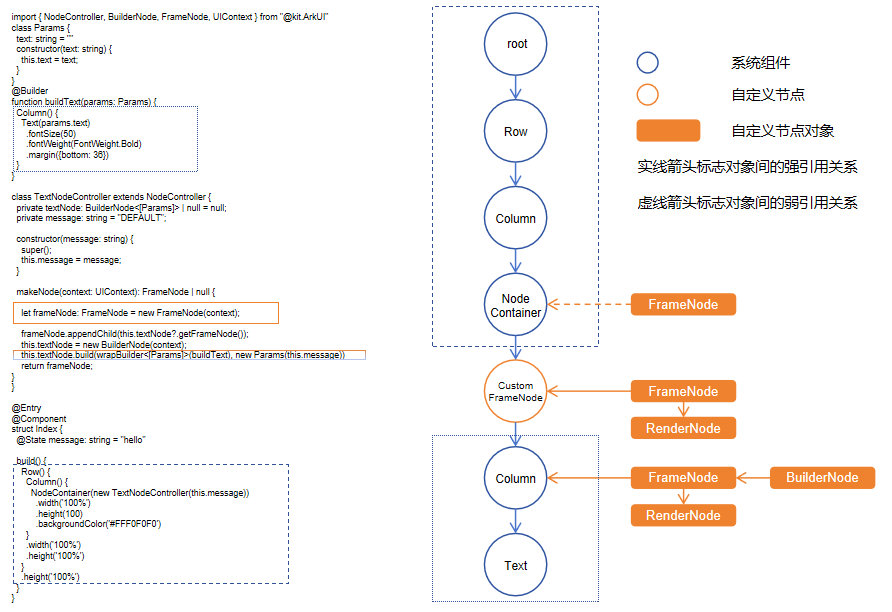

# 自定义节点概述

自定义节点是ArkUI通过接口提供的底层实体节点，具备部分基础能力，能够与系统组件混合显示。自定义节点的挂载与显示依赖于[自定义占位节点](./arkts-user-defined-place-hoder.md)。当前，自定义节点涵盖三类对象：[FrameNode](../reference/apis-arkui/js-apis-arkui-frameNode.md)、[RenderNode](../reference/apis-arkui/js-apis-arkui-renderNode.md)和[BuilderNode](../reference/apis-arkui/js-apis-arkui-builderNode.md)。FrameNode表示单个自定义组件节点，RenderNode表示为更轻量级的渲染节点，而BuilderNode对象赋予了创建、更新系统组件及其组件树的能力。

## 基本概念

- 系统组件：组件是UI的必要元素，形成了在界面中的样子，由ArkUI直接提供的称为[系统组件](arkts-ui-development-overview.md)。

- 实体节点：由后端创建的Native节点。

## 自定义占位节点
自定义占位节点作为系统组件可以在原生组件树上为自定义节点提供挂载的点。通过自定义占位节点，可以将自定义节点挂载在占位节点上，实现自定义节点与原生组件的混合显示。

## 自定义组件节点 (FrameNode)

FrameNode表示组件的实体节点，具体可以分为两大类能力：完全自定义节点的能力以及原生组件节点代理的能力。

- 完全自定义节点：提供完整的自定义能力，包括自定义测量、布局以及绘制，支持节点的动态增、删，设置通用属性，设置事件回调。适用于不自带渲染引擎，需要依赖系统的布局、事件、动画、渲染等能力的场景。

- 系统组件代理节点：提供系统组件的代理能力，提供遍历节点树的能力，通过组件树上的FrameNode可以遍历整个组件树，并通过节点访问组件的信息或者注册额外的事件监听回调。适用于结合无感监听的接口实现打点、广告SDK、中台DFX等业务。

## 自定义渲染节点 (RenderNode)
RenderNode作为轻量级的渲染节点，仅提供了设置渲染相关属性、自定义绘制内容以及节点操作的能力。适用于仅依赖系统渲染与动画能力的自定义场景。

## 自定义声明式节点 (BuilderNode)
BuilderNode通过无状态的UI方法[全局自定义构建函数](../quick-start/arkts-builder.md#全局自定义构建函数)@Builder生成组件树，组件树内的节点为系统组件。适用于需要基于系统能力创建特定原生组件树与其他自定义节点进行混合显示的场景。相比较系统组件，BuilderNode具备预创建的优势，可以控制开始创建的时间。由于持有实体节点对象，因此可以同步实现节点的复用，通过占位节点结合FrameNode、RenderNode的节点操作能力控制显示位置。
