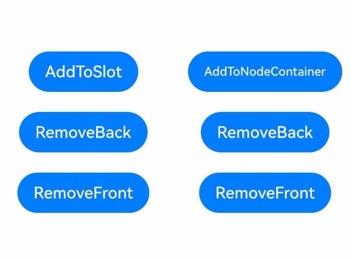

# 自定义占位节点

ArkUI提供了系统组件[NodeContainer](../../application-dev/reference/apis-arkui/arkui-ts/ts-basic-components-nodecontainer.md)和[ContentSlot](../../application-dev/reference/apis-arkui/arkui-ts/ts-components-contentSlot.md)作为自定义节点的占位节点。主要用于自定义节点以及自定义节点树的显示。

[NodeContainer](../../application-dev/reference/apis-arkui/arkui-ts/ts-basic-components-nodecontainer.md)作为容器节点存在，具备通用属性，是UI节点。[ContentSlot](../quick-start/arkts-rendering-control-contentslot.md)只是一个语法节点，无通用属性，不参与布局和渲染。支持混合模式开发，当容器是ArkTS组件，子组件在Native侧创建时，推荐使用ContentSlot占位组件。具体使用参考[ContentSlot](../../application-dev/reference/apis-arkui/arkui-ts/ts-components-contentSlot.md)的接口文档说明。

[NodeContainer](../reference/apis-arkui/arkui-ts/ts-basic-components-nodecontainer.md)是用来占位的系统组件，主要用于自定义节点以及自定义节点树的显示，支持组件的通用属性，对通用属性的处理请参考默认左上角对齐的[Stack](../reference/apis-arkui/arkui-ts/ts-container-stack.md)组件。

[NodeController](../reference/apis-arkui/js-apis-arkui-nodeController.md)提供了一系列生命周期回调，通过[makeNode](../reference/apis-arkui/js-apis-arkui-nodeController.md#makenode)回调返回一个 [FrameNode](../reference/apis-arkui/js-apis-arkui-frameNode.md#framenode) 节点树的根节点。将[FrameNode](../reference/apis-arkui/js-apis-arkui-frameNode.md)节点树挂载到对应的[NodeContainer](../reference/apis-arkui/arkui-ts/ts-basic-components-nodecontainer.md)下。同时提供了[aboutToAppear](../reference/apis-arkui/arkui-ts/ts-custom-component-lifecycle.md#abouttoappear)、[aboutToDisappear](../reference/apis-arkui/arkui-ts/ts-custom-component-lifecycle.md#abouttodisappear)、[aboutToResize](../reference/apis-arkui/js-apis-arkui-nodeController.md#abouttoresize)、[onTouchEvent](../reference/apis-arkui/js-apis-arkui-nodeController.md#ontouchevent)、[rebuild](../reference/apis-arkui/js-apis-arkui-nodeController.md#rebuild)五个回调方法用于监听对应的[NodeContainer](../reference/apis-arkui/arkui-ts/ts-basic-components-nodecontainer.md)的状态。

每个生命周期的回调的具体含义参考[NodeController](../reference/apis-arkui/js-apis-arkui-nodeController.md)的接口文档说明。

> **说明：**
> 
> - NodeContainer下仅支持挂载自定义的FrameNode节点以及BuilderNode创建的组件树的根节点。
> 
> - 从API Version 12开始支持的接口，可以通过FrameNode的查询接口返回原生组件的代理节点，代理节点可以作为makeNode的返回值进行返回，但代理节点无法成功挂载在组件树上，最终的显示结果为代理节点挂载失败。
> 
> - 需要保证一个节点只能作为一个父节点的子节点去使用，否则可能存在显示异常或者功能异常，尤其是页面路由场景或者动效场景。例如，如果通过NodeController将同一个节点挂载在多个NodeContainer上，仅一个占位容器下会显示节点，且多个NodeContainer的可见性、透明度等影响子组件状态的属性更新均会影响被挂载的子节点。

## 基本概念

- 自定义节点：使用ArkUI提供的接口，以命令式创建的节点。包括自定义组件节点（FrameNode）、自定义渲染节点（RenderNode）、自定义声明式节点（BuilderNode）、[ComponentContent](../reference/apis-arkui/js-apis-arkui-ComponentContent.md)等。

- 自定义节点树：根节点为自定义节点的节点树。

- 声明式节点树：根节点为声明式节点的节点树。

- 节点树：一种常见的数据结构，用于表示节点的层级关系。

- 占位节点：用于在声明式节点树上为自定义节点树预留位置的节点，主要包括NodeContainer和ContentSlot。鉴于页面的主树采用声明式节点树，因此，唯有借助占位节点，才能将命令式构建的自定义节点成功挂载至声明式节点树上。

## 使用NodeContainer挂载自定义节点

通过NodeController在NodeContainer下挂载自定义节点。

```ts
// common.ets
import { BuilderNode, UIContext } from '@kit.ArkUI'

class Params {
  text: string = "this is a text"
}

let buttonNode: BuilderNode<[Params]> | null = null;

@Builder
function buttonBuilder(params: Params) {
  Column() {
    Button(params.text)
      .fontSize(12)
      .borderRadius(8)
      .borderWidth(2)
      .backgroundColor(Color.Orange)
  }
}

export function createNode(uiContext: UIContext) {
  buttonNode = new BuilderNode<[Params]>(uiContext);
  buttonNode.build(wrapBuilder(buttonBuilder), { text: "This is a Button" });
  return buttonNode;
}

export function getOrCreateNode(uiContext: UIContext): BuilderNode<[Params]> | null {
  if (buttonNode?.getFrameNode() && buttonNode?.getFrameNode()?.getUniqueId() != -1) {
    return buttonNode;
  } else {
    return createNode(uiContext);
  }
}
```
```ts
// Index.ets
import { FrameNode, NodeController, Size, UIContext } from '@kit.ArkUI'
import { getOrCreateNode } from "./common"

const TEST_TAG: string = "NodeContainer";

class MyNodeController extends NodeController {
  private isShow: boolean = false;

  constructor(isShow: boolean) {
    super();
    this.isShow = isShow;
  }

  makeNode(uiContext: UIContext): FrameNode | null {
    if (!this.isShow) {
      return null;
    }
    let frameNode = getOrCreateNode(uiContext)?.getFrameNode();
    return frameNode ? frameNode : null;
  }

  aboutToResize(size: Size) {
    console.log(TEST_TAG + " aboutToResize width : " + size.width + " height : " + size.height)
  }

  aboutToAppear() {
    console.log(TEST_TAG + " aboutToAppear")
  }

  aboutToDisappear() {
    console.log(TEST_TAG + " aboutToDisappear");
  }

  onTouchEvent(event: TouchEvent) {
    console.log(TEST_TAG + " onTouchEvent");
  }

  toShow() {
    this.isShow = true;
    this.rebuild();
  }

  toHide() {
    this.isShow = false;
    this.rebuild();
  }
}

@Entry
@Component
struct Index {
  private myNodeController1: MyNodeController = new MyNodeController(true);
  private myNodeController2: MyNodeController = new MyNodeController(false);

  build() {
    Column() {
      NodeContainer(this.myNodeController1)
        .width("100%")
        .height("40%")
        .backgroundColor(Color.Brown)
      NodeContainer(this.myNodeController2)
        .width("100%")
        .height("40%")
        .backgroundColor(Color.Gray)
      Button("Change the place of button")
        .onClick(() => {
          // 先在原始占位节点中下树
          // 后在新的占位节点中上树
          // 保证自定义节点仅作为一个节点的子节点存在
          this.myNodeController1.toHide();
          this.myNodeController2.toShow();
        })
    }
    .padding({ left: 35, right: 35, top: 35 })
    .width("100%")
    .height("100%")
  }
}
```

## NodeContainer和ContentSlot添加子节点布局差异

[NodeContainer](../../application-dev/reference/apis-arkui/arkui-ts/ts-basic-components-nodecontainer.md)是一个容器节点，布局参考默认左上角对齐的[Stack](../reference/apis-arkui/arkui-ts/ts-container-stack.md)组件，不会按照父容器的布局规则进行布局。[ContentSlot](../../application-dev/reference/apis-arkui/arkui-ts/ts-components-contentSlot.md)只是一个语法节点，不参与布局，添加的子节点会按照父容器的布局规则进行布局。

```ts
import { FrameNode, NodeContent, NodeController, typeNode, UIContext } from '@kit.ArkUI';

class NodeContentCtrl {
  content: NodeContent
  textNode: Array<typeNode.Text> = new Array();
  uiContext: UIContext
  width: number

  constructor(uiContext: UIContext) {
    this.content = new NodeContent()
    this.uiContext = uiContext
    this.width = Infinity
  }

  AddNode() {
    let node = typeNode.createNode(this.uiContext, "Text")
    node.initialize("ContentText:" + this.textNode.length).fontSize(20)
    this.textNode.push(node)
    this.content.addFrameNode(node)
  }

  RemoveNode() {
    let node = this.textNode.pop()
    this.content.removeFrameNode(node)
  }

  RemoveFront() {
    let node = this.textNode.shift()
    this.content.removeFrameNode(node)
  }

  GetContent(): NodeContent {
    return this.content
  }
}

class MyNodeController extends NodeController {
  public rootNode: FrameNode | null = null;
  textNode: Array<typeNode.Text> = new Array();

  makeNode(uiContext: UIContext): FrameNode {
    this.rootNode = new FrameNode(uiContext);
    return this.rootNode;
  }

  AddNode(frameNode: FrameNode | null, uiContext: UIContext) {
    let node = typeNode.createNode(uiContext, "Text")
    node.initialize("ControllerText:" + this.textNode.length).fontSize(20)
    this.textNode.push(node)
    frameNode?.appendChild(node)
  }

  RemoveNode(frameNode: FrameNode | null) {
    let node = this.textNode.pop()
    frameNode?.removeChild(node)
  }

  RemoveFront(frameNode: FrameNode | null) {
    let node = this.textNode.shift()
    frameNode?.removeChild(node)
  }
}

@Entry
@Component
struct Index {
  @State message: string = 'Hello World';
  controller = new NodeContentCtrl(this.getUIContext());
  myNodeController = new MyNodeController();

  build() {
    Row() {
      Column() {
        ContentSlot(this.controller.GetContent())
        Button("AddToSlot")
          .onClick(() => {
            this.controller.AddNode()
          })
          .margin(10)
        Button("RemoveBack")
          .onClick(() => {
            this.controller.RemoveNode()
          })
          .margin(10)
        Button("RemoveFront")
          .onClick(() => {
            this.controller.RemoveFront()
          })
          .margin(10)
      }
      .width('50%')

      Column() {
        NodeContainer(this.myNodeController)
        Button("AddToNodeContainer")
          .onClick(() => {
            this.myNodeController.AddNode(this.myNodeController.rootNode, this.getUIContext())
          })
          .margin(10)
        Button("RemoveBack")
          .onClick(() => {
            this.myNodeController.RemoveNode(this.myNodeController.rootNode)
          })
          .margin(10)
        Button("RemoveFront")
          .onClick(() => {
            this.myNodeController.RemoveFront(this.myNodeController.rootNode)
          })
          .margin(10)
      }
      .width('50%')
    }
    .height('100%')
  }
}
```


