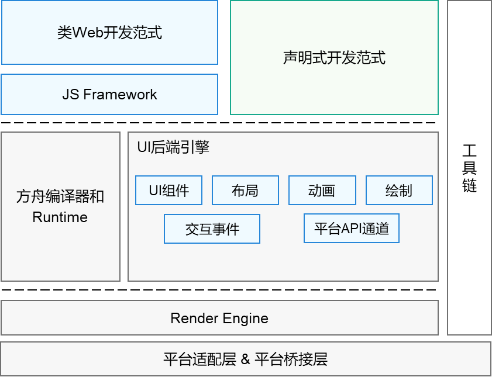

# 方舟开发框架概述

方舟开发框架（简称：ArkUI），是一套构建OpenHarmony应用界面的UI开发框架，它提供了极简的UI语法与包括UI组件、动画机制、事件交互等在内的UI开发基础设施，以满足应用开发者的可视化界面开发需求。

## 基本概念

- **组件：** 组件是界面搭建与显示的最小单位。开发者通过多种组件的组合，构建出满足自身应用诉求的完整界面。

- **页面：** page页面是方舟开发框架最小的调度分割单位。开发者可以将应用设计为多个功能页面，每个页面进行单独的文件管理，并通过[页面路由](../reference/apis/js-apis-router.md)API完成页面间的调度管理，以实现应用内功能的解耦。

## 主要特征

- **UI组件：** 方舟开发框架内置了丰富的多态组件，包括文本、图片、按钮等基础组件，可包含一个或多个子组件的容器组件，满足开发者自定义绘图需求的绘制组件，以及提供视频播放能力的媒体组件等。其中“多态”是指组件针对不同类型设备进行了设计，提供了在不同平台上的样式适配能力。

- **布局：** UI界面设计离不开布局的参与。方舟开发框架提供了多种布局方式，除了基础的线性布局、弹性布局外，也提供了相对复杂的列表、宫格、栅格布局，以及自适应多分辨率场景开发的原子布局能力。

- **动画：** 动画是UI界面的重要元素之一，优秀的动画设计能够极大地提升用户体验，方舟开发框架提供了丰富的动画能力，除了组件内置动画效果外，还包括属性动画、自定义转场动画以及动画API等。

- **绘制：** 方舟开发框架提供了多种绘制能力，以满足开发者的自定义绘图需求，支持绘制形状、颜色填充、绘制文本、变形与裁剪、嵌入图片等。

- **交互事件：** 方舟开发框架提供了多种交互能力，以满足应用在不同平台通过不同输入设备进行UI交互响应的需求，默认适配了触摸手势、遥控器按键输入、键鼠输入，同时提供了相应的事件回调以便开发者添加交互逻辑。

- **平台API通道：** 方舟开发框架提供了API扩展机制，可通过该机制对平台能力进行封装，提供风格统一的JS接口。

- **两种开发范式：** 方舟开发框架针对不同的应用场景以及不同技术背景的开发者提供了两种开发范式，分别是[基于ArkTS的声明式开发范式](./ui-ts-overview.md)（简称“声明式开发范式”）和[兼容JS的类Web开发范式](./ui-js-overview.md)（简称“类Web开发范式”）。

  | 开发范式名称   | 简介                                       | 适用场景             | 适用人群                |
  | -------- | ---------------------------------------- | ---------------- | ------------------- |
  | 声明式开发范式  | 采用基于TypeScript进行声明式UI语法扩展而来的[ArkTS语言](../quick-start/arkts-get-started.md)，从组件、动画和状态管理三个维度提供了UI绘制能力。声明式开发范式更接近自然语义的编程方式，让开发者直观地描述UI界面，不必关心框架如何实现UI绘制和渲染，实现极简高效开发。 | 复杂度较大、团队合作度较高的应用 | 移动系统应用开发人员、系统应用开发人员 |
  | 类Web开发范式 | 采用经典的HML、CSS、JavaScript三段式开发方式，使用HML标签文件进行布局搭建，使用CSS文件进行样式描述，使用JavaScript文件进行逻辑处理。UI组件与数据之间通过单向数据绑定的方式建立关联，当数据发生变化时，UI界面自动触发刷新。该开发方式更接近Web前端开发者的使用习惯，便于快速将已有的Web应用改造成方舟开发框架应用。 | 界面较简单的中小型应用和卡片  | Web前端开发人员    |

## 框架结构

从上图可以看出，类Web开发范式与声明式开发范式的UI后端引擎和语言运行时是共用的，其中，UI后端引擎实现了方舟开发框架的六种基本能力。声明式开发范式无需JS Framework进行页面DOM管理，渲染更新链路更为精简，占用内存更少，因此更推荐开发者选用声明式开发范式来搭建应用UI界面。

## UI与Ability框架的关系

Ability也是OpenHarmony应用的重要组成部分，[Ability框架](../ability/ability-brief.md)包括FA模型与Stage模型两种模型。下表给出了Ability框架的两种模型分别与方舟开发框架的两种开发范式的关系。

 **FA模型：**

 | 类型 |     UI开发范式         | 说明 |
 | -------- | --------------------------- | --------------------------- |
 | 应用 | 类web开发范式 | UI开发语言：使用hml/css/js  业务入口：使用固定文件名app.ets（Page类型Ability）/service.ts（Service类型Ability）/data.ts（Data类型Ability） 业务逻辑语言：js/ts |
 |     | 声明式开发范式 | UI开发语言：ArkTS  业务入口：使用固定文件名app.ets（Page类型Ability）/service.ts（Service类型Ability）/data.ts（Data类型Ability）  业务逻辑语言：js/ts |
 | 服务卡片 | 类web开发范式 | UI开发语言：卡片显示使用hml+css+json(action)  业务入口：form.ts  卡片业务逻辑语言：js/ts |
 |      | 声明式开发范式 | 当前不支持 |

 **Stage模型：**

 | 类型 |     UI开发范式         | 说明 |
 | -------- | --------------------------- | --------------------------- |
 | 应用 | 类web开发范式 | 当前不支持 |
 |     | 声明式开发范式 | UI开发语言：ArkTS  业务入口：应用模型基于ohos.application.Ability/ExtensionAbility等派生  业务逻辑语言：ts |
 | 服务卡片 | 类web开发范式 | UI开发语言：卡片显示使用hml+css+json(action)  业务入口：从FormExtensionAbility派生  业务逻辑语言：ts |
 |      | 声明式开发范式 | 当前不支持 |

