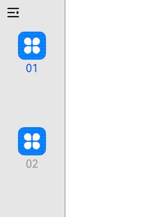
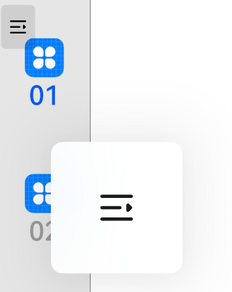
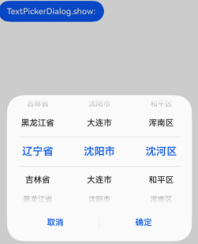
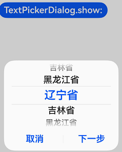

# 支持适老化
<!--Kit: ArkUI-->
<!--Subsystem: ArkUI-->
<!--Owner: @liyi0309-->
<!--Designer: @liyi0309-->
<!--Tester: @fredyuan912-->
<!--Adviser: @Brilliantry_Rui-->

<!--RP1-->

## 基本概念

适老化提供了一种通过鼠标或手指长按的方法来放大所选区域或组件，即如果系统字体大小大于1倍，当用户使用鼠标或手指长按装配了适老化方法的组件，需要从所选区域的组件中提取数据，并放入另一个弹窗组件中展示。该方法的目的在于使组件和组件内部数据（子组件）放大，同时将整体组件在屏幕中央显示，让用户能够更好地观察该组件。

## 使用约束

* 适老化规则

  由于在系统字体大于1倍时，组件并没有默认放大，需要通过配置[configuration标签](../quick-start/app-configuration-file.md#configuration标签)，实现组件放大的适老化功能。

* 适老化操作

  在已经支持适老化能力的组件上长按组件，能够触发弹窗，当用户释放时，适老化操作结束。当设置系统字体大于1倍时，组件自动放大，当系统字体恢复至1倍时组件恢复正常状态。

* 适老化对象

  触发适老化操作并提供数据的组件。

* 适老化弹窗目标

  可接收并处理适老化数据的组件。

* 弹窗限制

  当用户将系统字体设置为2倍以上时，弹窗内容包括icon和文字的放大倍数固定为2倍。

* 联合其他能力

  适老化能力可以适配其他能力（如：滑动拖拽）。底部页签（tabBar）组件在触发适老化时，如果用户滑动手指或鼠标可以触发底部页签其他子组件的适老化功能。

## 适配适老化的组件及触发方式

| 触发方式             | 组件名称                                                     |
| -------------------- | ------------------------------------------------------------ |
| 长按组件触发         | [SideBarContainer](../reference/apis-arkui/arkui-ts/ts-container-sidebarcontainer.md)， 底部页签（[tabBar](../reference/apis-arkui/arkui-ts/ts-container-tabcontent.md#tabbar9)），[Navigation](../reference/apis-arkui/arkui-ts/ts-basic-components-navigation.md)，[NavDestination](../reference/apis-arkui/arkui-ts/ts-basic-components-navdestination.md)， [Tabs](../reference/apis-arkui/arkui-ts/ts-container-tabs.md) |
| 设置系统字体默认放大 | [PickerDialog](arkts-fixes-style-dialog.md#选择器弹窗-pickerdialog)， [Button](../reference/apis-arkui/arkui-ts/ts-basic-components-button.md)， [Menu](../reference/apis-arkui/arkui-ts/ts-basic-components-menu.md)， [Stepper](../reference/apis-arkui/arkui-ts/ts-basic-components-stepper.md)， [bindSheet](../reference/apis-arkui/arkui-ts/ts-universal-attributes-sheet-transition.md#bindsheet)，[TextInput](../reference/apis-arkui/arkui-ts/ts-basic-components-textinput.md)，[TextArea](../reference/apis-arkui/arkui-ts/ts-basic-components-textarea.md)，[Search](../reference/apis-arkui/arkui-ts/ts-basic-components-search.md)，[SelectionMenu](../reference/apis-arkui/arkui-ts/ohos-arkui-advanced-SelectionMenu.md)，[Chip](../reference/apis-arkui/arkui-ts/ohos-arkui-advanced-Chip.md)，[Dialog](../reference/apis-arkui/arkui-ts/ohos-arkui-advanced-Dialog.md)，[Slider](../reference/apis-arkui/arkui-ts/ts-basic-components-slider.md)， [Progress](../reference/apis-arkui/arkui-ts/ts-basic-components-progress.md)， [Badge](../reference/apis-arkui/arkui-ts/ts-container-badge.md) |

## 示例

SideBarContainer组件通过长按控制按钮触发适老化弹窗。在系统字体为1倍的情况下，长按控制按钮不能弹窗。在系统字体大于1倍的情况下，长按控制按钮可以弹窗。

<!-- @[trigger_aging_friendly_by_long_press](https://gitcode.com/openharmony/applications_app_samples/blob/master/code/DocsSample/ArkUISample/SupportingAgingFriendly/entry/src/main/ets/pages/SideBarContainer.ets) --> 

``` TypeScript
import { hilog } from '@kit.PerformanceAnalysisKit';

const TAG = '[Sample_SupportingAgingFriendly]';
const DOMAIN = 0xF811;
const BUNDLE = 'SupportingAgingFriendly_';
const NUMBER1 = 1;
const NUMBER2 = 2;
const NUMBER3 = 3;

@Entry
@Component
struct SideBarContainerExample {
  normalIcon: Resource = $r('app.media.icon'); // $r('app.media.icon')需要替换为开发者所需的资源文件
  selectedIcon: Resource = $r('app.media.icon'); // $r('app.media.icon')需要替换为开发者所需的资源文件
  @State arr: number[] = [NUMBER1, NUMBER2, NUMBER3];
  @State current: number = NUMBER1;

  build() {
    SideBarContainer(SideBarContainerType.Embed) {
      Column() {
        ForEach(this.arr, (item: number) => {
          Column({ space: 5 }) {
            Image(this.current === item ? this.selectedIcon : this.normalIcon).width(64).height(64);
            Text('0' + item)
              .fontSize(25)
              .fontColor(this.current === item ? '#0A59F7' : '#999')
              .fontFamily('source-sans-pro,cursive,sans-serif')
          }
          .onClick(() => {
            this.current = item;
          })
        }, (item: number) => item.toString())
      }.width('100%')
      .justifyContent(FlexAlign.SpaceEvenly)
      // $r('sys.color.mask_fifth')需要替换为开发者所需的资源文件
      .backgroundColor($r('sys.color.mask_fifth'))
    }
    .controlButton({
      icons: {
        // $r('sys.media.ohos_ic_public_drawer_open_filled') 需要替换为开发者所需的资源文件
        hidden: $r('sys.media.ohos_ic_public_drawer_open_filled'),
        // $r('sys.media.ohos_ic_public_drawer_close')需要替换为开发者所需的资源文件
        shown: $r('sys.media.ohos_ic_public_drawer_close')
      }
    })
    .sideBarWidth(150)
    .minSideBarWidth(50)
    .maxSideBarWidth(300)
    .minContentWidth(0)
    .onChange((value: boolean) => {
      hilog.info(DOMAIN, TAG, BUNDLE + 'status:' + value);
    })
    .divider({ strokeWidth: '1vp', color: Color.Gray, startMargin: '4vp', endMargin: '4vp' });
  }
}
```

切换系统字体前后长按已经支持适老化能力的组件，有如下效果：

| 系统字体为一倍（适老化能力开启前） | 系统字体为1.75倍（适老化能力开启后） |
| ---------------------------------- | ------------------------------------ |
|           |             |

[TextPickerDialog](../reference/apis-arkui/arkui-ts/ts-methods-textpicker-dialog.md)组件通过设置系统字体大小触发适老化弹窗。在系统字体为1倍的情况下，适老化不触发；在系统字体大于1倍的情况下，适老化触发。

<!-- @[trigger_aging_friendly_by_set_font_size](https://gitcode.com/openharmony/applications_app_samples/blob/master/code/DocsSample/ArkUISample/SupportingAgingFriendly/entry/src/main/ets/pages/TextPickerDialog.ets) --> 

``` TypeScript
import { hilog } from '@kit.PerformanceAnalysisKit';

const TAG = '[Sample_SupportingAgingFriendly]';
const DOMAIN = 0xF811;
const BUNDLE = 'SupportingAgingFriendly_';

@Entry
@Component
struct TextPickerExample {
  private select: number | number[] = 0;
  private cascade: TextCascadePickerRangeContent[] = [
    {
      // $r('app.string.xxx')需要替换为开发者所需的资源文件
      text: $r('app.string.liaoning'),
      children: [{ text: $r('app.string.shenyang'), children: [{ text: $r('app.string.shenhe') },
        { text: $r('app.string.heping') }, { text: $r('app.string.hunnan') }] },
        { text: $r('app.string.dalian'), children: [{ text: $r('app.string.zhongshan') },
        { text: $r('app.string.jinzhou') }, { text: $r('app.string.changhai') }] }]
    },
    {
      // $r('app.string.xxx')需要替换为开发者所需的资源文件
      text: $r('app.string.jilin'),
      children: [{ text: $r('app.string.changchun'), children: [{ text: $r('app.string.nangang') },
        { text: $r('app.string.kuanchen') }, { text: $r('app.string.chaoyang') }] },
        { text: $r('app.string.sipin'), children: [{ text: $r('app.string.tiexi') },
        { text: $r('app.string.tiedong') }, { text: $r('app.string.lishu') }] }]
    },
    {
      // $r('app.string.xxx')需要替换为开发者所需的资源文件
      text: $r('app.string.heilingjiang'),
      children: [{ text: $r('app.string.haerbin'), children: [{ text: $r('app.string.daoli') },
        { text: $r('app.string.daowai') }, { text: $r('app.string.nangang') }] },
        { text: $r('app.string.mudanjiang'), children: [{ text: $r('app.string.dongan') },
        { text: $r('app.string.xian')}, { text: $r('app.string.aimin') }] }]
    }
  ]
  @State value: string = '';
  @State showTriggered: string = '';
  private triggered: string = '';
  private maxLines: number = 3; // 最大的行数为3

  linesNum(max: number): void {
    let items: string[] = this.triggered.split('\n').filter(item => item != '');
    if (items.length > max) {
      this.showTriggered = items.slice(-max).join('\n');
    } else {
      this.showTriggered = this.triggered;
    }
  }

  build() {
    Column() {
      Button('TextPickerDialog.show:' + this.value)
        .onClick(() => {
          this.getUIContext().showTextPickerDialog({
            range: this.cascade,
            selected: this.select,
            onAccept: (value: TextPickerResult) => {
              this.select = value.index;
              hilog.info(DOMAIN, TAG, BUNDLE + this.select + '');
              this.value = value.value as string;
              hilog.info(DOMAIN, TAG, BUNDLE + 'TextPickerDialog:onAccept()' + JSON.stringify(value));
              if (this.triggered != '') {
                this.triggered += `\nonAccept(${JSON.stringify(value)})`;
              } else {
                this.triggered = `onAccept(${JSON.stringify(value)})`;
              }
              this.linesNum(this.maxLines);
            },
            onCancel: () => {
              hilog.info(DOMAIN, TAG, BUNDLE + 'TextPickerDialog:onCancel()');
              if (this.triggered != '') {
                this.triggered += `\nonCancel()`;
              } else {
                this.triggered = `onCancel()`;
              }
              this.linesNum(this.maxLines);
            },
            onChange: (value: TextPickerResult) => {
              hilog.info(DOMAIN, TAG, BUNDLE + 'TextPickerDialog:onChange()' + JSON.stringify(value));
              if (this.triggered != '') {
                this.triggered += `\nonChange(${JSON.stringify(value)})`;
              } else {
                this.triggered = `onChange(${JSON.stringify(value)})`;
              }
              this.linesNum(this.maxLines);
            },
          })
        })
        .margin({ top: 60 });
    }
  }
}
```

| 系统字体为一倍（适老化能力开启前） | 系统字体为1.75倍（适老化能力开启后） |
| ---------------------------------- | ------------------------------------ |
|           |             |
<!--RP1End-->