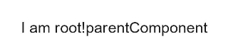
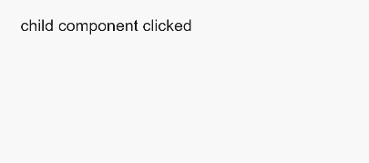

# JS语法参考

JS文件用来定义HML页面的业务逻辑，支持ECMA规范的JavaScript语言。基于JavaScript语言的动态化能力，可以使应用更加富有表现力，具备更加灵活的设计能力。下面讲述JS文件的编译和运行的支持情况。


## 语法

支持ES6语法。

- 模块声明
  使用import方法引入功能模块：

  ```js
  import router from '@ohos.router';
  ```

- 代码引用
  使用import方法导入js代码：

  ```js
  import utils from '../../common/utils.js';
  ```


## 对象

- 应用对象
  | 属性 | 类型   | 描述                                                         |
  | ---- | ------ | ------------------------------------------------------------ |
  | $def | Object | 使用`this.$app.$def`获取在app.js中暴露的对象。<br/>> **说明：**<br/>>&nbsp;应用对象不支持数据绑定，需主动触发UI更新。 |

  示例代码

  ```js
  // app.js
  export default {
    onCreate() {
      console.info('Application onCreate');
    },
    onDestroy() {
      console.info('Application onDestroy');
    },
    globalData: {
      appData: 'appData',
      appVersion: '2.0',
    },
    globalMethod() {
      console.info('This is a global method!');
      this.globalData.appVersion = '3.0';
    }
  };
  ```

  ```js
  // index.js页面逻辑代码
  export default {
    data: {
      appData: 'localData',
      appVersion:'1.0',
    },
    onInit() {
      this.appData = this.$app.$def.globalData.appData;
      this.appVersion = this.$app.$def.globalData.appVersion;
    },
    invokeGlobalMethod() {
      this.$app.$def.globalMethod();
    },
    getAppVersion() {
      this.appVersion = this.$app.$def.globalData.appVersion;
    }
  }
  ```

- 页面对象
  | 属性     | 类型            | 描述                                                         |
  | -------- | --------------- | ------------------------------------------------------------ |
  | data     | Object/Function | 页面的数据模型，类型是对象或者函数，如果类型是函数，返回值必须是对象。属性名不能以\$或_开头，不要使用保留字for,&nbsp;if,&nbsp;show,&nbsp;tid。<br/>data与private和public不能重合使用。 |
  | $refs    | Object          | 持有注册过ref&nbsp;属性的DOM元素或子组件实例的对象。示例见[获取DOM元素](#获取dom元素)。 |
  | private  | Object          | 页面的数据模型，private下的数据属性只能由当前页面修改。      |
  | public   | Object          | 页面的数据模型，public下的数据属性的行为与data保持一致。     |
  | props    | Array/Object    | props用于组件之间的通信，可以通过&lt;tag&nbsp;xxxx='value'&gt;方式传递给组件；props名称必须用小写，不能以$或_开头，不要使用保留字for,&nbsp;if,&nbsp;show,&nbsp;tid。目前props的数据类型不支持Function。示例见[Props](../reference/apis-arkui/arkui-js/js-components-custom-props.md#props)。 |
  | computed | Object          | 用于在读取或设置进行预先处理，计算属性的结果会被缓存。计算属性名不能以$或_开头，不要使用保留字。示例见[computed](../reference/apis-arkui/arkui-js/js-components-custom-props.md#computed)。 |

## 方法

- 数据方法
  | 方法      | 参数                                     | 描述                                       |
  | ------- | -------------------------------------- | ---------------------------------------- |
  | $set    | key:&nbsp;string,&nbsp;value:&nbsp;any | 添加新的数据属性或者修改已有数据属性。<br/>用法：<br/>this.$set('key',value)：添加数据属性。 |
  | $delete | key:&nbsp;string                       | 删除数据属性。<br/>用法：<br/>this.$delete('key')：删除数据属性。 |

  示例代码

  ```js
  // index.js
  export default {
    data: {
      keyMap: {
        OS: 'OS',
        Version: '2.0',
      },
    },
    getAppVersion() {
      this.$set('keyMap.Version', '3.0');
      console.info("keyMap.Version = " + this.keyMap.Version); // keyMap.Version = 3.0
  
      this.$delete('keyMap');
      console.info("keyMap.Version = " + this.keyMap); // log print: keyMap.Version = undefined
    }
  }
  ```

- 公共方法
  | 方法         | 参数            | 描述                                                         |
  | ------------ | --------------- | ------------------------------------------------------------ |
  | $element     | id:&nbsp;string | 获得指定id的组件对象，如果无指定id，则返回根组件对象。示例见[获取DOM元素](#获取dom元素)。<br/>用法：<br/>&lt;div&nbsp;id='xxx'&gt;&lt;/div&gt;<br/>-&nbsp;`this.$element('xxx')`：获得id为xxx的组件对象。<br/>-&nbsp;`this.$element()`：获得根组件对象。 |
  | $rootElement | 无              | 获取根组件对象。<br/>用法：this.\$rootElement().scrollTo({&nbsp;duration:&nbsp;500,&nbsp;position:&nbsp;300&nbsp;}),&nbsp;页面在500ms内滚动300px。 |
  | $root        | 无              | 获得顶级ViewModel实例。[获取ViewModel](#获取viewmodel)示例。 |
  | $parent      | 无              | 获得父级ViewModel实例。[获取ViewModel](#获取viewmodel)示例。 |
  | $child       | id:&nbsp;string | 获得指定id的子级自定义组件的ViewModel实例。[获取ViewModel](#获取viewmodel)示例。<br/>用法：<br/>this.\$child('xxx')&nbsp;：获取id为xxx的子级自定义组件的ViewModel实例。 |

- 事件方法
  | 方法   | 参数                                                         | 描述                                                         |
  | ------ | ------------------------------------------------------------ | ------------------------------------------------------------ |
  | $watch | data:&nbsp;string,&nbsp;callback:&nbsp;string&nbsp;\|&nbsp;Function | 观察data中的属性变化，如果属性值改变，触发绑定的事件。示例见[\$watch感知数据改变](../reference/apis-arkui/arkui-js/js-components-custom-props.md#watch感知数据改变)。<br/>用法：<br/>this.$watch('key',&nbsp;callback) |

- 页面方法
  | 方法                    | 参数                               | 描述                              |
  | --------------------- | -------------------------------- | ------------------------------- |
  | scrollTo<sup>6+</sup> | scrollPageParam: ScrollPageParam | 将页面滚动到目标位置，可以通过ID选择器指定或者滚动距离指定。 |

  **表1** ScrollPageParam<sup>6+</sup>

  | 名称           | 类型                    | 默认值 | 描述                                                         |
  | -------------- | ----------------------- | ------ | ------------------------------------------------------------ |
  | position       | number                  | -      | 指定滚动位置。                                               |
  | id             | string                  | -      | 指定需要滚动到的元素id。                                     |
  | duration       | number                  | 300    | 指定滚动时长，单位为毫秒。                                   |
  | timingFunction | string                  | ease   | 指定滚动动画曲线，可选值参考<br/>[动画样式animation-timing-function](../reference/apis-arkui/arkui-js/js-components-common-animation.md)。 |
  | complete       | ()&nbsp;=&gt;&nbsp;void | -      | 指定滚动完成后需要执行的回调函数。                           |

  示例：

  ```js
  this.$rootElement().scrollTo({position: 0})
  this.$rootElement().scrollTo({id: 'id', duration: 200, timingFunction: 'ease-in', complete: ()=>void})
  ```


## 获取DOM元素

1. 通过$refs获取DOM元素
   ```html
   <!-- index.hml -->
   <div class="container">
     <image-animator class="image-player" ref="animator" images="{{images}}" duration="1s" onclick="handleClick"></image-animator>
   </div>
   ```

   ```js
   // index.js
   export default {
     data: {
       images: [
         { src: '/common/frame1.png' },
         { src: '/common/frame2.png' },
         { src: '/common/frame3.png' }
       ]
     },
     handleClick() {
       const animator = this.$refs.animator; // 获取ref属性为animator的DOM元素
       const state = animator.getState();
       if (state === 'paused') {
         animator.resume();
       } else if (state === 'stopped') {
         animator.start();
       } else {
         animator.pause();
       }
     },
   };
   ```

2. 通过$element获取DOM元素
   ```html
   <!-- index.hml -->
   <div class="container" style="width:500px;height: 700px; margin: 100px;">
     <image-animator class="image-player" id="animator" images="{{images}}" duration="1s" onclick="handleClick"></image-animator>
   </div>
   ```

   ```js
   // index.js
   export default {
     data: {
       images: [
         { src: '/common/frame1.png' },
         { src: '/common/frame2.png' },
         { src: '/common/frame3.png' }
       ]
     },
     handleClick() {
       const animator = this.$element('animator'); // 获取id属性为animator的DOM元素
       const state = animator.getState();
       if (state === 'paused') {
         animator.resume();
       } else if (state === 'stopped') {
         animator.start();
       } else {
         animator.pause();
       }
     },
   };
   ```


## 获取ViewModel

根节点所在页面：

```html
<!-- root.hml -->
<element name='parentComp' src='../../common/component/parent/parent.hml'></element>
<div class="container">
  <div class="container">
    <text>{{text}}</text>
    <parentComp></parentComp>
  </div>
</div>
```

```js
// root.js
export default {
  data: {
    text: 'I am root!',
  },
}
```



自定义parent组件：

```html
<!-- parent.hml -->
<element name='childComp' src='../child/child.hml'></element>
<div class="item" onclick="textClicked">
  <text class="text-style" onclick="parentClicked">parent component click</text>
  <text class="text-style" if="{{showValue}}">hello parent component!</text>
  <childComp id = "selfDefineChild"></childComp>
</div>
```

```js
// parent.js
export default {
  data: {
    showValue: false,
    text: 'I am parent component!',
  },
  parentClicked () {
    this.showValue = !this.showValue;
    console.info('parent component get parent text');
    console.info(`${this.$parent().text}`);
    console.info("parent component get child function");
    console.info(`${this.$child('selfDefineChild').childClicked()}`);
  },
}
```

自定义child组件：

```html
<!-- child.hml -->
<div class="item" onclick="textClicked">
  <text class="text-style" onclick="childClicked">child component clicked</text>
  <text class="text-style" if="{{isShow}}">hello child component</text>
</div>
```

```js
// child.js
export default {
  data: {
    isShow: false,
    text: 'I am child component!',
  },
  childClicked () {
    this.isShow = !this.isShow;
    console.info('child component get parent text');
    console.info('${this.$parent().text}');
    console.info('child component get root text');
    console.info('${this.$root().text}');
  },
}
```

