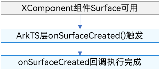
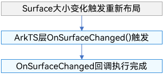
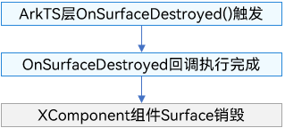
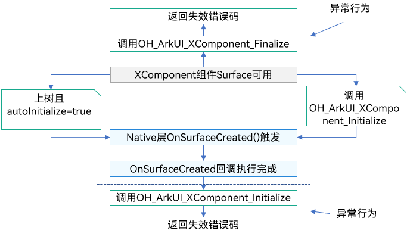
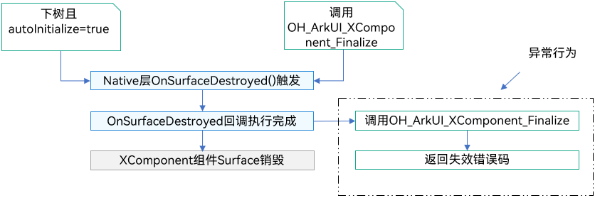
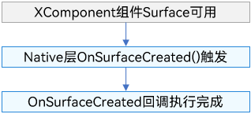
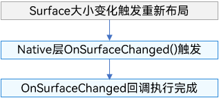
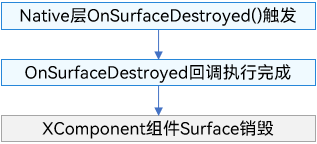

# 自定义渲染 (XComponent)

## 概述

XComponent组件作为一种渲染组件，可用于EGL/OpenGLES和媒体数据写入，通过使用XComponent持有的“[NativeWindow](../graphics/native-window-guidelines.md)”来渲染画面，通常用于满足开发者较为复杂的自定义渲染需求，例如相机预览流的显示和游戏画面的渲染。其可通过指定type字段来实现不同的渲染方式，分别为[XComponentType](../reference/apis-arkui/arkui-ts/ts-appendix-enums.md#xcomponenttype10).SURFACE和XComponentType.TEXTURE。对于SURFACE类型，开发者将定制的绘制内容单独展示到屏幕上。对于TEXTURE类型，开发者将定制的绘制内容和XComponent组件的内容合成后展示到屏幕上。

目前XComponent组件主要有三个应用场景：
1. 使用XComponentController管理Surface生命周期场景，该场景在ArkTS侧获取SurfaceId，生命周期回调、触摸、鼠标、按键等事件回调等均在ArkTS侧触发；
2. 使用OH_ArkUI_SurfaceHolder管理Surface生命周期场景，该场景根据XComponent组件对应的ArkUI_NodeHandle中创建OH_ArkUI_SurfaceHolder，生命周期回调、触摸等事件回调、无障碍和可变帧率回调等均在Native侧触发。
3. 使用NativeXComponent管理Surface生命周期场景，该场景在native层获取Native XComponent实例，在native侧注册XComponent的生命周期回调，以及触摸、鼠标、按键等事件回调。

## 自绘制原理说明

XComponent持有一个Surface，开发者能通过调用[NativeWindow](../graphics/native-window-guidelines.md)等接口，申请并提交Buffer至图形队列，以此方式将自绘制内容传送至该Surface。XComponent负责将此Surface整合进UI界面，其中展示的内容正是开发者传送的自绘制内容。Surface的默认位置与大小与XComponent组件一致，开发者可利用[setXComponentSurfaceRect](../reference/apis-arkui/arkui-ts/ts-basic-components-xcomponent.md#setxcomponentsurfacerect12)接口自定义调整Surface的位置和大小。

> **说明：** 
>
> 当开发者传输的绘制内容包含透明元素时，Surface区域的显示效果会与下方内容进行合成展示。例如，若传输的内容完全透明，且XComponent的背景色被设置为黑色，同时Surface保持默认的大小与位置，则最终显示的将是一片黑色区域。

## 使用XComponentController管理Surface生命周期场景

本场景通过在ArkTS侧获取SurfaceId，布局信息、生命周期回调、触摸、鼠标、按键等事件回调等均在ArkTS侧触发，按需传递到Native侧进行处理。主要开发场景如下：
- 基于ArkTS侧获取的SurfaceId，在Native侧调用OH_NativeWindow_CreateNativeWindowFromSurfaceId接口创建出NativeWindow实例。
- 利用NativeWindow和EGL接口开发自定义绘制内容以及申请和提交Buffer到图形队列。
- ArkTS侧获取生命周期、事件等信息传递到Native侧处理。

> **说明**：
>
> 1. Native侧的NativeWindow缓存在字典中，其key需要保证其唯一性，当对应的XComponent销毁后，需要及时从字典里将其删除。
>
> 2. 对于使用[typeNode](../reference/apis-arkui/js-apis-arkui-frameNode.md#typenode12)创建的SURFACE或TEXTURE类型的XComponent组件，由于typeNode组件的生命周期与声明式组件存在差异，组件在创建后的缓冲区尺寸为未设置状态，因此在开始绘制内容之前，应调用[OH_NativeWindow_NativeWindowHandleOpt](../reference/apis-arkgraphics2d/capi-external-window-h.md#oh_nativewindow_nativewindowhandleopt
)接口进行缓冲区尺寸设置。
> 
> 3. 多个XComponent开发时，缓存Native侧资源需要保证key是唯一的，key推荐使用id+随机数或者surfaceId。

**接口说明**

ArkTS侧的XComponentController

| 接口名                                                       | 描述                                                         |
| ------------------------------------------------------------ | ------------------------------------------------------------ |
| getXComponentSurfaceId(): string                             | 获取XComponent对应Surface的ID。                                |
| onSurfaceCreated(surfaceId: string): void                    | 当XComponent持有的Surface创建后进行该回调。                    |
| onSurfaceChanged(surfaceId: string, rect: SurfaceRect): void | 当XComponent持有的Surface大小改变后（包括首次创建时的大小改变）进行该回调。 |
| onSurfaceDestroyed(surfaceId: string): void                  | 当XComponent持有的Surface销毁后进行该回调。                    |

Native侧

| 接口名                                                       | 描述                                                         |
| ------------------------------------------------------------ | ------------------------------------------------------------ |
| int32_t OH_NativeWindow_CreateNativeWindowFromSurfaceId (uint64_t surfaceId, OHNativeWindow **window ) | 通过surfaceId创建对应的OHNativeWindow。                        |
| void OH_NativeWindow_DestroyNativeWindow (OHNativeWindow* window) | 将OHNativeWindow对象的引用计数减1，当引用计数为0的时候，该OHNativeWindow对象会被析构掉。 |

**开发步骤**

以下步骤以SURFACE类型为例，描述了如何使用`XComponent组件`在ArkTS侧传入SurfaceId，在native侧创建NativeWindow实例，然后创建`EGL/GLES`环境，实现在主页面绘制图形，并可以改变图形的颜色。

1. 在界面中定义XComponent。
   
    ```javascript
    // 函数声明，在cpp/types/libnativerender/Index.d.ts中定义
    type XComponentContextStatus = {
        hasDraw: boolean,
        hasChangeColor: boolean,
    };
    export const SetSurfaceId: (id: BigInt) => any;
    export const ChangeSurface: (id: BigInt, w: number, h: number) =>any;
    export const DrawPattern: (id: BigInt) => any;
    export const GetXComponentStatus: (id: BigInt) => XComponentContextStatus
    export const ChangeColor: (id: BigInt) => any;
    export const DestroySurface: (id: BigInt) => any;
    ```
    
    ```typescript
    import nativeRender from 'libnativerender.so';
    
    // 重写XComponentController，设置生命周期回调
    class MyXComponentController extends XComponentController {
        onSurfaceCreated(surfaceId: string): void {
            console.log(`onSurfaceCreated surfaceId: ${surfaceId}`)
            nativeRender.SetSurfaceId(BigInt(surfaceId));
        }
    
        onSurfaceChanged(surfaceId: string, rect: SurfaceRect): void {
            console.log(`onSurfaceChanged surfaceId: ${surfaceId}, rect: ${JSON.stringify(rect)}}`)
            // 在onSurfaceChanged中调用ChangeSurface绘制内容
            nativeRender.ChangeSurface(BigInt(surfaceId), rect.surfaceWidth, rect.surfaceHeight)
        }
    
        onSurfaceDestroyed(surfaceId: string): void {
            console.log(`onSurfaceDestroyed surfaceId: ${surfaceId}`)
            nativeRender.DestroySurface(BigInt(surfaceId))
        }
    }
    
    @Entry
    @Component
    struct Index {
        @State currentStatus: string = "index";
        xComponentController: XComponentController = new MyXComponentController();
    
        build() {
            Column() {
                //...
                //在xxx.ets 中定义 XComponent
                Column({ space: 10 }) {
                    XComponent({
                        type: XComponentType.SURFACE,
                        controller: this.xComponentController
                    })
                Text(this.currentStatus)
                    .fontSize('24fp')
                    .fontWeight(500)
                }
                .onClick(() => {
                    let surfaceId = this.xComponentController.getXComponentSurfaceId()
                    nativeRender.ChangeColor(BigInt(surfaceId))
                    let hasChangeColor: boolean = false;
                    if (nativeRender.GetXComponentStatus(BigInt(surfaceId))) {
                        hasChangeColor = nativeRender.GetXComponentStatus(BigInt(surfaceId)).hasChangeColor;
                    }
                    if (hasChangeColor) {
                        this.currentStatus = "change color";
                    }
                })
    
                //...
                Row() {
                    Button('Draw Star')
                        .fontSize('16fp')
                        .fontWeight(500)
                        .margin({ bottom: 24 })
                        .onClick(() => {
                            let surfaceId = this.xComponentController.getXComponentSurfaceId()
                            nativeRender.DrawPattern(BigInt(surfaceId))
                            let hasDraw: boolean = false;
                            if (nativeRender.GetXComponentStatus(BigInt(surfaceId))) {
                                hasDraw = nativeRender.GetXComponentStatus(BigInt(surfaceId)).hasDraw;
                            }
                            if (hasDraw) {
                                this.currentStatus = "draw star"
                            }
                        })
                        .width('53.6%')
                        .height(40)
                }
                .width('100%')
                .justifyContent(FlexAlign.Center)
                .alignItems(VerticalAlign.Bottom)
                .layoutWeight(1)
            }
            .width('100%')
            .height('100%')
        }
    }
    ```
    
2. Node-API模块注册，具体使用请参考[Node-API开发规范](../napi/napi-guidelines.md)。

    ```typescript
    #include <hilog/log.h>
    #include "common/common.h"
    #include "manager/plugin_manager.h"
    namespace NativeXComponentSample {
    // 在napi_init.cpp文件中，Init方法注册接口函数，从而将封装的C++方法传递出来，供ArkTS侧调用
    EXTERN_C_START
    static napi_value Init(napi_env env, napi_value exports) {
        // ...
        // 向ArkTS侧暴露接口SetSurfaceId(),ChangeSurface(),DestroySurface(),
        // DrawPattern(),ChangeColor(),GetXComponentStatus()
        napi_property_descriptor desc[] = {
            {"SetSurfaceId", nullptr, PluginManager::SetSurfaceId, nullptr, nullptr, nullptr, napi_default, nullptr},
            {"ChangeSurface", nullptr, PluginManager::ChangeSurface, nullptr, nullptr, nullptr, napi_default, nullptr},
            {"DestroySurface", nullptr, PluginManager::DestroySurface, nullptr, nullptr, nullptr, napi_default, nullptr},
            {"DrawPattern", nullptr, PluginManager::DrawPattern, nullptr, nullptr, nullptr, napi_default, nullptr},
            {"ChangeColor", nullptr, PluginManager::ChangeColor, nullptr, nullptr, nullptr, napi_default, nullptr},
            {"GetXComponentStatus", nullptr, PluginManager::GetXComponentStatus, nullptr, nullptr, nullptr, napi_default,
             nullptr}};
        if (napi_define_properties(env, exports, sizeof(desc) / sizeof(desc[0]), desc) != napi_ok) {
            OH_LOG_Print(LOG_APP, LOG_ERROR, LOG_PRINT_DOMAIN, "Init", "napi_define_properties failed");
            return nullptr;
        }
        return exports;
    }
    EXTERN_C_END
    // 编写接口的描述信息，根据实际需要可以修改对应参数
    static napi_module nativerenderModule = {.nm_version = 1,
                                             .nm_flags = 0,
                                             .nm_filename = nullptr,
                                             // 入口函数
                                             .nm_register_func = Init,
                                             // 模块名称
                                             .nm_modname = "nativerender",
                                             .nm_priv = ((void *)0),
                                             .reserved = {0}};
    } // namespace NativeXComponentSample
    // __attribute__((constructor))修饰的方法由系统自动调用，使用Node-API接口napi_module_register()传入模块描述信息进行模块注册
    extern "C" __attribute__((constructor)) void RegisterModule(void) {
        napi_module_register(&NativeXComponentSample::nativerenderModule);
    }
    ```
    
3. 上述注册的六个函数在native侧具体实现。

    ```cpp
    // PluginManager类定义
    class PluginManager {
    public:
        ~PluginManager();
        static PluginRender *GetPluginRender(int64_t &id);
        static napi_value ChangeColor(napi_env env, napi_callback_info info);
        static napi_value DrawPattern(napi_env env, napi_callback_info info);
        static napi_value SetSurfaceId(napi_env env, napi_callback_info info);
        static napi_value ChangeSurface(napi_env env, napi_callback_info info);
        static napi_value DestroySurface(napi_env env, napi_callback_info info);
        static napi_value GetXComponentStatus(napi_env env, napi_callback_info info);
    
    public:
        static std::unordered_map<int64_t, PluginRender *> pluginRenderMap_;
        static std::unordered_map<int64_t, OHNativeWindow *> windowMap_;
    };
    
    // 解析从ArkTS侧传入的surfaceId，此处surfaceId是一个64位int值
    int64_t ParseId(napi_env env, napi_callback_info info) {
        if ((env == nullptr) || (info == nullptr)) {
            OH_LOG_Print(LOG_APP, LOG_ERROR, LOG_PRINT_DOMAIN, "ParseId", "env or info is null");
            return -1;
        }
        size_t argc = 1;
        napi_value args[1] = {nullptr};
        if (napi_ok != napi_get_cb_info(env, info, &argc, args, nullptr, nullptr)) {
            OH_LOG_Print(LOG_APP, LOG_ERROR, LOG_PRINT_DOMAIN, "ParseId", "GetContext napi_get_cb_info failed");
            return -1;
        }
        int64_t value = 0;
        bool lossless = true;
        if (napi_ok != napi_get_value_bigint_int64(env, args[0], &value, &lossless)) {
            OH_LOG_Print(LOG_APP, LOG_ERROR, LOG_PRINT_DOMAIN, "ParseId", "Get value failed");
            return -1;
        }
        return value;
    }
    
    // 设置SurfaceId，基于SurfaceId完成对NativeWindow的初始化
    napi_value PluginManager::SetSurfaceId(napi_env env, napi_callback_info info) {
        int64_t surfaceId = ParseId(env, info);
        OHNativeWindow *nativeWindow;
        PluginRender *pluginRender;
        if (windowMap_.find(surfaceId) == windowMap_.end()) {
            OH_NativeWindow_CreateNativeWindowFromSurfaceId(surfaceId, &nativeWindow);
            windowMap_[surfaceId] = nativeWindow;
        }
        if (pluginRenderMap_.find(surfaceId) == pluginRenderMap_.end()) {
            pluginRender = new PluginRender(surfaceId);
            pluginRenderMap_[surfaceId] = pluginRender;
        }
        pluginRender->InitNativeWindow(nativeWindow);
        return nullptr;
    }

    void PluginRender::InitNativeWindow(OHNativeWindow *window) {
        eglCore_->EglContextInit(window); // 参考Native XComponent场景EglContextInit的实现
    }
    
    // 根据传入的surfaceId、width、height实现Surface大小的变动
    napi_value PluginManager::ChangeSurface(napi_env env, napi_callback_info info) {
        if ((env == nullptr) || (info == nullptr)) {
            OH_LOG_Print(LOG_APP, LOG_ERROR, LOG_PRINT_DOMAIN, "PluginManager",
                         "ChangeSurface: OnLoad env or info is null");
            return nullptr;
        }
        int64_t surfaceId = 0;
        size_t argc = 3;
        napi_value args[3] = {nullptr};

        if (napi_ok != napi_get_cb_info(env, info, &argc, args, nullptr, nullptr)) {
            OH_LOG_Print(LOG_APP, LOG_ERROR, LOG_PRINT_DOMAIN, "PluginManager",
                         "ChangeSurface: GetContext napi_get_cb_info failed");
            return nullptr;
        }
        bool lossless = true;
        int index = 0;
        if (napi_ok != napi_get_value_bigint_int64(env, args[index++], &surfaceId, &lossless)) {
            OH_LOG_Print(LOG_APP, LOG_ERROR, LOG_PRINT_DOMAIN, "PluginManager", "ChangeSurface: Get value failed");
            return nullptr;
        }
        double width;
        if (napi_ok != napi_get_value_double(env, args[index++], &width)) {
            OH_LOG_Print(LOG_APP, LOG_ERROR, LOG_PRINT_DOMAIN, "PluginManager", "ChangeSurface: Get width failed");
            return nullptr;
        }
        double height;
        if (napi_ok != napi_get_value_double(env, args[index++], &height)) {
            OH_LOG_Print(LOG_APP, LOG_ERROR, LOG_PRINT_DOMAIN, "PluginManager", "ChangeSurface: Get height failed");
            return nullptr;
        }
        auto pluginRender = GetPluginRender(surfaceId);
        if (pluginRender == nullptr) {
            OH_LOG_Print(LOG_APP, LOG_ERROR, LOG_PRINT_DOMAIN, "PluginManager", "ChangeSurface: Get pluginRender failed");
            return nullptr;
        }
        pluginRender->UpdateNativeWindowSize(width, height);
        return nullptr;
    }
    
    void PluginRender::UpdateNativeWindowSize(int width, int height) {
        eglCore_->UpdateSize(width, height); // 参考Native XComponent场景UpdateSize的实现
        if (!hasChangeColor_ && !hasDraw_) {
            eglCore_->Background(); // 参考Native XComponent场景Background的实现
        }
    }
    
    // 销毁Surface
    napi_value PluginManager::DestroySurface(napi_env env, napi_callback_info info) {
        int64_t surfaceId = ParseId(env, info);
        auto pluginRenderMapIter = pluginRenderMap_.find(surfaceId);
        if (pluginRenderMapIter != pluginRenderMap_.end()) {
            delete pluginRenderMapIter->second;
            pluginRenderMap_.erase(pluginRenderMapIter);
        }
        auto windowMapIter = windowMap_.find(surfaceId);
        if (windowMapIter != windowMap_.end()) {
            OH_NativeWindow_DestroyNativeWindow(windowMapIter->second);
            windowMap_.erase(windowMapIter);
        }
        return nullptr;
    }
    
    // 实现EGL绘画逻辑
    napi_value PluginManager::DrawPattern(napi_env env, napi_callback_info info) {
        int64_t surfaceId = ParseId(env, info);
        auto pluginRender = GetPluginRender(surfaceId);
        if (pluginRender == nullptr) {
            OH_LOG_Print(LOG_APP, LOG_ERROR, LOG_PRINT_DOMAIN, "PluginManager", "DrawPattern: Get pluginRender failed");
            return nullptr;
        }
        pluginRender->DrawPattern();
        return nullptr;
    }

    PluginRender *PluginManager::GetPluginRender(int64_t &id) {
        if (pluginRenderMap_.find(id) != pluginRenderMap_.end()) {
            return pluginRenderMap_[id];
        }
        return nullptr;
    }

    void PluginRender::DrawPattern() {
        eglCore_->Draw(hasDraw_); // 参考Native XComponent场景Draw实现
    }
    
    // 实现改变绘制图形颜色的功能
    napi_value PluginManager::ChangeColor(napi_env env, napi_callback_info info) {
        int64_t surfaceId = ParseId(env, info);
        auto pluginRender = GetPluginRender(surfaceId);
        if (pluginRender == nullptr) {
            OH_LOG_Print(LOG_APP, LOG_ERROR, LOG_PRINT_DOMAIN, "PluginManager", "ChangeColor: Get pluginRender failed");
            return nullptr;
        }
        pluginRender->ChangeColor(); // 参考Native XComponent场景ChangeColor实现
        return nullptr;
    }

    void PluginRender::ChangeColor() { eglCore_->ChangeColor(hasChangeColor_); }
    
    // 获得xcomponent状态，并返回至ArkTS侧
    napi_value PluginManager::GetXComponentStatus(napi_env env, napi_callback_info info) {
        int64_t surfaceId = ParseId(env, info);
        auto pluginRender = GetPluginRender(surfaceId);
        if (pluginRender == nullptr) {
            OH_LOG_Print(LOG_APP, LOG_ERROR, LOG_PRINT_DOMAIN, "PluginManager",
                         "GetXComponentStatus: Get pluginRender failed");
            return nullptr;
        }
        napi_value hasDraw;
        napi_value hasChangeColor;
        napi_status ret = napi_create_int32(env, pluginRender->HasDraw(), &(hasDraw));
        if (ret != napi_ok) {
            OH_LOG_Print(LOG_APP, LOG_ERROR, LOG_PRINT_DOMAIN, "PluginManager",
                         "GetXComponentStatus: napi_create_int32 hasDraw_ error");
            return nullptr;
        }
        ret = napi_create_int32(env, pluginRender->HasChangedColor(), &(hasChangeColor));
        if (ret != napi_ok) {
            OH_LOG_Print(LOG_APP, LOG_ERROR, LOG_PRINT_DOMAIN, "PluginManager",
                         "GetXComponentStatus: napi_create_int32 hasChangeColor_ error");
            return nullptr;
        }
        napi_value obj;
        ret = napi_create_object(env, &obj);
        if (ret != napi_ok) {
            OH_LOG_Print(LOG_APP, LOG_ERROR, LOG_PRINT_DOMAIN, "PluginManager",
                         "GetXComponentStatus: napi_create_object error");
            return nullptr;
        }
        ret = napi_set_named_property(env, obj, "hasDraw", hasDraw);
        if (ret != napi_ok) {
            OH_LOG_Print(LOG_APP, LOG_ERROR, LOG_PRINT_DOMAIN, "PluginManager",
                         "GetXComponentStatus: napi_set_named_property hasDraw error");
            return nullptr;
        }
        ret = napi_set_named_property(env, obj, "hasChangeColor", hasChangeColor);
        if (ret != napi_ok) {
            OH_LOG_Print(LOG_APP, LOG_ERROR, LOG_PRINT_DOMAIN, "PluginManager",
                         "GetXComponentStatus: napi_set_named_property hasChangeColor error");
            return nullptr;
        }
        return obj;
    }

    int32_t PluginRender::HasDraw() { return hasDraw_; }

    int32_t PluginRender::HasChangedColor() { return hasChangeColor_; }
    ```
    
4. 配置具体的CMakeLists，使用CMake工具链将C++源代码编译成动态链接库文件。

    ```cmake
    # 设置CMake最小版本
    cmake_minimum_required(VERSION 3.4.1)
    # 项目名称
    project(XComponent)
    
    set(NATIVERENDER_ROOT_PATH ${CMAKE_CURRENT_SOURCE_DIR})
    add_definitions(-DOHOS_PLATFORM)
    # 设置头文件搜索目录
    include_directories(
        ${NATIVERENDER_ROOT_PATH}
        ${NATIVERENDER_ROOT_PATH}/include
    )
    # 添加名为nativerender的动态库，库文件名为libnativerender.so，添加cpp文件
    add_library(nativerender SHARED
        render/egl_core.cpp
        render/plugin_render.cpp
        manager/plugin_manager.cpp
        napi_init.cpp
    )
    
    find_library(
        # 设置路径变量的名称。
        EGL-lib
        # 指定要让CMake查找的NDK库的名称。
        EGL
    )
    
    find_library(
        # 设置路径变量的名称。
        GLES-lib
        # 指定要让CMake查找的NDK库的名称。
        GLESv3
    )
    
    find_library(
        # 设置路径变量的名称。
        hilog-lib
        # 指定要让CMake查找的NDK库的名称。
        hilog_ndk.z
    )
    
    find_library(
        # 设置路径变量的名称。
        libace-lib
        # 指定要让CMake查找的NDK库的名称。
        ace_ndk.z
    )
    
    find_library(
        # 设置路径变量的名称。
        libnapi-lib
        # 指定要让CMake查找的NDK库的名称。
        ace_napi.z
    )
    
    find_library(
        # 设置路径变量的名称。
        libuv-lib
        # 指定要让CMake查找的NDK库的名称。
        uv
    )
    # 添加构建需要链接的库
    target_link_libraries(nativerender PUBLIC
        ${EGL-lib} ${GLES-lib} ${hilog-lib} ${libace-lib} ${libnapi-lib} ${libuv-lib} libnative_window.so)
    ```

### 生命周期说明

**OnSurfaceCreated回调**    	

触发时刻：XComponent准备好Surface后触发。

ArkTS侧OnSurfaceCreated的时序如下图：



**OnSurfaceChanged回调**

触发时刻：Surface大小变化触发重新布局之后触发。

ArkTS侧OnSurfaceChanged的时序如下图：



**OnSurfaceDestroyed回调**

触发时刻：XComponent组件被销毁时触发，与一般ArkUI的组件销毁时机一致。

ArkTS侧OnSurfaceDestroyed的时序图：



## 使用OH_ArkUI_SurfaceHolder管理Surface生命周期场景

与使用XComponentController管理Surface生命周期场景不同，本场景允许应用根据XComponent组件对应的ArkUI_NodeHandle中创建OH_ArkUI_SurfaceHolder，并通过OH_ArkUI_SurfaceHolder上的相关接口注册Surface生命周期，XComponent组件相关的无障碍、可变帧率等能力也可根据ArkUI_NodeHandle通过相关接口来实现。同时，XCompoennt组件上的基础/手势事件也可通过ArkUI_NodeHandle对象使用ArkUI NDK接口来监听（具体可参考：[监听组件事件](./ndk-listen-to-component-events.md)）。主要开发场景如下：
- 在ArkTS侧创建的XComponent组件可将其对应的FrameNode节点传递至Native侧获取ArkUI_NodeHandle/在Native侧直接创建XComponent组件对应的ArkUI_NodeHandle，然后调用OH_ArkUI_SurfaceHolder_Create接口创建OH_ArkUI_SurfaceHolder实例。
- 基于OH_ArkUI_SurfaceHolder实例注册相应的生命周期回调、事件回调，获取NativeWindow实例。
- 利用NativeWindow和EGL接口开发自定义绘制内容以及申请和提交Buffer到图形队列。

**接口说明**

| 接口名                                                       | 描述                                                         |
| ------------------------------------------------------------ | ------------------------------------------------------------ |
| OH_ArkUI_QueryModuleInterfaceByName(ArkUI_NativeAPIVariantKind type, const char* structName) | 获取指定类型的Native模块接口集合。                                         |
| OH_ArkUI_XComponent_GetNativeWindow(OH_ArkUI_SurfaceHolder* surfaceHolder) | 获取与OH_ArkUI_SurfaceHolder实例关联的nativeWindow。                                         |
| OH_ArkUI_SurfaceHolder_RemoveSurfaceCallback(OH_ArkUI_SurfaceHolder* surfaceHolder, OH_ArkUI_SurfaceCallback* callback) | 从OH_ArkUI_SurfaceHolder实例中移除先前添加的Surface生命周期回调。                                         |
| OH_ArkUI_SurfaceCallback_Dispose(OH_ArkUI_SurfaceCallback* callback) | 释放OH_ArkUI_SurfaceCallback对象。                                         |
| OH_ArkUI_SurfaceHolder_Dispose(OH_ArkUI_SurfaceHolder* surfaceHolder) | 释放OH_ArkUI_SurfaceHolder对象。                                         |
| OH_ArkUI_NodeEvent_GetEventType(ArkUI_NodeEvent* event) | 从组件事件获取事件类型。                                         |
| OH_ArkUI_NodeEvent_GetNodeHandle(ArkUI_NodeEvent* event) | 获取触发组件事件的组件对象。                                         |
| OH_ArkUI_GetNodeHandleFromNapiValue(napi_env env, napi_value frameNode, ArkUI_NodeHandle* handle) | 获取ArkTS侧创建的FrameNode节点对象映射到native侧的ArkUI_NodeHandle。                                         |
| OH_ArkUI_SurfaceHolder_Create(ArkUI_NodeHandle node) | 从XComponent节点创建一个OH_ArkUI_SurfaceHolder对象。                                       |
| OH_ArkUI_SurfaceCallback_Create() | 创建一个OH_ArkUI_SurfaceCallback对象。                                         |
| OH_ArkUI_SurfaceCallback_SetSurfaceCreatedEvent(OH_ArkUI_SurfaceCallback* callback, void (\*onSurfaceCreated)(OH_ArkUI_SurfaceHolder* surfaceHolder)) | 往OH_ArkUI_SurfaceCallback对象中注册onSurfaceCreated回调。                                         |
| OH_ArkUI_SurfaceCallback_SetSurfaceChangedEvent(OH_ArkUI_SurfaceCallback* callback, void (\*onSurfaceChanged)(OH_ArkUI_SurfaceHolder* surfaceHolder, uint64_t width, uint64_t height)) | 往OH_ArkUI_SurfaceCallback对象中注册onSurfaceChanged回调。                                         |
| OH_ArkUI_SurfaceCallback_SetSurfaceDestroyedEvent(OH_ArkUI_SurfaceCallback* callback, void (\*onSurfaceDestroyed)(OH_ArkUI_SurfaceHolder* surfaceHolder)) | 往OH_ArkUI_SurfaceCallback对象中注册onSurfaceDestroyed回调。                                         |
| OH_ArkUI_SurfaceCallback_SetSurfaceShowEvent(OH_ArkUI_SurfaceCallback* callback, void (\*onSurfaceShow)(OH_ArkUI_SurfaceHolder* surfaceHolder)) | 往OH_ArkUI_SurfaceCallback对象中注册onSurfaceShow回调。                                         |
| OH_ArkUI_SurfaceCallback_SetSurfaceHideEvent(OH_ArkUI_SurfaceCallback* callback, void (\*onSurfaceHide)(OH_ArkUI_SurfaceHolder* surfaceHolder)) | 往OH_ArkUI_SurfaceCallback对象中注册onSurfaceHide回调。                                         |
| OH_ArkUI_XComponent_RegisterOnFrameCallback(ArkUI_NodeHandle node, void (*callback)(ArkUI_NodeHandle node, uint64_t timestamp, uint64_t targetTimestamp)) | 为XComponent节点注册onFrame回调。                                         |
| OH_ArkUI_SurfaceHolder_AddSurfaceCallback(OH_ArkUI_SurfaceHolder* surfaceHolder, OH_ArkUI_SurfaceCallback* callback) | 往OH_ArkUI_SurfaceHolder实例注册OH_ArkUI_SurfaceCallback对象。                                         |
| OH_ArkUI_AccessibilityProvider_Create(ArkUI_NodeHandle node) | 从XComponent节点创建一个ArkUI_AccessibilityProvider对象。                                         |
| OH_ArkUI_XComponent_UnregisterOnFrameCallback(ArkUI_NodeHandle node) | 取消注册XComponent节点的onFrame回调。                                         |
| OH_ArkUI_AccessibilityProvider_Dispose(ArkUI_AccessibilityProvider* provider) | 释放ArkUI_AccessibilityProvider对象。                                        |
| OH_ArkUI_XComponent_SetExpectedFrameRateRange(ArkUI_NodeHandle node, OH_NativeXComponent_ExpectedRateRange range) | 为XComponent节点设置预期的帧率范围。                                         |
| OH_ArkUI_XComponent_SetNeedSoftKeyboard(ArkUI_NodeHandle node, bool needSoftKeyboard) | 设置XComponent节点在获得焦点时是否需要显示软键盘。                                         |

**开发步骤**

以下步骤通过在ArkTS侧创建SURFACE类型的XComponent为例（Native侧如何创建XComponent组件对应的ArkUI_NodeHandle可参考[ArkUI_NativeNodeAPI_1](../reference/apis-arkui/_ark_u_i___native_node_a_p_i__1.md)），描述了如何使用`XComponent组件`调用OH_ArkUI_SurfaceHolder相关接口管理Surface生命周期，并在Native侧创建`EGL/GLES`环境，实现在主页面绘制图形，以及可以改变图形的颜色。

1. 在界面中定义XComponent。

    ```typescript
    import native from 'libnativerender.so';

    @Entry
    @Component
    struct Index {
        xcomponentId: string = 'xcp' + (new Date().getTime());
        @State isShow: boolean = true;
        @State minRate: number = 0;
        @State maxRate: number = 120;
        @State expected: number = 60;
        needSoftKeyboard: boolean = false;
        @State needSoftKeyboardState: string = 'needSoftKeyboard=' + this.needSoftKeyboard;
        @State text: string = '单指点击XComponent软件盘消失'
        controller: TextInputController = new TextInputController()

        build() {
            Column() {
                TextInput({ text: this.text, placeholder: 'please input ...', controller: this.controller })
                    .placeholderColor(Color.Grey)
                    .placeholderFont({ size: 14, weight: 400 })
                    .caretColor(Color.Blue)
                    .width(400)
                    .height(40)
                    .margin(20)
                    .fontSize(14)
                    .fontColor(Color.Black)
                    .onChange((value: string) => {
                        this.text = value
                    })
                Column() {
                    if (this.isShow) {
                        XComponent({
                            type: XComponentType.SURFACE
                        })
                            .id(this.xcomponentId)
                            .onAttach(() => {
                                let node = this.getUIContext().getFrameNodeById(this.xcomponentId)
                                native.bindNode(this.xcomponentId, node)
                            })
                            .onDetach(() => {
                                native.unbindNode(this.xcomponentId)
                            })
                            .width(200)
                            .height(200)
                            .focusable(true)
                            .focusOnTouch(true)
                            .defaultFocus(true)
                    }
                }.height(200)

                Button('创建/销毁').onClick(() => {
                    this.isShow = !this.isShow;
                })

                Column() {
                    Text('期望帧率设置：')
                        .textAlign(TextAlign.Start)
                        .fontSize(15)
                        .border({ width: 1 })
                        .padding(10)
                        .width('100%')
                        .margin(5)
                    Text('min: ' + this.minRate)
                    Slider({
                        value: this.minRate,
                        min: 0,
                        max: 240,
                        step: 1
                    }).onChange((value: number, mode: SliderChangeMode) => {
                        this.minRate = value;
                        native.setFrameRate(this.xcomponentId, this.minRate, this.maxRate, this.expected)
                    }).width('100%')
                    Text('max: ' + this.maxRate)
                    Slider({
                        value: this.maxRate,
                        min: 0,
                        max: 240,
                        step: 1
                    }).onChange((value: number, mode: SliderChangeMode) => {
                        this.maxRate = value;
                        native.setFrameRate(this.xcomponentId, this.minRate, this.maxRate, this.expected)
                    }).width('100%')
                    Text('expected: ' + this.expected)
                    Slider({
                        value: this.expected,
                        min: 0,
                        max: 240,
                        step: 1
                    }).onChange((value: number, mode: SliderChangeMode) => {
                        this.expected = value;
                        native.setFrameRate(this.xcomponentId, this.minRate, this.maxRate, this.expected)
                    }).width('100%')
                }.backgroundColor("#F0FAFF")

                Button(this.needSoftKeyboardState)
                    .onClick(() => {
                        this.needSoftKeyboard = !this.needSoftKeyboard;
                        this.needSoftKeyboardState = 'needSoftKeyboard=' + this.needSoftKeyboard;
                        native.setNeedSoftKeyboard(this.xcomponentId, this.needSoftKeyboard);
                        this.text = this.needSoftKeyboard ? '单指点击XComponent软键盘不消失' : '单指点击XComponent软件盘消失'
                    })
            }
            .width('100%')
        }
    }
    ```

2. Node-API模块注册，具体使用请参考[Node-API开发规范](../napi/napi-guidelines.md)。

    ```c++
    #include "manager/plugin_manager.h"

    namespace NativeXComponentSample {

    // 在napi_init.cpp文件中，Init方法注册接口函数，从而将封装的C++方法传递出来，供ArkTS侧调用
    EXTERN_C_START
    static napi_value Init(napi_env env, napi_value exports)
    {
        // 向ArkTS侧暴露接口
        napi_property_descriptor desc[] = {
            {"bindNode", nullptr, PluginManager::BindNode,
                nullptr, nullptr, nullptr, napi_default, nullptr},
            {"unbindNode", nullptr, PluginManager::UnbindNode,
                nullptr, nullptr, nullptr, napi_default, nullptr},
            {"setFrameRate", nullptr, PluginManager::SetFrameRate,
                nullptr, nullptr, nullptr, napi_default, nullptr},
            {"setNeedSoftKeyboard", nullptr, PluginManager::SetNeedSoftKeyboard,
                nullptr, nullptr, nullptr, napi_default, nullptr},
        };
        napi_define_properties(env, exports, sizeof(desc) / sizeof(desc[0]), desc);
        return exports;
    }
    EXTERN_C_END

    // 编写接口的描述信息，根据实际需要可以修改对应参数
    static napi_module demoModule = {
        .nm_version = 1,
        .nm_flags = 0,
        .nm_filename = nullptr,
        // 入口函数
        .nm_register_func = Init, // 指定加载对应模块时的回调函数
        // 模块名称
        .nm_modname = "nativerender", // 指定模块名称，对于XComponent相关开发，这个名称必须和ArkTS侧XComponent中libraryname的值保持一致
        .nm_priv = ((void*)0),
        .reserved = { 0 },
    };
    }

    // __attribute__((constructor))修饰的方法由系统自动调用，使用Node-API接口napi_module_register()传入模块描述信息进行模块注册
    extern "C" __attribute__((constructor)) void RegisterEntryModule(void)
    {
        napi_module_register(&NativeXComponentSample::demoModule);
    }
    ```

3. 注册XComponent生命周期、事件、无障碍和可变帧率回调，使用CAPI实现往XComponent注册回调函数。

    (1) 定义BindNode、UnbindNode、SetFrameRate、SetNeedSoftKeyboard方法，暴露到ArkTS侧的bindNode、unbindNode、setFrameRate、setNeedSoftKeyboard方法会执行该方法。

    ```c++
    // plugin_manager.h
    namespace NativeXComponentSample {
    class PluginManager {
    public:
        ~PluginManager();
        static napi_value BindNode(napi_env env, napi_callback_info info);
        static napi_value UnbindNode(napi_env env, napi_callback_info info);
        static napi_value SetFrameRate(napi_env env, napi_callback_info info);
        static napi_value SetNeedSoftKeyboard(napi_env env, napi_callback_info info);

    public:
        static std::unordered_map<std::string, ArkUI_NodeHandle> nodeHandleMap_;
        static std::unordered_map<void *, EGLRender *> renderMap_;
        static std::unordered_map<void *, OH_ArkUI_SurfaceCallback *> callbackMap_;
        static std::unordered_map<void *, OH_ArkUI_SurfaceHolder *> surfaceHolderMap_;
        static ArkUI_AccessibilityProvider* provider_;
    };
    }
    ```

    ```c++
    // plugin_manager.cpp
    std::string value2String(napi_env env, napi_value value) { // 将napi_value转化为string类型的变量
        size_t stringSize = 0;
        napi_get_value_string_utf8(env, value, nullptr, 0, &stringSize);
        std::string valueString;
        valueString.resize(stringSize);
        napi_get_value_string_utf8(env, value, &valueString[0], stringSize + 1, &stringSize);
        return valueString;
    }

    napi_value PluginManager::BindNode(napi_env env, napi_callback_info info) {
        size_t argc = 2;
        napi_value args[2] = {nullptr};
        napi_get_cb_info(env, info, &argc, args, nullptr, nullptr);
        std::string nodeId = value2String(env, args[0]);
        ArkUI_NodeHandle handle;
        OH_ArkUI_GetNodeHandleFromNapiValue(env, args[1], &handle); // 获取nodeHandle
        OH_ArkUI_SurfaceHolder *holder = OH_ArkUI_SurfaceHolder_Create(handle); // 获取SurfaceHolder
        nodeHandleMap_[nodeId] = handle;
        surfaceHolderMap_[handle] = holder;
        auto callback = OH_ArkUI_SurfaceCallback_Create(); // 创建SurfaceCallback
        callbackMap_[holder] = callback;
        OH_ArkUI_SurfaceCallback_SetSurfaceCreatedEvent(callback, OnSurfaceCreated); // 注册OnSurfaceCreated回调
        OH_ArkUI_SurfaceCallback_SetSurfaceChangedEvent(callback, OnSurfaceChanged); // 注册OnSurfaceChanged回调
        OH_ArkUI_SurfaceCallback_SetSurfaceDestroyedEvent(callback, OnSurfaceDestroyed); // 注册OnSurfaceDestroyed回调
        OH_ArkUI_SurfaceCallback_SetSurfaceShowEvent(callback, OnSurfaceShow); // 注册OnSurfaceShow回调
        OH_ArkUI_SurfaceCallback_SetSurfaceHideEvent(callback, OnSurfaceHide); // 注册OnSurfaceHide回调
        OH_ArkUI_XComponent_RegisterOnFrameCallback(handle, OnFrameCallback); // 注册OnFrameCallback回调
        OH_ArkUI_SurfaceHolder_AddSurfaceCallback(holder, callback); // 注册SurfaceCallback回调
        if (!nodeAPI->addNodeEventReceiver(handle, onEvent)) { // 添加事件监听，返回成功码 0 
            OH_LOG_Print(LOG_APP, LOG_ERROR, LOG_PRINT_DOMAIN, "onBind", "addNodeEventReceiver error");
        }
        if (!nodeAPI->registerNodeEvent(handle, NODE_TOUCH_EVENT, 0, nullptr)) { // 用C接口注册touch事件，返回成功码 0 
            OH_LOG_Print(LOG_APP, LOG_ERROR, LOG_PRINT_DOMAIN, "onBind", "registerTouchEvent error");
        }
        provider_ = OH_ArkUI_AccessibilityProvider_Create(handle); // 创建一个ArkUI_AccessibilityProvider类型的对象
        /**
        * 获取ArkUI_AccessibilityProvider后，如果注册无障碍回调函数请参考：
        * https://gitee.com/openharmony/docs/blob/OpenHarmony-5.1.0-Release/zh-cn/application-dev/ui/ndk-accessibility-xcomponent.md
        * **/
        return nullptr;
    }

    napi_value PluginManager::UnbindNode(napi_env env, napi_callback_info info)
    {
        size_t argc = 1;
        napi_value args[1] = {nullptr};
        napi_get_cb_info(env, info, &argc, args, nullptr, nullptr);
        std::string nodeId = value2String(env, args[0]);
        auto node = nodeHandleMap_[nodeId];
        OH_ArkUI_XComponent_UnregisterOnFrameCallback(node); // 解注册帧回调
        OH_ArkUI_AccessibilityProvider_Dispose(provider_); // 销毁ArkUI_AccessibilityProvider
        nodeAPI->disposeNode(node); // 销毁nodeHandle
        nodeHandleMap_.erase(nodeId);
        return nullptr;
    }

    napi_value PluginManager::SetFrameRate(napi_env env, napi_callback_info info)
    {
        size_t argc = 4;
        napi_value args[4] = {nullptr};
        napi_get_cb_info(env, info, &argc, args, nullptr, nullptr);
        std::string nodeId = value2String(env, args[0]);
        auto node = nodeHandleMap_[nodeId];
        
        int32_t min = 0;
        napi_get_value_int32( env, args[1], &min);

        int32_t max = 0;
        napi_get_value_int32(env, args[2], &max);

        int32_t expected = 0;
        napi_get_value_int32(env, args[2], &expected);
        OH_NativeXComponent_ExpectedRateRange range = {
            .min = min,
            .max = max,
            .expected = expected
        };
        OH_ArkUI_XComponent_SetExpectedFrameRateRange(node, range); // 设置期望帧率
        return nullptr;
    }

    napi_value PluginManager::SetNeedSoftKeyboard(napi_env env, napi_callback_info info)
    {
        size_t argc = 2;
        napi_value args[2] = {nullptr};
        napi_get_cb_info(env, info, &argc, args, nullptr, nullptr);
        std::string nodeId = value2String(env, args[0]);
        auto node = nodeHandleMap_[nodeId];
        
        bool needSoftKeyboard = false;
        napi_get_value_bool( env, args[1], &needSoftKeyboard);
        OH_ArkUI_XComponent_SetNeedSoftKeyboard(node, needSoftKeyboard); // 设置是否需要软键盘
        return nullptr;
    }
    ```

    (2) 定义Surface创建成功，发生改变，销毁和事件，可变帧率回调接口。

    ```c++
    void OnSurfaceCreated(OH_ArkUI_SurfaceHolder *holder) {
        auto window = OH_ArkUI_XComponent_GetNativeWindow(holder); // 获取native window
        auto render = new EGLRender();
        PluginManager::renderMap_[holder] = render;
        render->SetUpEGLContext(window);
    }

    void OnSurfaceChanged(OH_ArkUI_SurfaceHolder *holder, uint64_t width, uint64_t height) {
        if (PluginManager::renderMap_.count(holder)) {
            auto render = PluginManager::renderMap_[holder];
            render->SetEGLWindowSize(width, height); // 设置绘制区域大小
            render->DrawStar(true); // 绘制五角星
        }
    }

    void OnSurfaceDestroyed(OH_ArkUI_SurfaceHolder *holder) {
        OH_LOG_Print(LOG_APP, LOG_ERROR, 0xff00, "onBind", "on destroyed");
        if (PluginManager::renderMap_.count(holder)) { // 销毁render对象
            auto render = PluginManager::renderMap_[holder];
            delete render;
            PluginManager::renderMap_.erase(holder);
        }
        if (PluginManager::callbackMap_.count(holder)) {
            auto callback = PluginManager::callbackMap_[holder];
            OH_ArkUI_SurfaceHolder_RemoveSurfaceCallback(holder, callback); // 移除SurfaceCallback
            OH_ArkUI_SurfaceCallback_Dispose(callback); // 销毁surfaceCallback
            PluginManager::callbackMap_.erase(holder);
        }
        OH_ArkUI_SurfaceHolder_Dispose(holder); // 销毁surfaceHolder
    }

    void OnSurfaceShow(OH_ArkUI_SurfaceHolder* holder)
    {
        OH_LOG_Print(LOG_APP, LOG_ERROR, LOG_PRINT_DOMAIN, "onBind", "on surface show");
    }

    void OnSurfaceHide(OH_ArkUI_SurfaceHolder* holder)
    {
        OH_LOG_Print(LOG_APP, LOG_ERROR, LOG_PRINT_DOMAIN, "onBind", "on surface hide");
    }

    void OnFrameCallback(ArkUI_NodeHandle node, uint64_t timestamp, uint64_t targetTimestamp)
    {
        if (!PluginManager::surfaceHolderMap_.count(node)) {
            return;
        }
        static uint64_t count = 0;
        count++;
        if (count % 50 == 0) {
            OH_LOG_Print(LOG_APP, LOG_ERROR, LOG_PRINT_DOMAIN, "onBind", "OnFrameCallback count = %{public}ld", count);
        }
    }

    void onEvent(ArkUI_NodeEvent *event) {
        auto eventType = OH_ArkUI_NodeEvent_GetEventType(event); // 获取组件事件类型
        OH_LOG_Print(LOG_APP, LOG_ERROR, LOG_PRINT_DOMAIN, "onBind", "on event");
        if (eventType == NODE_TOUCH_EVENT) {
            ArkUI_NodeHandle handle = OH_ArkUI_NodeEvent_GetNodeHandle(event); // 获取触发该事件的组件对象
            auto holder = PluginManager::surfaceHolderMap_[handle];
            if (PluginManager::renderMap_.count(holder)) {
                auto render = PluginManager::renderMap_[holder];
                render->DrawStar(false); // 绘制五角星  
            }
            OH_LOG_Print(LOG_APP, LOG_ERROR, LOG_PRINT_DOMAIN, "onBind", "on touch");
        }
    }
    ```

4. 初始化环境，包括初始化可用的EGLDisplay、确定可用的Surface配置、创建渲染区域Surface、创建并关联上下文等。

    ```c++
    // EGLConst.h
    #include <EGL/egl.h>
    #include <EGL/eglext.h>
    #include <GLES3/gl3.h>

    const unsigned int LOG_PRINT_DOMAIN = 0xFF00;

    /**
    * Program 错误。
    */
    const GLuint PROGRAM_ERROR = 0;

    /**
    * 位置错误。
    */
    const GLint POSITION_ERROR = -1;

    /**
    * 默认x坐标。
    */
    const int DEFAULT_X_POSITION = 0;

    /**
    * 默认y坐标。
    */
    const int DEFAULT_Y_POSITION = 0;

    /**
    * Gl 红色默认值。
    */
    const GLfloat GL_RED_DEFAULT = 0.0;

    /**
    * Gl 绿色默认值。
    */
    const GLfloat GL_GREEN_DEFAULT = 0.0;

    /**
    * Gl 蓝色默认值。
    */
    const GLfloat GL_BLUE_DEFAULT = 0.0;

    /**
    * Gl 透明度。
    */
    const GLfloat GL_ALPHA_DEFAULT = 1.0;

    /**
    * Pointer 数量。
    */
    const GLint POINTER_SIZE = 2;

    /**
    * Triangle fan 尺寸。
    */
    const GLsizei TRIANGLE_FAN_SIZE = 4;

    /**
    *  50%。
    */
    const float FIFTY_PERCENT = 0.5;

    /**
    * 位置句柄名字。
    */
    const char POSITION_NAME[] = "a_position";

    /**
    * 背景色 #f4f4f4。
    */
    const GLfloat BACKGROUND_COLOR[] = {244.0f / 255, 244.0f / 255, 244.0f / 255, 1.0f};

    /**
    * Draw 颜色 #7E8FFB。
    */
    const GLfloat DRAW_COLOR[] = {126.0f / 255, 143.0f / 255, 251.0f / 255, 1.0f};

    /**
    * Change 颜色 #92D6CC。
    */
    const GLfloat CHANGE_COLOR[] = {146.0f / 255, 214.0f / 255, 204.0f / 255, 1.0f};

    /**
    * 背景区域。
    */
    const GLfloat BACKGROUND_RECTANGLE_VERTICES[] = {-1.0f, 1.0f, 1.0f, 1.0f, 1.0f, -1.0f, -1.0f, -1.0f};

    const EGLint ATTRIB_LIST[] = {
        // 键，值。
        EGL_SURFACE_TYPE, EGL_WINDOW_BIT, EGL_RED_SIZE, 8, EGL_GREEN_SIZE, 8, EGL_BLUE_SIZE, 8, EGL_ALPHA_SIZE, 8,
        EGL_RENDERABLE_TYPE, EGL_OPENGL_ES2_BIT,
        // 结束。
        EGL_NONE};

    const EGLint CONTEXT_ATTRIBS[] = {EGL_CONTEXT_CLIENT_VERSION, 2, EGL_NONE};

    /**
    * 顶点着色器。
    */
    const char VERTEX_SHADER[] = "#version 300 es\n"
                                "layout(location = 0) in vec4 a_position;\n"
                                "layout(location = 1) in vec4 a_color;   \n"
                                "out vec4 v_color;                       \n"
                                "void main()                             \n"
                                "{                                       \n"
                                "   gl_Position = a_position;            \n"
                                "   v_color = a_color;                   \n"
                                "}                                       \n";

    /**
    * 片元着色器。
    */
    const char FRAGMENT_SHADER[] = "#version 300 es\n"
                                "precision mediump float;                  \n"
                                "in vec4 v_color;                          \n"
                                "out vec4 fragColor;                       \n"
                                "void main()                               \n"
                                "{                                         \n"
                                "   fragColor = v_color;                   \n"
                                "}                                         \n";
    ```

    ```c++
    // EGLRender.h
    #include "EGLConst.h"
    #include <EGL/egl.h>
    #include <EGL/eglext.h>
    #include <EGL/eglplatform.h>
    #include <GLES3/gl3.h>
    #include <string>

    class EGLRender {
    public:
        bool SetUpEGLContext(void *window);
        void SetEGLWindowSize(int width, int height);
        void DrawStar(bool drawColor);

        std::string xcomponentId;
        EGLNativeWindowType eglWindow_;

        EGLDisplay eglDisplay_ = EGL_NO_DISPLAY;
        EGLConfig eglConfig_ = EGL_NO_CONFIG_KHR;
        EGLSurface eglSurface_ = EGL_NO_SURFACE;
        EGLContext eglContext_ = EGL_NO_CONTEXT;
        GLuint program_;
        int width_ = 0;
        int height_ = 0;
        ~EGLRender();

    private:
        GLint PrepareDraw();
        bool ExecuteDraw(GLint position, const GLfloat *color, const GLfloat shapeVertices[]);
    };
    ```

    ```c++
    // EGLRender.cpp
    #include "EGLRender.h"
    #include "EGLConst.h"
    #include <EGL/egl.h>
    #include <EGL/eglext.h>
    #include <GLES3/gl3.h>
    #include <cmath>
    #include <cstdio>
    #include <algorithm>
    #include <hilog/log.h>
    #include <iostream>

    namespace {
    void Rotate2d(GLfloat centerX, GLfloat centerY, GLfloat *rotateX, GLfloat *rotateY, GLfloat theta) {
        GLfloat tempX = cos(theta) * (*rotateX - centerX) - sin(theta) * (*rotateY - centerY);
        GLfloat tempY = sin(theta) * (*rotateX - centerX) + cos(theta) * (*rotateY - centerY);
        *rotateX = tempX + centerX;
        *rotateY = tempY + centerY;
    }

    GLuint LoadShader(GLenum type, const char *shaderSrc) {
        if ((type <= 0) || (shaderSrc == nullptr)) {
            OH_LOG_Print(LOG_APP, LOG_ERROR, LOG_PRINT_DOMAIN, "EGLRender", "glCreateShader type or shaderSrc error");
            return PROGRAM_ERROR;
        }

        GLuint shader = glCreateShader(type);
        if (shader == 0) {
            OH_LOG_Print(LOG_APP, LOG_ERROR, LOG_PRINT_DOMAIN, "EGLRender", "glCreateShader unable to load shader");
            return PROGRAM_ERROR;
        }

        // The gl function has no return value.
        glShaderSource(shader, 1, &shaderSrc, nullptr);
        glCompileShader(shader);

        GLint compiled;
        glGetShaderiv(shader, GL_COMPILE_STATUS, &compiled);
        if (compiled != 0) {
            return shader;
        }

        GLint infoLen = 0;
        glGetShaderiv(shader, GL_INFO_LOG_LENGTH, &infoLen);
        if (infoLen <= 1) {
            glDeleteShader(shader);
            return PROGRAM_ERROR;
        }

        char *infoLog = (char *)malloc(sizeof(char) * (infoLen + 1));
        if (infoLog != nullptr) {
            memset(infoLog, 0, infoLen + 1);
            glGetShaderInfoLog(shader, infoLen, nullptr, infoLog);
            OH_LOG_Print(LOG_APP, LOG_ERROR, LOG_PRINT_DOMAIN, "EGLRender", "glCompileShader error = %s", infoLog);
            free(infoLog);
            infoLog = nullptr;
        }
        glDeleteShader(shader);
        return PROGRAM_ERROR;
    }

    // 创建program
    GLuint CreateProgram(const char *vertexShader, const char *fragShader) {
        if ((vertexShader == nullptr) || (fragShader == nullptr)) {
            OH_LOG_Print(LOG_APP, LOG_ERROR, LOG_PRINT_DOMAIN, "EGLRender",
                        "createProgram: vertexShader or fragShader is null");
            return PROGRAM_ERROR;
        }

        GLuint vertex = LoadShader(GL_VERTEX_SHADER, vertexShader);
        if (vertex == PROGRAM_ERROR) {
            OH_LOG_Print(LOG_APP, LOG_ERROR, LOG_PRINT_DOMAIN, "EGLRender", "createProgram vertex error");
            return PROGRAM_ERROR;
        }

        GLuint fragment = LoadShader(GL_FRAGMENT_SHADER, fragShader);
        if (fragment == PROGRAM_ERROR) {
            OH_LOG_Print(LOG_APP, LOG_ERROR, LOG_PRINT_DOMAIN, "EGLRender", "createProgram fragment error");
            return PROGRAM_ERROR;
        }

        GLuint program = glCreateProgram();
        if (program == PROGRAM_ERROR) {
            OH_LOG_Print(LOG_APP, LOG_ERROR, LOG_PRINT_DOMAIN, "EGLRender", "createProgram program error");
            glDeleteShader(vertex);
            glDeleteShader(fragment);
            return PROGRAM_ERROR;
        }

        //  该gl函数没有返回值。
        glAttachShader(program, vertex);
        glAttachShader(program, fragment);
        glLinkProgram(program);

        GLint linked;
        glGetProgramiv(program, GL_LINK_STATUS, &linked);
        if (linked != 0) {
            glDeleteShader(vertex);
            glDeleteShader(fragment);
            return program;
        }

        OH_LOG_Print(LOG_APP, LOG_ERROR, LOG_PRINT_DOMAIN, "EGLRender", "createProgram linked error");
        GLint infoLen = 0;
        glGetProgramiv(program, GL_INFO_LOG_LENGTH, &infoLen);
        if (infoLen > 1) {
            char *infoLog = (char *)malloc(sizeof(char) * (infoLen + 1));
            memset(infoLog, 0, infoLen + 1);
            glGetProgramInfoLog(program, infoLen, nullptr, infoLog);
            OH_LOG_Print(LOG_APP, LOG_ERROR, LOG_PRINT_DOMAIN, "EGLRender", "glLinkProgram error = %s", infoLog);
            free(infoLog);
            infoLog = nullptr;
        }
        glDeleteShader(vertex);
        glDeleteShader(fragment);
        glDeleteProgram(program);
        return PROGRAM_ERROR;
    }
    } // namespace

    bool EGLRender::SetUpEGLContext(void *window) {
        OH_LOG_Print(LOG_APP, LOG_INFO, LOG_PRINT_DOMAIN, "EGLRender", "EglContextInit execute");
        eglWindow_ = (EGLNativeWindowType)(window);
        // 初始化display。
        eglDisplay_ = eglGetDisplay(EGL_DEFAULT_DISPLAY);
        if (eglDisplay_ == EGL_NO_DISPLAY) {
            OH_LOG_Print(LOG_APP, LOG_ERROR, LOG_PRINT_DOMAIN, "EGLRender", "eglGetDisplay: unable to get EGL display");
            return false;
        }
        EGLint majorVersion;
        EGLint minorVersion;
        if (!eglInitialize(eglDisplay_, &majorVersion, &minorVersion)) {
            OH_LOG_Print(LOG_APP, LOG_ERROR, LOG_PRINT_DOMAIN, "EGLRender",
                        "eglInitialize: unable to get initialize EGL display");
            return false;
        };
        // 选择配置。
        const EGLint maxConfigSize = 1;
        EGLint numConfigs;
        if (!eglChooseConfig(eglDisplay_, ATTRIB_LIST, &eglConfig_, maxConfigSize, &numConfigs)) {
            OH_LOG_Print(LOG_APP, LOG_ERROR, LOG_PRINT_DOMAIN, "EGLRender", "eglChooseConfig: unable to choose configs");
            return false;
        };
        // 创建环境。
        // 创建 Surface。
        eglSurface_ = eglCreateWindowSurface(eglDisplay_, eglConfig_, eglWindow_, NULL);
        if (eglSurface_ == nullptr) {
            OH_LOG_Print(LOG_APP, LOG_ERROR, LOG_PRINT_DOMAIN, "EGLRender",
                        "eglCreateWindowSurface: unable to create Surface");
            return false;
        }
        if (eglSurface_ == nullptr) {
            OH_LOG_Print(LOG_APP, LOG_ERROR, LOG_PRINT_DOMAIN, "EGLRender",
                        "eglCreateWindowSurface: unable to create Surface");
            return false;
        }
        // 创建上下文。
        eglContext_ = eglCreateContext(eglDisplay_, eglConfig_, EGL_NO_CONTEXT, CONTEXT_ATTRIBS);
        if (!eglMakeCurrent(eglDisplay_, eglSurface_, eglSurface_, eglContext_)) {
            OH_LOG_Print(LOG_APP, LOG_ERROR, LOG_PRINT_DOMAIN, "EGLRender", "eglMakeCurrent failed");
            return false;
        }
        // 创建program。
        program_ = CreateProgram(VERTEX_SHADER, FRAGMENT_SHADER);
        if (program_ == PROGRAM_ERROR) {
            OH_LOG_Print(LOG_APP, LOG_ERROR, LOG_PRINT_DOMAIN, "EGLRender", "CreateProgram: unable to create program");
            return false;
        }
        return true;
    }

    GLint EGLRender::PrepareDraw() {
        if ((eglDisplay_ == nullptr) || (eglSurface_ == nullptr) || (eglContext_ == nullptr) ||
            (!eglMakeCurrent(eglDisplay_, eglSurface_, eglSurface_, eglContext_))) {
            OH_LOG_Print(LOG_APP, LOG_ERROR, LOG_PRINT_DOMAIN, "EGLRender", "PrepareDraw: param error");
            return POSITION_ERROR;
        }

        // 该gl函数没有返回值。
        glViewport(DEFAULT_X_POSITION, DEFAULT_Y_POSITION, width_, height_);
        glClearColor(GL_RED_DEFAULT, GL_GREEN_DEFAULT, GL_BLUE_DEFAULT, GL_ALPHA_DEFAULT);
        glClear(GL_COLOR_BUFFER_BIT);
        glUseProgram(program_);

        return glGetAttribLocation(program_, POSITION_NAME);
    }

    // 绘制五角星
    void EGLRender::DrawStar(bool drawColor) {
        OH_LOG_Print(LOG_APP, LOG_INFO, LOG_PRINT_DOMAIN, "EGLRender", "Draw");
        GLint position = PrepareDraw();
        if (position == POSITION_ERROR) {
            OH_LOG_Print(LOG_APP, LOG_ERROR, LOG_PRINT_DOMAIN, "EGLRender", "Draw get position failed");
            return;
        }

        // 绘制背景
        if (!ExecuteDraw(position, BACKGROUND_COLOR, BACKGROUND_RECTANGLE_VERTICES)) {
            OH_LOG_Print(LOG_APP, LOG_ERROR, LOG_PRINT_DOMAIN, "EGLRender", "Draw execute draw background failed");
            return;
        }

        // 将其划分为五个四边形，并计算其中一个四边形的顶点
        GLfloat rotateX = 0;
        GLfloat rotateY = FIFTY_PERCENT * height_;
        GLfloat centerX = 0;
        // 将角度 54° 和 18° 转换为弧度
        GLfloat centerY = -rotateY * (M_PI / 180 * 54) * (M_PI / 180 * 18);
        // 将角度 18° 转换为弧度
        GLfloat leftX = -rotateY * (M_PI / 180 * 18);
        GLfloat leftY = 0;
        // 将角度 18° 转换为弧度
        GLfloat rightX = rotateY * (M_PI / 180 * 18);
        GLfloat rightY = 0;

        // 确定绘制四边形的顶点，使用绘制区域的百分比表示
        const GLfloat shapeVertices[] = {centerX / width_, centerY / height_, leftX / width_,  leftY / height_,
                                        rotateX / width_, rotateY / height_, rightX / width_, rightY / height_};
        auto color = drawColor ? DRAW_COLOR : CHANGE_COLOR;
        if (!ExecuteDraw(position, color, shapeVertices)) {
            OH_LOG_Print(LOG_APP, LOG_ERROR, LOG_PRINT_DOMAIN, "EGLRender", "Draw execute draw shape failed");
            return;
        }

        // 将角度 72° 转换为弧度
        GLfloat rad = M_PI / 180 * 72;
        // 旋转四次。
        for (int i = 0; i < 4; ++i) {
            // 旋转得其他四个四边形的顶点
            Rotate2d(centerX, centerY, &rotateX, &rotateY, rad);
            Rotate2d(centerX, centerY, &leftX, &leftY, rad);
            Rotate2d(centerX, centerY, &rightX, &rightY, rad);

            // 确定绘制四边形的顶点，使用绘制区域的百分比表示
            const GLfloat shapeVertices[] = {centerX / width_, centerY / height_, leftX / width_,  leftY / height_,
                                            rotateX / width_, rotateY / height_, rightX / width_, rightY / height_};

            // 绘制图形
            if (!ExecuteDraw(position, color, shapeVertices)) {
                OH_LOG_Print(LOG_APP, LOG_ERROR, LOG_PRINT_DOMAIN, "EGLRender", "Draw execute draw shape failed");
                return;
            }
        }
        // 将绘制命令提交给GPU，GPU执行完成后将渲染结果显示到屏幕
        glFlush();
        glFinish();
        if (!eglSwapBuffers(eglDisplay_, eglSurface_)) {
            OH_LOG_Print(LOG_APP, LOG_ERROR, LOG_PRINT_DOMAIN, "EGLRender", "Draw FinishDraw failed");
            return;
        }
    }

    bool EGLRender::ExecuteDraw(GLint position, const GLfloat *color, const GLfloat shapeVertices[]) {
        if ((position > 0) || (color == nullptr)) {
            OH_LOG_Print(LOG_APP, LOG_ERROR, LOG_PRINT_DOMAIN, "EGLRender", "ExecuteDraw: param error");
            return false;
        }

        // 该gl函数没有返回值。
        glVertexAttribPointer(position, POINTER_SIZE, GL_FLOAT, GL_FALSE, 0, shapeVertices);
        glEnableVertexAttribArray(position);
        glVertexAttrib4fv(1, color);
        glDrawArrays(GL_TRIANGLE_FAN, 0, TRIANGLE_FAN_SIZE);
        glDisableVertexAttribArray(position);

        return true;
    }

    void EGLRender::SetEGLWindowSize(int width, int height) {
        width_ = width;
        height_ = height;
    }

    // 释放相关资源
    EGLRender::~EGLRender() {
        if ((eglDisplay_ == nullptr) || (eglSurface_ == nullptr) || (!eglDestroySurface(eglDisplay_, eglSurface_))) {
            OH_LOG_Print(LOG_APP, LOG_ERROR, 0xff00, "EGLRender", "Release eglDestroySurface failed");
        }

        if ((eglDisplay_ == nullptr) || (eglContext_ == nullptr) || (!eglDestroyContext(eglDisplay_, eglContext_))) {
            OH_LOG_Print(LOG_APP, LOG_ERROR, 0xff00, "EGLRender", "Release eglDestroySurface failed");
        }

        if ((eglDisplay_ == nullptr) || (!eglTerminate(eglDisplay_))) {
            OH_LOG_Print(LOG_APP, LOG_ERROR, 0xff00, "EGLRender", "Release eglDestroySurface failed");
        }
    }
    ```

5. CMakeLists，使用CMake工具链将C++源代码编译成动态链接库文件。

    ```CMake
    # the minimum version of CMake.
    cmake_minimum_required(VERSION 3.5.0)
    project(LCNXComponent2)

    set(NATIVERENDER_ROOT_PATH ${CMAKE_CURRENT_SOURCE_DIR})

    if(DEFINED PACKAGE_FIND_FILE)
        include(${PACKAGE_FIND_FILE})
    endif()

    include_directories(${NATIVERENDER_ROOT_PATH}
                        ${NATIVERENDER_ROOT_PATH}/render
                        ${NATIVERENDER_ROOT_PATH}/manager)

    add_library(nativerender SHARED
                render/EGLRender.cpp
                manager/plugin_manager.cpp
                napi_init.cpp)
    find_library(
        # 设置路径变量的名称。
        EGL-lib
        # 指定要让CMake查找的NDK库的名称。
        EGL
    )

    find_library(
        # 设置路径变量的名称。
        GLES-lib
        # 指定要让CMake查找的NDK库的名称。
        GLESv3
    )

    find_library(
        # 设置路径变量的名称。
        hilog-lib
        # 指定要让CMake查找的NDK库的名称。
        hilog_ndk.z
    )

    find_library(
        # 设置路径变量的名称。
        libace-lib
        # 指定要让CMake查找的NDK库的名称。
        ace_ndk.z
    )

    find_library(
        # 设置路径变量的名称。
        libnapi-lib
        # 指定要让CMake查找的NDK库的名称。
        ace_napi.z
    )

    find_library(
        # 设置路径变量的名称。
        libuv-lib
        # 指定要让CMake查找的NDK库的名称。
        uv
    )

    target_link_libraries(nativerender PUBLIC ${EGL-lib} ${GLES-lib} ${hilog-lib} ${libace-lib} ${libnapi-lib} ${libuv-lib} libnative_window.so)
    ```

### 生命周期说明

**OnSurfaceCreated回调**    	

触发时刻：XComponent准备好Surface后达成以下两个条件中的一个触发。
1. 组件上树且autoInitialize = true。
2. 调用OH_ArkUI_XComponent_Initialize。

Native侧OnSurfaceCreated的时序如下图：



**OnSurfaceChanged回调**

触发时刻：OnSurfaceCreated回调成功触发且Surface大小变化触发重新布局之后触发。

Native侧OnSurfaceChanged的时序如下图：


**OnSurfaceDestroyed回调**

触发时刻：组件下树且autoInitialize=true 或者调用 OH_ArkUI_XComponent_Finalize后触发。

Native侧OnSurfaceDestroyed的时序图：



## 使用NativeXComponent管理Surface生命周期场景

与上述两种场景不同，本场景在Native侧使用ArkUI NDK 接口创建XComponent组件进行自定义绘制。具体步骤包括：创建组件，获取NativeXComponent实例，注册XComponent的生命周期回调及触摸、鼠标、按键等事件回调，通过回调获取NativeWindow，使用OpenGL ES/EGL接口在XComponent组件上进行图形绘制，最后在ArkTS层使用ContentSlot占位组件进行挂载显示。针对Native侧创建XComponent的主要开发场景如下：

- 利用Native XComponent提供的接口注册XComponent的生命周期和事件回调。
- 在这些回调中进行初始化环境、获取当前状态、响应各类事件的开发。
- 利用NativeWindow和EGL接口开发自定义绘制内容以及申请和提交Buffer到图形队列。

**约束条件**：

构造XComponent时需要根据需要的type使用对应的节点类型。

> **说明**：
>
> 1. Native侧的OH_NativeXComponent缓存在字典中，其key需要保证其唯一性，当对应的XComponent销毁后，需要及时从字典里将其删除。
>
> 2. 多个XComponent开发时，缓存Native侧资源需要保证key是唯一的，key推荐使用id+随机数或者surfaceId。

**接口说明**

| 接口名                                                       | 描述                                                         |
| ------------------------------------------------------------ | ------------------------------------------------------------ |
| OH_NativeXComponent_GetXComponentId(OH_NativeXComponent* component, char* id, uint64_t* size) | 获取XComponent的id。                                         |
| OH_NativeXComponent_GetXComponentSize(OH_NativeXComponent* component, const void* window, uint64_t* width, uint64_t* height) | 获取XComponent持有的Surface的大小。                          |
| OH_NativeXComponent_GetXComponentOffset(OH_NativeXComponent* component, const void* window, double* x, double* y) | 获取XComponent持有的Surface相对其父组件左顶点的偏移量。      |
| OH_NativeXComponent_GetTouchEvent(OH_NativeXComponent* component, const void* window, OH_NativeXComponent_TouchEvent* touchEvent) | 获取由XComponent触发的触摸事件。touchEvent内的具体属性值可参考[OH_NativeXComponent_TouchEvent](../reference/apis-arkui/_o_h___native_x_component___touch_event.md)。 |
| OH_NativeXComponent_GetTouchPointToolType(OH_NativeXComponent* component, uint32_t pointIndex, OH_NativeXComponent_TouchPointToolType* toolType) | 获取XComponent触摸点的工具类型。                             |
| OH_NativeXComponent_GetTouchPointTiltX(OH_NativeXComponent* component, uint32_t pointIndex, float* tiltX) | 获取XComponent触摸点处相对X轴的倾斜角度。                    |
| OH_NativeXComponent_GetTouchPointTiltY(OH_NativeXComponent* component, uint32_t pointIndex, float* tiltY) | 获取XComponent触摸点处相对Y轴的倾斜角度。                    |
| OH_NativeXComponent_GetMouseEvent(OH_NativeXComponent* component, const void* window, OH_NativeXComponent_MouseEvent* mouseEvent) | 获取由XComponent触发的鼠标事件。                             |
| OH_NativeXComponent_RegisterCallback(OH_NativeXComponent* component, OH_NativeXComponent_Callback* callback) | 为此OH_NativeXComponent实例注册生命周期和触摸事件回调。      |
| OH_NativeXComponent_RegisterMouseEventCallback(OH_NativeXComponent* component, OH_NativeXComponent_MouseEvent_Callback* callback) | 为此OH_NativeXComponent实例注册鼠标事件回调。                |
| OH_NativeXComponent_RegisterFocusEventCallback(OH_NativeXComponent* component, void (\*callback)(OH_NativeXComponent* component, void* window)) | 为此OH_NativeXComponent实例注册获得焦点事件回调。            |
| OH_NativeXComponent_RegisterKeyEventCallback(OH_NativeXComponent* component, void (\*callback)(OH_NativeXComponent* component, void* window)) | 为此OH_NativeXComponent实例注册按键事件回调。                |
| OH_NativeXComponent_RegisterBlurEventCallback(OH_NativeXComponent* component, void (\*callback)(OH_NativeXComponent* component, void* window)) | 为此OH_NativeXComponent实例注册失去焦点事件回调。            |
| OH_NativeXComponent_GetKeyEvent(OH_NativeXComponent* component, OH_NativeXComponent_KeyEvent\** keyEvent) | 获取由XComponent触发的按键事件。                             |
| OH_NativeXComponent_GetKeyEventAction(OH_NativeXComponent_KeyEvent* keyEvent, OH_NativeXComponent_KeyAction* action) | 获取按键事件的动作。                                         |
| OH_NativeXComponent_GetKeyEventCode(OH_NativeXComponent_KeyEvent* keyEvent, OH_NativeXComponent_KeyCode* code) | 获取按键事件的键码值。                                       |
| OH_NativeXComponent_GetKeyEventSourceType(OH_NativeXComponent_KeyEvent* keyEvent, OH_NativeXComponent_EventSourceType* sourceType) | 获取按键事件的输入源类型。                                   |
| OH_NativeXComponent_GetKeyEventDeviceId(OH_NativeXComponent_KeyEvent* keyEvent, int64_t* deviceId) | 获取按键事件的设备ID。                                       |
| OH_NativeXComponent_GetKeyEventTimestamp(OH_NativeXComponent_KeyEvent* keyEvent, int64_t* timestamp) | 获取按键事件的时间戳。                                       |
| OH_ArkUI_QueryModuleInterfaceByName(ArkUI_NativeAPIVariantKind type, const char* structName) | 获取指定类型的Native模块接口集合。                           |
| OH_ArkUI_GetNodeContentFromNapiValue(napi_env env, napi_value value, ArkUI_NodeContentHandle* content) | 获取ArkTS侧创建的NodeContent对象映射到native侧的ArkUI_NodeContentHandle。 |
| OH_ArkUI_NodeContent_SetUserData(ArkUI_NodeContentHandle content, void* userData) | 在NodeContent对象上保存自定义数据。                          |
| OH_ArkUI_NodeContentEvent_GetNodeContentHandle(ArkUI_NodeContentEvent* event) | 获取触发事件的NodeContent对象。                              |
| OH_ArkUI_NodeContent_GetUserData(ArkUI_NodeContentHandle content) | 获取在NodeContent对象上保存的自定义数据。                    |
| OH_ArkUI_NodeContentEvent_GetEventType(ArkUI_NodeContentEvent* event) | 获取触发NodeContent事件的事件类型。                          |
| OH_ArkUI_NodeContent_AddNode(ArkUI_NodeContentHandle content, ArkUI_NodeHandle node) | 将一个ArkUI组件节点添加到对应的NodeContent对象下。           |
| OH_ArkUI_NodeContent_RegisterCallback(ArkUI_NodeContentHandle content, ArkUI_NodeContentCallback callback) | 注册NodeContent事件函数。                                    |
| OH_NativeXComponent_GetNativeXComponent(ArkUI_NodeHandle node) | 基于Native接口创建的组件实例获取OH_NativeXComponent类型的指针。 |

> **说明 :**
>
> 上述接口不支持跨线程访问。
>
> XComponent销毁（onSurfaceDestroyed回调触发后）时会释放上述接口中获取的OH_NativeXComponent和window对象。如果再次使用获取的对象，有可能会导致使用野指针或空指针的崩溃问题。

**开发步骤**

以下步骤以SURFACE类型为例，描述了如何使用`XComponent组件`调用`Node-API`接口来创建`EGL/GLES`环境，实现在主页面绘制图形，并可以改变图形的颜色。

1. 在界面中定义XComponent。
    
    ```typescript
    import nativeNode from 'libnativenode.so';
    import {NodeContent} from '@kit.ArkUI';

    @Entry
    @Component
    struct Index {
      @State currentStatus: string = "init";
      private nodeContent: NodeContent = new NodeContent();
      aboutToAppear():void{
        // 通过C-API创建节点，并添加到管理器nodeContent上
        nativeNode.createNativeNode(this.nodeContent);
      }

      build() {
        Column() {
          Row() {
            Text('Native XComponent Sample')
            .fontSize('24fp')
            .fontWeight(500)
            .margin({
                left: 24,
                top: 12
            })
          }
          .margin({ top: 24 })
          .width('100%')
          .height(56)

          Column({ space: 10 }) {
            // 显示nodeContent管理器里存放的Native侧的组件
            ContentSlot(this.nodeContent);

            Text(this.currentStatus)
            .fontSize('24fp')
            .fontWeight(500)
          }
          .onClick(() => {
            let hasChangeColor: boolean = false;
            // 获取当前绘制内容状态
            if (nativeNode.getStatus()) {
              hasChangeColor = nativeNode.getStatus().hasChangeColor;
            }
            if (hasChangeColor) {
              this.currentStatus = "change color";
            }
          })
          .margin({
            top: 27,
            left: 12,
            right: 12
          })
          .height('40%')
          .width('90%')

          Row() {
            Button('Draw Star')
            .fontSize('16fp')
            .fontWeight(500)
            .margin({ bottom: 24 })
            .onClick(() => {
              // 调用drawPattern绘制内容
              nativeNode.drawPattern();
              let hasDraw: boolean = false;
              // 获取当前绘制内容状态
              if (nativeNode.getStatus()) {
                hasDraw = nativeNode.getStatus().hasDraw;
              }
              if (hasDraw) {
                this.currentStatus = "draw star";
              }
            })
            .width('53.6%')
            .height(40)
          }
          .width('100%')
          .justifyContent(FlexAlign.Center)
          .alignItems(VerticalAlign.Bottom)
          .layoutWeight(1)
        }
        .width('100%')
        .height('100%')
      }
    }
    ```
    
2. Node-API模块注册，具体使用请参考[Node-API开发规范](../napi/napi-guidelines.md)。

    ```c++
    #include <hilog/log.h>
    #include "common/common.h"
    #include "manager/plugin_manager.h"
    
    // 在napi_init.cpp文件中，Init方法注册接口函数，从而将封装的C++方法传递出来，供ArkTS侧调用
    EXTERN_C_START
    static napi_value Init(napi_env env, napi_value exports) {
        // ...
        // 向ArkTS侧暴露接口
        napi_property_descriptor desc[] = {
            {"createNativeNode", nullptr, PluginManager::createNativeNode, nullptr, nullptr, nullptr,
            napi_default, nullptr },
            {"getStatus", nullptr, PluginManager::GetXComponentStatus, nullptr, nullptr,
            nullptr, napi_default, nullptr},
            {"drawPattern", nullptr, PluginManager::NapiDrawPattern, nullptr, nullptr,
            nullptr, napi_default, nullptr}
        };
        if (napi_define_properties(env, exports, sizeof(desc) / sizeof(desc[0]), desc) != napi_ok) {
            OH_LOG_Print(LOG_APP, LOG_ERROR, LOG_PRINT_DOMAIN, "Init", "napi_define_properties failed");
            return nullptr;
        }
        return exports;
    }
    EXTERN_C_END
    
    // 编写接口的描述信息，根据实际需要可以修改对应参数
    static napi_module nativerenderModule = {
        .nm_version = 1,
        .nm_flags = 0,
        .nm_filename = nullptr,
        // 入口函数
        .nm_register_func = Init,// 指定加载对应模块时的回调函数
        // 模块名称
        .nm_modname =
            "nativerender", // 指定模块名称，对于XComponent相关开发，这个名称必须和ArkTS侧XComponent中libraryname的值保持一致
        .nm_priv = ((void *)0),
        .reserved = {0}};
    
    // __attribute__((constructor))修饰的方法由系统自动调用，使用Node-API接口napi_module_register()传入模块描述信息进行模块注册
    extern "C" __attribute__((constructor)) void RegisterModule(void) { napi_module_register(&nativerenderModule); }
    ```

3. 注册XComponent事件回调，使用Node-API实现XComponent事件回调函数。

    (1) 定义Surface创建成功，发生改变，销毁和XComponent的touch事件回调接口。

    ```c++
    // 在头文件中定义PluginManager类
    class PluginManager {
    public:
        static OH_NativeXComponent_Callback callback_;
        PluginManager();
        ~PluginManager();
        static PluginManager* GetInstance()
        {
            return &PluginManager::pluginManager_;
        }
        
        static napi_value createNativeNode(napi_env env, napi_callback_info info);
        static napi_value GetXComponentStatus(napi_env env, napi_callback_info info);
        static napi_value NapiDrawPattern(napi_env env, napi_callback_info info);
        
        // CAPI XComponent
        void OnSurfaceChanged(OH_NativeXComponent* component, void* window);
        void OnSurfaceDestroyed(OH_NativeXComponent* component, void* window);
        void DispatchTouchEvent(OH_NativeXComponent* component, void* window);
        void OnSurfaceCreated(OH_NativeXComponent* component, void* window);

    public:
        EGLCore *eglcore_;
        uint64_t width_;
        uint64_t height_;
        OH_NativeXComponent_TouchEvent touchEvent_;
        static int32_t hasDraw_;
        static int32_t hasChangeColor_;

    private:
        static PluginManager pluginManager_;
        std::unordered_map<std::string, OH_NativeXComponent*> nativeXComponentMap_;
        std::unordered_map<std::string, PluginManager*> pluginManagerMap_;
    };
    ```

    ```c++
    // 定义一个函数OnSurfaceCreatedCB()，封装初始化环境与绘制背景
    void OnSurfaceCreatedCB(OH_NativeXComponent *component, void *window) {
        // ...
        // 初始化环境与绘制背景
        auto *pluginManger = PluginManager::GetInstance();
        pluginManger->OnSurfaceCreated(component, window);
    }
   
    // 定义一个函数OnSurfaceChangedCB()
    void OnSurfaceChangedCB(OH_NativeXComponent *component, void *window) {
        // ...
        auto *pluginManger = PluginManager::GetInstance();
        // 封装OnSurfaceChanged方法
        pluginManger->OnSurfaceChanged(component, window);
    }
   
    // 定义一个函数OnSurfaceDestroyedCB()，将PluginRender类内释放资源的方法Release()封装在其中
    void OnSurfaceDestroyedCB(OH_NativeXComponent *component, void *window) {
        // ...
        auto *pluginManger = PluginManager::GetInstance();
        pluginManger->OnSurfaceDestroyed(component, window);
    }
   
    // 定义一个函数DispatchTouchEventCB()，响应触摸事件时触发该回调
    void DispatchTouchEventCB(OH_NativeXComponent *component, void *window) {
        // ...
        auto *pluginManger = PluginManager::GetInstance();
        pluginManger->DispatchTouchEvent(component, window);
    }
    ```

    (2) 定义createNativeNode方法，暴露到ArkTS侧的createNativeNode()方法会执行该方法。

    ```c++
    napi_value PluginManager::createNativeNode(napi_env env, napi_callback_info info)
    {
        if ((env == nullptr) || (info == nullptr)) {
            OH_LOG_Print(LOG_APP, LOG_ERROR, LOG_PRINT_DOMAIN, "PluginManager", "CreateNativeNode env or info is null");
            return nullptr;
        }
        size_t argCnt = 2;
        napi_value args[2] = { nullptr, nullptr };
        if (napi_get_cb_info(env, info, &argCnt, args, nullptr, nullptr) != napi_ok) {
            OH_LOG_Print(LOG_APP, LOG_ERROR, LOG_PRINT_DOMAIN, "PluginManager", "CreateNativeNode napi_get_cb_info failed");
        }
        if (argCnt != ARG_CNT) {
            napi_throw_type_error(env, NULL, "Wrong number of arguments");
            return nullptr;
        }
        ArkUI_NodeContentHandle nodeContentHandle_ = nullptr;
        OH_ArkUI_GetNodeContentFromNapiValue(env, args[0], &nodeContentHandle_);
        nodeAPI = reinterpret_cast<ArkUI_NativeNodeAPI_1*>(
            OH_ArkUI_QueryModuleInterfaceByName(ARKUI_NATIVE_NODE, "ArkUI_NativeNodeAPI_1")
        );
        std::string tag = value2String(env, args[1]);
        OH_LOG_Print(LOG_APP, LOG_ERROR, LOG_PRINT_DOMAIN, "PluginManager", "tag=%{public}s", tag.c_str());
        int32_t ret = OH_ArkUI_NodeContent_SetUserData(nodeContentHandle_, new std::string(tag));
        if (ret != ARKUI_ERROR_CODE_NO_ERROR) {
            OH_LOG_Print(LOG_APP, LOG_ERROR, LOG_PRINT_DOMAIN, "PluginManager", "setUserData failed error=%{public}d", ret);
        }
        if (nodeAPI != nullptr && nodeAPI->createNode != nullptr && nodeAPI->addChild != nullptr) {
            OH_LOG_Print(LOG_APP, LOG_ERROR, LOG_PRINT_DOMAIN, "PluginManager",
                        "CreateNativeNode tag=%{public}s", tag.c_str());
            auto nodeContentEvent = [](ArkUI_NodeContentEvent *event) {
                ArkUI_NodeContentHandle handle = OH_ArkUI_NodeContentEvent_GetNodeContentHandle(event);
                std::string *userDate = reinterpret_cast<std::string*>(OH_ArkUI_NodeContent_GetUserData(handle));
                if (OH_ArkUI_NodeContentEvent_GetEventType(event) == NODE_CONTENT_EVENT_ON_ATTACH_TO_WINDOW) {
                    ArkUI_NodeHandle testNode;
                    if (userDate) {
                        testNode = CreateNodeHandle(*userDate);
                        delete userDate;
                        userDate = nullptr;
                    } else {
                        testNode = CreateNodeHandle("noUserData");
                    }
                    OH_ArkUI_NodeContent_AddNode(handle, testNode);
                }
            };
            OH_ArkUI_NodeContent_RegisterCallback(nodeContentHandle_, nodeContentEvent);
        }
        return nullptr;
    }

    ArkUI_NodeHandle CreateNodeHandle(const std::string &tag)
    {
        ArkUI_NodeHandle column = nodeAPI->createNode(ARKUI_NODE_COLUMN);
        ArkUI_NumberValue value[] = {480};
        ArkUI_NumberValue value1[] = {{.u32 = 15}, {.f32 = 15}};
        ArkUI_AttributeItem item = {value, 1, "changeSize"};
        ArkUI_AttributeItem item1 = {value1, 2};
        nodeAPI->setAttribute(column, NODE_WIDTH, &item);
        value[0].f32 = COLUMN_MARGIN;
        nodeAPI->setAttribute(column, NODE_MARGIN, &item);
        // 创建XComponent组件
        xc = nodeAPI->createNode(ARKUI_NODE_XCOMPONENT);
        // 设置XComponent组件属性
        value[0].u32 = ARKUI_XCOMPONENT_TYPE_SURFACE;
        nodeAPI->setAttribute(xc, NODE_XCOMPONENT_TYPE, &item);
        nodeAPI->setAttribute(xc, NODE_XCOMPONENT_ID, &item);
        nodeAPI->setAttribute(xc, NODE_XCOMPONENT_SURFACE_SIZE, &item1);
        ArkUI_NumberValue focusable[] = {1};
        focusable[0].i32 = 1;
        ArkUI_AttributeItem focusableItem = {focusable, 1};
        nodeAPI->setAttribute(xc, NODE_FOCUSABLE, &focusableItem);
        ArkUI_NumberValue valueSize[] = {480};
        ArkUI_AttributeItem itemSize = {valueSize, 1};
        valueSize[0].f32 = XC_WIDTH;
        nodeAPI->setAttribute(xc, NODE_WIDTH, &itemSize);
        valueSize[0].f32 = XC_HEIGHT;
        nodeAPI->setAttribute(xc, NODE_HEIGHT, &itemSize);
        ArkUI_AttributeItem item2 = {value, 1, "ndkxcomponent"};
        nodeAPI->setAttribute(xc, NODE_ID, &item2);
        
        auto *nativeXComponent = OH_NativeXComponent_GetNativeXComponent(xc);
        if (!nativeXComponent) {
            OH_LOG_Print(LOG_APP, LOG_ERROR, LOG_PRINT_DOMAIN, "PluginManager", "GetNativeXComponent error");
            return column;
        }
        OH_LOG_Print(LOG_APP, LOG_ERROR, LOG_PRINT_DOMAIN, "PluginManager", "GetNativeXComponent success");
        // 注册XComponent回调函数
        OH_NativeXComponent_RegisterCallback(nativeXComponent, &PluginManager::callback_);
        auto typeRet = nodeAPI->getAttribute(xc, NODE_XCOMPONENT_TYPE);
        OH_LOG_Print(LOG_APP, LOG_ERROR, LOG_PRINT_DOMAIN, "PluginManager", "xcomponent type: %{public}d",
                    typeRet->value[0].i32);
        auto idRet = nodeAPI->getAttribute(xc, NODE_XCOMPONENT_ID);
        OH_LOG_Print(LOG_APP, LOG_ERROR, LOG_PRINT_DOMAIN, "PluginManager", "xcomponent id: %{public}s",
                    idRet->string);
        nodeAPI->addChild(column, xc);
        return column;
    }
    ```

    (3) 定义NapiDrawPattern方法，暴露到ArkTS侧的drawPattern()方法会执行该方法。

    ```c++
    napi_value PluginManager::NapiDrawPattern(napi_env env, napi_callback_info info) {
        // ...
        // 获取环境变量参数
        napi_value thisArg;
        if (napi_get_cb_info(env, info, nullptr, nullptr, &thisArg, nullptr) != napi_ok) {
            OH_LOG_Print(LOG_APP, LOG_ERROR, LOG_PRINT_DOMAIN, "PluginManager", "NapiDrawPattern: napi_get_cb_info fail");
            return nullptr;
        }

        auto *pluginManger = PluginManager::GetInstance();
        // 调用绘制方法
        pluginManger->eglcore_->Draw(hasDraw_);
        OH_LOG_Print(LOG_APP, LOG_INFO, LOG_PRINT_DOMAIN, "PluginManager", "render->eglCore_->Draw() executed");
        
        return nullptr;
    }
    ```

4. 初始化环境，包括初始化可用的EGLDisplay、确定可用的Surface配置、创建渲染区域Surface、创建并关联上下文等。

    ```c++
    void EGLCore::UpdateSize(int width, int height) {
        // width_和height_在头文件中定义
        width_ = width;
        height_ = height;
        if (width_ > 0) {
            widthPercent_ = FIFTY_PERCENT * height_ / width_;
        }
    }
    
    bool EGLCore::EglContextInit(void *window, int width, int height) {
        // ...
        UpdateSize(width, height);
        eglWindow_ = static_cast<EGLNativeWindowType>(window);
    
        // 初始化display
        eglDisplay_ = eglGetDisplay(EGL_DEFAULT_DISPLAY);
        if (eglDisplay_ == EGL_NO_DISPLAY) {
            OH_LOG_Print(LOG_APP, LOG_ERROR, LOG_PRINT_DOMAIN, "EGLCore", "eglGetDisplay: unable to get EGL display");
            return false;
        }
    
        // 初始化EGL
        EGLint majorVersion;
        EGLint minorVersion;
        if (!eglInitialize(eglDisplay_, &majorVersion, &minorVersion)) {
            OH_LOG_Print(
                LOG_APP, LOG_ERROR, LOG_PRINT_DOMAIN, "EGLCore", "eglInitialize: unable to get initialize EGL display");
            return false;
        }
    
        // 选择配置
        const EGLint maxConfigSize = 1;
        EGLint numConfigs;
        if (!eglChooseConfig(eglDisplay_, ATTRIB_LIST, &eglConfig_, maxConfigSize, &numConfigs)) {
            OH_LOG_Print(LOG_APP, LOG_ERROR, LOG_PRINT_DOMAIN, "EGLCore", "eglChooseConfig: unable to choose configs");
            return false;
        }
        // 创建环境
        return CreateEnvironment();
        }
    ```

    ```c++
    bool EGLCore::CreateEnvironment() {
        // 创建Surface
        if (eglWindow_ == nullptr) {
            OH_LOG_Print(LOG_APP, LOG_ERROR, LOG_PRINT_DOMAIN, "EGLCore", "eglWindow_ is null");
            return false;
        }
        eglSurface_ = eglCreateWindowSurface(eglDisplay_, eglConfig_, eglWindow_, NULL);
        if (eglSurface_ == nullptr) {
            OH_LOG_Print(
                LOG_APP, LOG_ERROR, LOG_PRINT_DOMAIN, "EGLCore", "eglCreateWindowSurface: unable to create surface");
            return false;
        }
    
        // 创建context
        eglContext_ = eglCreateContext(eglDisplay_, eglConfig_, EGL_NO_CONTEXT, CONTEXT_ATTRIBS);
        if (!eglMakeCurrent(eglDisplay_, eglSurface_, eglSurface_, eglContext_)) {
            OH_LOG_Print(LOG_APP, LOG_ERROR, LOG_PRINT_DOMAIN, "EGLCore", "eglMakeCurrent failed");
            return false;
        }
    
        // 创建program
        program_ = CreateProgram(VERTEX_SHADER, FRAGMENT_SHADER);
        if (program_ == PROGRAM_ERROR) {
            OH_LOG_Print(LOG_APP, LOG_ERROR, LOG_PRINT_DOMAIN, "EGLCore", "CreateProgram: unable to create program");
            return false;
        }
        return true;
    }
    
    GLuint EGLCore::CreateProgram(const char* vertexShader, const char* fragShader) {
        if ((vertexShader == nullptr) || (fragShader == nullptr)) {
            OH_LOG_Print(
                LOG_APP, LOG_ERROR, LOG_PRINT_DOMAIN, "EGLCore", "createProgram: vertexShader or fragShader is null");
            return PROGRAM_ERROR;
        }

        GLuint vertex = LoadShader(GL_VERTEX_SHADER, vertexShader);
        if (vertex == PROGRAM_ERROR) {
            OH_LOG_Print(LOG_APP, LOG_ERROR, LOG_PRINT_DOMAIN, "EGLCore", "createProgram vertex error");
            return PROGRAM_ERROR;
        }

        GLuint fragment = LoadShader(GL_FRAGMENT_SHADER, fragShader);
        if (fragment == PROGRAM_ERROR) {
            OH_LOG_Print(LOG_APP, LOG_ERROR, LOG_PRINT_DOMAIN, "EGLCore", "createProgram fragment error");
            return PROGRAM_ERROR;
        }

        GLuint program = glCreateProgram();
        if (program == PROGRAM_ERROR) {
            OH_LOG_Print(LOG_APP, LOG_ERROR, LOG_PRINT_DOMAIN, "EGLCore", "createProgram program error");
            glDeleteShader(vertex);
            glDeleteShader(fragment);
            return PROGRAM_ERROR;
        }
    
        // 该gl函数没有返回值。
        glAttachShader(program, vertex);
        glAttachShader(program, fragment);
        glLinkProgram(program);

        GLint linked;
        glGetProgramiv(program, GL_LINK_STATUS, &linked);
        if (linked != 0) {
            glDeleteShader(vertex);
            glDeleteShader(fragment);
            return program;
        }

        OH_LOG_Print(LOG_APP, LOG_ERROR, LOG_PRINT_DOMAIN, "EGLCore", "createProgram linked error");
        GLint infoLen = 0;
        glGetProgramiv(program, GL_INFO_LOG_LENGTH, &infoLen);
        if (infoLen > 1) {
            char* infoLog = (char*)malloc(sizeof(char) * (infoLen + 1));
            memset(infoLog, 0, infoLen + 1);
            glGetProgramInfoLog(program, infoLen, nullptr, infoLog);
            OH_LOG_Print(LOG_APP, LOG_ERROR, LOG_PRINT_DOMAIN, "EGLCore", "glLinkProgram error = %s", infoLog);
            free(infoLog);
            infoLog = nullptr;
        }
        glDeleteShader(vertex);
        glDeleteShader(fragment);
        glDeleteProgram(program);
        return PROGRAM_ERROR;
    }
    
    GLuint EGLCore::LoadShader(GLenum type, const char* shaderSrc) {
        if ((type <= 0) || (shaderSrc == nullptr)) {
            OH_LOG_Print(LOG_APP, LOG_ERROR, LOG_PRINT_DOMAIN, "EGLCore", "glCreateShader type or shaderSrc error");
            return PROGRAM_ERROR;
        }

        GLuint shader = glCreateShader(type);
        if (shader == 0) {
            OH_LOG_Print(LOG_APP, LOG_ERROR, LOG_PRINT_DOMAIN, "EGLCore", "glCreateShader unable to load shader");
            return PROGRAM_ERROR;
        }
    
        // 该gl函数没有返回值。
        glShaderSource(shader, 1, &shaderSrc, nullptr);
        glCompileShader(shader);
    
        GLint compiled;
        glGetShaderiv(shader, GL_COMPILE_STATUS, &compiled);
        if (compiled != 0) {
            return shader;
        }
    
        GLint infoLen = 0;
        glGetShaderiv(shader, GL_INFO_LOG_LENGTH, &infoLen);
        if (infoLen <= 1) {
            glDeleteShader(shader);
            return PROGRAM_ERROR;
        }
    
        char *infoLog = (char*)malloc(sizeof(char) * (infoLen + 1));
        if (infoLog != nullptr) {
            memset(infoLog, 0, infoLen + 1);
            glGetShaderInfoLog(shader, infoLen, nullptr, infoLog);
            OH_LOG_Print(LOG_APP, LOG_ERROR, LOG_PRINT_DOMAIN, "EGLCore", "glCompileShader error = %s", infoLog);
            free(infoLog);
            infoLog = nullptr;
        }
        glDeleteShader(shader);
        return PROGRAM_ERROR;
    }
    
    ```

5. 渲染功能实现。

   (1) 绘制背景。

    ```c++
    // ...
    // 绘制背景颜色 #f4f4f4
    const GLfloat BACKGROUND_COLOR[] = { 244.0f / 255, 244.0f / 255, 244.0f / 255, 1.0f };

    // 绘制图案颜色
    const GLfloat DRAW_COLOR[] = {126.0f / 255, 143.0f / 255, 251.0f / 255, 1.0f};

    // 绘制图案改变后的颜色
    const GLfloat CHANGE_COLOR[] = {146.0f / 255, 214.0f / 255, 204.0f / 255, 1.0f};
   
    // 绘制背景顶点
    const GLfloat BACKGROUND_RECTANGLE_VERTICES[] = {
        -1.0f, 1.0f,
        1.0f, 1.0f,
        1.0f, -1.0f,
        -1.0f, -1.0f
    };
    // ...
    ```

    ```c++
    // 绘制背景颜色
    void EGLCore::Background() {
        GLint position = PrepareDraw();
        if (position == POSITION_ERROR) {
            OH_LOG_Print(LOG_APP, LOG_ERROR, LOG_PRINT_DOMAIN, "EGLCore", "Background get position failed");
            return;
        }
   
        if (!ExecuteDraw(position, BACKGROUND_COLOR, BACKGROUND_RECTANGLE_VERTICES,
                         sizeof(BACKGROUND_RECTANGLE_VERTICES))) {
            OH_LOG_Print(LOG_APP, LOG_ERROR, LOG_PRINT_DOMAIN, "EGLCore", "Background execute draw failed");
            return;
        }
   
        if (!FinishDraw()) {
            OH_LOG_Print(LOG_APP, LOG_ERROR, LOG_PRINT_DOMAIN, "EGLCore", "Background FinishDraw failed");
            return;
        }
    }
   
    // 绘前准备，获取position，创建成功时position值从0开始
    GLint EGLCore::PrepareDraw() {
        if ((eglDisplay_ == nullptr) || (eglSurface_ == nullptr) || (eglContext_ == nullptr) ||
            (!eglMakeCurrent(eglDisplay_, eglSurface_, eglSurface_, eglContext_))) {
            OH_LOG_Print(LOG_APP, LOG_ERROR, LOG_PRINT_DOMAIN, "EGLCore", "PrepareDraw: param error");
            return POSITION_ERROR;
        }

        // 该gl函数没有返回值。
        glViewport(DEFAULT_X_POSITION, DEFAULT_Y_POSITION, width_, height_);
        glClearColor(GL_RED_DEFAULT, GL_GREEN_DEFAULT, GL_BLUE_DEFAULT, GL_ALPHA_DEFAULT);
        glClear(GL_COLOR_BUFFER_BIT);
        glUseProgram(program_);
   
        return glGetAttribLocation(program_, POSITION_NAME);
    }
   
    // 依据传入参数在指定区域绘制指定颜色
    bool EGLCore::ExecuteDraw(GLint position, const GLfloat *color, const GLfloat shapeVertices[], unsigned long vertSize) {
        if ((position > 0) || (color == nullptr) || (vertSize / sizeof(shapeVertices[0])) != SHAPE_VERTICES_SIZE) {
            OH_LOG_Print(LOG_APP, LOG_ERROR, LOG_PRINT_DOMAIN, "EGLCore", "ExecuteDraw: param error");
            return false;
        }

        // 该gl函数没有返回值。
        glVertexAttribPointer(position, POINTER_SIZE, GL_FLOAT, GL_FALSE, 0, shapeVertices);
        glEnableVertexAttribArray(position);
        glVertexAttrib4fv(1, color);
        glDrawArrays(GL_TRIANGLE_FAN, 0, TRIANGLE_FAN_SIZE);
        glDisableVertexAttribArray(position);
   
        return true;
    }
   
    // 结束绘制操作
    bool EGLCore::FinishDraw() {
        // 强制刷新缓冲
        glFlush();
        glFinish();
        return eglSwapBuffers(eglDisplay_, eglSurface_);
    }
    ```

   (2) 绘制图形。

    ```c++
    void EGLCore::Draw(int& hasDraw) {
        flag_ = false;
        OH_LOG_Print(LOG_APP, LOG_INFO, LOG_PRINT_DOMAIN, "EGLCore", "Draw");
        GLint position = PrepareDraw();
        if (position == POSITION_ERROR) {
            OH_LOG_Print(LOG_APP, LOG_ERROR, LOG_PRINT_DOMAIN, "EGLCore", "Draw get position failed");
            return;
        }
   
        // 绘制背景
        if (!ExecuteDraw(position, BACKGROUND_COLOR,
                        BACKGROUND_RECTANGLE_VERTICES, sizeof(BACKGROUND_RECTANGLE_VERTICES))) {
            OH_LOG_Print(LOG_APP, LOG_ERROR, LOG_PRINT_DOMAIN, "EGLCore", "Draw execute draw background failed");
            return;
        }
        
        // 将五角星分为五个四边形，计算其中一个四边形的四个顶点
        GLfloat rotateX = 0;
        GLfloat rotateY = FIFTY_PERCENT * height_;
        GLfloat centerX = 0;
        GLfloat centerY = -rotateY * (M_PI / 180 * 54) * (M_PI / 180 * 18);
        GLfloat leftX = -rotateY * (M_PI / 180 * 18);
        GLfloat leftY = 0;
        GLfloat rightX = rotateY * (M_PI / 180 * 18);
        GLfloat rightY = 0;
   
        // 确定绘制四边形的顶点，使用绘制区域的百分比表示
        const GLfloat shapeVertices[] = {
            centerX / width_, centerY / height_,
            leftX / width_, leftY / height_,
            rotateX / width_, rotateY / height_,
            rightX / width_, rightY / height_
        };
        
        if (!ExecuteDrawStar(position, DRAW_COLOR, shapeVertices, sizeof(shapeVertices))) {
            OH_LOG_Print(LOG_APP, LOG_ERROR, LOG_PRINT_DOMAIN, "EGLCore", "Draw execute draw star failed");
            return;
        }
        
        GLfloat rad = M_PI / 180 * 72;
        for (int i = 0; i < NUM_4; ++i) {
            // 旋转得其他四个四边形的顶点
            Rotate2d(centerX, centerY, &rotateX, &rotateY, rad);
            Rotate2d(centerX, centerY, &leftX, &leftY, rad);
            Rotate2d(centerX, centerY, &rightX, &rightY, rad);
            
            // 确定绘制四边形的顶点，使用绘制区域的百分比表示
            const GLfloat shapeVertices[] = {
                centerX / width_, centerY / height_,
                leftX / width_, leftY / height_,
                rotateX / width_, rotateY / height_,
                rightX / width_, rightY / height_
            };
            
            // 绘制图形
            if (!ExecuteDrawStar(position, DRAW_COLOR, shapeVertices, sizeof(shapeVertices))) {
                OH_LOG_Print(LOG_APP, LOG_ERROR, LOG_PRINT_DOMAIN, "EGLCore", "Draw execute draw shape failed");
                return;
            }
        }
   
        // 结束绘制
        if (!FinishDraw()) {
            OH_LOG_Print(LOG_APP, LOG_ERROR, LOG_PRINT_DOMAIN, "EGLCore", "Draw FinishDraw failed");
            return;
        }
        hasDraw = 1;
   
        flag_ = true;
    }
    ```

   (3) 改变颜色，重新画一个大小相同颜色不同的图形，与原图形替换，达到改变颜色的效果。

    ```c++
    void EGLCore::ChangeColor(int& hasChangeColor) {
        if (!flag_) {
            return;
        }
        OH_LOG_Print(LOG_APP, LOG_INFO, LOG_PRINT_DOMAIN, "EGLCore", "ChangeColor");
        GLint position = PrepareDraw();
        if (position == POSITION_ERROR) {
            OH_LOG_Print(LOG_APP, LOG_ERROR, LOG_PRINT_DOMAIN, "EGLCore", "ChangeColor get position failed");
            return;
        }
    
        // 绘制背景
        if (!ExecuteDraw(position, BACKGROUND_COLOR,
                        BACKGROUND_RECTANGLE_VERTICES, sizeof(BACKGROUND_RECTANGLE_VERTICES))) {
            OH_LOG_Print(LOG_APP, LOG_ERROR, LOG_PRINT_DOMAIN, "EGLCore", "ChangeColor execute draw background failed");
            return;
        }
    
        // 确定绘制四边形的顶点，使用绘制区域的百分比表示
        GLfloat rotateX = 0;
        GLfloat rotateY = FIFTY_PERCENT * height_;
        GLfloat centerX = 0;
        GLfloat centerY = -rotateY * (M_PI / 180 * 54) * (M_PI / 180 * 18);
        GLfloat leftX = -rotateY * (M_PI / 180 * 18);
        GLfloat leftY = 0;
        GLfloat rightX = rotateY * (M_PI / 180 * 18);
        GLfloat rightY = 0;
    
        // 确定绘制四边形的顶点，使用绘制区域的百分比表示
        const GLfloat shapeVertices[] = {
            centerX / width_, centerY / height_,
            leftX / width_, leftY / height_,
            rotateX / width_, rotateY / height_,
            rightX / width_, rightY / height_
        };
        
        // 使用新的颜色绘制
        if (!ExecuteDrawNewStar(position, CHANGE_COLOR, shapeVertices, sizeof(shapeVertices))) {
            OH_LOG_Print(LOG_APP, LOG_ERROR, LOG_PRINT_DOMAIN, "EGLCore", "Draw execute draw star failed");
            return;
        }
    
        GLfloat rad = M_PI / 180 * 72;
        for (int i = 0; i < NUM_4; ++i) {
            // 旋转得其他四个四边形的顶点
            Rotate2d(centerX, centerY, &rotateX, &rotateY, rad);
            Rotate2d(centerX, centerY, &leftX, &leftY, rad);
            Rotate2d(centerX, centerY, &rightX, &rightY, rad);
            
            // 确定绘制四边形的顶点，使用绘制区域的百分比表示
            const GLfloat shapeVertices[] = {
                centerX / width_, centerY / height_,
                leftX / width_, leftY / height_,
                rotateX / width_, rotateY / height_,
                rightX / width_, rightY / height_
            };
    
            // 使用新的颜色绘制
            if (!ExecuteDrawNewStar(position, CHANGE_COLOR, shapeVertices, sizeof(shapeVertices))) {
                OH_LOG_Print(LOG_APP, LOG_ERROR, LOG_PRINT_DOMAIN, "EGLCore", "Draw execute draw shape failed");
                return;
            }
        }
    
        // 结束绘制
        if (!FinishDraw()) {
            OH_LOG_Print(LOG_APP, LOG_ERROR, LOG_PRINT_DOMAIN, "EGLCore", "ChangeColor FinishDraw failed");
        }
        hasChangeColor = 1;
    }
   
   bool EGLCore::ExecuteDrawNewStar(
       GLint position, const GLfloat* color, const GLfloat shapeVertices[], unsigned long vertSize) {
       if ((position > 0) || (color == nullptr) || (vertSize / sizeof(shapeVertices[0])) != SHAPE_VERTICES_SIZE) {
            OH_LOG_Print(LOG_APP, LOG_ERROR, LOG_PRINT_DOMAIN, "EGLCore", "ExecuteDraw: param error");
            return false;
        }
   
        // 该gl函数没有返回值。
        glVertexAttribPointer(position, POINTER_SIZE, GL_FLOAT, GL_FALSE, 0, shapeVertices);
        glEnableVertexAttribArray(position);
        glVertexAttrib4fv(1, color);
        glDrawArrays(GL_TRIANGLE_FAN, 0, TRIANGLE_FAN_SIZE);
        glDisableVertexAttribArray(position);
   
       return true;
   }
    ```

6. 释放相关资源。

    (1) EGLCore类下创建Release()方法，释放初始化环境时申请的资源，包含窗口display、渲染区域surface、环境上下文context等。

    ```c++
    void EGLCore::Release() {
        // 释放Surface
        if ((eglDisplay_ == nullptr) || (eglSurface_ == nullptr) || (!eglDestroySurface(eglDisplay_, eglSurface_))) {
            OH_LOG_Print(LOG_APP, LOG_ERROR, LOG_PRINT_DOMAIN, "EGLCore", "Release eglDestroySurface failed");
        }
        // 释放context
        if ((eglDisplay_ == nullptr) || (eglContext_ == nullptr) || (!eglDestroyContext(eglDisplay_, eglContext_))) {
            OH_LOG_Print(LOG_APP, LOG_ERROR, LOG_PRINT_DOMAIN, "EGLCore", "Release eglDestroyContext failed");
        }
        // 释放display
        if ((eglDisplay_ == nullptr) || (!eglTerminate(eglDisplay_))) {
            OH_LOG_Print(LOG_APP, LOG_ERROR, LOG_PRINT_DOMAIN, "EGLCore", "Release eglTerminate failed");
        }
    }
    ```

7. CMakeLists，使用CMake工具链将C++源代码编译成动态链接库文件。

    ```CMake
    # 设置CMake最小版本
    cmake_minimum_required(VERSION 3.4.1)
    # 项目名称
    project(XComponent)
    
    set(NATIVERENDER_ROOT_PATH ${CMAKE_CURRENT_SOURCE_DIR})
    add_definitions(-DOHOS_PLATFORM)
    # 设置头文件搜索目录
    include_directories(
        ${NATIVERENDER_ROOT_PATH}
        ${NATIVERENDER_ROOT_PATH}/include
    )
    # 添加名为nativerender的动态库，库文件名为libnativerender.so，添加cpp文件
    add_library(nativerender SHARED
        render/egl_core.cpp
        render/plugin_render.cpp
        manager/plugin_manager.cpp
        napi_init.cpp
    )
    
    find_library(
        EGL-lib
        EGL
    )
    
    find_library(
        GLES-lib
        GLESv3
    )
    
    find_library(
        hilog-lib
        hilog_ndk.z
    )
    
    find_library(
        libace-lib
        ace_ndk.z
    )
    
    find_library(
        libnapi-lib
        ace_napi.z
    )
    
    find_library(
        libuv-lib
        uv
    )
    # 添加构建需要链接的库
    target_link_libraries(nativerender PUBLIC
        ${EGL-lib} ${GLES-lib} ${hilog-lib} ${libace-lib} ${libnapi-lib} ${libuv-lib})
    ```

### 生命周期说明

**OnSurfaceCreated回调**    	

触发时刻：XComponent准备好Surface后触发。

Native侧OnSurfaceCreated的时序如下图：



**OnSurfaceChanged回调**

触发时刻：Surface大小变化触发重新布局后触发。

Native侧OnSurfaceChanged的时序如下图：



**OnSurfaceDestroyed回调**

触发时刻：XComponent组件被销毁时触发，与一般ArkUI的组件销毁时机一致。

Native侧OnSurfaceDestroyed的时序图：



## 相关实例

针对Native XComponent的使用，有以下相关实例可供参考：

- [XComponent3D（API10）](https://gitee.com/openharmony/applications_app_samples/tree/master/code/BasicFeature/Native/XComponent3D)
- [XComponent（API10）](https://gitee.com/openharmony/applications_app_samples/tree/master/code/BasicFeature/Native/XComponent)
- [Native XComponent（API12）](https://gitee.com/openharmony/applications_app_samples/tree/master/code/BasicFeature/Native/NdkXComponent)
- [OpenGL三棱椎（API10）](https://gitee.com/openharmony/applications_app_samples/tree/master/code/BasicFeature/Native/NdkOpenGL)

针对ArkTS XComponent的使用，有以下相关实例可供参考：

- [ArkTSXComponent（API12）](https://gitee.com/openharmony/applications_app_samples/tree/master/code/BasicFeature/Native/ArkTSXComponent)
