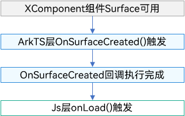
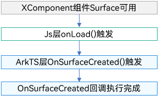
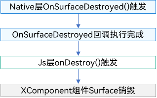
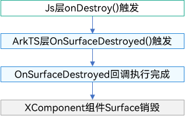

# 自定义渲染 (XComponent)

## 概述

XComponent组件作为一种渲染组件，可用于EGL/OpenGLES和媒体数据写入，通过使用XComponent独有的“[NativeWindow](../graphics/native-window-guidelines.md)”来渲染画面，通常用于满足开发者较为复杂的自定义渲染需求，例如相机预览流的显示和游戏画面的渲染。其可通过指定type字段来实现不同的渲染方式，分别为[XComponentType](../reference/apis-arkui/arkui-ts/ts-appendix-enums.md#xcomponenttype10枚举说明).SURFACE和XComponentType.TEXTURE。对于SURFACE类型，开发者将定制的绘制内容单独展示到屏幕上。对于TEXTURE类型，开发者将定制的绘制内容和XComponent组件的内容合成后展示到屏幕上。

目前XComponent组件主要有两个应用场景。一个是Native XComponent场景，在native层获取Native XComponent实例，在native侧注册XComponent的生命周期回调，以及触摸、鼠标、按键等事件回调。另一个是ArkTS XComponent场景，在ArkTS侧获取SurfaceId，生命周期回调、触摸、鼠标、按键等事件回调等均在ArkTS侧触发。

## Native XComponent场景
在XComponent组件构造函数的libraryname中定义需要加载的动态库，而后应用就可以在Native层获取Native XComponent实例，其是XComponent组件提供在Native层的实例，可作为ArkTS层和Native层XComponent绑定的桥梁。XComponent所提供的NDK接口都依赖于该实例。接口能力包括获取NativeWindow实例、获取XComponent的布局/事件信息、注册XComponent的生命周期回调、注册XComponent的触摸、鼠标、按键等事件回调。针对Native XComponent，主要的开发场景如下：

- 利用Native XComponent提供的接口注册XComponent的生命周期和事件回调。
- 在这些回调中进行初始化环境、获取当前状态、响应各类事件的开发。
- 利用NativeWindow和EGL接口开发自定义绘制内容以及申请和提交Buffer到图形队列。

**接口说明**

| 接口名                                                       | 描述                                                         |
| ------------------------------------------------------------ | ------------------------------------------------------------ |
| OH_NativeXComponent_GetXComponentId(OH_NativeXComponent* component, char* id, uint64_t* size) | 获取XComponent的id。                                         |
| OH_NativeXComponent_GetXComponentSize(OH_NativeXComponent* component, const void* window, uint64_t* width, uint64_t* height) | 获取XComponent持有的surface的大小。                          |
| OH_NativeXComponent_GetXComponentOffset(OH_NativeXComponent* component, const void* window, double* x, double* y) | 获取XComponent持有的surface相对其父组件左顶点的偏移量。      |
| OH_NativeXComponent_GetTouchEvent(OH_NativeXComponent* component, const void* window, OH_NativeXComponent_TouchEvent* touchEvent) | 获取由XComponent触发的触摸事件。touchEvent内的具体属性值可参考[OH_NativeXComponent_TouchEvent](../reference/apis-arkui/_o_h___native_x_component___touch_event.md)。 |
| OH_NativeXComponent_GetTouchPointToolType(OH_NativeXComponent* component, uint32_t pointIndex, OH_NativeXComponent_TouchPointToolType* toolType) | 获取XComponent触摸点的工具类型。                             |
| OH_NativeXComponent_GetTouchPointTiltX(OH_NativeXComponent* component, uint32_t pointIndex, float* tiltX) | 获取XComponent触摸点处相对X轴的倾斜角度。                    |
| OH_NativeXComponent_GetTouchPointTiltY(OH_NativeXComponent* component, uint32_t pointIndex, float* tiltY) | 获取XComponent触摸点处相对Y轴的倾斜角度。                    |
| OH_NativeXComponent_GetMouseEvent(OH_NativeXComponent* component, const void* window, OH_NativeXComponent_MouseEvent* mouseEvent) | 获取由XComponent触发的鼠标事件。                             |
| OH_NativeXComponent_RegisterCallback(OH_NativeXComponent* component, OH_NativeXComponent_Callback* callback) | 为此OH_NativeXComponent实例注册生命周期和触摸事件回调。      |
| OH_NativeXComponent_RegisterMouseEventCallback(OH_NativeXComponent* component, OH_NativeXComponent_MouseEvent_Callback* callback) | 为此OH_NativeXComponent实例注册鼠标事件回调。                |
| OH_NativeXComponent_RegisterFocusEventCallback(OH_NativeXComponent* component, void (\*callback)(OH_NativeXComponent* component, void* window)) | 为此OH_NativeXComponent实例注册获得焦点事件回调。            |
| OH_NativeXComponent_RegisterKeyEventCallback(OH_NativeXComponent* component, void (\*callback)(OH_NativeXComponent* component, void* window)) | 为此OH_NativeXComponent实例注册按键事件回调。                |
| OH_NativeXComponent_RegisterBlurEventCallback(OH_NativeXComponent* component, void (\*callback)(OH_NativeXComponent* component, void* window)) | 为此OH_NativeXComponent实例注册失去焦点事件回调。            |
| OH_NativeXComponent_GetKeyEvent(OH_NativeXComponent* component, OH_NativeXComponent_KeyEvent\** keyEvent) | 获取由XComponent触发的按键事件。                             |
| OH_NativeXComponent_GetKeyEventAction(OH_NativeXComponent_KeyEvent* keyEvent, OH_NativeXComponent_KeyAction* action) | 获取按键事件的动作。                                         |
| OH_NativeXComponent_GetKeyEventCode(OH_NativeXComponent_KeyEvent* keyEvent, OH_NativeXComponent_KeyCode* code) | 获取按键事件的键码值。                                       |
| OH_NativeXComponent_GetKeyEventSourceType(OH_NativeXComponent_KeyEvent* keyEvent, OH_NativeXComponent_EventSourceType* sourceType) | 获取按键事件的输入源类型。                                   |
| OH_NativeXComponent_GetKeyEventDeviceId(OH_NativeXComponent_KeyEvent* keyEvent, int64_t* deviceId) | 获取按键事件的设备ID。                                       |
| OH_NativeXComponent_GetKeyEventTimestamp(OH_NativeXComponent_KeyEvent* keyEvent, int64_t* timestamp) | 获取按键事件的时间戳。                                       |

> **说明 :**
>
> 上述接口不支持跨线程访问。
>
> XComponent销毁（onSurfaceDestroyed回调触发后）时会释放上述接口中获取的OH_NativeXComponent和window对象。如果再次使用获取的对象，有可能会导致使用野指针或空指针的崩溃问题。

**开发步骤**

以下步骤以SURFACE类型为例，描述了如何使用`XComponent组件`调用`Node-API`接口来创建`EGL/GLES`环境，实现在主页面绘制图形，并可以改变图形的颜色。

1. 在界面中定义XComponent。

    ```typescript
    @Entry
    @Component
    struct Index {
        @State message: string = 'Hello World'
        xComponentContext: object | undefined = undefined;
        xComponentAttrs: XComponentAttrs = {
            id: 'xcomponentId',
            type: XComponentType.SURFACE,
            libraryname: 'nativerender'
        }
    
        build() {
        Row() {
            // ...
            // 在xxx.ets 中定义 XComponent
            XComponent(this.xComponentAttrs)
                .focusable(true) // 可响应键盘事件
                .onLoad((xComponentContext) => {
                this.xComponentContext = xComponentContext;
                })
                .onDestroy(() => {
                console.log("onDestroy");
                })
            // ...
            }
            .height('100%')
        }
    }
        
    interface XComponentAttrs {
    id: string;
        type: number;
        libraryname: string;
    }
    ```
    
2. Node-API模块注册，具体使用请参考[Native API在应用工程中的使用指导](../napi/napi-guidelines.md)。

    ```c++
    // 在napi_init.cpp文件中，Init方法注册接口函数，从而将封装的C++方法传递出来，供ArkTS侧调用
    EXTERN_C_START
    static napi_value Init(napi_env env, napi_value exports)
    {
        // ...
        // 向ArkTS侧暴露接口getContext()
        napi_property_descriptor desc[] = {
            { "getContext", nullptr, PluginManager::GetContext, nullptr, nullptr, nullptr, napi_default, nullptr }
        };
        if (napi_define_properties(env, exports, sizeof(desc) / sizeof(desc[0]), desc) != napi_ok) {
            OH_LOG_Print(LOG_APP, LOG_ERROR, LOG_PRINT_DOMAIN, "Init", "napi_define_properties failed");
            return nullptr;
        }
        // 方法内检查环境变量是否包含XComponent组件实例，若实例存在注册绘制相关接口
        PluginManager::GetInstance()->Export(env, exports);
        return exports;
    }
    EXTERN_C_END
    
    // 编写接口的描述信息，根据实际需要可以修改对应参数
    static napi_module nativerenderModule = {
        .nm_version = 1,
        .nm_flags = 0,
        .nm_filename = nullptr,
        // 入口函数
        .nm_register_func = Init,// 指定加载对应模块时的回调函数
        // 模块名称
        .nm_modname = "nativerender", // 指定模块名称，对于XComponent相关开发，这个名称必须和ArkTS侧XComponent中libraryname的值保持一致
        .nm_priv = ((void *)0),
        .reserved = { 0 }
    };
    
    // __attribute__((constructor))修饰的方法由系统自动调用，使用Node-API接口napi_module_register()传入模块描述信息进行模块注册
    extern "C" __attribute__((constructor)) void RegisterModule(void)
    {
        napi_module_register(&nativerenderModule);
    }
    
    // 使用Node-API中的napi_define_properties方法，向ArkTS侧暴露drawPattern()方法，在ArkTS侧调用drawPattern()来绘制内容。
    void PluginRender::Export(napi_env env, napi_value exports)
    {
        // ...
        // 将接口函数注册为ArkTS侧接口drawPattern
        napi_property_descriptor desc[] = {
            { "drawPattern", nullptr, PluginRender::NapiDrawPattern, nullptr, nullptr, nullptr, napi_default, nullptr }
        };
        if (napi_define_properties(env, exports, sizeof(desc) / sizeof(desc[0]), desc) != napi_ok) {
            OH_LOG_Print(LOG_APP, LOG_ERROR, LOG_PRINT_DOMAIN, "PluginRender", "Export: napi_define_properties failed");
        }
    }
    ```

3. 注册XComponent事件回调，使用Node-API实现XComponent事件回调函数。

   (1) 定义surface创建成功，发生改变，销毁和XComponent的touch事件回调接口。

   ```c++
   // 定义一个函数OnSurfaceCreatedCB()，封装初始化环境与绘制背景
   void OnSurfaceCreatedCB(OH_NativeXComponent *component, void *window)
   {
   	// ...
   	// 获取XComponent的id，即ArkTS侧XComponent组件构造中的id参数
   	char idStr[OH_XCOMPONENT_ID_LEN_MAX + 1] = { '\0' };
   	uint64_t idSize = OH_XCOMPONENT_ID_LEN_MAX + 1;
   	if (OH_NativeXComponent_GetXComponentId(component, idStr, &idSize) != OH_NativeXComponent_RESULT_SUCCESS) {
   		OH_LOG_Print(LOG_APP, LOG_ERROR, LOG_PRINT_DOMAIN, "Callback",
   			"OnSurfaceCreatedCB: Unable to get XComponent id");
   		return;
   	}
   
   	// 初始化环境与绘制背景
   	std::string id(idStr);
   	auto render = PluginRender::GetInstance(id);
   	uint64_t width;
   	uint64_t height;
   	// 获取XComponent拥有的surface的大小
   	int32_t xSize = OH_NativeXComponent_GetXComponentSize(component, window, &width, &height);
   	if ((xSize == OH_NativeXComponent_RESULT_SUCCESS) && (render != nullptr)) {
   		if (render->eglCore_->EglContextInit(window, width, height)) {
   			render->eglCore_->Background();
   		}
   	}
   }
   
   // 定义一个函数OnSurfaceChangedCB()
   void OnSurfaceChangedCB(OH_NativeXComponent *component, void *window)
   {
   	// ...
   	// 获取XComponent的id
   	char idStr[OH_XCOMPONENT_ID_LEN_MAX + 1] = { '\0' };
   	uint64_t idSize = OH_XCOMPONENT_ID_LEN_MAX + 1;
   	if (OH_NativeXComponent_GetXComponentId(component, idStr, &idSize) != OH_NativeXComponent_RESULT_SUCCESS) {
   		OH_LOG_Print(LOG_APP, LOG_ERROR, LOG_PRINT_DOMAIN, "Callback",
   			"OnSurfaceChangedCB: Unable to get XComponent id");
   		return;
   	}
   
   	std::string id(idStr);
   	auto render = PluginRender::GetInstance(id);
   	if (render != nullptr) {
   		// 封装OnSurfaceChanged方法
   		render->OnSurfaceChanged(component, window);
   	}
   }
   
   // 定义一个函数OnSurfaceDestroyedCB()，将PluginRender类内释放资源的方法Release()封装在其中
   void OnSurfaceDestroyedCB(OH_NativeXComponent *component, void *window)
   {
   	// ...
   	// 获取XComponent的id
   	char idStr[OH_XCOMPONENT_ID_LEN_MAX + 1] = { '\0' };
   	uint64_t idSize = OH_XCOMPONENT_ID_LEN_MAX + 1;
   	if (OH_NativeXComponent_GetXComponentId(component, idStr, &idSize) != OH_NativeXComponent_RESULT_SUCCESS) {
   		OH_LOG_Print(LOG_APP, LOG_ERROR, LOG_PRINT_DOMAIN, "Callback",
   			"OnSurfaceDestroyedCB: Unable to get XComponent id");
   		return;
   	}
   
   	std::string id(idStr);
   	// 释放资源
   	PluginRender::Release(id);
   }
   
   // 定义一个函数DispatchTouchEventCB()，响应触摸事件时触发该回调
   void DispatchTouchEventCB(OH_NativeXComponent *component, void *window)
   {
   	// ...
   	// 获取XComponent的id
   	char idStr[OH_XCOMPONENT_ID_LEN_MAX + 1] = { '\0' };
   	uint64_t idSize = OH_XCOMPONENT_ID_LEN_MAX + 1;
   	if (OH_NativeXComponent_GetXComponentId(component, idStr, &idSize) != OH_NativeXComponent_RESULT_SUCCESS) {
   		OH_LOG_Print(LOG_APP, LOG_ERROR, LOG_PRINT_DOMAIN, "Callback",
   			"DispatchTouchEventCB: Unable to get XComponent id");
   		return;
   	}
   
   	std::string id(idStr);
   	PluginRender *render = PluginRender::GetInstance(id);
   	if (render != nullptr) {
   		// 封装OnTouchEvent方法
   		render->OnTouchEvent(component, window);
   	}
   }
   
   // 定义一个函数DispatchMouseEventCB()，响应鼠标事件时触发该回调
   void DispatchMouseEventCB(OH_NativeXComponent *component, void *window) {
   	OH_LOG_Print(LOG_APP, LOG_INFO, LOG_PRINT_DOMAIN, "Callback", "DispatchMouseEventCB");
   	int32_t ret;
   	char idStr[OH_XCOMPONENT_ID_LEN_MAX + 1] = {};
   	uint64_t idSize = OH_XCOMPONENT_ID_LEN_MAX + 1;
   	ret = OH_NativeXComponent_GetXComponentId(component, idStr, &idSize);
   	if (ret != OH_NativeXComponent_RESULT_SUCCESS) {
   		return;
   	}
   
   	std::string id(idStr);
   	auto render = PluginRender::GetInstance(id);
   	if (render) {
   		// 封装OnMouseEvent方法
   		render->OnMouseEvent(component, window);
   	}
   }
   
   // 定义一个函数DispatchHoverEventCB()，响应鼠标悬停事件时触发该回调
   void DispatchHoverEventCB(OH_NativeXComponent *component, bool isHover) {
   	OH_LOG_Print(LOG_APP, LOG_INFO, LOG_PRINT_DOMAIN, "Callback", "DispatchHoverEventCB");
   	int32_t ret;
   	char idStr[OH_XCOMPONENT_ID_LEN_MAX + 1] = {};
   	uint64_t idSize = OH_XCOMPONENT_ID_LEN_MAX + 1;
   	ret = OH_NativeXComponent_GetXComponentId(component, idStr, &idSize);
   	if (ret != OH_NativeXComponent_RESULT_SUCCESS) {
   		return;
   	}
   
   	std::string id(idStr);
   	auto render = PluginRender::GetInstance(id);
   	if (render) {
   		// 封装OnHoverEvent方法
   		render->OnHoverEvent(component, isHover);
   	}
   }
   
   // 定义一个函数OnFocusEventCB()，响应获焦事件时触发该回调
   void OnFocusEventCB(OH_NativeXComponent *component, void *window) {
   	OH_LOG_Print(LOG_APP, LOG_INFO, LOG_PRINT_DOMAIN, "Callback", "OnFocusEventCB");
   	int32_t ret;
   	char idStr[OH_XCOMPONENT_ID_LEN_MAX + 1] = {};
   	uint64_t idSize = OH_XCOMPONENT_ID_LEN_MAX + 1;
   	ret = OH_NativeXComponent_GetXComponentId(component, idStr, &idSize);
   	if (ret != OH_NativeXComponent_RESULT_SUCCESS) {
   		return;
   	}
   
   	std::string id(idStr);
   	auto render = PluginRender::GetInstance(id);
   	if (render) {
   		// 封装OnFocusEvent方法
   		render->OnFocusEvent(component, window);
   	}
   }
   
   // 定义一个函数OnBlurEventCB()，响应失去焦点事件时触发该回调
   void OnBlurEventCB(OH_NativeXComponent *component, void *window) {
   	OH_LOG_Print(LOG_APP, LOG_INFO, LOG_PRINT_DOMAIN, "Callback", "OnBlurEventCB");
   	int32_t ret;
   	char idStr[OH_XCOMPONENT_ID_LEN_MAX + 1] = {};
   	uint64_t idSize = OH_XCOMPONENT_ID_LEN_MAX + 1;
   	ret = OH_NativeXComponent_GetXComponentId(component, idStr, &idSize);
   	if (ret != OH_NativeXComponent_RESULT_SUCCESS) {
   		return;
   	}
   
   	std::string id(idStr);
   	auto render = PluginRender::GetInstance(id);
   	if (render) {
   		// 封装OnBlurEvent方法
   		render->OnBlurEvent(component, window);
   	}
   }
   
   // 定义一个函数OnKeyEventCB()，响应按键事件时触发该回调
   void OnKeyEventCB(OH_NativeXComponent *component, void *window) {
   	OH_LOG_Print(LOG_APP, LOG_INFO, LOG_PRINT_DOMAIN, "Callback", "OnKeyEventCB");
   	int32_t ret;
   	char idStr[OH_XCOMPONENT_ID_LEN_MAX + 1] = {};
   	uint64_t idSize = OH_XCOMPONENT_ID_LEN_MAX + 1;
   	ret = OH_NativeXComponent_GetXComponentId(component, idStr, &idSize);
   	if (ret != OH_NativeXComponent_RESULT_SUCCESS) {
   		return;
   	}
   	std::string id(idStr);
   	auto render = PluginRender::GetInstance(id);
   	if (render) {
   		// 封装OnKeyEvent方法
   		render->OnKeyEvent(component, window);
   	}
   }
   
   // 定义一个OnSurfaceChanged()方法
   void PluginRender::OnSurfaceChanged(OH_NativeXComponent* component, void* window)
   {
   	// ...
       std::string id(idStr);
       PluginRender* render = PluginRender::GetInstance(id);
       double offsetX;
       double offsetY;
       // 获取XComponent持有的surface相对其父组件左顶点的偏移量
       OH_NativeXComponent_GetXComponentOffset(component, window, &offsetX, &offsetY);
       OH_LOG_Print(LOG_APP, LOG_INFO, LOG_PRINT_DOMAIN, "OH_NativeXComponent_GetXComponentOffset",
           "offsetX = %{public}lf, offsetY = %{public}lf", offsetX, offsetY);
       uint64_t width;
       uint64_t height;
       OH_NativeXComponent_GetXComponentSize(component, window, &width, &height);
       if (render != nullptr) {
           render->eglCore_->UpdateSize(width, height);
       }
   }
   
   // 定义一个OnTouchEvent()方法
   void PluginRender::OnTouchEvent(OH_NativeXComponent* component, void* window)
   {
       // ...
       OH_NativeXComponent_TouchEvent touchEvent;
       // 获取由XComponent触发的触摸事件
       OH_NativeXComponent_GetTouchEvent(component, window, &touchEvent);
       // 获取XComponent触摸点相对于XComponent组件左边缘的坐标x和相对于XComponent组件上边缘的坐标y
       OH_LOG_Print(LOG_APP, LOG_INFO, LOG_PRINT_DOMAIN, "OnTouchEvent",
           "touch info: x = %{public}lf, y = %{public}lf", touchEvent.x, touchEvent.y);
       // 获取XComponent触摸点相对于XComponent所在应用窗口左上角的x坐标和相对于XComponent所在应用窗口左上角的y坐标
       OH_LOG_Print(LOG_APP, LOG_INFO, LOG_PRINT_DOMAIN, "OnTouchEvent",
           "touch info: screenX = %{public}lf, screenY = %{public}lf", touchEvent.screenX, touchEvent.screenY);
       std::string id(idStr);
       PluginRender* render = PluginRender::GetInstance(id);
       if (render != nullptr && touchEvent.type == OH_NativeXComponent_TouchEventType::OH_NativeXComponent_UP) {
           render->eglCore_->ChangeColor();
           hasChangeColor_ = 1;
       }
       float tiltX = 0.0f;
       float tiltY = 0.0f;
       OH_NativeXComponent_TouchPointToolType toolType =
           OH_NativeXComponent_TouchPointToolType::OH_NativeXComponent_TOOL_TYPE_UNKNOWN;
       // 获取XComponent触摸点的工具类型
       OH_NativeXComponent_GetTouchPointToolType(component, 0, &toolType);
       // 获取XComponent触摸点处相对X轴的倾斜角度
       OH_NativeXComponent_GetTouchPointTiltX(component, 0, &tiltX);
       // 获取XComponent触摸点处相对Y轴的倾斜角度
       OH_NativeXComponent_GetTouchPointTiltY(component, 0, &tiltY);
       OH_LOG_Print(LOG_APP, LOG_INFO, LOG_PRINT_DOMAIN, "OnTouchEvent",
           "touch info: toolType = %{public}d, tiltX = %{public}lf, tiltY = %{public}lf", toolType, tiltX, tiltY);
   }
   
   // 定义一个OnMouseEvent()方法
   void PluginRender::OnMouseEvent(OH_NativeXComponent *component, void *window) {
      OH_LOG_Print(LOG_APP, LOG_INFO, LOG_PRINT_DOMAIN, "PluginRender", "OnMouseEvent");
      OH_NativeXComponent_MouseEvent mouseEvent;
      // 获取由XComponent触发的鼠标事件
      int32_t ret = OH_NativeXComponent_GetMouseEvent(component, window, &mouseEvent);
      if (ret == OH_NativeXComponent_RESULT_SUCCESS) {
   	   OH_LOG_Print(LOG_APP, LOG_INFO, LOG_PRINT_DOMAIN, "PluginRender", "MouseEvent Info: x = %{public}f, y = %{public}f, action = %{public}d, button = %{public}d", mouseEvent.x, mouseEvent.y, mouseEvent.action, mouseEvent.button);
      } else {
   	   OH_LOG_Print(LOG_APP, LOG_ERROR, LOG_PRINT_DOMAIN, "PluginRender", "GetMouseEvent error");
      }
   }
   
   // 定义一个OnKeyEvent()方法
   void PluginRender::OnKeyEvent(OH_NativeXComponent *component, void *window) {
      OH_LOG_Print(LOG_APP, LOG_INFO, LOG_PRINT_DOMAIN, "PluginRender", "OnKeyEvent");
   
      OH_NativeXComponent_KeyEvent *keyEvent = nullptr;
      // 获取由XComponent触发的按键事件。
      if (OH_NativeXComponent_GetKeyEvent(component, &keyEvent) >= 0) {
   	   OH_NativeXComponent_KeyAction action;
          // 获取按键事件的动作
   	   OH_NativeXComponent_GetKeyEventAction(keyEvent, &action);
   	   OH_NativeXComponent_KeyCode code;
          // 获取按键事件的键码值
   	   OH_NativeXComponent_GetKeyEventCode(keyEvent, &code);
   	   OH_NativeXComponent_EventSourceType sourceType;
          // 获取按键事件的输入源类型
   	   OH_NativeXComponent_GetKeyEventSourceType(keyEvent, &sourceType);
   	   int64_t deviceId;
          // 获取按键事件的设备ID
   	   OH_NativeXComponent_GetKeyEventDeviceId(keyEvent, &deviceId);
   	   int64_t timeStamp;
          // 获取按键事件的时间戳
   	   OH_NativeXComponent_GetKeyEventTimestamp(keyEvent, &timeStamp);
   	   OH_LOG_Print(LOG_APP, LOG_INFO, LOG_PRINT_DOMAIN, "PluginRender", "KeyEvent Info: action=%{public}d, code=%{public}d, sourceType=%{public}d, deviceId=%{public}ld, timeStamp=%{public}ld", action, code, sourceType, deviceId, timeStamp);
      } else {
   	   OH_LOG_Print(LOG_APP, LOG_ERROR, LOG_PRINT_DOMAIN, "PluginRender", "GetKeyEvent error");
      }
   }
   ```

   (2) 注册XComponent事件回调函数，在XComponent事件触发时调用3.1步骤中定义的方法。

    ```c++
    void PluginRender::RegisterCallback(OH_NativeXComponent *NativeXComponent) {
        // 设置组件创建事件的回调函数，组件创建时触发相关操作，初始化环境与绘制背景
        renderCallback_.OnSurfaceCreated = OnSurfaceCreatedCB;
        // 设置组件改变事件的回调函数，组件改变时触发相关操作
        renderCallback_.OnSurfaceChanged = OnSurfaceChangedCB;
        // 设置组件销毁事件的回调函数，组件销毁时触发相关操作，释放申请的资源
        renderCallback_.OnSurfaceDestroyed = OnSurfaceDestroyedCB;
        // 设置触摸事件的回调函数，在触摸事件触发时调用Node-API接口函数，从而调用原C++方法
        renderCallback_.DispatchTouchEvent = DispatchTouchEventCB;
        // 将OH_NativeXComponent_Callback注册给NativeXComponent
        OH_NativeXComponent_RegisterCallback(NativeXComponent, &renderCallback_);
        
        // 设置鼠标事件的回调函数，在触摸事件触发时调用Node-API接口函数，从而调用原C++方法
        mouseCallback_.DispatchMouseEvent = DispatchMouseEventCB;
        // 设置鼠标悬停事件的回调函数，在触摸事件触发时调用Node-API接口函数，从而调用原C++方法
        mouseCallback_.DispatchHoverEvent = DispatchHoverEventCB;
        // 将OH_NativeXComponent_MouseEvent_Callback注册给NativeXComponent
        OH_NativeXComponent_RegisterMouseEventCallback(NativeXComponent, &mouseCallback_);
        
        // 将OnFocusEventCB方法注册给NativeXComponent
        OH_NativeXComponent_RegisterFocusEventCallback(NativeXComponent, OnFocusEventCB);
        // 将OnKeyEventCB方法注册给NativeXComponent
        OH_NativeXComponent_RegisterKeyEventCallback(NativeXComponent, OnKeyEventCB);
        // 将OnBlurEventCB方法注册给 NativeXComponent
        OH_NativeXComponent_RegisterBlurEventCallback(NativeXComponent, OnBlurEventCB);
    }
    ```

   (3) 定义NapiDrawPattern方法，暴露到ArkTS侧的drawPattern()方法会执行该方法。

    ```c++
    napi_value PluginRender::NapiDrawPattern(napi_env env, napi_callback_info info)
    {
        // ...
        // 获取环境变量参数
        napi_value thisArg;
        if (napi_get_cb_info(env, info, nullptr, nullptr, &thisArg, nullptr) != napi_ok) {
            OH_LOG_Print(LOG_APP, LOG_ERROR, LOG_PRINT_DOMAIN, "PluginRender", "NapiDrawPattern: napi_get_cb_info fail");
            return nullptr;
        }
       
        // 获取环境变量中XComponent实例
        napi_value exportInstance;
        if (napi_get_named_property(env, thisArg, OH_NATIVE_XCOMPONENT_OBJ, &exportInstance) != napi_ok) {
            OH_LOG_Print(LOG_APP, LOG_ERROR, LOG_PRINT_DOMAIN, "PluginRender",
                "NapiDrawPattern: napi_get_named_property fail");
            return nullptr;
        }
       
        // 通过napi_unwrap接口，获取XComponent的实例指针
        OH_NativeXComponent *NativeXComponent = nullptr;
        if (napi_unwrap(env, exportInstance, reinterpret_cast<void **>(&NativeXComponent)) != napi_ok) {
            OH_LOG_Print(LOG_APP, LOG_ERROR, LOG_PRINT_DOMAIN, "PluginRender", "NapiDrawPattern: napi_unwrap fail");
            return nullptr;
        }
       
        // 获取XComponent实例的id
        char idStr[OH_XCOMPONENT_ID_LEN_MAX + 1] = { '\0' };
        uint64_t idSize = OH_XCOMPONENT_ID_LEN_MAX + 1;
        if (OH_NativeXComponent_GetXComponentId(NativeXComponent, idStr, &idSize) != OH_NativeXComponent_RESULT_SUCCESS) {
            OH_LOG_Print(LOG_APP, LOG_ERROR, LOG_PRINT_DOMAIN, "PluginRender",
                "NapiDrawPattern: Unable to get XComponent id");
            return nullptr;
        }
       
        std::string id(idStr);
        PluginRender *render = PluginRender::GetInstance(id);
        if (render) {
            // 调用绘制方法
            render->eglCore_->Draw();
            OH_LOG_Print(LOG_APP, LOG_INFO, LOG_PRINT_DOMAIN, "PluginRender", "render->eglCore_->Draw() executed");
        }
        return nullptr;
    }
    ```

4. 初始化环境，包括初始化可用的EGLDisplay、确定可用的surface配置、创建渲染区域surface、创建并关联上下文等。

    ```c++
    void EGLCore::UpdateSize(int width, int height) 
    {
        width_ = width;
        height_ = height;
        if (width_ > 0) {
            // 计算绘制矩形宽度百分比
            width_Percent_ = FIFTY_PERCENT * height_ / width_;
        }
    }
    
    bool EGLCore::EglContextInit(void *window, int width, int height)
    {
        // ...
        UpdateSize(width, height);
        eglWindow_ = static_cast<EGLNativeWindowType>(window);
    
        // 初始化display
        eglDisplay_ = eglGetDisplay(EGL_DEFAULT_DISPLAY);
        if (eglDisplay_ == EGL_NO_DISPLAY) {
            OH_LOG_Print(LOG_APP, LOG_ERROR, LOG_PRINT_DOMAIN, "EGLCore", "eglGetDisplay: unable to get EGL display");
            return false;
        }
    
        // 初始化EGL
        EGLint majorVersion;
        EGLint minorVersion;
        if (!eglInitialize(eglDisplay_, &majorVersion, &minorVersion)) {
            OH_LOG_Print(LOG_APP, LOG_ERROR, LOG_PRINT_DOMAIN, "EGLCore",
                "eglInitialize: unable to get initialize EGL display");
            return false;
        }
    
        // 选择配置
        const EGLint maxConfigSize = 1;
        EGLint numConfigs;
        if (!eglChooseConfig(eglDisplay_, ATTRIB_LIST, &eglConfig_, maxConfigSize, &numConfigs)) {
            OH_LOG_Print(LOG_APP, LOG_ERROR, LOG_PRINT_DOMAIN, "EGLCore", "eglChooseConfig: unable to choose configs");
            return false;
        }
    
        // 创建环境
        return CreateEnvironment();
    }
    ```

    ```c++
    bool EGLCore::CreateEnvironment()
    {
        // ...
        // 创建surface
        eglSurface_ = eglCreateWindowSurface(eglDisplay_, eglConfig_, eglWindow_, NULL);
    
        // ...
        // 创建context
        eglContext_ = eglCreateContext(eglDisplay_, eglConfig_, EGL_NO_CONTEXT, CONTEXT_ATTRIBS);
        if (!eglMakeCurrent(eglDisplay_, eglSurface_, eglSurface_, eglContext_)) {
            OH_LOG_Print(LOG_APP, LOG_ERROR, LOG_PRINT_DOMAIN, "EGLCore", "eglMakeCurrent failed");
            return false;
        }
    
        // 创建program
        program_ = CreateProgram(VERTEX_SHADER, FRAGMENT_SHADER);
        if (program_ == PROGRAM_ERROR) {
            OH_LOG_Print(LOG_APP, LOG_ERROR, LOG_PRINT_DOMAIN, "EGLCore", "CreateProgram: unable to create program");
            return false;
        }
        return true;
    }
    ```

5. 渲染功能实现。

   (1) 绘制背景。

    ```c++
    // 绘制背景颜色 #f4f4f4
    const GLfloat BACKGROUND_COLOR[] = { 244.0f / 255, 244.0f / 255, 244.0f / 255, 1.0f };
   
    // 绘制背景顶点
    const GLfloat BACKGROUND_RECTANGLE_VERTICES[] = {
        -1.0f, 1.0f,
        1.0f, 1.0f,
        1.0f, -1.0f,
        -1.0f, -1.0f
    };
    ```

    ```c++
    // 绘制背景颜色
    void EGLCore::Background()
    {
        GLint position = PrepareDraw();
        if (position == POSITION_ERROR) {
            OH_LOG_Print(LOG_APP, LOG_ERROR, LOG_PRINT_DOMAIN, "EGLCore", "Background get position failed");
            return;
        }
   
        if (!ExecuteDraw(position, BACKGROUND_COLOR, BACKGROUND_RECTANGLE_VERTICES,
            sizeof(BACKGROUND_RECTANGLE_VERTICES))) {
            OH_LOG_Print(LOG_APP, LOG_ERROR, LOG_PRINT_DOMAIN, "EGLCore", "Background execute draw failed");
            return;
        }
   
        if (!FinishDraw()) {
            OH_LOG_Print(LOG_APP, LOG_ERROR, LOG_PRINT_DOMAIN, "EGLCore", "Background FinishDraw failed");
            return;
        }
    }
   
    // 绘前准备，获取position，创建成功时position值从0开始
    GLint EGLCore::PrepareDraw()
    {
        if ((eglDisplay_ == nullptr) || (eglSurface_ == nullptr) || (eglContext_ == nullptr) ||
            (!eglMakeCurrent(eglDisplay_, eglSurface_, eglSurface_, eglContext_))) {
            OH_LOG_Print(LOG_APP, LOG_ERROR, LOG_PRINT_DOMAIN, "EGLCore", "PrepareDraw: param error");
            return POSITION_ERROR;
        }
   
        glViewport(DEFAULT_X_POSITION, DEFAULT_Y_POSITION, width_, height_);
        glClearColor(GL_RED_DEFAULT, GL_GREEN_DEFAULT, GL_BLUE_DEFAULT, GL_ALPHA_DEFAULT);
        glClear(GL_COLOR_BUFFER_BIT);
        glUseProgram(program_);
   
        return glGetAttribLocation(program_, POSITION_NAME);
    }
   
    // 依据传入参数在指定区域绘制指定颜色
    bool EGLCore::ExecuteDraw(GLint position, const GLfloat *color, const GLfloat shapeVertices[],
        unsigned long vertSize)
    {
        if ((position > 0) || (color == nullptr) || (vertSize / sizeof(shapeVertices[0]) != SHAPE_VERTICES_SIZE)) {
            OH_LOG_Print(LOG_APP, LOG_ERROR, LOG_PRINT_DOMAIN, "EGLCore", "ExecuteDraw: param error");
            return false;
        }
   
        glVertexAttribPointer(position, POINTER_SIZE, GL_FLOAT, GL_FALSE, 0, shapeVertices);
        glEnableVertexAttribArray(position);
        glVertexAttrib4fv(1, color);
        glDrawArrays(GL_TRIANGLE_FAN, 0, TRIANGLE_FAN_SIZE);
        glDisableVertexAttribArray(position);
   
        return true;
    }
   
    // 结束绘制操作
    bool EGLCore::FinishDraw()
    {
        // 强制刷新缓冲
        glFlush();
        glFinish();
        return eglSwapBuffers(eglDisplay_, eglSurface_);
    }
    ```

   (2) 绘制图形。

    ```c++
    void EGLCore::Draw()
    {
        flag_ = false;
        OH_LOG_Print(LOG_APP, LOG_INFO, LOG_PRINT_DOMAIN, "EGLCore", "Draw");
        GLint position = PrepareDraw();
        if (position == POSITION_ERROR) {
            OH_LOG_Print(LOG_APP, LOG_ERROR, LOG_PRINT_DOMAIN, "EGLCore", "Draw get position failed");
            return;
        }
   
        // 绘制背景
        if (!ExecuteDraw(position, BACKGROUND_COLOR, BACKGROUND_RECTANGLE_VERTICES,
            sizeof(BACKGROUND_RECTANGLE_VERTICES))) {
            OH_LOG_Print(LOG_APP, LOG_ERROR, LOG_PRINT_DOMAIN, "EGLCore", "Draw execute draw background failed");
            return;
        }
        
        // 将五角星分为五个四边形，计算其中一个四边形的四个顶点
        GLfloat rotateX = 0;
        GLfloat rotateY = FIFTY_PERCENT * height_;
        GLfloat centerX = 0;
        GLfloat centerY = -rotateY * (M_PI / 180 * 54) * (M_PI / 180 * 18);
        GLfloat leftX = -rotateY * (M_PI / 180 * 18);
        GLfloat leftY = 0;
        GLfloat rightX = rotateY * (M_PI / 180 * 18);
        GLfloat rightY = 0;
   
        // 确定绘制四边形的顶点，使用绘制区域的百分比表示
        const GLfloat shapeVertices[] = {
            centerX / width_, centerY / height_,
            leftX / width_, leftY / height_,
            rotateX / width_, rotateY / height_,
            rightX / width_, rightY / height_
        };
        
        if (!ExecuteDrawStar(position, DRAW_COLOR, shapeVertices, sizeof(shapeVertices))) {
            OH_LOG_Print(LOG_APP, LOG_ERROR, LOG_PRINT_DOMAIN, "EGLCore", "Draw execute draw star failed");
            return;
        }
        
        GLfloat rad = M_PI / 180 * 72;
        for (int i = 0; i < 4; ++i) 
        {
            // 旋转得其他四个四边形的顶点
            rotate2d(centerX, centerY, &rotateX, &rotateY,rad);
            rotate2d(centerX, centerY, &leftX, &leftY,rad);
            rotate2d(centerX, centerY, &rightX, &rightY,rad);
            
            // 确定绘制四边形的顶点，使用绘制区域的百分比表示
            const GLfloat shapeVertices[] = {
                    centerX / width_, centerY / height_,
                    leftX / width_, leftY / height_,
                    rotateX / width_, rotateY / height_,
                    rightX / width_, rightY / height_
                };
            
            // 绘制图形
            if (!ExecuteDrawStar(position, DRAW_COLOR, shapeVertices, sizeof(shapeVertices))) {
                OH_LOG_Print(LOG_APP, LOG_ERROR, LOG_PRINT_DOMAIN, "EGLCore", "Draw execute draw star failed");
                return;
            }
        }
   
        // 结束绘制
        if (!FinishDraw()) {
            OH_LOG_Print(LOG_APP, LOG_ERROR, LOG_PRINT_DOMAIN, "EGLCore", "Draw FinishDraw failed");
            return;
        }
   
        flag_ = true;
    }
    ```

   (3) 改变颜色，重新画一个大小相同颜色不同的图形，与原图形替换，达到改变颜色的效果。

    ```c++
    void EGLCore::ChangeColor()
    {
        if (!flag_) {
            return;
        }
        OH_LOG_Print(LOG_APP, LOG_INFO, LOG_PRINT_DOMAIN, "EGLCore", "ChangeColor");
        GLint position = PrepareDraw();
        if (position == POSITION_ERROR) {
            OH_LOG_Print(LOG_APP, LOG_ERROR, LOG_PRINT_DOMAIN, "EGLCore", "ChangeColor get position failed");
            return;
        }
    
        // 绘制背景
        if (!ExecuteDraw(position, BACKGROUND_COLOR, BACKGROUND_RECTANGLE_VERTICES,
            sizeof(BACKGROUND_RECTANGLE_VERTICES))) {
            OH_LOG_Print(LOG_APP, LOG_ERROR, LOG_PRINT_DOMAIN, "EGLCore", "ChangeColor execute draw background failed");
            return;
        }
    
        // 确定绘制四边形的顶点，使用绘制区域的百分比表示
        GLfloat rotateX = 0;
        GLfloat rotateY = FIFTY_PERCENT * height_;
        GLfloat centerX = 0;
        GLfloat centerY = -rotateY * (M_PI / 180 * 54) * (M_PI / 180 * 18);
        GLfloat leftX = -rotateY * (M_PI / 180 * 18);
        GLfloat leftY = 0;
        GLfloat rightX = rotateY * (M_PI / 180 * 18);
        GLfloat rightY = 0;
    
        // 确定绘制四边形的顶点，使用绘制区域的百分比表示
        const GLfloat shapeVertices[] = {
            centerX / width_, centerY / height_,
            leftX / width_, leftY / height_,
            rotateX / width_, rotateY / height_,
            rightX / width_, rightY / height_
        };
        
        // 使用新的颜色绘制
        if (!ExecuteDrawStar2(position, CHANGE_COLOR, shapeVertices, sizeof(shapeVertices))) {
            OH_LOG_Print(LOG_APP, LOG_ERROR, LOG_PRINT_DOMAIN, "EGLCore", "Draw execute draw star failed");
            return;
        }
    
        GLfloat rad = M_PI / 180 * 72;
        for (int i = 0; i < 4; ++i)
        {
            // 旋转得其他四个四边形的顶点
            rotate2d(centerX, centerY, &rotateX, &rotateY,rad);
            rotate2d(centerX, centerY, &leftX, &leftY,rad);
            rotate2d(centerX, centerY, &rightX, &rightY,rad);
            
            // 确定绘制四边形的顶点，使用绘制区域的百分比表示
            const GLfloat shapeVertices[] = {
                    centerX / width_, centerY / height_,
                    leftX / width_, leftY / height_,
                    rotateX / width_, rotateY / height_,
                    rightX / width_, rightY / height_
                };
    
            // 使用新的颜色绘制
            if (!ExecuteDrawStar2(position, CHANGE_COLOR, shapeVertices, sizeof(shapeVertices))) {
                OH_LOG_Print(LOG_APP, LOG_ERROR, LOG_PRINT_DOMAIN, "EGLCore", "Draw execute draw star failed");
                return;
            }
        }
    
        // 结束绘制
        if (!FinishDraw()) {
            OH_LOG_Print(LOG_APP, LOG_ERROR, LOG_PRINT_DOMAIN, "EGLCore", "ChangeColor FinishDraw failed");
        }
    }
    ```

6. 释放相关资源。

   (1) EGLCore类下创建Release()方法，释放初始化环境时申请的资源，包含窗口display、渲染区域surface、环境上下文context等。

    ```c++
    void EGLCore::Release()
    {
        // 释放surface
        if ((eglDisplay_ == nullptr) || (eglSurface_ == nullptr) || (!eglDestroySurface(eglDisplay_, eglSurface_))) {
            OH_LOG_Print(LOG_APP, LOG_ERROR, LOG_PRINT_DOMAIN, "EGLCore", "Release eglDestroySurface failed");
        }
        // 释放context
        if ((eglDisplay_ == nullptr) || (eglContext_ == nullptr) || (!eglDestroyContext(eglDisplay_, eglContext_))) {
            OH_LOG_Print(LOG_APP, LOG_ERROR, LOG_PRINT_DOMAIN, "EGLCore", "Release eglDestroyContext failed");
        }
        // 释放display
        if ((eglDisplay_ == nullptr) || (!eglTerminate(eglDisplay_))) {
            OH_LOG_Print(LOG_APP, LOG_ERROR, LOG_PRINT_DOMAIN, "EGLCore", "Release eglTerminate failed");
        }
    }
    ```

   (2) PluginRender类添加Release()方法，释放EGLCore实例及PluginRender实例。

    ```c++
    void PluginRender::Release(std::string &id)
    {
        PluginRender *render = PluginRender::GetInstance(id);
        if (render != nullptr) {
            render->eglCore_->Release();
            delete render->eglCore_;
            render->eglCore_ = nullptr;
            delete render;
            render = nullptr;
            instance_.erase(instance_.find(id));
        }
    }
    ```

7. CMakeLists，使用CMake工具链将C++源代码编译成动态链接库文件。

    ```CMake
    # 设置CMake最小版本
    cmake_minimum_required(VERSION 3.4.1)
    # 项目名称
    project(XComponent)
    
    set(NATIVERENDER_ROOT_PATH ${CMAKE_CURRENT_SOURCE_DIR})
    add_definitions(-DOHOS_PLATFORM)
    # 设置头文件搜索目录
    include_directories(
        ${NATIVERENDER_ROOT_PATH}
        ${NATIVERENDER_ROOT_PATH}/include
    )
    # 添加名为nativerender的动态库，库文件名为libnativerender.so，添加cpp文件
    add_library(nativerender SHARED
        render/egl_core.cpp
        render/plugin_render.cpp
        manager/plugin_manager.cpp
        napi_init.cpp
    )
    
    find_library(
        EGL-lib
        EGL
    )
    
    find_library(
        GLES-lib
        GLESv3
    )
    
    find_library(
        hilog-lib
        hilog_ndk.z
    )
    
    find_library(
        libace-lib
        ace_ndk.z
    )
    
    find_library(
        libnapi-lib
        ace_napi.z
    )
    
    find_library(
        libuv-lib
        uv
    )
    # 添加构建需要链接的库
    target_link_libraries(nativerender PUBLIC
        ${EGL-lib} ${GLES-lib} ${hilog-lib} ${libace-lib} ${libnapi-lib} ${libuv-lib})
    ```

## ArkTS XComponent场景

与Native XComponent不同，ArkTS XComponent不再需要libraryname参数。通过在ArkTS侧获取SurfaceId，布局信息、生命周期回调、触摸、鼠标、按键等事件回调等均在ArkTS侧触发，按需传递到Native侧进行处理。主要开发场景如下：
- 基于ArkTS侧获取的SurfaceId，在Native侧调用OH_NativeWindow_CreateNativeWindowFromSurfaceId接口创建出NativeWindow实例。
- 利用NativeWindow和EGL接口开发自定义绘制内容以及申请和提交Buffer到图形队列。
- ArkTS侧获取生命周期、事件等信息传递到Native侧处理。

**接口说明**

ArkTS侧的XComponentController

| 接口名                                                       | 描述                                                         |
| ------------------------------------------------------------ | ------------------------------------------------------------ |
| getXComponentSurfaceId(): string                             | 获取XComponent对应Surface的ID。                                |
| onSurfaceCreated(surfaceId: string): void                    | 当XComponent持有的Surface创建后进行该回调。                    |
| onSurfaceChanged(surfaceId: string, rect: SurfaceRect): void | 当XComponent持有的Surface大小改变后（包括首次创建时的大小改变）进行该回调。 |
| onSurfaceDestroyed(surfaceId: string): void                  | 当XComponent持有的Surface销毁后进行该回调。                    |

Native侧

| 接口名                                                       | 描述                                                         |
| ------------------------------------------------------------ | ------------------------------------------------------------ |
| int32_t OH_NativeWindow_CreateNativeWindowFromSurfaceId (uint64_t surfaceId, OHNativeWindow **window ) | 通过surfaceId创建对应的OHNativeWindow。                        |
| void OH_NativeWindow_DestroyNativeWindow (OHNativeWindow* window) | 将OHNativeWindow对象的引用计数减1，当引用计数为0的时候，该OHNativeWindow对象会被析构掉。 |

**开发步骤**

以下步骤以SURFACE类型为例，描述了如何使用`XComponent组件`在ArkTS侧传入Surfaceid，在native侧创建NativeWindow实例，然后创建`EGL/GLES`环境，实现在主页面绘制图形，并可以改变图形的颜色。

1. 在界面中定义XComponent。
   
    ```typescript
    import nativeRender from 'libnativerender.so'
    //重写XComponentController
    class MyXComponentController extends XComponentController {
        onSurfaceCreated(surfaceId: string): void {
        console.log(`onSurfaceCreated surfaceId: ${surfaceId}`)
        nativeRender.SetSurfaceId(BigInt(surfaceId));
        }
        onSurfaceChanged(surfaceId: string, rect: SurfaceRect): void {
        console.log(`onSurfaceChanged surfaceId: ${surfaceId}, rect: ${JSON.stringify(rect)}}`)
        nativeRender.ChangeSurface(BigInt(surfaceId), rect.surfaceWidth, rect.surfaceHeight)
        }
        onSurfaceDestroyed(surfaceId: string): void {
        console.log(`onSurfaceDestroyed surfaceId: ${surfaceId}`)
        nativeRender.DestroySurface(BigInt(surfaceId))
        }
    }
    
    @Entry
    @Component
    struct Index {
        @State currentStatus: string = "index";
        xComponentController: XComponentController = new MyXComponentController();
        build() {
        Column() {
            //...
            //在xxx.ets 中定义 XComponent
            Column({ space: 10 }) {
            XComponent({
                type: XComponentType.SURFACE,
                controller: this.xComponentController
            })
            Text(this.currentStatus)
                .fontSize('24fp')
                .fontWeight(500)
            }
            .onClick(() => {
            let surfaceId = this.xComponentController.getXComponentSurfaceId()
            nativeRender.ChangeColor(BigInt(surfaceId))
            let hasChangeColor: boolean = false;
            if (nativeRender.GetXComponentStatus(BigInt(surfaceId))) {
                hasChangeColor = nativeRender.GetXComponentStatus(BigInt(surfaceId)).hasChangeColor;
            }
            if (hasChangeColor) {
                this.currentStatus = "change color";
            }
            })
            //...
            Row() {
            Button('Draw Star')
                .fontSize('16fp')
                .fontWeight(500)
                .margin({ bottom: 24 })
                .onClick(() => {
                let surfaceId = this.xComponentController.getXComponentSurfaceId()
                nativeRender.DrawPattern(BigInt(surfaceId))
                let hasDraw: boolean = false;
                if (nativeRender.GetXComponentStatus(BigInt(surfaceId))) {
                    hasDraw = nativeRender.GetXComponentStatus(BigInt(surfaceId)).hasDraw;
                }
                if (hasDraw) {
                    this.currentStatus = "draw star"
                }
                })
                .width('53.6%')
                .height(40)
            }
            .width('100%')
            .justifyContent(FlexAlign.Center)
            .alignItems(VerticalAlign.Bottom)
            .layoutWeight(1)
        }
        .width('100%')
        .height('100%')
        }
    }
    ```
    
2. Node-API模块注册，具体使用请参考[Native API在应用工程中的使用指导](../napi/napi-guidelines.md)。

    ```typescript
    namespace NativeXComponentSample {
    //在napi_init.cpp文件中，Init方法注册接口函数，从而将封装的C++方法传递出来，供ArkTS侧调用
    EXTERN_C_START
    static napi_value Init(napi_env env, napi_value exports)
    {
        // ...
        // 向ArkTS侧暴露接口SetSurfaceId(),ChangeSurface(),DestroySurface(),
        //DrawPattern(),ChangeColor(),GetXComponentStatus()
        napi_property_descriptor desc[] = {
            {"SetSurfaceId", nullptr, PluginManager::SetSurfaceId,
                nullptr, nullptr, nullptr, napi_default, nullptr},
            {"ChangeSurface", nullptr, PluginManager::ChangeSurface,
                nullptr, nullptr, nullptr, napi_default, nullptr},
            {"DestroySurface", nullptr, PluginManager::DestroySurface,
                nullptr, nullptr, nullptr, napi_default, nullptr},
            {"DrawPattern", nullptr, PluginManager::DrawPattern,
                nullptr, nullptr, nullptr, napi_default, nullptr},
            {"ChangeColor", nullptr, PluginManager::ChangeColor,
                nullptr, nullptr, nullptr, napi_default, nullptr},
            {"GetXComponentStatus", nullptr, PluginManager::GetXComponentStatus,
                nullptr, nullptr, nullptr, napi_default, nullptr}
        };
        if (napi_define_properties(env, exports, sizeof(desc) / sizeof(desc[0]), desc) != napi_ok) {
            OH_LOG_Print(LOG_APP, LOG_ERROR, LOG_PRINT_DOMAIN, "Init", "napi_define_properties failed");
            return nullptr;
        }
        return exports;
    }
    EXTERN_C_END
    // 编写接口的描述信息，根据实际需要可以修改对应参数
    static napi_module nativerenderModule = {
        .nm_version = 1,
        .nm_flags = 0,
        .nm_filename = nullptr,
        // 入口函数
        .nm_register_func = Init,
        // 模块名称
        .nm_modname = "nativerender",
        .nm_priv = ((void*)0),
        .reserved = { 0 } };
    } // namespace NativeXComponentSample
    // __attribute__((constructor))修饰的方法由系统自动调用，使用Node-API接口napi_module_register()传入模块描述信息进行模块注册
    extern "C" __attribute__((constructor)) void RegisterModule(void)
    {
        napi_module_register(&NativeXComponentSample::nativerenderModule);
    }
    ```

3. 上述注册的六个函数在native侧具体实现。

    ```cpp
    //设置SurfaceId，基于SurfaceId完成对NativeWindow的初始化
    napi_value PluginManager::SetSurfaceId(napi_env env, napi_callback_info info)
    {
        int64_t surfaceId = ParseId(env, info);
        OHNativeWindow *nativeWindow;
        PluginRender *pluginRender;
        if (windowMap_.find(surfaceId) == windowMap_.end()) {
            OH_NativeWindow_CreateNativeWindowFromSurfaceId(surfaceId, &nativeWindow);
            windowMap_[surfaceId] = nativeWindow;
        }
        if (pluginRenderMap_.find(surfaceId) == pluginRenderMap_.end()) {
            pluginRender = new PluginRender(surfaceId);
            pluginRenderMap_[surfaceId] = pluginRender;
        }
        pluginRender->InitNativeWindow(nativeWindow);
        return nullptr;
    }
    void PluginRender::InitNativeWindow(OHNativeWindow *window)
    {
        eglCore_->EglContextInit(window);
    }
    
    //根据传入的surfaceId、width、height实现surface大小的变动
    napi_value PluginManager::ChangeSurface(napi_env env, napi_callback_info info)
    {
        if ((env == nullptr) || (info == nullptr)) {
            OH_LOG_Print(LOG_APP, LOG_ERROR, LOG_PRINT_DOMAIN, "PluginManager",
                            "ChangeSurface: OnLoad env or info is null");
            return nullptr;
        }
        int64_t surfaceId = 0;
        size_t argc = 3;
        napi_value args[3] = {nullptr};
    
        if (napi_ok != napi_get_cb_info(env, info, &argc, args, nullptr, nullptr)) {
            OH_LOG_Print(LOG_APP, LOG_ERROR, LOG_PRINT_DOMAIN, "PluginManager",
                            "ChangeSurface: GetContext napi_get_cb_info failed");
        }
        bool lossless = true;
        int index = 0;
        if (napi_ok != napi_get_value_bigint_int64(env, args[index++], &surfaceId, &lossless)) {
            OH_LOG_Print(LOG_APP, LOG_ERROR, LOG_PRINT_DOMAIN, "PluginManager", "ChangeSurface: Get value failed");
        }
        double width;
        if (napi_ok != napi_get_value_double(env, args[index++], &width)) {
            OH_LOG_Print(LOG_APP, LOG_ERROR, LOG_PRINT_DOMAIN, "PluginManager", "ChangeSurface: Get width failed");
        }
        double height;
        if (napi_ok != napi_get_value_double(env, args[index++], &height)) {
            OH_LOG_Print(LOG_APP, LOG_ERROR, LOG_PRINT_DOMAIN, "PluginManager", "ChangeSurface: Get height failed");
        }
        auto pluginRender = GetPluginRender(surfaceId);
        if (pluginRender == nullptr) {
            OH_LOG_Print(LOG_APP, LOG_ERROR, LOG_PRINT_DOMAIN, "PluginManager", "ChangeSurface: Get pluginRender failed");
            return nullptr;
        }
        pluginRender->UpdateNativeWindowSize(width, height);
        return nullptr;
    }
    
    //销毁surface
    napi_value PluginManager::DestroySurface(napi_env env, napi_callback_info info)
    {
        int64_t surfaceId = ParseId(env, info);
        auto pluginRenderMapIter = pluginRenderMap_.find(surfaceId);
        if (pluginRenderMapIter != pluginRenderMap_.end()) {
            delete pluginRenderMapIter->second;
            pluginRenderMap_.erase(pluginRenderMapIter);
        }
        auto windowMapIter = windowMap_.find(surfaceId);
        if (windowMapIter != windowMap_.end()) {
            OH_NativeWindow_DestroyNativeWindow(windowMapIter->second);
            windowMap_.erase(windowMapIter);
        }
        return nullptr;
    }
    
    // 实现EGL绘画逻辑
    napi_value PluginManager::DrawPattern(napi_env env, napi_callback_info info)
    {
        int64_t surfaceId = ParseId(env, info);
        auto pluginRender = GetPluginRender(surfaceId);
        if (pluginRender == nullptr) {
            OH_LOG_Print(LOG_APP, LOG_ERROR, LOG_PRINT_DOMAIN, "PluginManager", "DrawPattern: Get pluginRender failed");
            return nullptr;
        }
        pluginRender->DrawPattern();
        return nullptr;
    }
    
    //实现改变绘制图形颜色的功能
    napi_value PluginManager::ChangeColor(napi_env env, napi_callback_info info)
    {
        int64_t surfaceId = ParseId(env, info);
        auto pluginRender = GetPluginRender(surfaceId);
        if (pluginRender == nullptr) {
            OH_LOG_Print(LOG_APP, LOG_ERROR, LOG_PRINT_DOMAIN, "PluginManager", "ChangeColor: Get pluginRender failed");
            return nullptr;
        }
        pluginRender->ChangeColor();
        return nullptr;
    }
    void PluginRender::ChangeColor()
    {
        eglCore_->ChangeColor(hasChangeColor_);
    }
    
    //获得xcomponent状态，并返回至ArkTS侧
    napi_value PluginManager::GetXComponentStatus(napi_env env, napi_callback_info info)
    {
        int64_t surfaceId = ParseId(env, info);
        auto pluginRender = GetPluginRender(surfaceId);
        if (pluginRender == nullptr) {
            OH_LOG_Print(LOG_APP, LOG_ERROR, LOG_PRINT_DOMAIN, "PluginManager",
                            "GetXComponentStatus: Get pluginRender failed");
            return nullptr;
        }
        napi_value hasDraw;
        napi_value hasChangeColor;
        napi_status ret = napi_create_int32(env, pluginRender->HasDraw(), &(hasDraw));
        if (ret != napi_ok) {
            OH_LOG_Print(LOG_APP, LOG_ERROR, LOG_PRINT_DOMAIN, "PluginManager",
                            "GetXComponentStatus: napi_create_int32 hasDraw_ error");
            return nullptr;
        }
        ret = napi_create_int32(env, pluginRender->HasChangedColor(), &(hasChangeColor));
        if (ret != napi_ok) {
            OH_LOG_Print(LOG_APP, LOG_ERROR, LOG_PRINT_DOMAIN, "PluginManager",
                            "GetXComponentStatus: napi_create_int32 hasChangeColor_ error");
            return nullptr;
        }
        napi_value obj;
        ret = napi_create_object(env, &obj);
        if (ret != napi_ok) {
            OH_LOG_Print(LOG_APP, LOG_ERROR, LOG_PRINT_DOMAIN,
                            "PluginManager", "GetXComponentStatus: napi_create_object error");
            return nullptr;
        }
        ret = napi_set_named_property(env, obj, "hasDraw", hasDraw);
        if (ret != napi_ok) {
            OH_LOG_Print(LOG_APP, LOG_ERROR, LOG_PRINT_DOMAIN, "PluginManager",
                            "GetXComponentStatus: napi_set_named_property hasDraw error");
            return nullptr;
        }
        ret = napi_set_named_property(env, obj, "hasChangeColor", hasChangeColor);
        if (ret != napi_ok) {
            OH_LOG_Print(LOG_APP, LOG_ERROR, LOG_PRINT_DOMAIN, "PluginManager",
                            "GetXComponentStatus: napi_set_named_property hasChangeColor error");
            return nullptr;
        }
        return obj;
    }
    ```

4. 配置具体的CMakeLists，使用CMake工具链将C++源代码编译成动态链接库文件。

    ```cmake
    # 设置CMake最小版本.
    cmake_minimum_required(VERSION 3.4.1)
    # 项目名称
    project(XComponent)

    set(NATIVERENDER_ROOT_PATH ${CMAKE_CURRENT_SOURCE_DIR})
    add_definitions(-DOHOS_PLATFORM)
    # 设置头文件搜索目录
    include_directories(
        ${NATIVERENDER_ROOT_PATH}
        ${NATIVERENDER_ROOT_PATH}/include
    )
    # 添加名为nativerender的动态库，库文件名为libnativerender.so，添加cpp文件
    add_library(nativerender SHARED
        render/egl_core.cpp
        render/plugin_render.cpp
        manager/plugin_manager.cpp
        napi_init.cpp
    )

    find_library(
        # Sets the name of the path variable.
        EGL-lib
        # Specifies the name of the NDK library that
        # you want CMake to locate.
        EGL
    )

    find_library(
        # Sets the name of the path variable.
        GLES-lib
        # Specifies the name of the NDK library that
        # you want CMake to locate.
        GLESv3
    )

    find_library(
        # Sets the name of the path variable.
        hilog-lib
        # Specifies the name of the NDK library that
        # you want CMake to locate.
        hilog_ndk.z
    )

    find_library(
        # Sets the name of the path variable.
        libace-lib
        # Specifies the name of the NDK library that
        # you want CMake to locate.
        ace_ndk.z
    )

    find_library(
        # Sets the name of the path variable.
        libnapi-lib
        # Specifies the name of the NDK library that
        # you want CMake to locate.
        ace_napi.z
    )

    find_library(
        # Sets the name of the path variable.
        libuv-lib
        # Specifies the name of the NDK library that
        # you want CMake to locate.
        uv
    )
    # 添加构建需要链接的库
    target_link_libraries(nativerender PUBLIC
        ${EGL-lib} ${GLES-lib} ${hilog-lib} ${libace-lib} ${libnapi-lib} ${libuv-lib} libnative_window.so)
    ```


## 生命周期说明

开发者在ArkTS侧使用如下代码即可用XComponent组件进行利用EGL/OpenGLES渲染的开发。

```typescript
@Builder
function myComponent() {
  XComponent({ id: 'xcomponentId1', type: 'surface', libraryname: 'nativerender' })
    .onLoad((context) => {})
    .onDestroy(() => {})
}
```

### onLoad事件	

触发时刻：XComponent准备好surface后触发。

参数context：其上面挂载了暴露在模块上的Native方法，使用方法类似于利用 import context from "libnativerender.so" 直接加载模块后获得的context实例。

**时序**：

​	Native XComponent场景：

​	onLoad事件的触发和surface相关，其和Native侧的OnSurfaceCreated的时序如下图：



​	ArkTS XComponent场景：

​	onLoad事件的触发和surface相关，其和ArkTS侧的OnSurfaceCreated的时序如下图：




### onDestroy事件

触发时刻：XComponent组件被销毁时触发，与一般ArkUI的组件销毁时机一致。

**时序：**

​	Native XComponent场景：

​	onDestroy事件的触发和surface相关，其和Native侧的OnSurfaceDestroyed的时序如下图：




​	ArkTS XComponent场景：

​	onDestroy事件的触发和surface相关，其和ArkTS侧的OnSurfaceDestroyed的时序如下图：



## 相关实例

针对Native XComponent的使用，有以下相关实例可供参考：

- [XComponent3D（API10）](https://gitee.com/openharmony/applications_app_samples/tree/master/code/BasicFeature/Native/XComponent3D)
- [Native XComponent（API10）](https://gitee.com/openharmony/applications_app_samples/tree/master/code/BasicFeature/Native/NdkXComponent)
- [OpenGL三棱椎（API10）](https://gitee.com/openharmony/applications_app_samples/tree/master/code/BasicFeature/Native/NdkOpenGL)

针对ArkTS XComponent的使用，有以下相关实例可供参考：

- [XComponent（API12）](https://gitee.com/openharmony/applications_app_samples/tree/master/code/BasicFeature/Native/XComponent#/openharmony/applications_app_samples/blob/master/code/BasicFeature/Native/XComponent)