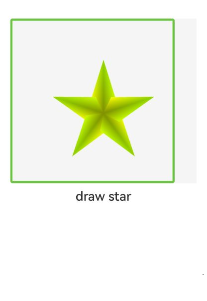

# 通过XComponent接入无障碍

通过XComponent接入的三方平台，NDK提供了对接无障碍的接口函数，实现三方平台的组件在ArkUI中的无障碍能力。

首先，需要使用XComponent的[OH_NativeXComponent_GetNativeAccessibilityProvider](../reference/apis-arkui/_o_h___native_x_component.md#oh_nativexcomponent_getnativeaccessibilityprovider)获得无障碍接入provider。然后，通过[OH_ArkUI_AccessibilityProviderRegisterCallback](../reference/apis-arkui/arkui_native_interface_accessibility.md#oh_arkui_accessibilityproviderregistercallback)注册接入无障碍所需的回调函数[ArkUI_AccessibilityProviderCallbacks](../reference/apis-arkui/arkui_native_interface_accessibility.md#arkui_accessibilityprovidercallbacks)，三方应用需要按照接口要求实现回调函数供无障碍系统调用。

三方应用需要按照要求适配无障碍系统发出的操作[Action](../reference/apis-arkui/arkui_native_interface_accessibility.md#arkui_accessibility_actiontype)，以及针对组件交互行为发送无障碍事件[Event](../reference/apis-arkui/arkui_native_interface_accessibility.md#arkui_accessibilityeventtype)到无障碍子系统，实现无障碍辅助应用的交互体验。

> **说明：**
>
> - 实现[OH_ArkUI_AccessibilityProviderRegisterCallback](../reference/apis-arkui/arkui_native_interface_accessibility.md#oh_arkui_accessibilityproviderregistercallback)回调查询接口时，查询到的每个无障碍节点信息通过[OH_ArkUI_AddAndGetAccessibilityElementInfo](../reference/apis-arkui/arkui_native_interface_accessibility.md#oh_arkui_addandgetaccessibilityelementinfo)创建分配element内存，并将其加入到指定的elementList中。
> - 使用[OH_ArkUI_SendAccessibilityAsyncEvent](../reference/apis-arkui/arkui_native_interface_accessibility.md#oh_arkui_sendaccessibilityasyncevent)发送事件时，需要使用[OH_ArkUI_CreateAccessibilityEventInfo](../reference/apis-arkui/arkui_native_interface_accessibility.md#oh_arkui_createaccessibilityeventinfo)创建[ArkUI_AccessibilityEventInfo](../reference/apis-arkui/arkui_native_interface_accessibility.md#arkui_accessibilityeventinfo)，使用[OH_ArkUI_CreateAccessibilityElementInfo](../reference/apis-arkui/arkui_native_interface_accessibility.md#oh_arkui_createaccessibilityelementinfo)创建[ArkUI_AccessibilityElementInfo](../reference/apis-arkui/arkui_native_interface_accessibility.md#arkui_accessibilityelementinfo)，使用结束后，需要调用[OH_ArkUI_DestoryAccessibilityEventInfo](../reference/apis-arkui/arkui_native_interface_accessibility.md#oh_arkui_destoryaccessibilityeventinfo)以及[OH_ArkUI_DestoryAccessibilityElementInfo](../reference/apis-arkui/arkui_native_interface_accessibility.md#oh_arkui_destoryaccessibilityelementinfo)销毁函数释放内存。
> - 回调函数打印日志时，携带输入的requestId，用于关联一次交互过程相关的日志，便于索引查询整个流程，协助问题定位。

## 对接无障碍

以下示例提供了对接无障碍能力的实现方法。对接完成后，在开启无障碍功能时，可使XComponent中的三方绘制组件接入，实现无障碍交互。

1.按照 [自定义渲染（XComponent）](napi-xcomponent-guidelines.md)创建前置工程。

2.根据接口定义实现回调函数。

```c
int32_t FindAccessibilityNodeInfosById(int64_t elementId, ArkUI_AccessibilitySearchMode mode, int32_t requestId, ArkUI_AccessibilityElementInfoList* elementList)
{
    // 根据mode搜集查询element信息列表
	if (elementList == nullptr) {
        return OH_NATIVEXCOMPONENT_RESULT_FAILED;
    }
	
    // 调用三方平台的接口搜索查询获得mode符合条件的节点
    //...
    // nodes为查询节点结果
    int size = sizeof(nodes) / sizeof(nodes[0]);
    for (int i = 0; i < size; i++) {
        // 获取element结构
        element = OH_ArkUI_AddAndGetAccessibilityElementInfo(elementList);
        // 设置element成员内容
        OH_ArkUI_AccessibilityElementInfoSetElementId(element, nodes[i].id);
        OH_ArkUI_AccessibilityElementInfoSetComponentType(element, nodes[i].type);
        // ...
    }
	// ...
}
```


```c
int32_t FindNextFocusAccessibilityNode(int64_t elementId, ArkUI_AccessibilityFocusType focusType, int32_t requestId, ArkUI_AccessibilityElementInfo* elementinfo)
{
    // 根据mode搜集查询element信息列表，参考接口说明实现
	if (elementinfo == nullptr) {
        return OH_NATIVEXCOMPONENT_RESULT_FAILED;
    }
	
    // 调用三方平台自身的接口搜索查询获得符合条件的节点
    //...
    // node为查询节点结果
    // 设置element成员内容
    OH_ArkUI_AccessibilityElementInfoSetElementId(element, nodes[i].id);
    OH_ArkUI_AccessibilityElementInfoSetComponentType(element, nodes[i].type);
    // ...
}
```


```c
int32_t FindAccessibilityNodeInfosByText(int64_t elementId, const char *text, int32_t requestId, ArkUI_AccessibilityElementInfoList* elementList)
{
    if (elementList == nullptr) {
        return OH_NATIVEXCOMPONENT_RESULT_FAILED;
    }
    
    ArkUI_AccessibilityElementInfo *elementInfo = OH_ArkUI_AddAndGetAccessibilityElementInfo(elementList);
    
    // 需要三方平台自身设置elementInfo组件属性
    
    if (elementInfo == nullptr) {
        return OH_NATIVEXCOMPONENT_RESULT_FAILED;
    }
    return OH_NATIVEXCOMPONENT_RESULT_SUCCESS;
}
```


```c
int32_t FindFocusedAccessibilityNode(int64_t elementId, ArkUI_AccessibilityFocusType focusType, int32_t requestId, ArkUI_AccessibilityElementInfo *elementInfo)
{   
    if (elementInfo == nullptr) {
        return OH_NATIVEXCOMPONENT_RESULT_FAILED;
    }
    
    // 需要三方平台自身设置elementInfo组件属性
    
    return OH_NATIVEXCOMPONENT_RESULT_SUCCESS;
}
```


```C
int32_t ExecuteAccessibilityAction(int64_t elementId, ArkUI_Accessibility_ActionType action, ArkUI_AccessibilityActionArguments *actionArguments, int32_t requestId)
{
    // ...
    // 获取action argument内容，结合action判断当前需要进行的操作处理
    char* actionArgumentValue;
    OH_ArkUI_FindAccessibilityActionArgumentByKey(actionArguments, key.c_str(), &actionArgumentValue);
    
    // 针对指定组件节点进行操作
    ret = doAction(elementId, action, actionArgumentValue);
    if (ret != 0) {
        return;
    }
    // 判断当前处理操作类型，返回对应的event结果。每个不同的操作有对应不同的event。参考：ArkUI_AccessibilityEventType定义
    // ...
    // 明确当前上报事件的组件节点为node
    // 1.调用OH_ArkUI_CreateAccessibilityEventInfo创建ArkUI_AccessibilityEventInfo
    ArkUI_AccessibilityEventInfo *eventInfo = OH_ArkUI_CreateAccessibilityEventInfo();
    if (eventInfo == nullptr) {
        OH_LOG_Print(LOG_APP, LOG_ERROR, LOG_PRINT_DOMAIN, LOG_PRINT_TEXT, "[requestId: %{public}d]DispatchTouchEventCB: Unable to create accessibility eventInfo", requestId);
        return;
    }
    // 2.调用OH_ArkUI_CreateAccessibilityElementInfo创建ArkUI_AccessibilityElementInfo
    ArkUI_AccessibilityElementInfo *elementInfo = OH_ArkUI_CreateAccessibilityElementInfo();
    if (elementInfo == nullptr) {
        OH_LOG_Print(LOG_APP, LOG_ERROR, LOG_PRINT_DOMAIN, LOG_PRINT_TEXT, "[requestId: %{public}d]DispatchTouchEventCB: Unable to create accessibility elementInfo", requestId);
        return;
    }
    // 3.填写element内容
    // 设置element成员内容
    OH_ArkUI_AccessibilityElementInfoSetElementId(element, nodes[i].id);
    OH_ArkUI_AccessibilityElementInfoSetComponentType(element, nodes[i].type);
 
    OH_LOG_Print(LOG_APP, LOG_INFO, LOG_PRINT_DOMAIN, LOG_PRINT_TEXT, "[requestId: %{public}d]DispatchTouchEventCB: send accessibility event", requestId);
    // 4.eventType根据当前Action设置
    // ...
    SendAccessibilityAsyncEvent(eventInfo, elementInfo, eventType);
    // 5.销毁eventInfo，elementInfo内存
    OH_ArkUI_DestoryAccessibilityElementInfo(elementInfo);
    OH_ArkUI_DestoryAccessibilityEventInfo(eventInfo);
    // ...
}
void FillEvent(ArkUI_AccessibilityEventInfo *eventInfo, ArkUI_AccessibilityElementInfo *elementInfo, ArkUI_AccessibilityEventType eventType) 
{
    if (eventInfo == nullptr) {
        OH_LOG_Print(LOG_APP, LOG_ERROR, LOG_PRINT_TEXT, "eventInfo is null");
        return;
    }
    if (elementInfo == nullptr) {
        OH_LOG_Print(LOG_APP, LOG_ERROR, LOG_PRINT_TEXT, "elementInfo is null");
        return;
    }
    OH_ArkUI_AccessibilityEventSetEventType(eventInfo, eventType);
    
    OH_ArkUI_AccessibilityEventSetElementInfo(eventInfo, elementInfo);
    
}
void SendAccessibilityAsyncEvent(ArkUI_AccessibilityEventInfo *eventInfo, ArkUI_AccessibilityElementInfo *elementInfo, ArkUI_AccessibilityEventType eventType)
{
    // 1.填写event内容
    FillEvent(eventInfo, elementInfo, ArkUI_AccessibilityEventType::ARKUI_ACCESSIBILITY_NATIVE_EVENT_TYPE_PAGE_STATE_UPDATE);
    // 2.callback
    auto callback = [](int32_t errorCode){
         OH_LOG_Print(LOG_APP, LOG_INFO, LOG_PRINT_DOMAIN, LOG_PRINT_TEXT, "result: %{public}d", errorCode);
    }
    // 3. 调用接口发送事件给OH侧
    OH_ArkUI_SendAccessibilityAsyncEvent(provider_, eventInfo, callback)
}
```


```C
int32_t ClearFocusedFocusAccessibilityNode()
{
	// 找到当前获焦的组件，并清除焦点状态。
    // ...
    // 无障碍焦点状态
    node.accessibilityFocused = false;
    // 组件焦点状态
    node.foucsed = false;
    // ...
}
```


```C
int32_t GetAccessibilityNodeCursorPosition(int64_t elementId, int32_t requestId, int32_t* index)
{	
	// 获取文本组件光标位置，并返回
    // 查找对应组件节点
    // ...
    *index = node.cursorPosition;
    // ...
}
```


3.使用XComponent句柄注册无障碍回调函数。

```C
void PluginRender::RegisterAccessibility(OH_NativeXComponent* nativeXComponent)
{
	//...
    //1.获取provider实例，定义”provider_“提供给函数返回
    int32_t ret = OH_NativeXComponent_GetNativeAccessibilityProvider(nativeXComponent, &provider_);
    if (provider_ == nullptr) {
        return;
    }
    //2.注册回调函数，如下相关回调注册函数FindAccessibilityNodeInfosById等，需三方实现函数注册。
    accessibilityProviderCallbacks_ = new ArkUI_AccessibilityProviderCallbacks();
    accessibilityProviderCallbacks_->findAccessibilityNodeInfosById = FindAccessibilityNodeInfosById;
    accessibilityProviderCallbacks_->findAccessibilityNodeInfosByText = FindAccessibilityNodeInfosByText;
    accessibilityProviderCallbacks_->findFocusedAccessibilityNode = FindFocusedAccessibilityNode;
    accessibilityProviderCallbacks_->findNextFocusAccessibilityNode = FindNextFocusAccessibilityNode;
    accessibilityProviderCallbacks_->executeAccessibilityAction = ExecuteAccessibilityAction;
    accessibilityProviderCallbacks_->clearFocusedFocusAccessibilityNode = ClearFocusedFocusAccessibilityNode;
    accessibilityProviderCallbacks_->getAccessibilityNodeCursorPosition = GetAccessibilityNodeCursorPosition;
    ret = OH_ArkUI_AccessibilityProviderRegisterCallback(provider_, accessibilityProviderCallbacks_);
    if (ret != 0) {
        return;
    }
}
```


4.组件发生变化时，主动发送事件。参考事件定义[ArkUI_AccessibilityEventType](../reference/apis-arkui/arkui_native_interface_accessibility.md#arkui_accessibilityeventtype)说明。

如果因为Touch事件导致页面变化，需要发送页面变化事件ARKUI_ACCESSIBILITY_NATIVE_EVENT_TYPE_PAGE_STATE_UPDATE以及获焦组件位置变化事件ARKUI_ACCESSIBILITY_NATIVE_EVENT_TYPE_FOCUS_NODE_UPDATE给无障碍子系统。

```C
// 定义一个函数DispatchTouchEventCB()，响应触摸事件时触发该回调
void DispatchTouchEventCB(OH_NativeXComponent *component, void *window)
{
	// ...
	// 获取XComponent的id
	char idStr[OH_XCOMPONENT_ID_LEN_MAX + 1] = { '\0' };
	uint64_t idSize = OH_XCOMPONENT_ID_LEN_MAX + 1;
	if (OH_NativeXComponent_GetXComponentId(component, idStr, &idSize) != OH_NATIVEXCOMPONENT_RESULT_SUCCESS) {
		OH_LOG_Print(LOG_APP, LOG_ERROR, LOG_PRINT_DOMAIN, "Callback",
			"DispatchTouchEventCB: Unable to get XComponent id");
		return;
	}

    // 判断当前是否已注册无障碍provider
    if (provider_ != nullptr) {
        
        // 需判断当前Touch事件是否引起了页面变化和当前获焦组件的位置变化。若引起变化，则需要上报无障碍事件，通知无障碍服务以及辅助应用。
        // ...
        // 明确当前上报事件的组件节点为node
        // 1.调用OH_ArkUI_CreateAccessibilityEventInfo创建ArkUI_AccessibilityEventInfo
        ArkUI_AccessibilityEventInfo *eventInfo = OH_ArkUI_CreateAccessibilityEventInfo();
        if (eventInfo == nullptr) {
            OH_LOG_Print(LOG_APP, LOG_ERROR, LOG_PRINT_DOMAIN, "Callback",
			"DispatchTouchEventCB: Unable to create accessibility eventInfo");
            return;
        }
        // 2.调用OH_ArkUI_CreateAccessibilityElementInfo创建ArkUI_AccessibilityElementInfo
        ArkUI_AccessibilityElementInfo *elementInfo = OH_ArkUI_CreateAccessibilityElementInfo();
        if (elementInfo == nullptr) {
            OH_LOG_Print(LOG_APP, LOG_ERROR, LOG_PRINT_DOMAIN, "Callback",
			"DispatchTouchEventCB: Unable to create accessibility elementInfo");
            return;
        }
        // 3.填写element内容
        // 设置element成员内容
    	OH_ArkUI_AccessibilityElementInfoSetElementId(element, nodes[i].id);
    	OH_ArkUI_AccessibilityElementInfoSetComponentType(element, nodes[i].type);
        // ...
        
        OH_LOG_Print(LOG_APP, LOG_INFO, LOG_PRINT_DOMAIN, "Callback",
			"DispatchTouchEventCB: send accessibility event");
        // 4.发送页面更新事件
        SendAccessibilityAsyncEvent(eventInfo, elementInfo, ArkUI_AccessibilityEventType::ARKUI_ACCESSIBILITY_NATIVE_EVENT_TYPE_PAGE_STATE_UPDATE);
        // 5.如当前处理引起了获焦组件的位置变化，发送获焦位置变化事件
        SendAccessibilityAsyncEvent(eventInfo, elementInfo, ArkUI_AccessibilityEventType::ARKUI_ACCESSIBILITY_NATIVE_EVENT_TYPE_FOCUS_NODE_UPDATE);
        // 6.销毁eventInfo，elementInfo内存
        OH_ArkUI_DestoryAccessibilityElementInfo(elementInfo);
        OH_ArkUI_DestoryAccessibilityEventInfo(eventInfo);
    }
    
	std::string id(idStr);
	PluginRender *render = PluginRender::GetInstance(id);
	if (render != nullptr) {
		// 封装OnTouchEvent方法
		render->OnTouchEvent(component, window);
	}
}

void FillEvent(ArkUI_AccessibilityEventInfo *eventInfo, ArkUI_AccessibilityElementInfo *elementInfo, ArkUI_AccessibilityEventType eventType) 
{
    if (eventInfo == nullptr) {
        OH_LOG_Print(LOG_APP, LOG_ERROR, LOG_PRINT_TEXT, "eventInfo is null");
        return;
    }
    if (elementInfo == nullptr) {
        OH_LOG_Print(LOG_APP, LOG_ERROR, LOG_PRINT_TEXT, "elementInfo is null");
        return;
    }
    // 1.设置事件类型
    OH_ArkUI_AccessibilityEventSetEventType(eventInfo, eventType);
    // 2.设置发送事件的节点组件信息
    OH_ArkUI_AccessibilityEventSetElementInfo(eventInfo, elementInfo);
    
}
void SendAccessibilityAsyncEvent(ArkUI_AccessibilityEventInfo *eventInfo, ArkUI_AccessibilityElementInfo *elementInfo, ArkUI_AccessibilityEventType eventType)
{
    // 1.填写event内容
    FillEvent(eventInfo, elementInfo, ArkUI_AccessibilityEventType::ARKUI_ACCESSIBILITY_NATIVE_EVENT_TYPE_PAGE_STATE_UPDATE);
    // 2.设置创建callback函数，获取发送事件结果
    auto callback = [](int32_t errorCode){
         OH_LOG_Print(LOG_APP, LOG_INFO, LOG_PRINT_DOMAIN, LOG_PRINT_TEXT, "result: %{public}d", errorCode);
    }
    // 3. 调用接口发送事件给无障碍子系统
    OH_ArkUI_SendAccessibilityAsyncEvent(provider_, eventInfo, callback)
}
```

5.对接成功后，可开启无障碍功能。


