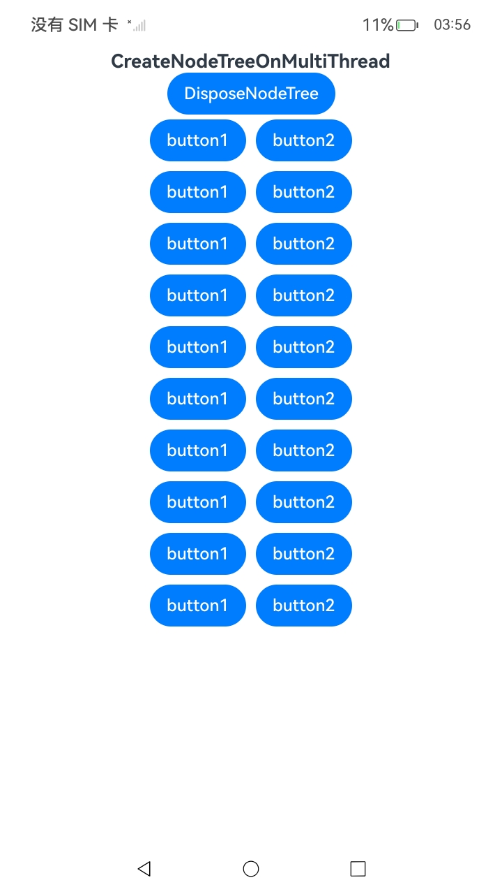

# NDK支持多线程创建组件

## 概述

在API version 20之前，NDK组件的创建与初始化必须在应用程序的主线程中执行。这导致开发者在集成时，需要将任务切换回主线程，不仅增加了调用代码的复杂度，也限制了组件构造过程的灵活性与性能。

随着用户界面的日益复杂，页面中可能同时存在大量动态生成的UI组件，这类任务堆积在单一主线程中执行，往往导致启动缓慢、动画掉帧及界面卡顿，直接影响用户体验。

针对这些问题，在API version 20中，ArkUI引入了完整的多线程支持能力，为开发者带来了以下提升：

- **简化调用流程：** 开发者无需手动切换线程或通过任务队列将组件创建任务转回主线程，可在自定义的框架线程中直接调用组件创建接口，减少上下文切换与潜在竞态问题，简化框架与应用间的交互逻辑。

- **性能与体验显著优化：** 多线程能力支持组件创建与初始化任务并行执行，充分利用设备多核CPU，减少页面启动与界面构造阶段的总体耗时。主线程专注于动画渲染与用户输入，确保界面流畅与交互及时。

-  **为后续功能扩展提供更好的灵活性：** 多线程支持不仅解决当前性能瓶颈，还为未来引入复杂、高负载的界面组件提供扩展空间，帮助开发者在设计时拥有更大灵活度与掌控力，为持续提升用户体验创造条件。

通过此次优化，开发者可专注于自身逻辑实现，无需关注并发与线程切换等底层细节。在更大任务量与复杂场景下，开发者将获得更可预测、高性能的界面创建体验。

## 使用方式

- 在获取Node类型接口集时，调用`OH_ArkUI_GetModuleInterface`入参传入`ARKUI_MULTI_THREAD_NATIVE_NODE`获取支持多线程的NDK接口集合。例如：

  ```cpp
  ArkUI_NativeNodeAPI_1 *multiThreadNodeAPI = nullptr;
  OH_ArkUI_GetModuleInterface(ARKUI_MULTI_THREAD_NATIVE_NODE, ArkUI_NativeNodeAPI_1, multiThreadNodeAPI);
  ```

  多线程接口详情请参考[多线程NDK接口集规格](#多线程NDK接口集规格)。

- 对于可以在非UI线程执行的任务（如节点创建、属性设置等），可以使用[OH_ArkUI_PostAsyncUITask](../reference/apis-arkui/_ark_u_i___native_module.md#oh_arkui_postasyncuitask)接口将任务调度到系统线程池中执行。

- 当开发者需要在自己维护的非UI线程中创建UI组件时，使用[OH_ArkUI_PostUITask](../reference/apis-arkui/_ark_u_i___native_module.md#oh_arkui_postuitask)接口将组件挂载到UI树的任务提交到UI线程执行。
  
- 另提供[OH_ArkUI_PostUITaskAndWait](../reference/apis-arkui/_ark_u_i___native_module.md#oh_arkui_postuitaskandwait)接口将组件挂载到UI树的任务提交到UI线程执行后，此时调用线程阻塞等待UI线程任务结束。此接口可能导致接口调用线程长时间阻塞，不推荐频繁使用。

## 调用规范与线程安全

- 多线程接口规范请参考[多线程NDK接口集规格](#多线程NDK接口集规格)。调用接口时必须检查返回值，如果在非UI线程中调用不支持的接口，将返回错误码。

- 虽然ArkUI提供了线程安全的组件创建与属性设置接口，但是，单个组件内部仍非线程安全。请避免在多个线程中同时操作同一组件或同一组件树，否则可能产生不可预测的结果。

- 多线程接口中，组件有以下两种状态：

  - **Free（游离状态）：** 组件未挂载到主树，不参与UI流水线，属性可安全更新。
  - **Attached（已挂载状态）：** 组件已挂载，交由UI流水线管理，属性更新必须在UI线程中调用，否则将返回错误码。

## 错误与异常

- 在非UI线程中调用不支持多线程的接口将返回错误码。
- 挂载到UI主树后，非UI线程调用组件接口将返回错误码。
- 在Native节点下树前，必须先卸载嵌套的ArkTs节点，以避免在非UI线程中遍历节点树时访问ArkTS节点导致崩溃。

框架将打印如下日志提示：

```
CheckIsThreadSafeNodeTree failed. thread safe node tree contains unsafe node: ${nodeid}
```

## 多线程接口适配说明

1. 将原有接口集合Tag从`ARKUI_NATIVE_NODE`修改为`ARKUI_MULTI_THREAD_NATIVE_NODE`即可获得多线程能力，接口与参数保持一致。

   ```c
   ArkUI_NativeNodeAPI_1 *nodeAPI = nullptr;
   OH_ArkUI_GetModuleInterface(ARKUI_MULTI_THREAD_NATIVE_NODE, ArkUI_NativeNodeAPI_1, nodeAPI);
   ```

2. 建议将原先在UI线程中执行的组件创建任务拆分成更细粒度任务，分派给不同工作线程执行，以减少主线程阻塞，提高页面启动与更新流畅度。

3. 预先在后台线程中创建常用组件树，为性能敏感场景提供更好的用户体验。

## 多线程NDK接口集规格

| 接口名 | 描述 | 非UI线程调用 | 多线程规格 |
| -------- | ------- | ------- | ------- |  
| [ArkUI_NodeHandle](../reference/apis-arkui/_ark_u_i___native_module.md#arkui_nodehandle)(\* [createNode](../reference/apis-arkui/_ark_u_i___native_node_a_p_i__1.md#createnode) )([ArkUI_NodeType](../reference/apis-arkui/_ark_u_i___native_module.md#arkui_nodetype) type) | 基于[ArkUI_NodeType](../reference/apis-arkui/_ark_u_i___native_module.md#arkui_nodetype)生成对应的节点并返回节点对象指针。  | 支持 | 支持在任意线程调用。 |
| void(\* [disposeNode](../reference/apis-arkui/_ark_u_i___native_node_a_p_i__1.md#disposenode) )([ArkUI_NodeHandle](../reference/apis-arkui/_ark_u_i___native_module.md#arkui_nodehandle) node) | 销毁节点指针指向的节点对象。  | 支持 | 在非UI线程调用函数操作已挂载到UI树上的节点时，接口调用无效。 |
| int32_t(\* [setAttribute](../reference/apis-arkui/_ark_u_i___native_node_a_p_i__1.md#setattribute) )([ArkUI_NodeHandle](../reference/apis-arkui/_ark_u_i___native_module.md#arkui_nodehandle) node, [ArkUI_NodeAttributeType](../reference/apis-arkui/_ark_u_i___native_module.md#arkui_nodeattributetype) attribute, const [ArkUI_AttributeItem](_ark_u_i___attribute_item.md) \*item) | 设置node节点的属性。 | 支持 | 在非UI线程调用函数操作已挂载到UI树上的节点时，接口返回错误码。 |
| const [ArkUI_AttributeItem](_ark_u_i___attribute_item.md) \*(\* [getAttribute](../reference/apis-arkui/_ark_u_i___native_node_a_p_i__1.md#getattribute) )([ArkUI_NodeHandle](../reference/apis-arkui/_ark_u_i___native_module.md#arkui_nodehandle) node, [ArkUI_NodeAttributeType](../reference/apis-arkui/_ark_u_i___native_module.md#arkui_nodeattributetype) attribute) | 获取node节点的属性。 | 支持 | 在非UI线程调用函数操作已挂载到UI树上的节点时，接口返回空指针。 |
| int32_t(\* [resetAttribute](../reference/apis-arkui/_ark_u_i___native_node_a_p_i__1.md#resetattribute) )([ArkUI_NodeHandle](../reference/apis-arkui/_ark_u_i___native_module.md#arkui_nodehandle) node, [ArkUI_NodeAttributeType](../reference/apis-arkui/_ark_u_i___native_module.md#arkui_nodeattributetype) attribute) | 重置node节点的属性为默认值。  | 支持 | 在非UI线程调用函数操作已挂载到UI树上的节点时，接口返回错误码。 |
| int32_t(\* [setLengthMetricUnit](../reference/apis-arkui/_ark_u_i___native_node_a_p_i__1.md#setlengthmetricunit) )([ArkUI_NodeHandle](../reference/apis-arkui/_ark_u_i___native_module.md#arkui_nodehandle) node, [ArkUI_LengthMetricUnit](../reference/apis-arkui/_ark_u_i___native_module.md#arkui_lengthmetricunit) unit) | 指定node节点的单位。 | 支持 | 在非UI线程调用函数操作已挂载到UI树上的节点时，接口返回错误码。 | | int32_t(\* [registerNodeEvent](../reference/apis-arkui/_ark_u_i___native_node_a_p_i__1.md#registernodeevent) )([ArkUI_NodeHandle](../reference/apis-arkui/_ark_u_i___native_module.md#arkui_nodehandle) node, [ArkUI_NodeEventType](../reference/apis-arkui/_ark_u_i___native_module.md#arkui_nodeeventtype) eventType, int32_t targetId, void \*userData) | 向node节点注册事件。 | 支持 | 在非UI线程调用函数操作已挂载到UI树上的节点时，接口返回错误码。 |
| void(\* [unregisterNodeEvent](../reference/apis-arkui/_ark_u_i___native_node_a_p_i__1.md#unregisternodeevent) )([ArkUI_NodeHandle](../reference/apis-arkui/_ark_u_i___native_module.md#arkui_nodehandle) node, [ArkUI_NodeEventType](../reference/apis-arkui/_ark_u_i___native_module.md#arkui_nodeeventtype) eventType) | node节点解注册事件。 | 支持 | 在非UI线程调用函数操作已挂载到UI树上的节点时，接口调用无效。 |
| int32_t(\* [registerNodeCustomEvent](../reference/apis-arkui/_ark_u_i___native_node_a_p_i__1.md#registernodecustomevent) )([ArkUI_NodeHandle](../reference/apis-arkui/_ark_u_i___native_module.md#arkui_nodehandle) node, [ArkUI_NodeCustomEventType](../reference/apis-arkui/_ark_u_i___native_module.md#arkui_nodecustomeventtype) eventType, int32_t targetId, void \*userData) | 向node节点注册自定义事件。 | 支持 | 在非UI线程调用函数操作已挂载到UI树上的节点时，接口返回错误码。 |
| void(\* [unregisterNodeCustomEvent](../reference/apis-arkui/_ark_u_i___native_node_a_p_i__1.md#unregisternodecustomevent) )([ArkUI_NodeHandle](../reference/apis-arkui/_ark_u_i___native_module.md#arkui_nodehandle) node, [ArkUI_NodeCustomEventType](../reference/apis-arkui/_ark_u_i___native_module.md#arkui_nodecustomeventtype) eventType) | node节点解注册自定义事件。 | 支持 | 在非UI线程调用函数操作已挂载到UI树上的节点时，接口调用不生效。 |
| int32_t(\* [addNodeEventReceiver](../reference/apis-arkui/_ark_u_i___native_node_a_p_i__1.md#addnodeeventreceiver) )([ArkUI_NodeHandle](../reference/apis-arkui/_ark_u_i___native_module.md#arkui_nodehandle) node, void(\*eventReceiver)([ArkUI_NodeEvent](../reference/apis-arkui/_ark_u_i___native_module.md#arkui_nodeevent-12) \*event)) | 向node节点注册事件回调函数，用于接收该组件产生的组件事件。 | 支持 | 在非UI线程调用函数操作已挂载到UI树上的节点时，接口返回错误码。 |
| int32_t(\* [removeNodeEventReceiver](../reference/apis-arkui/_ark_u_i___native_node_a_p_i__1.md#removenodeeventreceiver) )([ArkUI_NodeHandle](../reference/apis-arkui/_ark_u_i___native_module.md#arkui_nodehandle) node, void(\*eventReceiver)([ArkUI_NodeEvent](../reference/apis-arkui/_ark_u_i___native_module.md#arkui_nodeevent-12) \*event)) | 删除node节点上注册的事件回调函数。 | 支持 | 在非UI线程调用函数操作已挂载到UI树上的节点时，接口返回错误码。 |
| int32_t(\* [addNodeCustomEventReceiver](../reference/apis-arkui/_ark_u_i___native_node_a_p_i__1.md#addnodecustomeventreceiver) )([ArkUI_NodeHandle](../reference/apis-arkui/_ark_u_i___native_module.md#arkui_nodehandle) node, void(\*eventReceiver)([ArkUI_NodeCustomEvent](../reference/apis-arkui/_ark_u_i___native_module.md#arkui_nodecustomevent) \*event)) | 向node节点注册自定义事件回调函数，用于接收该组件产生的自定义事件（如布局事件，绘制事件）。 | 支持 | 在非UI线程调用函数操作已挂载到UI树上的节点时，接口返回错误码。 |
| int32_t(\* [removeNodeCustomEventReceiver](../reference/apis-arkui/_ark_u_i___native_node_a_p_i__1.md#removenodecustomeventreceiver) )([ArkUI_NodeHandle](../reference/apis-arkui/_ark_u_i___native_module.md#arkui_nodehandle) node, void(\*eventReceiver)([ArkUI_NodeCustomEvent](../reference/apis-arkui/_ark_u_i___native_module.md#arkui_nodecustomevent) \*event)) | 删除node节点上注册的自定义事件回调函数。 | 支持 | 在非UI线程调用函数操作已挂载到UI树上的节点时，接口返回错误码。 |
| void(\* [registerNodeEventReceiver](../reference/apis-arkui/_ark_u_i___native_node_a_p_i__1.md#registernodeeventreceiver) )(void(\*eventReceiver)([ArkUI_NodeEvent](../reference/apis-arkui/_ark_u_i___native_module.md#arkui_nodeevent-12) \*event)) | 注册节点事件回调统一入口函数。 | 不支持 | 只支持UI线程调用，否则接口调用不生效。 |
|  void(\* [unregisterNodeEventReceiver](../reference/apis-arkui/_ark_u_i___native_node_a_p_i__1.md#unregisternodeeventreceiver) )() | 解注册节点事件回调统一入口函数。 | 不支持 | 只支持UI线程调用，否则接口调用不生效。 |
| void(\* [registerNodeCustomEventReceiver](../reference/apis-arkui/_ark_u_i___native_node_a_p_i__1.md#registernodecustomeventreceiver) )(void(\*eventReceiver)([ArkUI_NodeCustomEvent](../reference/apis-arkui/_ark_u_i___native_module.md#arkui_nodecustomevent) \*event)) |  注册节点自定义事件回调统一入口函数。 | 不支持 | 只支持UI线程调用，否则接口调用不生效。 |
|  void(\* [unregisterNodeCustomEventReceiver](../reference/apis-arkui/_ark_u_i___native_node_a_p_i__1.md#unregisternodecustomeventreceiver) )() |  解注册节点自定义事件回调统一入口函数。 | 不支持 | 只支持UI线程调用，否则接口调用不生效。 |
| int32_t(\* [addChild](../reference/apis-arkui/_ark_u_i___native_node_a_p_i__1.md#addchild) )([ArkUI_NodeHandle](../reference/apis-arkui/_ark_u_i___native_module.md#arkui_nodehandle) parent, [ArkUI_NodeHandle](../reference/apis-arkui/_ark_u_i___native_module.md#arkui_nodehandle) child) | 将child节点挂载到parent节点的子节点列表中。 | 支持 | 在非UI线程调用函数操作已挂载到UI树上的节点时，接口返回错误码。 |
| int32_t(\* [removeChild](../reference/apis-arkui/_ark_u_i___native_node_a_p_i__1.md#removechild) )([ArkUI_NodeHandle](../reference/apis-arkui/_ark_u_i___native_module.md#arkui_nodehandle) parent, [ArkUI_NodeHandle](../reference/apis-arkui/_ark_u_i___native_module.md#arkui_nodehandle) child) | 将child节点从parent节点的子节点列表中移除。 | 支持 | 在非UI线程调用函数操作已挂载到UI树上的节点时，接口返回错误码。 |
| int32_t(\* [insertChildAfter](../reference/apis-arkui/_ark_u_i___native_node_a_p_i__1.md#insertchildafter) )([ArkUI_NodeHandle](../reference/apis-arkui/_ark_u_i___native_module.md#arkui_nodehandle) parent, [ArkUI_NodeHandle](../reference/apis-arkui/_ark_u_i___native_module.md#arkui_nodehandle) child, [ArkUI_NodeHandle](../reference/apis-arkui/_ark_u_i___native_module.md#arkui_nodehandle) sibling) | 将child节点挂载到parent节点的子节点列表中，挂载位置在sibling节点之后。 | 支持 | 在非UI线程调用函数操作已挂载到UI树上的节点时，接口返回错误码。 |
| int32_t(\* [insertChildBefore](../reference/apis-arkui/_ark_u_i___native_node_a_p_i__1.md#insertchildbefore) )([ArkUI_NodeHandle](../reference/apis-arkui/_ark_u_i___native_module.md#arkui_nodehandle) parent, [ArkUI_NodeHandle](../reference/apis-arkui/_ark_u_i___native_module.md#arkui_nodehandle) child, [ArkUI_NodeHandle](../reference/apis-arkui/_ark_u_i___native_module.md#arkui_nodehandle) sibling) | 将child节点挂载到parent节点的子节点列表中，挂载位置在sibling节点之前。 | 支持 | 在非UI线程调用函数操作已挂载到UI树上的节点时，接口返回错误码。 |
| int32_t(\* [insertChildAt](../reference/apis-arkui/_ark_u_i___native_node_a_p_i__1.md#insertchildat) )([ArkUI_NodeHandle](../reference/apis-arkui/_ark_u_i___native_module.md#arkui_nodehandle) parent, [ArkUI_NodeHandle](../reference/apis-arkui/_ark_u_i___native_module.md#arkui_nodehandle) child, int32_t position) | 将child节点挂载到parent节点的子节点列表中，挂载位置由position指定。 | 支持 | 在非UI线程调用函数操作已挂载到UI树上的节点时，接口返回错误码。 |
| [ArkUI_NodeHandle](../reference/apis-arkui/_ark_u_i___native_module.md#arkui_nodehandle)(\* [getParent](../reference/apis-arkui/_ark_u_i___native_node_a_p_i__1.md#getparent) )([ArkUI_NodeHandle](../reference/apis-arkui/_ark_u_i___native_module.md#arkui_nodehandle) node) | 获取node节点的父节点。 | 支持 | 在非UI线程调用函数操作已挂载到UI树上的节点时，接口返回错误码。 |
| int32_t(\* [removeAllChildren](../reference/apis-arkui/_ark_u_i___native_node_a_p_i__1.md#removeallchildren) )([ArkUI_NodeHandle](../reference/apis-arkui/_ark_u_i___native_module.md#arkui_nodehandle) parent) | 移除node节点的所有子节点。 | 支持 | 在非UI线程调用函数操作已挂载到UI树上的节点时，接口返回错误码。 |
| uint32_t(\* [getTotalChildCount](../reference/apis-arkui/_ark_u_i___native_node_a_p_i__1.md#gettotalchildcount) )([ArkUI_NodeHandle](../reference/apis-arkui/_ark_u_i___native_module.md#arkui_nodehandle) node) | 获取node节点的子节点个数。 | 支持 | 在非UI线程调用函数操作已挂载到UI树上的节点时，接口返回0。 |
| [ArkUI_NodeHandle](../reference/apis-arkui/_ark_u_i___native_module.md#arkui_nodehandle)(\* [getChildAt](../reference/apis-arkui/_ark_u_i___native_node_a_p_i__1.md#getchildat) )([ArkUI_NodeHandle](../reference/apis-arkui/_ark_u_i___native_module.md#arkui_nodehandle) node, int32_t position) | 获取node节点的子节点指针，位置由position指定。 | 支持 | 在非UI线程调用函数操作已挂载到UI树上的节点时，接口返回空指针。 |
| [ArkUI_NodeHandle](../reference/apis-arkui/_ark_u_i___native_module.md#arkui_nodehandle)(\* [getFirstChild](../reference/apis-arkui/_ark_u_i___native_node_a_p_i__1.md#getfirstchild) )([ArkUI_NodeHandle](../reference/apis-arkui/_ark_u_i___native_module.md#arkui_nodehandle) node) | 获取node节点的第一个子节点指针。 | 支持 | 在非UI线程调用函数操作已挂载到UI树上的节点时，接口返回空指针。 |
| [ArkUI_NodeHandle](../reference/apis-arkui/_ark_u_i___native_module.md#arkui_nodehandle)(\* [getLastChild](../reference/apis-arkui/_ark_u_i___native_node_a_p_i__1.md#getlastchild) )([ArkUI_NodeHandle](../reference/apis-arkui/_ark_u_i___native_module.md#arkui_nodehandle) node) | 获取node节点的最后一个子节点指针。 | 支持 | 在非UI线程调用函数操作已挂载到UI树上的节点时，接口返回空指针。 |
| [ArkUI_NodeHandle](../reference/apis-arkui/_ark_u_i___native_module.md#arkui_nodehandle)(\* [getPreviousSibling](../reference/apis-arkui/_ark_u_i___native_node_a_p_i__1.md#getprevioussibling) )([ArkUI_NodeHandle](../reference/apis-arkui/_ark_u_i___native_module.md#arkui_nodehandle) node) | 获取node节点的上一个兄弟节点指针。 | 支持 | 在非UI线程调用函数操作已挂载到UI树上的节点时，接口返回空指针。 |
| [ArkUI_NodeHandle](../reference/apis-arkui/_ark_u_i___native_module.md#arkui_nodehandle)(\* [getNextSibling](../reference/apis-arkui/_ark_u_i___native_node_a_p_i__1.md#getnextsibling) )([ArkUI_NodeHandle](../reference/apis-arkui/_ark_u_i___native_module.md#arkui_nodehandle) node) | 获取node节点的下一个兄弟节点指针。 | 支持 | 在非UI线程调用函数操作已挂载到UI树上的节点时，接口返回空指针。 |
| int32_t(\* [setUserData](../reference/apis-arkui/_ark_u_i___native_node_a_p_i__1.md#setuserdata) )([ArkUI_NodeHandle](../reference/apis-arkui/_ark_u_i___native_module.md#arkui_nodehandle) node, void \*userData) | 在node节点上保存自定义数据。 | 支持 | 在非UI线程调用函数操作已挂载到UI树上的节点时，接口返回错误码。 |
| void \*(\* [getUserData](../reference/apis-arkui/_ark_u_i___native_node_a_p_i__1.md#getuserdata) )([ArkUI_NodeHandle](../reference/apis-arkui/_ark_u_i___native_module.md#arkui_nodehandle) node) | 获取node节点上保存的自定义数据。 | 支持 | 在非UI线程调用函数操作已挂载到UI树上的节点时，接口返回空指针。 |
| int32_t(\* [setMeasuredSize](../reference/apis-arkui/_ark_u_i___native_node_a_p_i__1.md#setmeasuredsize) )([ArkUI_NodeHandle](../reference/apis-arkui/_ark_u_i___native_module.md#arkui_nodehandle) node, int32_t width, int32_t height) | 在测算回调函数中设置组件测算完成后的宽和高。 | 不支持 | 只支持UI线程调用，否则接口返回错误码。 |
| int32_t(\* [setLayoutPosition](../reference/apis-arkui/_ark_u_i___native_node_a_p_i__1.md#setlayoutposition) )([ArkUI_NodeHandle](../reference/apis-arkui/_ark_u_i___native_module.md#arkui_nodehandle) node, int32_t positionX, int32_t positionY) | 在布局回调函数中设置组件的位置。 | 不支持 | 只支持UI线程调用，否则接口返回错误码。 |
| [ArkUI_IntSize](_ark_u_i___int_size.md)(\* [getMeasuredSize](../reference/apis-arkui/_ark_u_i___native_node_a_p_i__1.md#getmeasuredsize) )([ArkUI_NodeHandle](../reference/apis-arkui/_ark_u_i___native_module.md#arkui_nodehandle) node) | 获取node节点测算完成后的宽高尺寸。 | 不支持 | 只支持UI线程调用，否则接口返回默认值。 |
| [ArkUI_IntOffset](_ark_u_i___int_offset.md)(\* [getLayoutPosition](../reference/apis-arkui/_ark_u_i___native_node_a_p_i__1.md#getlayoutposition) )([ArkUI_NodeHandle](../reference/apis-arkui/_ark_u_i___native_module.md#arkui_nodehandle) node) | 获取node节点布局完成后的位置。 | 不支持 | 只支持UI线程调用，否则接口返回默认值。 |
| int32_t(\* [measureNode](../reference/apis-arkui/_ark_u_i___native_node_a_p_i__1.md#measurenode) )([ArkUI_NodeHandle](../reference/apis-arkui/_ark_u_i___native_module.md#arkui_nodehandle) node, [ArkUI_LayoutConstraint](../reference/apis-arkui/_ark_u_i___native_module.md#arkui_layoutconstraint) \*Constraint) | 对node节点进行测算，可以通过getMeasuredSize获取测算后的大小。 | 不支持 | 只支持UI线程调用，否则接口返回错误码。 |
| int32_t(\* [layoutNode](../reference/apis-arkui/_ark_u_i___native_node_a_p_i__1.md#layoutnode) )([ArkUI_NodeHandle](../reference/apis-arkui/_ark_u_i___native_module.md#arkui_nodehandle) node, int32_t positionX, int32_t positionY) | 对node节点进行布局并传递该组件相对父组件的期望位置。 | 不支持 | 只支持UI线程调用，否则接口返回错误码。 |
| void(\* [markDirty](../reference/apis-arkui/_ark_u_i___native_node_a_p_i__1.md#markdirty) )([ArkUI_NodeHandle](../reference/apis-arkui/_ark_u_i___native_module.md#arkui_nodehandle) node, [ArkUI_NodeDirtyFlag](../reference/apis-arkui/_ark_u_i___native_module.md#arkui_nodedirtyflag) dirtyFlag) | 强制标记node节点需要重新测算、布局或绘制。 | 不支持 | 只支持UI线程调用，否则接口调用不生效。 |

## 示例代码

为简化编程和工程管理，在开始编写并行化组件创建代码前，请先参考[接入ArkTS页面](ndk-access-the-arkts-page.md)指导文档，在native侧使用面向对象的方式对将ArkUI_NodeHandle封装为ArkUINode对象。

```ts
// index.ets
import { NodeContent } from '@kit.ArkUI';
import entry from 'libentry.so';

@Component
struct CAPIComponent {
  private rootSlot = new NodeContent();

  aboutToAppear(): void {
    // 调用Native接口进行组件创建
    entry.CreateNodeTreeOnMultiThread(this.rootSlot, this.getUIContext());
  }

  aboutToDisappear(): void {
    // 释放已创建的Native组件
    entry.DisposeNodeTreeOnMultiThread(this.rootSlot);
  }

  build() {
    Column() {
      // Native组件挂载点
      ContentSlot(this.rootSlot)
    }
  }
}

@Entry
@Component
struct Index {
  @State isShow: boolean = false;
  @State message: string = "CreateNodeTree";

  build() {
    Flex() {
      Column() {
        Text('CreateNodeTreeOnMultiThread')
          .fontSize(18)
          .fontWeight(FontWeight.Bold)
        Button(this.message)
          .onClick(() => {
            this.isShow = !this.isShow;
            if (this.isShow) {
              this.message = "DisposeNodeTree"
            } else {
              this.message = "CreateNodeTree"
            }
          })
        if (this.isShow) {
          CAPIComponent()
        }
      }.width('100%')
    }.width('100%')
  }
}

```

```cpp
// NativeModule.h
#ifndef MYAPPLICATION_NATIVEMODULE_H
#define MYAPPLICATION_NATIVEMODULE_H

#include <arkui/native_node.h>
#include <arkui/native_interface.h>
#include <cassert>

namespace NativeModule {

class NativeModuleInstance {
public:
    static NativeModuleInstance *GetInstance() {
        static NativeModuleInstance instance;
        return &instance;
    }

    NativeModuleInstance() {
        // 获取多线程NDK接口的函数指针结构体对象，用于后续操作。
        OH_ArkUI_GetModuleInterface(ARKUI_MULTI_THREAD_NATIVE_NODE, ArkUI_NativeNodeAPI_1, arkUINativeNodeApi_);
        assert(arkUINativeNodeApi_);
    }
    // 暴露给其他模块使用。
    ArkUI_NativeNodeAPI_1 *GetNativeNodeAPI() { return arkUINativeNodeApi_; }

private:
    ArkUI_NativeNodeAPI_1 *arkUINativeNodeApi_ = nullptr;
};
} // namespace NativeModule

#endif // MYAPPLICATION_NATIVEMODULE_H
```

```cpp
// CreateNode.h
#ifndef MYAPPLICATION_CREATENODE_H
#define MYAPPLICATION_CREATENODE_H

#include "common/ArkUINode.h"

#include <js_native_api.h>

namespace NativeModule {
class ArkUIButtonNode: public ArkUINode {
public:
    ArkUIButtonNode() :
        ArkUINode(NativeModuleInstance::GetInstance()->GetNativeNodeAPI()->createNode(ARKUI_NODE_BUTTON)) {}
    int32_t SetLabel(ArkUI_AttributeItem& label_item) {
        return nativeModule_->setAttribute(handle_, NODE_BUTTON_LABEL, &label_item);
    }
    int32_t SetMargin(ArkUI_AttributeItem& item) {
        return nativeModule_->setAttribute(handle_, NODE_MARGIN, &item);
    }
};

class ArkUIRowNode: public ArkUINode {
public:
    ArkUIRowNode() :
        ArkUINode(NativeModuleInstance::GetInstance()->GetNativeNodeAPI()->createNode(ARKUI_NODE_ROW)) {}
};

class ArkUIScrollNode: public ArkUINode {
public:
    ArkUIScrollNode() :
        ArkUINode(NativeModuleInstance::GetInstance()->GetNativeNodeAPI()->createNode(ARKUI_NODE_SCROLL)) {}
};

class ArkUIColumnNode: public ArkUINode {
public:
    ArkUIColumnNode() :
        ArkUINode(NativeModuleInstance::GetInstance()->GetNativeNodeAPI()->createNode(ARKUI_NODE_COLUMN)) {}
};

napi_value DisposeNodeTreeOnMultiThread(napi_env env, napi_callback_info info);
napi_value CreateNodeTreeOnMultiThread(napi_env env, napi_callback_info info);
} // namespace NativeModule

#endif //MYAPPLICATION_CREATENODE_H
```
 

```cpp
// CreateNode.cpp
#include "node/CreateNode.h"

#include <cstdint>
#include <map>
#include <napi/native_api.h>
#include <arkui/native_node_napi.h>

namespace NativeModule {
#define CHILD_NODE_TREE_NUMBER 10 //多线程创建组件树的数量
struct AsyncData {
    napi_env env;
    std::shared_ptr<ArkUINode> parent = nullptr;
    std::shared_ptr<ArkUINode> child = nullptr;
};

// 保存ArkTs侧NodeContent指针与Native侧节点树根节点的对应关系。
std::map<ArkUI_NodeContentHandle, std::shared_ptr<ArkUIBaseNode>> g_nodeMap;

//多线程创建组件
void CreateNodeTree(void *asyncUITaskData) {
    auto asyncData = static_cast<AsyncData*>(asyncUITaskData);
    if (!asyncData) {
        return;
    }
    auto rowNode = std::make_shared<ArkUIRowNode>();
    asyncData->child = rowNode;
    
    auto buttonNode1 = std::make_shared<ArkUIButtonNode>();
    ArkUI_AttributeItem label_item = { .string = "button1" };
    int32_t result = buttonNode1->SetLabel(label_item);
    if (result != ARKUI_ERROR_CODE_NO_ERROR) {
        OH_LOG_ERROR(LOG_APP, "Button SetLabel Failed %{public}d", result);
    }
    ArkUI_NumberValue value[] = {{.f32 = 5}, {.f32 = 5}, {.f32 = 5}, {.f32 = 5}};
    ArkUI_AttributeItem item = {value, 4};
    result = buttonNode1->SetMargin(item);
    if (result != ARKUI_ERROR_CODE_NO_ERROR) {
        OH_LOG_ERROR(LOG_APP, "Button SetMargin Failed %{public}d", result);
    }
   
    auto buttonNode2 = std::make_shared<ArkUIButtonNode>();
    ArkUI_AttributeItem label_item2 = { .string = "button2" };
    result = buttonNode2->SetLabel(label_item2);
    if (result != ARKUI_ERROR_CODE_NO_ERROR) {
        OH_LOG_ERROR(LOG_APP, "Button SetLabel Failed %{public}d", result);
    }
    ArkUI_NumberValue value2[] = {{.f32 = 5}, {.f32 = 5}, {.f32 = 5}, {.f32 = 5}};
    ArkUI_AttributeItem item2 = {value2, 4};
    result = buttonNode1->SetMargin(item2);
    if (result != ARKUI_ERROR_CODE_NO_ERROR) {
        OH_LOG_ERROR(LOG_APP, "Button SetMargin Failed %{public}d", result);
    }

    rowNode->AddChild(buttonNode1);
    rowNode->AddChild(buttonNode2);
}

// 组件多线程创建完成后，回到UI线程挂载到UI树上
void MountNodeTree(void *asyncUITaskData) {
    auto asyncData = static_cast<AsyncData*>(asyncUITaskData);
    if (!asyncData) {
        return;
    }
    auto parent = asyncData->parent;
    auto child = asyncData->child;
    parent->AddChild(child);
    delete asyncData;
}

napi_value CreateNodeTreeOnMultiThread(napi_env env, napi_callback_info info) {
    size_t argc = 2;
    napi_value args[2] = { nullptr, nullptr };
    napi_get_cb_info(env, info, &argc, args, nullptr, nullptr);

    ArkUI_NodeContentHandle contentHandle;
    int32_t result = OH_ArkUI_GetNodeContentFromNapiValue(env, args[0], &contentHandle);
    if (result != ARKUI_ERROR_CODE_NO_ERROR) {
        OH_LOG_ERROR(LOG_APP, "OH_ArkUI_GetNodeContentFromNapiValue Failed %{public}d", result);
        return nullptr;
    }
    ArkUI_ContextHandle contextHandle;
    result = OH_ArkUI_GetContextFromNapiValue(env, args[1], &contextHandle);
    if (result != ARKUI_ERROR_CODE_NO_ERROR) {
        OH_LOG_ERROR(LOG_APP, "OH_ArkUI_GetContextFromNapiValue Failed %{public}d", result);
        return nullptr;
    }
    
    auto scrollNode = std::make_shared<ArkUIScrollNode>();
    result = OH_ArkUI_NodeContent_AddNode(contentHandle, scrollNode->GetHandle());
    if (result != ARKUI_ERROR_CODE_NO_ERROR) {
        OH_LOG_ERROR(LOG_APP, "OH_ArkUI_NodeContent_AddNode Failed %{public}d", result);
        return nullptr;
    }
    g_nodeMap[contentHandle] = scrollNode;
    
    auto columnNode = std::make_shared<ArkUIColumnNode>();
    scrollNode->AddChild(columnNode);
    for (int i = 0; i < CHILD_NODE_TREE_NUMBER; i++) {
        //UI线程创建子树根节点，保证scroll的子节点顺序
        auto columnItem = std::make_shared<ArkUIColumnNode>();
        columnNode->AddChild(columnItem);
        AsyncData* asyncData = new AsyncData();
        asyncData->parent = columnItem;
        // 在非UI线程创建组件树，创建完成后回到主线程挂载到主树上
        result = OH_ArkUI_PostAsyncUITask(contextHandle, asyncData, CreateNodeTree, MountNodeTree);
        if (result != ARKUI_ERROR_CODE_NO_ERROR) {
            OH_LOG_ERROR(LOG_APP, "OH_ArkUI_PostAsyncUITask Failed %{public}d", result);
            delete asyncData;
        }
    }
    return nullptr;
}

napi_value DisposeNodeTreeOnMultiThread(napi_env env, napi_callback_info info)
{
    size_t argc = 1;
    napi_value args[1] = { nullptr };
    napi_get_cb_info(env, info, &argc, args, nullptr, nullptr);

    ArkUI_NodeContentHandle contentHandle;
    int32_t result = OH_ArkUI_GetNodeContentFromNapiValue(env, args[0], &contentHandle);
    if (result != ARKUI_ERROR_CODE_NO_ERROR) {
        OH_LOG_ERROR(LOG_APP, "OH_ArkUI_GetNodeContentFromNapiValue Failed %{public}d", result);
        return nullptr;
    }
    
    auto it = g_nodeMap.find(contentHandle);
    if (it == g_nodeMap.end()) {
        return nullptr;
    }
    auto rootNode = it->second;
    result = OH_ArkUI_NodeContent_RemoveNode(contentHandle, rootNode->GetHandle());
    if (result != ARKUI_ERROR_CODE_NO_ERROR) {
        OH_LOG_ERROR(LOG_APP, "OH_ArkUI_NodeContent_RemoveNode Failed %{public}d", result);
        return nullptr;
    }
    g_nodeMap.erase(contentHandle);
    return nullptr;
}
} // namespace NativeModule
```

