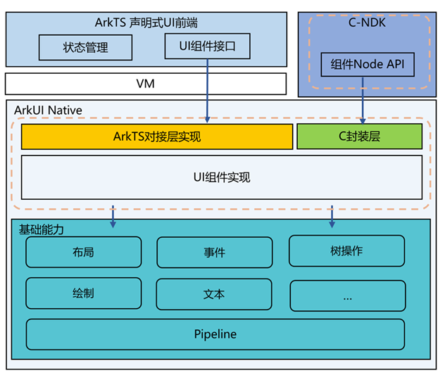
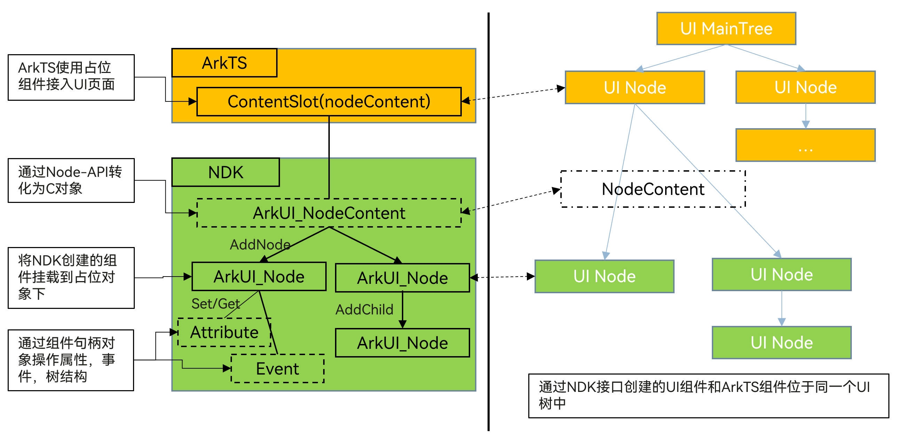

# NDK接口概述

ArkUI开发框架提供了一系列NDK接口，能够在应用中使用C和C++代码构建UI界面，这些接口包括UI组件创建、UI树操作、属性设置和事件监听等。面向通用UI界面开发场景，建议使用ArkTS代码和ArkUI声明式开发框架。然而，如果需要实现以下一个或多个目标，那么ArkUI NDK接口就能派上用场：

- 需要使用UI组件树控制接口来动态创建和挂载UI组件，方便实现自身UI开发框架的系统桥接。

- 进一步提升UI界面性能，细粒度控制组件的创建和属性设置，以降低延迟、处理极高UI负载。

- 重复使用自己或其他开发者的C或C++UI库。

ArkUI NDK接口能力主要包括：

- **布局**

  布局是UI的必要元素，定义了组件在界面中的大小位置。ArkUI NDK接口提供了线性布局、层叠布局、弹性布局、相对布局、滚动容器、轮播容器等。

- **组件**

  组件是UI的必要元素，形成了在界面中的样子。包括系统组件和用户自定义布局绘制行为的组件。系统组件包括按钮、单选框、图片、文本等，可以使用ArkUI NDK提供的接口快速创建相应组件并设置属性和事件。针对UI组件的自定义能力包括了布局测算和绘制，用户可以通过这些自定义能力构建差异化UI组件。

- **弹窗**

  弹窗是UI界面交互的重要元素。ArkUI NDK接口提供了自定义弹窗相关接口，可以自定义弹窗界面内容并调用相关弹窗接口展示弹窗。

- **动画**

  动画是UI的重要元素之一。优秀的动画设计能够极大地提升用户体验，ArkUI NDK提供了显式动画接口用于快速构建组件的属性动画、实现高效精致的动画效果。

- **交互事件**

  交互事件是UI和用户交互的必要元素。ArkUI NDK接口提供了多种交互事件，除了触摸事件、鼠标事件、焦点事件等通用事件外，还包括基于通用事件进行进一步识别的手势事件。手势事件有单一手势如点击手势、长按手势、拖动手势、捏合手势、旋转手势、滑动手势，以及通过单一手势事件进行组合的组合手势事件。

## 整体架构

**图1** NDK接口和ArkTS声明式关系架构图  

**图2** 通过NDK接口创建的组件挂载示意图  

- ArkTS声明式UI前端和NDK接口都是针对ArkUI底层实现的接口暴露，NDK接口相比于ArkTS声明式UI前端，除了剥离状态管理等声明式UI语法外，还精简了组件能力，将ArkUI组件核心功能通过C接口进行封装暴露。

- NDK创建的UI组件需要通过ArkTS层的占位组件进行挂载显示，挂载后，NDK创建的组件和ArkTS创建的组件位于同一个UI树上，相关布局渲染和事件处理遵循相同规则。

## 开发流程

使用NDK接口开发UI界面时，主要涉及如下开发过程。

| 任务 | 简介 |
| -------- | -------- |
| [NDK开发导读](../napi/ndk-development-overview.md) | 介绍NDK的适用场景与必备基础知识。 |
| [接入ArkTS页面](ndk-access-the-arkts-page.md) | 介绍了如何将NDK接口开发的UI界面挂载到ArkTS主页面上进行渲染显示。 |
| [监听组件事件](ndk-listen-to-component-events.md) | 介绍了如何注册组件的事件监听和添加手势交互。 |
| [使用动画](ndk-use-animation.md) | 介绍了如何在Native侧添加动画。 |
| [构建布局](ndk-loading-long-list.md) | 介绍了如何在Native侧使用容器组件构建布局。 |
| [构建弹窗](ndk-build-pop-up-window.md) | 介绍了如何使用弹窗接口构建UI界面进行弹窗显示。 |
| [构建自定义组件](ndk-build-custom-components.md) | 介绍了如何使用NDK接口能力构建自定义组件，实现差异化UI组件。 |
| [嵌入ArkTS组件](ndk-embed-arkts-components.md) | 介绍了如何在Native侧构建带有ArkTS组件的界面。 |
| [通过XComponent接入无障碍](ndk-accessibility-xcomponent.md) | 介绍了通过XComponent接入UI平台的三方系统如何对接无障碍。 |

## 注意事项

使用NDK接口开发UI界面时，需要保证相关UI接口调用在应用主线程上调用，避免多线程操作导致应用崩溃问题。
