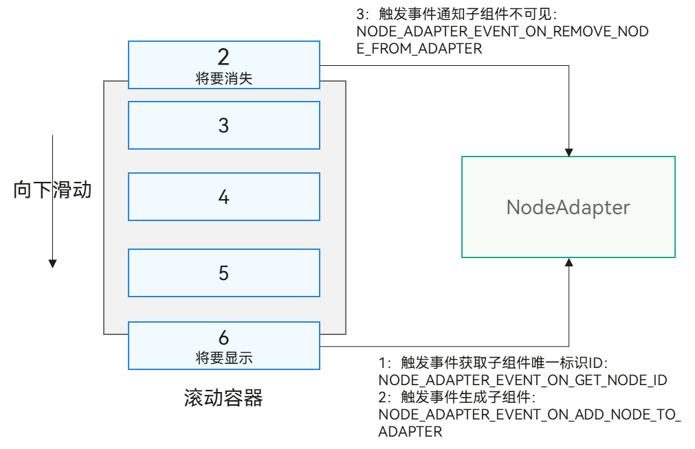

# 使用懒加载开发长列表界面


针对List、Grid、WaterFlow、Swiper组件，提供[NodeAdapter](../reference/apis-arkui/_ark_u_i___native_module.md#arkui_nodeadapterhandle)对象替代ArkTS侧的LazyForEach功能，用于按需生成子组件，其中List组件的属性枚举值为NODE_LIST_NODE_ADAPTER，Grid组件的属性枚举值为NODE_GRID_NODE_ADAPTER，WaterFlow组件的属性枚举值为NODE_WATER_FLOW_NODE_ADAPTER，Swiper组件的属性枚举值为NODE_SWIPER_NODE_ADAPTER。


虽然都用于按需生成组件，但不同于ArkTS的LazyForEach，NodeAdapter对象的规格如下：


- 设置了NodeAdapter属性的节点，不再支持addChild等直接添加子组件的接口。子组件完全由NodeAdapter管理，使用属性方法设置NodeAdapter时，会判断父组件是否已经存在子节点，如果父组件已经存在子节点，则设置NodeAdapter操作失败，返回错误码。

- NodeApdater通过相关事件通知开发者按需生成组件，类似组件事件机制，开发者使用NodeAdapter时要注册[事件监听器](../reference/apis-arkui/_ark_u_i___native_module.md#oh_arkui_nodeadapter_registereventreceiver)，在监听器事件中处理逻辑，相关事件通过[ArkUI_NodeAdapterEventType](../reference/apis-arkui/_ark_u_i___native_module.md#arkui_nodeadaptereventtype)定义。另外NodeAdapter不会主动释放不在屏幕内显示的组件对象，开发者需要在[NODE_ADAPTER_EVENT_ON_REMOVE_NODE_FROM_ADAPTER](../reference/apis-arkui/_ark_u_i___native_module.md#arkui_nodeadaptereventtype)事件中进行组件对象的释放，或者进行缓存复用。下图展示了典型列表滑动场景下的事件触发机制：
  


以下示例代码针对[接入ArkTS页面](ndk-access-the-arkts-page.md)章节代码进行优化，引入懒加载机制实现文本列表：


1. 接入ArkTS，参考[接入ArkTS页面](ndk-access-the-arkts-page.md)。

2. 懒加载适配器相关功能实现。
   ```
   // ArkUIListItemAdapter
   // 用于文本列表懒加载功能代码。
   
   #ifndef MYAPPLICATION_ARKUILISTITEMADAPTER_H
   #define MYAPPLICATION_ARKUILISTITEMADAPTER_H
   
   #include <arkui/native_node.h>
   #include <stack>
   #include <string>
   #include <unordered_set>
   
   #include "ArkUIListItemNode.h"
   #include "ArkUITextNode.h"
   #include "nativeModule.h"
   
   namespace NativeModule {
   
   class ArkUIListItemAdapter {
   public:
       ArkUIListItemAdapter()
           : module_(NativeModuleInstance::GetInstance()->GetNativeNodeAPI()), handle_(OH_ArkUI_NodeAdapter_Create()) { // 使用NodeAdapter创建函数。
           // 初始化懒加载数据。
           for (int32_t i = 0; i < 1000; i++) {
               data_.emplace_back(std::to_string(i));
           }
           // 设置懒加载数据。
           OH_ArkUI_NodeAdapter_SetTotalNodeCount(handle_, data_.size());
           // 设置懒加载回调事件。
           OH_ArkUI_NodeAdapter_RegisterEventReceiver(handle_, this, OnStaticAdapterEvent);
       }
   
       ~ArkUIListItemAdapter() {
           // 释放创建的组件。
           while (!cachedItems_.empty()) {
               cachedItems_.pop();
           }
           items_.clear();
           // 释放Adapter相关资源。
           OH_ArkUI_NodeAdapter_UnregisterEventReceiver(handle_);
           OH_ArkUI_NodeAdapter_Dispose(handle_);
       }
   
       ArkUI_NodeAdapterHandle GetHandle() const { return handle_; }
   
       void RemoveItem(int32_t index) {
           // 删除第index个数据。
           data_.erase(data_.begin() + index);
           // 如果index会导致可视区域元素发生可见性变化，则会回调NODE_ADAPTER_EVENT_ON_REMOVE_NODE_FROM_ADAPTER事件删除元素，
           // 根据是否有新增元素回调NODE_ADAPTER_EVENT_ON_GET_NODE_ID和NODE_ADAPTER_EVENT_ON_ADD_NODE_TO_ADAPTER事件。
           OH_ArkUI_NodeAdapter_RemoveItem(handle_, index, 1);
           // 更新新的数量。
           OH_ArkUI_NodeAdapter_SetTotalNodeCount(handle_, data_.size());
       }
   
       void InsertItem(int32_t index, const std::string &value) {
           data_.insert(data_.begin() + index, value);
           // 如果index会导致可视区域元素发生可见性变化，则会回调NODE_ADAPTER_EVENT_ON_GET_NODE_ID和NODE_ADAPTER_EVENT_ON_ADD_NODE_TO_ADAPTER事件，
           // 根据是否有删除元素回调NODE_ADAPTER_EVENT_ON_REMOVE_NODE_FROM_ADAPTER事件。
           OH_ArkUI_NodeAdapter_InsertItem(handle_, index, 1);
           // 更新新的数量。
           OH_ArkUI_NodeAdapter_SetTotalNodeCount(handle_, data_.size());
       }
   
       void MoveItem(int32_t oldIndex, int32_t newIndex) {
           auto temp = data_[oldIndex];
           data_.insert(data_.begin() + newIndex, temp);
           data_.erase(data_.begin() + oldIndex);
           // 移到位置如果未发生可视区域内元素的可见性变化，则不回调事件，反之根据新增和删除场景回调对应的事件。
           OH_ArkUI_NodeAdapter_MoveItem(handle_, oldIndex, newIndex);
       }
   
       void ReloadItem(int32_t index, const std::string &value) {
           data_[index] = value;
           // 如果index位于可视区域内，先回调NODE_ADAPTER_EVENT_ON_REMOVE_NODE_FROM_ADAPTER删除老元素，
           // 再回调NODE_ADAPTER_EVENT_ON_GET_NODE_ID和NODE_ADAPTER_EVENT_ON_ADD_NODE_TO_ADAPTER事件。
           OH_ArkUI_NodeAdapter_ReloadItem(handle_, index, 1);
       }
   
       void ReloadAllItem() {
           std::reverse(data_.begin(), data_.end());
           // 全部重新加载场景下，会回调NODE_ADAPTER_EVENT_ON_GET_NODE_ID接口获取新的组件ID，
           // 根据新的组件ID进行对比，ID不发生变化的进行复用，
           // 针对新增ID的元素，调用NODE_ADAPTER_EVENT_ON_ADD_NODE_TO_ADAPTER事件创建新的组件，
           // 然后判断老数据中遗留的未使用ID，调用NODE_ADAPTER_EVENT_ON_REMOVE_NODE_FROM_ADAPTER删除老元素。
           OH_ArkUI_NodeAdapter_ReloadAllItems(handle_);
       }
   
   private:
       static void OnStaticAdapterEvent(ArkUI_NodeAdapterEvent *event) {
           // 获取实例对象，回调实例事件。
           auto itemAdapter = reinterpret_cast<ArkUIListItemAdapter *>(OH_ArkUI_NodeAdapterEvent_GetUserData(event));
           itemAdapter->OnAdapterEvent(event);
       }
   
       void OnAdapterEvent(ArkUI_NodeAdapterEvent *event) {
           auto type = OH_ArkUI_NodeAdapterEvent_GetType(event);
           switch (type) {
           case NODE_ADAPTER_EVENT_ON_GET_NODE_ID:
               OnNewItemIdCreated(event);
               break;
           case NODE_ADAPTER_EVENT_ON_ADD_NODE_TO_ADAPTER:
               OnNewItemAttached(event);
               break;
           case NODE_ADAPTER_EVENT_ON_REMOVE_NODE_FROM_ADAPTER:
               OnItemDetached(event);
               break;
           default:
               break;
           }
       }
   
       // 分配ID给需要显示的Item，用于ReloadAllItems场景的元素diff。
       void OnNewItemIdCreated(ArkUI_NodeAdapterEvent *event) {
           auto index = OH_ArkUI_NodeAdapterEvent_GetItemIndex(event);
           static std::hash<std::string> hashId = std::hash<std::string>();
           auto id = hashId(data_[index]);
           OH_ArkUI_NodeAdapterEvent_SetNodeId(event, id);
       }
   
       // 需要新的Item显示在可见区域。
       void OnNewItemAttached(ArkUI_NodeAdapterEvent *event) {
           auto index = OH_ArkUI_NodeAdapterEvent_GetItemIndex(event);
           ArkUI_NodeHandle handle = nullptr;
           if (!cachedItems_.empty()) {
               // 使用并更新回收复用的缓存。
               auto recycledItem = cachedItems_.top();
               auto textItem = std::dynamic_pointer_cast<ArkUITextNode>(recycledItem->GetChildren().back());
               textItem->SetTextContent(data_[index]);
               handle = recycledItem->GetHandle();
               // 释放缓存池的引用。
               cachedItems_.pop();
           } else {
               // 创建新的元素。
               auto listItem = std::make_shared<ArkUIListItemNode>();
               auto textNode = std::make_shared<ArkUITextNode>();
               textNode->SetTextContent(data_[index]);
               textNode->SetFontSize(16);
               textNode->SetPercentWidth(1);
               textNode->SetHeight(100);
               textNode->SetBackgroundColor(0xFFfffacd);
               textNode->SetTextAlign(ARKUI_TEXT_ALIGNMENT_CENTER);
               listItem->AddChild(textNode);
               listItem->RegisterOnClick([index]() { OH_LOG_INFO(LOG_APP, "on %{public}d list item click", index); });
               handle = listItem->GetHandle();
               // 保持文本列表项的引用。
               items_.emplace(handle, listItem);
           }
           // 设置需要展示的元素。
           OH_ArkUI_NodeAdapterEvent_SetItem(event, handle);
       }
   
       // Item从可见区域移除。
       void OnItemDetached(ArkUI_NodeAdapterEvent *event) {
           auto item = OH_ArkUI_NodeAdapterEvent_GetRemovedNode(event);
           // 放置到缓存池中进行回收复用。
           cachedItems_.emplace(items_[item]);
       }
   
   
       std::vector<std::string> data_;
       ArkUI_NativeNodeAPI_1 *module_ = nullptr;
       ArkUI_NodeAdapterHandle handle_ = nullptr;
   
       // 管理NodeAdapter生成的元素。
       std::unordered_map<ArkUI_NodeHandle, std::shared_ptr<ArkUIListItemNode>> items_;
   
       // 管理回收复用组件池。
       std::stack<std::shared_ptr<ArkUIListItemNode>> cachedItems_;
   };
   
   } // namespace NativeModule
   
   #endif // MYAPPLICATION_ARKUILISTITEMADAPTER_H
   ```

3. 针对[接入ArkTS页面](ndk-access-the-arkts-page.md)章节使用的列表封装类对象，添加额外懒加载能力。
   ```
   // ArkUIListNode.h
   // 列表封装对象。
   
   #ifndef MYAPPLICATION_ARKUILISTNODE_H
   #define MYAPPLICATION_ARKUILISTNODE_H
   
   #include "ArkUIListItemAdapter.h"
   #include "ArkUINode.h"
   #include <hilog/log.h>
   
   namespace NativeModule {
   class ArkUIListNode : public ArkUINode {
   public:
       ArkUIListNode()
           : ArkUINode((NativeModuleInstance::GetInstance()->GetNativeNodeAPI())->createNode(ARKUI_NODE_LIST)) {}
   
       ~ArkUIListNode() override {
           nativeModule_->unregisterNodeEvent(handle_, NODE_LIST_ON_SCROLL_INDEX);
           if (adapter_) {
               // 析构的时候卸载adapter下的UI组件。
               nativeModule_->resetAttribute(handle_, NODE_LIST_NODE_ADAPTER);
               adapter_.reset();
           }
       }
   
       void SetScrollBarState(bool isShow) {
           assert(handle_);
           ArkUI_ScrollBarDisplayMode displayMode =
               isShow ? ARKUI_SCROLL_BAR_DISPLAY_MODE_ON : ARKUI_SCROLL_BAR_DISPLAY_MODE_OFF;
           ArkUI_NumberValue value[] = {{.i32 = displayMode}};
           ArkUI_AttributeItem item = {value, 1};
           nativeModule_->setAttribute(handle_, NODE_SCROLL_BAR_DISPLAY_MODE, &item);
       }
   
       void RegisterOnScrollIndex(const std::function<void(int32_t index)> &onScrollIndex) {
           assert(handle_);
           onScrollIndex_ = onScrollIndex;
           nativeModule_->registerNodeEvent(handle_, NODE_LIST_ON_SCROLL_INDEX, 0, nullptr);
       }
       // 引入懒加载模块。
       void SetLazyAdapter(const std::shared_ptr<ArkUIListItemAdapter> &adapter) {
           assert(handle_);
           ArkUI_AttributeItem item{nullptr, 0, nullptr, adapter->GetHandle()};
           nativeModule_->setAttribute(handle_, NODE_LIST_NODE_ADAPTER, &item);
           adapter_ = adapter;
       }
   
   protected:
       void OnNodeEvent(ArkUI_NodeEvent *event) override {
           auto eventType = OH_ArkUI_NodeEvent_GetEventType(event);
           switch (eventType) {
           case NODE_LIST_ON_SCROLL_INDEX: {
               auto index = OH_ArkUI_NodeEvent_GetNodeComponentEvent(event)->data[0];
               if (onScrollIndex_) {
                   onScrollIndex_(index.i32);
               }
           }
           default: {
           }
           }
       }
   
   private:
       std::function<void(int32_t index)> onScrollIndex_;
   
       std::shared_ptr<ArkUIListItemAdapter> adapter_;
   };
   } // namespace NativeModule
   
   #endif // MYAPPLICATION_ARKUILISTNODE_H
   ```

4. 创建列表懒加载的示例代码。
   ```
   // ArkUILazyTextListExample
   // 懒加载列表示例代码。
   
   #ifndef MYAPPLICATION_LAZYTEXTLISTEXAMPLE_H
   #define MYAPPLICATION_LAZYTEXTLISTEXAMPLE_H
   
   #include "ArkUIBaseNode.h"
   #include "ArkUIListNode.h"
   #include "UITimer.h"
   #include <thread>
   #include <uv.h>
   
   namespace NativeModule {
   
   std::shared_ptr<ArkUIBaseNode> CreateLazyTextListExample(napi_env env) {
       // 创建组件并挂载
       // 1：创建List组件。
       auto list = std::make_shared<ArkUIListNode>();
       list->SetPercentWidth(1);
       list->SetPercentHeight(1);
       // 2：创建ListItem懒加载组件并挂载到List上。
       auto adapter = std::make_shared<ArkUIListItemAdapter>();
       list->SetLazyAdapter(adapter);
   
       // 3：模拟相关懒加载操作。
       CreateNativeTimer(env, adapter.get(), 4, [](void *userdata, int32_t count) {
           auto adapter = reinterpret_cast<ArkUIListItemAdapter *>(userdata);
           switch (count) {
           case 0: {
               // 删除第0个元素。
               adapter->RemoveItem(0);
               break;
           }
           case 1: {
               // 插入第0个元素。
               adapter->InsertItem(0, "0");
               break;
           }
           case 2: {
               // 移到元素位置。
               adapter->MoveItem(0, 2);
               break;
           }
           case 3: {
               // 重载元素。
               adapter->ReloadItem(0, "1112");
               break;
           }
           case 4: {
               // 全量重载。
               adapter->ReloadAllItem();
               break;
           }
           default: {
           }
           }
       });
   
       // 3：注册List相关监听事件.
       list->RegisterOnScrollIndex([](int32_t index) { OH_LOG_INFO(LOG_APP, "on list scroll index: %{public}d", index); });
       // 4: 注册挂载事件。
       list->RegisterOnAppear([]() { OH_LOG_INFO(LOG_APP, "on list mount to tree"); });
       // 4: 注册卸载事件。
       list->RegisterOnDisappear([]() { OH_LOG_INFO(LOG_APP, "on list unmount from tree"); });
       return list;
   }
   } // namespace NativeModule
   
   #endif // MYAPPLICATION_LAZYTEXTLISTEXAMPLE_H
   ```

5. 定时器模块相关简单实现。
   ```
   // UITimer.h
   // 定时器模块。
   
   #ifndef MYAPPLICATION_UITIMER_H
   #define MYAPPLICATION_UITIMER_H
   
   #include <hilog/log.h>
   #include <js_native_api.h>
   #include <js_native_api_types.h>
   #include <node_api.h>
   #include <node_api_types.h>
   #include <string>
   #include <thread>
   #include <uv.h>
   
   namespace NativeModule {
   
   struct UIData {
       void *userData = nullptr;
       int32_t count = 0;
       int32_t totalCount = 0;
       void (*func)(void *userData, int32_t count) = nullptr;
   };
   
   napi_threadsafe_function threadSafeFunction = nullptr;
   
   void CreateNativeTimer(napi_env env, void *userData, int32_t totalCount, void (*func)(void *userData, int32_t count)) {
       napi_value name;
       std::string str = "UICallback";
       napi_create_string_utf8(env, str.c_str(), str.size(), &name);
       // UI主线程回调函数。
       napi_create_threadsafe_function(
           env, nullptr, nullptr, name, 0, 1, nullptr, nullptr, nullptr,
           [](napi_env env, napi_value value, void *context, void *data) {
               auto userdata = reinterpret_cast<UIData *>(data);
               userdata->func(userdata->userData, userdata->count);
               delete userdata;
           },
           &threadSafeFunction);
       // 启动定时器，模拟数据变化。
       std::thread timerThread([data = userData, totalCount, func]() {
           uv_loop_t *loop = uv_loop_new();
           uv_timer_t *timer = new uv_timer_t();
           uv_timer_init(loop, timer);
           timer->data = new UIData{data, 0, totalCount, func};
           uv_timer_start(
               timer,
               [](uv_timer_t *handle) {
                   OH_LOG_INFO(LOG_APP, "on timeout");
                   napi_acquire_threadsafe_function(threadSafeFunction);
                   auto *customData = reinterpret_cast<UIData *>(handle->data);
                   // 创建回调数据。
                   auto *callbackData =
                       new UIData{customData->userData, customData->count, customData->totalCount, customData->func};
                   napi_call_threadsafe_function(threadSafeFunction, callbackData, napi_tsfn_blocking);
                   customData->count++;
                   if (customData->count > customData->totalCount) {
                       uv_timer_stop(handle);
                       delete handle;
                       delete customData;
                   }
               },
               4000, 4000);
           uv_run(loop, UV_RUN_DEFAULT);
           uv_loop_delete(loop);
       });
       timerThread.detach();
   }
   } // namespace NativeModule
   
   #endif // MYAPPLICATION_UITIMER_H
   ```

6. 按照[接入ArkTS页面](ndk-access-the-arkts-page.md)章节将懒加载相关示例代码挂载到ContentSlot上显示。
   ```
   // NDK接口入口挂载文件。
   
   #include "NativeEntry.h"
   
   #include "ArkUIMixedRefresh.h"
   #include "LazyTextListExample.h"
   #include "MixedRefreshExample.h"
   #include "TextListExample.h"
   
   #include <arkui/native_node_napi.h>
   #include <arkui/native_type.h>
   #include <js_native_api.h>
   #include <uv.h>
   
   namespace NativeModule {
   namespace {
   napi_env g_env;
   }
   
   napi_env GetNapiEnv() { return g_env; }
   
   napi_value CreateNativeRoot(napi_env env, napi_callback_info info) {
       size_t argc = 1;
       napi_value args[1] = {nullptr};
   
       napi_get_cb_info(env, info, &argc, args, nullptr, nullptr);
   
       // 获取NodeContent
       ArkUI_NodeContentHandle contentHandle;
       OH_ArkUI_GetNodeContentFromNapiValue(env, args[0], &contentHandle);
       NativeEntry::GetInstance()->SetContentHandle(contentHandle);
   
       // 创建懒加载文本列表
       auto node = CreateLazyTextListExample(env);
   
       // 保持Native侧对象到管理类中，维护生命周期。
       NativeEntry::GetInstance()->SetRootNode(node);
       g_env = env;
       return nullptr;
   }
   
   napi_value DestroyNativeRoot(napi_env env, napi_callback_info info) {
       // 从管理类中释放Native侧对象。
       NativeEntry::GetInstance()->DisposeRootNode();
       return nullptr;
   }
   
   } // namespace NativeModule
   ```
