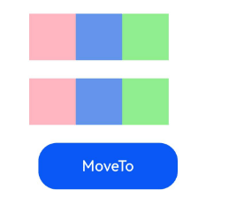

# 查询和操作自定义节点
<!--Kit: ArkUI-->
<!--Subsystem: ArkUI-->
<!--Owner: @xiang-shouxing-->
<!--Designer: @xiang-shouxing-->
<!--Tester: @sally__-->
<!--Adviser: @HelloCrease-->

NDK提供一系列节点查询、遍历、操作能力，通过使用以下接口，开发者可以高效地访问和操控节点。

以下场景基于[接入ArkTS页面](ndk-access-the-arkts-page.md)章节，创建前置工程。

## 查询节点uniqueId及通过uniqueId获取节点信息

uniqueId是系统分配的唯一标识的节点Id。

从API version 20开始，使用[OH_ArkUI_NodeUtils_GetNodeUniqueId](../reference/apis-arkui/capi-native-node-h.md#oh_arkui_nodeutils_getnodeuniqueid)接口，可以获取目标节点的uniqueId。使用[OH_ArkUI_NodeUtils_GetNodeHandleByUniqueId](../reference/apis-arkui/capi-native-node-h.md#oh_arkui_nodeutils_getnodehandlebyuniqueid)接口，可以通过uniqueId获取目标节点的指针。

```c++
testNode = nodeAPI->createNode(ARKUI_NODE_COLUMN);
ArkUI_NumberValue value[] = {480};
ArkUI_AttributeItem item = {value, sizeof(value) / sizeof(ArkUI_NumberValue)};
value[0].f32 = 300;
nodeAPI->setAttribute(testNode, NODE_WIDTH, &item);
nodeAPI->setAttribute(testNode, NODE_HEIGHT, &item);
struct IdList {
    int32_t id = -1;
};
IdList *idl = new IdList;
int32_t uid = -1;
OH_ArkUI_NodeUtils_GetNodeUniqueId(testNode, &uid);
idl->id = uid;
auto button = nodeAPI->createNode(ARKUI_NODE_BUTTON);
value[0].f32 = 50;
nodeAPI->setAttribute(button, NODE_WIDTH, &item);
nodeAPI->setAttribute(button, NODE_HEIGHT, &item);
nodeAPI->addChild(testNode, button);
nodeAPI->registerNodeEvent(button, NODE_ON_CLICK, 1, idl);
nodeAPI->registerNodeEventReceiver([](ArkUI_NodeEvent *event) {
    auto targetId = OH_ArkUI_NodeEvent_GetTargetId(event);
    if (targetId == 1) {
        auto idl = (IdList *)OH_ArkUI_NodeEvent_GetUserData(event);
        ArkUI_NodeHandle Test_Column;
        auto ec = OH_ArkUI_NodeUtils_GetNodeHandleByUniqueId(idl->id, &Test_Column);
        if (ec == 0) {
            OH_LOG_Print(LOG_APP, LOG_WARN, 0xFF00, "Manager","GetNodeHandleByUniqueId success");
        }
    }
});
```
## 通过用户id获取节点信息

使用[OH_ArkUI_NodeUtils_GetAttachedNodeHandleById](../reference/apis-arkui/capi-native-node-h.md#oh_arkui_nodeutils_getattachednodehandlebyid)接口，可以通过用户设置的id获取目标节点的指针。

1. ArkTS侧接入Native组件。
    ```ts
    // GetNodeById.ets
    import nativeNode from 'libentry.so';
    import { NodeContent } from '@kit.ArkUI';

    @Entry
    @Component
    struct GetNodeById {
      private rootSlot = new NodeContent();

      aboutToAppear(): void {
        nativeNode.createNativeRoot(this.rootSlot);
      }

      build() {
        Scroll() {
          Column({ space: 15 }) {
            Column() {
              ContentSlot(this.rootSlot)
            }
          }
          .width('100%')
        }.scrollBarColor(Color.Transparent)
      }
    }
    ```

2. 新建`GetNodeByIdExample.h`文件，在其中创建Text节点并设置id属性，通过OH_ArkUI_NodeUtils_GetAttachedNodeHandleById接口拿到节点。
    ```c
    // GetNodeByIdExample.h
    #ifndef MYAPPLICATION_GETNODEBYID_H
    #define MYAPPLICATION_GETNODEBYID_H

    #include "ArkUINode.h"
    #include <hilog/log.h>

    namespace NativeModule {

    std::shared_ptr<ArkUIBaseNode> CreateGetNodeByIdExample() {
        auto nodeAPI = NativeModuleInstance::GetInstance()->GetNativeNodeAPI();
        
        // 创建传入事件节点结构体
        struct A {
            ArkUI_NodeHandle node;
        };
        A* a = new A;
        
        // 创建根节点Scroll
        ArkUI_NodeHandle scroll = nodeAPI->createNode(ARKUI_NODE_SCROLL);
        ArkUI_NumberValue length_value[] = {{.f32 = 480}};
        ArkUI_AttributeItem length_item = {length_value, sizeof(length_value) / sizeof(ArkUI_NumberValue)};
        nodeAPI->setAttribute(scroll, NODE_WIDTH, &length_item);
        ArkUI_NumberValue length_value1[] = {{.f32 = 650}};
        ArkUI_AttributeItem length_item1 = {length_value1, sizeof(length_value1) / sizeof(ArkUI_NumberValue)};
        nodeAPI->setAttribute(scroll, NODE_HEIGHT, &length_item1);
        ArkUI_AttributeItem scroll_id = {.string = "Scroll_CAPI"};
        nodeAPI->setAttribute(scroll, NODE_ID, &scroll_id);
        
        // 创建Column
        ArkUI_NodeHandle column = nodeAPI->createNode(ARKUI_NODE_COLUMN);
        ArkUI_NumberValue value[] = {480};
        ArkUI_AttributeItem item = {value, sizeof(value) / sizeof(ArkUI_NumberValue)};
        nodeAPI->setAttribute(column, NODE_WIDTH, &item);
        ArkUI_NumberValue column_bc[] = {{.u32 = 0xFFF00BB}};
        ArkUI_AttributeItem column_item = {column_bc, 1};
        nodeAPI->setAttribute(column, NODE_BACKGROUND_COLOR, &column_item);
        ArkUI_AttributeItem column_id = {.string = "Column_CAPI"};
        nodeAPI->setAttribute(column, NODE_ID, &column_id);
        
        // 创建Text
        ArkUI_NodeHandle text0 = nodeAPI->createNode(ARKUI_NODE_TEXT);
        ArkUI_NumberValue text_width[] = {300};
        ArkUI_AttributeItem text_item0 = {text_width, sizeof(text_width) / sizeof(ArkUI_NumberValue)};
        nodeAPI->setAttribute(text0, NODE_WIDTH, &text_item0);
        ArkUI_NumberValue text_height[] = {50};
        ArkUI_AttributeItem text_item1 = {text_height, sizeof(text_height) / sizeof(ArkUI_NumberValue)};
        nodeAPI->setAttribute(text0, NODE_HEIGHT, &text_item1);
        ArkUI_AttributeItem text_item = {.string = "示例Text节点"};
        nodeAPI->setAttribute(text0, NODE_TEXT_CONTENT, &text_item);
        ArkUI_NumberValue margin[] = {10};
        ArkUI_AttributeItem item_margin = {margin, sizeof(margin) / sizeof(ArkUI_NumberValue)};
        nodeAPI->setAttribute(text0, NODE_MARGIN, &item_margin);
        ArkUI_AttributeItem text0_id = {.string = "Text0_CAPI"};
        nodeAPI->setAttribute(text0, NODE_ID, &text0_id);
        a->node = text0;
        
        // 创建Row
        ArkUI_NodeHandle row0 = nodeAPI->createNode(ARKUI_NODE_ROW);
        ArkUI_NumberValue width_value[] = {{.f32=330}};
        ArkUI_AttributeItem width_item = {width_value, sizeof(width_value) / sizeof(ArkUI_NumberValue)};
        nodeAPI->setAttribute(row0, NODE_WIDTH, &width_item);
        nodeAPI->setAttribute(row0, NODE_HEIGHT, &text_item1);
        nodeAPI->setAttribute(row0, NODE_MARGIN, &item_margin);
        
        // 创建Button
        ArkUI_NodeHandle bt0 = nodeAPI->createNode(ARKUI_NODE_BUTTON);
        ArkUI_NumberValue btn_width[] = {150};
        ArkUI_AttributeItem btn_item0 = {btn_width, sizeof(btn_width) / sizeof(ArkUI_NumberValue)};
        nodeAPI->setAttribute(bt0, NODE_WIDTH, &btn_item0);
        nodeAPI->setAttribute(bt0, NODE_HEIGHT, &text_item1);
        nodeAPI->setAttribute(bt0, NODE_MARGIN, &item_margin);
        ArkUI_AttributeItem bt0_item = {.string = "GetAttachedNodeHandleById"};
        nodeAPI->setAttribute(bt0, NODE_BUTTON_LABEL, &bt0_item);
        nodeAPI->registerNodeEvent(bt0, NODE_ON_CLICK, 0, a);
        
        // 注册事件
        auto onClick = [](ArkUI_NodeEvent *event) {
            ArkUI_NodeHandle node = OH_ArkUI_NodeEvent_GetNodeHandle(event);
            auto nodeAPI = NativeModuleInstance::GetInstance()->GetNativeNodeAPI();
            
            if (OH_ArkUI_NodeEvent_GetTargetId(event) == 0) {  // GetAttachedNodeHandleById
                A* a = (A*)OH_ArkUI_NodeEvent_GetUserData(event);
                ArkUI_NodeHandle node = nullptr;
                auto res = OH_ArkUI_NodeUtils_GetAttachedNodeHandleById("Text0_CAPI", &node);
                if (node == a->node) {
                    OH_LOG_Print(LOG_APP, LOG_INFO, 0xFF00, "GetNodeByIdExample", "get Text0_CAPI success");
                } else {
                    OH_LOG_Print(LOG_APP, LOG_ERROR, 0xFF00, "GetNodeByIdExample", "get Text0_CAPI failed");
                }
            }
        };
        nodeAPI->registerNodeEventReceiver(onClick);
        
        // 节点添加
        nodeAPI->addChild(scroll, column);
        nodeAPI->addChild(column, text0);
        nodeAPI->addChild(column, row0);
        nodeAPI->addChild(row0, bt0);
        
        return std::make_shared<ArkUINode>(scroll);
    }
    } // namespace NativeModule

    #endif //MYAPPLICATION_GETNODEBYID_H
    ```

3. 在`NativeEntry.cpp`中，挂载Native节点。
    ```c
    // NativeEntry.cpp


    #include <arkui/native_node_napi.h>
    #include <hilog/log.h>
    #include <js_native_api.h>
    #include "NativeEntry.h"
    #include "GetNodeByIdExample.h"


    namespace NativeModule {


    napi_value CreateNativeRoot(napi_env env, napi_callback_info info) {
        size_t argc = 1;
        napi_value args[1] = {nullptr};


        napi_get_cb_info(env, info, &argc, args, nullptr, nullptr);


        // 获取NodeContent
        ArkUI_NodeContentHandle contentHandle;
        OH_ArkUI_GetNodeContentFromNapiValue(env, args[0], &contentHandle);
        NativeEntry::GetInstance()->SetContentHandle(contentHandle);


        // 创建节点
        auto node = CreateGetNodeByIdExample();


        // 保持Native侧对象到管理类中，维护生命周期。
        NativeEntry::GetInstance()->SetRootNode(node);
        return nullptr;
    }


    napi_value DestroyNativeRoot(napi_env env, napi_callback_info info) {
        // 从管理类中释放Native侧对象。
        NativeEntry::GetInstance()->DisposeRootNode();
        return nullptr;
    }


    } // namespace NativeModule
    ```

4. 运行程序，点击按钮，打印节点获取成功信息。

## 移动节点

使用[OH_ArkUI_NodeUtils_MoveTo](../reference/apis-arkui/capi-native-node-h.md#oh_arkui_nodeutils_moveto)接口，可以将Native节点移动到新的父节点下，从而按需改变节点树结构。

> **说明：**
>
> 当前仅支持以下类型的[ArkUI_NodeType](../reference/apis-arkui/capi-native-node-h.md#arkui_nodetype)进行移动操作：ARKUI_NODE_STACK、ARKUI_NODE_XCOMPONENT、ARKUI_NODE_EMBEDDED_COMPONENT。对于其他类型的节点，移动操作不会生效。

1. ArkTS侧接入Native组件。
    ```ts
    // MoveTo.ets
    import nativeNode from 'libentry.so';
    import { NodeContent } from '@kit.ArkUI';

    @Entry
    @Component
    struct MoveTo {
      private rootSlot = new NodeContent();

      aboutToAppear(): void {
        nativeNode.createNativeRoot(this.rootSlot);
      }

      build() {
        Scroll() {
          Column({ space: 15 }) {
            Column() {
              ContentSlot(this.rootSlot)
            }
          }
          .width('100%')
        }.scrollBarColor(Color.Transparent)
      }
    }
    ```

2. 新建`MoveTo.h`文件，在其中创建Stack节点，通过OH_ArkUI_NodeUtils_MoveTo接口移动Stack节点。
    ```c
    // MoveToExample.h
    #ifndef MYAPPLICATION_MOVETO_H
    #define MYAPPLICATION_MOVETO_H

    #include "ArkUINode.h"
    #include <hilog/log.h>

    namespace NativeModule {

    std::shared_ptr<ArkUIBaseNode> CreateMoveToExample() {
        auto nodeAPI = NativeModuleInstance::GetInstance()->GetNativeNodeAPI();
        
        // 创建传入事件节点结构体
        struct A {
            ArkUI_NodeHandle node;
            ArkUI_NodeHandle targetParent;
        };
        A* a = new A;
        
        // 创建根节点Scroll
        ArkUI_NodeHandle scroll = nodeAPI->createNode(ARKUI_NODE_SCROLL);
        ArkUI_NumberValue length_value[] = {{.f32 = 480}};
        ArkUI_AttributeItem length_item = {length_value, sizeof(length_value) / sizeof(ArkUI_NumberValue)};
        nodeAPI->setAttribute(scroll, NODE_WIDTH, &length_item);
        ArkUI_NumberValue length_value1[] = {{.f32 = 650}};
        ArkUI_AttributeItem length_item1 = {length_value1, sizeof(length_value1) / sizeof(ArkUI_NumberValue)};
        nodeAPI->setAttribute(scroll, NODE_HEIGHT, &length_item1);
        ArkUI_AttributeItem scroll_id = {.string = "Scroll_CAPI"};
        nodeAPI->setAttribute(scroll, NODE_ID, &scroll_id);
        
        // 创建Column
        ArkUI_NodeHandle column = nodeAPI->createNode(ARKUI_NODE_COLUMN);
        ArkUI_NumberValue value[] = {480};
        ArkUI_AttributeItem item = {value, sizeof(value) / sizeof(ArkUI_NumberValue)};
        nodeAPI->setAttribute(column, NODE_WIDTH, &item);
        ArkUI_AttributeItem column_id = {.string = "Column_CAPI"};
        nodeAPI->setAttribute(column, NODE_ID, &column_id);
        
        // 创建Row
        ArkUI_NumberValue text_height[] = {50};
        ArkUI_AttributeItem text_item1 = {text_height, sizeof(text_height) / sizeof(ArkUI_NumberValue)};
        ArkUI_NumberValue margin[] = {10};
        ArkUI_AttributeItem item_margin = {margin, sizeof(margin) / sizeof(ArkUI_NumberValue)};
        ArkUI_NodeHandle row0 = nodeAPI->createNode(ARKUI_NODE_ROW);
        ArkUI_NumberValue width_value[] = {{.f32=330}};
        ArkUI_AttributeItem width_item = {width_value, sizeof(width_value) / sizeof(ArkUI_NumberValue)};
        nodeAPI->setAttribute(row0, NODE_WIDTH, &width_item);
        nodeAPI->setAttribute(row0, NODE_HEIGHT, &text_item1);
        nodeAPI->setAttribute(row0, NODE_MARGIN, &item_margin);
        
        ArkUI_NodeHandle row1 = nodeAPI->createNode(ARKUI_NODE_ROW);
        nodeAPI->setAttribute(row1, NODE_WIDTH, &width_item);
        nodeAPI->setAttribute(row1, NODE_HEIGHT, &text_item1);
        nodeAPI->setAttribute(row1, NODE_MARGIN, &item_margin);
        a->targetParent = row1;
        
        ArkUI_NodeHandle row2 = nodeAPI->createNode(ARKUI_NODE_ROW);
        nodeAPI->setAttribute(row2, NODE_WIDTH, &width_item);
        nodeAPI->setAttribute(row2, NODE_HEIGHT, &text_item1);
        nodeAPI->setAttribute(row2, NODE_MARGIN, &item_margin);
        
        // 创建Stack
        ArkUI_NodeHandle stack0 = nodeAPI->createNode(ARKUI_NODE_STACK);
        ArkUI_NumberValue stack_value[] = {{.f32=50}};
        ArkUI_AttributeItem stack_item1 = {stack_value, sizeof(width_value) / sizeof(ArkUI_NumberValue)};
        nodeAPI->setAttribute(stack0, NODE_WIDTH, &stack_item1);
        nodeAPI->setAttribute(stack0, NODE_HEIGHT, &stack_item1);
        ArkUI_NumberValue stack_bc[] = {{.u32 = 0xFFFFB6C1}};
        ArkUI_AttributeItem stack_item2 = {stack_bc, 1};
        nodeAPI->setAttribute(stack0, NODE_BACKGROUND_COLOR, &stack_item2);
        a->node = stack0;
        
        ArkUI_NodeHandle stack1 = nodeAPI->createNode(ARKUI_NODE_STACK);
        nodeAPI->setAttribute(stack1, NODE_WIDTH, &stack_item1);
        nodeAPI->setAttribute(stack1, NODE_HEIGHT, &stack_item1);
        ArkUI_NumberValue stack_bc1[] = {{.u32 = 0xFF6495ED}};
        ArkUI_AttributeItem stack_item3 = {stack_bc1, 1};
        nodeAPI->setAttribute(stack1, NODE_BACKGROUND_COLOR, &stack_item3);
        
        ArkUI_NodeHandle stack2 = nodeAPI->createNode(ARKUI_NODE_STACK);
        nodeAPI->setAttribute(stack2, NODE_WIDTH, &stack_item1);
        nodeAPI->setAttribute(stack2, NODE_HEIGHT, &stack_item1);
        ArkUI_NumberValue stack_bc2[] = {{.u32 = 0xFF90EE90}};
        ArkUI_AttributeItem stack_item4 = {stack_bc2, 1};
        nodeAPI->setAttribute(stack2, NODE_BACKGROUND_COLOR, &stack_item4);
        
        ArkUI_NodeHandle stack3 = nodeAPI->createNode(ARKUI_NODE_STACK);
        nodeAPI->setAttribute(stack3, NODE_WIDTH, &stack_item1);
        nodeAPI->setAttribute(stack3, NODE_HEIGHT, &stack_item1);
        nodeAPI->setAttribute(stack3, NODE_BACKGROUND_COLOR, &stack_item2);
        
        ArkUI_NodeHandle stack4 = nodeAPI->createNode(ARKUI_NODE_STACK);
        nodeAPI->setAttribute(stack4, NODE_WIDTH, &stack_item1);
        nodeAPI->setAttribute(stack4, NODE_HEIGHT, &stack_item1);
        nodeAPI->setAttribute(stack4, NODE_BACKGROUND_COLOR, &stack_item3);
        
        ArkUI_NodeHandle stack5 = nodeAPI->createNode(ARKUI_NODE_STACK);
        nodeAPI->setAttribute(stack5, NODE_WIDTH, &stack_item1);
        nodeAPI->setAttribute(stack5, NODE_HEIGHT, &stack_item1);
        nodeAPI->setAttribute(stack5, NODE_BACKGROUND_COLOR, &stack_item4);
        
        // 创建Button
        ArkUI_NodeHandle bt0 = nodeAPI->createNode(ARKUI_NODE_BUTTON);
        ArkUI_NumberValue btn_width[] = {150};
        ArkUI_AttributeItem btn_item0 = {btn_width, sizeof(btn_width) / sizeof(ArkUI_NumberValue)};
        nodeAPI->setAttribute(bt0, NODE_WIDTH, &btn_item0);
        nodeAPI->setAttribute(bt0, NODE_HEIGHT, &text_item1);
        nodeAPI->setAttribute(bt0, NODE_MARGIN, &item_margin);
        ArkUI_AttributeItem bt0_item = {.string = "MoveTo"};
        nodeAPI->setAttribute(bt0, NODE_BUTTON_LABEL, &bt0_item);
        nodeAPI->registerNodeEvent(bt0, NODE_ON_CLICK, 0, a);
        
        // 注册事件
        auto onClick = [](ArkUI_NodeEvent *event) {
            ArkUI_NodeHandle node = OH_ArkUI_NodeEvent_GetNodeHandle(event);
            auto nodeAPI = NativeModuleInstance::GetInstance()->GetNativeNodeAPI();
            
            if (OH_ArkUI_NodeEvent_GetTargetId(event) == 0) {  // MoveTo
                A* a = (A*)OH_ArkUI_NodeEvent_GetUserData(event);
                auto res = OH_ArkUI_NodeUtils_MoveTo(a->node, a->targetParent, 2);
            }
        };
        nodeAPI->registerNodeEventReceiver(onClick);
        
        // 节点添加
        nodeAPI->addChild(scroll, column);
        nodeAPI->addChild(column, row0);
        nodeAPI->addChild(column, row1);
        nodeAPI->addChild(column, row2);
        nodeAPI->addChild(row0, stack0);
        nodeAPI->addChild(row0, stack1);
        nodeAPI->addChild(row0, stack2);
        nodeAPI->addChild(row1, stack3);
        nodeAPI->addChild(row1, stack4);
        nodeAPI->addChild(row1, stack5);
        nodeAPI->addChild(row2, bt0);
        
        return std::make_shared<ArkUINode>(scroll);
    }
    } // namespace NativeModule

    #endif //MYAPPLICATION_MOVETO_H
    ```

3. 在`NativeEntry.cpp`中，挂载Native节点。
    ```c
    // NativeEntry.cpp


    #include <arkui/native_node_napi.h>
    #include <hilog/log.h>
    #include <js_native_api.h>
    #include "NativeEntry.h"
    #include "MoveToExample.h"


    namespace NativeModule {


    napi_value CreateNativeRoot(napi_env env, napi_callback_info info) {
        size_t argc = 1;
        napi_value args[1] = {nullptr};


        napi_get_cb_info(env, info, &argc, args, nullptr, nullptr);


        // 获取NodeContent
        ArkUI_NodeContentHandle contentHandle;
        OH_ArkUI_GetNodeContentFromNapiValue(env, args[0], &contentHandle);
        NativeEntry::GetInstance()->SetContentHandle(contentHandle);


        // 创建节点
        auto node = CreateMoveToExample();


        // 保持Native侧对象到管理类中，维护生命周期。
        NativeEntry::GetInstance()->SetRootNode(node);
        return nullptr;
    }


    napi_value DestroyNativeRoot(napi_env env, napi_callback_info info) {
        // 从管理类中释放Native侧对象。
        NativeEntry::GetInstance()->DisposeRootNode();
        return nullptr;
    }


    } // namespace NativeModule
    ```

4. 运行程序，点击按钮，Stack节点会移动到目标位置。



## 用不同的展开模式获取对应下标的子节点

NDK支持通过不同的展开方式获取目标节点下的有效节点信息。例如，在LazyForEach场景下，可以处理存在多个子节点的情况。

从API version 20开始，使用[OH_ArkUI_NodeUtils_GetFirstChildIndexWithoutExpand](../reference/apis-arkui/capi-native-node-h.md#oh_arkui_nodeutils_getfirstchildindexwithoutexpand)接口，可以获取目标节点的第一个存在于组件树的节点。使用[OH_ArkUI_NodeUtils_GetLastChildIndexWithoutExpand](../reference/apis-arkui/capi-native-node-h.md#oh_arkui_nodeutils_getlastchildindexwithoutexpand)接口，可以获取目标节点的最后一个存在于组件树的节点。[OH_ArkUI_NodeUtils_GetChildWithExpandMode](../reference/apis-arkui/capi-native-node-h.md#oh_arkui_nodeutils_getchildwithexpandmode)接口，可以通过不同的节点展开模式获取对应下标的子节点。

> **说明：**
>
> 节点展开方式请参考[ArkUI_ExpandMode](../reference/apis-arkui/capi-native-type-h.md#arkui_expandmode)，此处推荐使用ARKUI_LAZY_EXPAND懒展开方式，智能识别对应场景。

1. 通过ArkTS构造LazyForEach及ArkTS的下树节点展开场景。

    ```ts
    import { NodeController, FrameNode, UIContext, BuilderNode, ExpandMode, LengthUnit } from '@kit.ArkUI';
    
    const TEST_TAG: string = "FrameNode ";
    
    // BasicDataSource实现了IDataSource接口，用于管理listener监听，以及通知LazyForEach数据更新
    class BasicDataSource implements IDataSource {
      private listeners: DataChangeListener[] = [];
      private originDataArray: string[] = [];
    
      public totalCount(): number {
        return 0;
      }
    
      public getData(index: number): string {
        return this.originDataArray[index];
      }
    
      // 该方法为框架侧调用，为LazyForEach组件向其数据源处添加listener监听
      registerDataChangeListener(listener: DataChangeListener): void {
        if (this.listeners.indexOf(listener) < 0) {
          console.info('add listener');
          this.listeners.push(listener);
        }
      }
    
      // 该方法为框架侧调用，为对应的LazyForEach组件在数据源处去除listener监听
      unregisterDataChangeListener(listener: DataChangeListener): void {
        const pos = this.listeners.indexOf(listener);
        if (pos >= 0) {
          console.info('remove listener');
          this.listeners.splice(pos, 1);
        }
      }
    
      // 通知LazyForEach组件需要重载所有子组件
      notifyDataReload(): void {
        this.listeners.forEach(listener => {
          listener.onDataReloaded();
        })
      }
    
      // 通知LazyForEach组件需要在index对应索引处添加子组件
      notifyDataAdd(index: number): void {
        this.listeners.forEach(listener => {
          listener.onDataAdd(index);
          // 写法2：listener.onDatasetChange([{type: DataOperationType.ADD, index: index}]);
        })
      }
    
      // 通知LazyForEach组件在index对应索引处数据有变化，需要重建该子组件
      notifyDataChange(index: number): void {
        this.listeners.forEach(listener => {
          listener.onDataChange(index);
          // 写法2：listener.onDatasetChange([{type: DataOperationType.CHANGE, index: index}]);
        })
      }
    
      // 通知LazyForEach组件需要在index对应索引处删除该子组件
      notifyDataDelete(index: number): void {
        this.listeners.forEach(listener => {
          listener.onDataDelete(index);
          // 写法2：listener.onDatasetChange([{type: DataOperationType.DELETE, index: index}]);
        })
      }
    
      // 通知LazyForEach组件将from索引和to索引处的子组件进行交换
      notifyDataMove(from: number, to: number): void {
        this.listeners.forEach(listener => {
          listener.onDataMove(from, to);
          // 写法2：listener.onDatasetChange(
          //         [{type: DataOperationType.EXCHANGE, index: {start: from, end: to}}]);
        })
      }
    
      notifyDatasetChange(operations: DataOperation[]): void {
        this.listeners.forEach(listener => {
          listener.onDatasetChange(operations);
        })
      }
    }
    
    class MyDataSource extends BasicDataSource {
      private dataArray: string[] = []
    
      public totalCount(): number {
        return this.dataArray.length;
      }
    
      public getData(index: number): string {
        return this.dataArray[index];
      }
    
      public addData(index: number, data: string): void {
        this.dataArray.splice(index, 0, data);
        this.notifyDataAdd(index);
      }
    
      public pushData(data: string): void {
        this.dataArray.push(data);
        this.notifyDataAdd(this.dataArray.length - 1);
      }
    }
    
    class Params {
      data: MyDataSource | null = null;
      scroller: Scroller | null = null;
      constructor(data: MyDataSource, scroller: Scroller) {
        this.data = data;
        this.scroller = scroller;
      }
    }
    
    @Builder
    function buildData(params: Params) {
      List({ scroller: params.scroller }) {
        LazyForEach(params.data, (item: string) => {
          ListItem() {
            Column() {
              Text(item)
                .fontSize(20)
                .onAppear(() => {
                  console.info(TEST_TAG + " node appear: " + item)
                })
                .backgroundColor(Color.Pink)
                .margin({
                  top: 30,
                  bottom: 30,
                  left: 10,
                  right: 10
                })
            }
          }
          .id(item)
        }, (item: string) => item)
      }
      .cachedCount(5)
      .listDirection(Axis.Horizontal)
    }
    
    class MyNodeController extends NodeController {
      private rootNode: FrameNode | null = null;
      private uiContext: UIContext | null = null;
      private data: MyDataSource = new MyDataSource();
      private scroller: Scroller = new Scroller();
    
      makeNode(uiContext: UIContext): FrameNode | null {
        this.uiContext = uiContext;
        for (let i = 0; i <= 20; i++) {
          this.data.pushData(`N${i}`);
        }
        const params: Params = new Params(this.data, this.scroller);
        const dataNode: BuilderNode<[Params]> = new BuilderNode(uiContext);
        dataNode.build(wrapBuilder<[Params]>(buildData), params);
        this.rootNode = dataNode.getFrameNode();
        const scrollToIndexOptions: ScrollToIndexOptions = {
          extraOffset: {
            value: 20, unit: LengthUnit.VP
          }
        };
        this.scroller.scrollToIndex(6, true, ScrollAlign.START, scrollToIndexOptions);
        return this.rootNode;
      }

      // 获取不展开场景下第一个活跃节点的下标
      getFirstChildIndexWithoutExpand() {
        console.info(`${TEST_TAG} getFirstChildIndexWithoutExpand: ${this.rootNode!.getFirstChildIndexWithoutExpand()}`);
      }

      // 获取不展开场景下最后一个活跃节点的下标
      getLastChildIndexWithoutExpand() {
        console.info(`${TEST_TAG} getLastChildIndexWithoutExpand: ${this.rootNode!.getLastChildIndexWithoutExpand()}`);
      }

      // 用不展开的方式获取节点
      getChildWithNotExpand() {
        const childNode = this.rootNode!.getChild(3, ExpandMode.NOT_EXPAND);
        console.info(TEST_TAG + " getChild(3, ExpandMode.NOT_EXPAND): " + childNode?.getId());
        if (childNode?.getId() === "N9") {
          console.info(TEST_TAG + " getChild(3, ExpandMode.NOT_EXPAND)  result: success.");
        } else {
          console.info(TEST_TAG + " getChild(3, ExpandMode.NOT_EXPAND)  result: fail.");
        }
      }
      
      // 以展开的方式获取节点
      getChildWithExpand() {
        const childNode = this.rootNode!.getChild(3, ExpandMode.EXPAND);
        console.info(TEST_TAG + " getChild(3, ExpandMode.EXPAND): " + childNode?.getId());
        if (childNode?.getId() === "N3") {
          console.info(TEST_TAG + " getChild(3, ExpandMode.EXPAND)  result: success.");
        } else {
          console.info(TEST_TAG + " getChild(3, ExpandMode.EXPAND)  result: fail.");
        }
      }
      
      getChildWithLazyExpand() {
        const childNode = this.rootNode!.getChild(3, ExpandMode.LAZY_EXPAND);
        console.info(TEST_TAG + " getChild(3, ExpandMode.LAZY_EXPAND): " + childNode?.getId());
        if (childNode?.getId() === "N3") {
          console.info(TEST_TAG + " getChild(3, ExpandMode.LAZY_EXPAND)  result: success.");
        } else {
          console.info(TEST_TAG + " getChild(3, ExpandMode.LAZY_EXPAND)  result: fail.");
        }
      }
    }
    
    @Entry
    @Component
    struct Index {
      private myNodeController: MyNodeController = new MyNodeController();
      private scroller: Scroller = new Scroller();
    
      build() {
        Scroll(this.scroller) {
          Column({ space: 8 }) {
            Column() {
              Text("This is a NodeContainer.")
                .textAlign(TextAlign.Center)
                .borderRadius(10)
                .backgroundColor(0xFFFFFF)
                .width('100%')
                .fontSize(16)
              NodeContainer(this.myNodeController)
                .borderWidth(1)
                .width(300)
                .height(100)
            }
    
            Button("getFirstChildIndexWithoutExpand")
                .width(300)
                .onClick(() => {
                  this.myNodeController.getFirstChildIndexWithoutExpand();
                })
              Button("getLastChildIndexWithoutExpand")
                .width(300)
                .onClick(() => {
                  this.myNodeController.getLastChildIndexWithoutExpand();
                })
              Button("getChildWithNotExpand")
                .width(300)
                .onClick(() => {
                  this.myNodeController.getChildWithNotExpand();
                })
              Button("getChildWithExpand")
                .width(300)
                .onClick(() => {
                  this.myNodeController.getChildWithExpand();
                })
              Button("getChildWithLazyExpand")
                .width(300)
                .onClick(() => {
                  this.myNodeController.getChildWithLazyExpand();
                })
            }
            .width("100%")
          }
          .scrollable(ScrollDirection.Vertical) // 滚动方向纵向
        }
      }
    ```
  
2. NDK侧通过[OH_ArkUI_NodeUtils_GetAttachedNodeHandleById](../reference/apis-arkui/capi-native-node-h.md#oh_arkui_nodeutils_getattachednodehandlebyid)接口获取ArkTS组件，并通过懒展开模式获取对应的子组件信息。
    ```c++
    ArkUI_NodeHandle childNode = nullptr;
    OH_ArkUI_NodeUtils_GetAttachedNodeHandleById("N3", &childNode);
    
    uint32_t index = 0;
    OH_ArkUI_NodeUtils_GetFirstChildIndexWithoutExpand(childNode, &index);
    uint32_t index1 = 0;
    OH_ArkUI_NodeUtils_GetLastChildIndexWithoutExpand(childNode, &index1);
    ArkUI_NodeHandle child = nullptr;
    auto result = OH_ArkUI_NodeUtils_GetChildWithExpandMode(childNode, 3, &child, 0);
    OH_LOG_Print(LOG_APP, LOG_INFO, 0xFF00, "Manager", "firstChildIndex - lastChildIndex == %{public}d -- %{public}d, -- getResult= %{public}d",
        index, index1, result);
    ```

3. 查看日志打印的对应错误码返回是否正确，以此判断是否成功获取到对应子节点。
