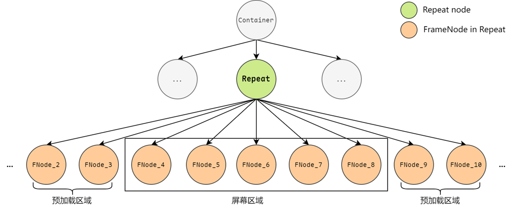
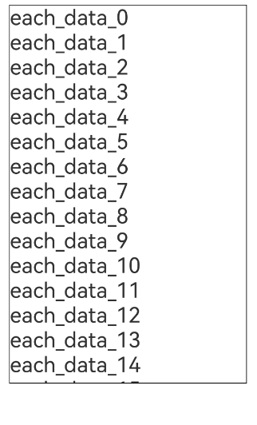
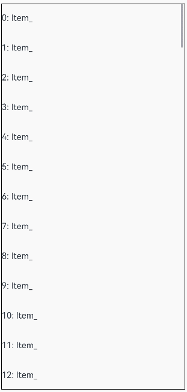
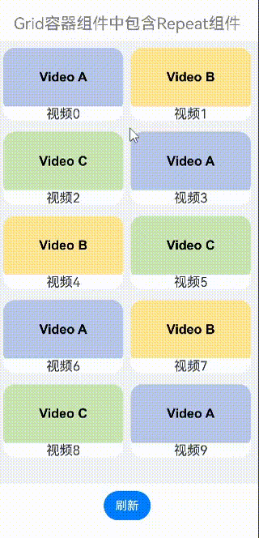
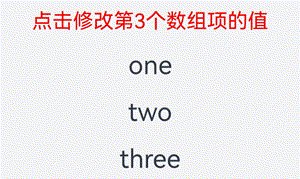
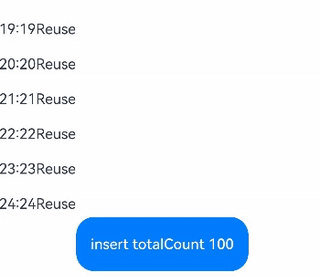
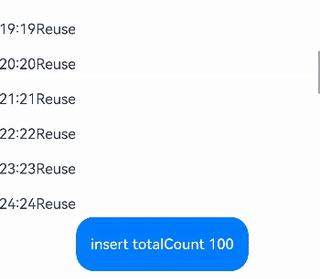

# Repeat：可复用的循环渲染
<!--Kit: ArkUI-->
<!--Subsystem: ArkUI-->
<!--Owner: @liubihao-->
<!--Designer: @keerecles-->
<!--Tester: @TerryTsao-->
<!--Adviser: @zhang_yixin13-->

> **说明：**
> 
> Repeat从API version 12开始支持。
> 
> 本文档仅为开发指南。组件接口规范见[Repeat API参数说明](../../reference/apis-arkui/arkui-ts/ts-rendering-control-repeat.md)。

## 概述

Repeat基于数组类型数据来进行循环渲染，一般与容器组件配合使用。

Repeat根据容器组件的**有效加载范围**（屏幕可视区域+预加载区域）加载子组件。当容器滑动/数组改变时，Repeat会根据父容器组件的布局过程重新计算有效加载范围，并管理列表子组件节点的创建与销毁。Repeat通过组件节点更新/复用从而优化性能表现，详细描述见[节点更新/复用能力说明](#节点更新复用能力说明)。

> **说明：**
> 
> Repeat与[LazyForEach](./arkts-rendering-control-lazyforeach.md)组件的区别：
> - Repeat直接监听状态变量的变化，而LazyForEach需要开发者实现[IDataSource](../../reference/apis-arkui/arkui-ts/ts-rendering-control-lazyforeach.md#idatasource)接口，手动管理子组件内容/索引的修改。
> - Repeat还增强了节点复用能力，提高了长列表滑动和数据更新的渲染性能。
> - Repeat增加了渲染模板（template）的能力，在同一个数组中，根据开发者自定义的模板类型（template type）渲染不同的子组件。

## 使用限制

- Repeat必须在滚动类容器组件内使用，仅有[List](../../reference/apis-arkui/arkui-ts/ts-container-list.md)、[ListItemGroup](../../reference/apis-arkui/arkui-ts/ts-container-listitemgroup.md)、[Grid](../../reference/apis-arkui/arkui-ts/ts-container-grid.md)、[Swiper](../../reference/apis-arkui/arkui-ts/ts-container-swiper.md)以及[WaterFlow](../../reference/apis-arkui/arkui-ts/ts-container-waterflow.md)组件支持Repeat懒加载场景。<br/>
循环渲染只允许创建一个子组件，子组件应当是允许包含在容器组件中的子组件。例如：Repeat与[List](../../reference/apis-arkui/arkui-ts/ts-container-list.md)组件配合使用时，子组件必须为[ListItem](../../reference/apis-arkui/arkui-ts/ts-container-listitem.md)组件。
- Repeat不支持V1装饰器，混用V1装饰器会导致渲染异常。
- Repeat当前不支持动画效果。
- 滚动容器组件内只能包含一个Repeat。以List为例，不建议同时包含ListItem、ForEach、LazyForEach，不建议同时包含多个Repeat。
- 当Repeat与自定义组件或[@Builder](../state-management/arkts-builder.md)函数混用时，必须将RepeatItem类型整体进行传参，组件才能监听到数据变化。详见[Repeat与@Builder混用](#repeat与builder混用)。

> **注意：**
>
> Repeat功能依赖数组属性的动态修改。如果数组对象被密封（sealed）或冻结（frozen），将导致Repeat部分功能失效，因为密封操作会禁止对象扩展属性并锁定现有属性的配置。
>
> 常见触发场景：<br>1）可观察数据的转换：使用[makeObserved](../../reference/apis-arkui/js-apis-StateManagement.md#makeobserved)将普通数组（如[collections.Array](../../reference/apis-arkts/arkts-apis-arkts-collections-Array.md)）转换为可观察数据时，某些实现会自动密封数组。<br>2）主动对象保护：显式调用`Object.seal()`或`Object.freeze()`防止数组被修改。

## 循环渲染能力说明

Repeat子组件由`.each()`和`.template()`属性定义，只允许包含一个子组件。当页面首次渲染时，Repeat根据当前的有效加载范围（屏幕可视区域+预加载区域）按需创建子组件。如下图所示：



`.each()`适用于只需要循环渲染一种子组件的场景。下列示例代码使用Repeat组件进行简单的循环渲染。

```ts
// 在List容器组件中使用Repeat
@Entry
@ComponentV2 // 推荐使用V2装饰器
struct RepeatExample {
  @Local dataArr: Array<string> = []; // 数据源

  aboutToAppear(): void {
    for (let i = 0; i < 50; i++) {
      this.dataArr.push(`data_${i}`); // 为数组添加一些数据
    }
  }

  build() {
    Column() {
      List() {
        Repeat<string>(this.dataArr)
          .each((ri: RepeatItem<string>) => {
            ListItem() {
              Text('each_' + ri.item).fontSize(30)
            }
          })
          .virtualScroll({ totalCount: this.dataArr.length }) // 打开懒加载，totalCount为期望加载的数据长度
      }
      .cachedCount(2) // 容器组件的预加载区域大小
      .height('70%')
      .border({ width: 1 }) // 边框
    }
  }
}
```

运行后界面如下图所示：

 

Repeat提供渲染模板（template）能力，可以在同一个数据源中渲染多种子组件。每个数据项会根据`.templateId()`得到template type，从而渲染type对应的`.template()`中的子组件。

- `.each()`等价于template type为空字符串的`.template()`。
- 当多个template type相同时（包括template type为空字符串），Repeat仅生效最新定义的`.each()`或`.template()`。
- 如果`.templateId()`缺省，或`templateId()`计算得到的template type不存在，则template type取默认值空字符串。
- 只有相同template type的节点可以互相复用。

下列示例代码中使用Repeat组件进行循环渲染，并使用了多个渲染模板。

```ts
// 在List容器组件中使用Repeat
@Entry
@ComponentV2 // 推荐使用V2装饰器
struct RepeatExampleWithTemplates {
  @Local dataArr: Array<string> = []; // 数据源

  aboutToAppear(): void {
    for (let i = 0; i < 50; i++) {
      this.dataArr.push(`data_${i}`); // 为数组添加一些数据
    }
  }

  build() {
    Column() {
      List() {
        Repeat<string>(this.dataArr)
          .each((ri: RepeatItem<string>) => { // 默认渲染模板
            ListItem() {
              Text('each_' + ri.item).fontSize(30).fontColor('rgb(161,10,33)') // 文本颜色为红色
            }
          })
          .key((item: string, index: number): string => JSON.stringify(item)) // 键值生成函数
          .virtualScroll({ totalCount: this.dataArr.length }) // 打开懒加载，totalCount为期望加载的数据长度
          .templateId((item: string, index: number): string => { // 根据返回值寻找对应的模板子组件进行渲染
            return index <= 4 ? 'A' : (index <= 10 ? 'B' : ''); // 前5个节点模板为A，接下来的5个为B，其余为默认模板
          })
          .template('A', (ri: RepeatItem<string>) => { // 'A'模板
            ListItem() {
              Text('A_' + ri.item).fontSize(30).fontColor('rgb(23,169,141)') // 文本颜色为绿色
            }
          }, { cachedCount: 3 }) // 'A'模板的缓存列表容量为3
          .template('B', (ri: RepeatItem<string>) => { // 'B'模板
            ListItem() {
              Text('B_' + ri.item).fontSize(30).fontColor('rgb(39,135,217)') // 文本颜色为蓝色
            }
          }, { cachedCount: 4 }) // 'B'模板的缓存列表容量为4
      }
      .cachedCount(2) // 容器组件的预加载区域大小
      .height('70%')
      .border({ width: 1 }) // 边框
    }
  }
}
```

运行后界面如下图所示：


## 节点更新/复用能力说明

> **说明：**
> 
> Repeat子组件的节点操作分为四种：节点创建、节点更新、节点复用、节点销毁。其中，节点更新和节点复用的区别为：
> 
> - 节点更新：节点不销毁，状态变量驱动节点属性更新。
> - 节点复用：旧节点不销毁，存储在空闲节点缓存池；需要创建新节点时，直接从缓存池中获取可复用的旧节点，并做相应的节点属性更新。

当**滚动容器组件滑动/数组改变**时，Repeat将失效的子组件节点（离开有效加载范围）加入空闲节点缓存池中，即断开组件节点与页面组件树的连接但不销毁节点。在需要生成新的组件时，对缓存池里的组件节点进行复用。

Repeat组件默认开启节点复用功能。从API version 18开始，可以通过配置`reusable`字段选择是否启用复用功能。为了提高渲染性能，建议开发者保持节点复用。代码示例见[VirtualScrollOptions](../../reference/apis-arkui/arkui-ts/ts-rendering-control-repeat.md#virtualscrolloptions)。

从API version 18开始，Repeat支持L2缓存自定义组件冻结。详细描述见[缓存池自定义组件冻结](../state-management/arkts-custom-components-freezeV2.md#repeat)。

下面通过典型的[滑动场景](#滑动场景)和[数据更新场景](#数据更新场景)示例来展示Repeat子组件的渲染逻辑。图中L1缓存为Repeat有效加载区域，L2缓存为每个循环渲染模板的空闲节点缓存池。

定义长度为20的数组，数组前5项的template type为`aa`，其余项为`bb`。`aa`缓存池容量为3，`bb`缓存池容量为4。容器组件的预加载区域大小为2。为了便于理解，在`aa`和`bb`缓存池中分别加入一个和两个空闲节点。

首次渲染，列表的节点状态如下图所示。


### 滑动场景

将屏幕向右滑动（屏幕内容右移）一个节点的距离，Repeat将开始复用缓存池中的节点。index=10的节点进入有效加载范围，计算出其template type为`bb`。由于`bb`缓存池非空，Repeat会从`bb`缓存池中取出一个空闲节点进行复用，更新其节点属性，该子组件中涉及数据item和索引index的其他孙子组件会根据V2状态管理的规则做同步更新。其他节点仍在有效加载范围，均只更新索引index。

index=0的节点滑出了有效加载范围。当UI主线程空闲时，会检查`aa`缓存池是否已满，此时`aa`缓存池未满，将该节点加入到对应的缓存池中。

如果此时对应template type的缓存池已满，Repeat会销毁掉多余的节点。


### 数据更新场景

在上一小节的基础上做如下的数组更新操作，删除index=4的节点，修改节点数据`item_7`为`new_7`。

首先，删除index=4的节点后，失效节点加入`aa`缓存池。后面的列表节点前移，新进入有效加载区域的节点`item_11`会复用`bb`缓存池中的空闲节点，其他节点均只更新索引index。如下图所示。


其次，节点`item_5`前移，索引index更新为4。根据template type的计算规则，节点`item_5`的template type变为`aa`，需要从`aa`缓存池中复用空闲节点，并且将旧节点加入`bb`缓存池。如下图所示。


## 键值生成函数

Repeat的`.key()`属性为每个子组件生成一个键值。Repeat通过键值识别数组增加、删除哪些数据以及哪些数据改变了位置（索引）。

> **注意:**
>
> 键值（key）与索引（index）的区别：键值是数据项的唯一标识符，Repeat根据键值是否发生变化判断数据项是否更新；索引只标识数据项在数组中的位置。

当`.key()`缺省时，Repeat会生成新的随机键值。当发现有重复key时，Repeat会在已有键值的基础上递归生成新的键值，直到没有重复键值。

键值生成函数`.key()`的使用限制：

- 即使数组发生变化，开发者也必须保证键值key唯一。
- 每次执行`.key()`函数时，使用相同的数据项作为输入，输出必须是一致的。
- 允许在`.key()`中使用index，但不建议开发者这样做。因为在数据项移动时索引index发生变化的同时key值也会改变，导致Repeat认为数据发生变化，从而触发子组件重新渲染，降低性能表现。
- 推荐将简单类型数组转换为类对象数组，并添加一个`readonly id`属性，在构造函数中初始化唯一值。

## 数据精准懒加载

当数据源总长度较长，或数据项加载耗时较长时，可使用Repeat数据精准懒加载特性，避免在初始化时加载所有数据。Repeat数据精准懒加载特性从API version 19开始支持。

开发者可以设置`.virtualScroll()`的`totalCount`属性值或`onTotalCount`自定义方法用于计算期望的数据源长度，设置`onLazyLoading`属性实现数据精准懒加载，实现在节点首次渲染时加载对应的数据。详细说明和注意事项见[VirtualScrollOptions](../../reference/apis-arkui/arkui-ts/ts-rendering-control-repeat.md#virtualscrolloptions)。

**示例1**

数据源总长度较长，在首次渲染、滑动屏幕、跳转显示区域时，动态加载对应区域内的数据。

```ts
@Entry
@ComponentV2
struct RepeatLazyLoading {
  // 假设数据源总长度较长，为1000。初始数组未提供数据。
  @Local arr: Array<string> = [];
  scroller: Scroller = new Scroller();
  build() {
    Column({ space: 5 }) {
      // 初始显示位置为index = 100，数据可通过懒加载自动获取。
      List({ scroller: this.scroller, space: 5, initialIndex: 100 }) {
        Repeat(this.arr)
          .virtualScroll({
            // 期望的数据源总长度为1000。
            onTotalCount: () => { return 1000; },
            // 实现数据懒加载。
            onLazyLoading: (index: number) => { this.arr[index] = index.toString(); }
          })
          .each((obj: RepeatItem<string>) => {
            ListItem() {
              Row({ space: 5 }) {
                Text(`${obj.index}: Item_${obj.item}`)
              }
            }
            .height(50)
          })
      }
      .height('80%')
      .border({ width: 1})
      // 显示位置跳转至index = 500，数据可通过懒加载自动获取。
      Button('ScrollToIndex 500')
        .onClick(() => { this.scroller.scrollToIndex(500); })
    }
  }
}
```

运行效果：


**示例2**

数据加载耗时长，在onLazyLoading方法中，首先为数据项创建占位符，再通过异步任务加载数据。

```ts
@Entry
@ComponentV2
struct RepeatLazyLoading {
  @Local arr: Array<string> = [];
  build() {
    Column({ space: 5 }) {
      List({ space: 5 }) {
        Repeat(this.arr)
          .virtualScroll({
            onTotalCount: () => { return 100; },
            // 实现数据懒加载。
            onLazyLoading: (index: number) => {
              // 创建占位符。
              this.arr[index] = '';
              // 模拟高耗时加载过程，通过异步任务加载数据。
              setTimeout(() => { this.arr[index] = index.toString(); }, 1000);
            }
          })
          .each((obj: RepeatItem<string>) => {
            ListItem() {
              Row({ space: 5 }) {
                Text(`${obj.index}: Item_${obj.item}`)
              }
            }
            .height(50)
          })
      }
      .height('100%')
      .border({ width: 1})
    }
  }
}
```

运行效果：



**示例3**

使用数据懒加载，并配合设置`onTotalCount: () => { return this.arr.length + 1; }`，可实现数据无限懒加载。

> **注意：** 
>
> - 此场景下，开发者需要提供首屏显示所需的初始数据，并建议设置父容器组件`cachedCount > 0`，否则将会导致渲染异常。
> - 若与Swiper-Loop模式同时使用，停留在`index = 0`处时，将导致onLazyLoading方法被持续触发，建议避免与Swiper-Loop模式同时使用。
> - 开发者需要关注内存消耗情况，避免因数据持续加载而导致内存过量消耗。

```ts
@Entry
@ComponentV2
struct RepeatLazyLoading {
  @Local arr: Array<string> = [];
  // 提供首屏显示所需的初始数据。
  aboutToAppear(): void {
    for (let i = 0; i < 15; i++) {
      this.arr.push(i.toString());
    }
  }
  build() {
    Column({ space: 5 }) {
      List({ space: 5 }) {
        Repeat(this.arr)
          .virtualScroll({
            // 数据无限懒加载。
            onTotalCount: () => { return this.arr.length + 1; },
            onLazyLoading: (index: number) => { this.arr[index] = index.toString(); }
          })
          .each((obj: RepeatItem<string>) => {
            ListItem() {
              Row({ space: 5 }) {
                Text(`${obj.index}: Item_${obj.item}`)
              }
            }
            .height(50)
          })
      }
      .height('100%')
      .border({ width: 1})
      // 建议设置cachedCount > 0。
      .cachedCount(1)
    }
  }
}
```

运行效果：


## 拖拽排序

当Repeat在List组件下使用，并且设置了[onMove](../../reference/apis-arkui/arkui-ts/ts-universal-attributes-drag-sorting.md#onmove)事件，Repeat每次迭代都生成一个ListItem时，可以使能拖拽排序。Repeat拖拽排序特性从API version 19开始支持。

> **注意：**
>
> - 拖拽排序离手后，如果数据位置发生变化，则会触发onMove事件，上报数据移动原始索引号和目标索引号。<br/>在onMove事件中，需要根据上报的起始索引号和目标索引号修改数据源。数据源修改前后，要保持每个数据的键值不变，只是顺序发生变化，才能保证落位动画正常执行。
> - 拖拽排序过程中，在离手之前，不允许修改数据源。

示例代码：

```ts
@Entry
@ComponentV2
struct RepeatVirtualScrollOnMove {
  @Local simpleList: Array<string> = [];

  aboutToAppear(): void {
    for (let i = 0; i < 100; i++) {
      this.simpleList.push(`${i}`);
    }
  }

  build() {
    Column() {
      List() {
        Repeat<string>(this.simpleList)
          // 通过设置onMove，使能拖拽排序。
          .onMove((from: number, to: number) => {
            let temp = this.simpleList.splice(from, 1);
            this.simpleList.splice(to, 0, temp[0]);
          })
          .each((obj: RepeatItem<string>) => {
            ListItem() {
              Text(obj.item)
                .fontSize(16)
                .textAlign(TextAlign.Center)
                .size({height: 100, width: '100%'})
            }.margin(10)
            .borderRadius(10)
            .backgroundColor('#FFFFFFFF')
          })
          .key((item: string, index: number) => {
            return item;
          })
          .virtualScroll({ totalCount: this.simpleList.length })
      }
      .border({ width: 1 })
      .backgroundColor('#FFDCDCDC')
      .width('100%')
      .height('100%')
    }
  }
}
```

运行效果：


## 前插保持

前插保持，即在显示区域之前插入或删除数据后，保持显示区域的子组件位置不变。

从API version 20开始，仅当父容器组件为List且[maintainVisibleContentPosition](../../reference/apis-arkui/arkui-ts/ts-container-list.md#maintainvisiblecontentposition12)属性设置为true后，在List显示区域之前插入或删除数据时保持List显示区域子组件位置不变。

**示例代码**

```ts
@Entry
@ComponentV2
struct PreInsertDemo {
  @Local simpleList: Array<string> = [];
  private cnt: number = 1;

  aboutToAppear(): void {
    for (let i = 0; i < 30; i++) {
      this.simpleList.push(`Hello ${this.cnt++}`);
    }
  }

  build() {
    Column() {
      Row() {
        Button(`insert #5`)
          .onClick(() => {
            this.simpleList.splice(5, 0, `Hello ${this.cnt++}`);
          })
        Button(`delete #0`)
          .onClick(() => {
            this.simpleList.splice(0, 1);
          })
      }

      List({ initialIndex: 5 }) {
        Repeat<string>(this.simpleList)
          .each((obj: RepeatItem<string>) => {
            ListItem() {
              Row() {
                Text(`index: ${obj.index}  `)
                  .fontSize(16)
                  .fontColor('#70707070')
                  .textAlign(TextAlign.End)
                  .size({ height: 100, width: '40%' })
                Text(`item: ${obj.item}`)
                  .fontSize(16)
                  .textAlign(TextAlign.Start)
                  .size({ height: 100, width: '60%' })
              }
            }.margin(10)
            .borderRadius(10)
            .backgroundColor('#FFFFFFFF')
          })
          .key((item: string, index: number) => item)
          .virtualScroll({ totalCount: this.simpleList.length })
      }
      .maintainVisibleContentPosition(true) // 启用前插保持
      .border({ width: 1 })
      .backgroundColor('#FFDCDCDC')
      .width('100%')
      .height('100%')
    }
  }
}
```

示例中，通过点击按钮在显示区域上方插入或删除数据时，显示区域的节点仅index发生改变，对应数据项不变。

运行效果：


## 常见使用场景

### 数据展示&操作

下面的代码示例展示了Repeat修改数组的常见操作，包括**插入数据、修改数据、删除数据、交换数据**。点击下拉框选择索引index值，点击相应的按钮即可操作数据项，依次点击两个数据项可以进行交换。

```ts
@ObservedV2
class Repeat006Clazz {
  @Trace message: string = '';

  constructor(message: string) {
    this.message = message;
  }
}

@Entry
@ComponentV2
struct RepeatVirtualScroll2T {
  @Local simpleList: Array<Repeat006Clazz> = [];
  private exchange: number[] = [];
  private counter: number = 0;
  @Local selectOptions: SelectOption[] = [];
  @Local selectIdx: number = 0;

  @Monitor('simpleList')
  reloadSelectOptions(): void {
    this.selectOptions = [];
    for (let i = 0; i < this.simpleList.length; ++i) {
      this.selectOptions.push({ value: i.toString() });
    }
    if (this.selectIdx >= this.simpleList.length) {
      this.selectIdx = this.simpleList.length - 1;
    }
  }

  aboutToAppear(): void {
    for (let i = 0; i < 100; i++) {
      this.simpleList.push(new Repeat006Clazz(`item_${i}`));
    }
    this.reloadSelectOptions();
  }

  handleExchange(idx: number): void { // 点击交换子组件
    this.exchange.push(idx);
    if (this.exchange.length === 2) {
      let _a = this.exchange[0];
      let _b = this.exchange[1];
      let temp: Repeat006Clazz = this.simpleList[_a];
      this.simpleList[_a] = this.simpleList[_b];
      this.simpleList[_b] = temp;
      this.exchange = [];
    }
  }

  build() {
    Column({ space: 10 }) {
      Text('virtualScroll each()&template() 2t')
        .fontSize(15)
        .fontColor(Color.Gray)
      Text('Select an index and press the button to update data.')
        .fontSize(15)
        .fontColor(Color.Gray)

      Select(this.selectOptions)
        .selected(this.selectIdx)
        .value(this.selectIdx.toString())
        .key('selectIdx')
        .onSelect((index: number) => {
          this.selectIdx = index;
        })
      Row({ space: 5 }) {
        Button('Add No.' + this.selectIdx)
          .onClick(() => {
            this.simpleList.splice(this.selectIdx, 0, new Repeat006Clazz(`${this.counter++}_add_item`));
            this.reloadSelectOptions();
          })
        Button('Modify No.' + this.selectIdx)
          .onClick(() => {
            this.simpleList.splice(this.selectIdx, 1, new Repeat006Clazz(`${this.counter++}_modify_item`));
          })
        Button('Del No.' + this.selectIdx)
          .onClick(() => {
            this.simpleList.splice(this.selectIdx, 1);
            this.reloadSelectOptions();
          })
      }
      Button('Update array length to 5.')
        .onClick(() => {
          this.simpleList = this.simpleList.slice(0, 5);
          this.reloadSelectOptions();
        })

      Text('Click on two items to exchange.')
        .fontSize(15)
        .fontColor(Color.Gray)

      List({ space: 10 }) {
        Repeat<Repeat006Clazz>(this.simpleList)
          .each((obj: RepeatItem<Repeat006Clazz>) => {
            ListItem() {
              Text(`[each] index${obj.index}: ${obj.item.message}`)
                .fontSize(25)
                .onClick(() => {
                  this.handleExchange(obj.index);
                })
            }
          })
          .key((item: Repeat006Clazz, index: number) => {
            return item.message;
          })
          .virtualScroll({ totalCount: this.simpleList.length })
          .templateId((item: Repeat006Clazz, index: number) => {
            return (index % 2 === 0) ? 'odd' : 'even';
          })
          .template('odd', (ri) => {
            Text(`[odd] index${ri.index}: ${ri.item.message}`)
              .fontSize(25)
              .fontColor(Color.Blue)
              .onClick(() => {
                this.handleExchange(ri.index);
              })
          }, { cachedCount: 3 })
          .template('even', (ri) => {
            Text(`[even] index${ri.index}: ${ri.item.message}`)
              .fontSize(25)
              .fontColor(Color.Green)
              .onClick(() => {
                this.handleExchange(ri.index);
              })
          }, { cachedCount: 1 })
      }
      .cachedCount(2)
      .border({ width: 1 })
      .width('95%')
      .height('40%')
    }
    .justifyContent(FlexAlign.Center)
    .width('100%')
    .height('100%')
  }
}
```

该示例代码展示了100项自定义类`RepeatClazz`的`message`字符串属性，List组件的cachedCount属性设为2，模板'odd'和'even'的空闲节点缓存池大小分别设为3和1。运行后界面如下图所示：


### Repeat嵌套

Repeat支持嵌套使用，示例代码如下：

```ts
// Repeat嵌套
@Entry
@ComponentV2
struct RepeatNest {
  @Local outerList: string[] = [];
  @Local innerList: number[] = [];

  aboutToAppear(): void {
    for (let i = 0; i < 20; i++) {
      this.outerList.push(i.toString());
      this.innerList.push(i);
    }
  }

  build() {
    Column({ space: 20 }) {
      Text('Repeat virtualScroll嵌套')
        .fontSize(15)
        .fontColor(Color.Gray)
      List() {
        Repeat<string>(this.outerList)
          .each((obj) => {
            ListItem() {
              Column() {
                Text('outerList item: ' + obj.item)
                  .fontSize(30)
                List() {
                  Repeat<number>(this.innerList)
                    .each((subObj) => {
                      ListItem() {
                        Text('innerList item: ' + subObj.item)
                          .fontSize(20)
                      }
                    })
                    .key((item) => 'innerList_' + item)
                    .virtualScroll()
                }
                .width('80%')
                .border({ width: 1 })
                .backgroundColor(Color.Orange)
              }
              .height('30%')
              .backgroundColor(Color.Pink)
            }
            .border({ width: 1 })
          })
          .key((item) => 'outerList_' + item)
          .virtualScroll()
      }
      .width('80%')
      .border({ width: 1 })
    }
    .justifyContent(FlexAlign.Center)
    .width('90%')
    .height('80%')
  }
}
```

运行效果：


### 父容器组件应用场景

本节展示Repeat与滚动容器组件的常见应用场景。

**与List组合使用**

在List容器组件中使用Repeat，示例代码如下：

```ts
class DemoListItemInfo {
  name: string;
  icon: Resource;

  constructor(name: string, icon: Resource) {
    this.name = name;
    this.icon = icon;
  }
}

@Entry
@ComponentV2
struct DemoList {
  @Local videoList: Array<DemoListItemInfo> = [];

  aboutToAppear(): void {
    for (let i = 0; i < 10; i++) {
      // 此处app.media.listItem0、app.media.listItem1、app.media.listItem2仅作示例，请开发者自行替换
      this.videoList.push(new DemoListItemInfo('视频' + i,
        i % 3 == 0 ? $r('app.media.listItem0') :
        i % 3 == 1 ? $r('app.media.listItem1') : $r('app.media.listItem2')));
    }
  }

  @Builder
  itemEnd(index: number) {
    Button('删除')
      .backgroundColor(Color.Red)
      .onClick(() => {
        this.videoList.splice(index, 1);
      })
  }

  build() {
    Column({ space: 10 }) {
      Text('List容器组件中包含Repeat组件')
        .fontSize(15)
        .fontColor(Color.Gray)

      List({ space: 5 }) {
        Repeat<DemoListItemInfo>(this.videoList)
          .each((obj: RepeatItem<DemoListItemInfo>) => {
            ListItem() {
              Column() {
                Image(obj.item.icon)
                  .width('80%')
                  .margin(10)
                Text(obj.item.name)
                  .fontSize(20)
              }
            }
            .swipeAction({
              end: {
                builder: () => {
                  this.itemEnd(obj.index);
                }
              }
            })
            .onAppear(() => {
              console.info('AceTag', obj.item.name);
            })
          })
          .key((item: DemoListItemInfo) => item.name)
          .virtualScroll()
      }
      .cachedCount(2)
      .height('90%')
      .border({ width: 1 })
      .listDirection(Axis.Vertical)
      .alignListItem(ListItemAlign.Center)
      .divider({
        strokeWidth: 1,
        startMargin: 60,
        endMargin: 60,
        color: '#ffe9f0f0'
      })

      Row({ space: 10 }) {
        Button('删除第1项')
          .onClick(() => {
            this.videoList.splice(0, 1);
          })
        Button('删除第5项')
          .onClick(() => {
            this.videoList.splice(4, 1);
          })
      }
    }
    .width('100%')
    .height('100%')
    .justifyContent(FlexAlign.Center)
  }
}
```

右滑并点击按钮，或点击底部按钮，可删除视频卡片：


**与Grid组合使用**

在Grid容器组件中使用Repeat，示例如下：

```ts
class DemoGridItemInfo {
  name: string;
  icon: Resource;

  constructor(name: string, icon: Resource) {
    this.name = name;
    this.icon = icon;
  }
}

@Entry
@ComponentV2
struct DemoGrid {
  @Local itemList: Array<DemoGridItemInfo> = [];
  @Local isRefreshing: boolean = false;
  private layoutOptions: GridLayoutOptions = {
    regularSize: [1, 1],
    irregularIndexes: [10]
  };
  private gridScroller: Scroller = new Scroller();
  private num: number = 0;

  aboutToAppear(): void {
    for (let i = 0; i < 10; i++) {
      // 此处app.media.gridItem0、app.media.gridItem1、app.media.gridItem2仅作示例，请开发者自行替换
      this.itemList.push(new DemoGridItemInfo('视频' + i,
        i % 3 == 0 ? $r('app.media.gridItem0') :
        i % 3 == 1 ? $r('app.media.gridItem1') : $r('app.media.gridItem2')));
    }
  }

  build() {
    Column({ space: 10 }) {
      Text('Grid容器组件中包含Repeat组件')
        .fontSize(15)
        .fontColor(Color.Gray)

      Refresh({ refreshing: $$this.isRefreshing }) {
        Grid(this.gridScroller, this.layoutOptions) {
          Repeat<DemoGridItemInfo>(this.itemList)
            .each((obj: RepeatItem<DemoGridItemInfo>) => {
              if (obj.index === 10 ) {
                GridItem() {
                  Text('先前浏览至此，点击刷新')
                    .fontSize(20)
                }
                .height(30)
                .border({ width: 1 })
                .onClick(() => {
                  this.gridScroller.scrollToIndex(0);
                  this.isRefreshing = true;
                })
                .onAppear(() => {
                  console.info('AceTag', obj.item.name);
                })
              } else {
                GridItem() {
                  Column() {
                    Image(obj.item.icon)
                      .width('100%')
                      .height(80)
                      .objectFit(ImageFit.Cover)
                      .borderRadius({ topLeft: 16, topRight: 16 })
                    Text(obj.item.name)
                      .fontSize(15)
                      .height(20)
                  }
                }
                .height(100)
                .borderRadius(16)
                .backgroundColor(Color.White)
                .onAppear(() => {
                  console.info('AceTag', obj.item.name);
                })
              }
            })
            .key((item: DemoGridItemInfo) => item.name)
            .virtualScroll()
        }
        .columnsTemplate('repeat(auto-fit, 150)')
        .cachedCount(4)
        .rowsGap(15)
        .columnsGap(10)
        .height('100%')
        .padding(10)
        .backgroundColor('#F1F3F5')
      }
      .onRefreshing(() => {
        setTimeout(() => {
          this.itemList.splice(10, 1);
          this.itemList.unshift(new DemoGridItemInfo('refresh', $r('app.media.gridItem0'))); // 此处app.media.gridItem0仅作示例，请开发者自行替换
          for (let i = 0; i < 10; i++) {
            // 此处app.media.gridItem0、app.media.gridItem1、app.media.gridItem2仅作示例，请开发者自行替换
            this.itemList.unshift(new DemoGridItemInfo('新视频' + this.num,
              i % 3 == 0 ? $r('app.media.gridItem0') :
              i % 3 == 1 ? $r('app.media.gridItem1') : $r('app.media.gridItem2')));
            this.num++;
          }
          this.isRefreshing = false;
        }, 1000);
        console.info('AceTag', 'onRefreshing');
      })
      .refreshOffset(64)
      .pullToRefresh(true)
      .width('100%')
      .height('85%')

      Button('刷新')
        .onClick(() => {
          this.gridScroller.scrollToIndex(0);
          this.isRefreshing = true;
        })
    }
    .width('100%')
    .height('100%')
    .justifyContent(FlexAlign.Center)
  }
}
```

下拉屏幕，或点击刷新按钮，或点击“先前浏览至此，点击刷新”，可加载新的视频内容：



**与Swiper组合使用**

在Swiper容器组件中使用Repeat，示例如下：

```ts
const remotePictures: Array<string> = [
  'https://www.example.com/xxx/0001.jpg', // 请填写具体的网络图片地址
  'https://www.example.com/xxx/0002.jpg',
  'https://www.example.com/xxx/0003.jpg',
  'https://www.example.com/xxx/0004.jpg',
  'https://www.example.com/xxx/0005.jpg',
  'https://www.example.com/xxx/0006.jpg',
  'https://www.example.com/xxx/0007.jpg',
  'https://www.example.com/xxx/0008.jpg',
  'https://www.example.com/xxx/0009.jpg'
];

@ObservedV2
class DemoSwiperItemInfo {
  id: string;
  @Trace url: string = 'default';

  constructor(id: string) {
    this.id = id;
  }
}

@Entry
@ComponentV2
struct DemoSwiper {
  @Local pics: Array<DemoSwiperItemInfo> = [];

  aboutToAppear(): void {
    for (let i = 0; i < 9; i++) {
      this.pics.push(new DemoSwiperItemInfo('pic' + i));
    }
    setTimeout(() => {
      this.pics[0].url = remotePictures[0];
    }, 1000);
  }

  build() {
    Column() {
      Text('Swiper容器组件中包含Repeat组件')
        .fontSize(15)
        .fontColor(Color.Gray)

      Stack() {
        Text('图片加载中')
          .fontSize(15)
          .fontColor(Color.Gray)
        Swiper() {
          Repeat(this.pics)
            .each((obj: RepeatItem<DemoSwiperItemInfo>) => {
              Image(obj.item.url)
                .onAppear(() => {
                  console.info('AceTag', obj.item.id);
                })
            })
            .key((item: DemoSwiperItemInfo) => item.id)
            .virtualScroll()
        }
        .cachedCount(9)
        .height('50%')
        .loop(false)
        .indicator(true)
        .onChange((index) => {
          setTimeout(() => {
            this.pics[index].url = remotePictures[index];
          }, 1000);
        })
      }
      .width('100%')
      .height('100%')
      .backgroundColor(Color.Black)
    }
  }
}
```

定时1秒后加载图片，模拟网络延迟：


## 关闭懒加载

当关闭Repeat的`.virtualScroll()`属性时（即省略该属性），Repeat在初始化页面时加载列表中的所有子组件，适合**短数据列表/组件全部加载**的场景。对于**长数据列表（数据长度大于30）**，如果关闭懒加载，Repeat会一次性加载全量子组件，此操作耗时长，不建议使用。

> **注意：**
>
> - 渲染模板特性（template）不可用。
> - 不受滚动容器组件的限制，可以在任意场景使用。
> - 支持与V1装饰器混用。
> - 页面刷新取决于键值变化：如果键值相同，即使数据改变，页面也不会刷新。详见[节点更新能力说明](#节点更新能力说明)。

### 节点更新能力说明

（关闭懒加载后）页面首次渲染时，Repeat子组件全部创建。数组发生改变后，Repeat对子组件节点的处理分为以下几个步骤：

首先，遍历旧数组键值。如果新数组中没有该键值，将其加入键值集合deletedKeys。

其次，遍历新数组键值。依次判断以下条件，进行符合条件的操作：

1. 若在旧数组中能找到相同键值，直接使用对应的子组件节点，并更新索引index。
2. 若deletedKeys非空，按照先进后出的顺序，更新该集合中的键值所对应的节点。
3. 若deletedKeys为空，则表示没有可以更新的节点，需要创建新节点。

最后，如果新数组键值遍历结束后，deletedKeys非空，则销毁集合中的键值所对应的节点。


以下图中的数组变化为例，图中的`item_X`表示数据项的键值key。


根据上述判断逻辑：`item_0`没有变化，`item_1`和`item_2`只更新了索引，`item_n1`和`item_n2`分别由`item_4`和`item_3`进行节点更新获得，`item_n3`为新创建的节点。

> **说明：**
> 
> Repeat关闭懒加载场景与[ForEach](./arkts-rendering-control-foreach.md)组件的区别：
> - 针对特定数组更新场景的渲染性能进行了优化
> - 将子组件的内容/索引管理职责转移至框架层面

### 示例

```ts
@Entry
@ComponentV2
struct Parent {
  @Local simpleList: Array<string> = ['one', 'two', 'three'];

  build() {
    Row() {
      Column() {
        Text('点击修改第3个数组项的值')
          .fontSize(24)
          .fontColor(Color.Red)
          .onClick(() => {
            this.simpleList[2] = 'new three';
          })

        Repeat<string>(this.simpleList)
            .each((obj: RepeatItem<string>)=>{
              ChildItem({ item: obj.item })
                .margin({top: 20})
            })
            .key((item: string) => item)
      }
      .justifyContent(FlexAlign.Center)
      .width('100%')
      .height('100%')
    }
    .height('100%')
    .backgroundColor(0xF1F3F5)
  }
}

@ComponentV2
struct ChildItem {
  @Param @Require item: string;

  build() {
    Text(this.item)
      .fontSize(30)
  }
}
```



点击红色字体，第三个数据项发生变化（直接使用旧的组件节点，仅刷新数据）。

## 常见问题

### 屏幕外的列表数据发生变化时，保证滚动条位置不变

以下示例中，屏幕外的数据源变化将影响屏幕中List列表Scroller停留的位置：
在List组件中声明Repeat组件，实现key值生成逻辑和each逻辑（如下示例代码），点击按钮“insert”，在屏幕显示的第一个元素前面插入一个元素，屏幕出现向下滚动。

```ts
// 定义一个类，标记为可观察的
// 类中自定义一个数组，标记为可追踪的
@ObservedV2
class ArrayHolder {
  @Trace arr: Array<number> = [];

  // constructor，用于初始化数组个数
  constructor(count: number) {
    for (let i = 0; i < count; i++) {
      this.arr.push(i);
    }
  }
}

@Entry
@ComponentV2
struct RepeatTemplateSingle {
  @Local arrayHolder: ArrayHolder = new ArrayHolder(100);
  @Local totalCount: number = this.arrayHolder.arr.length;
  scroller: Scroller = new Scroller();

  build() {
    Column({ space: 5 }) {
      List({ space: 20, initialIndex: 19, scroller: this.scroller }) {
        Repeat(this.arrayHolder.arr)
          .virtualScroll({ totalCount: this.totalCount })
          .templateId((item, index) => {
            return 'number';
          })
          .template('number', (r) => {
            ListItem() {
              Text(r.index! + ':' + r.item + 'Reuse');
            }
          })
          .each((r) => {
            ListItem() {
              Text(r.index! + ':' + r.item + 'eachMessage');
            }
          })
      }
      .height('30%')

      Button(`insert totalCount ${this.totalCount}`)
        .height(60)
        .onClick(() => {
          // 插入元素，元素位置为屏幕显示的前一个元素
          this.arrayHolder.arr.splice(18, 0, this.totalCount);
          this.totalCount = this.arrayHolder.arr.length;
        })
    }
    .width('100%')
    .margin({ top: 5 })
  }
}
```

运行效果：



以下为修正后的示例：
在一些场景中，我们不希望屏幕外的数据源变化影响屏幕中List列表Scroller停留的位置，可以通过List组件的[onScrollIndex](../arkts-layout-development-create-list.md#响应滚动位置)事件对列表滚动动作进行监听，当列表发生滚动时，获取列表滚动位置。使用Scroller组件的[scrollToIndex](../../reference/apis-arkui/arkui-ts/ts-container-scroll.md#scrolltoindex)特性，滑动到指定index位置，实现屏幕外的数据源增加/删除数据时，Scroller停留的位置不变的效果。

示例代码仅对增加数据的情况进行展示。

```ts
// ...ArrayHolder的定义和上述demo代码一致

@Entry
@ComponentV2
struct RepeatTemplateSingle {
  @Local arrayHolder: ArrayHolder = new ArrayHolder(100);
  @Local totalCount: number = this.arrayHolder.arr.length;
  scroller: Scroller = new Scroller();

  private start: number = 1;
  private end: number = 1;

  build() {
    Column({ space: 5 }) {
      List({ space: 20, initialIndex: 19, scroller: this.scroller }) {
        Repeat(this.arrayHolder.arr)
          .virtualScroll({ totalCount: this.totalCount })
          .templateId((item, index) => {
            return 'number';
          })
          .template('number', (r) => {
            ListItem() {
              Text(r.index! + ':' + r.item + 'Reuse')
            }
          })
          .each((r) => {
            ListItem() {
              Text(r.index! + ':' + r.item + 'eachMessage')
            }
          })
      }
      .onScrollIndex((start, end) => {
        this.start = start;
        this.end = end;
      })
      .height('30%')

      Button(`insert totalCount ${this.totalCount}`)
        .height(60)
        .onClick(() => {
          // 插入元素，元素位置为屏幕显示的前一个元素
          this.arrayHolder.arr.splice(18, 0, this.totalCount);
          let rect = this.scroller.getItemRect(this.start); // 获取子组件的大小位置
          this.scroller.scrollToIndex(this.start + 1); // 滑动到指定index
          this.scroller.scrollBy(0, -rect.y); // 滑动指定距离
          this.totalCount = this.arrayHolder.arr.length;
        })
    }
    .width('100%')
    .margin({ top: 5 })
  }
}
```

运行效果：



### totalCount值大于数据源长度

当数据源总长度很大时，会使用懒加载的方式先加载一部分数据，为了使Repeat显示正确的滚动条样式，需要将数据总长度赋值给totalCount，即数据源全部加载完成前，totalCount大于array.length。

totalCount > array.length时，在父组件容器滚动过程中，应用需要保证列表即将滑动到数据源末尾时请求后续数据，开发者需要对数据请求的错误场景（如网络延迟）进行保护操作，直到数据源全部加载完成，否则列表滑动的过程中会出现滚动效果异常。

上述规范可以通过实现父组件List/Grid的[onScrollIndex](../arkts-layout-development-create-list.md#响应滚动位置)属性的回调函数完成。示例代码如下：

```ts
@ObservedV2
class VehicleData {
  @Trace name: string;
  @Trace price: number;

  constructor(name: string, price: number) {
    this.name = name;
    this.price = price;
  }
}

@ObservedV2
class VehicleDB {
  public vehicleItems: VehicleData[] = [];

  constructor() {
    // 数组初始化大小 20
    for (let i = 1; i <= 20; i++) {
      this.vehicleItems.push(new VehicleData(`Vehicle${i}`, i));
    }
  }
}

@Entry
@ComponentV2
struct entryCompSucc {
  @Local vehicleItems: VehicleData[] = new VehicleDB().vehicleItems;
  @Local listChildrenSize: ChildrenMainSize = new ChildrenMainSize(60);
  @Local totalCount: number = this.vehicleItems.length;
  scroller: Scroller = new Scroller();

  build() {
    Column({ space: 3 }) {
      List({ scroller: this.scroller }) {
        Repeat(this.vehicleItems)
          .virtualScroll({ totalCount: 50 }) // 数组预期长度 50
          .templateId(() => 'default')
          .template('default', (ri) => {
            ListItem() {
              Column() {
                Text(`${ri.item.name} + ${ri.index}`)
                  .width('90%')
                  .height(this.listChildrenSize.childDefaultSize)
                  .backgroundColor(0xFFA07A)
                  .textAlign(TextAlign.Center)
                  .fontSize(20)
                  .fontWeight(FontWeight.Bold)
              }
            }.border({ width: 1 })
          }, { cachedCount: 5 })
          .each((ri) => {
            ListItem() {
              Text('Wrong: ' + `${ri.item.name} + ${ri.index}`)
                .width('90%')
                .height(this.listChildrenSize.childDefaultSize)
                .backgroundColor(0xFFA07A)
                .textAlign(TextAlign.Center)
                .fontSize(20)
                .fontWeight(FontWeight.Bold)
            }.border({ width: 1 })
          })
          .key((item, index) => `${index}:${item}`)
      }
      .height('50%')
      .margin({ top: 20 })
      .childrenMainSize(this.listChildrenSize)
      .alignListItem(ListItemAlign.Center)
      .onScrollIndex((start, end) => {
        console.log('onScrollIndex', start, end);
        // 数据懒加载
        if (this.vehicleItems.length < 50) {
          for (let i = 0; i < 10; i++) {
            if (this.vehicleItems.length < 50) {
              this.vehicleItems.push(new VehicleData('Vehicle_loaded', i));
            }
          }
        }
      })
    }
  }
}
```

示例代码运行效果：


### Repeat与@Builder混用

当Repeat与@Builder混用时，必须将RepeatItem类型整体进行传参，组件才能监听到数据变化，如果只传递`RepeatItem.item`或`RepeatItem.index`，将会出现UI渲染异常。

示例代码如下：

```ts
@Entry
@ComponentV2
struct RepeatBuilderPage {
  @Local simpleList1: Array<number> = [];
  @Local simpleList2: Array<number> = [];

  aboutToAppear(): void {
    for (let i = 0; i < 100; i++) {
      this.simpleList1.push(i);
      this.simpleList2.push(i);
    }
  }

  build() {
    Column({ space: 20 }) {
      Text('Repeat与@Builder混用，左边是异常场景，右边是正常场景，向下滑动一段距离可以看出差别')
        .fontSize(15)
        .fontColor(Color.Gray)

      Row({ space: 20 }) {
        List({ initialIndex: 5, space: 20 }) {
          Repeat<number>(this.simpleList1)
            .each((ri) => {})
            .virtualScroll({ totalCount: this.simpleList1.length })
            .templateId((item: number, index: number) => 'default')
            .template('default', (ri) => {
              ListItem() {
                Column() {
                  Text('Text id = ' + ri.item)
                    .fontSize(20)
                  this.buildItem1(ri.item) // 错误示例，为避免渲染异常，应修改为：this.buildItem1(ri)
                }
              }
              .border({ width: 1 })
            }, { cachedCount: 3 })
        }
        .cachedCount(1)
        .border({ width: 1 })
        .width('45%')
        .height('60%')

        List({ initialIndex: 5, space: 20 }) {
          Repeat<number>(this.simpleList2)
            .each((ri) => {})
            .virtualScroll({ totalCount: this.simpleList2.length })
            .templateId((item: number, index: number) => 'default')
            .template('default', (ri) => {
              ListItem() {
                Column() {
                  Text('Text id = ' + ri.item)
                    .fontSize(20)
                  this.buildItem2(ri) // 正确示例，渲染正常
                }
              }
              .border({ width: 1 })
            }, { cachedCount: 3 })
        }
        .cachedCount(1)
        .border({ width: 1 })
        .width('45%')
        .height('60%')
      }
    }
    .height('100%')
    .justifyContent(FlexAlign.Center)
  }

  @Builder
  // @Builder参数必须传RepeatItem类型才能正常渲染
  buildItem1(item: number) {
    Text('Builder1 id = ' + item)
      .fontSize(20)
      .fontColor(Color.Red)
      .margin({ top: 2 })
  }

  @Builder
  buildItem2(ri: RepeatItem<number>) {
    Text('Builder2 id = ' + ri.item)
      .fontSize(20)
      .fontColor(Color.Red)
      .margin({ top: 2 })
  }
}
```

界面展示如下图，进入页面后向下滑动一段距离可以看出差别，左边是错误用法，右边是正确用法（Text组件为黑色，Builder组件为红色）。上述代码展示了开发过程中易出错的场景，即在@Builder构造函数中传参方式为值传递。

