# Repeat：可复用的循环渲染
<!--Kit: ArkUI-->
<!--Subsystem: ArkUI-->
<!--Owner: @maorh-->
<!--Designer: @keerecles-->
<!--Tester: @khq-->
<!--Adviser: @zhang_yixin13-->

> **说明：**
> 
> - Repeat从API version 12开始支持。
> 
> - 本文档仅为开发指南。组件接口规范见[Repeat](../../reference/apis-arkui/arkui-ts/ts-rendering-control-repeat.md) API参数说明。
> 
> - 由于不同设备屏幕宽高不同，本指南内的示例的实际效果和截图有偏差。

## 概述

Repeat基于数组类型数据来进行循环渲染，一般与滚动容器组件配合使用。

Repeat根据容器组件的**显示区域和预加载区域**加载子组件。当容器滑动/数组改变时，Repeat会根据父容器组件的布局过程重新计算显示区域和预加载区域范围，并管理列表子组件节点的创建与销毁。Repeat通过组件节点更新/复用从而优化性能表现，详细描述见[节点更新/复用能力说明](#节点更新复用能力说明)。

本文档依次介绍了Repeat的[基础特性](#基础特性)、[高级特性](#高级特性)、[常见使用场景](#常见使用场景)和[常见问题](#常见问题)，开发者可以按需阅读。在[子组件生成规则](#子组件生成规则)小节中，给出了简单的示例，可以帮助开发者快速上手Repeat的使用。

> **说明：**
> 
> Repeat与[LazyForEach](./arkts-rendering-control-lazyforeach.md)组件的区别：
> - Repeat直接监听状态变量的变化，而LazyForEach需要开发者实现[IDataSource](../../reference/apis-arkui/arkui-ts/ts-rendering-control-lazyforeach.md#idatasource)接口，手动管理子组件内容/索引的修改。
> - Repeat还增强了节点复用能力，提高了长列表滑动和数据更新的渲染性能。
> - Repeat增加了渲染模板（template）的能力，在同一个数组中，根据开发者自定义的模板类型（template type）渲染不同的子组件。
>
> 相较于LazyForEach，Repeat用法更加简单，渲染性能更好，建议开发者优先使用Repeat。

## 使用限制

- Repeat必须在滚动类容器组件内使用，仅有[List](../../reference/apis-arkui/arkui-ts/ts-container-list.md)、[ListItemGroup](../../reference/apis-arkui/arkui-ts/ts-container-listitemgroup.md)、[Grid](../../reference/apis-arkui/arkui-ts/ts-container-grid.md)、[Swiper](../../reference/apis-arkui/arkui-ts/ts-container-swiper.md)以及[WaterFlow](../../reference/apis-arkui/arkui-ts/ts-container-waterflow.md)组件支持Repeat懒加载场景。<br/>
循环渲染只允许创建一个子组件，子组件应当是允许包含在容器组件中的子组件。例如：Repeat与[List](../../reference/apis-arkui/arkui-ts/ts-container-list.md)组件配合使用时，子组件需要为[ListItem](../../reference/apis-arkui/arkui-ts/ts-container-listitem.md)组件或者[ListItemGroup](../../reference/apis-arkui/arkui-ts/ts-container-listitemgroup.md)组件。
- Repeat[懒加载模式](#懒加载能力说明)不支持与[状态管理（V1）](../state-management/arkts-state-management-overview.md#状态管理v1)配合使用，否则会导致渲染异常。
- 滚动容器组件内只能包含一个Repeat。以List为例，不建议同时包含ListItem、ForEach、LazyForEach，不建议同时包含多个Repeat。
- 当Repeat与自定义组件或[@Builder](../state-management/arkts-builder.md)函数混用时，必须将RepeatItem类型整体进行传参，组件才能监听到数据变化。详见[与@Builder混用时状态变量未刷新](#与builder混用时状态变量未刷新)。
- Repeat子组件复用时不会触发[aboutToRecycle](../../../application-dev/reference/apis-arkui/arkui-ts/ts-custom-component-lifecycle.md#abouttorecycle10)、[aboutToReuse](../../../application-dev/reference/apis-arkui/arkui-ts/ts-custom-component-lifecycle.md#abouttoreuse10)生命周期。

> **说明：**
>
> Repeat功能依赖数组属性的动态修改。如果数组对象被密封（sealed）或冻结（frozen），将导致Repeat部分功能失效，因为密封操作会禁止对象扩展属性并锁定现有属性的配置。
>
> 常见触发场景：<br>1）可观察数据的转换：使用[makeObserved](../../reference/apis-arkui/js-apis-stateManagement.md#makeobserved)将普通数组（如[collections.Array](../../reference/apis-arkts/arkts-apis-arkts-collections-Array.md)）转换为可观察数据时，某些实现会自动密封数组。<br>2）主动对象保护：显式调用`Object.seal()`或`Object.freeze()`防止数组被修改。

## 基础特性

### 子组件生成规则

Repeat通过[.each()](../../reference/apis-arkui/arkui-ts/ts-rendering-control-repeat.md#each)和[.template()](../../reference/apis-arkui/arkui-ts/ts-rendering-control-repeat.md#template)属性定义子组件生成规则。每个子组件必须有且仅有一个根节点。当Repeat仅包含一种类型的子组件时，可使用`.each()`属性定义子组件的生成规则。当Repeat包含多种类型的子组件时，可使用`.template()`属性分别定义不同类型子组件的生成规则。

**单一类型子组件**

`.each()`适用于只需要循环渲染一种子组件的场景。下列示例代码使用Repeat组件进行简单的循环渲染。

<!-- @[repeat_example](https://gitcode.com/openharmony/applications_app_samples/blob/master/code/DocsSample/ArkUISample/RenderingControl/entry/src/main/ets/pages/RenderingRepeat/RepeatExample.ets) -->

``` TypeScript
// 在List容器组件中使用Repeat
@Entry
@ComponentV2
  // 推荐使用V2装饰器
struct RepeatExample {
  @Local dataArr: Array<string> = []; // 数据源

  aboutToAppear(): void {
    for (let i = 0; i < 50; i++) {
      this.dataArr.push(`data_${i}`); // 为数组添加一些数据
    }
  }

  build() {
    Column() {
      List() {
        Repeat<string>(this.dataArr)
          .each((ri: RepeatItem<string>) => {
            ListItem() {
              Text('each_' + ri.item).fontSize(30)
            }
          })
          .virtualScroll({ totalCount: this.dataArr.length }) // 打开懒加载，totalCount为期望加载的数据长度
      }
      .cachedCount(2) // 容器组件的预加载区域大小
      .height('70%')
      .border({ width: 1 }) // 边框
    }
  }
}
```

运行后界面如下图所示：

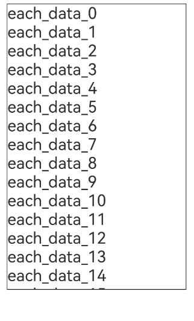 

**多种类型子组件**

Repeat提供渲染模板（template）能力，可以在同一个数据源中渲染多种子组件。每个数据项会根据[.templateId()](../../reference/apis-arkui/arkui-ts/ts-rendering-control-repeat.md#templateid)得到template type，从而渲染type对应的`.template()`中的子组件。

> **说明：**
>
> - `.template()`需要在[懒加载模式](#懒加载能力说明)下使用。
> - `.each()`等价于template type为空字符串的`.template()`。
> - 当多个template type相同时（包括template type为空字符串），Repeat仅生效最新定义的`.each()`或`.template()`。
> - 如果`.templateId()`缺省，或`templateId()`计算得到的template type不存在，则template type取默认值空字符串。
> - 只有相同template type的节点可以互相复用。

下列示例代码中使用Repeat组件进行循环渲染，并使用了多个渲染模板。

<!-- @[repeat_example_with_template](https://gitcode.com/openharmony/applications_app_samples/blob/master/code/DocsSample/ArkUISample/RenderingControl/entry/src/main/ets/pages/RenderingRepeat/RepeatExample2.ets) -->

``` TypeScript
// 在List容器组件中使用Repeat
@Entry
@ComponentV2 // 推荐使用V2装饰器
struct RepeatExampleWithTemplates {
  @Local dataArr: Array<string> = []; // 数据源

  aboutToAppear(): void {
    for (let i = 0; i < 50; i++) {
      this.dataArr.push(`data_${i}`); // 为数组添加一些数据
    }
  }

  build() {
    Column() {
      List() {
        Repeat<string>(this.dataArr)
          .each((ri: RepeatItem<string>) => { // 默认渲染模板
            ListItem() {
              Text('each_' + ri.item).fontSize(30).fontColor('rgb(161,10,33)') // 文本颜色为红色
            }
          })
          .key((item: string, index: number): string => JSON.stringify(item)) // 键值生成函数
          .virtualScroll({ totalCount: this.dataArr.length }) // 打开懒加载，totalCount为期望加载的数据长度
          .templateId((item: string, index: number): string => { // 根据返回值寻找对应的模板子组件进行渲染
            return index <= 4 ? 'A' : (index <= 10 ? 'B' : ''); // 前5个节点模板为A，接下来的6个为B，其余为默认模板
          })
          .template('A', (ri: RepeatItem<string>) => { // 'A'模板
            ListItem() {
              Text('A_' + ri.item).fontSize(30).fontColor('rgb(23,169,141)') // 文本颜色为绿色
            }
          }, { cachedCount: 3 }) // 'A'模板的缓存列表容量为3
          .template('B', (ri: RepeatItem<string>) => { // 'B'模板
            ListItem() {
              Text('B_' + ri.item).fontSize(30).fontColor('rgb(39,135,217)') // 文本颜色为蓝色
            }
          }, { cachedCount: 4 }) // 'B'模板的缓存列表容量为4
      }
      .cachedCount(2) // 容器组件的预加载区域大小
      .height('70%')
      .border({ width: 1 }) // 边框
    }
  }
}
```

运行后界面如下图所示：


### 键值生成规则

Repeat的[.key()](../../reference/apis-arkui/arkui-ts/ts-rendering-control-repeat.md#key)属性为每个子组件生成一个键值。Repeat通过键值识别数组增加、删除哪些数据以及哪些数据改变了位置（索引）。

当`.key()`缺省时，Repeat会生成新的随机键值。当发现有重复key时，Repeat会在已有键值的基础上递归生成新的键值，直到没有重复键值。

> **说明：**
>
> - 键值（key）与索引（index）的区别：键值是数据项的唯一标识符，Repeat根据键值是否发生变化判断数据项是否更新；索引只标识数据项在数组中的位置。
> - 在[懒加载模式](#懒加载能力说明)下，Repeat也会通过状态管理机制监听数据本身的变化，从而实现高效的更新。

键值生成函数`.key()`的使用限制：

- 即使数组发生变化，开发者也必须保证键值key唯一。
- 每次执行`.key()`函数时，使用相同的数据项作为输入，输出必须是一致的。
- 允许在`.key()`中使用index，但不建议开发者这样做。因为在数据项移动时索引index发生变化的同时key值也会改变，导致Repeat认为数据发生变化，从而触发子组件重新渲染，降低性能表现。
- 推荐将简单类型数组转换为类对象数组，并添加一个`readonly id`属性，在构造函数中初始化唯一值。

键值生成示例：

```ts
@ObservedV2
class ExampleData {
  @Trace str: string;
  num: number;

  constructor(s: string, n: number) {
    this.str = s;
    this.num = n;
  }
}

@Entry
@ComponentV2
struct Index {
  @Local exampleList: Array<ExampleData> = [];

  aboutToAppear(): void {
    for (let i = 0; i < 20; i++) {
      this.exampleList.push(new ExampleData(`data${i}`, i));
    }
  }

  build() {
    Column() {
      List({ space: 10 }) {
        Repeat(this.exampleList)
          .each((obj: RepeatItem<ExampleData>) => {
            ListItem() {
              Text(obj.item.str).fontSize(50)
            }
          })
          .key(item => item.str) // UI显示刷新与属性str相关，建议在键值生成函数中设置其为返回值，此处键值生成与index无关
      }
    }
  }
}
```

在上述示例代码中，使用`.key()`定义键值生成函数，各子组件的键值为item元素的str属性值。

### 懒加载能力说明

Repeat加载子节点具有懒加载和全量加载两种模式。开发者可通过设置[.virtualScroll()](../../reference/apis-arkui/arkui-ts/ts-rendering-control-repeat.md#virtualscroll)属性选择合适的加载模式。对于长列表场景，懒加载模式支持按需加载子组件，建议开发者优先使用懒加载模式。

**懒加载模式**

使用Repeat的`.virtualScroll()`属性，即可使能懒加载能力。在懒加载模式下，Repeat根据当前的容器组件显示区域和预加载区域范围，按需加载子组件。如下图所示：

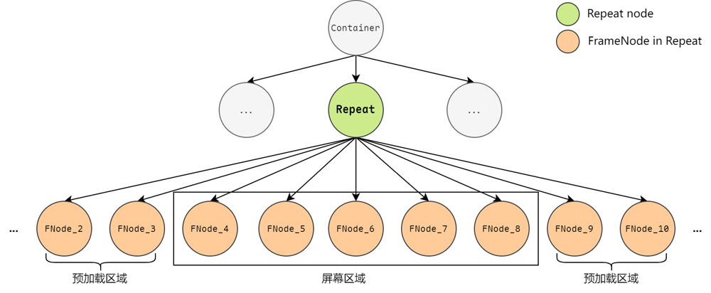

> **说明：**
>
> - 懒加载模式需要和滚动容器组件[List](../../reference/apis-arkui/arkui-ts/ts-container-list.md)、[ListItemGroup](../../reference/apis-arkui/arkui-ts/ts-container-listitemgroup.md)、[Grid](../../reference/apis-arkui/arkui-ts/ts-container-grid.md)、[Swiper](../../reference/apis-arkui/arkui-ts/ts-container-swiper.md)或[WaterFlow](../../reference/apis-arkui/arkui-ts/ts-container-waterflow.md)配合使用。
> - 懒加载模式需要和[状态管理（V2）](../state-management/arkts-state-management-overview.md#状态管理v2)配合使用。
> - 键值变化或数据变化均会触发页面刷新。

**全量加载模式**

当关闭Repeat的`.virtualScroll()`属性时（即省略该属性），Repeat在初始化页面时加载列表中的所有子组件，适合**短数据列表/组件全部加载**的场景。对于**长数据列表（数据长度大于30）**，如果关闭懒加载，Repeat会一次性加载全量子组件，此操作耗时长，不建议使用。

> **说明：**
>
> - 渲染模板特性（template）不可用。
> - 不受滚动容器组件的限制，可以在任意场景使用。
> - 支持与[状态管理（V1）](../state-management/arkts-state-management-overview.md#状态管理v1)配合使用。
> - 页面刷新取决于键值变化：如果更新前后键值相同，即使数据改变，页面也不会刷新。

### 节点更新/复用能力说明

Repeat具有节点复用能力。Repeat子组件从组件树中移除时，会被存入缓存池中。后续创建新子组件时，会优先复用池中的节点。懒加载模式和全量加载模式下的复用流程细节存在差异，下文中将分别进行说明。

Repeat组件默认开启节点复用功能。从API version 18开始，在懒加载模式下，可以通过配置`reusable`字段选择是否启用复用功能。为了提高渲染性能，建议开发者保持节点复用。代码示例见[VirtualScrollOptions](../../reference/apis-arkui/arkui-ts/ts-rendering-control-repeat.md#virtualscrolloptions)。

从API version 18开始，Repeat支持懒加载模式下[缓存池自定义组件冻结](../state-management/arkts-custom-components-freezeV2.md#repeat)。

从API version 18开始，Repeat允许在[.each()](../../reference/apis-arkui/arkui-ts/ts-rendering-control-repeat.md#each)中使用[@ReusableV2](../state-management/arkts-new-reusableV2.md)装饰的自定义组件。Repeat自身的复用能力优先于@ReusableV2的复用能力。在懒加载模式下，正常滑动场景、更新场景不会触发@ReusableV2的回收和复用，若开发者希望使用@ReusableV2的复用能力，建议关闭Repeat自身的复用能力。在全量加载模式下，删除、创建子组件会触发@ReusableV2的回收和复用。使用示例可参考[在Repeat组件中使用](../state-management/arkts-new-reusableV2.md#在repeat组件中使用)@ReusableV2。

> **说明：**
> 
> Repeat子组件的节点操作分为四种：节点创建、节点更新、节点复用、节点销毁。其中，节点更新和节点复用的区别为：
> 
> - 节点更新：节点不销毁，状态变量驱动节点属性更新。
> - 节点复用：旧节点不销毁，存储在空闲节点缓存池；需要创建新节点时，直接从缓存池中获取可复用的旧节点，并做相应的节点属性更新。
>
> Repeat节点复用时，不会触发子组件的[aboutToRecycle](../../../application-dev/reference/apis-arkui/arkui-ts/ts-custom-component-lifecycle.md#abouttorecycle10)和[aboutToReuse](../../../application-dev/reference/apis-arkui/arkui-ts/ts-custom-component-lifecycle.md#abouttoreuse10)生命周期。

**懒加载模式下的节点更新/复用**

在懒加载模式下，当**滚动容器组件滑动/数组改变**时，Repeat将失效的子组件节点（离开容器组件的显示区域和预加载区域）加入空闲节点缓存池中，即断开组件节点与页面组件树的连接但不销毁节点。在需要生成新的组件时，对缓存池里的组件节点进行复用。

下面通过**首次渲染**后典型的**滑动场景**和**数据更新场景**示例来展示Repeat子组件的渲染逻辑。

1. 首次渲染。

   定义长度为20的数组，数组前5项的template type为`aa`，渲染浅蓝色组件，其余项为`bb`，渲染橙色组件。`aa`缓存池容量为3，`bb`缓存池容量为4。容器组件的预加载区域大小为2。为了便于理解，在`aa`和`bb`缓存池中分别加入一个和两个空闲节点。

   首次渲染时列表的节点状态如下图所示（template type在图中简写为ttype）。

   

2. 滑动场景。

   将列表向下滑动一个节点的距离，Repeat会复用缓存池中的节点。

   1）index=10的节点进入预加载区域，计算出其template type为`bb`。由于`bb`缓存池非空，Repeat会从`bb`缓存池中取出一个空闲节点进行复用，更新其节点属性（数据item和索引index），该子组件中涉及数据item和索引index的其他孙子组件会根据[状态管理（V2）](../state-management/arkts-state-management-overview.md#状态管理v2)的规则做同步更新。<br/>
   2）index=0的节点滑出了预加载区域。当UI主线程空闲时，会检查`aa`缓存池是否已满，此时`aa`缓存池未满，将该节点加入到对应的缓存池中。<br/>
   3）其余节点仍在容器显示区域和预加载区域范围，均只更新索引index。如果对应template type的缓存池已满，Repeat会在UI主线程空闲时销毁掉多余的节点。

   

3. 数据更新场景。

   在上一小节的基础上做如下的数组更新操作，删除index=4的节点，修改节点数据`07`为`new`。

   1）删除index=4的节点后，节点`05`前移。根据template type的计算规则，新的`05`节点的template type变为`aa`，直接复用旧的`04`节点，更新数据item和索引index，并且将旧的`05`节点加入`bb`缓存池。<br/>
   2）后面的列表节点前移，新进入预加载区域的节点`11`会复用`bb`缓存池中的空闲节点，其他节点均只更新索引index。<br/>
   3）对于节点数据从`07`变为`new`的情况，页面监听到数据源变化将会触发重新渲染。Repeat数据更新触发重新渲染的逻辑是比较当前索引处节点数据item是否变化，以此判断是否进行UI刷新，仅改变键值不改变item的情况不会触发刷新。

   

**全量加载模式下的节点更新/复用**

在全量加载模式下，页面首次渲染时，Repeat子组件全部创建。数组发生改变后，Repeat对子组件节点的处理分为以下几个步骤：

首先，遍历旧数组键值。如果新数组中没有该键值，将其加入键值集合deletedKeys。

其次，遍历新数组键值。依次判断以下条件，进行符合条件的操作：

1. 若在旧数组中能找到相同键值，直接使用对应的子组件节点，并更新索引index。
2. 若deletedKeys非空，按照先进后出的顺序，更新该集合中的键值所对应的节点。
3. 若deletedKeys为空，则表示没有可以更新的节点，需要创建新节点。

最后，如果新数组键值遍历结束后，deletedKeys非空，则销毁集合中的键值所对应的节点。

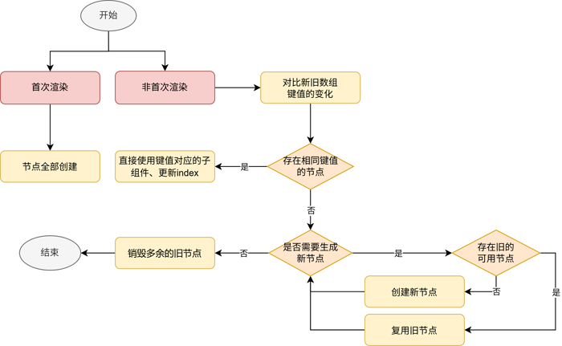

以下图中的数组变化为例，图中的`item_X`表示数据项的键值key。

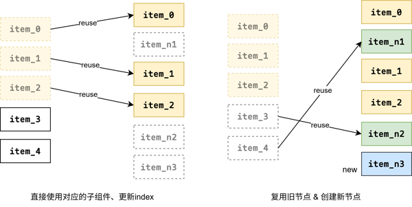

根据上述判断逻辑：`item_0`没有变化，`item_1`和`item_2`只更新了索引，`item_n1`和`item_n2`分别由`item_4`和`item_3`进行节点更新获得，`item_n3`为新创建的节点。

> **说明：**
> 
> Repeat全量加载模式与[ForEach](./arkts-rendering-control-foreach.md)组件的区别：
> - 针对特定数组更新场景的渲染性能进行了优化。
> - 将子组件的内容/索引管理职责转移至框架层面。

**示例：**

以下示例演示了全量加载模式下的节点更新。

<!-- @[repeat_demo](https://gitcode.com/openharmony/applications_app_samples/blob/master/code/DocsSample/ArkUISample/RenderingControl/entry/src/main/ets/pages/RenderingRepeat/NodeUpdateMechanism.ets) -->

``` TypeScript
@Entry
@ComponentV2
struct NodeUpdateMechanism {
  @Local simpleList: Array<string> = ['one', 'two', 'three'];

  build() {
    Row() {
      Column() {
        Text('Click to change the value of the third array item')
          .fontSize(24)
          .fontColor(Color.Red)
          .onClick(() => {
            this.simpleList[2] = 'new three';
          })

        Repeat<string>(this.simpleList)
          .each((obj: RepeatItem<string>)=>{
            ChildItem({ item: obj.item })
              .margin({top: 20})
          })
          .key((item: string) => item)
      }
      .justifyContent(FlexAlign.Center)
      .width('100%')
      .height('100%')
    }
    .height('100%')
    .backgroundColor(0xF1F3F5)
  }
}

@ComponentV2
struct ChildItem {
  @Param @Require item: string;

  build() {
    Text(this.item)
      .fontSize(30)
  }
}
```

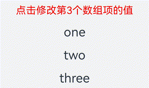

点击红色字体，第三个数据项发生变化（直接使用旧的组件节点，仅刷新数据）。

**节点复用情况查看**

查看节点是否为复用可以使用[DevEco Testing](https://developer.huawei.com/consumer/cn/doc/harmonyos-guides/deveco-testing)工具进行查看，进入DevEco Testing工具后，选择实用工具，界面如下：


在实用工具中选择UIViewer，该工具可以获取设备快照、控件树信息及控件节点属性，在右侧的控件树中选择Repeat子节点，右下方的节点属性会显示节点ID等信息，可以通过节点ID是否相同，判断组件复用或者新建的情况。

## 高级特性

除循环渲染、懒加载、组件复用等能力外，Repeat还提供了数据精准懒加载、拖拽排序、数据前插保持等高级特性，开发者可按需使用。

### 数据精准懒加载

当数据源总长度较长，或数据项加载耗时较长时，可使用Repeat数据精准懒加载特性，避免在初始化时加载所有数据。Repeat数据精准懒加载特性从API version 19开始支持。

开发者可以设置`.virtualScroll()`的`totalCount`属性值或`onTotalCount`自定义方法用于计算期望加载的数据项总数，设置`onLazyLoading`属性实现数据精准懒加载，实现在节点首次渲染时加载对应的数据。详细说明和注意事项见[VirtualScrollOptions](../../reference/apis-arkui/arkui-ts/ts-rendering-control-repeat.md#virtualscrolloptions)。

**示例1**

数据源总长度较长，在首次渲染、滑动屏幕、跳转显示区域时，动态加载对应区域内的数据。

<!-- @[repeat_lazy_loading_one](https://gitcode.com/openharmony/applications_app_samples/blob/master/code/DocsSample/ArkUISample/RenderingControl/entry/src/main/ets/pages/RenderingRepeat/RepeatLazyLoading1.ets) -->

``` TypeScript
@Entry
@ComponentV2
struct RepeatLazyLoadingLongData {
  // 假设数据源总长度较长，为1000。初始数组未提供数据。
  @Local arr: Array<string> = [];
  scroller: Scroller = new Scroller();

  build() {
    Column({ space: 5 }) {
      // 初始显示位置为index = 100，数据可通过懒加载自动获取。
      List({ scroller: this.scroller, space: 5, initialIndex: 100 }) {
        Repeat(this.arr)
          .virtualScroll({
            // 期望的数据源总长度为1000。
            onTotalCount: () => {
              return 1000;
            },
            // 实现数据懒加载。
            onLazyLoading: (index: number) => {
              this.arr[index] = index.toString();
            }
          })
          .each((obj: RepeatItem<string>) => {
            ListItem() {
              Row({ space: 5 }) {
                Text(`${obj.index}: Item_${obj.item}`)
              }
            }
            .height(50)
          })
      }
      .height('80%')
      .border({ width: 1 })

      // 显示位置跳转至index = 500，数据可通过懒加载自动获取。
      Button('ScrollToIndex 500')
        .onClick(() => {
          this.scroller.scrollToIndex(500);
        })
    }
  }
}
```

运行效果：


**示例2**

数据加载耗时长，在onLazyLoading方法中，首先为数据项创建占位符，再通过异步任务加载数据。

<!-- @[repeat_lazy_loading_two](https://gitcode.com/openharmony/applications_app_samples/blob/master/code/DocsSample/ArkUISample/RenderingControl/entry/src/main/ets/pages/RenderingRepeat/RepeatLazyLoading2.ets) -->

``` TypeScript
@Entry
@ComponentV2
struct RepeatLazyLoadingSync {
  @Local arr: Array<string> = [];

  build() {
    Column({ space: 5 }) {
      List({ space: 5 }) {
        Repeat(this.arr)
          .virtualScroll({
            onTotalCount: () => {
              return 100;
            },
            // 实现数据懒加载。
            onLazyLoading: (index: number) => {
              // 创建占位符。
              this.arr[index] = '';
              // 模拟高耗时加载过程，通过异步任务加载数据。
              setTimeout(() => {
                this.arr[index] = index.toString();
              }, 1000);
            }
          })
          .each((obj: RepeatItem<string>) => {
            ListItem() {
              Row({ space: 5 }) {
                Text(`${obj.index}: Item_${obj.item}`)
              }
            }
            .height(50)
          })
      }
      .height('100%')
      .border({ width: 1 })
    }
  }
}
```

运行效果：


**示例3**

使用数据懒加载，并配合设置`onTotalCount: () => { return this.arr.length + 1; }`，可实现数据无限懒加载。

> **说明：** 
>
> - 此场景下，开发者需要提供首屏显示所需的初始数据，并建议设置父容器组件[cachedCount](../../reference/apis-arkui/arkui-ts/ts-container-list.md#cachedcount) > 0，否则将会导致渲染异常。
> - 若与[Swiper-Loop](../../reference/apis-arkui/arkui-ts/ts-container-swiper.md#loop)模式同时使用，停留在`index = 0`处时，将导致onLazyLoading方法被持续触发，建议避免与Swiper-Loop模式同时使用。
> - 开发者需要关注内存消耗情况，避免因数据持续加载而导致内存过量消耗。

<!-- @[repeat_lazy_loading_three](https://gitcode.com/openharmony/applications_app_samples/blob/master/code/DocsSample/ArkUISample/RenderingControl/entry/src/main/ets/pages/RenderingRepeat/RepeatLazyLoading3.ets) -->

``` TypeScript
@Entry
@ComponentV2
struct RepeatLazyLoadingInfinite {
  @Local arr: Array<string> = [];

  // 提供首屏显示所需的初始数据。
  aboutToAppear(): void {
    for (let i = 0; i < 15; i++) {
      this.arr.push(i.toString());
    }
  }

  build() {
    Column({ space: 5 }) {
      List({ space: 5 }) {
        Repeat(this.arr)
          .virtualScroll({
            // 数据无限懒加载。
            onTotalCount: () => {
              return this.arr.length + 1;
            },
            onLazyLoading: (index: number) => {
              this.arr[index] = index.toString();
            }
          })
          .each((obj: RepeatItem<string>) => {
            ListItem() {
              Row({ space: 5 }) {
                Text(`${obj.index}: Item_${obj.item}`)
              }
            }
            .height(50)
          })
      }
      .height('100%')
      .border({ width: 1 })
      // 建议设置cachedCount > 0。
      .cachedCount(1)
    }
  }
}
```

运行效果：


### 拖拽排序

当Repeat在[List](../../reference/apis-arkui/arkui-ts/ts-container-list.md)组件下使用，并且设置了[onMove](../../reference/apis-arkui/arkui-ts/ts-universal-attributes-drag-sorting.md#onmove)事件，Repeat每次迭代都生成一个[ListItem](../../reference/apis-arkui/arkui-ts/ts-container-listitem.md)时，可以使能拖拽排序。Repeat拖拽排序特性从API version 19开始支持。

> **说明：**
>
> - 拖拽排序离手后，如果数据位置发生变化，则会触发onMove事件，上报数据移动原始索引号和目标索引号。<br/>在onMove事件中，需要根据上报的起始索引号和目标索引号修改数据源。数据源修改前后，要保持每个数据的键值不变，只是顺序发生变化，才能保证落位动画正常执行。
> - 拖拽排序过程中，在离手之前，不允许修改数据源。

示例代码：

<!-- @[repeat_scroll_on_move](https://gitcode.com/openharmony/applications_app_samples/blob/master/code/DocsSample/ArkUISample/RenderingControl/entry/src/main/ets/pages/RenderingRepeat/RepeatVirtualScrollOnMove.ets) -->

``` TypeScript
@Entry
@ComponentV2
struct RepeatVirtualScrollOnMove {
  @Local simpleList: Array<string> = [];

  aboutToAppear(): void {
    for (let i = 0; i < 100; i++) {
      this.simpleList.push(`${i}`);
    }
  }

  build() {
    Column() {
      List() {
        Repeat<string>(this.simpleList)
        // 通过设置onMove，使能拖拽排序。
          .onMove((from: number, to: number) => {
            let temp = this.simpleList.splice(from, 1);
            this.simpleList.splice(to, 0, temp[0]);
          })
          .each((obj: RepeatItem<string>) => {
            ListItem() {
              Text(obj.item)
                .fontSize(16)
                .textAlign(TextAlign.Center)
                .size({ height: 100, width: '100%' })
            }.margin(10)
            .borderRadius(10)
            .backgroundColor('#FFFFFFFF')
          })
          .key((item: string, index: number) => {
            return item;
          })
          .virtualScroll({ totalCount: this.simpleList.length })
      }
      .border({ width: 1 })
      .backgroundColor('#FFDCDCDC')
      .width('100%')
      .height('100%')
    }
  }
}
```

运行效果：


### 数据前插保持

数据前插保持，即在列表显示区域之前插入或删除数据后，保持显示区域子组件的滚动位置不变。

从API version 20开始，仅当父容器组件为[List](../../reference/apis-arkui/arkui-ts/ts-container-list.md)且[maintainVisibleContentPosition](../../reference/apis-arkui/arkui-ts/ts-container-list.md#maintainvisiblecontentposition12)属性设置为true后，在List显示区域之前插入或删除数据时保持List显示区域子组件位置不变。

**示例代码**

<!-- @[repeat_pre_insert](https://gitcode.com/openharmony/applications_app_samples/blob/master/code/DocsSample/ArkUISample/RenderingControl/entry/src/main/ets/pages/RenderingRepeat/PreInsert.ets) -->

``` TypeScript
@Entry
@ComponentV2
struct PreInsertDemo {
  @Local simpleList: Array<string> = [];
  private cnt: number = 1;

  aboutToAppear(): void {
    for (let i = 0; i < 30; i++) {
      this.simpleList.push(`Hello ${this.cnt++}`);
    }
  }

  build() {
    Column() {
      Row() {
        Button(`insert #5`)
          .onClick(() => {
            this.simpleList.splice(5, 0, `Hello ${this.cnt++}`);
          })
        Button(`delete #0`)
          .onClick(() => {
            this.simpleList.splice(0, 1);
          })
      }

      List({ initialIndex: 5 }) {
        Repeat<string>(this.simpleList)
          .each((obj: RepeatItem<string>) => {
            ListItem() {
              Row() {
                Text(`index: ${obj.index}  `)
                  .fontSize(16)
                  .fontColor('#70707070')
                  .textAlign(TextAlign.End)
                  .size({ height: 100, width: '40%' })
                Text(`item: ${obj.item}`)
                  .fontSize(16)
                  .textAlign(TextAlign.Start)
                  .size({ height: 100, width: '60%' })
              }
            }.margin(10)
            .borderRadius(10)
            .backgroundColor('#FFFFFFFF')
          })
          .key((item: string, index: number) => item)
          .virtualScroll({ totalCount: this.simpleList.length })
      }
      .maintainVisibleContentPosition(true) // 启用前插保持
      .border({ width: 1 })
      .backgroundColor('#FFDCDCDC')
      .width('100%')
      .height('100%')
    }
  }
}
```

示例中，通过点击按钮在显示区域上方插入或删除数据时，显示区域的节点仅index发生改变，对应数据项不变。

运行效果：

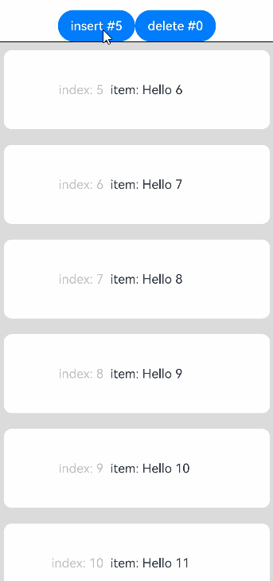

### animateTo动效

从API version 24开始，当父容器组件为[List](../../reference/apis-arkui/arkui-ts/ts-container-list.md)时，Repeat支持通过[animateTo](../../reference/apis-arkui/arkts-apis-uicontext-uicontext.md#animateto)接口为其显示区域内的子组件设置过渡动画效果。

Repeat子组件过渡动画的判定规则如下：
1. 子组件从外部进入显示区域和预加载区域时，将被判定为插入组件。
2. 子组件从内部离开显示区域和预加载区域时，将被判定为删除组件（仅懒加载模式）。
3. 子组件更新时，若键值发生变化，将被判定为删除旧组件，插入新组件。
4. 删除子组件，并在过渡动画结束前重新插入该组件，将被判定为插入新组件，原过渡动画不受影响。
5. 过渡动画中的子组件，滑出显示区域和预加载区域时，动画将直接结束（仅懒加载模式）。

> **说明：**
>
> - 仅支持与List配合使用，与其他容器组件配合使用时的动画效果为未定义行为。
> - 仅支持显示区域内子组件的动画效果，显示区域外子组件的动画效果为未定义行为。
> - 过渡动画具体设置方式和动画效果请参考[animateTo](../../reference/apis-arkui/arkts-apis-uicontext-uicontext.md#animateto)接口。

**示例代码**

<!-- @[repeat_animation](https://gitcode.com/openharmony/applications_app_samples/blob/master/code/DocsSample/ArkUISample/RenderingControl/entry/src/main/ets/pages/RenderingRepeat/RepeatAnimation.ets) -->

``` TypeScript

@Entry
@ComponentV2
struct RepeatAnimationDemo {
  @Local dataArray: ItemInfo[] = [];
  private count: number = 0;

  aboutToAppear(): void {
    for (let i = 0; i < 5; i++) {
      this.dataArray.push(new ItemInfo(`Item ${i}`, `#FFFFFF`));
    }
  }

  build() {
    Column({ space: 5 }) {
      Row({ space: 5 }) {
        Button('Add')
          .onClick(() => {
            // 为插入子组件设置动画
            this.getUIContext()?.animateTo({ duration: 1000 }, () => {
              this.dataArray.splice(0, 0, new ItemInfo(`New item ${this.count++}`, `#FFFFFF`))
            })
          })
        Button('Delete')
          .onClick(() => {
            // 为删除子组件设置动画
            this.getUIContext()?.animateTo({ duration: 1000 }, () => {
              this.dataArray.splice(0, 1)
            })
          })
        Button('Exchange')
          .onClick(() => {
            // 为交换子组件设置动画
            this.getUIContext()?.animateTo({ duration: 1000 }, () => {
              let temp = this.dataArray[1];
              this.dataArray[1] = this.dataArray[0]
              this.dataArray[0] = temp;
            })
          })
        Button('Update')
          .onClick(() => {
            // 为更新子组件设置动画
            this.getUIContext()?.animateTo({ duration: 1000 }, () => {
              this.dataArray[0].info = 'Item updated';
              this.dataArray[0].color = '#86C5E3';
            })
          })
      }
      List({ space: 5 }) {
        Repeat(this.dataArray)
          .each((repeatItem) => {
            ListItem() {
              Text(repeatItem.item.info)
            }
            .backgroundColor(repeatItem.item.color)
            .width(150)
            .height(50)
            .border({ width: 1 })
            // 设置子组件插入和删除时的过渡效果
            .transition(TransitionEffect.translate({ x: 300 }))
          })
          .key((item: ItemInfo, index: number) => item.key)
          .virtualScroll()
      }
      .alignListItem(ListItemAlign.Center)
    }
    .width('100%')
  }
}

@ObservedV2
class ItemInfo {
  @Trace public info: string;
  @Trace public color: string;
  public key: string;
  constructor(info: string, color: string) {
    this.info = info;
    this.color = color;
    this.key = info;
  }
}
```

运行效果：


## 常见使用场景

### 数据展示&操作

下面的代码示例展示了Repeat修改数组的常见操作，包括**插入数据、修改数据、删除数据、交换数据**。点击下拉框选择索引index值，点击相应的按钮即可操作数据项，依次点击两个不同的数据项可以进行交换。


<!-- @[repeat_scroll_two](https://gitcode.com/openharmony/applications_app_samples/blob/master/code/DocsSample/ArkUISample/RenderingControl/entry/src/main/ets/pages/RenderingRepeat/RepeatVirtualScroll2T.ets) -->

``` TypeScript
@ObservedV2
class Repeat006Clazz {
  @Trace public message: string = '';

  constructor(message: string) {
    this.message = message;
  }
}

@Entry
@ComponentV2
struct RepeatVirtualScroll {
  @Local simpleList: Array<Repeat006Clazz> = [];
  private exchange: number[] = [];
  private counter: number = 0;
  @Local selectOptions: SelectOption[] = [];
  @Local selectIdx: number = 0;

  @Monitor('simpleList')
  reloadSelectOptions(): void {
    this.selectOptions = [];
    for (let i = 0; i < this.simpleList.length; ++i) {
      this.selectOptions.push({ value: i.toString() });
    }
    if (this.selectIdx >= this.simpleList.length) {
      this.selectIdx = this.simpleList.length - 1;
    }
  }

  aboutToAppear(): void {
    for (let i = 0; i < 100; i++) {
      this.simpleList.push(new Repeat006Clazz(`item_${i}`));
    }
    this.reloadSelectOptions();
  }

  handleExchange(idx: number): void { // 点击交换子组件
    this.exchange.push(idx);
    if (this.exchange.length === 2) {
      let _a = this.exchange[0];
      let _b = this.exchange[1];
      let temp: Repeat006Clazz = this.simpleList[_a];
      this.simpleList[_a] = this.simpleList[_b];
      this.simpleList[_b] = temp;
      this.exchange = [];
    }
  }

  build() {
    Column({ space: 10 }) {
      Text('virtualScroll each()&template() 2t')
        .fontSize(15)
        .fontColor(Color.Gray)
      Text('Select an index and press the button to update data.')
        .fontSize(15)
        .fontColor(Color.Gray)

      Select(this.selectOptions)
        .selected(this.selectIdx)
        .value(this.selectIdx.toString())
        .key('selectIdx')
        .onSelect((index: number) => {
          this.selectIdx = index;
        })
      Row({ space: 5 }) {
        Button('Add No.' + this.selectIdx)
          .onClick(() => {
            this.simpleList.splice(this.selectIdx, 0, new Repeat006Clazz(`${this.counter++}_add_item`));
            this.reloadSelectOptions();
          })
        Button('Modify No.' + this.selectIdx)
          .onClick(() => {
            this.simpleList.splice(this.selectIdx, 1, new Repeat006Clazz(`${this.counter++}_modify_item`));
          })
        Button('Del No.' + this.selectIdx)
          .onClick(() => {
            this.simpleList.splice(this.selectIdx, 1);
            this.reloadSelectOptions();
          })
      }
      Button('Update array length to 5')
        .onClick(() => {
          this.simpleList = this.simpleList.slice(0, 5);
          this.reloadSelectOptions();
        })

      Text('Click on two items to exchange')
        .fontSize(15)
        .fontColor(Color.Gray)

      List({ space: 10 }) {
        Repeat<Repeat006Clazz>(this.simpleList)
          .each((obj: RepeatItem<Repeat006Clazz>) => {
            ListItem() {
              Text(`[each] index${obj.index}: ${obj.item.message}`)
                .fontSize(25)
                .onClick(() => {
                  this.handleExchange(obj.index);
                })
            }
          })
          .key((item: Repeat006Clazz, index: number) => {
            return item.message;
          })
          .virtualScroll({ totalCount: this.simpleList.length })
          .templateId((item: Repeat006Clazz, index: number) => {
            return (index % 2 === 0) ? 'even' : 'odd';
          })
          .template('odd', (ri) => {
            ListItem() {
              Text(`[odd] index${ri.index}: ${ri.item.message}`)
                .fontSize(25)
                .fontColor(Color.Blue)
                .onClick(() => {
                  this.handleExchange(ri.index);
                })
            }
          }, { cachedCount: 3 })
          .template('even', (ri) => {
            ListItem() {
              Text(`[even] index${ri.index}: ${ri.item.message}`)
                .fontSize(25)
                .fontColor(Color.Green)
                .onClick(() => {
                  this.handleExchange(ri.index);
                })
            }
          }, { cachedCount: 1 })
      }
      .cachedCount(2)
      .border({ width: 1 })
      .width('95%')
      .height('40%')
    }
    .justifyContent(FlexAlign.Center)
    .width('100%')
    .height('100%')
  }
}
```

该示例代码展示了100项自定义类`Repeat006Clazz`的`message`字符串属性，[List](../../reference/apis-arkui/arkui-ts/ts-container-list.md)组件的[cachedCount](../../reference/apis-arkui/arkui-ts/ts-container-list.md#cachedcount)属性设为2，模板'odd'和'even'的空闲节点缓存池大小分别设为3和1。运行后界面如下图所示：

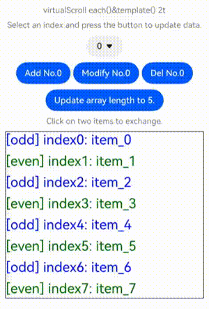

### Repeat嵌套

Repeat支持嵌套使用，示例代码如下：

<!-- @[repeat_nest](https://gitcode.com/openharmony/applications_app_samples/blob/master/code/DocsSample/ArkUISample/RenderingControl/entry/src/main/ets/pages/RenderingRepeat/NestedRepeat.ets) -->

``` TypeScript
// Repeat嵌套
@Entry
@ComponentV2
struct NestedRepeat {
  @Local outerList: string[] = [];
  @Local innerList: number[] = [];

  aboutToAppear(): void {
    for (let i = 0; i < 20; i++) {
      this.outerList.push(i.toString());
      this.innerList.push(i);
    }
  }

  build() {
    Column({ space: 20 }) {
      Text('Nested Repeat with virtualScroll')
        .fontSize(15)
        .fontColor(Color.Gray)
      List() {
        Repeat<string>(this.outerList)
          .each((obj) => {
            ListItem() {
              Column() {
                Text('outerList item: ' + obj.item)
                  .fontSize(30)
                List() {
                  Repeat<number>(this.innerList)
                    .each((subObj) => {
                      ListItem() {
                        Text('innerList item: ' + subObj.item)
                          .fontSize(20)
                      }
                    })
                    .key((item) => 'innerList_' + item)
                    .virtualScroll()
                }
                .width('80%')
                .border({ width: 1 })
                .backgroundColor(Color.Orange)
              }
              .height('30%')
              .backgroundColor(Color.Pink)
            }
            .border({ width: 1 })
          })
          .key((item) => 'outerList_' + item)
          .virtualScroll()
      }
      .width('80%')
      .border({ width: 1 })
    }
    .justifyContent(FlexAlign.Center)
    .width('90%')
    .height('80%')
  }
}
```

运行效果：

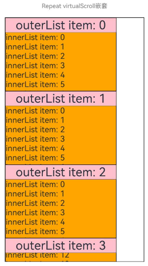

### 父容器组件应用场景

本节展示Repeat与滚动容器组件的常见应用场景。

**与List组合使用**

在[List](../../reference/apis-arkui/arkui-ts/ts-container-list.md)容器组件中使用Repeat，示例代码如下：

<!-- @[repeat_list](https://gitcode.com/openharmony/applications_app_samples/blob/master/code/DocsSample/ArkUISample/RenderingControl/entry/src/main/ets/pages/RenderingRepeat/DemoList.ets) -->

``` TypeScript
class DemoListItemInfo {
  public name: string;
  public icon: Resource;

  constructor(name: string, icon: Resource) {
    this.name = name;
    this.icon = icon;
  }
}

@Entry
@ComponentV2
struct DemoList {
  @Local videoList: Array<DemoListItemInfo> = [];

  aboutToAppear(): void {
    for (let i = 0; i < 10; i++) {
      // 此处app.media.listItem0、app.media.listItem1、app.media.listItem2仅作示例，请开发者自行替换
      this.videoList.push(new DemoListItemInfo('Video' + i,
        i % 3 == 0 ? $r('app.media.listItem0') :
          i % 3 == 1 ? $r('app.media.listItem1') : $r('app.media.listItem2')));
    }
  }

  @Builder
  itemEnd(index: number) {
    Button('Delete')
      .backgroundColor(Color.Red)
      .onClick(() => {
        this.videoList.splice(index, 1);
      })
  }

  build() {
    Column({ space: 10 }) {
      Text('List Contains the Repeat Component')
        .fontSize(15)
        .fontColor(Color.Gray)

      List({ space: 5 }) {
        Repeat<DemoListItemInfo>(this.videoList)
          .each((obj: RepeatItem<DemoListItemInfo>) => {
            ListItem() {
              Column() {
                Image(obj.item.icon)
                  .width('80%')
                  .margin(10)
                Text(obj.item.name)
                  .fontSize(20)
              }
            }
            .swipeAction({
              end: {
                builder: () => {
                  this.itemEnd(obj.index);
                }
              }
            })
            .onAppear(() => {
            })
          })
          .key((item: DemoListItemInfo) => item.name)
          .virtualScroll()
      }
      .cachedCount(2)
      .height('90%')
      .border({ width: 1 })
      .listDirection(Axis.Vertical)
      .alignListItem(ListItemAlign.Center)
      .divider({
        strokeWidth: 1,
        startMargin: 60,
        endMargin: 60,
        color: '#ffe9f0f0'
      })

      Row({ space: 10 }) {
        Button('Delete No.1')
          .onClick(() => {
            this.videoList.splice(0, 1);
          })
        Button('Delete No.5')
          .onClick(() => {
            this.videoList.splice(4, 1);
          })
      }
    }
    .width('100%')
    .height('100%')
    .justifyContent(FlexAlign.Center)
  }
}
```

右滑并点击按钮，或点击底部按钮，可删除视频卡片：

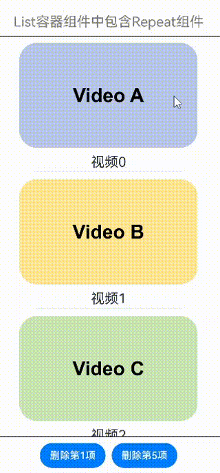

**与Grid组合使用**

在[Grid](../../reference/apis-arkui/arkui-ts/ts-container-grid.md)容器组件中使用Repeat，示例如下：

<!-- @[repeat_grid](https://gitcode.com/openharmony/applications_app_samples/blob/master/code/DocsSample/ArkUISample/RenderingControl/entry/src/main/ets/pages/RenderingRepeat/DemoGrid.ets) -->

``` TypeScript
import { hilog } from '@kit.PerformanceAnalysisKit';
const TAG = '[Sample_RenderingControl]';
const DOMAIN = 0xF811;

class DemoGridItemInfo {
  public name: string;
  public icon: Resource;

  constructor(name: string, icon: Resource) {
    this.name = name;
    this.icon = icon;
  }
}

@Entry
@ComponentV2
struct DemoGrid {
  @Local itemList: Array<DemoGridItemInfo> = [];
  @Local isRefreshing: boolean = false;
  private layoutOptions: GridLayoutOptions = {
    regularSize: [1, 1],
    irregularIndexes: [10]
  };
  private gridScroller: Scroller = new Scroller();
  private num: number = 0;

  aboutToAppear(): void {
    for (let i = 0; i < 10; i++) {
      // 此处app.media.gridItem0、app.media.gridItem1、app.media.gridItem2仅作示例，请开发者自行替换
      this.itemList.push(new DemoGridItemInfo('Video' + i,
        i % 3 == 0 ? $r('app.media.gridItem0') :
          i % 3 == 1 ? $r('app.media.gridItem1') : $r('app.media.gridItem2')));
    }
  }

  build() {
    Column({ space: 10 }) {
      Text('Grid Contains the Repeat Component')
        .fontSize(15)
        .fontColor(Color.Gray)

      Refresh({ refreshing: $$this.isRefreshing }) {
        Grid(this.gridScroller, this.layoutOptions) {
          Repeat<DemoGridItemInfo>(this.itemList)
            .each((obj: RepeatItem<DemoGridItemInfo>) => {
              if (obj.index === 10 ) {
                GridItem() {
                  Text('Last viewed here. Touch to refresh.')
                    .fontSize(20)
                }
                .height(30)
                .border({ width: 1 })
                .onClick(() => {
                  this.gridScroller.scrollToIndex(0);
                  this.isRefreshing = true;
                })
                .onAppear(() => {
                  hilog.info(DOMAIN, TAG, 'AceTag', obj.item.name);
                })
              } else {
                GridItem() {
                  Column() {
                    Image(obj.item.icon)
                      .width('100%')
                      .height(80)
                      .objectFit(ImageFit.Cover)
                      .borderRadius({ topLeft: 16, topRight: 16 })
                    Text(obj.item.name)
                      .fontSize(15)
                      .height(20)
                  }
                }
                .height(100)
                .borderRadius(16)
                .backgroundColor(Color.White)
                .onAppear(() => {
                  hilog.info(DOMAIN, TAG, 'AceTag', obj.item.name);
                })
              }
            })
            .key((item: DemoGridItemInfo) => item.name)
            .virtualScroll()
        }
        .columnsTemplate('repeat(auto-fit, 150)')
        .cachedCount(4)
        .rowsGap(15)
        .columnsGap(10)
        .height('100%')
        .padding(10)
        .backgroundColor('#F1F3F5')
      }
      .onRefreshing(() => {
        setTimeout(() => {
          this.itemList.splice(10, 1);
          this.itemList.unshift(new DemoGridItemInfo('refresh', $r('app.media.gridItem0'))); // 此处app.media.gridItem0仅作示例，请开发者自行替换
          for (let i = 0; i < 10; i++) {
            // 此处app.media.gridItem0、app.media.gridItem1、app.media.gridItem2仅作示例，请开发者自行替换
            this.itemList.unshift(new DemoGridItemInfo('New video' + this.num,
              i % 3 == 0 ? $r('app.media.gridItem0') :
                i % 3 == 1 ? $r('app.media.gridItem1') : $r('app.media.gridItem2')));
            this.num++;
          }
          this.isRefreshing = false;
        }, 1000);
      })
      .refreshOffset(64)
      .pullToRefresh(true)
      .width('100%')
      .height('85%')

      Button('Refresh')
        .onClick(() => {
          this.gridScroller.scrollToIndex(0);
          this.isRefreshing = true;
        })
    }
    .width('100%')
    .height('100%')
    .justifyContent(FlexAlign.Center)
  }
}
```

下拉屏幕，或点击刷新按钮，或点击“先前浏览至此，点击刷新”，可加载新的视频内容：

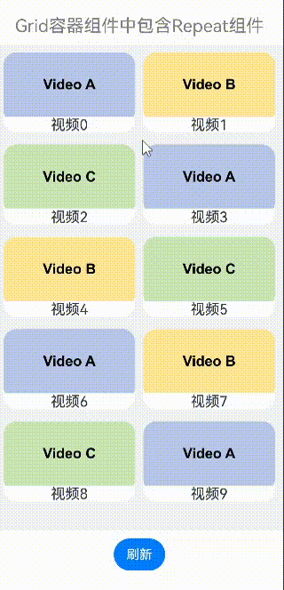

**与Swiper组合使用**

在[Swiper](../../reference/apis-arkui/arkui-ts/ts-container-swiper.md)容器组件中使用Repeat，示例如下：

<!-- @[repeat_swiper](https://gitcode.com/openharmony/applications_app_samples/blob/master/code/DocsSample/ArkUISample/RenderingControl/entry/src/main/ets/pages/RenderingRepeat/DemoSwiper.ets) -->

``` TypeScript
const remotePictures: string[] = [
  'common/image/image1.png', // 请填写具体的图片地址
  'common/image/image2.png',
  'common/image/image3.png',
];

@ObservedV2
class DemoSwiperItemInfo {
  public id: string;
  @Trace public url: string = 'default';

  constructor(id: string) {
    this.id = id;
  }
}

@Entry
@ComponentV2
struct DemoSwiper {
  @Local pics: Array<DemoSwiperItemInfo> = [];

  aboutToAppear(): void {
    for (let i = 0; i < 3; i++) {
      this.pics.push(new DemoSwiperItemInfo('pic' + i));
    }
    setTimeout(() => {
      this.pics[0].url = remotePictures[0];
    }, 1000);
  }

  build() {
    Column() {
      Text('Swiper Contains the Repeat Component')
        .fontSize(15)
        .fontColor(Color.Gray)

      Stack() {
        Text('Loading...')
          .fontSize(15)
          .fontColor(Color.Gray)
        Swiper() {
          Repeat(this.pics)
            .each((obj: RepeatItem<DemoSwiperItemInfo>) => {
              Image(obj.item.url)
                .onAppear(() => {
                })
            })
            .key((item: DemoSwiperItemInfo) => item.id)
            .virtualScroll()
        }
        .cachedCount(9)
        .height('50%')
        .loop(false)
        .indicator(true)
        .onChange((index) => {
          setTimeout(() => {
            this.pics[index].url = remotePictures[index];
          }, 1000);
        })
      }
      .width('100%')
      .height('100%')
      .backgroundColor(Color.Black)
    }
  }
}
```

定时1秒后加载图片，模拟网络延迟：

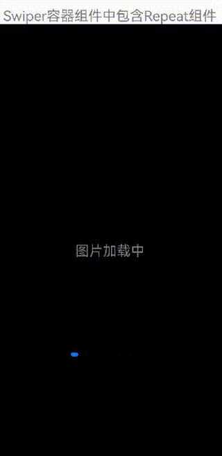

## 常见问题

### 显示区域外增删数据时保持滚动位置不变

下面的场景示例中，滚动列表显示区域外的增删数据操作将影响[List](../../reference/apis-arkui/arkui-ts/ts-container-list.md)列表滚动条停留的位置：

在List组件中声明Repeat组件，实现key值生成逻辑和each逻辑（如下示例代码），点击按钮“insert”，在屏幕显示的第一个元素前面插入一个元素，列表显示区域数据向下滚动。

<!-- @[repeat_single](https://gitcode.com/openharmony/applications_app_samples/blob/master/code/DocsSample/ArkUISample/RenderingControl/entry/src/main/ets/pages/RenderingRepeat/RepeatTemplateSingle.ets) -->

``` TypeScript
// 定义一个类，标记为可观察的
// 类中自定义一个数组，标记为可追踪的
@ObservedV2
class ArrayHolder {
  @Trace public arr: Array<number> = [];

  // constructor，用于初始化数组个数
  constructor(count: number) {
    for (let i = 0; i < count; i++) {
      this.arr.push(i);
    }
  }
}

@Entry
@ComponentV2
struct RepeatTemplateSingle {
  @Local arrayHolder: ArrayHolder = new ArrayHolder(100);
  @Local totalCount: number = this.arrayHolder.arr.length;
  scroller: Scroller = new Scroller();

  build() {
    Column({ space: 5 }) {
      List({ space: 20, initialIndex: 19, scroller: this.scroller }) {
        Repeat(this.arrayHolder.arr)
          .virtualScroll({ totalCount: this.totalCount })
          .templateId((item, index) => {
            return 'number';
          })
          .template('number', (r) => {
            ListItem() {
              Text(r.index! + ':' + r.item + 'Reuse');
            }
          })
          .each((r) => {
            ListItem() {
              Text(r.index! + ':' + r.item + 'eachMessage');
            }
          })
      }
      .height('30%')

      Button(`insert totalCount ${this.totalCount}`)
        .height(60)
        .onClick(() => {
          // 插入元素，元素位置为屏幕显示的前一个元素
          this.arrayHolder.arr.splice(18, 0, this.totalCount);
          this.totalCount = this.arrayHolder.arr.length;
        })
    }
    .width('100%')
    .margin({ top: 5 })
  }
}
```

运行效果：

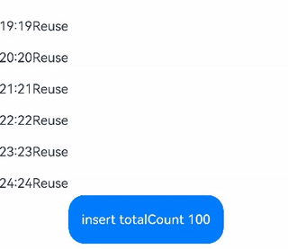

以下为修正后的示例：

在部分场景中，我们不希望显示区域外的数据源增删操作或高度变化影响屏幕中[List](../../reference/apis-arkui/arkui-ts/ts-container-list.md)列表Scroller停留的位置，可以通过List组件的[onScrollIndex](../../reference/apis-arkui/arkui-ts/ts-container-list.md#onscrollindex)事件对列表滚动动作进行监听，当列表发生滚动时，获取列表滚动位置。使用Scroller组件的[scrollToIndex](../../reference/apis-arkui/arkui-ts/ts-container-scroll.md#scrolltoindex)特性，滑动到指定index位置，实现屏幕外的数据源增加/删除数据时，Scroller停留的位置不变的效果。

示例代码仅对增加数据的情况进行展示。

> **说明：**
> 
> Repeat从API version 20开始支持[数据前插保持](#数据前插保持)，该功能特性可通过简单配置List组件的属性实现相同的效果。

<!-- @[repeat_single_one](https://gitcode.com/openharmony/applications_app_samples/blob/master/code/DocsSample/ArkUISample/RenderingControl/entry/src/main/ets/pages/RenderingRepeat/RepeatTemplateSingle1.ets) -->

``` TypeScript
// 定义一个类，标记为可观察的
// 类中自定义一个数组，标记为可追踪的
@ObservedV2
class ArrayHolderLocal {
  @Trace public arr: Array<number> = [];

  // constructor，用于初始化数组个数
  constructor(count: number) {
    for (let i = 0; i < count; i++) {
      this.arr.push(i);
    }
  }
}
@Entry
@ComponentV2
struct RepeatSingle {
  @Local arrayHolder: ArrayHolderLocal = new ArrayHolderLocal(100);
  @Local totalCount: number = this.arrayHolder.arr.length;
  scroller: Scroller = new Scroller();

  private start: number = 1;
  private end: number = 1;

  build() {
    Column({ space: 5 }) {
      List({ space: 20, initialIndex: 19, scroller: this.scroller }) {
        Repeat(this.arrayHolder.arr)
          .virtualScroll({ totalCount: this.totalCount })
          .templateId((item, index) => {
            return 'number';
          })
          .template('number', (r) => {
            ListItem() {
              Text(r.index! + ':' + r.item + 'Reuse')
            }
          })
          .each((r) => {
            ListItem() {
              Text(r.index! + ':' + r.item + 'eachMessage')
            }
          })
      }
      .onScrollIndex((start, end) => {
        this.start = start;
        this.end = end;
      })
      .height('30%')

      Button(`insert totalCount ${this.totalCount}`)
        .height(60)
        .onClick(() => {
          // 插入元素，元素位置为屏幕显示的前一个元素
          this.arrayHolder.arr.splice(18, 0, this.totalCount);
          let rect = this.scroller.getItemRect(this.start); // 获取子组件的大小位置
          this.scroller.scrollToIndex(this.start + 1); // 滑动到指定index
          this.scroller.scrollBy(0, -rect.y); // 滑动指定距离
          this.totalCount = this.arrayHolder.arr.length;
        })
    }
    .width('100%')
    .margin({ top: 5 })
  }
}
```

运行效果：

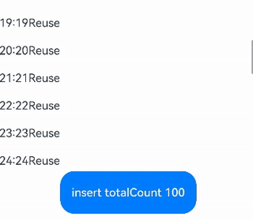

### totalCount值大于数据源长度

当数据源总长度很大时，会使用懒加载的方式先加载一部分数据，为了使Repeat显示正确的滚动条样式，需要将数据总长度赋值给totalCount，即数据源全部加载完成前，totalCount大于array.length。

totalCount > array.length时，在父组件容器滚动过程中，应用需要保证列表即将滑动到数据源末尾时请求后续数据，开发者需要对数据请求的错误场景（如网络延迟）进行保护操作，直到数据源全部加载完成，否则列表滑动的过程中会出现滚动效果异常。

上述规范可以通过实现父组件[List](../../reference/apis-arkui/arkui-ts/ts-container-list.md)/[Grid](../../reference/apis-arkui/arkui-ts/ts-container-grid.md)的[onScrollIndex](../../reference/apis-arkui/arkui-ts/ts-container-list.md#onscrollindex)属性的回调函数完成。示例代码如下：

> **说明：**
> 
> Repeat从API version 19开始支持[数据精准懒加载](#数据精准懒加载)，该功能特性可通过配置onLazyLoading回调函数动态加载对应区域内的数据。

<!-- @[repeat_comp](https://gitcode.com/openharmony/applications_app_samples/blob/master/code/DocsSample/ArkUISample/RenderingControl/entry/src/main/ets/pages/RenderingRepeat/EntryCompSucc.ets) -->

``` TypeScript
@ObservedV2
class VehicleData {
  @Trace public name: string;
  @Trace public price: number;

  constructor(name: string, price: number) {
    this.name = name;
    this.price = price;
  }
}

@ObservedV2
class VehicleDB {
  public vehicleItems: VehicleData[] = [];

  constructor() {
    // 数组初始化大小 20
    for (let i = 1; i <= 20; i++) {
      this.vehicleItems.push(new VehicleData(`Vehicle${i}`, i));
    }
  }
}

@Entry
@ComponentV2
struct EntryCompSucc {
  @Local vehicleItems: VehicleData[] = new VehicleDB().vehicleItems;
  @Local listChildrenSize: ChildrenMainSize = new ChildrenMainSize(60);
  @Local totalCount: number = this.vehicleItems.length;
  scroller: Scroller = new Scroller();

  build() {
    Column({ space: 3 }) {
      List({ scroller: this.scroller }) {
        Repeat(this.vehicleItems)
          .virtualScroll({ totalCount: 50 }) // 数组预期长度 50
          .templateId(() => 'default')
          .template('default', (ri) => {
            ListItem() {
              Column() {
                Text(`${ri.item.name} + ${ri.index}`)
                  .width('90%')
                  .height(this.listChildrenSize.childDefaultSize)
                  .backgroundColor(0xFFA07A)
                  .textAlign(TextAlign.Center)
                  .fontSize(20)
                  .fontWeight(FontWeight.Bold)
              }
            }.border({ width: 1 })
          }, { cachedCount: 5 })
          .each((ri) => {
            ListItem() {
              Text('Wrong: ' + `${ri.item.name} + ${ri.index}`)
                .width('90%')
                .height(this.listChildrenSize.childDefaultSize)
                .backgroundColor(0xFFA07A)
                .textAlign(TextAlign.Center)
                .fontSize(20)
                .fontWeight(FontWeight.Bold)
            }.border({ width: 1 })
          })
          .key((item, index) => `${index}:${item}`)
      }
      .height('50%')
      .margin({ top: 20 })
      .childrenMainSize(this.listChildrenSize)
      .alignListItem(ListItemAlign.Center)
      .onScrollIndex((start, end) => {
        // 数据懒加载
        if (this.vehicleItems.length < 50) {
          for (let i = 0; i < 10; i++) {
            if (this.vehicleItems.length < 50) {
              this.vehicleItems.push(new VehicleData('Vehicle_loaded', i));
            }
          }
        }
      })
    }
  }
}
```

示例代码运行效果：


### 与@Builder混用时状态变量未刷新

当Repeat与[@Builder](../state-management/arkts-builder.md)混用时，如果只传递`RepeatItem.item`或`RepeatItem.index`，参数值的改变不会引起@Builder函数内的UI刷新。推荐使用[按引用传递](../state-management/arkts-builder.md#按引用传递参数)，即将RepeatItem类型整体进行传参，组件才能监听到数据变化。除此之外，从API version 20开始，开发者可以通过使用[UIUtils.makeBinding()](../../reference/apis-arkui/js-apis-stateManagement.md#makebinding20)函数、[Binding](../../reference/apis-arkui/js-apis-stateManagement.md#bindingt20)类和[MutableBinding](../../reference/apis-arkui/js-apis-stateManagement.md#mutablebindingt20)类实现@Builder函数中状态变量的刷新。

示例代码如下：

``` ts
import { UIUtils, Binding } from '@kit.ArkUI';

@Entry
@ComponentV2
struct RepeatBuilderPage {
  @Local simpleList: Array<number> = [];

  aboutToAppear(): void {
    for (let i = 0; i < 100; i++) {
      this.simpleList.push(i);
    }
  }

  @Builder
  buildItem1(bindingData: Binding<number>) { // 使用Binding类/MutableBinding类接收传参，通过value属性访问值。
    Text('[Binding] item: ' + bindingData.value)
      .fontSize(20)
  }

  @Builder
  buildItem2(ri: RepeatItem<number>) {
    Text('[RepeatItem] item: ' + ri.item)
      .fontSize(20)
  }

  @Builder
  buildItem3(data: number) {
    Text('[number] item: ' + data)
      .fontSize(20).fontColor(Color.Red)
  }

  build() {
    Column({ space: 10 }) {
      List({ space: 20 }) {
        Repeat<number>(this.simpleList)
          .each((ri) => {
            ListItem() {
              Column({ space: 2 }) {
                this.buildItem1(UIUtils.makeBinding<number>(() => ri.item)) // 使用UIUtils.makeBinding()函数实现@Builder函数中状态变量的刷新。
                this.buildItem2(ri) // 按引用传递，状态变量的改变会引起@Builder函数内的UI刷新。
                this.buildItem3(ri.item) // 反例。按值传递，状态变量的改变不会引起@Builder函数内的UI刷新。
              }
            }.border({ width: 1 })
          }).virtualScroll()
      }
      .cachedCount(1)
      .border({ width: 1 })
      .width('70%')
      .height('60%')
      .alignListItem(ListItemAlign.Center)

      Button('click to change data.').onClick(() => {
        this.simpleList[0] = 10000; // 修改第一项数据为10000。
      })
    }
    .width('100%').height('100%')
    .justifyContent(FlexAlign.Center)
  }
}
```

<!-- [repeat_builder](https://gitcode.com/openharmony/applications_app_samples/blob/master/code/DocsSample/ArkUISample/RenderingControl/entry/src/main/ets/pages/RenderingRepeat/RepeatBuilderPage.ets) -->

@Builder传参方式依次为makeBinding()、地址传递和值传递，界面展示如下图，进入页面后点击按钮改变数据。在@Builder构造函数中使用值传递传参不会引起函数内的UI刷新。

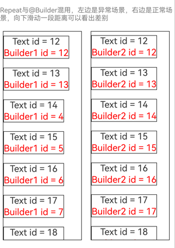

### expandSafeArea属性失效

在API version 18之前，Repeat子组件声明expandSafeArea属性，子组件无法扩展至全屏；从API version 18开始，子组件声明expandSafeArea属性可正常扩展至全屏展示。