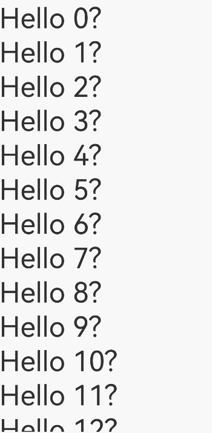

# LazyForEach迁移Repeat指导文档

[Repeat](./arkts-new-rendering-control-repeat.md)是ArkUI在API version 12中新引入的循环渲染组件，相比[LazyForEach](./arkts-rendering-control-lazyforeach.md)具有更简洁的API、更丰富的功能以及更强的性能优化能力。本指南帮助开发者将LazyForEach平滑地迁移到Repeat。

## 基础用法迁移

### 数据首次渲染

**LazyForEach用例**

LazyForEach根据数据源循环渲染子组件。

示例1中，在容器组件[List](../arkts-layout-development-create-list.md)中使用LazyForEach，并基于数据源循环渲染出了一系列[Text](../arkts-common-components-text-display.md)子组件。

**示例1 - 迁移前**

```ts
/** BasicDataSource代码见文档末尾BasicDataSource示例代码: string类型数组的BasicDataSource代码 **/

class MyDataSource extends BasicDataSource {
  private dataArray: string[] = [];

  public totalCount(): number {
    return this.dataArray.length;
  }

  public getData(index: number): string {
    return this.dataArray[index];
  }

  public pushData(data: string): void {
    this.dataArray.push(data);
    this.notifyDataAdd(this.dataArray.length - 1);
  }
}

@Entry
@Component
struct MyComponent {
  private data: MyDataSource = new MyDataSource();

  aboutToAppear() {
    for (let i = 0; i <= 20; i++) {
      this.data.pushData(`Hello ${i}`);
    }
  }

  build() {
    List({ space: 3 }) {
      LazyForEach(this.data, (item: string) => {
        ListItem() {
          Row() {
            Text(item).fontSize(50)
              .onAppear(() => {
                console.info(`appear: ${item}`);
              })
          }.margin({ left: 10, right: 10 })
        }
      }, (item: string) => item)
    }.cachedCount(5)
  }
}
```

以上是一个典型的使用LazyForEach循环渲染子组件的场景，下面将介绍如何将此示例迁移至Repeat。

**迁移步骤**

1. 使用状态管理V2装饰器。

   Repeat推荐和状态管理V2装饰器配合使用（[懒加载](./arkts-new-rendering-control-repeat.md#循环渲染能力说明)模式下只支持和状态管理V2装饰器配合使用）。如果之前使用的是状态管理V1装饰器，需要修改为状态管理V2装饰器。

   ```ts
   // 迁移前 - LazyForEach
   @Component // 状态管理V1
   struct MyComponent {
     build() {
       // ...
       LazyForEach(...)
       // ...
     }
     // ...其他属性、方法
   }
     
   // 迁移后 - Repeat
   @ComponentV2 // 状态管理V2
   struct MyComponent {
     build() {
       // ...
       Repeat(...)
       // ...
     }
     // ...其他属性、方法
   }
   ```

2. 迁移数据源。

   LazyForEach使用专用的数据结构[IDataSource](../../reference/apis-arkui/arkui-ts/ts-rendering-control-lazyforeach.md#idatasource)作为数据源。迁移至Repeat后，不再使用IDataSource作为数据源，而是使用状态管理V2装饰的数组作为数据源。

   ```ts
   // 迁移前 - LazyForEach
   class MyDataSource implements IDataSource {
     private dataArray: string[] = [];
     
     public totalCount(): number {
       return this.dataArray.length;
     }
     
     public getData(index: number): string {
       return this.dataArray[index];
     }
     
     // ...其他方法
   }
   
   // 迁移后 - Repeat
   @Local data: Array<string> = [];
   ```

3. 迁移组件生成函数和键值生成函数。

   LazyForEach与Repeat均通过组件生成函数，为每一项数据创建一个子组件；通过键值生成函数，为每一项数据生成一个唯一的键值。</br>
   从LazyForEach迁移至Repeat时，两者的语法存在差异。Repeat需要在[`.each()`](../../reference/apis-arkui/arkui-ts/ts-rendering-control-repeat.md#each)或[`.template()`](../../reference/apis-arkui/arkui-ts/ts-rendering-control-repeat.md#template)中设置组件生成函数，在[`.key()`](../../reference/apis-arkui/arkui-ts/ts-rendering-control-repeat.md#key)中设置键值生成函数。

   ```ts
   // 迁移前 - LazyForEach
   List() {
     LazyForEach(
       this.data, // 数据源
       (item: string, index: number) => { // 组件生成函数
         ListItem() {
           Text(item)
         }
       },
       (item: string, index: number) => item // 键值生成函数
     )
   }
   
   // 迁移后 - Repeat
   List() {
     Repeat<string>(this.data) // 数据源
       .each((repeatItem: RepeatItem<string>) => { // 组件生成函数
         ListItem() {
           Text(repeatItem.item)
         }
       })
       .key((item: string, index: number) => item) // 键值生成函数
   }
   ```

4. 配置懒加载功能。

   Repeat具有[懒加载](./arkts-new-rendering-control-repeat.md#循环渲染能力说明)和[全量加载](./arkts-new-rendering-control-repeat.md#关闭懒加载)两种模式。
   
   - 全量加载模式渲染所有子节点（对标[ForEach](./arkts-rendering-control-foreach.md)）。
   - 懒加载模式动态渲染屏幕区域和预加载区域内的子节点（需要与容器组件配合使用，对标LazyForEach）。

   从LazyForEach迁移至Repeat时，需要调用[virtualScroll](../../reference/apis-arkui/arkui-ts/ts-rendering-control-repeat.md#virtualscroll))属性，使能懒加载。

   ```ts
   // 迁移前 - LazyForEach
   LazyForEach(data, (item) => {...}, (item) => item)
   
   // 迁移后 - Repeat
   Repeat(data)
     .virtualScroll() // 使能懒加载
   ```

**迁移后代码**

通过以上步骤，可以将示例1从LazyForEach迁移至Repeat，迁移后的完整示例如下所示。

**示例1 - 迁移后**

```ts
@Entry
@ComponentV2 // 使用状态管理V2
struct MyComponent {
  @Local data: Array<string> = []; // 数据源为状态管理V2装饰的数组

  aboutToAppear() {
    for (let i = 0; i <= 20; i++) {
      this.data.push(`Hello ${i}`);
    }
  }

  build() {
    List({ space: 3 }) {
      Repeat(this.data) // 使用Repeat
        .each((repeatItem: RepeatItem<string>) => { // 组件生成函数
          ListItem() {
            Row() {
              Text(repeatItem.item).fontSize(50)
                .onAppear(() => {
                  console.info(`appear: ${repeatItem.item}`);
                })
            }.margin({ left: 10, right: 10 })
          }
        })
        .key((item: string) => item) // 键值生成函数
        .virtualScroll() // 使能懒加载
    }.cachedCount(5)
  }
}
```

运行后界面如下图所示。


### 数据更新操作

**LazyForEach用例**

当LazyForEach的数据源发生变化时，开发者需要根据数据源的变化情况调用[DataChangeListener](../../reference/apis-arkui/arkui-ts/ts-rendering-control-lazyforeach.md#datachangelistener7)对应的接口，通知LazyForEach做相应的更新。主要的数据操作包括：添加数据、删除数据、交换数据、修改单个数据、修改多个数据、精准批量修改数据。

示例2演示了主要的数据操作。

**示例2 - 迁移前**

```ts
/** BasicDataSource代码见文档末尾BasicDataSource示例代码: string类型数组的BasicDataSource代码 **/

class MyDataSource extends BasicDataSource {
  private dataArray: string[] = [];

  public totalCount(): number {
    return this.dataArray.length;
  }

  public getData(index: number): string {
    return this.dataArray[index];
  }

  // 添加数据
  public pushData(data: string): void {
    this.dataArray.push(data);
    this.notifyDataAdd(this.dataArray.length - 1);
  }

  // 删除数据
  public deleteData(index: number): void {
    this.dataArray.splice(index, 1);
    this.notifyDataDelete(index);
  }

  // 交换数据
  public moveData(from: number, to: number): void {
    let temp: string = this.dataArray[from];
    this.dataArray[from] = this.dataArray[to];
    this.dataArray[to] = temp;
    this.notifyDataMove(from, to);
  }

  // 修改单个数据
  public changeData(index: number, data: string): void {
    this.dataArray.splice(index, 1, data);
    this.notifyDataChange(index);
  }

  // 修改多个数据
  public modifyAllData(): void {
    this.dataArray = this.dataArray.map((item: string) => {
        return 'Changed ' + item;
    });
    this.notifyDataReload();
  }
}

@Entry
@Component
struct MyComponent {
  private data: MyDataSource = new MyDataSource();
  private count: number = 0;

  aboutToAppear() {
    for (let i = 0; i <= 10; i++) {
      this.data.pushData(`Hello ${i}`);
    }
  }

  build() {
    Column({ space: 3 }) {
      // 点击追加子组件
      Button('Add new item')
        .onClick(() => {
          this.data.pushData(`New item ${this.count++}`);
        })
      // 点击删除子组件
      Button('Delete item 0')
        .onClick(() => {
          this.data.deleteData(0);
        })
      // 点击交换子组件
      Button('Swap item 0 and item 1')
        .onClick(() => {
          this.data.moveData(0, 1);
        })
      // 点击修改单个子组件
      Button('Change item 0')
        .onClick(() => {
          this.data.changeData(0, `Changed item ${this.count++}`);
        })
      // 点击修改多个子组件
      Button('Change all items')
        .onClick(() => {
          this.data.modifyAllData();
        })
      List({ space: 3 }) {
        LazyForEach(this.data, (item: string) => {
          ListItem() {
            Row() {
              Text(item).fontSize(25)
            }
          }
        }, (item: string) => item)
      }.cachedCount(5)
    }
  }
}
```

以上是一个典型的更新数据后LazyForEach重新渲染子组件的场景，下面将介绍如何将此示例迁移至Repeat。

**迁移步骤**

1. 迁移准备。

   根据数据首次渲染小节中的步骤，将LazyForEach替换为Repeat。
     1. 使用状态管理V2装饰器。
     2. 迁移数据源。
     3. 迁移组件生成函数与键值生成函数。
     4. 使能懒加载。

2. 迁移数据源修改方式。

   - 对于LazyForEach，在修改数据源后需要调用对应的接口通知其更新。
   - 对于Repeat，由状态管理V2监听其数据源变化，并触发更新。因此，开发者直接修改数据源即可，无需其他额外操作。

   ```ts
   // 以修改单个数据为例
   // 迁移前 - LazyForEach
   class MyDataSource implements IDataSource {
     private dataArray: string[] = [];
     
     public changeData(index: number, newData: string): void {
       this.dataArray.splice(index, 1, data);
       this.notifyDataChange(index);
     }
     
     // ...其他方法
   }
   
   // 迁移后 - Repeat
   this.data.splice(index, 1, data);
   ```

   其他数据更新操作，如添加数据、删除数据、交换数据等，与以上方法类似，可通过直接修改数据源数组实现。

**迁移后代码**

迁移后的完整示例如下。

**示例2 - 迁移后**

```ts
@Entry
@ComponentV2
struct MyComponent {
  @Local data: Array<string> = [];
  private count: number = 0;

  aboutToAppear() {
    for (let i = 0; i <= 10; i++) {
      this.data.push(`Hello ${i}`);
    }
  }

  build() {
    Column({ space: 3 }) {
      // 点击追加子组件
      Button('Add new item')
        .onClick(() => { this.data.push(`New item ${this.count++}`); })
      // 点击删除子组件
      Button('Delete item 0')
        .onClick(() => { this.data.splice(0, 1); })
      // 点击交换子组件
      Button('Swap item 0 and item 1')
        .onClick(() => { let temp: string = this.data[0];
                         this.data[0] = this.data[1];
                         this.data[1] = temp; })
      // 点击修改单个子组件
      Button('Change item 0')
        .onClick(() => { this.data.splice(0, 1, `Changed item ${this.count++}`); })
      // 点击修改多个子组件
      Button('Change all items')
        .onClick(() => { this.data = this.data.map((item: string) => { return 'Changed ' + item; }); })
      List({ space: 3 }) {
        Repeat(this.data)
          .each((repeatItem: RepeatItem<string>) => {
            ListItem() {
              Row() {
                Text(repeatItem.item).fontSize(25)
              }
            }
          })
          .key((item: string) => item)
          .virtualScroll()
      }.cachedCount(5)
    }
  }
}
```

运行后界面如下图所示。


## 典型场景迁移

### 修改数据子属性

**LazyForEach用例**

LazyForEach可以使用[@Observed与@ObjectLink](./arkts-observed-and-objectlink.md)装饰器实现对数据子属性的观测。当有数据子属性发生变化时，仅更新使用了该子属性的组件，从而提高性能。

示例3演示了对子属性的观测。

**示例3 - 迁移前**

```ts
/** BasicDataSource代码见文档末尾BasicDataSource示例代码: StringData类型数组的BasicDataSource代码 **/

class MyDataSource extends BasicDataSource {
  private dataArray: StringData[] = [];

  public totalCount(): number {
    return this.dataArray.length;
  }

  public getData(index: number): StringData {
    return this.dataArray[index];
  }

  public pushData(data: StringData): void {
    this.dataArray.push(data);
    this.notifyDataAdd(this.dataArray.length - 1);
  }
}

@Observed
class StringData {
  message: string;

  constructor(message: string) {
    this.message = message;
  }
}

@Entry
@Component
struct MyComponent {
  private data: MyDataSource = new MyDataSource();

  aboutToAppear() {
    for (let i = 0; i <= 20; i++) {
      this.data.pushData(new StringData(`Hello ${i}`));
    }
  }

  build() {
    List({ space: 3 }) {
      LazyForEach(this.data, (item: StringData, index: number) => {
        ListItem() {
          ChildComponent({ data: item })
        }
        .onClick(() => {
          item.message += '0';
        })
      }, (item: StringData, index: number) => index.toString())
    }.cachedCount(5)
  }
}

@Component
struct ChildComponent {
  @ObjectLink data: StringData;

  build() {
    Row() {
      Text(this.data.message).fontSize(50)
        .onAppear(() => {
          console.info(`appear: ${this.data.message}`);
        })
    }.margin({ left: 10, right: 10 })
  }
}
```

**迁移Repeat**

Repeat需要和状态管理V2一起使用，状态管理V2提供了[@ObserveV2和@Trace](./arkts-new-observedV2-and-trace.md)装饰器对子属性进行深度观测。迁移时，需要将@Observe和@ObjectLink装饰器迁移至@ObserveV2和@Trace装饰器。

迁移后的示例如下所示。

**示例3 - 迁移后**

```ts
@ObservedV2
class StringData {
  @Trace message: string; // 观测子属性

  constructor(message: string) {
    this.message = message;
  }
}

@Entry
@ComponentV2
struct MyComponent {
  @Local data: StringData[] = [];

  aboutToAppear() {
    for (let i = 0; i <= 20; i++) {
      this.data.push(new StringData(`Hello ${i}`));
    }
  }

  build() {
    List({ space: 3 }) {
      Repeat(this.data)
        .each((repeatItem) => {
          ListItem() {
            Text(repeatItem.item.message).fontSize(50)
              .onAppear(() => {
                console.info(`appear: ${repeatItem.item.message}`);
              })
          }
          .onClick(() => {
            repeatItem.item.message += '0';
          })
        })
        .key((item: StringData, index: number) => index.toString())
        .virtualScroll()
    }.cachedCount(5)
  }
}
```

运行后界面如下图所示。


### 状态管理V2观测组件内部状态

**LazyForEach用例**

状态管理V2的[@Local](./arkts-new-local.md)装饰器提供了观测自定义组件内部变量的能力。被@Local装饰的变量发生变化时，会通知LazyForEach更新对应的组件。

示例4演示了在LazyForEach中使用@Local装饰器观测数据变化，触发组件更新。

**示例4 - 迁移前**

```ts
/** BasicDataSource代码见文档末尾BasicDataSource示例代码: StringData类型数组的BasicDataSource代码 **/

class MyDataSource extends BasicDataSource {
  private dataArray: StringData[] = [];

  public totalCount(): number {
    return this.dataArray.length;
  }

  public getData(index: number): StringData {
    return this.dataArray[index];
  }

  public pushData(data: StringData): void {
    this.dataArray.push(data);
    this.notifyDataAdd(this.dataArray.length - 1);
  }
}

@ObservedV2
class StringData {
  @Trace message: string;

  constructor(message: string) {
    this.message = message;
  }
}

@Entry
@ComponentV2
struct MyComponent {
  data: MyDataSource = new MyDataSource();

  aboutToAppear() {
    for (let i = 0; i <= 20; i++) {
      this.data.pushData(new StringData(`Hello ${i}`));
    }
  }

  build() {
    List({ space: 3 }) {
      LazyForEach(this.data, (item: StringData, index: number) => {
        ListItem() {
          Row() {
            Text(item.message).fontSize(50)
              .onClick(() => {
                // 修改@ObservedV2装饰类中@Trace装饰的变量，触发刷新此处Text组件
                item.message += '!';
              })
            ChildComponent()
          }
        }
      }, (item: StringData, index: number) => index.toString())
    }.cachedCount(5)
  }
}

@ComponentV2
struct ChildComponent {
  @Local message: string = '?';

  build() {
    Row() {
      Text(this.message).fontSize(50)
        .onClick(() => {
          // 修改@Local装饰的变量，触发刷新此处Text组件
          this.message += '?';
        })
    }
  }
}
```

**迁移Repeat**

Repeat本身支持与状态管理V2联合使用，将LazyForEach相关代码修改为Repeat后，即可实现对组件内部状态变量的观测。

迁移后的示例如下所示。

**示例4 - 迁移后**

```ts
@ObservedV2
class StringData {
  @Trace message: string;

  constructor(message: string) {
    this.message = message;
  }
}

@Entry
@ComponentV2
struct MyComponent {
  @Local data: StringData[] = [];

  aboutToAppear() {
    for (let i = 0; i <= 20; i++) {
      this.data.push(new StringData(`Hello ${i}`));
    }
  }

  build() {
    List({ space: 3 }) {
      Repeat(this.data)
        .each((repeatItem) => {
          ListItem() {
            Row() {
              Text(repeatItem.item.message).fontSize(50)
                .onClick(() => {
                  // 修改@ObservedV2装饰类中@Trace装饰的变量，触发刷新此处Text组件
                  repeatItem.item.message += '!';
                })
              ChildComponent()
            }
          }
        })
        .key((item: StringData, index: number) => index.toString())
        .virtualScroll()
    }.cachedCount(5)
  }
}

@ComponentV2
struct ChildComponent {
  @Local message: string = '?';

  build() {
    Row() {
      Text(this.message).fontSize(50)
        .onClick(() => {
          // 修改@Local装饰的变量，触发刷新此处Text组件
          this.message += '?';
        })
    }
  }
}
```

运行后界面如下图所示。



### 状态管理V2观测组件外部输入

**LazyForEach用例**

状态管理V2的[@Param](./arkts-new-param.md)装饰器提供了观测自定义组件外部输入变量的能力，可以实现父子组件间的数据同步。将父组件的变量传递给子组件，并用@Param装饰，当父组件变量发生变化时，会通知对应的组件更新。

示例5演示了在LazyForEach中使用@Param装饰器观测数据变化，触发组件更新。


**示例5 - 迁移前**

```ts
/** BasicDataSource代码见文档末尾BasicDataSource示例代码: StringData类型数组的BasicDataSource代码 **/

class MyDataSource extends BasicDataSource {
  private dataArray: StringData[] = [];

  public totalCount(): number {
    return this.dataArray.length;
  }

  public getData(index: number): StringData {
    return this.dataArray[index];
  }

  public pushData(data: StringData): void {
    this.dataArray.push(data);
    this.notifyDataAdd(this.dataArray.length - 1);
  }
}

@ObservedV2
class StringData {
  @Trace message: string;

  constructor(message: string) {
    this.message = message;
  }
}

@Entry
@ComponentV2
struct MyComponent {
  data: MyDataSource = new MyDataSource();

  aboutToAppear() {
    for (let i = 0; i <= 20; i++) {
      this.data.pushData(new StringData(`Hello ${i}`));
    }
  }

  build() {
    List({ space: 3 }) {
      LazyForEach(this.data, (item: StringData, index: number) => {
        ListItem() {
          ChildComponent({ data: item.message }) // 向自定义组件内传入变量
            .onClick(() => {
              item.message += '!';
            })
        }
      }, (item: StringData, index: number) => index.toString())
    }.cachedCount(5)
  }
}

@ComponentV2
struct ChildComponent {
  @Param @Require data: string = ''; // 接收来自外部的变量

  build() {
    Row() {
      Text(this.data).fontSize(50)
    }
  }
}
```

**迁移Repeat**

Repeat本身支持与状态管理V2联合使用，将LazyForEach相关代码修改为Repeat后，即可实现对组件外部输入状态变量的观测。

迁移后的示例如下所示。

**示例5 - 迁移后**

```ts
@ObservedV2
class StringData {
  @Trace message: string;

  constructor(message: string) {
    this.message = message;
  }
}

@Entry
@ComponentV2
struct MyComponent {
  @Local data: StringData[] = [];

  aboutToAppear() {
    for (let i = 0; i <= 20; i++) {
      this.data.push(new StringData(`Hello ${i}`));
    }
  }

  build() {
    List({ space: 3 }) {
      Repeat(this.data)
        .each((repeatItem) => {
          ListItem() {
            ChildComponent({ data: repeatItem.item.message }) // 向自定义组件内传入变量
              .onClick(() => {
                repeatItem.item.message += '!';
              })
          }
        })
        .key((item: StringData, index: number) => index.toString())
        .virtualScroll()
    }.cachedCount(5)
  }
}

@ComponentV2
struct ChildComponent {
  @Param @Require data: string = ''; // 接收来自外部的变量

  build() {
    Row() {
      Text(this.data).fontSize(50)
    }
  }
}
```

运行后界面如下图所示。


### 拖拽排序

**LazyForEach用例**

LazyForEach的[onMove](../../reference/apis-arkui/arkui-ts/ts-universal-attributes-drag-sorting.md#onmove)属性提供了拖拽排序能力。

示例6为典型用例。

**示例6 - 迁移前**

```ts
/** BasicDataSource代码见文档末尾BasicDataSource示例代码: string类型数组的BasicDataSource代码 **/

class MyDataSource extends BasicDataSource {
  private dataArray: string[] = [];

  public totalCount(): number {
    return this.dataArray.length;
  }

  public getData(index: number): string {
    return this.dataArray[index];
  }

  public moveDataWithoutNotify(from: number, to: number): void {
    let tmp = this.dataArray.splice(from, 1);
    this.dataArray.splice(to, 0, tmp[0]);
  }

  public pushData(data: string): void {
    this.dataArray.push(data);
    this.notifyDataAdd(this.dataArray.length - 1);
  }
}

@Entry
@Component
struct Parent {
  private data: MyDataSource = new MyDataSource();

  aboutToAppear(): void {
    for (let i = 0; i < 100; i++) {
      this.data.pushData(i.toString());
    }
  }

  build() {
    Row() {
      List() {
        LazyForEach(this.data, (item: string) => {
          ListItem() {
            Text(item.toString())
              .fontSize(16)
              .textAlign(TextAlign.Center)
              .size({ height: 100, width: '100%' })
          }.margin(10)
          .borderRadius(10)
          .backgroundColor('#FFFFFFFF')
        }, (item: string) => item)
          .onMove((from: number, to: number) => { // 实现拖拽排序
            this.data.moveDataWithoutNotify(from, to);
          })
      }
      .width('100%')
      .height('100%')
      .backgroundColor('#FFDCDCDC')
    }
  }
}
```

**迁移Repeat**

Repeat具有与LazyForEach相同的onMove属性。将LazyForEach相关代码修改为Repeat后，即可实现拖拽排序。

迁移后的示例如下所示。

**示例6 - 迁移后**

```ts
@Entry
@ComponentV2
struct Parent {
  @Local data: string[] = [];

  aboutToAppear(): void {
    for (let i = 0; i < 100; i++) {
      this.data.push(i.toString());
    }
  }

  moveData(from: number, to: number) {
    let tmp = this.data.splice(from, 1);
    this.data.splice(to, 0, tmp[0]);
  }

  build() {
    Row() {
      List() {
        Repeat(this.data)
          .each((repeatItem) => {
            ListItem() {
              Text(repeatItem.item.toString())
                .fontSize(16)
                .textAlign(TextAlign.Center)
                .size({ height: 100, width: '100%' })
            }.margin(10)
            .borderRadius(10)
            .backgroundColor('#FFFFFFFF')
          })
          .key((item: string) => item)
          .virtualScroll()
          .onMove((from: number, to: number) => { // 实现拖拽排序
            this.moveData(from, to);
          })
      }
      .width('100%')
      .height('100%')
      .backgroundColor('#FFDCDCDC')
    }
  }
}
```

运行后界面如下图所示。


### 组件复用

**LazyForEach用例**

LazyForEach自身并不具备组件复用能力，为实现组件复用，需要与[@Reusable](./arkts-reusable.md)装饰器配合使用（被@Reusable装饰的自定义组件具有复用能力）。

示例7演示了组件复用的典型场景。

**示例7 - 迁移前**

```ts
/** BasicDataSource代码见文档末尾BasicDataSource示例代码: StringData类型数组的BasicDataSource代码 **/

class MyDataSource extends BasicDataSource {
  private dataArray: StringData[] = [];

  public totalCount(): number {
    return this.dataArray.length;
  }

  public getData(index: number): StringData {
    return this.dataArray[index];
  }

  public pushData(data: StringData): void {
    this.dataArray.push(data);
    this.notifyDataAdd(this.dataArray.length - 1);
  }
}

class StringData {
  message: string;

  constructor(message: string) {
    this.message = message;
  }
}

@Entry
@Component
struct MyComponent {
  data: MyDataSource = new MyDataSource();

  aboutToAppear() {
    for (let i = 0; i <= 30; i++) {
      this.data.pushData(new StringData(`Hello${i}`));
    }
  }

  build() {
    List({ space: 3 }) {
      LazyForEach(this.data, (item: StringData, index: number) => {
        ListItem() {
          ChildComponent({ data: item })
            .onAppear(() => {
              console.info(`onAppear: ${item.message}`);
            })
        }
      }, (item: StringData, index: number) => index.toString())
    }.cachedCount(5)
  }
}

@Reusable
@Component
struct ChildComponent {
  @State data: StringData = new StringData('');

  aboutToAppear(): void {
    console.info(`aboutToAppear: ${this.data.message}`);
  }

  aboutToRecycle(): void {
    console.info(`aboutToRecycle: ${this.data.message}`);
  }

  // 对复用的组件进行数据更新
  aboutToReuse(params: Record<string, ESObject>): void {
    this.data = params.data as StringData;
    console.info(`aboutToReuse: ${this.data.message}`);
  }

  build() {
    Row() {
      Text(this.data.message).fontSize(50)
    }
  }
}
```

**迁移Repeat**

Repeat本身具备组件复用能力，同时也支持与状态管理V2的[@ReusableV2](./arkts-new-reusableV2.md)装饰器联合使用。因此，迁移至Repeat后，其组件复用具有两种实现方案。

1. 直接使用Repeat自身的复用能力。
2. 使用@ReusableV2装饰器提供的复用能力。

需要注意的是，Repeat默认使能自身的复用能力，且优先级高于@ReusableV2装饰器。若要使用@ReusableV2装饰器，需要先手动关闭Repeat自身的复用能力（@ReusableV2装饰器从API version 18开始支持，Repeat从API version 19开始支持关闭自身复用能力）。

**示例7 - 迁移方案1：使用Repeat自身的复用能力**

Repeat本身具备复用能力，且默认开启。将LazyForEach相关代码迁移至Repeat后，便已经具备了复用能力。

修改后的示例如下。

```ts
class StringData {
  message: string;

  constructor(message: string) {
    this.message = message;
  }
}

@Entry
@ComponentV2
struct MyComponent {
  @Local data: StringData[] = [];

  aboutToAppear() {
    for (let i = 0; i <= 30; i++) {
      this.data.push(new StringData(`Hello${i}`));
    }
  }

  build() {
    List({ space: 3 }) {
      Repeat(this.data) // Repeat自身具备复用功能
        .each((repeatItem) => {
          ListItem() {
            Text(repeatItem.item.message).fontSize(50)
          }
        })
        .key((item: StringData, index: number) => index.toString())
        .virtualScroll()
    }.cachedCount(5)
  }
}
```

**示例7 - 迁移方案2：使用@ReusableV2装饰器**

若要使用@ReusableV2装饰器，首先需要通过`.virtualScroll({ reusable: false })`关闭Repeat自身的复用功能，再用@ReusableV2装饰需要复用的自定义组件。

相较于Repeat自身的复用，@ReusableV2装饰的自定义组件在回收和复用时，会触发aboutToRecycle和aboutToReuse两个生命周期。

使用@ReusableV2装饰器的迁移示例如下所示。

```ts
class StringData {
  message: string;

  constructor(message: string) {
    this.message = message;
  }
}

@Entry
@ComponentV2
struct MyComponent {
  @Local data: StringData[] = [];

  aboutToAppear() {
    for (let i = 0; i <= 30; i++) {
      this.data.push(new StringData(`Hello${i}`));
    }
  }

  build() {
    List({ space: 3 }) {
      Repeat(this.data)
        .each((repeatItem) => {
          ListItem() {
            ChildComponent({ data: repeatItem.item })
              .onAppear(() => {
                console.info(`onAppear: ${repeatItem.item.message}`);
              })
          }
        })
        .key((item: StringData, index: number) => index.toString())
        .virtualScroll({ reusable: false }) // 关闭Repeat自身的复用功能（API 19）
    }.cachedCount(5)
  }
}

// 使用@ReusableV2实现组件复用（API 18）
@ReusableV2
@ComponentV2
struct ChildComponent {
  @Param data: StringData = new StringData('');

  aboutToAppear(): void {
    console.info(`aboutToAppear: ${this.data.message}`);
  }

  aboutToRecycle(): void {
    console.info(`aboutToRecycle: ${this.data.message}`);
  }

  aboutToReuse(): void {
    console.info(`aboutToReuse: ${this.data.message}`);
  }

  build() {
    Row() {
      Text(this.data.message).fontSize(50)
    }
  }
}
```

运行后界面如下图所示。


### 模板渲染

**LazyForEach用例**

LazyForEach自身并不具备模板渲染能力。为实现模板渲染能力，需要开发者自己实现逻辑判断，为不同的数据项选择不同的渲染模板。

示例8演示了模板渲染的典型场景。

**示例8 - 迁移前**

```ts
/** BasicDataSource代码见文档末尾BasicDataSource示例代码: StringData类型数组的BasicDataSource代码 **/

class MyDataSource extends BasicDataSource {
  private dataArray: StringData[] = [];

  public totalCount(): number {
    return this.dataArray.length;
  }

  public getData(index: number): StringData {
    return this.dataArray[index];
  }

  public pushData(data: StringData): void {
    this.dataArray.push(data);
    this.notifyDataAdd(this.dataArray.length - 1);
  }
}

class StringData {
  message: string;
  type: number;

  constructor(message: string, type: number) {
    this.message = message;
    this.type = type;
  }

  getType(): number {
    if (this.type >= 1) {
      return 1;
    } else {
      return 0;
    }
  }
}

@Entry
@Component
struct MyComponent {
  data: MyDataSource = new MyDataSource();

  aboutToAppear() {
    for (let i = 0; i <= 200; i++) {
      this.data.pushData(new StringData(`Hello${i}`, i % 2));
    }
  }

  build() {
    List({ space: 3 }) {
      LazyForEach(this.data, (item: StringData, index: number) => {
        ListItem() {
          // 开发者自己实现逻辑判断，为不同的数据项选择不同的渲染模板
          if (item.getType() == 0) {
            // 模板A
            ChildComponentA({ data: item })
              .onAppear(() => {
                console.info(`type A onAppear: ${item.message}`);
              })
          } else {
            // 模板B
            ChildComponentB({ data: item })
              .onAppear(() => {
                console.info(`type B onAppear: ${item.message}`);
              })
          }
        }
      }, (item: StringData, index: number) => index.toString())
    }.cachedCount(5)
  }
}

// 使用@Reusable实现组件复用
@Reusable
@Component
struct ChildComponentA {
  @State data: StringData = new StringData('', 0);

  aboutToAppear(): void {
    console.info(`type A aboutToAppear: ${this.data.message}`);
  }

  aboutToRecycle(): void {
    console.info(`type A aboutToRecycle: ${this.data.message}`);
  }

  aboutToReuse(params: Record<string, ESObject>): void {
    this.data = params.data as StringData;
    console.info(`type A aboutToReuse: ${this.data.message}`);
  }

  build() {
    Row() {
      Text(this.data.message).fontSize(50)
      Button('Type A')
    }
  }
}

@Reusable
@Component
struct ChildComponentB {
  @State data: StringData = new StringData('', 0);

  aboutToAppear(): void {
    console.info(`type B aboutToAppear: ${this.data.message}`);
  }

  aboutToRecycle(): void {
    console.info(`type B aboutToRecycle: ${this.data.message}`);
  }

  aboutToReuse(params: Record<string, ESObject>): void {
    this.data = params.data as StringData;
    console.info(`type B aboutToReuse: ${this.data.message}`);
  }

  build() {
    Row() {
      Text(this.data.message).fontSize(50).fontColor(Color.Gray)
      Text('Type B')
    }
  }
}
```
**迁移Repeat**

Repeat本身具备模板渲染能力，开发者可以通过[templateId](../../reference/apis-arkui/arkui-ts/ts-rendering-control-repeat.md#templateid)方法为不同的数据项选择不同的模板，再通过[template](../../reference/apis-arkui/arkui-ts/ts-rendering-control-repeat.md#template)方法为不同的模板配置不同的组件生成函数。同时，开发者仍然可以选择自己实现逻辑判断，为不同的数据项分配不同的模板。

需要注意的是，如果开发者选择自己实现模板渲染，则需要关闭Repeat自身的复用功能。否则，Repeat在复用子组件时无法选择正确的模板，会导致渲染异常。

**示例8 - 迁移方案1：使用Repeat自身的模板渲染能力**

```ts
class StringData {
  message: string;
  type: number;

  constructor(message: string, type: number) {
    this.message = message;
    this.type = type;
  }

  getType(): number {
    if (this.type >= 1) {
      return 1;
    } else {
      return 0;
    }
  }
}

@Entry
@ComponentV2
struct MyComponent {
  data: StringData[] = [];

  aboutToAppear() {
    for (let i = 0; i <= 200; i++) {
      this.data.push(new StringData(`Hello${i}`, i % 2));
    }
  }

  build() {
    List({ space: 3 }) {
      Repeat(this.data)
        .each((repeatItem) => {
          ListItem() {
            Text('Default item')
          }
        })
        .template('A', (repeatItem) => { // 模板A
          ListItem() {
            Row() {
              Text(repeatItem.item.message).fontSize(50)
              Button('Type A')
            }
          }
        })
        .template('B', (repeatItem) => { // 模板B
          ListItem() {
            Row() {
              Text(repeatItem.item.message).fontSize(50).fontColor(Color.Gray)
              Text('Type B')
            }
          }
        })
        .templateId((item: StringData) => { // 为不同的数据项选择不同的模板
          if (item.getType() == 0) {
            return 'A';
          } else {
            return 'B';
          }
        })
        .key((item: StringData, index: number) => index.toString())
        .virtualScroll()
    }.cachedCount(5)
  }
}
```

**示例8 - 迁移方案2：由开发者实现模板渲染能力**

```ts
class StringData {
  message: string;
  type: number;

  constructor(message: string, type: number) {
    this.message = message;
    this.type = type;
  }

  getType(): number {
    if (this.type >= 1) {
      return 1;
    } else {
      return 0;
    }
  }
}

@Entry
@ComponentV2
struct MyComponent {
  data: StringData[] = [];

  aboutToAppear() {
    for (let i = 0; i <= 200; i++) {
      this.data.push(new StringData(`Hello${i}`, i % 2));
    }
  }

  build() {
    List({ space: 3 }) {
      Repeat(this.data)
        .each((repeatItem) => {
          ListItem() {
            // 开发者自己实现逻辑判断，为不同的数据项选择不同的渲染模板
            if (repeatItem.item.getType() == 0) {
              ChildComponentA({ data: repeatItem.item }) // 模板A
                .onAppear(() => {
                  console.info(`type A onAppear: ${repeatItem.item.message}`);
                })
            } else {
              ChildComponentB({ data: repeatItem.item }) // 模板B
                .onAppear(() => {
                  console.info(`type B onAppear: ${repeatItem.item.message}`);
                })
            }
          }
        })
        .key((item: StringData, index: number) => index.toString())
        .virtualScroll({ reusable: false }) // 关闭Repeat自身的复用功能（API 19），避免渲染异常
    }.cachedCount(5)
  }
}

// 使用@ReusableV2实现组件复用（API 18）
@ReusableV2
@ComponentV2
struct ChildComponentA {
  @Param data: StringData = new StringData('', 0);

  aboutToAppear(): void {
    console.info(`type A aboutToAppear: ${this.data.message}`);
  }

  aboutToRecycle(): void {
    console.info(`type A aboutToRecycle: ${this.data.message}`);
  }

  aboutToReuse(): void {
    console.info(`type A aboutToReuse: ${this.data.message}`);
  }

  build() {
    Row() {
      Text(this.data.message).fontSize(50)
      Button('Type A')
    }
  }
}

@ReusableV2
@ComponentV2
struct ChildComponentB {
  @Param data: StringData = new StringData('', 0);

  aboutToAppear(): void {
    console.info(`type B aboutToAppear: ${this.data.message}`);
  }

  aboutToRecycle(): void {
    console.info(`type B aboutToRecycle: ${this.data.message}`);
  }

  aboutToReuse(): void {
    console.info(`type B aboutToReuse: ${this.data.message}`);
  }

  build() {
    Row() {
      Text(this.data.message).fontSize(50).fontColor(Color.Gray)
      Text('Type B')
    }
  }
}
```

运行后界面如下图所示。


## BasicDataSource示例代码

### string类型数组的BasicDataSource代码

```ts
// BasicDataSource实现了IDataSource接口，用于管理listener监听，以及通知LazyForEach数据更新
class BasicDataSource implements IDataSource {
  private listeners: DataChangeListener[] = [];
  private originDataArray: string[] = [];

  public totalCount(): number {
    return this.originDataArray.length;
  }

  public getData(index: number): string {
    return this.originDataArray[index];
  }

  // 该方法为框架侧调用，为LazyForEach组件向其数据源处添加listener监听
  registerDataChangeListener(listener: DataChangeListener): void {
    if (this.listeners.indexOf(listener) < 0) {
      console.info('add listener');
      this.listeners.push(listener);
    }
  }

  // 该方法为框架侧调用，为对应的LazyForEach组件在数据源处去除listener监听
  unregisterDataChangeListener(listener: DataChangeListener): void {
    const pos = this.listeners.indexOf(listener);
    if (pos >= 0) {
      console.info('remove listener');
      this.listeners.splice(pos, 1);
    }
  }

  // 通知LazyForEach组件需要重载所有子组件
  notifyDataReload(): void {
    this.listeners.forEach(listener => {
      listener.onDataReloaded();
    });
  }

  // 通知LazyForEach组件需要在index对应索引处添加子组件
  notifyDataAdd(index: number): void {
    this.listeners.forEach(listener => {
      listener.onDataAdd(index);
      // 写法2：listener.onDatasetChange([{type: DataOperationType.ADD, index: index}]);
    });
  }

  // 通知LazyForEach组件在index对应索引处数据有变化，需要重建该子组件
  notifyDataChange(index: number): void {
    this.listeners.forEach(listener => {
      listener.onDataChange(index);
      // 写法2：listener.onDatasetChange([{type: DataOperationType.CHANGE, index: index}]);
    });
  }

  // 通知LazyForEach组件需要在index对应索引处删除该子组件
  notifyDataDelete(index: number): void {
    this.listeners.forEach(listener => {
      listener.onDataDelete(index);
      // 写法2：listener.onDatasetChange([{type: DataOperationType.DELETE, index: index}]);
    });
  }

  // 通知LazyForEach组件将from索引和to索引处的子组件进行交换
  notifyDataMove(from: number, to: number): void {
    this.listeners.forEach(listener => {
      listener.onDataMove(from, to);
      // 写法2：listener.onDatasetChange(
      //         [{type: DataOperationType.EXCHANGE, index: {start: from, end: to}}]);
    });
  }

  notifyDatasetChange(operations: DataOperation[]): void {
    this.listeners.forEach(listener => {
      listener.onDatasetChange(operations);
    });
  }
}
```

### StringData类型数组的BasicDataSource代码

```ts
class BasicDataSource implements IDataSource {
  private listeners: DataChangeListener[] = [];
  private originDataArray: StringData[] = [];

  public totalCount(): number {
    return this.originDataArray.length;
  }

  public getData(index: number): StringData {
    return this.originDataArray[index];
  }

  registerDataChangeListener(listener: DataChangeListener): void {
    if (this.listeners.indexOf(listener) < 0) {
      console.info('add listener');
      this.listeners.push(listener);
    }
  }

  unregisterDataChangeListener(listener: DataChangeListener): void {
    const pos = this.listeners.indexOf(listener);
    if (pos >= 0) {
      console.info('remove listener');
      this.listeners.splice(pos, 1);
    }
  }

  notifyDataReload(): void {
    this.listeners.forEach(listener => {
      listener.onDataReloaded();
    });
  }

  notifyDataAdd(index: number): void {
    this.listeners.forEach(listener => {
      listener.onDataAdd(index);
    });
  }

  notifyDataChange(index: number): void {
    this.listeners.forEach(listener => {
      listener.onDataChange(index);
    });
  }

  notifyDataDelete(index: number): void {
    this.listeners.forEach(listener => {
      listener.onDataDelete(index);
    });
  }

  notifyDataMove(from: number, to: number): void {
    this.listeners.forEach(listener => {
      listener.onDataMove(from, to);
    });
  }

  notifyDatasetChange(operations: DataOperation[]): void {
    this.listeners.forEach(listener => {
      listener.onDatasetChange(operations);
    });
  }
}
```