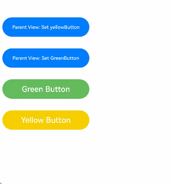
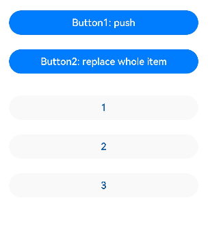

# \@Link装饰器：父子双向同步
<!--Kit: ArkUI-->
<!--Subsystem: ArkUI-->
<!--Owner: @jiyujia926-->
<!--Designer: @zhangboren-->
<!--Tester: @TerryTsao-->
<!--Adviser: @zhang_yixin13-->


子组件中被[\@Link](../../reference/apis-arkui/arkui-ts/ts-state-management-link.md#link)装饰的变量与其父组件中对应的数据源建立双向数据绑定。

在阅读\@Link文档前，建议先熟悉[\@State](./arkts-state.md)的基本用法。最佳实践请参考[状态管理最佳实践](https://developer.huawei.com/consumer/cn/doc/best-practices/bpta-status-management)。常见问题请参考[状态管理常见问题](./arkts-state-management-faq.md)。

> **说明：**
>
> 从API version 9开始，该装饰器支持在ArkTS卡片中使用。
>
> 从API version 11开始，该装饰器支持在原子化服务中使用。

## 概述

\@Link装饰的变量与其父组件中的数据源共享相同的值。


## 装饰器使用规则说明

| \@Link变量装饰器                                             | 说明                                                         |
| ------------------------------------------------------------ | ------------------------------------------------------------ |
| 装饰器参数                                                   | 无。                                                           |
| 同步类型                                                     | 双向同步。<br/>父组件状态变量与子组件\@Link建立双向同步，当其中一方改变时，另一方也会同步更新。 |
| 允许装饰的变量类型                                           |Object、class、string、number、boolean、enum类型，以及这些类型的数组。<br/>API version 10开始支持[Date类型](#装饰date类型变量)。<br/>API version 11及以上支持[Map](#装饰map类型变量)、[Set](#装饰set类型变量)类型、undefined和null类型、ArkUI框架定义的联合类型[Length](../../reference/apis-arkui/arkui-ts/ts-types.md#length)、[ResourceStr](../../reference/apis-arkui/arkui-ts/ts-types.md#resourcestr)、[ResourceColor](../../reference/apis-arkui/arkui-ts/ts-types.md#resourcecolor)类型以及这些类型的联合类型，示例见[Link支持联合类型实例](#link支持联合类型实例)。<br/>支持类型的场景请参考[观察变化](#观察变化)。|
| 不允许装饰的变量类型 | 不支持装饰Function类型。      |
| 被装饰变量的初始值                                           | 禁止本地初始化。                                         |


## 变量的传递/访问规则说明

| 传递/访问      | 说明                                       |
| ---------- | ---------------------------------------- |
| 从父组件初始化和更新 | 必选。<br/>允许父组件中[\@State](./arkts-state.md)、\@Link、[\@Prop](./arkts-prop.md)、[\@Provide](./arkts-provide-and-consume.md)、[\@Consume](./arkts-provide-and-consume.md)、[\@ObjectLink](./arkts-observed-and-objectlink.md)、[\@StorageLink](./arkts-appstorage.md#storagelink)、[\@StorageProp](./arkts-appstorage.md#storageprop)、[\@LocalStorageLink](./arkts-localstorage.md#localstoragelink)和[\@LocalStorageProp](./arkts-localstorage.md#localstorageprop)装饰变量初始化子组件\@Link，并建立双向绑定。<br/>- 从API&nbsp;version&nbsp;9开始，\@Link子组件从父组件初始化\@State的语法为Comp({&nbsp;aLink:&nbsp;this.aState&nbsp;})，同样支持Comp({aLink:&nbsp;$aState})。 |
| 用于初始化子组件   | 允许，可用于初始化常规变量、\@State、\@Link、\@Prop、\@Provide。 |
| 是否支持组件外访问  | 私有，只能在所属组件内访问。                           |

 **图1** 初始化规则示意图


## 观察变化和行为表现


### 观察变化

- 当装饰的数据类型为boolean、string、number类型时，可以同步观察到数值的变化，示例请参考[简单类型和类对象类型的@Link](#简单类型和类对象类型的link)。
- 当装饰的数据类型为class或者Object时，可以观察到赋值和属性赋值的变化，即`Object.keys(observedObject)`返回的所有属性，示例请参考[简单类型和类对象类型的@Link](#简单类型和类对象类型的link)。@Link仅能观察对象本身及其一层属性的变化，无法观察嵌套场景（如嵌套对象、对象数组）内层数据的变化，该场景请参考[\@Observed装饰器与\@ObjectLink装饰器的使用场景](arkts-observed-and-objectlink.md#使用场景)。
- 当装饰的对象是Array时，可以观察到数组添加、删除、更新数组单元的变化，示例请参考[数组类型的@Link](#数组类型的link)。
- 当装饰的对象是Date时，可以观察到Date的整体赋值，以及通过调用`setFullYear`, `setMonth`, `setDate`, `setHours`, `setMinutes`, `setSeconds`, `setMilliseconds`, `setTime`, `setUTCFullYear`, `setUTCMonth`, `setUTCDate`, `setUTCHours`, `setUTCMinutes`, `setUTCSeconds`, `setUTCMilliseconds`方法更新其属性，示例请参考[装饰Date类型变量](#装饰date类型变量)。
- 当装饰的变量是Map时，可以观察到Map整体的赋值，以及可通过调用Map的`set`、`clear`、`delete`接口更新Map的值，示例请参考[装饰Map类型变量](#装饰map类型变量)。
- 当装饰的变量是Set时，可以观察Set整体的赋值，以及通过调用Set的`add`、`clear`、`delete`接口更新其值，示例请参考[装饰Set类型变量](#装饰set类型变量)。
### 框架行为

\@Link装饰的变量和所属的自定义组件共享生命周期。

为了了解\@Link变量的初始化和更新机制，有必要先了解父组件和拥有\@Link变量的子组件的关系，以及初始渲染和双向更新的流程（以父组件为\@State为例）。

1. 初始渲染：执行父组件的 `build()` 函数，创建子组件的新实例。初始化过程如下：
   1. 指定父组件中的\@State变量用于初始化子组件的\@Link变量。子组件的\@Link变量值与其父组件的数据源变量保持双向数据同步。
   2. 父组件的\@State状态变量包装类通过构造函数传给子组件，子组件的\@Link包装类拿到父组件的\@State的状态变量后，将当前\@Link包装类实例注册给父组件的\@State变量。

2. \@Link的数据源的更新：即父组件中状态变量更新，引起相关子组件的\@Link的更新。处理步骤：
   1. 通过初始渲染的步骤可知，子组件\@Link包装类把当前this指针注册给父组件。父组件\@State变量变更后，会遍历更新所有依赖它的系统组件和状态变量（例如：\@Link包装类）。
   2. 通知\@Link包装类更新后，子组件中所有依赖\@Link状态变量的系统组件都会被通知更新。以此实现父组件对子组件的状态数据同步。

3. \@Link的更新：当子组件中\@Link更新后，处理步骤如下（以父组件为\@State为例）：
   1. \@Link更新后，调用父组件的\@State包装类的set方法，将数值同步回父组件。
   2. 子组件\@Link和父组件\@State分别遍历依赖的系统组件，更新对应的UI。从而实现子组件\@Link与父组件\@State的同步。


## 限制条件

1. \@Link装饰器不建议在[\@Entry](./arkts-create-custom-components.md#entry)装饰的自定义组件中使用，否则编译时会抛出警告；若该自定义组件作为页面根节点使用，则会抛出运行时错误。

2. \@Link装饰的变量禁止本地初始化，否则编译期会报错。

    ```ts
    // 错误写法，编译报错
    @Link count: number = 10;

    // 正确写法
    @Link count: number;
    ```

3. \@Link装饰的变量的类型要和数据源类型保持一致，否则编译期会报错。同时，数据源必须是状态变量，否则框架会抛出运行时错误。

    > **说明：**
    >
    > 从API version 23开始，添加对\@Link数据源错误的校验，运行时错误变为编译期报错。详情参见[UI相关应用崩溃常见问题](../arkts-stability-crash-issues.md)。

    【反例】
  
    ```ts
    class Info {
      value: string = 'Hello';
    }

    class Cousin {
      name: string = 'Hello';
    }

    @Component
    struct Child {
      // 错误写法1：@Link装饰的变量与@State装饰的变量类型不一致
      @Link test: Cousin;
      // 错误写法2：数据源非状态变量
      @Link testStr: string;

      build() {
        Column() {
          Text(this.test.name)
          Text(this.testStr)
        }
      }
    }

    @Entry
    @Component
    struct LinkExample {
      @State info: Info = new Info();

      build() {
        Column() {
          Child({
            // 错误写法1：@Link装饰的变量与@State装饰的变量类型不一致
            test: this.info,
            // 错误写法2：数据源非状态变量
            testStr: this.info.value
          })
        }
      }
    }
    ```

    【正例】

    <!-- @[link_usage](https://gitcode.com/openharmony/applications_app_samples/blob/master/code/DocsSample/ArkUISample/ComponentStateManagement/entry/src/main/ets/pages/LinkDecorator/LinkUsage.ets) --> 
    
    ``` TypeScript
    class LinkInfo {
      public value: string = 'Hello';
    }
    
    @Component
    struct LinkChild {
      // 在子组件中，使用@Link装饰LinkInfo类型的test变量
      @Link test: LinkInfo;
    
      build() {
        Text(this.test.value)
          .fontSize(20)
          .margin(10)
      }
    }
    
    @Entry
    @Component
    struct LinkExample {
      @State info: LinkInfo = new LinkInfo();
    
      build() {
        Column() {
          // 在父组件中，使用@State装饰的info变量初始化LinkChild组件的test变量
          LinkChild({test: this.info})
        }
        .width('100%')
      }
    }
    ```

    

4. \@Link装饰的变量仅能被状态变量初始化，不能使用常规变量初始化，否则会编译报错。

    【反例】
  
    ``` TypeScript
    @Component
    struct Child {
      @Link message: string;
    
      build() {
        Text(`${this.message}`).margin('20%')
      }
    }
    
    @Entry
    @Component
    struct LinkExample {
      message: string = 'Hello';
    
      build() {
        Column() {
          // 错误写法，常规变量不能初始化@Link
          Child({ message: this.message })
        }
      }
    }
    ```

    【正例】

    <!-- @[link_usage_two](https://gitcode.com/openharmony/applications_app_samples/blob/master/code/DocsSample/ArkUISample/ComponentStateManagement/entry/src/main/ets/pages/LinkDecorator/LinkUsage2.ets) --> 
    
    ``` TypeScript
    @Component
    struct LinkChild2 {
      @Link message: string;
    
      build() {
        Text(`${this.message}`).margin('20%')
      }
    }
    
    @Entry
    @Component
    struct LinkExample2 {
      @State message: string = 'Hello';
    
      build() {
        Column() {
          // 正确写法
          LinkChild2({ message: this.message })
        }
      }
    }
    ```

    

5. \@Link不支持装饰Function类型的变量，API version 23之前，应用在运行时会出现错误。

   从API version 23开始，在应用编译时添加了相关校验，\@Link装饰Function类型变量会提示ERROR，应在代码中删除Function类型变量的\@Link装饰器。


## 使用场景


### 简单类型和类对象类型的\@Link

以下示例中，点击父组件ShufflingContainer中的“Parent View: Set yellowButton”和“Parent View: Set GreenButton”，可以从父组件将变化同步给子组件。

  1.点击子组件GreenButton和YellowButton中的Button，子组件会发生相应变化，将变化同步给父组件。因为@Link是双向同步，会将变化同步给@State。

  2.当点击父组件ShufflingContainer中的Button时，@State会发生变化，并同步给\@Link，子组件也会进行对应的刷新。

<!-- @[link_class_type](https://gitcode.com/openharmony/applications_app_samples/blob/master/code/DocsSample/ArkUISample/ComponentStateManagement/entry/src/main/ets/pages/LinkDecorator/UsingLinkwithPrimitiveandClassTypes.ets) --> 

``` TypeScript
class GreenButtonState {
  public width: number = 0;

  constructor(width: number) {
    this.width = width;
  }
}

@Component
struct GreenButton {
  @Link greenButtonState: GreenButtonState;

  build() {
    Button('Green Button')
      .width(this.greenButtonState.width)
      .height(40)
      .backgroundColor('#64bb5c')
      .fontColor('#FFFFFF')
      .onClick(() => {
        if (this.greenButtonState.width < 700) {
          // 更新class的属性，变化可以被观察到同步回父组件
          this.greenButtonState.width += 60;
        } else {
          // 更新class，变化可以被观察到同步回父组件
          this.greenButtonState = new GreenButtonState(180);
        }
      })
  }
}

@Component
struct YellowButton {
  @Link yellowButtonState: number;

  build() {
    Button('Yellow Button')
      .width(this.yellowButtonState)
      .height(40)
      .backgroundColor('#f7ce00')
      .fontColor('#FFFFFF')
      .onClick(() => {
        // 子组件的简单类型可以同步回父组件
        this.yellowButtonState += 40.0;
      })
  }
}

@Entry
@Component
struct ShufflingContainer {
  @State greenButtonState: GreenButtonState = new GreenButtonState(180);
  @State yellowButtonProp: number = 180;

  build() {
    Column() {
      Flex({ direction: FlexDirection.Column, alignItems: ItemAlign.Center }) {
        // 简单类型从父组件@State向子组件@Link数据同步
        Button('Parent View: Set yellowButton')
          .width(this.yellowButtonProp)
          .height(40)
          .margin(12)
          .fontColor('#FFFFFF')
          .onClick(() => {
            this.yellowButtonProp = (this.yellowButtonProp < 700) ? this.yellowButtonProp + 40 : 100;
          })
        // class类型从父组件@State向子组件@Link数据同步
        Button('Parent View: Set GreenButton')
          .width(this.greenButtonState.width)
          .height(40)
          .margin(12)
          .fontColor('#FFFFFF')
          .onClick(() => {
            this.greenButtonState.width = (this.greenButtonState.width < 700) ? this.greenButtonState.width + 100 : 100;
          })
        // class类型初始化@Link
        GreenButton({ greenButtonState: this.greenButtonState }).margin(12)
        // 简单类型初始化@Link
        YellowButton({ yellowButtonState: this.yellowButtonProp }).margin(12)
      }
    }
  }
}
```



### 数组类型的\@Link


<!-- @[link_array_type](https://gitcode.com/openharmony/applications_app_samples/blob/master/code/DocsSample/ArkUISample/ComponentStateManagement/entry/src/main/ets/pages/LinkDecorator/UsingLinkwithArrayTypes.ets) -->  

``` TypeScript
@Component
struct ArrayTypesChild {
  @Link items: number[];

  build() {
    Column() {
      Button(`Button1: push`)
        .margin(12)
        .width(312)
        .height(40)
        .fontColor('#FFFFFF')
        .onClick(() => {
          this.items.push(this.items.length + 1);
        })
      // 子组件的数组类型可以同步回父组件
      Button(`Button2: replace whole item`)
        .margin(12)
        .width(312)
        .height(40)
        .fontColor('#FFFFFF')
        .onClick(() => {
          this.items = [100, 200, 300];
        })
    }
  }
}

@Entry
@Component
struct ArrayTypes {
  @State arr: number[] = [1, 2, 3];

  build() {
    Column() {
      ArrayTypesChild({ items: $arr })
        .margin(12)
      ForEach(this.arr,
        (item: number) => {
          Button(`${item}`)
            .margin(12)
            .width(312)
            .height(40)
            .backgroundColor('#11a2a2a2')
            .fontColor('#e6000000')
        },
        (item: number) => item.toString()
      )
    }
  }
}
```




状态管理框架可以观察到数组元素的添加、删除和替换。在该示例中，\@State和\@Link的类型均为number[]，不支持将\@Link定义成number类型（\@Link item : number），并用\@State数组中的每个数据项在父组件中创建子组件。如需使用这种场景，可以参考[\@Prop](arkts-prop.md)和[\@Observed](./arkts-observed-and-objectlink.md)。

### 装饰Map类型变量

> **说明：**
>
> 从API version 11开始，\@Link支持Map类型。

在下面的示例中，value类型为Map\<number, string\>，点击Button改变value的值，视图会随之刷新。

<!-- @[link_map_type](https://gitcode.com/openharmony/applications_app_samples/blob/master/code/DocsSample/ArkUISample/ComponentStateManagement/entry/src/main/ets/pages/LinkDecorator/DecoratingVariablesMapType.ets) -->  

``` TypeScript
@Component
struct MapSampleChild {
  @Link value: Map<number, string>;

  build() {
    Column() {
      ForEach(Array.from(this.value.entries()), (item: [number, string]) => {
        Text(`${item[0]}`)
          .fontSize(30)
          .margin(10)
        Text(`${item[1]}`)
          .fontSize(30)
          .margin(10)
        Divider()
      })
      // 子组件的Map类型可以同步回父组件
      Button('child init map')
        .width(300)
        .margin(10)
        .onClick(() => {
          this.value = new Map([[0, 'a'], [1, 'b'], [3, 'c']]);
        })
      Button('child set new one')
        .width(300)
        .margin(10)
        .onClick(() => {
          this.value.set(4, 'd');
        })
      Button('child clear')
        .width(300)
        .margin(10)
        .onClick(() => {
          this.value.clear();
        })
      Button('child replace the first one')
        .width(300)
        .margin(10)
        .onClick(() => {
          this.value.set(0, 'aa');
        })
      Button('child delete the first one')
        .width(300)
        .margin(10)
        .onClick(() => {
          this.value.delete(0);
        })
    }
    .width('100%')
  }
}


@Entry
@Component
struct MapSample {
  @State message: Map<number, string> = new Map([[0, 'a'], [1, 'b'], [3, 'c']]);

  build() {
    Row() {
      Column() {
        MapSampleChild({ value: this.message })
      }
      .width('100%')
    }
    .height('100%')
  }
}
```


### 装饰Set类型变量

> **说明：**
>
> 从API version 11开始，\@Link支持Set类型。

在下面的示例中，message类型为Set\<number\>，点击Button改变message的值，视图会随之刷新。

<!-- @[link_set_type](https://gitcode.com/openharmony/applications_app_samples/blob/master/code/DocsSample/ArkUISample/ComponentStateManagement/entry/src/main/ets/pages/LinkDecorator/DecoratingVariablesSetType.ets) -->  

``` TypeScript
@Component
struct SetSampleChild {
  @Link message: Set<number>;

  build() {
    Column() {
      ForEach(Array.from(this.message.entries()), (item: [number, number]) => {
        Text(`${item[0]}`)
          .fontSize(30)
          .margin(10)
        Divider()
      })
      // 子组件的Set类型可以同步回父组件
      Button('init set')
        .width(300)
        .margin(10)
        .onClick(() => {
          this.message = new Set([0, 1, 2, 3, 4]);
        })
      Button('set new one')
        .width(300)
        .margin(10)
        .onClick(() => {
          this.message.add(5);
        })
      Button('clear')
        .width(300)
        .margin(10)
        .onClick(() => {
          this.message.clear();
        })
      Button('delete the first one')
        .width(300)
        .margin(10)
        .onClick(() => {
          this.message.delete(0);
        })
    }
    .width('100%')
  }
}


@Entry
@Component
struct SetSample {
  @State message: Set<number> = new Set([0, 1, 2, 3, 4]);

  build() {
    Row() {
      Column() {
        SetSampleChild({ message: this.message })
      }
      .width('100%')
    }
    .height('100%')
  }
}
```


### 装饰Date类型变量

在下面的示例中，selectedDate类型为Date，点击Button改变selectedDate的值，视图会随之刷新。

<!-- @[link_data_type](https://gitcode.com/openharmony/applications_app_samples/blob/master/code/DocsSample/ArkUISample/ComponentStateManagement/entry/src/main/ets/pages/LinkDecorator/DecoratingVariablesDateType.ets) -->  

``` TypeScript
@Component
struct DateComponent {
  @Link selectedDate: Date;

  build() {
    Column() {
      // 子组件的Date类型可以同步回父组件
      Button(`child increase the year by 1`)
        .width(300)
        .margin(10)
        .onClick(() => {
          this.selectedDate.setFullYear(this.selectedDate.getFullYear() + 1);
        })
      Button('child update the new date')
        .width(300)
        .margin(10)
        .onClick(() => {
          this.selectedDate = new Date('2023-09-09');
        })
      DatePicker({
        start: new Date('1970-1-1'),
        end: new Date('2100-1-1'),
        selected: this.selectedDate
      })
    }
    .width('100%')
  }
}

@Entry
@Component
struct ParentComponent {
  @State parentSelectedDate: Date = new Date('2021-08-08');

  build() {
    Column() {
      Button('parent increase the month by 1')
        .width(300)
        .margin(10)
        .onClick(() => {
          this.parentSelectedDate.setMonth(this.parentSelectedDate.getMonth() + 1);
        })
      Button('parent update the new date')
        .width(300)
        .margin(10)
        .onClick(() => {
          this.parentSelectedDate = new Date('2023-07-07');
        })
      DatePicker({
        start: new Date('1970-1-1'),
        end: new Date('2100-1-1'),
        selected: this.parentSelectedDate
      })

      DateComponent({ selectedDate:this.parentSelectedDate })
    }
    .width('100%')
  }
}
```


### 使用双向同步机制更改本地其他变量

通过[\@Watch](./arkts-watch.md)可以在双向同步时更改本地变量。

以下示例中，在\@Link的\@Watch里面修改了一个\@State装饰的变量memberMessage，实现父子组件间的变量同步，但是\@State装饰的变量memberMessage在本地修改不会影响到父组件中的变量改变。

<!-- @[link_watch](https://gitcode.com/openharmony/applications_app_samples/blob/master/code/DocsSample/ArkUISample/ComponentStateManagement/entry/src/main/ets/pages/LinkDecorator/UseWatchToChangeLocalVariables.ets) -->  

``` TypeScript
@Entry
@Component
struct ChangeVariables {
  @State sourceNumber: number = 0;

  build() {
    Column() {
      Text(`sourceNumber of the parent component:` + this.sourceNumber)
        .fontSize(20)
        .margin(10)
      ChangeVariablesChild({ sourceNumber: this.sourceNumber })
      Button('Change sourceNumber in Parent Component')
        .width(300)
        .margin(10)
        .onClick(() => {
          this.sourceNumber++;
        })
    }
    .width('100%')
    .height('100%')
  }
}

@Component
struct ChangeVariablesChild {
  @State memberMessage: string = 'Hello World';
  @Link @Watch('onSourceChange') sourceNumber: number;

  onSourceChange() {
    // memberMessage在子组件中本地修改不会影响到父组件中的变量改变
    this.memberMessage = this.sourceNumber.toString();
  }

  build() {
    Column() {
      Text(this.memberMessage)
        .fontSize(20)
        .margin(10)
      Text(`sourceNumber of the child component:` + this.sourceNumber.toString())
        .fontSize(20)
        .margin(10)
      Button('Change memberMessage in Child Component')
        .width(300)
        .margin(10)
        .onClick(() => {
          this.memberMessage = 'Hello memberMessage';
        })
    }
    .width('100%')
  }
}
```


### \@Link支持联合类型实例

`@Link`支持联合类型、`undefined`和`null`。在以下示例中，`name`类型为`string | undefined`。点击父组件`UnionTypes`中的按钮可以改变`name`的属性或类型，`UnionChild`组件也会相应刷新。

<!-- @[link_union_type](https://gitcode.com/openharmony/applications_app_samples/blob/master/code/DocsSample/ArkUISample/ComponentStateManagement/entry/src/main/ets/pages/LinkDecorator/UsingUnionTypes.ets) -->  

``` TypeScript
@Component
struct UnionChild {
  // @Link支持联合类型
  @Link name: string | undefined;

  build() {
    Column() {
      Button('Child change name to Bob')
        .width(300)
        .margin(10)
        .onClick(() => {
          this.name = 'Bob';
        })

      Button('Child change name to undefined')
        .width(300)
        .margin(10)
        .onClick(() => {
          this.name = undefined;
        })

    }
    .width('100%')
  }
}

@Entry
@Component
struct UnionTypes {
  @State name: string | undefined = 'mary';

  build() {
    Column() {
      Text(`The name is  ${this.name}`)
        .fontSize(20)
        .margin(10)

      UnionChild({ name: this.name })

      Button('Parents change name to Peter')
        .width(300)
        .margin(10)
        .onClick(() => {
          this.name = 'Peter';
        })

      Button('Parents change name to undefined')
        .width(300)
        .margin(10)
        .onClick(() => {
          this.name = undefined;
        })
    }
    .width('100%')
  }
}
```


<!--no_check-->
