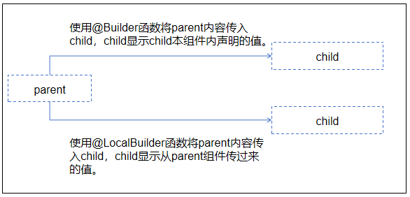

# \@LocalBuilder装饰器： 维持组件关系
<!--Kit: ArkUI-->
<!--Subsystem: ArkUI-->
<!--Owner: @zhangboren-->
<!--Designer: @zhangboren-->
<!--Tester: @TerryTsao-->
<!--Adviser: @zhang_yixin13-->

当开发者使用局部\@Builder进行引用数据传递时，需要考虑组件的父子关系。然而在使用.bind(this)的方式更改函数调用上下文后，会出现组件的父子关系与状态管理的父子关系不一致的问题。为了解决这一问题，引入\@LocalBuilder装饰器。\@LocalBuilder拥有和局部\@Builder相同的功能，且比局部\@Builder能够更好的确定组件的父子关系和状态管理的父子关系。

在阅读本文档前，建议提前阅读：[@Builder](./arkts-builder.md)。

> **说明：**
>
> 从API version 12开始支持。
>
> 从API version 12开始，该装饰器支持在ArkTS卡片中使用。
>
> 从API version 12开始，该装饰器支持在原子化服务中使用。

## 装饰器使用说明

### 自定义组件内自定义构建函数

定义的语法：

```ts
@LocalBuilder myBuilderFunction() { ... }
```

使用方法：

```ts
this.myBuilderFunction()
```
- 允许在自定义组件内定义一个或多个@LocalBuilder函数，该函数被认为是该组件的私有、特殊类型的成员函数。

- 自定义构建函数可以在所属组件的build函数和其他自定义构建函数中调用，但不允许在组件外调用。

- 在自定义函数体中，this指代当前所属组件，组件的状态变量可以在自定义构建函数内访问。建议通过this访问自定义组件的状态变量而不是参数传递。

## 限制条件

- \@LocalBuilder只能在所属组件内声明，不允许全局声明。

- \@LocalBuilder不能与内置装饰器或自定义装饰器一起使用。

- 在自定义组件中，\@LocalBuilder不能用来装饰静态函数。

## \@LocalBuilder和局部\@Builder使用区别

跨组件传递局部\@Builder函数时，会使用.bind(this)更改函数上下文，但这可能会导致组件的父子关系与状态管理的父子关系不一致。而\@LocalBuilder无论是否使用.bind(this)，都不会改变组件的父子关系，即\@LocalBuilder中定义组件所属的父组件是确定的，无法被改变。详情请参考[@LocalBuilder和@Builder区别说明](arkts-localBuilder.md#localbuilder和builder区别说明)。



> **说明：**
>
> bind()方法创建一个新的函数，称为绑定函数，当调用者绑定bind()时，该绑定函数会以创建时传入的第一个this作为原函数的this。

## 参数传递规则

\@LocalBuilder函数的参数传递有[按值传递](#按值传递参数)和[按引用传递](#按引用传递参数)两种，均需遵守以下规则：

- 参数的类型必须与参数声明的类型一致，且不允许为undefined、null。

- 在\@LocalBuilder修饰的函数内部，不允许改变参数值。

- \@LocalBuilder内的UI语法遵循[UI语法规则](arkts-create-custom-components.md#build函数)。

- 传入一个对象字面量参数时按引用传递，其他方式按值传递。

### 按引用传递参数

按引用传递参数时，传递的参数可为状态变量，且状态变量的改变会引起\@LocalBuilder函数内的UI刷新。

> **说明：**
>
> 若\@LocalBuilder函数和$$参数一起使用，子组件调用父组件的@LocalBuilder函数，子组件传入的参数发生变化，不会引起\@LocalBuilder函数内的UI刷新。

组件Parent内的\@LocalBuilder函数在build函数内调用，按键值对写法进行传值，当点击Click me时，\@LocalBuilder内的Text文本内容会随着状态变量内容的改变而改变。

```ts
class ReferenceType {
  paramString: string = '';
}

@Entry
@Component
struct Parent {
  @State variableValue: string = 'Hello World';

  @LocalBuilder
  citeLocalBuilder(params: ReferenceType) {
    Row() {
      Text(`UseStateVarByReference: ${params.paramString}`)
    }
  };

  build() {
    Column() {
      this.citeLocalBuilder({ paramString: this.variableValue })
      Button('Click me').onClick(() => {
        this.variableValue = 'Hi World';
      })
    }
  }
}
```

按引用传递参数时，如果在\@LocalBuilder函数内调用自定义组件，ArkUI提供[$$](arkts-two-way-sync.md)作为按引用传递参数的范式。

组件Parent内的\@LocalBuilder函数内调用自定义组件，且按照引用传递参数将值传递到自定义组件，当Parent组件内状态变量值发生变化时，\@LocalBuilder函数内的自定义组件HelloComponent的message值也会发生变化。

```ts
class ReferenceType {
  paramString: string = '';
}

@Component
struct HelloComponent {
  @Prop message: string;

  build() {
    Row() {
      Text(`HelloComponent===${this.message}`)
    }
  }
}

@Entry
@Component
struct Parent {
  @State variableValue: string = 'Hello World';

  @LocalBuilder
  citeLocalBuilder($$: ReferenceType) {
    Row() {
      Column() {
        Text(`citeLocalBuilder===${$$.paramString}`)
        HelloComponent({ message: $$.paramString })
      }
    }
  }

  build() {
    Column() {
      this.citeLocalBuilder({ paramString: this.variableValue })
      Button('Click me').onClick(() => {
        this.variableValue = 'Hi World';
      })
    }
  }
}
```

当子组件引用父组件的\@LocalBuilder函数并传入状态变量时，状态变量的改变不会触发\@LocalBuilder函数内的UI刷新。这是因为调用\@LocalBuilder装饰的函数创建出来的组件绑定于父组件，而状态变量的刷新机制仅作用于当前组件及其子组件，对父组件无效。而使用\@Builder修饰函数可触发UI刷新，原因在于\@Builder改变了函数的this指向，使创建出来的组件绑定到子组件上，从而在子组件修改变量能够实现\@Builder中的UI刷新。

组件Child将状态变量传递到Parent的\@Builder和\@LocalBuilder函数内。在\@Builder函数内，`this`指向Child，参数变化能触发UI刷新。在\@LocalBuilder函数内，`this`指向Parent，参数变化不会触发UI刷新。若\@LocalBuilder函数内引用Parent的状态变量发生变化，UI能正常刷新。

```ts
class Data {
  size: number = 0;
}

@Entry
@Component
struct Parent {
  label: string = 'parent';
  @State data: Data = new Data();

  @Builder
  componentBuilder($$: Data) {
    Text(`builder + $$`)
    Text(`${'this -> ' + this.label}`)
    Text(`${'size : ' + $$.size}`)
  }

  @LocalBuilder
  componentLocalBuilder($$: Data) {
    Text(`LocalBuilder + $$ data`)
    Text(`${'this -> ' + this.label}`)
    Text(`${'size : ' + $$.size}`)
  }

  @LocalBuilder
  contentLocalBuilderNoArgument() {
    Text(`LocalBuilder + local data`)
    Text(`${'this -> ' + this.label}`)
    Text(`${'size : ' + this.data.size}`)
  }

  build() {
    Column() {
      Child({
        contentBuilder: this.componentBuilder,
        contentLocalBuilder: this.componentLocalBuilder,
        contentLocalBuilderNoArgument: this.contentLocalBuilderNoArgument,
        data: this.data
      })
    }
  }
}

@Component
struct Child {
  label: string = 'child';
  @Builder customBuilder() {};
  @BuilderParam contentBuilder: ((data: Data) => void) = this.customBuilder;
  @BuilderParam contentLocalBuilder: ((data: Data) => void) = this.customBuilder;
  @BuilderParam contentLocalBuilderNoArgument: (() => void) = this.customBuilder;
  @Link data: Data;

  build() {
    Column() {
      this.contentBuilder({ size: this.data.size })
      this.contentLocalBuilder({ size: this.data.size })
      this.contentLocalBuilderNoArgument()
      Button("add child size").onClick(() => {
        this.data.size += 1;
      })
    }
  }
}
```

### 按值传递参数

调用\@LocalBuilder装饰的函数默认按值传递。当传递的参数为状态变量时，状态变量的改变不会引起\@LocalBuilder函数内的UI刷新。所以当使用状态变量的时候，推荐使用[按引用传递](#按引用传递参数)。

组件Parent将\@State修饰的label值按照函数传参方式传递到\@LocalBuilder函数内，此时\@LocalBuilder函数获取到的值为普通变量值，所以改变\@State修饰的label值时，\@LocalBuilder函数内的值不会发生改变。

```ts
@Entry
@Component
struct Parent {
  @State label: string = 'Hello';

  @LocalBuilder
  citeLocalBuilder(paramA1: string) {
    Row() {
      Text(`UseStateVarByValue: ${paramA1}`)
    }
  }

  build() {
    Column() {
      this.citeLocalBuilder(this.label)
    }
  }
}
```

## \@LocalBuilder和\@Builder区别说明

当函数componentBuilder被\@Builder修饰时，显示效果为“Child”；当函数componentBuilder被\@LocalBuilder修饰时，显示效果是“Parent”。
说明：

\@Builder componentBuilder()通过this.componentBuilder的形式传给子组件\@BuilderParam customBuilderParam，this指向子组件Child的实例。

\@LocalBuilder componentBuilder()通过this.componentBuilder的形式传给子组件\@BuilderParam customBuilderParam，this指向父组件Parent的实例。

```ts
@Component
struct Child {
  label: string = 'Child';
  @BuilderParam customBuilderParam: () => void;

  build() {
    Column() {
      this.customBuilderParam()
    }
  }
}

@Entry
@Component
struct Parent {
  label: string = 'Parent';

  @Builder componentBuilder() {
    Text(`${this.label}`)
  }

  // @LocalBuilder componentBuilder() {
  //   Text(`${this.label}`)
  // }

  build() {
    Column() {
      Child({ customBuilderParam: this.componentBuilder })
    }
  }
}
```

## 使用场景

### \@LocalBuilder在\@ComponentV2修饰的自定义组件中使用

在@ComponentV2装饰的自定义组件中使用局部的@LocalBuilder，修改变量时会触发UI刷新。

```ts
@ObservedV2
class Info {
  @Trace name: string = '';
  @Trace age: number = 0;
}

@ComponentV2
struct ChildPage {
  @Require @Param childInfo: Info;

  build() {
    Column() {
      Text(`自定义组件 name :${this.childInfo.name}`)
        .fontSize(20)
        .fontWeight(FontWeight.Bold)
      Text(`自定义组件 age :${this.childInfo.age}`)
        .fontSize(20)
        .fontWeight(FontWeight.Bold)
    }
  }
}

@Entry
@ComponentV2
struct ParentPage {
  info1: Info = { name: "Tom", age: 25 };
  @Local info2: Info = { name: "Tom", age: 25 };

  @LocalBuilder
  privateBuilder() {
    Column() {
      Text(`局部LocalBuilder@Builder name :${this.info1.name}`)
        .fontSize(20)
        .fontWeight(FontWeight.Bold)
      Text(`局部LocalBuilder@Builder age :${this.info1.age}`)
        .fontSize(20)
        .fontWeight(FontWeight.Bold)
    }
  }

  @LocalBuilder
  privateBuilderSecond() {
    Column() {
      Text(`局部LocalBuilder@Builder name :${this.info2.name}`)
        .fontSize(20)
        .fontWeight(FontWeight.Bold)
      Text(`局部LocalBuilder@Builder age :${this.info2.age}`)
        .fontSize(20)
        .fontWeight(FontWeight.Bold)
    }
  }

  build() {
    Column() {
      Text(`info1: ${this.info1.name}  ${this.info1.age}`) // Text1
        .fontSize(30)
        .fontWeight(FontWeight.Bold)
      this.privateBuilder() // 调用局部@Builder
      Line()
        .width('100%')
        .height(10)
        .backgroundColor('#000000').margin(10)
      Text(`info2: ${this.info2.name}  ${this.info2.age}`) // Text2
        .fontSize(30)
        .fontWeight(FontWeight.Bold)
      this.privateBuilderSecond() // 调用局部@Builder
      Line()
        .width('100%')
        .height(10)
        .backgroundColor('#000000').margin(10)
      Text(`info1: ${this.info1.name}  ${this.info1.age}`) // Text1
        .fontSize(30)
        .fontWeight(FontWeight.Bold)
      ChildPage({ childInfo: this.info1 }) // 调用自定义组件
      Line()
        .width('100%')
        .height(10)
        .backgroundColor('#000000').margin(10)
      Text(`info2: ${this.info2.name}  ${this.info2.age}`) // Text2
        .fontSize(30)
        .fontWeight(FontWeight.Bold)
      ChildPage({ childInfo: this.info2 }) // 调用自定义组件
      Line()
        .width('100%')
        .height(10)
        .backgroundColor('#000000').margin(10)
      Button("change info1&info2")
        .onClick(() => {
          this.info1 = { name: "Cat", age: 18 }; // Text1不会刷新，原因是info1没被装饰器装饰，无法监听到值的改变。
          this.info2 = { name: "Cat", age: 18 }; // Text2会刷新，原因是info2有装饰器装饰，可以监听到值的改变。
        })
    }
  }
}
```