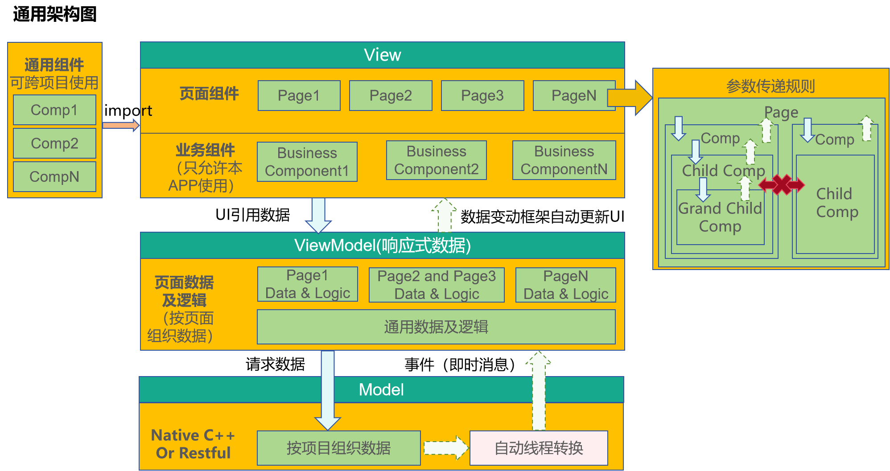
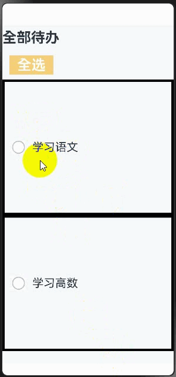
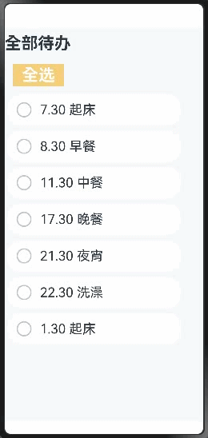
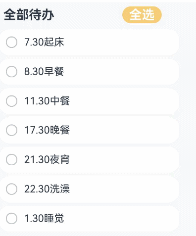

# MVVM模式

当开发者掌握了状态管理的基本概念后，往往想开发一款自己的应用。然而，如果在应用开发初期未能精心规划项目结构，随着项目的不断扩展和复杂化，状态变量的增多将导致组件间关系变得错综复杂。此时，开发任何新功能都可能引起连锁反应，维护成本也会增加。为此，本文旨在介绍MVVM模式以及ArkUI的UI开发模式与MVVM的关系，指引开发者如何去设计自己的项目结构，从而在产品迭代和升级时，能更容易的去开发和维护。


本文档涵盖了大多数状态管理V1装饰器，所以在阅读本文档前，建议开发者对状态管理V1有一定的了解。建议提前阅读：[状态管理概述](./arkts-state-management-overview.md)和状态管理V1装饰器相关文档。

## MVVM模式介绍

### 概念

在应用开发中，UI的更新需要随着数据状态的变化进行实时同步，而这种同步往往决定了应用程序的性能和用户体验。为了解决数据与UI同步的复杂性，ArkUI采用了 Model-View-ViewModel（MVVM）架构模式。MVVM 将应用分为Model、View和ViewModel三个核心部分，实现数据、视图与逻辑的分离。通过这种模式，UI可以随着状态的变化自动更新，无需手动处理，从而更加高效地管理数据和视图的绑定与更新。

- Model：负责存储和管理应用的数据以及业务逻辑，不直接与用户界面交互。通常从后端接口获取数据，是应用程序的数据基础，确保数据的一致性和完整性。
- View：负责用户界面展示数据并与用户交互，不包含任何业务逻辑。它通过绑定ViewModel层提供的数据来动态更新UI。
- ViewModel：负责管理UI状态和交互逻辑。作为连接Model和View的桥梁，通常一个View对应一个ViewModel，ViewModel监控Model数据的变化，通知View更新UI，同时处理用户交互事件并转换为数据操作。

ArkUI的UI开发模式就属于MVVM模式，通过对MVVM概念的基本介绍，开发者大致能猜到状态管理能在MVVM中起什么样的作用，状态管理旨在数据驱动更新，让开发者只用关注页面设计，而不去关注整个UI的刷新逻辑，数据的维护也无需开发者进行感知，由状态变量自动更新完成，而这就是属于ViewModel层所需要支持的内容，因此开发者使用MVVM模式开发自己的应用是最省心省力的。

### ArkUI开发模式图

ArkUI的UI开发开发模式即是MVVM模式，而状态变量在MVVM模式中扮演着ViewModel的角色，向上刷新UI，向下更新数据，整体框架如下图：



### 分层说明

**View层**

* 页面组件：所有应用基本都是按照页面进行分类的，比如登录页，列表页，编辑页，帮助页，版权页等。每个页对应需要的数据可能是完全不一样的，也可能多个页面需要的数据是同一套。
* 业务组件：本身具备本APP部分业务能力的功能组件，典型的就是这个业务组件可能关联了本项目的ViewModel中的数据，不可以被共享给其他项目使用。
* 通用组件：像系统组件一样，这类组件不会关联本APP中ViewModel的数据，这些组件可实现跨越多个项目进行共享，来完成比较通用的功能。

**ViewModel层**

* 页面数据：按照页面组织的数据，当用户浏览页面时，某些页面可能不会被显示出来，因此，这个页面数据最好设计成懒加载（按需加载）的模式。

> ViewModel层数据和Model层数据的区别：
>
> Model层数据是按照整个工程，项目来组织数据，是一套完成本APP的业务数据。
>
> ViewModel层数据，是提供某个页面上使用的数据，它可能是整个APP的业务数据的一部分。另外ViewModel层还可以附加对应Page的辅助页面显示数据，这部分数据可能与本APP的业务完全无关，仅仅是为页面展示提供便利的辅助数据。

**Model层**

Model层是应用的原始数据提供者。

### 架构核心原则

**不可跨层访问**

* View层不可以直接调用Model层的数据，只能通过ViewModel提供的方法进行调用。
* Model层数据，不可以直接操作UI，Model层只能通知ViewModel层数据有更新，由ViewModel层更新对应的数据。

**下层不可访问上层数据**

下层的数据通过通知模式更新上层数据。在业务逻辑中，下层不可直接写代码去获取上层数据。如ViewModel层的逻辑处理，不能去依赖View层界面上的某个值。

**非父子组件间不可直接访问**

这是针对View层设计的核心原则，一个组件应该具备这样的逻辑：

* 禁止直接访问父组件（必须使用事件或是订阅能力）。
* 禁止直接访问兄弟组件能力。这是因为组件应该仅能访问自己看的见的子节点（通过传参）和父节点（通过事件或通知），以此完成组件之间的解耦。

对于一个组件，这样设计的原因是：

* 组件自己使用了哪些子组件是明确的，因此可以访问。
* 组件被放置于哪个父节点下是未知的，因此组件想访问父节点，就只能通过通知或者事件能力完成。
* 组件不可能知道自己的兄弟节点是谁，因此组件不可以操纵兄弟节点。

## 备忘录开发实战

本节通过备忘录应用的开发，让开发者了解如何通过ArkUI框架设计自己的应用，本节未设计代码架构直接进行功能开发，即根据需求做即时开发，不考虑后续维护，同时向开发者介绍功能开发所需的装饰器。

### @State状态变量

* @State装饰器作为最常用的装饰器，用来定义状态变量，一般作为父组件的数据源，当开发者点击时，通过触发状态变量的更新从而刷新UI，去掉@State则不再支持刷新UI。

```typescript
@Entry
@Component
struct Index {
  @State isFinished: boolean = false;

  build() {
    Column() {
      Row() {
        Text('全部待办')
          .fontSize(30)
          .fontWeight(FontWeight.Bold)
      }
      .width('100%')
      .margin({top: 10, bottom: 10})

      // 待办事项
      Row({space: 15}) {
        if (this.isFinished) {
          // 此处'app.media.finished'仅作示例，请开发者自行替换，否则imageSource创建失败会导致后续无法正常执行。
          Image($r('app.media.finished'))
            .width(28)
            .height(28)
        }
        else {
          // 此处'app.media.unfinished'仅作示例，请开发者自行替换，否则imageSource创建失败会导致后续无法正常执行。
          Image($r('app.media.unfinished'))
            .width(28)
            .height(28)
        }
        Text('学习高数')
          .fontSize(24)
          .fontWeight(450)
          .decoration({type: this.isFinished ? TextDecorationType.LineThrough : TextDecorationType.None})
      }
      .height('40%')
      .width('100%')
      .border({width: 5})
      .padding({left: 15})
      .onClick(() => {
        this.isFinished = !this.isFinished;
      })
    }
    .height('100%')
    .width('100%')
    .margin({top: 5, bottom: 5})
    .backgroundColor('#90f1f3f5')
  }
}
```

效果图：


### @Prop、@Link的作用

上述示例中，所有的代码都写在了@Entry组件中，随着需要渲染的组件越来越多，@Entry组件必然需要进行拆分，为此拆分出的子组件就需要使用@Prop和@Link装饰器：

* @Prop是父子间单向传递，子组件会深拷贝父组件数据，可从父组件更新，也可自己更新数据，但不会同步父组件数据。
* @Link是父子间双向传递，父组件改变，会通知所有的@Link，同时@Link的更新也会通知父组件对应变量进行刷新。

```typescript
@Component
struct TodoComponent {
  build() {
    Row() {
      Text('全部待办')
        .fontSize(30)
        .fontWeight(FontWeight.Bold)
    }
    .width('100%')
    .margin({top: 10, bottom: 10})
  }
}

@Component
struct AllChooseComponent {
  @Link isFinished: boolean;

  build() {
    Row() {
      Button('全选', {type: ButtonType.Normal})
        .onClick(() => {
          this.isFinished = !this.isFinished;
        })
        .fontSize(30)
        .fontWeight(FontWeight.Bold)
        .backgroundColor('#f7f6cc74')
    }
    .padding({left: 15})
    .width('100%')
    .margin({top: 10, bottom: 10})
  }
}

@Component
struct ThingsComponent1 {
  @Prop isFinished: boolean;

  build() {
    // 待办事项1
    Row({space: 15}) {
      if (this.isFinished) {
        // 此处'app.media.finished'仅作示例，请开发者自行替换，否则imageSource创建失败会导致后续无法正常执行。
        Image($r('app.media.finished'))
          .width(28)
          .height(28)
      }
      else {
        // 此处'app.media.unfinished'仅作示例，请开发者自行替换，否则imageSource创建失败会导致后续无法正常执行。
        Image($r('app.media.unfinished'))
          .width(28)
          .height(28)
      }
      Text('学习语文')
        .fontSize(24)
        .fontWeight(450)
        .decoration({type: this.isFinished ? TextDecorationType.LineThrough : TextDecorationType.None})
    }
    .height('40%')
    .width('100%')
    .border({width: 5})
    .padding({left: 15})
    .onClick(() => {
      this.isFinished = !this.isFinished;
    })
  }
}

@Component
struct ThingsComponent2 {
  @Prop isFinished: boolean;

  build() {
    // 待办事项1
    Row({space: 15}) {
      if (this.isFinished) {
        // 此处'app.media.finished'仅作示例，请开发者自行替换，否则imageSource创建失败会导致后续无法正常执行。
        Image($r('app.media.finished'))
          .width(28)
          .height(28)
      }
      else {
        // 此处'app.media.unfinished'仅作示例，请开发者自行替换，否则imageSource创建失败会导致后续无法正常执行。
        Image($r('app.media.unfinished'))
          .width(28)
          .height(28)
      }
      Text('学习高数')
        .fontSize(24)
        .fontWeight(450)
        .decoration({type: this.isFinished ? TextDecorationType.LineThrough : TextDecorationType.None})
    }
    .height('40%')
    .width('100%')
    .border({width: 5})
    .padding({left: 15})
    .onClick(() => {
      this.isFinished = !this.isFinished;
    })
  }
}

@Entry
@Component
struct Index {
  @State isFinished: boolean = false;

  build() {
    Column() {
      // 全部待办
      TodoComponent()

      // 全选
      AllChooseComponent({isFinished: this.isFinished})

      // 待办事项1
      ThingsComponent1({isFinished: this.isFinished})

      // 待办事项2
      ThingsComponent2({isFinished: this.isFinished})
    }
    .height('100%')
    .width('100%')
    .margin({top: 5, bottom: 5})
    .backgroundColor('#90f1f3f5')
  }
}
```

效果图如下：



### 循环渲染组件

* 上个示例虽然拆分出了子组件，但是发现组件1和组件2的代码十分类似，当渲染的组件除了数据外其他设置都相同时，此时就需要使用到ForEach循环渲染。
* ForEach使用之后，冗余代码变得更少，并且代码结构更加清晰。

```typescript
@Component
struct TodoComponent {
  build() {
    Row() {
      Text('全部待办')
        .fontSize(30)
        .fontWeight(FontWeight.Bold)
    }
    .width('100%')
    .margin({top: 10, bottom: 10})
  }
}

@Component
struct AllChooseComponent {
  @Link isFinished: boolean;

  build() {
    Row() {
      Button('全选', {type: ButtonType.Normal})
        .onClick(() => {
          this.isFinished = !this.isFinished;
        })
        .fontSize(30)
        .fontWeight(FontWeight.Bold)
        .backgroundColor('#f7f6cc74')
    }
    .padding({left: 15})
    .width('100%')
    .margin({top: 10, bottom: 10})
  }
}

@Component
struct ThingsComponent {
  @Prop isFinished: boolean;
  @Prop things: string;
  build() {
    // 待办事项1
    Row({space: 15}) {
      if (this.isFinished) {
        // 此处'app.media.finished'仅作示例，请开发者自行替换，否则imageSource创建失败会导致后续无法正常执行。
        Image($r('app.media.finished'))
          .width(28)
          .height(28)
      }
      else {
        // 此处'app.media.unfinished'仅作示例，请开发者自行替换，否则imageSource创建失败会导致后续无法正常执行。
        Image($r('app.media.unfinished'))
          .width(28)
          .height(28)
      }
      Text(`${this.things}`)
        .fontSize(24)
        .fontWeight(450)
        .decoration({type: this.isFinished ? TextDecorationType.LineThrough : TextDecorationType.None})
    }
    .height('8%')
    .width('90%')
    .padding({left: 15})
    .opacity(this.isFinished ? 0.3: 1)
    .border({width:1})
    .borderColor(Color.White)
    .borderRadius(25)
    .backgroundColor(Color.White)
    .onClick(() => {
      this.isFinished = !this.isFinished;
    })
  }
}

@Entry
@Component
struct Index {
  @State isFinished: boolean = false;
  @State planList: string[] = [
    '7.30 起床',
    '8.30 早餐',
    '11.30 中餐',
    '17.30 晚餐',
    '21.30 夜宵',
    '22.30 洗澡',
    '1.30 起床'
  ];

  build() {
    Column() {
      // 全部待办
      TodoComponent()

      // 全选
      AllChooseComponent({isFinished: this.isFinished})

      List() {
        ForEach(this.planList, (item: string) => {
          // 待办事项1
          ThingsComponent({isFinished: this.isFinished, things: item})
            .margin(5)
        })
      }

    }
    .height('100%')
    .width('100%')
    .margin({top: 5, bottom: 5})
    .backgroundColor('#90f1f3f5')
  }
}
```

效果图如下：



### @Builder方法

* Builder方法用于组件内定义方法，可以使得相同代码可以在组件内进行复用。
* 本示例不仅使用了@Builder方法进行去重，同时对数据进行了移出，可以看到此时代码更加清晰易读，相对于最开始的代码，@Entry组件基本只用于处理页面构建逻辑，而不处理大量与页面设计无关的内容。

```typescript
@Observed
class TodoListData {
  planList: string[] = [
    '7.30 起床',
    '8.30 早餐',
    '11.30 中餐',
    '17.30 晚餐',
    '21.30 夜宵',
    '22.30 洗澡',
    '1.30 起床'
  ];
}

@Component
struct TodoComponent {
  build() {
    Row() {
      Text('全部待办')
        .fontSize(30)
        .fontWeight(FontWeight.Bold)
    }
    .width('100%')
    .margin({top: 10, bottom: 10})
  }
}

@Component
struct AllChooseComponent {
  @Link isFinished: boolean;

  build() {
    Row() {
      Button('全选', {type: ButtonType.Capsule})
        .onClick(() => {
          this.isFinished = !this.isFinished;
        })
        .fontSize(30)
        .fontWeight(FontWeight.Bold)
        .backgroundColor('#f7f6cc74')
    }
    .padding({left: 15})
    .width('100%')
    .margin({top: 10, bottom: 10})
  }
}

@Component
struct ThingsComponent {
  @Prop isFinished: boolean;
  @Prop things: string;

  @Builder displayIcon(icon: Resource) {
    Image(icon)
      .width(28)
      .height(28)
      .onClick(() => {
        this.isFinished = !this.isFinished;
      })
  }

  build() {
    // 待办事项1
    Row({space: 15}) {
      if (this.isFinished) {
        // 此处'app.media.finished'仅作示例，请开发者自行替换，否则imageSource创建失败会导致后续无法正常执行。
        this.displayIcon($r('app.media.finished'));
      }
      else {
        // 此处'app.media.unfinished'仅作示例，请开发者自行替换，否则imageSource创建失败会导致后续无法正常执行。
        this.displayIcon($r('app.media.unfinished'));
      }
      Text(`${this.things}`)
        .fontSize(24)
        .fontWeight(450)
        .decoration({type: this.isFinished ? TextDecorationType.LineThrough : TextDecorationType.None})
        .onClick(() => {
          this.things += '啦';
        })
    }
    .height('8%')
    .width('90%')
    .padding({left: 15})
    .opacity(this.isFinished ? 0.3: 1)
    .border({width:1})
    .borderColor(Color.White)
    .borderRadius(25)
    .backgroundColor(Color.White)
  }
}

@Entry
@Component
struct Index {
  @State isFinished: boolean = false;
  @State data: TodoListData = new TodoListData();

  build() {
    Column() {
      // 全部待办
      TodoComponent()

      // 全选
      AllChooseComponent({isFinished: this.isFinished})

      List() {
        ForEach(this.data.planList, (item: string) => {
          // 待办事项1
          ThingsComponent({isFinished: this.isFinished, things: item})
            .margin(5)
        })
      }

    }
    .height('100%')
    .width('100%')
    .margin({top: 5, bottom: 5})
    .backgroundColor('#90f1f3f5')
  }
}
```

 效果图如下：


### 总结

* 通过对代码结构的一步步优化，可以看到@Enrty组件作为页面的入口，其build函数应该只需要考虑将需要的组件进行组合，类似于搭积木，将需要的组件搭起来。被page调用的子组件则类似积木，等着被需要的page进行调用。状态变量类似于粘合剂，当触发UI刷新事件时，状态变量能自动完成对应绑定的组件的刷新，从而实现page的按需刷新。
* 虽然现有的架构并未使用到MVVM的设计理念，但是MVVM的核心理念已经呼之欲出，这也是为什么说ArkUI的UI开发天生属于MVVM模式，page和组件就是View层，page负责搭积木，组件就是积木被page组织；组件需要刷新，通过状态变量驱动组件刷新从而更新page；ViewModel的数据需要有来源，这就是Model层来源。
* 示例中的代码功能还是比较简单的，但是已经感觉到功能越来越多的情况下，主page的代码越来越多，当备忘录需要添加的功能越来越多时，其他的page也需要使用到主page的组件时，应该如何去组织项目结构呢，MVVM模式是组织的首选。

## 通过MVVM开发备忘录实战

上一章节中，展示了非MVVM模式如何组织代码，能感觉到随着主page的代码越来越庞大，应该采取合理的方式进行分层，使得项目结构清晰，组件之间不去互相引用，导致后期维护时牵一发而动全身，加大后期功能更新的困难，为此本章通过对MVVM的核心文件组织模式介绍入手，向开发者展示如何使用MVVM来组织上一章节的代码。

### MVVM文件结构说明

* src
  * ets
    * pages ------ 存放页面组件
    * views ------ 存放业务组件
    * shares ------ 存放通用组件
    * service ------ 数据服务
      * app.ts ------ 服务入口
      * LoginViewModel ----- 登录页ViewModel
      * xxxModel ------ 其他页ViewModel

### 分层设计技巧

**Model层**

* model层存放本应用核心数据结构，这层本身和UI开发关系不大，让用户按照自己的业务逻辑进行封装。

**ViewModel层**

> 注意：
>
> ViewModel层不只是存放数据，他同时需要提供数据的服务及处理，因此很多框架会以“service”来进行表达此层。

* ViewModel层是为视图服务的数据层。它的设计一般来说，有两个特点：
  1、按照页面组织数据。
  2、每个页面数据进行懒加载。

**View层**

View层根据需要来组织，但View层需要区分一下三种组件：

* 页面组件：提供整体页面布局，实现多页面之间的跳转，前后台事件处理等页面内容。
* 业务组件：被页面引用，构建出页面。
* 共享组件：与项目无关的多项目共享组件。

> 共享组件和业务组件的区别：
>
> 业务组件包含了ViewModel层数据，没有ViewModel，这个组件不能运行。
>
> 共享组件：不包含ViewModel层的数据，需要的数据从外部传入。共享组件包含一个自定义组件，只要外部参数（无业务参数）满足，就可以工作。

### 代码示例

现在按照MVVM模式组织结构，重构如下：

* src
  * ets
    * Model
      * ThingsModel
      * TodoListModel
    * pages
      * Index
    * View
      * AllChooseComponent
      * ThingsComponent
      * TodoComponent
      * TodoListComponent
    * ViewModel
      * ThingsViewModel
      * TodoListViewModel
  * resources
    * rawfile
      * defaultTasks.json

文件代码如下：

* Index.ets

  ```typescript
  import { common } from '@kit.AbilityKit';
  // import ViewModel
  import TodoListViewModel from '../ViewModel/TodoListViewModel';

  // import View
  import { TodoComponent } from '../View/TodoComponent';
  import { AllChooseComponent } from '../View/AllChooseComponent';
  import { TodoListComponent } from '../View/TodoListComponent';

  @Entry
  @Component
  struct TodoList {
    @State thingsTodo: TodoListViewModel = new TodoListViewModel();
    private context = this.getUIContext().getHostContext() as common.UIAbilityContext;

    async aboutToAppear() {
      await this.thingsTodo.loadTasks(this.context);
    }

    build() {
      Column() {
        Row({ space: 40 }) {
          // 全部待办
          TodoComponent()
          //全选
          AllChooseComponent({ thingsViewModel: this.thingsTodo })
        }

        Column() {
          TodoListComponent({ thingsViewModelArray: this.thingsTodo.things })
        }
      }
      .height('100%')
      .width('100%')
      .margin({ top: 5, bottom: 5 })
      .backgroundColor('#90f1f3f5')
    }
  }
  ```

  * ThingsModel.ets

  ```typescript
  export default class ThingsModel {
    thingsName: string = 'Todo';
    isFinish: boolean = false;
  }
  ```

  * TodoListModel.ets

  ```typescript
  import { common } from '@kit.AbilityKit';
  import util from '@ohos.util';
  import ThingsModel from './ThingsModel';

  export default class TodoListModel {
    things: Array<ThingsModel> = [];

    constructor(things: Array<ThingsModel>) {
      this.things = things;
    }

    async loadTasks(context: common.UIAbilityContext) {
      let getJson = await context.resourceManager.getRawFileContent('defaultTasks.json');
      let textDecoderOptions: util.TextDecoderOptions = { ignoreBOM: true };
      let textDecoder = util.TextDecoder.create('utf-8', textDecoderOptions);
      let result = textDecoder.decodeToString(getJson, { stream: false });
      this.things = JSON.parse(result);
    }
  }
  ```

  * AllChooseComponent.ets

  ```typescript
  import TodoListViewModel from "../ViewModel/TodoListViewModel";

  @Component
  export struct AllChooseComponent {
    @State titleName: string = '全选';
    @Link thingsViewModel: TodoListViewModel;

    build() {
      Row() {
        Button(`${this.titleName}`, { type: ButtonType.Capsule })
          .onClick(() => {
            this.thingsViewModel.chooseAll();
            this.titleName = this.thingsViewModel.isChoosen ? '全选' : '取消全选';
          })
          .fontSize(30)
          .fontWeight(FontWeight.Bold)
          .backgroundColor('#f7f6cc74')
      }
      .padding({ left: this.thingsViewModel.isChoosen ? 15 : 0 })
      .width('100%')
      .margin({ top: 10, bottom: 10 })
    }
  }
  ```

  * ThingsComponent.ets

  ```typescript
  import ThingsViewModel from "../ViewModel/ThingsViewModel";

  @Component
  export struct ThingsComponent {
    @Prop things: ThingsViewModel;

    @Builder
    displayIcon(icon: Resource) {
      Image(icon)
        .width(28)
        .height(28)
        .onClick(() => {
          this.things.updateIsFinish();
        })
    }

    build() {
      // 待办事项
      Row({ space: 15 }) {
        if(this.things.isFinish) {
          // 此处'app.media.finished'仅作示例，请开发者自行替换，否则imageSource创建失败会导致后续无法正常执行。
          this.displayIcon($r('app.media.finished'));
        } else {
          // 此处'app.media.unfinished'仅作示例，请开发者自行替换，否则imageSource创建失败会导致后续无法正常执行。
          this.displayIcon($r('app.media.unfinished'));
        }

        Text(`${this.things.thingsName}`)
          .fontSize(24)
          .fontWeight(450)
          .decoration({ type: this.things.isFinish ? TextDecorationType.LineThrough: TextDecorationType.None })
          .onClick(() => {
            this.things.addSuffixes();
          })
      }
      .height('8%')
      .width('90%')
      .padding({ left: 15 })
      .opacity(this.things.isFinish ? 0.3 : 1)
      .border({ width: 1 })
      .borderColor(Color.White)
      .borderRadius(25)
      .backgroundColor(Color.White)
    }
  }
  ```

  * TodoComponent.ets

  ```typescript
  @Component
  export struct TodoComponent {
    build() {
      Row() {
        Text('全部待办')
          .fontSize(30)
          .fontWeight(FontWeight.Bold)
      }
      .padding({ left: 15 })
      .width('50%')
      .margin({ top: 10, bottom: 10 })
    }
  }
  ```

  * TodoListComponent.ets

  ```typescript
  import ThingsViewModel from "../ViewModel/ThingsViewModel";
  import { ThingsViewModelArray } from "../ViewModel/TodoListViewModel"
  import { ThingsComponent } from "./ThingsComponent";

  @Component
  export struct TodoListComponent {
    @ObjectLink thingsViewModelArray: ThingsViewModelArray;

    build() {
      Column() {
        List() {
          ForEach(this.thingsViewModelArray, (item: ThingsViewModel) => {
            // 待办事项
            ListItem() {
              ThingsComponent({ things: item })
                .margin(5)
            }
          }, (item: ThingsViewModel) => {
            return item.thingsName;
          })
        }
      }
    }
  }
  ```

  * ThingsViewModel.ets

  ```typescript
  import ThingsModel from "../Model/ThingsModel";

  @Observed
  export default class ThingsViewModel {
    @Track thingsName: string = 'Todo';
    @Track isFinish: boolean = false;

    updateTask(things: ThingsModel) {
      this.thingsName = things.thingsName;
      this.isFinish = things.isFinish;
    }

    updateIsFinish(): void {
      this.isFinish = !this.isFinish;
    }

    addSuffixes(): void {
      this.thingsName += '啦';
    }
  }
  ```

  * TodoListViewModel.ets

  ```typescript
  import ThingsViewModel from "./ThingsViewModel";
  import { common } from "@kit.AbilityKit";
  import TodoListModel from "../Model/TodoListModel";

  @Observed
  export class ThingsViewModelArray extends Array<ThingsViewModel> {
  }

  @Observed
  export default class TodoListViewModel {
    @Track isChoosen: boolean = true;
    @Track things: ThingsViewModelArray = new ThingsViewModelArray();

    async loadTasks(context: common.UIAbilityContext) {
      let todoList = new TodoListModel([]);
      await todoList.loadTasks(context);
      for(let things of todoList.things) {
        let thingsViewModel = new ThingsViewModel();
        thingsViewModel.updateTask(things);
        this.things.push(thingsViewModel);
      }
    }

    chooseAll(): void {
      for(let things of this.things) {
        things.isFinish = this.isChoosen;
      }
      this.isChoosen = !this.isChoosen;
    }
  }
  ```

  * defaultTasks.json

  ```typescript
  [
    {"thingsName": "7.30起床", "isFinish": false},
    {"thingsName": "8.30早餐", "isFinish": false},
    {"thingsName": "11.30中餐", "isFinish": false},
    {"thingsName": "17.30晚餐", "isFinish": false},
    {"thingsName": "21.30夜宵", "isFinish": false},
    {"thingsName": "22.30洗澡", "isFinish": false},
    {"thingsName": "1.30睡觉", "isFinish": false}
  ]
  ```

  经过MVVM模式拆分后的代码，项目结构更加清晰，各模块的职责更加明确。如果有新的页面需要使用事件组件，比如TodoListComponent组件，只需导入该组件即可。

  效果图如下：

  

  

  

