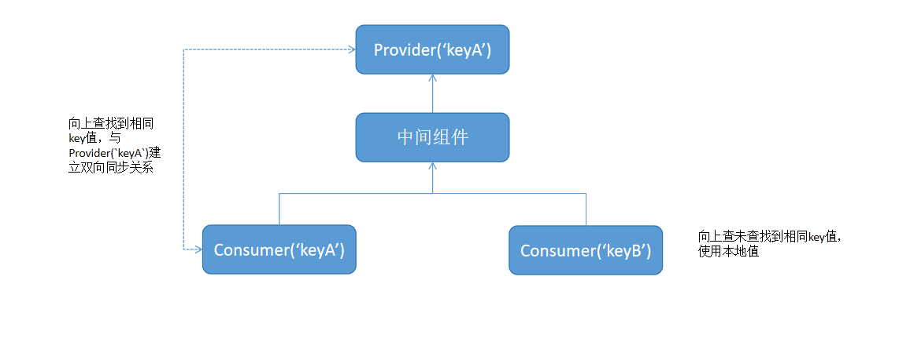

# \@Provider装饰器和\@Consumer装饰器：跨组件层级双向同步
<!--Kit: ArkUI-->
<!--Subsystem: ArkUI-->
<!--Owner: @liwenzhen3-->
<!--SE: @s10021109-->
<!--TSE: @TerryTsao-->

\@Provider和\@Consumer用于跨组件层级数据双向同步，可以使得开发者不用拘泥于组件层级。
\@Provider和\@Consumer属于状态管理V2装饰器，所以只能在\@ComponentV2中才能使用，在\@Component中使用会编译报错。

\@Provider和\@Consumer提供了跨组件层级数据双向同步的能力。在阅读本文档前，建议提前阅读：[\@ComponentV2](./arkts-new-componentV2.md)。

>**说明：**
>
>\@Provider和\@Consumer装饰器从API version 12开始支持。
>

## 概述

\@Provider，即数据提供方，其所有的子组件都可以通过\@Consumer绑定相同的key来获取\@Provider提供的数据。
\@Consumer，即数据消费方，可以通过绑定同样的key获取其最近父节点的\@Provider的数据，当查找不到\@Provider的数据时，使用本地默认值。图示如下。



\@Provider和\@Consumer装饰的数据类型需要一致。

开发者在使用\@Provider和\@Consumer时要注意：
- \@Provider和\@Consumer强依赖自定义组件层级，\@Consumer会因为所在组件的父组件不同，而被初始化为不同的值。
- \@Provider和\@Consumer相当于把组件粘合在一起了，从组件独立角度，要减少使用\@Provider和\@Consumer。

## \@Provider和\@Consumer vs \@Provide和\@Consume能力对比
在状态管理V1版本中，提供跨组件层级双向的装饰器为[\@Provide和\@Consume](./arkts-provide-and-consume.md)，当前文档介绍的是状态管理V2装饰器\@Provider和\@Consumer。虽然两者名字和功能类似，但在特性上还存在一些差异。
如果开发者不了解状态管理V1中的\@Provide和\@Consume，可以直接跳过本节。

| 能力 | V2装饰器\@Provider和\@Consumer                                             |V1装饰器\@Provide和\@Consume|
| ------------------ | ----------------------------------------------------- |----------------------------------------------------- |
| \@Consume(r)         |必须本地初始化，当找不到\@Provider的时候使用本地默认值。| API version 20以前，@Consume禁止本地初始化，当找不到对应\@Provide的时候，会抛出异常；从API version 20开始，@Consume支持设置默认值，如果没有设置默认值，且找不到对应\@Provide的时候，会抛出异常。 |
| 支持类型           | 支持function。 | 不支持function。 |
| 观察能力           | 仅能观察自身赋值变化，如果要观察嵌套场景，配合[\@Trace](arkts-new-observedV2-and-trace.md)一起使用。 | 观察第一层变化，如果要观察嵌套场景，配合[\@Observed和\@ObjectLink](arkts-observed-and-objectlink.md)一起使用。 |
| alias和属性名         | alias是唯一匹配的key，缺省时默认属性名为alias。 | alias和属性名都为key，优先匹配alias，匹配不到可以匹配属性名。|
| \@Provide(r) 从父组件初始化      | 不允许。 | 允许。|
| \@Provide(r)支持重载  | 默认开启，即\@Provider可以重名，\@Consumer向上查找最近的\@Provider。 | 默认关闭，即在组件树上不允许有同名\@Provide。如果需要重载，则需要配置allowOverride。|

## 装饰器说明

### 基本规则
\@Provider语法：
`@Provider(alias?: string) varName : varType = initValue`

| \@Provider属性装饰器 | 说明                                                  |
| ------------------ | ----------------------------------------------------- |
| 装饰器参数         | `aliasName?: string`，别名，缺省时默认为属性名。|
| 支持类型           | 自定义组件中成员变量。属性的类型可以为number、string、boolean、class、[Array](#装饰array类型变量)、[Date](#装饰date类型变量)、[Map](#装饰map类型变量)、[Set](#装饰set类型变量)等类型。支持装饰[箭头函数](#provider和consumer装饰回调事件用于组件之间完成行为抽象)。 |
| 从父组件初始化      | 禁止。 |
| 本地初始化         | 必须本地初始化。 |
| 观察能力         | 能力等同于\@Trace。变化会同步给对应的\@Consumer。 |

\@Consumer语法：
`@Consumer(alias?: string) varName : varType = initValue`

| \@Consumer属性装饰器 | 说明                                                         |
| --------------------- | ------------------------------------------------------------ |
| 装饰器参数            | `aliasName?: string`，别名，缺省时默认为属性名，向上查找最近的\@Provider。    |
| 可装饰的变量          | 自定义组件中成员变量。属性的类型可以为number、string、boolean、class、Array、Date、Map、Set等类型。支持装饰箭头函数。 |
| 从父组件初始化      | 禁止。 |
| 本地初始化         | 必须本地初始化。 |
| 观察能力         | 能力等同于\@Trace。变化会同步给对应的\@Provider。 |

### aliasName和属性名

\@Provider和\@Consumer接受可选参数aliasName，没有配置参数时，使用属性名作为默认的aliasName。

>**说明：**
>
> aliasName是用于\@Provider和\@Consumer进行匹配的唯一指定key。

以下三个例子可清楚介绍\@Provider和\@Consumer如何使用aliasName进行查找匹配。

```ts
@ComponentV2
struct Parent {
  // 未定义aliasName, 使用属性名'str'作为aliasName
  @Provider() str: string = 'hello';
}

@ComponentV2
struct Child {
  // 定义aliasName为'str'，使用aliasName去寻找
  // 能够在Parent组件上找到, 使用@Provider的值'hello'
  @Consumer('str') str: string = 'world';
}
```

```ts
@ComponentV2
struct Parent {
  // 定义aliasName为'alias'
  @Provider('alias') str: string = 'hello';
}

@ComponentV2 struct Child {
  // 定义aliasName为 'alias'，找到@Provider并获得值'hello'
  @Consumer('alias') str: string = 'world';
}
```

```ts
@ComponentV2
struct Parent {
  // 定义aliasName为'alias'
  @Provider('alias') str: string = 'hello';
}

@ComponentV2
struct Child {
  // 未定义aliasName，使用属性名'str'作为aliasName
  // 没有找到对应的@Provider，使用本地值'world'
  @Consumer() str: string = 'world';
}
```

## 变量传递

| 传递规则       | 说明                                                         |
| -------------- | ------------------------------------------------------------ |
| 从父组件初始化 | \@Provider和\@Consumer装饰的变量仅允许本地初始化，不允许从外部传入初始化。 |
| 初始化子组件   | \@Provider和\@Consumer装饰的变量可以初始化子组件中\@Param装饰的变量。 |

## 使用限制

1. \@Provider和\@Consumer为自定义组件的属性装饰器，只能装饰自定义组件内的属性，不能装饰class的属性。
2. \@Provider和\@Consumer为状态管理V2装饰器，只能在\@ComponentV2中使用，不能在\@Component中使用。
3. \@Provider和\@Consumer只支持本地初始化，不支持外部传入初始化。

## 使用场景

### \@Provider和\@Consumer双向同步

**建立双向绑定**

1. 自定义组件Parent和Child初始化：
    - Child中`@Consumer() str: string = 'world'`向上查找，查找到Parent中声明的`@Provider() str: string = 'hello'`。
    - `@Consumer() str: string = 'world'`初始化为其查找到的`@Provider`的值，即‘hello’。
    - 两者建立双向同步关系。
2. 点击Parent中的Button，改变\@Provider装饰的str，通知其对应的\@Consumer，对应UI刷新。
3. 点击Child中Button，改变\@Consumer装饰的str，通知其对应的\@Provider，对应UI刷新。

```ts
@Entry
@ComponentV2
struct Parent {
  @Provider() str: string = 'hello';

  build() {
    Column() {
      Button(this.str)
        .onClick(() => {
          this.str += '0';
        })
      Child()
    }
  }
}

@ComponentV2
struct Child {
  // @Consumer装饰的属性str和Parent组件中@Provider装饰的属性str名称相同，因此建立了双向绑定关系
  @Consumer() str: string = 'world';

  build() {
    Column() {
      Button(this.str)
        .onClick(() => {
          this.str += '0';
        })
    }
  }
}
```

**未建立双向绑定**

下面的例子中，\@Provider和\@Consumer由于aliasName值不同，无法建立双向同步关系。
1. 自定义组件Parent和Child初始化：
    - Child中`@Consumer() str: string = 'world'`向上查找，未查找到其数据提供方@Provider。
    - `@Consumer() str: string = 'world'`使用其本地默认值为‘world’。
    - 两者未建立双向同步关系。
2. 点击Parent中的Button，改变\@Provider装饰的str1，仅刷新\@Provider关联的Button组件。
3. 点击Child中Button，改变\@Consumer装饰的str，仅刷新\@Consumer关联的Button组件。

```ts
@Entry
@ComponentV2
struct Parent {
  @Provider() str1: string = 'hello';

  build() {
    Column() {
      Button(this.str1)
        .onClick(() => {
          this.str1 += '0';
        })
      Child()
    }
  }
}

@ComponentV2
struct Child {
  // @Consumer装饰的属性str和Parent组件中@Provider装饰的属性str1名称不同，无法建立双向绑定关系
  @Consumer() str: string = 'world';

  build() {
    Column() {
      Button(this.str)
        .onClick(() => {
          this.str += '0';
        })
    }
  }
}
```

### 装饰Array类型变量

当装饰的对象是Array时，可以观察到Array整体的赋值，同时可以通过调用Array的接口`push`, `pop`, `shift`, `unshift`, `splice`, `copyWithin`, `fill`, `reverse`, `sort`更新Array中的数据。

```ts
@Entry
@ComponentV2
struct Parent {
  @Provider() count: number[] = [1,2,3];

  build() {
    Row() {
      Column() {
        ForEach(this.count, (item: number) => {
          Text(`parent: ${item}`).fontSize(30)
          Divider()
        })
        Button('push').onClick(() => {
          this.count.push(111);
        })
        Button('reverse').onClick(() => {
          this.count.reverse();
        })
        Button('fill').onClick(() => {
          this.count.fill(6);
        })
        Child()
      }
      .width('100%')
    }
    .height('100%')
  }
}

@ComponentV2
struct Child {
  @Consumer() count: number[] = [9,8,7];

  build() {
    Column() {
      ForEach(this.count, (item: number) => {
        Text(`child: ${item}`).fontSize(30)
        Divider()
      })
      Button('push').onClick(() => {
        this.count.push(222);
      })
      Button('reverse').onClick(() => {
        this.count.reverse();
      })
      Button('fill').onClick(() => {
        this.count.fill(8);
      })
    }
    .width('100%')
  }
}
```

### 装饰Date类型变量

当装饰Date类型变量时，可以观察到数据源对Date整体的赋值，以及调用Date的接口`setFullYear`, `setMonth`, `setDate`, `setHours`, `setMinutes`, `setSeconds`, `setMilliseconds`, `setTime`, `setUTCFullYear`, `setUTCMonth`, `setUTCDate`, `setUTCHours`, `setUTCMinutes`, `setUTCSeconds`, `setUTCMilliseconds`带来的变化。

```ts
@Entry
@ComponentV2
struct Parent {
  @Provider() SelectedDate: Date = new Date('2021-08-08');

  build() {
    Column() {
      Text(`parent: ${this.SelectedDate}`)
      Button('update the new date')
        .onClick(() => {
          this.SelectedDate = new Date('2023-07-07');
        })
      Button('increase the year by 1')
        .onClick(() => {
          this.SelectedDate.setFullYear(this.SelectedDate.getFullYear() + 1);
        })
      Button('increase the month by 1')
        .onClick(() => {
          this.SelectedDate.setMonth(this.SelectedDate.getMonth() + 1);
        })
      Button('increase the day by 1')
        .onClick(() => {
          this.SelectedDate.setDate(this.SelectedDate.getDate() + 1);
        })
      Child()
    }
  }
}
@ComponentV2
struct Child {
  @Consumer() SelectedDate: Date = new Date('2022-07-07');

  build() {
    Column() {
      Text(`child: ${this.SelectedDate}`)
      Button('update the new date')
        .onClick(() => {
          this.SelectedDate = new Date('2025-01-01');
        })
      Button('increase the year by 1')
        .onClick(() => {
          this.SelectedDate.setFullYear(this.SelectedDate.getFullYear() + 1);
        })
      Button('increase the month by 1')
        .onClick(() => {
          this.SelectedDate.setMonth(this.SelectedDate.getMonth() + 1);
        })
      Button('increase the day by 1')
        .onClick(() => {
          this.SelectedDate.setDate(this.SelectedDate.getDate() + 1);
        })
    }
  }
}
```

### 装饰Map类型变量

当装饰Map类型变量时，可以观察到数据源对Map整体的赋值，以及调用Map的接口`set`, `clear`, `delete`带来的变化。

```ts
@Entry
@ComponentV2
struct Parent {
  @Provider() message: Map<number, string> = new Map([[0, 'a'], [1, 'b'], [3, 'c']]);

  build() {
    Column() {
      Text('Parent').fontSize(30)
      ForEach(Array.from(this.message.entries()), (item: [number, string]) => {
        Text(`${item[0]}`).fontSize(30)
        Text(`${item[1]}`).fontSize(30)
        Divider()
      })
      Button('init map').onClick(() => {
        this.message = new Map([[0, 'aa'], [1, 'bb'], [3, 'cc']]);
      })
      Button('set new one').onClick(() => {
        this.message.set(4, 'd');
      })
      Button('clear').onClick(() => {
        this.message.clear();
      })
      Button('replace the first one').onClick(() => {
        this.message.set(0, 'a~');
      })
      Button('delete the first one').onClick(() => {
        this.message.delete(0);
      })
      Child()
    }
  }
}
@ComponentV2
struct Child {
  @Consumer() message: Map<number, string> = new Map([[0, 'd'], [1, 'e'], [3, 'f']]);

  build() {
    Column() {
      Text('Child').fontSize(30)
      ForEach(Array.from(this.message.entries()), (item: [number, string]) => {
        Text(`${item[0]}`).fontSize(30)
        Text(`${item[1]}`).fontSize(30)
        Divider()
      })
      Button('init map').onClick(() => {
        this.message = new Map([[0, 'dd'], [1, 'ee'], [3, 'ff']]);
      })
      Button('set new one').onClick(() => {
        this.message.set(4, 'g');
      })
      Button('clear').onClick(() => {
        this.message.clear();
      })
      Button('replace the first one').onClick(() => {
        this.message.set(0, 'a*');
      })
      Button('delete the first one').onClick(() => {
        this.message.delete(0);
      })
    }
  }
}
```

### 装饰Set类型变量

当装饰Set类型变量时，可以观察到数据源对Set整体的赋值，以及调用Set的接口 `add`, `clear`, `delete`带来的变化。

```ts
@Entry
@ComponentV2
struct Parent {
  @Provider() message: Set<number> = new Set([1, 2, 3, 4]);

  build() {
    Column() {
      Text('Parent').fontSize(30)
      ForEach(Array.from(this.message.entries()), (item: [number, number]) => {
        Text(`${item[0]}`).fontSize(30)
        Divider()
      })
      Button('init set').onClick(() => {
        this.message = new Set([1, 2, 3, 4]);
      })
      Button('set new one').onClick(() => {
        this.message.add(5);
      })
      Button('clear').onClick(() => {
        this.message.clear();
      })
      Button('delete the first one').onClick(() => {
        this.message.delete(1);
      })
      Child()
    }
  }
}
@ComponentV2
struct Child {
  @Consumer() message: Set<number> = new Set([1, 2, 3, 4, 5, 6]);

  build() {
    Column() {
      Text('Child').fontSize(30)
      ForEach(Array.from(this.message.entries()), (item: [number, number]) => {
        Text(`${item[0]}`).fontSize(30)
        Divider()
      })
      Button('init set').onClick(() => {
        this.message = new Set([1, 2, 3, 4, 5, 6]);
      })
      Button('set new one').onClick(() => {
        this.message.add(7);
      })
      Button('clear').onClick(() => {
        this.message.clear();
      })
      Button('delete the first one').onClick(() => {
        this.message.delete(1);
      })
    }
  }
}
```

### \@Provider和\@Consumer装饰回调事件用于组件之间完成行为抽象

当需要在父组件中向子组件注册回调函数时，可以使用\@Provider和\@Consumer装饰回调方法来实现。
在拖拽场景中，若需将子组件的拖拽起始位置信息同步给父组件，可参考以下示例。

```ts
@Entry
@ComponentV2
struct Parent {
  @Local childX: number = 0;
  @Local childY: number = 1;
  @Provider() onDrag: (x: number, y: number) => void = (x: number, y: number) => {
    console.log(`onDrag event at x=${x} y:${y}`);
    this.childX = x;
    this.childY = y;
  }

  build() {
    Column() {
      Text(`child position x: ${this.childX}, y: ${this.childY}`)
      Child()
    }
  }
}

@ComponentV2
struct Child {
  @Consumer() onDrag: (x: number, y: number) => void = (x: number, y: number) => {};

  build() {
    Button("changed")
      .draggable(true)
      .onDragStart((event: DragEvent) => {
        // 当前预览器上不支持通用拖拽事件
        this.onDrag(event.getDisplayX(), event.getDisplayY());
      })
  }
}
```

### \@Provider和\@Consumer装饰复杂类型，配合\@Trace一起使用

1. \@Provider和\@Consumer只能观察到数据本身的变化。如果需要观察其装饰的复杂数据类型的属性变化，必须配合\@Trace一起使用。
2. 装饰内置类型：Array、Map、Set、Date时，可以观察到某些API的变化，观察能力同[\@Trace](./arkts-new-observedV2-and-trace.md#观察变化)。

```ts
@ObservedV2
class User {
  @Trace name: string;
  @Trace age: number;

  constructor(name: string, age: number) {
    this.name = name;
    this.age = age;
  }
}
const data: User[] = [new User('Json', 10), new User('Eric', 15)];
@Entry
@ComponentV2
struct Parent {
  @Provider('data') users: User[] = data;

  build() {
    Column() {
      Child()
      Button('add new user')
        .onClick(() => {
          this.users.push(new User('Molly', 18));
        })
      Button('age++')
        .onClick(() => {
          this.users[0].age++;
        })
      Button('change name')
        .onClick(() => {
          this.users[0].name = 'Shelly';
        })
    }
  }
}

@ComponentV2
struct Child {
  @Consumer('data') users: User[] = [];

  build() {
    Column() {
      ForEach(this.users, (item: User) => {
        Column() {
          Text(`name: ${item.name}`).fontSize(30)
          Text(`age: ${item.age}`).fontSize(30)
          Divider()
        }
      })
    }
  }
}
```

### \@Provider重名时，\@Consumer向上查找其最近的\@Provider

\@Provider可以在组件树上重名，\@Consumer会向上查找其最近父节点的\@Provider的数据。

```ts
@Entry
@ComponentV2
struct Index {
  @Provider() val: number = 10;

  build() {
    Column() {
      Parent()
    }
  }
}

@ComponentV2
struct Parent {
  @Provider() val: number = 20;
  @Consumer("val") val2: number = 0; // 10

  build() {
    Column() {
      Text(`${this.val2}`)
      Child()
    }
  }
}

@ComponentV2
struct Child {
  @Consumer() val: number = 0; // 20

  build() {
    Column() {
      Text(`${this.val}`)
    }
  }
}
```

上面的例子中：

- Parent中的\@Consumer向上查找，查找到Index中定义的`@Provider() val: number = 10`，初始化为10。
- Child中的\@Consumer向上查找，查找到Parent中定义的`@Provider() val: number = 20`后停止，初始化为20。

### \@Provider和\@Consumer初始化\@Param

- 点击```Text(`Parent @Consumer val: ${this.val}`)```，触发`@Consumer() val`的变化，变化同步给Index中`@Provider() val`，从而触发子组件```Text(`Parent @Param val2: ${this.val2}`)```的刷新。
- `Parent @Consumer() val`的变化同步给Child，从而触发```Text(`Child @Param val ${this.val}`)```的刷新。

```ts
@Entry
@ComponentV2
struct Index {
  @Provider() val: number = 10;

  build() {
    Column() {
      Parent({ val2: this.val })
    }
  }
}

@ComponentV2
struct Parent {
  @Consumer() val: number = 0;
  @Require @Param val2: number;

  build() {
    Column() {
      Text(`Parent @Consumer val: ${this.val}`).fontSize(30).onClick(() => {
        this.val++;
      })
      Text(`Parent @Param val2: ${this.val2}`).fontSize(30)
      Child({ val: this.val })
    }.border({ width: 2, color: Color.Green })
  }
}

@ComponentV2
struct Child {
  @Require @Param val: number;

  build() {
    Column() {
      Text(`Child @Param val ${this.val}`).fontSize(30)
    }.border({ width: 2, color: Color.Pink })
  }
}
```
<!--no_check-->