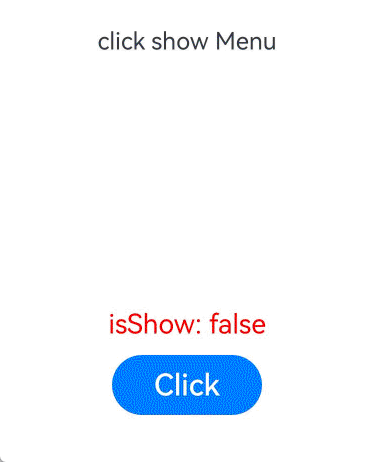

# !!语法：双向绑定
<!--Kit: ArkUI-->
<!--Subsystem: ArkUI-->
<!--Owner: @Cuecuexiaoyu-->
<!--Designer: @VictorS67-->
<!--Tester: @TerryTsao-->
<!--Adviser: @zhang_yixin13-->

在状态管理V1中，推荐使用[$$](./arkts-two-way-sync.md)实现系统组件的双向绑定。

在状态管理V2中，推荐使用`!!`语法糖统一处理双向绑定。

>**说明：**
>
>`!!`语法从API version 12开始支持。
>

## 概述

`!!`双向绑定语法，是一个语法糖，方便开发者实现数据双向绑定，用于初始化子组件的[\@Param](arkts-new-param.md)装饰的属性和[\@Event](arkts-new-event.md)装饰的事件。其中\@Event方法名需要声明为“$”+ \@Param属性名，详见[使用场景](#使用场景)。

- 如果使用了`!!`双向绑定语法，表明父组件的变化会同步给子组件，子组件的变化也会同步给父组件。
- 父组件未使用`!!`时，变化是单向的。

## 使用场景

### 自定义组件间双向绑定
1. 在Index中构造Star子组件，双向绑定父子组件中的value属性，并初始化子组件的`@Param value`和`@Event $value`。

   \@Param与\@Event装饰器配合使用的双向绑定语法糖。

   <!-- @[ArkUI_Star_binding1](https://gitcode.com/openharmony/applications_app_samples/blob/master/code/DocsSample/ArkUISample/ArkUI_Binding/entry/src/main/ets/pages/Binding_Star_Param_Event.ets) -->  
   
   ``` TypeScript
   Star({ value: this.value, $value: (val: number) => { this.value = val; } })
   ```
   上述语法可以简化为!!双向绑定语法糖。
   
    <!-- @[ArkUI_Star_binding3](https://gitcode.com/openharmony/applications_app_samples/blob/master/code/DocsSample/ArkUISample/ArkUI_Binding/entry/src/main/ets/pages/Binding_Star.ets) -->
    
    ``` TypeScript
    Star({ value: this.value!! })
    ```

2. 使用`@Param value`与`@Event $value`语法实现自定义组件双向绑定。

    <!-- @[ArkUI_Star_binding4](https://gitcode.com/openharmony/applications_app_samples/blob/master/code/DocsSample/ArkUISample/ArkUI_Binding/entry/src/main/ets/pages/Binding_Star_Param_Event.ets) -->  
    
    ``` TypeScript
    @Entry
    @ComponentV2
    struct Index {
      @Local value: number = 0;
    
      build() {
        Column() {
          Text(`${this.value}`)
          // 点击Index中的Button改变value值，父组件Index和子组件Star中的Text将同步更新。
          Button(`change value in parent component`).onClick(() => {
            this.value++;
          })
          // 使用@Param与@Event语法实现自定义组件双向绑定。
          Star({ value: this.value, $value: (val: number) => { this.value = val; } })
          // ...
        // ...
        }
      }
    }
    
    @ComponentV2
    struct Star {
      @Param value: number = 0;
      @Event $value: (val: number) => void = (val: number) => {};
    
      build() {
        Column() {
          Text(`${this.value}`)
          // 点击子组件Star中的Button，调用`this.$value(10)`方法，父组件Index和子组件Star中的Text将同步更新。
          Button(`change value in child component`).onClick(() => {
            this.$value(10);
          })
        }
      }
    }
    ```

3. 使用!!语法糖实现自定义组件双向绑定。

   <!-- @[ArkUI_Star_binding2](https://gitcode.com/openharmony/applications_app_samples/blob/master/code/DocsSample/ArkUISample/ArkUI_Binding/entry/src/main/ets/pages/Binding_Star.ets) -->
   
   ``` TypeScript
   @Entry
   @ComponentV2
   struct Index {
     @Local value: number = 0;
   
     build() {
       Column() {
         Text(`${this.value}`)
         // 点击Index中的Button改变value值，父组件Index和子组件Star中的Text将同步更新。
         Button(`change value in parent component`).onClick(() => {
           this.value++;
         })
         // 使用!!语法糖实现自定义组件双向绑定。
         Star({ value: this.value!! })
         // ...
       }
     }
   }
   
   @ComponentV2
   struct Star {
     @Param value: number = 0;
     @Event $value: (val: number) => void = (val: number) => {};
   
     build() {
       Column() {
         Text(`${this.value}`)
         // 点击子组件Star中的Button，调用`this.$value(10)`方法，父组件Index和子组件Star中的Text将同步更新。
         Button(`change value in child component`).onClick(() => {
           this.$value(10);
         })
       }
     }
   }
   ```

**使用限制**
- `!!`双向绑定语法不支持多层父子组件传递。
- 不支持与@Event混用。从API version 18开始，当使用`!!`双向绑定语法给子组件传递参数时，给对应的@Event方法传参会编译报错。
- 当使用3个或更多感叹号（!!!、!!!!、!!!!!等）时，不支持双向绑定功能。


### 系统组件参数双向绑定

!!运算符为系统组件提供TS变量的引用，使得TS变量和系统组件的内部状态保持同步。添加方式是在变量名后添加，例如isShow!!。

内部状态的含义由组件或属性决定。例如：[bindMenu](../../reference/apis-arkui/arkui-ts/ts-universal-attributes-menu.md#bindmenu11)属性的isShow参数。

<!-- @[ArkUI_Sys_binding](https://gitcode.com/openharmony/applications_app_samples/blob/master/code/DocsSample/ArkUISample/ArkUI_Binding/entry/src/main/ets/pages/Sys_Binding.ets) -->

``` TypeScript
import { hilog } from '@kit.PerformanceAnalysisKit';

const TAG: string = 'click show Menu';
const DOMAIN = 0xFF00;

@Entry
@ComponentV2
struct BindMenuInterface {
  @Local isShow: boolean = false;

  build() {
    Column() {
      Row() {
        Text('click show Menu')
          .bindMenu(this.isShow!!, // 双向绑定。
            [
              {
                value: 'Menu1',
                action: () => {
                  hilog.info(DOMAIN, TAG, 'handle Menu1 click');
                }
              },
              {
                value: 'Menu2',
                action: () => {
                  hilog.info(DOMAIN, TAG, 'handle Menu2 click');
                }
              },
            ])
      }.height('50%')
      
      Text('isShow: ' + this.isShow).fontSize(18).fontColor(Color.Red)
      Row() {
        Button('Click')
          .onClick(() => {
            this.isShow = true;
          })
          .width(100)
          .fontSize(20)
          .margin(10)
      }
    }.width('100%')
  }
}
```




**使用规则**

- 当前`!!`双向绑定支持基础类型变量，当该变量使用[\@State](arkts-state.md)等状态管理V1装饰器装饰，或者[\@Local](arkts-new-local.md)等状态管理V2装饰器装饰时，变量值的变化会触发UI刷新。

  | 属性                                                         | 支持的参数 | 起始API版本 |
  | ------------------------------------------------------------ | --------------- | ----------- |
  | [bindMenu](../../reference/apis-arkui/arkui-ts/ts-universal-attributes-menu.md#bindmenu11) | isShow | 18        |
  | [bindContextMenu](../../reference/apis-arkui/arkui-ts/ts-universal-attributes-menu.md#bindcontextmenu12) | isShown | 18          |
  | [bindPopup](../../reference/apis-arkui/arkui-ts/ts-universal-attributes-popup.md#bindpopup) | show | 18   |
  | [TextInput](../../reference/apis-arkui/arkui-ts/ts-basic-components-textinput.md#textinputoptions对象说明) | text | 18   |
  | [TextArea](../../reference/apis-arkui/arkui-ts/ts-basic-components-textarea.md#textareaoptions对象说明) | text | 18   |
  | [Search](../../reference/apis-arkui/arkui-ts/ts-basic-components-search.md#searchoptions18对象说明) | value | 18   |
  | [bindSheet](../../reference/apis-arkui/arkui-ts/ts-universal-attributes-sheet-transition.md#bindsheet) | isShow | 18   |
  | [bindContentCover](../../reference/apis-arkui/arkui-ts/ts-universal-attributes-modal-transition.md#bindcontentcover) | isShow | 18   |
  | [SideBarContainer](../../reference/apis-arkui/arkui-ts/ts-container-sidebarcontainer.md) | [sideBarWidth](../../reference/apis-arkui/arkui-ts/ts-container-sidebarcontainer.md#sidebarwidth) | 18   |
  | [Navigation](../../reference/apis-arkui/arkui-ts/ts-basic-components-navigation.md) | [navBarWidth](../../reference/apis-arkui/arkui-ts/ts-basic-components-navigation.md#navbarwidth9) | 18   |
  | [Toggle](../../reference/apis-arkui/arkui-ts/ts-basic-components-toggle.md#toggleoptions18对象说明) | isOn | 18   |
  | [Checkbox](../../reference/apis-arkui/arkui-ts/ts-basic-components-checkbox.md) | [select](../../reference/apis-arkui/arkui-ts/ts-basic-components-checkbox.md#select) | 18   |
  | [CheckboxGroup](../../reference/apis-arkui/arkui-ts/ts-basic-components-checkboxgroup.md) | [selectAll](../../reference/apis-arkui/arkui-ts/ts-basic-components-checkboxgroup.md#selectall) | 18   |  
  | [Radio](../../reference/apis-arkui/arkui-ts/ts-basic-components-radio.md) | [checked](../../reference/apis-arkui/arkui-ts/ts-basic-components-radio.md#checked) | 18   |  
  | [Rating](../../reference/apis-arkui/arkui-ts/ts-basic-components-rating.md#ratingoptions18对象说明) | rating | 18   |  
  | [Slider](../../reference/apis-arkui/arkui-ts/ts-basic-components-slider.md#slideroptions对象说明) | value | 18   |  
  | [Select](../../reference/apis-arkui/arkui-ts/ts-basic-components-select.md) | [selected](../../reference/apis-arkui/arkui-ts/ts-basic-components-select.md#selected) | 18   |  
  | Select | [value](../../reference/apis-arkui/arkui-ts/ts-basic-components-select.md#value) | 18   |
  | [MenuItem](../../reference/apis-arkui/arkui-ts/ts-basic-components-menuitem.md) | [selected](../../reference/apis-arkui/arkui-ts/ts-basic-components-menuitem.md#selected) | 18   |
