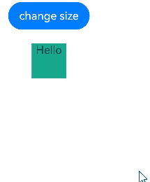

# \@Local装饰器：组件内部状态

为了实现对\@ComponentV2装饰的自定义组件中变量变化的观测，开发者可以使用\@Local装饰器装饰变量。


在阅读本文档前，建议提前阅读：[\@ComponentV2](./arkts-new-componentV2.md)。

>**说明：**
>
>从API version 12开始，在\@ComponentV2装饰的自定义组件中支持使用\@Local装饰器。
>

## 概述

\@Local表示组件内部的状态，使得自定义组件内部的变量具有观测变化的能力：

- 被\@Local装饰的变量无法从外部初始化，因此必须在组件内部进行初始化。

- 当被\@Local装饰的变量变化时，会刷新使用该变量的组件。

- \@Local支持观测number、boolean、string、Object、class等基本类型以及Array、Set、Map、Date等内嵌类型。

- \@Local的观测能力仅限于被装饰的变量本身。当装饰简单类型时，能够观测到对变量的赋值；当装饰对象类型时，仅能观测到对对象整体的赋值；当装饰数组类型时，能观测到数组整体以及数组元素项的变化；当装饰Array、Set、Map、Date等内嵌类型时，可以观测到通过API调用带来的变化。详见[观察变化](#观察变化)。

- \@Local支持null、undefined以及联合类型。

## 状态管理V1版本\@State装饰器的局限性

状态管理V1使用[\@State装饰器](arkts-state.md)定义类中的状态变量。但由于\@State装饰器能够从外部初始化，因此\@State无法准确表达组件内部状态不能被外面修改的语义。

```ts
class ComponentInfo {
  name: string;
  count: number;
  message: string;
  constructor(name: string, count: number, message: string) {
    this.name = name;
    this.count = count;
    this.message = message;
  }
}
@Component
struct Child {
  @State componentInfo: ComponentInfo = new ComponentInfo("Child", 1, "Hello World");

  build() {
    Column() {
      Text(`componentInfo.message is ${this.componentInfo.message}`)
    }
  }
}
@Entry
@Component
struct Index {
  build() {
    Column() {
      Child({componentInfo: new ComponentInfo("Unknown", 0, "Error")})
    }
  }
}
```

上述代码中，可以通过在初始化Child组件时，传入新的值来覆盖Child组件想要作为内部状态变量使用的componentInfo。但Child组件并不能感知到componentInfo从外部进行了初始化，这不利于组件内部状态的管理。因此推出\@Local装饰器表示组件的内部状态。

## 装饰器说明

| \@Local变量装饰器 | 说明 |
| ------------------- | ------------------------------------------------------------ |
| 装饰器参数 | 无。 |
| 可装饰的变量类型 | Object、class、string、number、boolean、enum等基本类型以及Array、Date、Map、Set等内嵌类型。支持null、undefined以及联合类型。 |
| 装饰变量的初始值 | 必须本地初始化，不允许外部传入初始化。 |

## 变量传递

| 传递规则       | 说明                                                      |
| -------------- | --------------------------------------------------------- |
| 从父组件初始化 | \@Local装饰的变量仅允许本地初始化，无法从外部传入初始化。 |
| 初始化子组件   | \@Local装饰的变量可以初始化子组件中\@Param装饰的变量。    |

## 观察变化

使用\@Local装饰的变量具有被观测变化的能力。当装饰的变量发生变化时，会触发该变量绑定的UI组件刷新。

- 当装饰的变量类型为boolean、string、number时，可以观察到对变量赋值的变化。

  ```ts
  @Entry
  @ComponentV2
  struct Index {
    @Local count: number = 0;
    @Local message: string = "Hello";
    @Local flag: boolean = false;
    build() {
      Column() {
        Text(`${this.count}`)
        Text(`${this.message}`)
        Text(`${this.flag}`)
        Button("change Local")
          .onClick(()=>{
            // 当@Local装饰简单类型时，能够观测到对变量的赋值
            this.count++;
            this.message += " World";
            this.flag = !this.flag;
        })
      }
    }
  }
  ```

- 当装饰的变量类型为类对象时，仅可以观察到对类对象整体赋值的变化，无法直接观察到对类成员属性赋值的变化，对类成员属性的观察依赖\@ObservedV2和\@Trace装饰器。注意，\@Local无法和\@Observed装饰的类实例对象混用。

    ```ts
    class RawObject {
      name: string;
      constructor(name: string) {
        this.name = name;
      }
    }
    @ObservedV2
    class ObservedObject {
      @Trace name: string;
      constructor(name: string) {
        this.name = name;
      }
    }
    @Entry
    @ComponentV2
    struct Index {
      @Local rawObject: RawObject = new RawObject("rawObject");
      @Local observedObject: ObservedObject = new ObservedObject("observedObject");
      build() {
        Column() {
          Text(`${this.rawObject.name}`)
          Text(`${this.observedObject.name}`)
          Button("change object")
            .onClick(() => {
              // 对类对象整体的修改均能观察到
              this.rawObject = new RawObject("new rawObject");
              this.observedObject = new ObservedObject("new observedObject");
          })
          Button("change name")
            .onClick(() => {
              // @Local不具备观察类对象属性的能力，因此对rawObject.name的修改无法观察到
              this.rawObject.name = "new rawObject name";
              // 由于ObservedObject的name属性被@Trace装饰，因此对observedObject.name的修改能被观察到
              this.observedObject.name = "new observedObject name";
          })
        }
      }
    }
    ```

- 当装饰的变量类型为简单类型的数组时，可以观察到数组整体或数组项的变化。

    ```ts
    @Entry
    @ComponentV2
    struct Index {
      @Local numArr: number[] = [1,2,3,4,5];
      @Local dimensionTwo: number[][] = [[1,2,3],[4,5,6]];
    
      build() {
        Column() {
          Text(`${this.numArr[0]}`)
          Text(`${this.numArr[1]}`)
          Text(`${this.numArr[2]}`)
          Text(`${this.dimensionTwo[0][0]}`)
          Text(`${this.dimensionTwo[1][1]}`)
          Button("change array item")
            .onClick(() => {
              this.numArr[0]++;
              this.numArr[1] += 2;
              this.dimensionTwo[0][0] = 0;
              this.dimensionTwo[1][1] = 0;
            })
          Button("change whole array")
            .onClick(() => {
              this.numArr = [5,4,3,2,1];
              this.dimensionTwo = [[7,8,9],[0,1,2]];
            })
        }
      }
    }
    ```
    
- 当装饰的变量是嵌套类或对象数组时，\@Local无法观察深层对象属性的变化。对深层对象属性的观测依赖\@ObservedV2与\@Trace装饰器。

  ```ts
  @ObservedV2
  class Region {
    @Trace x: number;
    @Trace y: number;
    constructor(x: number, y: number) {
      this.x = x;
      this.y = y;
    }
  }
  @ObservedV2
  class Info {
    @Trace region: Region;
    @Trace name: string;
    constructor(name: string, x: number, y: number) {
      this.name = name;
      this.region = new Region(x, y);
    }
  }
  @Entry
  @ComponentV2
  struct Index {
    @Local infoArr: Info[] = [new Info("Ocean", 28, 120), new Info("Mountain", 26, 20)];
    @Local originInfo: Info = new Info("Origin", 0, 0);
    build() {
      Column() {
        ForEach(this.infoArr, (info: Info) => {
          Row() {
            Text(`name: ${info.name}`)
            Text(`region: ${info.region.x}-${info.region.y}`)
          }
        })
        Row() {
            Text(`Origin name: ${this.originInfo.name}`)
            Text(`Origin region: ${this.originInfo.region.x}-${this.originInfo.region.y}`)
        }
        Button("change infoArr item")
          .onClick(() => {
            // 由于属性name被@Trace装饰，所以能够观察到
            this.infoArr[0].name = "Win";
          })
        Button("change originInfo")
          .onClick(() => {
            // 由于变量originInfo被@Local装饰，所以能够观察到
            this.originInfo = new Info("Origin", 100, 100);
          })
        Button("change originInfo region")
          .onClick(() => {
            // 由于属性x、y被@Trace装饰，所以能够观察到
            this.originInfo.region.x = 25;
            this.originInfo.region.y = 25;
          })
      }
    }
  }
  ```

- 当装饰的变量类型是内置类型时，可以观察到变量整体赋值以及通过API调用带来的变化。

  | 类型  | 可观测变化的API                                              |
  | ----- | ------------------------------------------------------------ |
  | Array | push、pop、shift、unshift、splice、copyWithin、fill、reverse、sort |
  | Date  | setFullYear, setMonth, setDate, setHours, setMinutes, setSeconds, setMilliseconds, setTime, setUTCFullYear, setUTCMonth, setUTCDate, setUTCHours, setUTCMinutes, setUTCSeconds, setUTCMilliseconds |
  | Map   | set, clear, delete                                           |
  | Set   | add, clear, delete                                           |

## 限制条件

\@Local装饰器存在以下使用限制：

- \@Local装饰器只能在\@ComponentV2装饰的自定义组件中使用。

  ```ts
  @ComponentV2
  struct MyComponent {
    @Local message: string = "Hello World"; // 正确用法
    build() {
    }
  }
  @Component
  struct TestComponent {
    @Local message: string = "Hello World"; // 错误用法，编译时报错
    build() {
    }
  }
  ```

- \@Local装饰的变量表示组件内部状态，不允许从外部传入初始化。

  ```ts
  @ComponentV2
  struct ChildComponent {
    @Local message: string = "Hello World";
    build() {
    }
  }
  @ComponentV2
  struct MyComponent {
    build() {
      ChildComponent({ message: "Hello" }) // 错误用法，编译时报错
    }
  }
  ```

## \@Local与\@State对比

\@Local与\@State的用法、功能对比如下：

|                    | \@State                      | \@Local                         |
| ------------------ | ---------------------------- | --------------------------------- |
| 参数               | 无。                          | 无。                       |
| 从父组件初始化         | 可选。                  | 不允许外部初始化。           |
| 观察能力 | 能观测变量本身以及一层的成员属性，无法深度观测。 | 能观测变量本身，深度观测依赖\@Trace装饰器。 |
| 数据传递 | 可以作为数据源和子组件中状态变量同步。 | 可以作为数据源和子组件中状态变量同步。 |

## 使用场景

### 观测对象整体变化

被\@ObservedV2与\@Trace装饰的类对象实例，具有深度观测对象属性的能力。但当对对象整体赋值时，UI却无法刷新。使用\@Local装饰对象，可以达到观测对象本身变化的效果。

```ts
@ObservedV2
class Info {
  @Trace name: string;
  @Trace age: number;
  constructor(name: string, age: number) {
    this.name = name;
    this.age = age;
  }
}
@Entry
@ComponentV2
struct Index {
  info: Info = new Info("Tom", 25);
  @Local localInfo: Info = new Info("Tom", 25);
  build() {
    Column() {
      Text(`info: ${this.info.name}-${this.info.age}`) // Text1
      Text(`localInfo: ${this.localInfo.name}-${this.localInfo.age}`) // Text2
      Button("change info&localInfo")
        .onClick(() => {
          this.info = new Info("Lucy", 18); // Text1不会刷新
          this.localInfo = new Info("Lucy", 18); // Text2会刷新
      })
    }
  }
}
```

### 装饰Date类型变量

当装饰的对象是Date时，可以观察到Date整体的赋值，同时可通过调用Date的接口`setFullYear`, `setMonth`, `setDate`, `setHours`, `setMinutes`, `setSeconds`, `setMilliseconds`, `setTime`, `setUTCFullYear`, `setUTCMonth`, `setUTCDate`, `setUTCHours`, `setUTCMinutes`, `setUTCSeconds`, `setUTCMilliseconds` 更新Date的属性。

```ts
@Entry
@ComponentV2
struct DatePickerExample {
  @Local selectedDate: Date = new Date('2021-08-08');

  build() {
    Column() {
      Button('set selectedDate to 2023-07-08')
        .margin(10)
        .onClick(() => {
          this.selectedDate = new Date('2023-07-08');
        })
      Button('increase the year by 1')
        .margin(10)
        .onClick(() => {
          this.selectedDate.setFullYear(this.selectedDate.getFullYear() + 1);
        })
      Button('increase the month by 1')
        .margin(10)
        .onClick(() => {
          this.selectedDate.setMonth(this.selectedDate.getMonth() + 1);
        })
      Button('increase the day by 1')
        .margin(10)
        .onClick(() => {
          this.selectedDate.setDate(this.selectedDate.getDate() + 1);
        })
      DatePicker({
        start: new Date('1970-1-1'),
        end: new Date('2100-1-1'),
        selected: this.selectedDate
      })
    }.width('100%')
  }
}
```

### 装饰Map类型变量

当装饰的对象是Map时，可以观察到对Map整体的赋值，同时可以通过调用Map的接口 set、clear、delete更新Map中的数据。

```ts
@Entry
@ComponentV2
struct MapSample {
  @Local message: Map<number, string> = new Map([[0, "a"], [1, "b"], [3, "c"]]);

  build() {
    Row() {
      Column() {
        ForEach(Array.from(this.message.entries()), (item: [number, string]) => {
          Text(`${item[0]}`).fontSize(30)
          Text(`${item[1]}`).fontSize(30)
          Divider()
        })
        Button('init map').onClick(() => {
          this.message = new Map([[0, "a"], [1, "b"], [3, "c"]]);
        })
        Button('set new one').onClick(() => {
          this.message.set(4, "d");
        })
        Button('clear').onClick(() => {
          this.message.clear();
        })
        Button('replace the first one').onClick(() => {
          this.message.set(0, "aa");
        })
        Button('delete the first one').onClick(() => {
          this.message.delete(0);
        })
      }
      .width('100%')
    }
    .height('100%')
  }
}
```

### 装饰Set类型变量

当装饰的对象是Set时，可以观察到对Set整体的赋值，同时可以通过调用Set的接口add、clear、delete更新Set中的数据。

```ts
@Entry
@ComponentV2
struct SetSample {
  @Local message: Set<number> = new Set([0, 1, 2, 3, 4]);

  build() {
    Row() {
      Column() {
        ForEach(Array.from(this.message.entries()), (item: [number, string]) => {
          Text(`${item[0]}`).fontSize(30)
          Divider()
        })
        Button('init set').onClick(() => {
          this.message = new Set([0, 1, 2, 3, 4]);
        })
        Button('set new one').onClick(() => {
          this.message.add(5);
        })
        Button('clear').onClick(() => {
          this.message.clear();
        })
        Button('delete the first one').onClick(() => {
          this.message.delete(0);
        })
      }
      .width('100%')
    }
    .height('100%')
  }
}
```

### 联合类型

\@Local支持null、undefined以及联合类型。在下面的示例中，count类型为number | undefined，点击改变count的类型，UI会随之刷新。

```ts
@Entry
@ComponentV2
struct Index {
  @Local count: number | undefined = 10;

  build() {
    Column() {
      Text(`count(${this.count})`)
      Button("change to undefined")
        .onClick(() => {
          this.count = undefined;
        })
      Button("change to number")
        .onClick(() => {
          this.count = 10;
      })
    }
  }
}
```

## 常见问题

### 复杂类型常量重复赋值给状态变量触发刷新

```ts
@Entry
@ComponentV2
struct Index {
  list: string[][] = [['a'], ['b'], ['c']];
  @Local dataObjFromList: string[] = this.list[0];

  @Monitor("dataObjFromList")
  onStrChange(monitor: IMonitor) {
    console.log("dataObjFromList has changed");
  }

  build() {
    Column() {
      Button('change to self').onClick(() => {
        // 新值和本地初始化的值相同
        this.dataObjFromList = this.list[0];
      })
    }
  }
}
```

以上示例每次点击Button('change to self')，把相同的Array类型常量赋值给一个Array类型的状态变量，都会触发刷新。原因是在状态管理V2中，会给使用状态变量装饰器如@Trace、@Local装饰的Date、Map、Set、Array添加一层代理用于观测API调用产生的变化。  
当再次赋值list[0]时，dataObjFromList已经是一个Proxy类型，而list[0]是Array类型，判断是不相等的，因此会触发赋值和刷新。  
为了避免这种不必要的赋值和刷新，可以使用[UIUtils.getTarget()](./arkts-new-getTarget.md)获取原始对象提前进行新旧值的判断，当两者相同时不执行赋值。

使用UIUtils.getTarget()方法示例

```ts
import { UIUtils } from '@ohos.arkui.StateManagement';

@Entry
@ComponentV2
struct Index {
  list: string[][] = [['a'], ['b'], ['c']];
  @Local dataObjFromList: string[] = this.list[0];

  @Monitor("dataObjFromList")
  onStrChange(monitor: IMonitor) {
    console.log("dataObjFromList has changed");
  }

  build() {
    Column() {
      Button('change to self').onClick(() => {
        // 获取原始对象来和新值做对比
        if (UIUtils.getTarget(this.dataObjFromList) !== this.list[0]) {
          this.dataObjFromList = this.list[0];
        }
      })
    }
  }
}
```

### 在状态管理V2中使用animateTo动画效果异常

在下面的场景中，[animateTo](../../reference/apis-arkui/arkui-ts/ts-explicit-animation.md)暂不支持直接在状态管理V2中使用。

```ts
@Entry
@ComponentV2
struct Index {
  @Local w: number = 50; // 宽度
  @Local h: number = 50; // 高度
  @Local message: string = 'Hello';

  build() {
    Column() {
      Button('change size')
        .margin(20)
        .onClick(() => {
          // 在执行动画前，存在额外的修改
          this.w = 100;
          this.h = 100;
          this.message = 'Hello World';
          this.getUIContext().animateTo({
            duration: 1000
          }, () => {
            this.w = 200;
            this.h = 200;
            this.message = 'Hello ArkUI';
          })
        })
      Column() {
        Text(`${this.message}`)
      }
      .backgroundColor('#ff17a98d')
      .width(this.w)
      .height(this.h)
    }
  }
}
```

上面的代码中，开发者预期显示的动画为绿色矩形从长宽100变化成200，字符串从`Hello World`变化成`Hello ArkUI`，但由于当前animateTo与V2在刷新机制上暂不兼容，在执行动画前额外的修改并不会生效，因此实际显示的动画为绿色矩形从长宽50变化成200，字符串从`Hello`变化成`Hello ArkUI`。


可以通过下面的方法暂时获得预期的显示效果。

```ts
@Entry
@ComponentV2
struct Index {
  @Local w: number = 50; // 宽度
  @Local h: number = 50; // 高度
  @Local message: string = 'Hello';
  
  build() {
    Column() {
      Button('change size')
        .margin(20)
        .onClick(() => {
          // 在执行动画前，存在额外的修改
          this.w = 100;
          this.h = 100;
          this.message = 'Hello Word';
          animateToImmediately({
            duration: 0
          }, () => {
          })
          this.getUIContext().animateTo({
            duration: 1000
          }, () => {
            this.w = 200;
            this.h = 200;
            this.message = 'Hello ArkUI';
          })
        })
      Column() {
        Text(`${this.message}`)
      }
      .backgroundColor('#ff17a98d')
      .width(this.w)
      .height(this.h)
    }
  }
}
```

原理为使用一个duration为0的[animateToImmediately](../../reference/apis-arkui/arkui-ts/ts-explicit-animatetoimmediately.md)将额外的修改先刷新，再执行原来的动画达成预期的效果。



建议开发者在状态管理V2中谨慎使用animateTo接口。