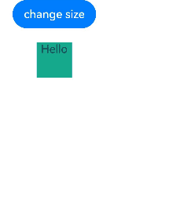
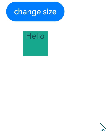

# \@Local装饰器：组件内部状态
<!--Kit: ArkUI-->
<!--Subsystem: ArkUI-->
<!--Owner: @jiyujia926-->
<!--Designer: @zhangboren-->
<!--Tester: @TerryTsao-->
<!--Adviser: @zhang_yixin13-->

为了实现对\@ComponentV2装饰的自定义组件中变量变化的观测，开发者可以使用[\@Local](../../reference/apis-arkui/arkui-ts/ts-state-management-local.md#local)装饰器装饰变量。

在阅读本文档前，建议提前阅读：[\@ComponentV2](./arkts-create-custom-components.md#componentv2)。常见问题请参考[组件内状态变量常见问题](./arkts-state-management-faq-inner-component.md)。

>**说明：**
>
> 从API version 12开始，在\@ComponentV2装饰的自定义组件中支持使用\@Local装饰器。
>
> 从API version 12开始，该装饰器支持在原子化服务中使用。
>
> 从API version 23开始，该装饰器支持在ArkTS卡片中使用。

## 概述

\@Local表示组件内部的状态，使得自定义组件内部的变量具有观察变化的能力：

- 被\@Local装饰的变量无法从外部初始化，因此必须在组件内部进行初始化。

- 当被\@Local装饰的变量变化时，会刷新使用该变量的组件。

- \@Local支持观测number、boolean、string、Object、class等基本类型以及[Array](#装饰array类型变量)、[Set](#装饰set类型变量)、[Map](#装饰map类型变量)、[Date](#装饰date类型变量)等内置类型。

- \@Local的观测能力仅限于被装饰的变量本身。当装饰简单类型时，能够观测到对变量的赋值；当装饰对象类型时，仅能观测到对对象整体的赋值；当装饰数组类型时，能观测到数组整体以及数组元素项的变化；当装饰Array、Set、Map、Date等内置类型时，可以观测到通过API调用带来的变化。详见[观察变化](#观察变化)。

- \@Local支持null、undefined以及[联合类型](#联合类型)。

## 状态管理V1版本\@State装饰器的局限性

状态管理V1使用[\@State装饰器](arkts-state.md)定义组件中的基础状态变量，该状态变量常用来作为组件内部状态，在组件内使用。但由于\@State装饰器又能够从外部初始化，因此无法确保\@State装饰变量的初始值一定为组件内部定义的值。

<!-- @[Local_V1_State_Decorator](https://gitcode.com/openharmony/applications_app_samples/blob/master/code/DocsSample/ArkUISample/ParadigmStateManagement/entry/src/main/ets/pages/local/LocalV1StateDecorator.ets) -->

``` TypeScript
class ComponentInfo {
  public name: string;
  public count: number;
  public message: string;

  constructor(name: string, count: number, message: string) {
    this.name = name;
    this.count = count;
    this.message = message;
  }
}

@Component
struct Child {
  @State componentInfo: ComponentInfo = new ComponentInfo('Child', 1, 'Hello World'); // 父组件传递的componentInfo会覆盖初始值

  build() {
    Column() {
      Text(`componentInfo.message is ${this.componentInfo.message}`)
    }
  }
}

@Entry
@Component
struct Index {
  build() {
    Column() {
      Child({ componentInfo: new ComponentInfo('Unknown', 0, 'Error') })
    }
  }
}
```

上述代码中，可以通过在初始化Child自定义组件时传入新的值来覆盖作为内部状态变量使用的componentInfo。但Child自定义组件并不能感知到componentInfo从外部进行了初始化，这不利于自定义组件内部状态的管理。因此推出\@Local装饰器表示组件的内部状态。

## 装饰器说明

| \@Local变量装饰器 | 说明 |
| ------------------- | ------------------------------------------------------------ |
| 装饰器参数 | 无。 |
| 可装饰的变量类型 | Object、class、string、number、boolean、enum等基本类型以及Array、Date、Map、Set等内置类型。支持null、undefined以及联合类型。 |
| 装饰变量的初始值 | 必须本地初始化，不允许外部传入初始化。 |

## 变量传递

| 传递规则       | 说明                                                         |
| -------------- | ------------------------------------------------------------ |
| 从父组件初始化 | \@Local装饰的变量仅允许本地初始化，无法从外部传入初始化。    |
| 初始化子组件   | \@Local装饰的变量可以初始化子组件中[\@Param](arkts-new-param.md)装饰的变量。 |

## 观察变化

使用\@Local装饰的变量具有观察变化的能力。当装饰的变量发生变化时，会触发该变量绑定的UI组件刷新。

- 当装饰的变量类型为boolean、string、number时，可以观察到对变量赋值的变化。

  <!-- @[Local_Observe_Changes_Type](https://gitcode.com/openharmony/applications_app_samples/blob/master/code/DocsSample/ArkUISample/ParadigmStateManagement/entry/src/main/ets/pages/local/LocalObserveChangesType.ets) -->
  
  ``` TypeScript
  @Entry
  @ComponentV2
  struct Index {
    // 点击的次数
    @Local count: number = 0;
    @Local message: string = 'Hello';
    @Local flag: boolean = false;
  
    build() {
      Column() {
        Text(`${this.count}`)
        Text(`${this.message}`)
        Text(`${this.flag}`)
        Button('change Local')
          .onClick(() => {
            // 当@Local装饰简单类型时，能够观测到对变量的赋值
            this.count++;
            this.message += ' World';
            this.flag = !this.flag;
          })
      }
    }
  }
  ```

- 当装饰的变量类型为类对象时，仅可以观察到对类对象整体赋值的变化，无法直接观察到对类成员属性赋值的变化，对类成员属性的观察依赖[\@ObservedV2](arkts-new-observedV2-and-trace.md)和[\@Trace](arkts-new-observedV2-and-trace.md)装饰器，也可以使用[makeObserved](./arkts-new-makeObserved.md)将该对象变为可观察对象。注意，API version 19之前，\@Local无法和[\@Observed](./arkts-observed-and-objectlink.md)装饰的类实例对象混用。API version 19及以后，支持部分状态管理V1V2混用能力，允许\@Local和\@Observed同时使用，详情见[状态管理V1和V2混用指导（API version 19及之后）](../../ui/state-management/arkts-v1-v2-mixusage.md)。

    <!-- @[Local_Observe_Changes_Decorator](https://gitcode.com/openharmony/applications_app_samples/blob/master/code/DocsSample/ArkUISample/ParadigmStateManagement/entry/src/main/ets/pages/local/LocalObserveChangesDecorator.ets) -->
    
    ``` TypeScript
    class RawObject {
      public name: string;
    
      constructor(name: string) {
        this.name = name;
      }
    }
    
    @ObservedV2
    class ObservedObject {
      @Trace public name: string;
    
      constructor(name: string) {
        this.name = name;
      }
    }
    
    @Entry
    @ComponentV2
    struct Index {
      @Local rawObject: RawObject = new RawObject('rawObject');
      @Local observedObject: ObservedObject = new ObservedObject('observedObject');
    
      build() {
        Column() {
          Text(`${this.rawObject.name}`)
          Text(`${this.observedObject.name}`)
          Button('change object')
            .onClick(() => {
              // 对类对象整体的修改均能观察到
              this.rawObject = new RawObject('new rawObject');
              this.observedObject = new ObservedObject('new observedObject');
            })
          Button('change name')
            .onClick(() => {
              // @Local不具备观察类对象属性的能力，因此对rawObject.name的修改无法观察到
              this.rawObject.name = 'new rawObject name';
              // 由于ObservedObject的name属性被@Trace装饰，因此对observedObject.name的修改能被观察到
              this.observedObject.name = 'new observedObject name';
            })
        }
      }
    }
    ```

- 当装饰简单类型数组时，可以观察到数组整体或数组项的变化。

    <!-- @[Local_Observe_Changes_Array](https://gitcode.com/openharmony/applications_app_samples/blob/master/code/DocsSample/ArkUISample/ParadigmStateManagement/entry/src/main/ets/pages/local/LocalObserveChangesArray.ets) -->
    
    ``` TypeScript
    @Entry
    @ComponentV2
    struct Index {
      @Local numArr: number[] = [1, 2, 3, 4, 5]; // 使用@Local装饰一维数组变量
      @Local dimensionTwo: number[][] = [[1, 2, 3], [4, 5, 6]]; // 使用@Local装饰二维数组变量
    
      build() {
        Column() {
          Text(`${this.numArr[0]}`)
          Text(`${this.numArr[1]}`)
          Text(`${this.numArr[2]}`)
          Text(`${this.dimensionTwo[0][0]}`)
          Text(`${this.dimensionTwo[1][1]}`)
          Button('change array item') // 按钮1：修改数组中的特定元素
            .onClick(() => {
              this.numArr[0]++;
              this.numArr[1] += 2;
              this.dimensionTwo[0][0] = 0;
              this.dimensionTwo[1][1] = 0;
            })
          Button('change whole array') // 按钮2：替换整个数组
            .onClick(() => {
              this.numArr = [5, 4, 3, 2, 1];
              this.dimensionTwo = [[7, 8, 9], [0, 1, 2]];
            })
        }
      }
    }
    ```
  
- 当装饰的变量是嵌套类或对象数组时，\@Local无法观察深层对象属性的变化。对深层对象属性的观测依赖\@ObservedV2与\@Trace装饰器。

  <!-- @[Local_Observe_Changes_DeepObject](https://gitcode.com/openharmony/applications_app_samples/blob/master/code/DocsSample/ArkUISample/ParadigmStateManagement/entry/src/main/ets/pages/local/LocalObserveChangesDeepObject.ets) -->
  
  ``` TypeScript
  @ObservedV2
  class Region {
    @Trace public x: number;
    @Trace public y: number;
  
    constructor(x: number, y: number) {
      this.x = x;
      this.y = y;
    }
  }
  
  @ObservedV2
  class Info {
    @Trace public region: Region;
    @Trace public name: string;
  
    constructor(name: string, x: number, y: number) {
      this.name = name;
      this.region = new Region(x, y);
    }
  }
  
  @Entry
  @ComponentV2
  struct Index {
    @Local infoArr: Info[] = [new Info('Ocean', 28, 120), new Info('Mountain', 26, 20)];
    @Local originInfo: Info = new Info('Origin', 0, 0);
  
    build() {
      Column() {
        ForEach(this.infoArr, (info: Info) => {
          Row() {
            Text(`name: ${info.name}`)
            Text(`region: ${info.region.x}-${info.region.y}`)
          }
        })
        Row() {
          Text(`Origin name: ${this.originInfo.name}`)
          Text(`Origin region: ${this.originInfo.region.x}-${this.originInfo.region.y}`)
        }
  
        Button('change infoArr item')
          .onClick(() => {
            // 由于属性name被@Trace装饰，所以能够观察到
            this.infoArr[0].name = 'Win';
          })
        Button('change originInfo')
          .onClick(() => {
            // 由于变量originInfo被@Local装饰，所以能够观察到
            this.originInfo = new Info('Origin', 100, 100);
          })
        Button('change originInfo region')
          .onClick(() => {
            // 由于属性x、y被@Trace装饰，所以能够观察到
            this.originInfo.region.x = 25;
            this.originInfo.region.y = 25;
          })
      }
    }
  }
  ```

- 当装饰内置类型时，可以观察到变量整体赋值及API调用带来的变化。

  | 类型  | 可观察变化的API                                              |
  | ----- | ------------------------------------------------------------ |
  | Array | push, pop, shift, unshift, splice, copyWithin, fill, reverse, sort |
  | Date  | setFullYear, setMonth, setDate, setHours, setMinutes, setSeconds, setMilliseconds, setTime, setUTCFullYear, setUTCMonth, setUTCDate, setUTCHours, setUTCMinutes, setUTCSeconds, setUTCMilliseconds |
  | Map   | set, clear, delete                                           |
  | Set   | add, clear, delete                                           |

## 限制条件

\@Local装饰器存在以下使用限制：

- \@Local装饰器只能在[\@ComponentV2](./arkts-create-custom-components.md#componentv2)装饰的自定义组件中使用。

  ```ts
  @ComponentV2
  struct MyComponent {
    @Local message: string = 'Hello World'; // 正确用法
    build() {
    }
  }
  @Component
  struct TestComponent {
    @Local message: string = 'Hello World'; // 错误用法，编译时报错
    build() {
    }
  }
  ```

- \@Local装饰的变量表示组件内部状态，不允许从外部传入初始化。

  ```ts
  @ComponentV2
  struct ChildComponent {
    @Local message: string = 'Hello World';
    build() {
    }
  }
  @ComponentV2
  struct MyComponent {
    build() {
      ChildComponent({ message: 'Hello' }) // 错误用法，编译时报错
    }
  }
  ```

## \@Local与\@State对比

\@Local与\@State的用法、功能对比如下：

| 用法 | \@State                      | \@Local                         |
| ------------------ | ---------------------------- | --------------------------------- |
| 参数               | 无。                          | 无。                       |
| 从父组件初始化         | 可选。                  | 不允许外部初始化。           |
| 观察能力 | 能观测变量本身以及一层的成员属性，无法深度观测。 | 能观测变量本身，深度观测依赖\@Trace装饰器。 |
| 数据传递 | 可以作为数据源和子组件中状态变量同步。 | 可以作为数据源和子组件中状态变量同步。 |

## 使用场景

### 观测对象整体变化

被\@ObservedV2与\@Trace装饰的类对象实例，具有深度观测对象属性的能力。但当对对象整体赋值时，UI却无法刷新。使用\@Local装饰对象，可以达到观测对象本身变化的效果。

<!-- @[Local_Use_Case_Object](https://gitcode.com/openharmony/applications_app_samples/blob/master/code/DocsSample/ArkUISample/ParadigmStateManagement/entry/src/main/ets/pages/local/LocalUseCaseObject.ets) -->

``` TypeScript
@ObservedV2
class Info {
  @Trace public name: string;
  @Trace public age: number;

  constructor(name: string, age: number) {
    this.name = name;
    this.age = age;
  }
}

@Entry
@ComponentV2
struct Index {
  info: Info = new Info('Tom', 25);
  @Local localInfo: Info = new Info('Tom', 25);

  build() {
    Row() {
      Column() {
        Text(`info: ${this.info.name}-${this.info.age}`) // Text1
          .margin(10)
        Text(`localInfo: ${this.localInfo.name}-${this.localInfo.age}`) // Text2
          .margin(10)
        Button('change info&localInfo')
          .onClick(() => {
            this.info = new Info('Lucy', 18); // Text1不会刷新
            this.localInfo = new Info('Lucy', 18); // Text2会刷新
          })
          .margin(10)
      }
      .width('100%')
    }
    .height('100%')
  }
}
```


### 装饰Array类型变量

当装饰的对象是Array时，可以观察到Array整体的赋值，同时可以通过调用Array的接口`push`, `pop`, `shift`, `unshift`, `splice`, `copyWithin`, `fill`, `reverse`, `sort`更新Array中的数据。

<!-- @[Local_Use_Case_Array](https://gitcode.com/openharmony/applications_app_samples/blob/master/code/DocsSample/ArkUISample/ParadigmStateManagement/entry/src/main/ets/pages/local/LocalUseCaseArray.ets) -->

``` TypeScript
class Fruit {
  public name: string;

  constructor(name: string) {
    this.name = name;
  }
}

@Entry
@ComponentV2
struct Index {
  @Local fruits: Fruit[] = [new Fruit('apple'), new Fruit('banana')]; // 使用@Local装饰Array类型变量

  build() {
    Row() {
      Column() {
        ForEach(this.fruits, (item: Fruit) => {
          Text(`${item.name}`)
            .fontSize(20)
            .margin(10)
        })
        // 对数组整体重新赋值，触发UI刷新
        Button('Reset array')
          .onClick(() => {
            this.fruits = [new Fruit('strawberry'), new Fruit('blueberry')];
          })
          .width(300)
          .margin(10)
        // 新增数组元素，触发UI刷新
        Button('Push element')
          .onClick(() => {
            this.fruits.push(new Fruit('cherry'));
          })
          .width(300)
          .margin(10)
        // 翻转数组元素，触发UI刷新
        Button('Reverse array')
          .onClick(() => {
            this.fruits.reverse();
          })
          .width(300)
          .margin(10)
        // 使用同一元素填充数组，触发UI刷新
        Button('Fill array')
          .onClick(() => {
            this.fruits.fill(new Fruit('apple'));
          })
          .width(300)
          .margin(10)
      }
      .width('100%')
    }
    .height('100%')
  }
}
```


### 装饰Date类型变量

当装饰的对象是Date时，可以观察到Date整体的赋值，同时可通过调用Date的接口`setFullYear`, `setMonth`, `setDate`, `setHours`, `setMinutes`, `setSeconds`, `setMilliseconds`, `setTime`, `setUTCFullYear`, `setUTCMonth`, `setUTCDate`, `setUTCHours`, `setUTCMinutes`, `setUTCSeconds`, `setUTCMilliseconds`更新Date的属性。

<!-- @[Local_Use_Case_Data](https://gitcode.com/openharmony/applications_app_samples/blob/master/code/DocsSample/ArkUISample/ParadigmStateManagement/entry/src/main/ets/pages/local/LocalUseCaseDate.ets) -->

``` TypeScript
@Entry
@ComponentV2
struct DatePickerExample {
  @Local selectedDate: Date = new Date('2021-08-08'); // 使用@Local装饰Date类型变量

  build() {
    Row() {
      Column() {
        // 通过给selectedDate重新赋值新的Date实例，触发UI刷新
        Button('set selectedDate to 2023-07-08')
          .onClick(() => {
            this.selectedDate = new Date('2023-07-08');
          })
          .margin(10)
          .width(300)
        // 调用Date的setFullYear接口修改年份，触发UI刷新
        Button('increase the year by 1')
          .onClick(() => {
            this.selectedDate.setFullYear(this.selectedDate.getFullYear() + 1);
          })
          .margin(10)
          .width(300)
        // 调用Date的setMonth接口修改月份，触发UI刷新
        Button('increase the month by 1')
          .onClick(() => {
            this.selectedDate.setMonth(this.selectedDate.getMonth() + 1);
          })
          .margin(10)
          .width(300)
        // 调用Date的setDate接口修改日期，触发UI刷新
        Button('increase the day by 1')
          .onClick(() => {
            this.selectedDate.setDate(this.selectedDate.getDate() + 1);
          })
          .margin(10)
          .width(300)
        DatePicker({
          start: new Date('1970-1-1'),
          end: new Date('2100-1-1'),
          selected: this.selectedDate
        }).margin(20)
      }
      .width('100%')
    }
    .height('100%')
  }
}
```


### 装饰Map类型变量

当装饰的对象是Map时，可以观察到对Map整体的赋值，同时可以通过调用Map的接口`set`, `clear`, `delete`更新Map中的数据。

<!-- @[Local_Use_Case_Map](https://gitcode.com/openharmony/applications_app_samples/blob/master/code/DocsSample/ArkUISample/ParadigmStateManagement/entry/src/main/ets/pages/local/LocalUseCaseMap.ets) -->

``` TypeScript
@Entry
@ComponentV2
struct MapSample {
  @Local fruits: Map<string, number> = new Map([['apple', 1], ['banana', 2]]); // 使用@Local装饰Map类型变量

  build() {
    Row() {
      Column() {
        ForEach(Array.from(this.fruits.entries()), (item: [string, number]) => {
          Text(`key: ${item[0]}, value: ${item[1]}`)
            .fontSize(20)
            .margin(10)
        })
        // 新增键值对，触发UI刷新
        Button('Set entry cherry')
          .onClick(() => {
            this.fruits.set('cherry', 3);
          })
          .width(300)
          .margin(10)
        // 更新键值对，触发UI刷新
        Button('Update entry apple')
          .onClick(() => {
            this.fruits.set('apple', 4);
          })
          .width(300)
          .margin(10)
        // 删除键值对，触发UI刷新
        Button('Delete entry apple')
          .onClick(() => {
            this.fruits.delete('apple');
          })
          .width(300)
          .margin(10)
        // 对Map整体重新赋值，触发UI刷新
        Button('Reset map')
          .onClick(() => {
            this.fruits = new Map([['strawberry', 9], ['blueberry', 8]]);
          })
          .width(300)
          .margin(10)
        // 清空Map，触发UI刷新
        Button('Clear map')
          .onClick(() => {
            this.fruits.clear();
          })
          .width(300)
          .margin(10)
      }
      .width('100%')
    }
    .height('100%')
  }
}
```


### 装饰Set类型变量

当装饰的对象是Set时，可以观察到对Set整体的赋值，同时可以通过调用Set的接口`add`, `clear`, `delete`更新Set中的数据。

<!-- @[Local_Use_Case_Set](https://gitcode.com/openharmony/applications_app_samples/blob/master/code/DocsSample/ArkUISample/ParadigmStateManagement/entry/src/main/ets/pages/local/LocalUseCaseSet.ets) -->

``` TypeScript
@Entry
@ComponentV2
struct SetSample {
  @Local fruits: Set<string> = new Set(['apple', 'banana']); // 使用@Local装饰Set类型变量

  build() {
    Row() {
      Column() {
        ForEach(Array.from(this.fruits.entries()), (item: [string, string]) => {
          Text(`${item[0]}`)
            .fontSize(20)
            .margin(10)
        })
        // 新增元素，触发UI刷新
        Button('Add element')
          .onClick(() => {
            this.fruits.add('cherry');
          })
          .width(300)
          .margin(10)
        // 删除元素，触发UI刷新
        Button('Delete element apple')
          .onClick(() => {
            this.fruits.delete('apple');
          })
          .width(300)
          .margin(10)
        // 对Set整体重新赋值，触发UI刷新
        Button('Reset set')
          .onClick(() => {
            this.fruits = new Set(['strawberry', 'blueberry']);
          })
          .width(300)
          .margin(10)
        // 清空Set，触发UI刷新
        Button('Clear set')
          .onClick(() => {
            this.fruits.clear();
          })
          .width(300)
          .margin(10)
      }
      .width('100%')
    }
    .height('100%')
  }
}
```


### 联合类型

\@Local支持null、undefined以及联合类型。在下面的示例中，count类型为number | undefined，点击改变count的类型，UI会随之刷新。

<!-- @[Local_Use_Case_Join](https://gitcode.com/openharmony/applications_app_samples/blob/master/code/DocsSample/ArkUISample/ParadigmStateManagement/entry/src/main/ets/pages/local/LocalUseCaseJoin.ets) -->

``` TypeScript
@Entry
@ComponentV2
struct Index {
  @Local count: number | undefined = 10; // 使用@Local装饰联合类型变量

  build() {
    Row() {
      Column() {
        Text(`count: ${this.count}`)
        // 将联合类型变量从number切换为undefined，触发UI刷新
        Button('change to undefined')
          .onClick(() => {
            this.count = undefined;
          })
          .width(300)
          .margin(10)
        // 将联合类型变量从undefined切换为number，触发UI刷新
        Button('change to number')
          .onClick(() => {
            this.count = 10;
          })
          .width(300)
          .margin(10)
      }
      .width('100%')
    }
    .height('100%')
  }
}
```


## 常见问题

### 在状态管理V2中使用animateTo动画效果异常

在下面的场景中，[animateTo](../../reference/apis-arkui/arkts-apis-uicontext-uicontext.md#animateto)暂不支持直接在状态管理V2中使用。

<!-- @[Local_AnimateTo_V2_Problem](https://gitcode.com/openharmony/applications_app_samples/blob/master/code/DocsSample/ArkUISample/ParadigmStateManagement/entry/src/main/ets/pages/local/LocalAnimateToV2Problem.ets) -->

``` TypeScript
@Entry
@ComponentV2
struct Index {
  @Local w: number = 50; // 宽度
  @Local h: number = 50; // 高度
  @Local message: string = 'Hello';

  build() {
    Column() {
      Button('change size')
        .margin(20)
        .onClick(() => {
          // 在执行动画前，存在额外的修改
          this.w = 100;
          this.h = 100;
          this.message = 'Hello World';
          this.getUIContext().animateTo({
            duration: 1000
          }, () => {
            this.w = 200;
            this.h = 200;
            this.message = 'Hello ArkUI';
          })
        })
      Column() {
        Text(`${this.message}`)
      }
      .backgroundColor('#ff17a98d')
      .width(this.w)
      .height(this.h)
    }
  }
}
```

上述代码中，开发者预期的动画效果是：绿色矩形从长宽100变为200，字符串从`Hello World`变为`Hello ArkUI`。但由于当前animateTo与V2的刷新机制不兼容，执行动画前的额外修改未生效，实际显示的动画效果是：绿色矩形从长宽50变为200，字符串从`Hello`变为`Hello ArkUI`。



从API version 22开始，可以使用[applySync接口](./arkts-new-applySync-flushUpdates-flushUIUpdates.md)实现预期的显示效果。

<!-- @[Local_ApplySync_Effect](https://gitcode.com/openharmony/applications_app_samples/blob/master/code/DocsSample/ArkUISample/ParadigmStateManagement/entry/src/main/ets/pages/local/LocalApplySyncEffect.ets) -->

``` TypeScript
import { UIUtils } from '@kit.ArkUI';

@Entry
@ComponentV2
struct Index {
  @Local w: number = 50; // 宽度
  @Local h: number = 50; // 高度
  @Local message: string = 'Hello';

  build() {
    Column() {
      Button('change size')
        .margin(20)
        .onClick(() => {
          // 在执行动画前，存在额外的修改
          UIUtils.applySync(() => {
            this.w = 100;
            this.h = 100;
            this.message = 'Hello World';
          })
          this.getUIContext().animateTo({
            duration: 1000
          }, () => {
            this.w = 200;
            this.h = 200;
            this.message = 'Hello ArkUI';
          })
        })
      Column() {
        Text(`${this.message}`)
      }
      .backgroundColor('#ff17a98d')
      .width(this.w)
      .height(this.h)
    }
  }
}
```

原理为使用applySync接口同步刷新闭包函数内的状态变量变化，再执行原来的动画达成预期的效果。

