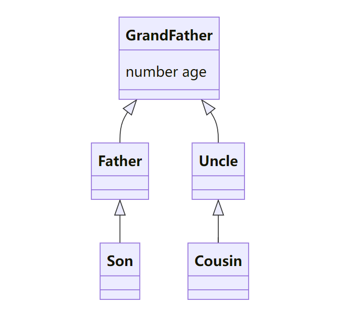

# \@ObservedV2装饰器和\@Trace装饰器：类属性变化观测

为了增强状态管理框架对类对象中属性的观测能力，开发者可以使用\@ObservedV2装饰器和\@Trace装饰器装饰类以及类中的属性。


\@ObservedV2和\@Trace提供了对嵌套类对象属性变化直接观测的能力，是状态管理V2中相对核心的能力之一。在阅读本文档前，建议提前阅读：[状态管理概述](./arkts-state-management-overview.md)来了解状态管理V2整体的能力架构。

>**说明：**
>
>\@ObservedV2与\@Trace装饰器从API version 12开始支持。
>

## 概述

\@ObservedV2装饰器与\@Trace装饰器用于装饰类以及类中的属性，使得被装饰的类和属性具有深度观测的能力：

- \@ObservedV2装饰器与\@Trace装饰器需要配合使用，单独使用\@ObservedV2装饰器或\@Trace装饰器没有任何作用。
- 被\@Trace装饰器装饰的属性property变化时，仅会通知property关联的组件进行刷新。
- 在嵌套类中，嵌套类中的属性property被\@Trace装饰且嵌套类被\@ObservedV2装饰时，才具有触发UI刷新的能力。
- 在继承类中，父类或子类中的属性property被\@Trace装饰且该property所在类被\@ObservedV2装饰时，才具有触发UI刷新的能力。
- 未被\@Trace装饰的属性用在UI中无法感知到变化，也无法触发UI刷新。
- \@ObservedV2的类实例目前不支持使用JSON.stringify进行序列化。
- 使用\@ObservedV2与\@Trace装饰器的类，需通过new操作符实例化后，才具备被观测变化的能力。

## 状态管理V1版本对嵌套类对象属性变化直接观测的局限性

现有状态管理V1版本无法实现对嵌套类对象属性变化的直接观测。

```ts
@Observed
class Father {
  son: Son;

  constructor(name: string, age: number) {
    this.son = new Son(name, age);
  }
}
@Observed
class Son {
  name: string;
  age: number;

  constructor(name: string, age: number) {
    this.name = name;
    this.age = age;
  }
}
@Entry
@Component
struct Index {
  @State father: Father = new Father("John", 8);

  build() {
    Row() {
      Column() {
        Text(`name: ${this.father.son.name} age: ${this.father.son.age}`)
          .fontSize(50)
          .fontWeight(FontWeight.Bold)
          .onClick(() => {
            this.father.son.age++;
          })
      }
      .width('100%')
    }
    .height('100%')
  }
}
```

在上述代码中，点击Text组件增加age的值时，不会触发UI刷新。原因在于现有的状态管理框架无法观测到嵌套类中属性age的值变化。V1版本的解决方案是使用[\@ObjectLink装饰器](arkts-observed-and-objectlink.md)与自定义组件来实现观测。

```ts
@Observed
class Father {
  son: Son;

  constructor(name: string, age: number) {
    this.son = new Son(name, age);
  }
}
@Observed
class Son {
  name: string;
  age: number;

  constructor(name: string, age: number) {
    this.name = name;
    this.age = age;
  }
}
@Component
struct Child {
  @ObjectLink son: Son;

  build() {
    Row() {
      Column() {
        Text(`name: ${this.son.name} age: ${this.son.age}`)
          .fontSize(50)
          .fontWeight(FontWeight.Bold)
          .onClick(() => {
            this.son.age++;
          })
      }
      .width('100%')
    }
    .height('100%')
  }
}
@Entry
@Component
struct Index {
  @State father: Father = new Father("John", 8);

  build() {
    Column() {
      Child({son: this.father.son})
    }
  }
}
```

通过这种方式虽然能够实现对嵌套类中属性变化的观测，但是当嵌套层级较深时，代码将会变得十分复杂，易用性差。因此推出类装饰器\@ObservedV2与成员变量装饰器\@Trace，增强对嵌套类中属性变化的观测能力。

## 装饰器说明

| \@ObservedV2类装饰器 | 说明                                                  |
| ------------------ | ----------------------------------------------------- |
| 装饰器参数         | 无。                                                    |
| 类装饰器           | 装饰class。需要放在class的定义前，使用new创建类对象。 |

| \@Trace成员变量装饰器 | 说明                                                         |
| --------------------- | ------------------------------------------------------------ |
| 装饰器参数            | 无。                                                           |
| 可装饰的变量          | class中成员属性。属性的类型可以为number、string、boolean、class、Array、Date、Map、Set等类型。 |

## 观察变化

使用\@ObservedV2装饰的类中被\@Trace装饰的属性具有被观测变化的能力，当该属性值变化时，会触发该属性绑定的UI组件刷新。

- 在嵌套类中使用\@Trace装饰的属性具有被观测变化的能力。

```ts
@ObservedV2
class Son {
  @Trace age: number = 100;
}
class Father {
  son: Son = new Son();
}
@Entry
@ComponentV2
struct Index {
  father: Father = new Father();

  build() {
    Column() {
      // 当点击改变age时，Text组件会刷新
      Text(`${this.father.son.age}`)
        .onClick(() => {
          this.father.son.age++;
        })
    }
  }
}

```

- 在继承类中使用\@Trace装饰的属性具有被观测变化的能力。

```ts
@ObservedV2
class Father {
  @Trace name: string = "Tom";
}
class Son extends Father {
}
@Entry
@ComponentV2
struct Index {
  son: Son = new Son();

  build() {
    Column() {
      // 当点击改变name时，Text组件会刷新
      Text(`${this.son.name}`)
        .onClick(() => {
          this.son.name = "Jack";
        })
    }
  }
}
```

- 类中使用\@Trace装饰的静态属性具有被观测变化的能力。

```ts
@ObservedV2
class Manager {
  @Trace static count: number = 1;
}
@Entry
@ComponentV2
struct Index {
  build() {
    Column() {
      // 当点击改变count时，Text组件会刷新
      Text(`${Manager.count}`)
        .onClick(() => {
          Manager.count++;
        })
    }
  }
}
```

- \@Trace装饰内置类型时，可以观测各自API导致的变化：

  | 类型  | 可观测变化的API                                              |
  | ----- | ------------------------------------------------------------ |
  | Array | push、pop、shift、unshift、splice、copyWithin、fill、reverse、sort |
  | Date  | setFullYear, setMonth, setDate, setHours, setMinutes, setSeconds, setMilliseconds, setTime, setUTCFullYear, setUTCMonth, setUTCDate, setUTCHours, setUTCMinutes, setUTCSeconds, setUTCMilliseconds |
  | Map   | set, clear, delete                                           |
  | Set   | add, clear, delete                                           |

## 使用限制

\@ObservedV2与\@Trace装饰器存在以下使用限制：

- 非\@Trace装饰的成员属性用在UI上无法触发UI刷新。

```ts
@ObservedV2
class Person {
  id: number = 0;
  @Trace age: number = 8;
}
@Entry
@ComponentV2
struct Index {
  person: Person = new Person();

  build() {
    Column() {
      // age被@Trace装饰，用在UI中可以触发UI刷新
      Text(`${this.person.age}`)
        .onClick(() => {
          this.person.age++; // 点击会触发UI刷新
        })
      // id未被@Trace装饰，用在UI中不会触发UI刷新
      Text(`${this.person.id}`) // 当id变化时不会刷新
        .onClick(() => {
          this.person.id++; // 点击不会触发UI刷新
        })
    }
  }
}
```

- \@ObservedV2仅能装饰class，无法装饰自定义组件。

```ts
@ObservedV2 // 错误用法，编译时报错
struct Index {
  build() {
  }
}
```

- \@Trace不能用在没有被\@ObservedV2装饰的class上。

```ts
class User {
  id: number = 0;
  @Trace name: string = "Tom"; // 错误用法，编译时报错
}
```

- \@Trace是class中属性的装饰器，不能用在struct中。

```ts
@ComponentV2
struct Comp {
  @Trace message: string = "Hello World"; // 错误用法，编译时报错

  build() {
  }
}
```

- \@ObservedV2、\@Trace不能与[\@Observed](arkts-observed-and-objectlink.md)、[\@Track](arkts-track.md)混合使用。

```ts
@Observed
class User {
  @Trace name: string = "Tom"; // 错误用法，编译时报错
}

@ObservedV2
class Person {
  @Track name: string = "Jack"; // 错误用法，编译时报错
}
```

- 使用\@ObservedV2与\@Trace装饰的类不能和[\@State](arkts-state.md)等V1的装饰器混合使用，编译时报错。

```ts
// 以@State装饰器为例
@ObservedV2
class Job {
  @Trace jobName: string = "Teacher";
}
@ObservedV2
class Info {
  @Trace name: string = "Tom";
  @Trace age: number = 25;
  job: Job = new Job();
}
@Entry
@Component
struct Index {
  @State info: Info = new Info(); // 无法混用，编译时报错

  build() {
    Column() {
      Text(`name: ${this.info.name}`)
      Text(`age: ${this.info.age}`)
      Text(`jobName: ${this.info.job.jobName}`)
      Button("change age")
        .onClick(() => {
          this.info.age++;
        })
      Button("Change job")
        .onClick(() => {
          this.info.job.jobName = "Doctor";
        })
    }
  }
}
```

- 继承自\@ObservedV2的类无法和\@State等V1的装饰器混用，运行时报错。

```ts
// 以@State装饰器为例
@ObservedV2
class Job {
  @Trace jobName: string = "Teacher";
}
@ObservedV2
class Info {
  @Trace name: string = "Tom";
  @Trace age: number = 25;
  job: Job = new Job();
}
class Message extends Info {
    constructor() {
        super();
    }
}
@Entry
@Component
struct Index {
  @State message: Message = new Message(); // 无法混用，运行时报错

  build() {
    Column() {
      Text(`name: ${this.message.name}`)
      Text(`age: ${this.message.age}`)
      Text(`jobName: ${this.message.job.jobName}`)
      Button("change age")
        .onClick(() => {
          this.message.age++;
        })
      Button("Change job")
        .onClick(() => {
          this.message.job.jobName = "Doctor";
        })
    }
  }
}
```

- \@ObservedV2的类实例目前不支持使用JSON.stringify进行序列化。
- 使用\@ObservedV2与\@Trace装饰器的类，需通过new操作符实例化后，才具备被观测变化的能力。

## 使用场景

### 嵌套类场景

在下面的嵌套类场景中，Pencil类是Son类中最里层的类，Pencil类被\@ObservedV2装饰且属性length被\@Trace装饰，此时length的变化能够被观测到。

\@Trace装饰器与现有状态管理框架的[\@Track](arkts-track.md)与[\@State](arkts-state.md)装饰器的能力不同，@Track使class具有属性级更新的能力，但并不具备深度观测的能力；而\@State只能观测到对象本身以及第一层的变化，对于多层嵌套场景只能通过封装自定义组件，搭配[\@Observed](arkts-observed-and-objectlink.md)和[\@ObjectLink](arkts-observed-and-objectlink.md)来实现观测。

* 点击Button("change length")，length是被\@Trace装饰的属性，它的变化可以触发关联的UI组件，即UINode (1)的刷新，并输出"id: 1 renderTimes: x"的日志，其中x根据点击次数依次增长。
* 自定义组件Page中的son是常规变量，因此点击Button("assign Son")并不会观测到变化。
* 当点击Button("assign Son")后，再点击Button("change length")并不会引起UI刷新。因为此时son的地址改变，其关联的UI组件并没有关联到最新的son。

```ts
@ObservedV2
class Pencil {
  @Trace length: number = 21; // 当length变化时，会刷新关联的组件
}
class Bag {
  width: number = 50;
  height: number = 60;
  pencil: Pencil = new Pencil();
}
class Son {
  age: number = 5;
  school: string = "some";
  bag: Bag = new Bag();
}

@Entry
@ComponentV2
struct Page {
  son: Son = new Son();
  renderTimes: number = 0;
  isRender(id: number): number {
    console.info(`id: ${id} renderTimes: ${this.renderTimes}`);
    this.renderTimes++;
    return 40;
  }

  build() {
    Column() {
      Text('pencil length'+ this.son.bag.pencil.length)
        .fontSize(this.isRender(1))   // UINode (1)
      Button("change length")
        .onClick(() => {
          // 点击更改length值，UINode（1）会刷新
          this.son.bag.pencil.length += 100;
        })
      Button("assign Son")
        .onClick(() => {
          // 由于变量son非状态变量，因此无法刷新UINode（1）
          this.son = new Son();
        })
    }
  }
}
```


### 继承类场景

\@Trace支持在类的继承场景中使用，无论是在基类还是继承类中，只有被\@Trace装饰的属性才具有被观测变化的能力。
以下例子中，声明class GrandFather、Father、Uncle、Son、Cousin，继承关系如下图。




创建类Son和类Cousin的实例，点击Button('change Son age')和Button('change Cousin age')可以触发UI的刷新。

```ts
@ObservedV2
class GrandFather {
  @Trace age: number = 0;

  constructor(age: number) {
    this.age = age;
  }
}
class Father extends GrandFather{
  constructor(father: number) {
    super(father);
  }
}
class Uncle extends GrandFather {
  constructor(uncle: number) {
    super(uncle);
  }
}
class Son extends Father {
  constructor(son: number) {
    super(son);
  }
}
class Cousin extends Uncle {
  constructor(cousin: number) {
    super(cousin);
  }
}
@Entry
@ComponentV2
struct Index {
  son: Son = new Son(0);
  cousin: Cousin = new Cousin(0);
  renderTimes: number = 0;

  isRender(id: number): number {
    console.info(`id: ${id} renderTimes: ${this.renderTimes}`);
    this.renderTimes++;
    return 40;
  }

  build() {
    Row() {
      Column() {
        Text(`Son ${this.son.age}`)
          .fontSize(this.isRender(1))
          .fontWeight(FontWeight.Bold)
        Text(`Cousin ${this.cousin.age}`)
          .fontSize(this.isRender(2))
          .fontWeight(FontWeight.Bold)
        Button('change Son age')
          .onClick(() => {
            this.son.age++;
          })
        Button('change Cousin age')
          .onClick(() => {
            this.cousin.age++;
          })
      }
      .width('100%')
    }
    .height('100%')
  }
}
```

### \@Trace装饰基础类型的数组

\@Trace装饰数组时，使用支持的API能够观测到变化。支持的API见[观察变化](#观察变化)。
在下面的示例中\@ObservedV2装饰的Arr类中的属性numberArr是\@Trace装饰的数组，当使用数组API操作numberArr时，可以观测到对应的变化。注意使用数组长度进行判断以防越界访问。

```ts
let nextId: number = 0;

@ObservedV2
class Arr {
  id: number = 0;
  @Trace numberArr: number[] = [];

  constructor() {
    this.id = nextId++;
    this.numberArr = [0, 1, 2];
  }
}

@Entry
@ComponentV2
struct Index {
  arr: Arr = new Arr();

  build() {
    Column() {
      Text(`length: ${this.arr.numberArr.length}`)
        .fontSize(40)
      Divider()
      if (this.arr.numberArr.length >= 3) {
        Text(`${this.arr.numberArr[0]}`)
          .fontSize(40)
          .onClick(() => {
            this.arr.numberArr[0]++;
          })
        Text(`${this.arr.numberArr[1]}`)
          .fontSize(40)
          .onClick(() => {
            this.arr.numberArr[1]++;
          })
        Text(`${this.arr.numberArr[2]}`)
          .fontSize(40)
          .onClick(() => {
            this.arr.numberArr[2]++;
          })
      }

      Divider()

      ForEach(this.arr.numberArr, (item: number, index: number) => {
        Text(`${index} ${item}`)
          .fontSize(40)
      })

      Button('push')
        .onClick(() => {
          this.arr.numberArr.push(50);
        })

      Button('pop')
        .onClick(() => {
          this.arr.numberArr.pop();
        })

      Button('shift')
        .onClick(() => {
          this.arr.numberArr.shift();
        })

      Button('splice')
        .onClick(() => {
          this.arr.numberArr.splice(1, 0, 60);
        })


      Button('unshift')
        .onClick(() => {
          this.arr.numberArr.unshift(100);
        })

      Button('copywithin')
        .onClick(() => {
          this.arr.numberArr.copyWithin(0, 1, 2);
        })

      Button('fill')
        .onClick(() => {
          this.arr.numberArr.fill(0, 2, 4);
        })

      Button('reverse')
        .onClick(() => {
          this.arr.numberArr.reverse();
        })

      Button('sort')
        .onClick(() => {
          this.arr.numberArr.sort();
        })
    }
  }
}
```

### \@Trace装饰对象数组

* \@Trace装饰对象数组personList以及Person类中的age属性，因此当personList、age改变时均可以观测到变化。
* 点击Text组件更改age时，Text组件会刷新。

```ts
let nextId: number = 0;

@ObservedV2
class Person {
  @Trace age: number = 0;

  constructor(age: number) {
    this.age = age;
  }
}

@ObservedV2
class Info {
  id: number = 0;
  @Trace personList: Person[] = [];

  constructor() {
    this.id = nextId++;
    this.personList = [new Person(0), new Person(1), new Person(2)];
  }
}

@Entry
@ComponentV2
struct Index {
  info: Info = new Info();

  build() {
    Column() {
      Text(`length: ${this.info.personList.length}`)
        .fontSize(40)
      Divider()
      if (this.info.personList.length >= 3) {
        Text(`${this.info.personList[0].age}`)
          .fontSize(40)
          .onClick(() => {
            this.info.personList[0].age++;
          })

        Text(`${this.info.personList[1].age}`)
          .fontSize(40)
          .onClick(() => {
            this.info.personList[1].age++;
          })

        Text(`${this.info.personList[2].age}`)
          .fontSize(40)
          .onClick(() => {
            this.info.personList[2].age++;
          })
      }

      Divider()

      ForEach(this.info.personList, (item: Person, index: number) => {
        Text(`${index} ${item.age}`)
          .fontSize(40)
      })
    }
  }
}

```

### \@Trace装饰Map类型

* 被\@Trace装饰的Map类型属性可以观测到调用API带来的变化，包括 set、clear、delete。
* 因为Info类被\@ObservedV2装饰且属性memberMap被\@Trace装饰，点击Button('init map')对memberMap赋值也可以观测到变化。

```ts
@ObservedV2
class Info {
  @Trace memberMap: Map<number, string> = new Map([[0, "a"], [1, "b"], [3, "c"]]);
}

@Entry
@ComponentV2
struct MapSample {
  info: Info = new Info();

  build() {
    Row() {
      Column() {
        ForEach(Array.from(this.info.memberMap.entries()), (item: [number, string]) => {
          Text(`${item[0]}`)
            .fontSize(30)
          Text(`${item[1]}`)
            .fontSize(30)
          Divider()
        })
        Button('init map')
          .onClick(() => {
            this.info.memberMap = new Map([[0, "a"], [1, "b"], [3, "c"]]);
          })
        Button('set new one')
          .onClick(() => {
            this.info.memberMap.set(4, "d");
          })
        Button('clear')
          .onClick(() => {
            this.info.memberMap.clear();
          })
        Button('set the key: 0')
          .onClick(() => {
            this.info.memberMap.set(0, "aa");
          })
        Button('delete the first one')
          .onClick(() => {
            this.info.memberMap.delete(0);
          })
      }
      .width('100%')
    }
    .height('100%')
  }
}
```

### \@Trace装饰Set类型

* 被\@Trace装饰的Set类型属性可以观测到调用API带来的变化，包括 add, clear, delete。
* 因为Info类被\@ObservedV2装饰且属性memberSet被\@Trace装饰，点击Button('init set')对memberSet赋值也可以观察变化。

```ts
@ObservedV2
class Info {
  @Trace memberSet: Set<number> = new Set([0, 1, 2, 3, 4]);
}

@Entry
@ComponentV2
struct SetSample {
  info: Info = new Info();

  build() {
    Row() {
      Column() {
        ForEach(Array.from(this.info.memberSet.entries()), (item: [number, number]) => {
          Text(`${item[0]}`)
            .fontSize(30)
          Divider()
        })
        Button('init set')
          .onClick(() => {
            this.info.memberSet = new Set([0, 1, 2, 3, 4]);
          })
        Button('set new one')
          .onClick(() => {
            this.info.memberSet.add(5);
          })
        Button('clear')
          .onClick(() => {
            this.info.memberSet.clear();
          })
        Button('delete the first one')
          .onClick(() => {
            this.info.memberSet.delete(0);
          })
      }
      .width('100%')
    }
    .height('100%')
  }
}
```


### \@Trace装饰Date类型

* \@Trace装饰的Date类型属性可以观测调用API带来的变化，包括 setFullYear、setMonth、setDate、setHours、setMinutes、setSeconds、setMilliseconds、setTime、setUTCFullYear、setUTCMonth、setUTCDate、setUTCHours、setUTCMinutes、setUTCSeconds、setUTCMilliseconds。
* 因为Info类被\@ObservedV2装饰且属性selectedDate被\@Trace装饰，点击Button('set selectedDate to 2023-07-08')对selectedDate赋值也可以观测到变化。

```ts
@ObservedV2
class Info {
  @Trace selectedDate: Date = new Date('2021-08-08')
}

@Entry
@ComponentV2
struct DateSample {
  info: Info = new Info()

  build() {
    Column() {
      Button('set selectedDate to 2023-07-08')
        .margin(10)
        .onClick(() => {
          this.info.selectedDate = new Date('2023-07-08');
        })
      Button('increase the year by 1')
        .margin(10)
        .onClick(() => {
          this.info.selectedDate.setFullYear(this.info.selectedDate.getFullYear() + 1);
        })
      Button('increase the month by 1')
        .margin(10)
        .onClick(() => {
          this.info.selectedDate.setMonth(this.info.selectedDate.getMonth() + 1);
        })
      Button('increase the day by 1')
        .margin(10)
        .onClick(() => {
          this.info.selectedDate.setDate(this.info.selectedDate.getDate() + 1);
        })
      DatePicker({
        start: new Date('1970-1-1'),
        end: new Date('2100-1-1'),
        selected: this.info.selectedDate
      })
    }.width('100%')
  }
}
```
