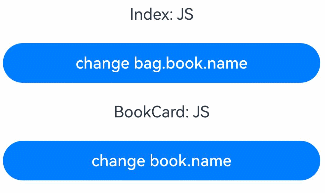
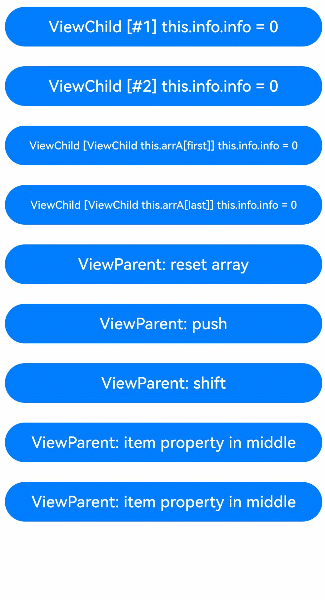
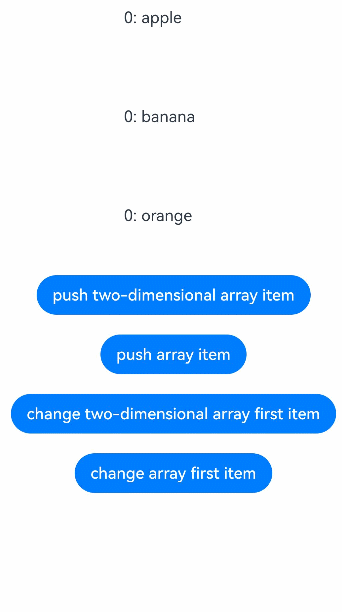
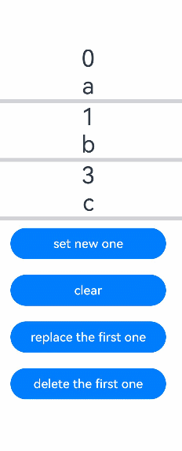
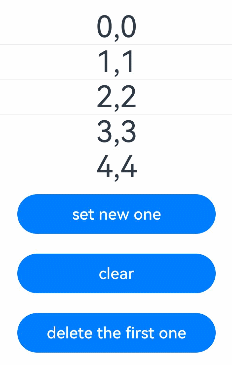
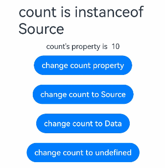

# \@Observed装饰器和\@ObjectLink装饰器：嵌套类对象属性变化
<!--Kit: ArkUI-->
<!--Subsystem: ArkUI-->
<!--Owner: @liwenzhen3-->
<!--Designer: @zhangboren-->
<!--Tester: @TerryTsao-->
<!--Adviser: @zhang_yixin13-->

上文所述的装饰器（包括[\@State](./arkts-state.md)、[\@Prop](./arkts-prop.md)、[\@Link](./arkts-link.md)、[\@Provide和\@Consume](./arkts-provide-and-consume.md)装饰器）仅能观察到第一层的变化，但是在实际应用开发中，应用会根据开发需要，封装自己的数据模型。对于多层嵌套的情况，比如二维数组、对象数组、嵌套类场景，无法观察到第二层的属性变化。因此，为了实现对嵌套数据结构中深层属性变化的观察，引入了[\@Observed](../../reference/apis-arkui/arkui-ts/ts-state-management-observed.md#observed)和[\@ObjectLink](../../reference/apis-arkui/arkui-ts/ts-state-management-objectlink.md#objectlink)装饰器。

\@Observed/\@ObjectLink适用于观察嵌套对象（对象的属性是对象）属性的变化，需要开发者对装饰器的基本观察能力有一定的了解，再来对比阅读该文档。建议提前阅读：[\@State](./arkts-state.md)的基本用法。最佳实践请参考[状态管理最佳实践](https://developer.huawei.com/consumer/cn/doc/best-practices/bpta-status-management)。常见问题请参考[状态管理常见问题](./arkts-state-management-faq.md)。

> **说明：**
>
> 从API version 9开始，这两个装饰器支持在ArkTS卡片中使用。
>
> 从API version 11开始，这两个装饰器支持在原子化服务中使用。

## 概述

\@ObjectLink和\@Observed类装饰器配合使用，可实现嵌套对象或数组的双向数据同步，使用方式如下：

- 将数组项或类属性声明为\@Observed装饰的类型，示例请参考[嵌套对象](#嵌套对象)。

- 在子组件中使用\@ObjectLink装饰的状态变量，用于接收父组件\@Observed装饰的类实例，从而建立双向数据绑定。

- API version 19之前，\@ObjectLink只能接收\@Observed装饰的类实例；API version 19及以后，\@ObjectLink也可以接收复杂类型，无\@Observed装饰的限制。但需注意，如需观察嵌套类型场景，需要其接收\@Observed装饰的类实例或[makeV1Observed](../../reference/apis-arkui/js-apis-stateManagement.md#makev1observed19)的返回值。示例请参考[二维数组](#二维数组)。

开发者如需实现单向数据同步，需要搭配\@Prop使用，示例请参考[\@Prop与\@ObjectLink的差异](#prop与objectlink的差异)。


## 装饰器说明

| \@Observed类装饰器 | 说明                                                  |
| ------------------ | ----------------------------------------------------- |
| 装饰器参数         | 无。                                                  |
| 类装饰器           | 装饰class。需要放在class的定义前，使用new创建类对象。 |

| \@ObjectLink变量装饰器 | 说明                                                         |
| ---------------------- | ------------------------------------------------------------ |
| 装饰器参数             | 无。                                                         |
| 允许装饰的变量类型     | 支持继承Date、[Array](#二维数组)的class实例。<br/>API version 11及以后支持继承[Map](#继承map类)、[Set](#继承set类)的class实例以及\@Observed装饰类和undefined或null组成的联合类型，比如ClassA \| ClassB、 ClassA \| undefined 或者 ClassA \| null, 示例请参考[@ObjectLink支持联合类型](#objectlink支持联合类型)。<br/>API version 19之前，必须为被\@Observed装饰的class实例。<br/>API version 19及以后，\@ObjectLink可以被复杂类型初始化，即class、object或built-in类型。但当观察嵌套类型时，仍需其接收\@Observed装饰的类实例或makeV1Observed的返回值。<br/>**说明：**<br/>\@ObjectLink不支持简单类型，如果开发者需要使用简单类型，可以使用[\@Prop](arkts-prop.md)。 |
| 被装饰变量的初始值     | 禁止本地初始化。                                             |

\@ObjectLink的属性可以被改变，但不允许整体赋值，即\@ObjectLink装饰的变量是只读的。


```ts
// 允许@ObjectLink装饰的数据属性赋值
this.objLink.a= ...
// 不允许@ObjectLink装饰的数据自身赋值
this.objLink= ...
```

> **说明：**
>
> \@ObjectLink装饰的变量不能被赋值，如果要使用赋值操作，请使用[@Prop](arkts-prop.md)。
>
> - \@Prop装饰的变量和数据源的关系是单向同步，\@Prop装饰的变量在本地拷贝了数据源，所以它允许本地更改，如果父组件中的数据源有更新，\@Prop装饰的变量在本地的修改将被覆盖。
>
> - \@ObjectLink装饰的变量和数据源的关系是双向同步，\@ObjectLink装饰的变量相当于指向数据源的指针。禁止对\@ObjectLink装饰的变量赋值，如果发生\@ObjectLink装饰的变量的赋值，则同步链将被打断。

## 变量的传递/访问规则说明

| \@ObjectLink传递/访问 | 说明                                                         |
| --------------------- | ------------------------------------------------------------ |
| 从父组件初始化        | 必须指定。<br/>必须使用复杂类型初始化\@ObjectLink装饰的变量，如果需要观察变化需要满足以下场景：<br/>-&nbsp;API version 19之前，类型必须为被\@Observed装饰的class实例。<br/>- API version 19及以后，\@ObjectLink可以被复杂类型初始化，即class、object或built-in类型。但当观察嵌套类型时，仍需其接收\@Observed装饰的类实例或makeV1Observed的返回值。<br/>-&nbsp;同步源的class或者数组必须是[\@State](./arkts-state.md)，[\@Link](./arkts-link.md)，[\@Provide](./arkts-provide-and-consume.md)，[\@Consume](./arkts-provide-and-consume.md)或者\@ObjectLink装饰的数据。<br/>同步源是数组项的示例请参考[对象数组](#对象数组)。初始化的class的示例请参考[嵌套对象](#嵌套对象)。 |
| 与源对象同步          | 双向。                                                       |
| 可以初始化子组件      | 允许，可用于初始化常规变量、\@State、\@Link、\@Prop、\@Provide |


  **图1** 初始化规则图示  

  


## 观察变化和行为表现

### 观察变化

API version 19之前，如果需要观察嵌套场景的变化，如嵌套类，二维数组，对象数组等，那么内层的数据类型也需要被\@Observed装饰。API version 19及以后，也可以通过使用[makeV1Observed](../../reference/apis-arkui/js-apis-stateManagement.md#makev1observed19)来使内层数据可观察。内层数据需要传递给\@ObjectLink，使其在UI上可观察。示例请参考[嵌套对象](#嵌套对象)。

\@ObjectLink接收对象时，如果对象被\@State或其他状态变量装饰器装饰，则可以观察第一层变化。示例请参考[对象类型](#对象类型)。

\@ObjectLink接收嵌套对象时，内层对象需要为被\@Observed装饰的class类型。从API version 19开始，内层对象也支持被[makeV1Observed](../../reference/apis-arkui/js-apis-stateManagement.md#makev1observed19)处理的返回值。示例请参考[嵌套对象](#嵌套对象)。

\@ObjectLink推荐设计单独的自定义组件来渲染每一个数组或对象。此时，对象数组或嵌套对象需要两个自定义组件，一个自定义组件呈现外部数组/对象，另一个自定义组件呈现嵌套在数组/对象内的类对象。可以观察到：

- 其属性的数值的变化，其中属性是指Object.keys(observedObject)返回的所有属性，示例请参考[嵌套对象](#嵌套对象)。

- 如果数据源是数组，则可以观察到数组项的替换，如果数据源是class，可观察到class的属性的变化，示例请参考[对象数组](#对象数组)。

\@ObjectLink装饰继承于Date的class时，可以观察到Date整体的赋值，同时可通过调用Date的接口`setFullYear`, `setMonth`, `setDate`, `setHours`, `setMinutes`, `setSeconds`, `setMilliseconds`, `setTime`, `setUTCFullYear`, `setUTCMonth`, `setUTCDate`, `setUTCHours`, `setUTCMinutes`, `setUTCSeconds`, `setUTCMilliseconds` 更新Date的属性。

<!-- @[Observation_ChangeInheritance](https://gitcode.com/openharmony/applications_app_samples/blob/master/code/DocsSample/ArkUISample/arktsobservedandobjectlink/entry/src/main/ets/pages/overview/ObservationChangeInheritance.ets) -->  

``` TypeScript
@Observed
class DateClass extends Date {
  constructor(args: number | string) {
    super(args);
  }
}

@Observed
class NewDate {
  public data: DateClass;

  constructor(data: DateClass) {
    this.data = data;
  }
}

@Component
struct Child {
  label: string = 'date';
  @ObjectLink data: DateClass;

  build() {
    Column() {
      // data被@Observed和@ObjectLink装饰，可以被观察到Date整体的赋值以及调用Date接口带来的变化
      Button('child increase the day by 1')
        .width(300)
        .margin(10)
        .onClick(() => {
          this.data.setDate(this.data.getDate() + 1);
        })
      DatePicker({
        start: new Date('1970-1-1'),
        end: new Date('2100-1-1'),
        selected: this.data
      })
    }
    .width('100%')
  }
}

@Entry
@Component
struct Parent {
  @State newData: NewDate = new NewDate(new DateClass('2023-1-1'));

  build() {
    Column() {
      Child({ label: 'date', data: this.newData.data })

      Button('parent update the new date')
        .width(300)
        .margin(10)
        .onClick(() => {
          this.newData.data = new DateClass('2023-07-07');
        })
      Button(`2023-08-20`)
        .width(300)
        .margin(10)
        .onClick(() => {
          this.newData = new NewDate(new DateClass('2023-08-20'));
        })
    }
    .width('100%')
  }
}
```


\@ObjectLink装饰继承于Map的class时，可以观察到Map整体的赋值，同时可通过调用Map的接口`set`, `clear`, `delete` 更新Map的值。示例请参考[继承Map类](#继承map类)。

\@ObjectLink装饰继承于Set的class时，可以观察到Set整体的赋值，同时可通过调用Set的接口`add`, `clear`, `delete` 更新Set的值。示例请参考[继承Set类](#继承set类)。


### 框架行为

1. 初始渲染：

   a. \@Observed装饰的class的实例会被代理对象包装，代理了class上的属性的setter和getter方法。

   b. 子组件中\@ObjectLink装饰的变量从父组件初始化，接收被\@Observed装饰的class的实例，\@ObjectLink的包装类会将自己注册给\@Observed class。这里的注册行为指的是，\@ObjectLink包装类会向\@Observed实例提供自身的引用，让\@Observed实例将其添加到依赖列表中，以便属性变化时能通知到它。

2. 属性更新：当\@Observed装饰的class属性改变时，会执行代理的setter和getter，然后遍历依赖它的\@ObjectLink包装类，通知数据更新。


## 限制条件

1. 使用\@Observed装饰class会改变class原始的原型链，\@Observed和其他类装饰器装饰同一个class可能会带来问题。

2. \@ObjectLink装饰器不建议在[\@Entry](./arkts-create-custom-components.md#entry)装饰的自定义组件中使用，编译时会产生告警。

3. \@ObjectLink装饰的类型必须是复杂类型，否则会有编译时报错。

4. API version 19前，\@ObjectLink装饰的变量类型必须是显式地由\@Observed装饰的类。如果未指定类型，或不是\@Observed装饰的class，编译时报错。

   API version 19及以后，\@ObjectLink也可以被[makeV1Observed](../../reference/apis-arkui/js-apis-stateManagement.md#makev1observed19)的返回值初始化，若\@ObjectLink接收的初始化值既不是\@Observed装饰的class实例，也不是makeV1Observed的返回值，则会有运行时告警日志。

   ```ts
   class Test {
     msg: number;
   
     constructor(msg: number) {
       this.msg = msg;
     }
   }
   // 错误写法，count未指定类型，编译报错
   @ObjectLink count;
   // 错误写法，Test未被@Observed装饰，编译报错
   @ObjectLink test: Test;
   ```
     
   ``` TypeScript
   @Observed
   class Info {
     public count: number;
   
     constructor(count: number) {
       this.count = count;
     }
   }
   // ...
   // 正确写法
   @ObjectLink count: Info;
   ```

5. \@ObjectLink装饰的变量不能本地初始化，仅能通过构造参数从父组件传入初始值，否则编译时会报错。

   ```ts
   // 错误写法，编译报错
   @ObjectLink count: CountInfo = new CountInfo(10);
   ```
   
   ``` TypeScript
   @Observed
   class CountInfo {
     public count: number;
   
     constructor(count: number) {
       this.count = count;
     }
   }
   // ...
   // 正确写法
   @ObjectLink count: CountInfo;
   ```

6. \@ObjectLink装饰的变量是只读的，不能被赋值，否则会有运行时报错提示Cannot set property when setter is undefined。如果需要对\@ObjectLink装饰的变量进行整体替换，可以在父组件对其进行整体替换。

   【反例】

   ```ts
   @Observed
   class Info {
     count: number;
   
     constructor(count: number) {
       this.count = count;
     }
   }
   
   @Component
   struct Child {
     @ObjectLink num: Info;
   
     build() {
       Column() {
         Text(`num的值: ${this.num.count}`)
           .onClick(() => {
             // 错误写法，@ObjectLink装饰的变量不能被赋值，运行时报错
             this.num = new Info(10);
           })
       }
     }
   }
   
   @Entry
   @Component
   struct Parent {
     @State num: Info = new Info(10);
   
     build() {
       Column() {
         Text(`count的值: ${this.num.count}`)
         Child({num: this.num})
       }
     }
   }
   ```

   【正例】

   <!-- @[variables_decorated_ObjectLink_read_only](https://gitcode.com/openharmony/applications_app_samples/blob/master/code/DocsSample/ArkUISample/arktsobservedandobjectlink/entry/src/main/ets/pages/restrictiveconditions/ReadOnlyVariable.ets) --> 
   
   ``` TypeScript
   
   @Observed
   class Info {
     public count: number;
   
     constructor(count: number) {
       this.count = count;
     }
   }
   
   @Component
   struct Child {
     @ObjectLink num: Info;
   
     build() {
       Column() {
         Text(`num value: ${this.num.count}`)
           .fontSize(20)
           .margin(10)
           .onClick(() => {
             // 正确写法，可以更改@ObjectLink装饰变量的成员属性
             this.num.count = 20;
           })
       }
       .width('100%')
     }
   }
   
   @Entry
   @Component
   struct Parent {
     @State num: Info = new Info(10);
   
     build() {
       Column() {
         Text(`count value: ${this.num.count}`)
           .fontSize(20)
           .margin(10)
         Button('click')
           .width(300)
           .margin(10)
           .onClick(() => {
             // 可以在父组件做整体替换
             this.num = new Info(30);
           })
         Child({ num: this.num })
       }
       .width('100%')
     }
   }
   ```

   

## 使用场景

### 对象类型

该场景包含built-in类型（Array、Map、Set和Date）和普通class。从API version 19开始，\@ObjectLink接收\@State传递built-in类型和普通class对象，可以观察其API调用和第一层变化，无需额外添加\@Observed装饰。因为\@State等状态变量装饰器，会给对象（外层对象）添加一层“代理”包装，其功能等同于添加\@Observed装饰。

<!-- @[State_To_Objectlink](https://gitcode.com/openharmony/applications_app_samples/blob/master/code/DocsSample/ArkUISample/arktsobservedandobjectlink/entry/src/main/ets/pages/objectLinkusagescenarios/StateToObjectlink.ets) --> 

``` TypeScript
class Book {
  public name: string;

  constructor(name: string) {
    this.name = name;
  }
}

@Component
struct BookCard {
  @ObjectLink book: Book;

  build() {
    Column() {
      Text(`BookCard: ${this.book.name}`) // 可以观察到name的变化
        .fontSize(20)
        .margin(10)
        .width(320)
        .textAlign(TextAlign.Center)

      Button('change book.name')
        .width(320)
        .margin(10)
        .onClick(() => {
          this.book.name = 'C++';
        })
    }
    .width('100%')
  }
}

@Entry
@Component
struct Index {
  @State book: Book = new Book('JS');

  build() {
    Column() {
      BookCard({ book: this.book })
    }
  }
}
```


### 嵌套对象

<!-- @[Nested_Object](https://gitcode.com/openharmony/applications_app_samples/blob/master/code/DocsSample/ArkUISample/arktsobservedandobjectlink/entry/src/main/ets/pages/objectLinkusagescenarios/NestedObject.ets) --> 

``` TypeScript
@Observed
class Book {
  public name: string;

  constructor(name: string) {
    this.name = name;
  }
}

@Observed
class Bag {
  public book: Book;

  constructor(book: Book) {
    this.book = book;
  }
}

@Component
struct BookCard {
  @ObjectLink book: Book;

  build() {
    Column() {
      Text(`BookCard: ${this.book.name}`) // 可以观察到name的变化
        .width(320)
        .margin(10)
        .textAlign(TextAlign.Center)

      Button('change book.name')
        .width(320)
        .margin(10)
        .onClick(() => {
          this.book.name = 'C++';
        })
    }
  }
}

@Entry
@Component
struct Index {
  @State bag: Bag = new Bag(new Book('JS'));

  build() {
    Column() {
      Text(`Index: ${this.bag.book.name}`) // 无法观察到name的变化
        .width(320)
        .margin(10)
        .textAlign(TextAlign.Center)

      Button('change bag.book.name')
        .width(320)
        .margin(10)
        .onClick(() => {
          this.bag.book.name = 'TS';
        })

      BookCard({ book: this.bag.book })
    }
  }
}
```



上述示例中：

- 对于Index组件内状态变量`@State bag: Bag`，`bag.book`是第一层，`bag.book.name`是第二层。因此，当点击`change bag.book.name`直接修改`this.bag.book.name`时，Index中的`Text('Index: ${this.bag.book.name}')`不会刷新，因为\@State只能观察到第一层属性变化，不能直接观察嵌套对象内部属性`name`的变化。
- 对于BookCard组件内状态变量`@ObjectLink book: Book`，`Book`被\@Observed装饰，且`book`被\@ObjectLink接收。`book.name`变化可以被`@ObjectLink`观察，因此无论是在父组件Index中点击`change bag.book.name`，还是在子组件BookCard中点击`change book.name`，BookCard中的`Text('BookCard: ${this.book.name}')`都会刷新。
- \@State负责感知外层对象`Bag`的第一层变化，`@Observed + @ObjectLink`负责感知内层对象`Book`的属性变化。

### 对象数组

对象数组是一种常用的数据结构。以下示例展示了对象数组的用法。

> **说明：**
>
> NextID是用来在[ForEach循环渲染](../rendering-control/arkts-rendering-control-foreach.md)过程中，为每个数组元素生成一个唯一且持久的键值，标识对应的组件。

<!-- @[Object_Array](https://gitcode.com/openharmony/applications_app_samples/blob/master/code/DocsSample/ArkUISample/arktsobservedandobjectlink/entry/src/main/ets/pages/objectLinkusagescenarios/ObjectArray.ets) --> 

``` TypeScript
import { hilog } from '@kit.PerformanceAnalysisKit';

const DOMAIN = 0x0001;
const TAG = 'ArkTSObservedAndObjectlink';
let nextID: number = 1;

@Observed
class Info {
  public id: number;
  public info: number;

  constructor(info: number) {
    this.id = nextID++;
    this.info = info;
  }
}

@Component
struct Child {
  // 子组件Child的@ObjectLink的类型是Info
  @ObjectLink info: Info;
  label: string = 'ViewChild';

  build() {
    Row() {
      Button(`ViewChild [${this.label}] this.info.info = ${this.info ? this.info.info : 'undefined'}`)
        .width(320)
        .margin(10)
        .onClick(() => {
          this.info.info += 1;
        })
    }
  }
}

@Entry
@Component
struct Parent {
  // Parent中有@State装饰的Info[]
  @State arrA: Info[] = [new Info(0), new Info(0)];

  build() {
    Column() {
      ForEach(this.arrA,
        (item: Info) => {
          Child({ label: `#${item.id}`, info: item })
        },
        (item: Info): string => item.id.toString()
      )
      // 使用@State装饰的数组的数组项初始化@ObjectLink，其中数组项是被@Observed装饰的Info的实例
      Child({ label: 'ViewChild this.arrA[first]', info: this.arrA[0] })
      Child({ label: 'ViewChild this.arrA[last]', info: this.arrA[this.arrA.length-1] })

      Button('ViewParent: reset array')
        .width(320)
        .margin(10)
        .onClick(() => {
          this.arrA = [new Info(0), new Info(0)];
        })
      Button('ViewParent: push')
        .width(320)
        .margin(10)
        .onClick(() => {
          this.arrA.push(new Info(0));
        })
      Button('ViewParent: shift')
        .width(320)
        .margin(10)
        .onClick(() => {
          if (this.arrA.length > 0) {
            this.arrA.shift();
          } else {
            hilog.info(DOMAIN, TAG, 'length <= 0');
          }
        })
      Button('ViewParent: item property in middle')
        .width(320)
        .margin(10)
        .onClick(() => {
          this.arrA[Math.floor(this.arrA.length / 2)].info = 10;
        })
      Button('ViewParent: item property in middle')
        .width(320)
        .margin(10)
        .onClick(() => {
          this.arrA[Math.floor(this.arrA.length / 2)] = new Info(11);
        })
    }
  }
}
```



- this.arrA[Math.floor(this.arrA.length/2)] = new Info(..) ：该状态变量的改变触发2次更新：
  1. ForEach：数组项的赋值导致[ForEach](../../reference/apis-arkui/arkui-ts/ts-rendering-control-foreach.md)的itemGenerator被修改，因此数组项被识别为有更改，ForEach的item builder将执行，创建新的Child组件实例。
  2. Child({ label: 'ViewChild this.arrA[last]', info: this.arrA[this.arrA.length-1] })：上述更改改变了数组中第二个元素，所以绑定this.arrA[1]的Child将被更新。

- this.arrA.push(new Info(0)) ： 将触发2次不同效果的更新：
  1. ForEach：新添加的Info对象对于ForEach是未知的itemGenerator，ForEach的item builder将执行，创建新的Child组件实例。
  2. Child({ label: 'ViewChild this.arrA[last]', info: this.arrA[this.arrA.length-1] })：数组的最后一项有更改，因此引起第二个Child的实例的更改。对于Child({ label: 'ViewChild this.arrA[first]', info: this.arrA[0] })，数组的更改并没有触发一个数组项更改的改变，所以第一个Child不会刷新。

- this.arrA[Math.floor(this.arrA.length/2)].info：@State无法观察到第二层的变化，但是Info被\@Observed装饰，Info的属性的变化将被\@ObjectLink观察到。


### 二维数组

使用\@Observed观察二维数组的变化。可以声明一个被\@Observed装饰的继承Array的子类。


``` TypeScript
@Observed
class ObservedArray<T> extends Array<T> {
}
```

声明一个继承自Array的类ObservedArray\<T\>，并使用new操作符创建ObservedArray\<string\>的实例，该实例可以观察到属性变化。

在下面的示例中，展示了如何利用\@Observed观察二维数组的变化。

<!-- @[Two_dimensional_array_example](https://gitcode.com/openharmony/applications_app_samples/blob/master/code/DocsSample/ArkUISample/arktsobservedandobjectlink/entry/src/main/ets/pages/objectLinkusagescenarios/TwoDimensionalArray.ets) -->  

``` TypeScript
@Observed
class ObservedArray<T> extends Array<T> {
}

@Component
struct Item {
  @ObjectLink itemArr: ObservedArray<string>;

  build() {
    Row() {
      ForEach(this.itemArr, (item: string, index: number) => {
        Text(`${index}: ${item}`)
          .fontSize(20)
          .margin(5)
          .width(120)
          .height(100)
      }, (item: string) => item)
    }
  }
}

@Entry
@Component
struct IndexPage {
  // new操作符创建的ObservedArray<string>的实例可以观察到属性变化
  @State arr: Array<ObservedArray<string>> = [
    new ObservedArray<string>('apple'),
    new ObservedArray<string>('banana'),
    new ObservedArray<string>('orange')
  ];

  build() {
    Column() {
      ForEach(this.arr, (itemArr: ObservedArray<string>) => {
        Item({ itemArr: itemArr })
      })

      Divider()

      Button('push two-dimensional array item')
        .width(300)
        .margin(10)
        .onClick(() => {
          this.arr[0].push('strawberry');
        })

      Button('push array item')
        .width(300)
        .margin(10)
        .onClick(() => {
          this.arr.push(new ObservedArray<string>('pear'));
        })

      Button('change two-dimensional array first item')
        .width(300)
        .margin(10)
        .onClick(() => {
          this.arr[0][0] = 'APPLE';
        })

      Button('change array first item')
        .width(300)
        .margin(10)
        .onClick(() => {
          this.arr[0] = new ObservedArray<string>('watermelon');
        })
    }
    .width('100%')
  }
}
```


API version 19及以后，\@ObjectLink也可以被[makeV1Observed](../../reference/apis-arkui/js-apis-stateManagement.md#makev1observed19)的返回值初始化。所以开发者如果不想额外声明继承Array的类，也可以使用makeV1Observed来达到同样的效果。

完整例子如下。

<!-- @[Complete_Example_Two_Dimensional_Array](https://gitcode.com/openharmony/applications_app_samples/blob/master/code/DocsSample/ArkUISample/arktsobservedandobjectlink/entry/src/main/ets/pages/objectLinkusagescenarios/CompleteExampleTwoDimensionalArray.ets) -->  

``` TypeScript
import { UIUtils } from '@kit.ArkUI';

@Component
struct Item {
  @ObjectLink itemArr: Array<string>;

  build() {
    Row() {
      ForEach(this.itemArr, (item: string, index: number) => {
        Text(`${index}: ${item}`)
          .width(100)
          .height(100)
      }, (item: string) => item)
    }
  }
}

@Entry
@Component
struct IndexPage {
  // 利用makeV1Observed观察二维数组的变化
  @State arr: Array<Array<string>> =
    [UIUtils.makeV1Observed(['apple']), UIUtils.makeV1Observed(['banana']), UIUtils.makeV1Observed(['orange'])];

  build() {
    Column() {
      ForEach(this.arr, (itemArr: Array<string>) => {
        Item({ itemArr: itemArr })
      })

      Divider()

      Button('push two-dimensional array item')
        .margin(10)
        .onClick(() => {
          this.arr[0].push('strawberry');
        })

      Button('push array item')
        .margin(10)
        .onClick(() => {
          this.arr.push(UIUtils.makeV1Observed(['pear']));
        })

      Button('change two-dimensional array first item')
        .margin(10)
        .onClick(() => {
          this.arr[0][0] = 'APPLE';
        })

      Button('change array first item')
        .margin(10)
        .onClick(() => {
          this.arr[0] = UIUtils.makeV1Observed(['watermelon']);
        })
    }
  }
}
```



### 继承Map类

> **说明：**
>
> 从API version 11开始，\@ObjectLink支持\@Observed装饰Map类型和继承Map类的类型。

在下面的示例中，myMap类型为MyMap\<number, string\>，点击Button改变myMap的属性，视图会随之刷新。

<!-- @[Inherit_From_Map_Class](https://gitcode.com/openharmony/applications_app_samples/blob/master/code/DocsSample/ArkUISample/arktsobservedandobjectlink/entry/src/main/ets/pages/objectLinkusagescenarios/InheritFromMapClass.ets) -->  

``` TypeScript
@Observed
class Info {
  public info: MyMap<number, string>;

  constructor(info: MyMap<number, string>) {
    this.info = info;
  }
}

@Observed
export class MyMap<K, V> extends Map<K, V> {
  public name: string;

  constructor(name?: string, args?: [K, V][]) {
    super(args);
    this.name = name ? name : 'My Map';
  }

  getName() {
    return this.name;
  }
}

@Entry
@Component
struct MapSampleNested {
  @State message: Info = new Info(new MyMap('myMap', [[0, 'a'], [1, 'b'], [3, 'c']]));

  build() {
    Row() {
      Column() {
        MapSampleNestedChild({ myMap: this.message.info })
      }
      .width('100%')
    }
    .height('100%')
  }
}

@Component
struct MapSampleNestedChild {
  @ObjectLink myMap: MyMap<number, string>;

  build() {
    Row() {
      Column() {
        ForEach(Array.from(this.myMap.entries()), (item: [number, string]) => {
          Text(`${item[0]}`).fontSize(30)
          Text(`${item[1]}`).fontSize(30)
          Divider().strokeWidth(5)
        })

        // myMap被@Observed和@ObjectLink装饰，可以被观察到Map整体的赋值以及调用Map接口带来的变化
        Button('set new one')
          .width(200)
          .margin(10)
          .onClick(() => {
            this.myMap.set(4, 'd');
          })
        Button('clear')
          .width(200)
          .margin(10)
          .onClick(() => {
            this.myMap.clear();
          })
        Button('replace the first one')
          .width(200)
          .margin(10)
          .onClick(() => {
            this.myMap.set(0, 'aa');
          })
        Button('delete the first one')
          .width(200)
          .margin(10)
          .onClick(() => {
            this.myMap.delete(0);
          })
      }
      .width('100%')
    }
    .height('100%')
  }
}
```



### 继承Set类

> **说明：**
>
> 从API version 11开始，\@ObjectLink支持\@Observed装饰Set类型和继承Set类的类型。

在下面的示例中，mySet类型为MySet\<number\>，点击Button改变mySet的属性，视图会随之刷新。

<!-- @[Inherit_From_Set_Class](https://gitcode.com/openharmony/applications_app_samples/blob/master/code/DocsSample/ArkUISample/arktsobservedandobjectlink/entry/src/main/ets/pages/objectLinkusagescenarios/InheritFromSetClass.ets) -->  

``` TypeScript
@Observed
class Info {
  public info: MySet<number>;

  constructor(info: MySet<number>) {
    this.info = info;
  }
}

@Observed
export class MySet<T> extends Set<T> {
  public name: string;

  constructor(name?: string, args?: T[]) {
    super(args);
    this.name = name ? name : 'My Set';
  }

  getName() {
    return this.name;
  }
}

@Entry
@Component
struct SetSampleNested {
  @State message: Info = new Info(new MySet('Set', [0, 1, 2, 3, 4]));

  build() {
    Row() {
      Column() {
        SetSampleNestedChild({ mySet: this.message.info })
      }
      .width('100%')
    }
    .height('100%')
  }
}

@Component
struct SetSampleNestedChild {
  @ObjectLink mySet: MySet<number>;

  build() {
    Row() {
      Column() {
        ForEach(Array.from(this.mySet.entries()), (item: [number, number]) => {
          Text(`${item}`).fontSize(30)
          Divider()
        })
        // mySet被@Observed和@ObjectLink装饰，可以被观察到Set整体的赋值以及调用Set接口带来的变化
        Button('set new one')
          .width(200)
          .margin(10)
          .onClick(() => {
            this.mySet.add(5);
          })
        Button('clear')
          .width(200)
          .margin(10)
          .onClick(() => {
            this.mySet.clear();
          })
        Button('delete the first one')
          .width(200)
          .margin(10)
          .onClick(() => {
            this.mySet.delete(0);
          })
      }
      .width('100%')
    }
    .height('100%')
  }
}
```



### \@ObjectLink支持联合类型

\@ObjectLink支持\@Observed装饰类和undefined或null组成的联合类型，在下面的示例中，count类型为Source | Data | undefined，点击父组件Parent中的Button改变count的属性或者类型，Child组件中对应的Text组件刷新。

<!-- @[ObjectLink_Supports_Union_Types](https://gitcode.com/openharmony/applications_app_samples/blob/master/code/DocsSample/ArkUISample/arktsobservedandobjectlink/entry/src/main/ets/pages/objectLinkusagescenarios/ObjectLinkSupportsUnionTypes.ets) --> 

``` TypeScript
import { hilog } from '@kit.PerformanceAnalysisKit';

const DOMAIN = 0x0001;
const TAG = 'ArkTSObservedAndObjectlink';

@Observed
class Source {
  public source: number;

  constructor(source: number) {
    this.source = source;
  }
}

@Observed
class Data {
  public data: number;

  constructor(data: number) {
    this.data = data;
  }
}

@Entry
@Component
struct Parent {
  @State count: Source | Data | undefined = new Source(10);

  build() {
    Column() {
      Child({ count: this.count })

      Button('change count property')
        .margin(10)
        .onClick(() => {
          // 判断count的类型，做属性的更新
          if (this.count instanceof Source) {
            this.count.source += 1;
          } else if (this.count instanceof Data) {
            this.count.data += 1;
          } else {
            hilog.info(DOMAIN, TAG, `count is undefined, cannot change property`);
          }
        })

      Button('change count to Source')
        .margin(10)
        .onClick(() => {
          // 赋值为Source的实例
          this.count = new Source(100);
        })

      Button('change count to Data')
        .margin(10)
        .onClick(() => {
          // 赋值为Data的实例
          this.count = new Data(100);
        })

      Button('change count to undefined')
        .margin(10)
        .onClick(() => {
          // 赋值为undefined
          this.count = undefined;
        })
    }.width('100%')
  }
}

@Component
struct Child {
  @ObjectLink count: Source | Data | undefined;

  build() {
    Column() {
      Text(`count is instanceof ${this.count instanceof Source ? 'Source' :
        this.count instanceof Data ? 'Data' : 'undefined'}`)
        .fontSize(30)
        .margin(10)

      Text(`count's property is  ${this.count instanceof Source ? this.count.source : this.count?.data}`).fontSize(15)

    }.width('100%')
  }
}
```



## 常见问题

### 基础嵌套对象属性更改失效

在应用开发中，有很多嵌套对象场景，例如，开发者更新了某个属性，但UI没有进行对应的更新。

每个装饰器都有观察能力，但并非所有的改变都可以被观察到，只有可以被观察到的变化才会触发UI更新。\@Observed装饰器可以观察到嵌套对象的属性变化，其他装饰器仅能观察到第一层的变化。

【反例】

下面的例子中，一些UI组件并不会更新。


```ts
class Parent {
  parentId: number;

  constructor(parentId: number) {
    this.parentId = parentId;
  }

  getParentId(): number {
    return this.parentId;
  }

  setParentId(parentId: number): void {
    this.parentId = parentId;
  }
}

class Child {
  childId: number;

  constructor(childId: number) {
    this.childId = childId;
  }

  getChildId(): number {
    return this.childId;
  }

  setChildId(childId: number): void {
    this.childId = childId;
  }
}

class Cousin extends Parent {
  cousinId: number = 47;
  child: Child;

  constructor(parentId: number, cousinId: number, childId: number) {
    super(parentId);
    this.cousinId = cousinId;
    this.child = new Child(childId);
  }

  getCousinId(): number {
    return this.cousinId;
  }

  setCousinId(cousinId: number): void {
    this.cousinId = cousinId;
  }

  getChild(): number {
    return this.child.getChildId();
  }

  setChild(childId: number): void {
    this.child.setChildId(childId);
  }
}

@Entry
@Component
struct MyView {
  @State cousin: Cousin = new Cousin(10, 20, 30);

  build() {
    Column({ space: 10 }) {
      Text(`parentId: ${this.cousin.parentId}`)
      Button('Change Parent.parent')
        .onClick(() => {
          this.cousin.parentId += 1;
        })

      Text(`cousinId: ${this.cousin.cousinId}`)
      Button('Change Cousin.cousinId')
        .onClick(() => {
          this.cousin.cousinId += 1;
        })

      Text(`childId: ${this.cousin.child.childId}`)
      Button('Change Cousin.Child.childId')
        .onClick(() => {
          // 点击时上面的Text组件不会刷新
          this.cousin.child.childId += 1;
        })
    }
  }
}
```

- 最后一个Text组件Text(`childId: ${this.cousin.child.childId}`)，当点击该组件时UI不会刷新。 因为，\@State cousin : Cousin 只能观察到this.cousin属性的变化，比如this.cousin.parentId, this.cousin.cousinId 和this.cousin.child的变化，但是无法观察嵌套在属性中的属性，即this.cousin.child.childId（属性childId是内嵌在cousin中的对象Child的属性）。

- 为了观察到嵌套于内部的Child的属性，需要做如下改变：
  - 构造一个子组件，用于单独渲染Child的实例。 该子组件可以使用\@ObjectLink child : Child或\@Prop child : Child。通常会使用\@ObjectLink，除非子组件需要对其Child对象进行本地修改。
  - 嵌套的Child必须用\@Observed装饰。当在Cousin中创建Child对象时（本示例中的Cousin(10, 20, 30）)，它将被包装在ES6代理中，当Child属性更改时（this.cousin.child.childId += 1），该代码将修改通知到\@ObjectLink变量。

【正例】

以下示例使用\@Observed/\@ObjectLink来观察嵌套对象的属性更改。


<!-- @[Basic_nesting](https://gitcode.com/openharmony/applications_app_samples/blob/master/code/DocsSample/ArkUISample/arktsobservedandobjectlink/entry/src/main/ets/pages/ObservedAndObjectLinkFAQs/BasicNesting.ets) --> 

``` TypeScript
class Parent {
  public parentId: number;

  constructor(parentId: number) {
    this.parentId = parentId;
  }

  getParentId(): number {
    return this.parentId;
  }

  setParentId(parentId: number): void {
    this.parentId = parentId;
  }
}

@Observed
class Child {
  public childId: number;

  constructor(childId: number) {
    this.childId = childId;
  }

  getChildId(): number {
    return this.childId;
  }

  setChildId(childId: number): void {
    this.childId = childId;
  }
}

class Cousin extends Parent {
  public cousinId: number = 47;
  public child: Child;

  constructor(parentId: number, cousinId: number, childId: number) {
    super(parentId);
    this.cousinId = cousinId;
    this.child = new Child(childId);
  }

  getCousinId(): number {
    return this.cousinId;
  }

  setCousinId(cousinId: number): void {
    this.cousinId = cousinId;
  }

  getChild(): number {
    return this.child.getChildId();
  }

  setChild(childId: number): void {
    this.child.setChildId(childId);
  }
}

@Component
struct ViewChild {
  @ObjectLink child: Child;

  build() {
    Column({ space: 10 }) {
      Text(`childId: ${this.child.getChildId()}`)
        .fontSize(20)
        .margin(10)
      Button('Change childId')
        .width(300)
        .margin(10)
        .onClick(() => {
          this.child.setChildId(this.child.getChildId() + 1);
        })
    }
    .width('100%')
  }
}

@Entry
@Component
struct MyView {
  @State cousin: Cousin = new Cousin(10, 20, 30);

  build() {
    Column({ space: 10 }) {
      Text(`parentId: ${this.cousin.parentId}`)
        .fontSize(20)
        .margin(10)
      Button('Change Parent.parentId')
        .width(300)
        .margin(10)
        .onClick(() => {
          this.cousin.parentId += 1;
        })

      Text(`cousinId: ${this.cousin.cousinId}`)
        .fontSize(20)
        .margin(10)
      Button('Change Cousin.cousinId')
        .width(300)
        .margin(10)
        .onClick(() => {
          this.cousin.cousinId += 1;
        })

      ViewChild({ child: this.cousin.child }) // Text(`childId: ${this.cousin.child.childId}`)的替代写法
      Button('Change Cousin.Child.childId')
        .width(300)
        .margin(10)
        .onClick(() => {
          this.cousin.child.childId += 1;
        })
    }
    .width('100%')
  }
}
```


### 复杂嵌套对象属性更改失效

【反例】

以下示例创建了一个带有\@ObjectLink装饰变量的子组件，用于渲染一个含有嵌套属性的ParentCounter，用\@Observed装饰嵌套在ParentCounter中的SubCounter。


```ts
let nextId = 1;
@Observed
class SubCounter {
  counter: number;
  constructor(c: number) {
    this.counter = c;
  }
}
@Observed
class ParentCounter {
  id: number;
  counter: number;
  subCounter: SubCounter;
  incrCounter() {
    this.counter++;
  }
  incrSubCounter(c: number) {
    this.subCounter.counter += c;
  }
  setSubCounter(c: number): void {
    this.subCounter.counter = c;
  }
  constructor(c: number) {
    this.id = nextId++;
    this.counter = c;
    this.subCounter = new SubCounter(c);
  }
}
@Component
struct CounterComp {
  @ObjectLink value: ParentCounter;
  build() {
    Column({ space: 10 }) {
      Text(`${this.value.counter}`)
        .fontSize(25)
        .onClick(() => {
          this.value.incrCounter();
        })
      Text(`${this.value.subCounter.counter}`)
        .onClick(() => {
          this.value.incrSubCounter(1);
        })
      Divider().height(2)
    }
  }
}
@Entry
@Component
struct ParentComp {
  @State counter: ParentCounter[] = [new ParentCounter(1), new ParentCounter(2), new ParentCounter(3)];
  build() {
    Row() {
      Column() {
        CounterComp({ value: this.counter[0] })
        CounterComp({ value: this.counter[1] })
        CounterComp({ value: this.counter[2] })
        Divider().height(5)
        ForEach(this.counter,
          (item: ParentCounter) => {
            CounterComp({ value: item })
          },
          (item: ParentCounter) => item.id.toString()
        )
        Divider().height(5)
        // 第一个点击事件
        Text('Parent: incr counter[0].counter')
          .fontSize(20).height(50)
          .onClick(() => {
            this.counter[0].incrCounter();
            // 每次触发时自增10
            this.counter[0].incrSubCounter(10);
          })
        // 第二个点击事件
        Text('Parent: set.counter to 10')
          .fontSize(20).height(50)
          .onClick(() => {
            // 无法将value设置为10，UI不会刷新
            this.counter[0].setSubCounter(10);
          })
        Text('Parent: reset entire counter')
          .fontSize(20).height(50)
          .onClick(() => {
            this.counter = [new ParentCounter(1), new ParentCounter(2), new ParentCounter(3)];
          })
      }
    }
  }
}
```

对于Text('Parent: incr counter[0].counter')的onClick事件，this.counter[0].incrSubCounter(10)调用incrSubCounter方法使SubCounter的counter值增加10，UI同步刷新。

然而，在Text('Parent: set.counter to 10')的onClick中调用this.counter[0].setSubCounter(10)时，SubCounter的counter值无法重置为10。

incrSubCounter和setSubCounter都是同一个SubCounter的函数。在第一个点击处理时调用incrSubCounter可以正确更新UI，而第二个点击处理调用setSubCounter时却没有更新UI。实际上incrSubCounter和setSubCounter两个函数都不能触发Text('${this.value.subCounter.counter}')的更新，因为\@ObjectLink value : ParentCounter仅能观察其代理ParentCounter的属性，对于this.value.subCounter.counter是SubCounter的属性，无法观察到嵌套类的属性。

另外，第一个click事件调用this.counter[0].incrCounter()将CounterComp自定义组件中的\@ObjectLink value: ParentCounter标记为已更改，会触发Text('${this.value.subCounter.counter}')的更新。如果在第一个点击事件中删除this.counter[0].incrCounter()，则无法更新UI。

【正例】

对于上述问题，为了直接观察SubCounter中的属性，以便this.counter[0].setSubCounter(10)操作有效，可以利用下面的方法：


<!-- @[Complex_Methods_Nesting](https://gitcode.com/openharmony/applications_app_samples/blob/master/code/DocsSample/ArkUISample/arktsobservedandobjectlink/entry/src/main/ets/pages/ObservedAndObjectLinkFAQs/ComplexMethodsNesting.ets) --> 

``` TypeScript
let nextId = 1;

@Observed
class SubCounter {
  public counter: number;

  constructor(c: number) {
    this.counter = c;
  }
}

@Observed
class ParentCounter {
  public id: number;
  public counter: number;
  public subCounter: SubCounter;

  incrCounter() {
    this.counter++;
  }

  incrSubCounter(c: number) {
    this.subCounter.counter += c;
  }

  setSubCounter(c: number): void {
    this.subCounter.counter = c;
  }

  constructor(c: number) {
    this.id = nextId++;
    this.counter = c;
    this.subCounter = new SubCounter(c);
  }
}


@Entry
@Component
struct ParentComp {
  @State counter: ParentCounter[] = [new ParentCounter(1), new ParentCounter(2), new ParentCounter(3)];
  build() {
    Row() {
        CounterComp({ value: this.counter[0] }) // ParentComp组件传递 ParentCounter 给 CounterComp 组件
    }
  }
}

@Component
struct CounterComp {
  @ObjectLink value: ParentCounter; // @ObjectLink 接收 ParentCounter
  build() {
      // CounterChild 是 CounterComp 的子组件，CounterComp 传递 this.value.subCounter 给 CounterChild 组件
      CounterChild({ subValue: this.value.subCounter })
  }
}

@Component
struct CounterChild {
  @ObjectLink subValue: SubCounter; // @ObjectLink 接收 SubCounter
  build() {
    Text(`${this.subValue.counter}`)
      .fontSize(20)
      .margin(10)
      .onClick(() => {
        this.subValue.counter += 1;
      })
  }
}
```


该方法使得\@ObjectLink分别代理了ParentCounter和SubCounter的属性，这样对于这两个类的属性的变化都可以观察到，即都会对UI视图进行刷新。即使删除了上面所说的this.counter[0].incrCounter()，UI也会进行正确的刷新。

该方法可用于实现“两个层级”的观察，即外部对象和内部嵌套对象的观察。但是该方法只能用于\@ObjectLink装饰器，无法作用于\@Prop（\@Prop通过深拷贝传入对象）。详情参考[@Prop与@ObjectLink的差异](#prop与objectlink的差异)。


<!-- @[Complex_nested_observation_levels](https://gitcode.com/openharmony/applications_app_samples/blob/master/code/DocsSample/ArkUISample/arktsobservedandobjectlink/entry/src/main/ets/pages/ObservedAndObjectLinkFAQs/ComplexNestingComplete.ets) -->  

``` TypeScript
let nextId = 1;

@Observed
class SubCounter {
  public counter: number;

  constructor(c: number) {
    this.counter = c;
  }
}

@Observed
class ParentCounter {
  public id: number;
  public counter: number;
  public subCounter: SubCounter;

  incrCounter() {
    this.counter++;
  }

  incrSubCounter(c: number) {
    this.subCounter.counter += c;
  }

  setSubCounter(c: number): void {
    this.subCounter.counter = c;
  }

  constructor(c: number) {
    this.id = nextId++;
    this.counter = c;
    this.subCounter = new SubCounter(c);
  }
}

@Component
struct CounterComp {
  @ObjectLink value: ParentCounter;

  build() {
    Column({ space: 10 }) {
      Text(`${this.value.counter}`)
        .fontSize(25)
        .onClick(() => {
          this.value.incrCounter();
        })
      CounterChild({ subValue: this.value.subCounter })
      Divider().height(2)
    }
    .width('100%')
  }
}

@Component
struct CounterChild {
  @ObjectLink subValue: SubCounter;

  build() {
    Text(`${this.subValue.counter}`)
      .fontSize(20)
      .onClick(() => {
        this.subValue.counter += 1;
      })
  }
}

@Entry
@Component
struct ParentComp {
  // @ObjectLink分别代理了ParentCounter和SubCounter的属性，这两个类的属性的变化都可以观察到
  @State counter: ParentCounter[] = [new ParentCounter(1), new ParentCounter(2), new ParentCounter(3)];

  build() {
    Row() {
      Column() {
        CounterComp({ value: this.counter[0] })
        CounterComp({ value: this.counter[1] })
        CounterComp({ value: this.counter[2] })
        Divider().height(5)
        ForEach(this.counter,
          (item: ParentCounter) => {
            CounterComp({ value: item })
          },
          (item: ParentCounter) => item.id.toString()
        )
        Divider().height(5)
        Text('Parent: reset entire counter')
          .fontSize(20)
          .margin(5)
          .height(50)
          .onClick(() => {
            this.counter = [new ParentCounter(1), new ParentCounter(2), new ParentCounter(3)];
          })
        Text('Parent: incr counter[0].counter')
          .fontSize(20)
          .margin(5)
          .height(50)
          .onClick(() => {
            this.counter[0].incrCounter();
            this.counter[0].incrSubCounter(10);
          })
        Text('Parent: set.counter to 10')
          .fontSize(20)
          .margin(5)
          .height(50)
          .onClick(() => {
            this.counter[0].setSubCounter(10);
          })
      }
      .width('100%')
    }
  }
}
```


### \@Prop与\@ObjectLink的差异

\@Prop和\@ObjectLink都可以接收\@Observed装饰的类对象实例。\@Prop对对象进行深拷贝，修改深拷贝后的对象不会影响原对象及其关联的组件。\@ObjectLink获取对象的引用，修改引用对象会影响原对象及其关联的组件。

下面的例子中，`UserChild`组件同时使用\@Prop与\@ObjectLink接收了来自父组件的\@Observed装饰的类对象实例作为数据源。对该数据源对象的修改将同时影响\@Prop与\@ObjectLink装饰的变量。依次点击`change @ObjectLink value`按钮和`change @Prop value`按钮可以观察到：

1. 修改\@ObjectLink装饰的对象内容将影响数据源对象，并重新同步给\@Prop，因此两个Text组件都将刷新。
2. 修改\@Prop装饰的对象内容仅影响使用该对象的Text2组件，不会影响数据源对象。

<!-- @[Differences_Prop_ObjectLink](https://gitcode.com/openharmony/applications_app_samples/blob/master/code/DocsSample/ArkUISample/arktsobservedandobjectlink/entry/src/main/ets/pages/ObservedAndObjectLinkFAQs/DifferencesPropObjectLink.ets) --> 

``` TypeScript
let nextId = 0;

@Observed
class User {
  public id: number;

  constructor() {
    this.id = nextId++;
  }
}

@Entry
@Component
struct Index {
  @State users: User[] = [new User(), new User(), new User()];

  build() {
    Column() {
      UserChild({ firstUserByObjectLink: this.users[0], firstUserByProp: this.users[0] })
    }
    .width('100%')
  }
}

@Component
struct UserChild {
  @ObjectLink firstUserByObjectLink: User;
  @Prop firstUserByProp: User;

  build() {
    Column() {
      // 比较结果为false说明@Prop经过深拷贝后得到的对象与原对象已不是同一个对象
      Text(`firstUserByObjectLink equals firstUserByProp? : ${this.firstUserByObjectLink === this.firstUserByProp}`)
        .fontSize(20)
        .margin(10)
      Text(`UserChild firstUserByObjectLink.id: ${this.firstUserByObjectLink.id}`) // Text1
        .fontSize(20)
        .margin(10)
      Text(`UserChild firstUserByProp.id: ${this.firstUserByProp.id}`) // Text2
        .fontSize(20)
        .margin(10)
      Button('change @ObjectLink value')
        .width(300)
        .margin(10)
        .onClick(() => {
          this.firstUserByObjectLink.id++;
        })
      Button('change @Prop value')
        .width(300)
        .margin(10)
        .onClick(() => {
          this.firstUserByProp.id++;
        })
    }
    .width('100%')
  }
}
```


上面的示例关系如图所示：


### 在\@Observed装饰类的构造函数中延时更改成员变量

在状态管理中，使用\@Observed装饰类后，会给该类使用一层“代理”进行包装。当在组件中改变该类的成员变量时，会被该代理进行拦截，在更改数据源中值的同时，也会将变化通知给绑定的组件，从而实现观测变化与触发刷新。

当开发者在类的构造函数中对成员变量进行赋值或者修改时，此修改不会经过代理（因为是直接对数据源中的值进行修改），也就无法被观测到。所以，如果开发者在类的构造函数中使用定时器修改类中的成员变量，即使该修改成功执行了，也不会触发UI的刷新。

【反例】

```ts
@Observed
class RenderClass {
  waitToRender: boolean = false;

  constructor() {
    setTimeout(() => {
      this.waitToRender = true;
      console.info('更改waitToRender的值为：' + this.waitToRender);
    }, 1000)
  }
}

@Entry
@Component
struct Index {
  @State @Watch('renderClassChange') renderClass: RenderClass = new RenderClass();
  @State textColor: Color = Color.Black;

  renderClassChange() {
    console.info('renderClass的值被更改为：' + this.renderClass.waitToRender);
  }

  build() {
    Row() {
      Column() {
        Text('renderClass的值为：' + this.renderClass.waitToRender)
          .fontSize(20)
          .fontColor(this.textColor)
        Button('Show')
          .onClick(() => {
            // 使用其他状态变量强行刷新UI的做法并不推荐，此处仅用来检测waitToRender的值是否更新
            this.textColor = Color.Red;
          })
      }
      .width('100%')
    }
    .height('100%')
  }
}
```

上文的示例代码中在RenderClass的构造函数中使用定时器在1秒后修改了waitToRender的值，但是不会触发UI的刷新。此时，点击按钮强行刷新Text组件，可以看到waitToRender的值已经被修改成了true。

【正例】

<!-- @[Delayed_change](https://gitcode.com/openharmony/applications_app_samples/blob/master/code/DocsSample/ArkUISample/arktsobservedandobjectlink/entry/src/main/ets/pages/ObservedAndObjectLinkFAQs/DelayedChange.ets) --> 

``` TypeScript
import { hilog } from '@kit.PerformanceAnalysisKit';

const DOMAIN = 0x0001;
const TAG = 'ArkTSObservedAndObjectlink';

@Observed
class RenderClass {
  public waitToRender: boolean = false;

  constructor() {
  }
}

@Entry
@Component
struct DelayedChangeIndex {
  @State @Watch('renderClassChange') renderClass: RenderClass = new RenderClass();

  renderClassChange() {
    hilog.info(DOMAIN, TAG, `The value of renderClass is changed to: ${this.renderClass.waitToRender}`);
  }

  onPageShow() {
    setTimeout(() => {
      this.renderClass.waitToRender = true;
    }, 1000);
  }

  build() {
    Row() {
      Column() {
        Text(`The value of renderClass is: ${this.renderClass.waitToRender}`)
          .fontSize(20)
      }
      .width('100%')
    }
    .height('100%')
  }
}
```


上文的示例代码将定时器修改移入到组件内，此时界面显示时会先显示“The value of renderClass is: false”。待定时器触发时，renderClass的值改变，触发[@Watch](./arkts-watch.md)回调，此时界面刷新显示“The value of renderClass is: true”，日志输出“The value of renderClass is changed to: true”。

因此，更推荐开发者在组件中对\@Observed装饰的类成员变量进行修改，以实现刷新。

### \@ObjectLink数据源更新时机

<!-- @[ObjectLink_Data_source_update_timing](https://gitcode.com/openharmony/applications_app_samples/blob/master/code/DocsSample/ArkUISample/arktsobservedandobjectlink/entry/src/main/ets/pages/ObservedAndObjectLinkFAQs/ObjectLinkDataSourceUpdate.ets) --> 

``` TypeScript
import { hilog } from '@kit.PerformanceAnalysisKit';

const DOMAIN = 0x0001;
const TAG = 'ArkTSObservedAndObjectlink';

@Observed
class Person {
  public name: string = '';
  public age: number = 0;

  constructor(name: string, age: number) {
    this.name = name;
    this.age = age;
  }
}

@Observed
class Info {
  public person: Person;

  constructor(person: Person) {
    this.person = person;
  }
}

@Entry
@Component
struct Parent {
  @State @Watch('onChange01') info: Info =
    new Info(
      new Person('Bob', 10)
    );

  onChange01() {
    hilog.info(DOMAIN, TAG, `:::onChange01: + ${this.info.person.name}`); // 2
  }

  build() {
    Column() {
      Text(this.info.person.name)
        .fontSize(20)
        .margin(10)
        .height(40)
      Child({
        per: this.info.person, clickEvent: () => {
          hilog.info(DOMAIN, TAG, `:::clickEvent before ${this.info.person.name}`); // 1
          this.info.person = new Person('Jack', 12);
          hilog.info(DOMAIN, TAG, `:::clickEvent after ${this.info.person.name}`); // 3
        }
      })
    }
    .width('100%')
  }
}

@Component
struct Child {
  @ObjectLink @Watch('onChange02') per: Person;
  clickEvent?: () => void;

  onChange02() {
    hilog.info(DOMAIN, TAG, `:::onChange02:${this.per.name}`); // 5
  }

  build() {
    Column() {
      Button(this.per.name)
        .width(300)
        .margin(10)
        .height(40)
        .onClick(() => {
          this.onClickType();
        })
    }
    .width('100%')
  }

  private onClickType() {
    if (this.clickEvent) {
      this.clickEvent();
    }
    hilog.info(DOMAIN, TAG, `:::--------this.per.name in Child is still: ${this.per.name}`); // 4
  };
}
```


\@ObjectLink的数据源更新依赖其父组件，当父组件中数据源改变引起父组件刷新时，会重新设置子组件\@ObjectLink的数据源。这个过程不是在父组件数据源变化后立刻发生的，而是在父组件实际刷新时才会进行。上述示例中，Parent包含Child，Parent传递箭头函数给Child，在点击时，日志打印顺序是1-2-3-4-5，打印到日志4时，点击事件流程结束，此时仅仅是将子组件Child标记为需要父组件更新的节点，因此日志4打印的this.per.name的值仍为Bob，等到父组件真正更新时，才会更新Child的数据源。

当@ObjectLink @Watch('onChange02') per: Person的\@Watch函数执行时，说明\@ObjectLink的数据源已被父组件更新，此时日志5打印的值为更新后的Jack。

日志的含义为：

- 日志1：对Parent @State @Watch('onChange01') info: Info = new Info(new Person('Bob', 10)) 赋值前。

- 日志2：对Parent @State @Watch('onChange01') info: Info = new Info(new Person('Bob', 10)) 赋值，执行其\@Watch函数，同步执行。

- 日志3：对Parent @State @Watch('onChange01') info: Info = new Info(new Person('Bob', 10)) 赋值完成。

- 日志4：onClickType方法内clickEvent执行完，此时只是将子组件Child标记为需要父组件更新的节点，未将最新的值更新给Child @ObjectLink @Watch('onChange02') per: Person，所以日志4打印的this.per.name的值仍然是Bob。

- 日志5：下一次vsync信号触发Child更新，@ObjectLink @Watch('onChange02') per: Person被更新，触发其\@Watch方法，此时@ObjectLink @Watch('onChange02') per: Person为新值Jack。

\@Prop父子同步原理与\@ObjectLink一致。

当clickEvent中更改this.info.person.name时，修改会立刻生效，此时日志4打印的值是Jack。

<!-- @[ClickEvent_Jack](https://gitcode.com/openharmony/applications_app_samples/blob/master/code/DocsSample/ArkUISample/arktsobservedandobjectlink/entry/src/main/ets/pages/ObservedAndObjectLinkFAQs/ClickEventJack.ets) --> 

``` TypeScript
Child({
  per: this.info.person, clickEvent: () => {
    hilog.info(DOMAIN, TAG, `:::clickEvent before ${this.info.person.name}`); // 1
    this.info.person.name = 'Jack';
    hilog.info(DOMAIN, TAG, `:::clickEvent after ${this.info.person.name}`); // 3
  }
})
```

此时Parent中Text组件不会刷新，因为this.info.person.name属于两层嵌套。

### @Observed装饰的类，在构造函数中使用this赋值属性，不触发UI更新

@Observed类的构造函数中对成员变量进行赋值或者修改时，此修改不会经过代理，无法被观测到。

【反例】

```ts
@Observed
class DataDownloader {
  state: number;
  constructor() {
    this.state = 0;
    setInterval(() => {
      // 从构造函数修改成员变量，不触发UI更新
      this.state += 1;
    }, 2000);
  }
}

@Entry
@Component
struct Index {
  @State dataDownloader: DataDownloader = new DataDownloader();
  build() {
    Column() {
      Text(`Download state is ${this.dataDownloader.state}`)
    }
  }
}
```

【正例】

<!-- @[Change_Property_In_Constructor](https://gitcode.com/openharmony/applications_app_samples/blob/master/code/DocsSample/ArkUISample/arktsobservedandobjectlink/entry/src/main/ets/pages/ObservedAndObjectLinkFAQs/ChangePropertyInConstructor.ets) --> 

``` TypeScript
@Observed
class DataDownloader {
  public state: number;
  private intervalId: number = -1;

  constructor() {
    this.state = 0;
  }

  startIntervalUpdate() {
    this.intervalId = setInterval(() => {
      this.state += 1;
    }, 2000);
  }

  stopIntervalUpdate() {
    clearInterval(this.intervalId);
  }
}

@Entry
@Component
struct Index {
  @State dataDownloader: DataDownloader = new DataDownloader();

  aboutToAppear() {
    this.dataDownloader.startIntervalUpdate(); // @Observed装饰的类构建后再修改属性可以触发更新UI
  }

  build() {
    Column() {
      Text(`Download state is ${this.dataDownloader.state}`)
    }
  }
}
```


### LazyForEach和@ObjectLink一起使用时，替换数组数据后UI不刷新

@Observed装饰的类的数组，用[LazyForEach](../rendering-control/arkts-rendering-control-lazyforeach.md)展开显示的时候，可能会出现替换数组数据后，修改数组数据不刷新UI的问题。改变数组数据后，需要调用`onDataChange`通知LazyForEach组件重新绑定状态变量，否则就会出现上述问题。

【反例】

```ts
// LazyForEach遍历数据基类
class BasicDataSource implements IDataSource {
  private listeners: DataChangeListener[] = [];
  private originDataArray: StringData[] = [];

  public totalCount(): number {
    return this.originDataArray.length;
  }

  public getData(index: number): StringData {
    return this.originDataArray[index];
  }

  registerDataChangeListener(listener: DataChangeListener): void {
    if (this.listeners.indexOf(listener) < 0) {
      console.info('add listener');
      this.listeners.push(listener);
    }
  }

  unregisterDataChangeListener(listener: DataChangeListener): void {
    const pos = this.listeners.indexOf(listener);
    if (pos >= 0) {
      console.info('remove listener');
      this.listeners.splice(pos, 1);
    }
  }

  notifyDataAdd(index: number): void {
    this.listeners.forEach(listener => {
      listener.onDataAdd(index);
    });
  }
}

// LazyForEach遍历数据类型
class MyDataSource extends BasicDataSource {
  public dataArray: StringData[] = [];

  public totalCount(): number {
    return this.dataArray.length;
  }

  public getData(index: number): StringData {
    return this.dataArray[index];
  }

  public pushData(data: StringData): void {
    this.dataArray.push(data);
    this.notifyDataAdd(this.dataArray.length - 1);
  }
}

@Observed
class StringData {
  message: string;

  constructor(message: string) {
    this.message = message;
  }
}

@Entry
@Component
struct MyComponent {
  private data: MyDataSource = new MyDataSource();
  helloCount: number = 4;

  aboutToAppear() {
    for (let i = 0; i <= 3; i++) {
      this.data.pushData(new StringData(`Hello ${i}`));
    }
  }

  build() {
    Column() {
      List({ space: 3 }) {
        // 使用LazyForEach懒加载遍历数据
        LazyForEach(this.data, (item: StringData, index: number) => {
          ListItem() {
            ChildComponent({ data: item })
          }
        }, (item: StringData, index: number) => index.toString() + item.message)
      }.cachedCount(3)
      Button('替换第一个元素')
        .onClick(() => {
          // 替换数组元素不刷新UI，此时新替换的值还未绑定到LazyForEach组件上。
          this.data.dataArray[0] = new StringData('Hello ' + this.helloCount++)
        })
      Button('修改第一个元素的数据')
        .onClick(() => {
          // 替换数组元素后修改元素值也不会刷新UI。
          this.data.dataArray[0].message += '1';
        })
    }
  }
}

// 使用@Reusable实现组件复用
@Reusable
@Component
struct ChildComponent {
  // 使用@ObjectLink接收@Observed装饰的类的数据
  @ObjectLink data: StringData;

  aboutToAppear(): void {
    console.info(`aboutToAppear: ${this.data.message}`);
  }

  aboutToRecycle(): void {
    console.info(`aboutToRecycle: ${this.data.message}`);
  }

  // 对复用的组件进行数据更新
  aboutToReuse(params: Record<string, ESObject>): void {
    this.data.message = (params.data as StringData).message;
    console.info(`aboutToReuse: ${this.data.message}`);
  }

  build() {
    Row() {
      Text(this.data.message)
        .fontSize(50)
        .onAppear(() => {
          console.info(`appear: ${this.data.message}`);
        })
    }.margin({ left: 10, right: 10 })
  }
}
```

【正例】

<!-- @[Use_With_LazyForEach](https://gitcode.com/openharmony/applications_app_samples/blob/master/code/DocsSample/ArkUISample/arktsobservedandobjectlink/entry/src/main/ets/pages/ObservedAndObjectLinkFAQs/UseWithLazyForEach.ets) --> 

``` TypeScript
// LazyForEach遍历数据基类
class BasicDataSource implements IDataSource {
  private listeners: DataChangeListener[] = [];
  private originDataArray: StringData[] = [];

  public totalCount(): number {
    return this.originDataArray.length;
  }

  public getData(index: number): StringData {
    return this.originDataArray[index];
  }

  registerDataChangeListener(listener: DataChangeListener): void {
    if (this.listeners.indexOf(listener) < 0) {
      console.info('add listener');
      this.listeners.push(listener);
    }
  }

  unregisterDataChangeListener(listener: DataChangeListener): void {
    const pos = this.listeners.indexOf(listener);
    if (pos >= 0) {
      console.info('remove listener');
      this.listeners.splice(pos, 1);
    }
  }

  notifyDataAdd(index: number): void {
    this.listeners.forEach(listener => {
      listener.onDataAdd(index);
    });
  }

  // 通知LazyForEach处理数据替换
  notifyDataChanged(index: number): void {
    this.listeners.forEach(listener => {
      listener.onDataChange(index);
    })
  }
}

// LazyForEach遍历数据类型
class MyDataSource extends BasicDataSource {
  public dataArray: StringData[] = [];

  public totalCount(): number {
    return this.dataArray.length;
  }

  public getData(index: number): StringData {
    return this.dataArray[index];
  }

  public pushData(data: StringData): void {
    this.dataArray.push(data);
    this.notifyDataAdd(this.dataArray.length - 1);
  }
}

@Observed
class StringData {
  public message: string;

  constructor(message: string) {
    this.message = message;
  }
}

@Entry
@Component
struct MyComponent {
  private data: MyDataSource = new MyDataSource();
  helloCount: number = 4;

  aboutToAppear() {
    for (let i = 0; i <= 2; i++) {
      this.data.pushData(new StringData(`Hello ${i}`));
    }
  }

  build() {
    Column({ space: 3 }) {
      List({ space: 3 }) {
        // 使用LazyForEach懒加载遍历数据
        LazyForEach(this.data, (item: StringData, index: number) => {
          ListItem() {
            ChildComponent({ data: item })
          }.width('100%')
          // LazyForEach的key从index和message构建，每次替换元素时，需要修改key才能触发UI刷新。
        }, (item: StringData, index: number) => index.toString() + item.message)
      }.cachedCount(3)
      Button('替换第一个元素')
        .onClick(() => {
          this.data.dataArray[0] = new StringData('Hello ' + this.helloCount++);
          // 替换元素后通知LazyForEach，可以刷新UI。
          this.data.notifyDataChanged(0);
        })
      Button('修改第一个元素的数据')
        .onClick(() => {
          // 替换元素后由于重新建立绑定，后续修改元素值也能刷新UI。
          this.data.dataArray[0].message += '1';
        })
    }
    .width('100%')
    .alignItems(HorizontalAlign.Center)
  }
}

// 使用Reusable使能组件复用
@Reusable
@Component
struct ChildComponent {
  // 使用@ObjectLink接受@Observed类数据
  @ObjectLink data: StringData;

  aboutToAppear(): void {
    console.info(`aboutToAppear: ${this.data.message}`);
  }

  aboutToRecycle(): void {
    console.info(`aboutToRecycle: ${this.data.message}`);
  }

  // 对复用的组件进行数据更新
  aboutToReuse(params: Record<string, ESObject>): void {
    this.data.message = (params.data as StringData).message;
    console.info(`aboutToReuse: ${this.data.message}`);
  }

  build() {
    Row() {
      Text(this.data.message)
        .fontSize(50)
        .onAppear(() => {
          console.info(`appear: ${this.data.message}`);
        })
    }.margin({ left: 10, right: 10 })
  }
}
```

