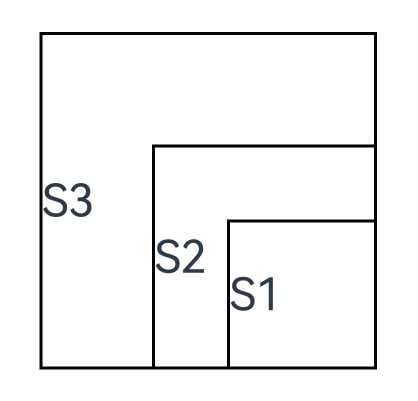

# 自定义组件的自定义布局
<!--Kit: ArkUI-->
<!--Subsystem: ArkUI-->
<!--Owner: @song-song-song-->
<!--Designer: @fenglinbailu-->
<!--Tester: @liuli0427-->
<!--Adviser: @Brilliantry_Rui-->

如果系统提供的布局组件（如[Flex](../../reference/apis-arkui/arkui-ts/ts-container-flex.md)，[Column](../../reference/apis-arkui/arkui-ts/ts-container-column.md)，[Row](../../reference/apis-arkui/arkui-ts/ts-container-row.md)等）无法满足复杂布局需求，或开发者希望自定义计算组件内子组件的大小和位置，建议在自定义组件中使用以下接口：

- [onMeasureSize](../../reference/apis-arkui/arkui-ts/ts-custom-component-layout.md#onmeasuresize10)：组件每次布局时触发，开发者可以在这个回调中增加自定义组件内子组件的大小的计算逻辑，返回自定义组件的尺寸信息，其执行时间先于onPlaceChildren。

- [onPlaceChildren](../../reference/apis-arkui/arkui-ts/ts-custom-component-layout.md#onplacechildren10)：组件每次布局时触发，开发者可以在这个回调中增加放置自定义组件内子组件位置的逻辑。

以下示例中，Index页面包含一个实现了自定义布局的自定义组件，且对应自定义组件的子组件通过index页面内的builder方式传入。

而在自定义组件中，调用了onMeasureSize和onPlaceChildren设置子组件大小和放置位置。例如，在本示例中，在onMeasureSize中初始化组件大小size=100，后续的每一个子组件size会加上上一个子组件大小的一半，实现组件大小递增的效果。而在onPlaceChildren中，定义startPos=300，设置每一个子组件的位置为startPos减去子组件自身的高度，所有子组件右下角一致在顶点位置(300, 300)，实现一个从右下角开始展示组件的类Stack组件。

**示例：**

<!-- @[CustomLayout](https://gitcode.com/openharmony/applications_app_samples/blob/master/code/DocsSample/ArkUISample/ComponentsLayout/entry/src/main/ets/pages/Index.ets) -->

``` TypeScript
// xxx.ets
@Entry
@Component
struct Index {
  build() {
    Column() {
      CustomLayout({ builder: columnChildren })
    }
  }
}

// 通过builder的方式传递多个组件，作为自定义组件的一级子组件（即不包含容器组件，如Column）
@Builder
function columnChildren() {
  ForEach([1, 2, 3], (index: number) => { // 暂不支持lazyForEach的写法
    Text('S' + index)
      .fontSize(30)
      .width(100)
      .height(100)
      .borderWidth(2)
      .offset({ x: 10, y: 20 })
  })
}

@Component
struct CustomLayout {
  @Builder
  doNothingBuilder() {
  };

  @BuilderParam builder: () => void = this.doNothingBuilder;
  result: SizeResult = {
    width: 0,
    height: 0
  };

  // 第一步：计算各子组件的大小
  onMeasureSize(selfLayoutInfo: GeometryInfo, children: Array<Measurable>, constraint: ConstraintSizeOptions) {
    let size = 100;
    children.forEach((child) => {
      let result: MeasureResult = child.measure({ minHeight: size, minWidth: size, maxWidth: size, maxHeight: size })
      size += result.width / 2;
    })
    // this.result在该用例中代表自定义组件本身的大小，onMeasureSize方法返回的是组件自身的尺寸。
    this.result.width = 100;
    this.result.height = 400;
    return this.result;
  }
  // 第二步：放置各子组件的位置
  onPlaceChildren(selfLayoutInfo: GeometryInfo, children: Array<Layoutable>, constraint: ConstraintSizeOptions) {
    let startPos = 300;
    children.forEach((child) => {
      let pos = startPos - child.measureResult.height;
      child.layout({ x: pos, y: pos })
    })
  }

  build() {
    this.builder()
  }
}
```

