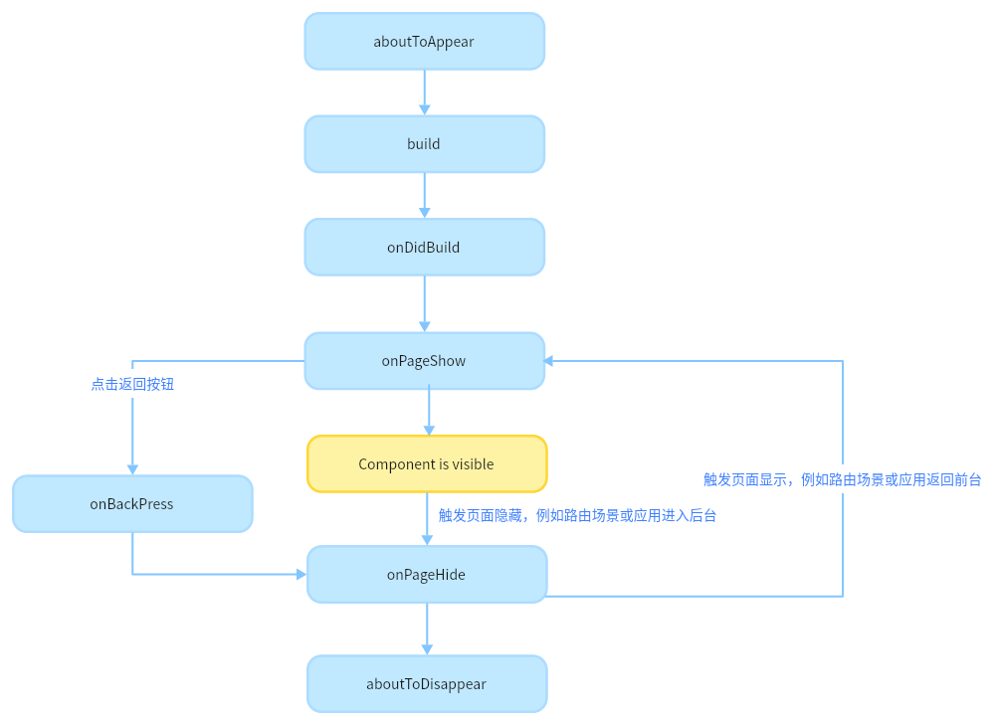

# 页面和自定义组件生命周期

在开始之前，我们先明确自定义组件和页面的关系：

- 自定义组件：\@Component装饰的UI单元，可以组合多个系统组件实现UI的复用，可以调用组件的生命周期。

- 页面：即应用的UI页面。可以由一个或者多个自定义组件组成，@Entry装饰的自定义组件为页面的入口组件，即页面的根节点，一个页面有且仅能有一个\@Entry。只有被\@Entry装饰的组件才可以调用页面的生命周期。


页面生命周期，即被\@Entry装饰的组件生命周期，提供以下生命周期接口：


- [onPageShow](../../reference/apis-arkui/arkui-ts/ts-custom-component-lifecycle.md#onpageshow)：页面每次显示时触发一次，包括路由过程、应用进入前台等场景。

- [onPageHide](../../reference/apis-arkui/arkui-ts/ts-custom-component-lifecycle.md#onpagehide)：页面每次隐藏时触发一次，包括路由过程、应用进入后台等场景。

- [onBackPress](../../reference/apis-arkui/arkui-ts/ts-custom-component-lifecycle.md#onbackpress)：当用户点击返回按钮时触发。


组件生命周期，即一般用\@Component装饰的自定义组件的生命周期，提供以下生命周期接口：


- [aboutToAppear](../../reference/apis-arkui/arkui-ts/ts-custom-component-lifecycle.md#abouttoappear)：组件即将出现时回调该接口，具体时机为在创建自定义组件的新实例后，在执行其build()函数之前执行。

- [onDidBuild](../../reference/apis-arkui/arkui-ts/ts-custom-component-lifecycle.md#ondidbuild12)：组件build()函数执行完成之后回调该接口，开发者可以在这个阶段进行埋点数据上报等不影响实际UI的功能。不建议在onDidBuild函数中更改状态变量、使用animateTo等功能，这可能会导致不稳定的UI表现。

- [aboutToDisappear](../../reference/apis-arkui/arkui-ts/ts-custom-component-lifecycle.md#abouttodisappear)：aboutToDisappear函数在自定义组件析构销毁之前执行。不允许在aboutToDisappear函数中改变状态变量，特别是@Link变量的修改可能会导致应用程序行为不稳定。


生命周期流程如下图所示，下图展示的是被\@Entry装饰的组件（页面）生命周期。





根据上面的流程图，我们从自定义组件的初始创建、重新渲染和删除来详细说明。


## 自定义组件的创建和渲染流程

1. 自定义组件的创建：自定义组件的实例由ArkUI框架创建。

2. 初始化自定义组件的成员变量：通过本地默认值或者构造方法传递参数来初始化自定义组件的成员变量，初始化顺序为成员变量的定义顺序。

3. 如果开发者定义了aboutToAppear，则执行该方法。

4. 在首次渲染的时候，执行build方法渲染系统组件，如果子组件为自定义组件，则创建自定义组件的实例。在首次渲染的过程中，框架会记录状态变量和组件的映射关系，当状态变量改变时，驱动其相关的组件刷新。

5. 如果开发者定义了onDidBuild，则执行该方法。

## 自定义组件重新渲染

当事件句柄被触发（比如设置了点击事件，即触发点击事件）改变了状态变量时，或者LocalStorage / AppStorage中的属性更改，并导致绑定的状态变量更改其值时：

1. 框架观察到变化，启动重新渲染。

2. 根据框架持有的两个map（[自定义组件的创建和渲染流程](#自定义组件的创建和渲染流程)中第4步），框架知道状态变量管理的UI组件及其更新函数。执行这些更新函数，实现最小化更新。

## 自定义组件的删除

如果if组件的分支改变或ForEach循环渲染中数组的个数改变，组件将被移除：

1. 在删除组件之前，将调用其aboutToDisappear生命周期函数，标记着该节点将要被销毁。ArkUI的节点删除机制是：后端节点直接从组件树上摘下，后端节点被销毁，对前端节点解引用，前端节点已经没有引用时，将被JS虚拟机垃圾回收。

2. 自定义组件和它的变量将被删除，如果组件有同步的变量（如[@Link](arkts-link.md)、[@Prop](arkts-prop.md)、[@StorageLink](arkts-appstorage.md#storagelink)），将从[同步源](arkts-state-management-overview.md#基本概念)上取消注册。

不建议在生命周期`aboutToDisappear`中使用`async await`。如果在此生命周期中使用异步操作（如 Promise 或回调方法），自定义组件将被保留在Promise的闭包中，直到回调方法执行完毕，这会阻止自定义组件的垃圾回收。

以下示例展示了生命周期的调用时机：

> **说明：**
>
> 当前router接口已不推荐使用，此处为更直观体现页面和自定义组件生命周期之间的时序关系，才使用router进行页面路由跳转。Navigation相关的时序关系参考[页面生命周期](../arkts-navigation-navigation.md#页面生命周期)。

```ts
// Index.ets
@Entry
@Component
struct MyComponent {
  @State showChild: boolean = true;
  @State btnColor: string = "#FF007DFF";

  // 只有被@Entry装饰的组件才可以调用页面的生命周期
  onPageShow() {
    console.info('Index onPageShow');
  }

  // 只有被@Entry装饰的组件才可以调用页面的生命周期
  onPageHide() {
    console.info('Index onPageHide');
  }

  // 只有被@Entry装饰的组件才可以调用页面的生命周期
  onBackPress() {
    console.info('Index onBackPress');
    this.btnColor = "#FFEE0606";
    // 返回true表示页面自己处理返回逻辑，不进行页面路由；返回false表示使用默认的路由返回逻辑，不设置返回值按照false处理
    return true;
  }

  // 组件生命周期
  aboutToAppear() {
    console.info('MyComponent aboutToAppear');
  }

  // 组件生命周期
  onDidBuild() {
    console.info('MyComponent onDidBuild');
  }

  // 组件生命周期
  aboutToDisappear() {
    console.info('MyComponent aboutToDisappear');
  }

  build() {
    Column() {
      // this.showChild为true，创建Child子组件，执行Child aboutToAppear
      if (this.showChild) {
        Child()
      }
      Button('delete Child')
        .margin(20)
        .backgroundColor(this.btnColor)
        .onClick(() => {
          // 更改this.showChild为false，删除Child子组件，执行Child aboutToDisappear
          this.showChild = false;
        })
      // push到Page页面，执行onPageHide
      Button('push to next page')
        .onClick(() => {
          this.getUIContext().getRouter().pushUrl({ url: 'pages/Page' });
        })
    }
  }
}

@Component
struct Child {
  @State title: string = 'Hello World';

  // 组件生命周期
  aboutToDisappear() {
    console.info('Child aboutToDisappear');
  }

  // 组件生命周期
  onDidBuild() {
    console.info('Child onDidBuild');
  }

  // 组件生命周期
  aboutToAppear() {
    console.info('Child aboutToAppear');
  }

  build() {
    Text(this.title)
      .fontSize(50)
      .margin(20)
      .onClick(() => {
        this.title = 'Hello ArkUI';
      })
  }
}
```
```ts
// Page.ets
@Entry
@Component
struct Page {
  @State textColor: Color = Color.Black;
  @State num: number = 0;

  // 只有被@Entry装饰的组件才可以调用页面的生命周期
  onPageShow() {
    console.info('Page onPageShow');
    this.num = 5;
  }

  // 只有被@Entry装饰的组件才可以调用页面的生命周期
  onPageHide() {
    console.info('Page onPageHide');
  }

  // 只有被@Entry装饰的组件才可以调用页面的生命周期
  onBackPress() { // 不设置返回值按照false处理
    console.info('Page onBackPress');
    this.textColor = Color.Grey;
    this.num = 0;
  }

  // 组件生命周期
  aboutToAppear() {
    console.info('Page aboutToAppear');
    this.textColor = Color.Blue;
  }

  // 组件生命周期
  onDidBuild() {
    console.info('Page onDidBuild');
  }

  // 组件生命周期
  aboutToDisappear() {
    console.info('Page aboutToDisappear');
  }

  build() {
    Column() {
      Text(`num 的值为：${this.num}`)
        .fontSize(30)
        .fontWeight(FontWeight.Bold)
        .fontColor(this.textColor)
        .margin(20)
        .onClick(() => {
          this.num += 5;
        })
    }
    .width('100%')
  }
}
```

以上示例中，Index页面包含两个自定义组件，一个是被\@Entry装饰的MyComponent，也是页面的入口组件，即页面的根节点；一个是Child，是MyComponent的子组件。只有\@Entry装饰的节点才可以使页面级别的生命周期方法生效，因此在MyComponent中声明当前Index页面的页面生命周期函数（onPageShow / onPageHide / onBackPress）。MyComponent及其子组件Child分别声明了各自的组件级别生命周期函数（aboutToAppear / onDidBuild / aboutToDisappear）。

- 应用冷启动的初始化流程为：MyComponent aboutToAppear --&gt; MyComponent build --&gt; MyComponent onDidBuild --&gt; Child aboutToAppear --&gt; Child build --&gt; Child onDidBuild --&gt; Index onPageShow。此处体现了自定义组件懒展开特性，即MyComponent执行完onDidBuild之后才会执行Child组件的aboutToAppear。日志输出信息如下：

```ts
MyComponent aboutToAppear
MyComponent onDidBuild
Child aboutToAppear
Child onDidBuild
Index onPageShow
```

- 点击“delete Child”，设置this.showChild为false，删除Child组件，执行Child aboutToDisappear方法。

- 点击“push to next page”，调用this.getUIContext().getRouter().pushUrl({ url: 'pages/Page' })接口，跳转到另外一个页面，当前Index页面隐藏，执行页面生命周期Index onPageHide。此处调用的是pushUrl接口，Index页面被隐藏，并没有销毁，所以只调用onPageHide。跳转到新页面后，执行初始化新页面的生命周期的流程。

- 如果调用的是this.getUIContext().getRouter().replaceUrl({ url: 'pages/Page' })，则当前Index页面被销毁，上文已经提到，组件的销毁是从组件树上直接摘下子树，所以执行的生命周期流程将变为：Page aboutToAppear --&gt; Page build --&gt; Page onDidBuild --&gt; Index onPageHide --&gt; Page onPageShow --&gt; MyComponent aboutToDisappear --&gt; Child aboutToDisappear。此时日志输出信息如下：

```ts
Page aboutToAppear
Page onDidBuild
Index onPageHide
Page onPageShow
MyComponent aboutToDisappear
Child aboutToDisappear
```

- 如果当前页面在Index页，点击返回按钮，触发页面生命周期Index onBackPress，若onBackPress使用默认false返回值，则触发返回后会导致当前Index页面被隐藏，执行页面生命周期onPageHide。此时日志输出信息如下：

```ts
Index onBackPress
Index onPageHide
```

- 如果当前页面在Page页，点击返回按钮，触发页面生命周期Page onBackPress，若onBackPress使用默认false返回值，则触发返回后会导致当前Page页面被销毁，执行页面生命周期onPageHide和组件生命周期aboutToDisappear。此时日志输出信息如下：

```ts
Page onBackPress
Page onPageHide
Index onPageShow
Page aboutToDisappear
```

- 最小化应用或者应用进入后台，触发Index onPageHide。当前Index页面未被销毁，所以并不会执行组件的aboutToDisappear。应用回到前台，执行Index onPageShow。

- 退出应用时，触发以下生命周期：Index onPageHide --&gt; MyComponent aboutToDisappear --&gt; Child aboutToDisappear。

## 自定义组件监听页面生命周期

使用[无感监听页面路由](../../reference/apis-arkui/js-apis-arkui-observer.md#uiobserveronrouterpageupdate11)的能力，能够实现在自定义组件中监听页面的生命周期。

```ts
// Index.ets
import { uiObserver, UIObserver } from '@kit.ArkUI';

@Entry
@Component
struct Index {
  listener: (info: uiObserver.RouterPageInfo) => void = (info: uiObserver.RouterPageInfo) => {
    let routerInfo: uiObserver.RouterPageInfo | undefined = this.queryRouterPageInfo();
    if (info.pageId == routerInfo?.pageId) {
      if (info.state == uiObserver.RouterPageState.ON_PAGE_SHOW) {
        console.log(`Index onPageShow`);
      } else if (info.state == uiObserver.RouterPageState.ON_PAGE_HIDE) {
        console.log(`Index onPageHide`);
      }
    }
  }

  aboutToAppear(): void {
    let uiObserver: UIObserver = this.getUIContext().getUIObserver();
    uiObserver.on('routerPageUpdate', this.listener);
  }

  aboutToDisappear(): void {
    let uiObserver: UIObserver = this.getUIContext().getUIObserver();
    uiObserver.off('routerPageUpdate', this.listener);
  }

  build() {
    Column() {
      Text(`this page is ${this.queryRouterPageInfo()?.pageId}`)
        .fontSize(25)
      Button("push self")
        .onClick(() => {
          this.getUIContext().getRouter().pushUrl({ url: 'pages/Index' });
        })
      Column() {
        SubComponent()
      }
    }
  }
}

@Component
struct SubComponent {
  listener: (info: uiObserver.RouterPageInfo) => void = (info: uiObserver.RouterPageInfo) => {
    let routerInfo: uiObserver.RouterPageInfo | undefined = this.queryRouterPageInfo();
    if (info.pageId == routerInfo?.pageId) {
      if (info.state == uiObserver.RouterPageState.ON_PAGE_SHOW) {
        console.log(`SubComponent onPageShow`);
      } else if (info.state == uiObserver.RouterPageState.ON_PAGE_HIDE) {
        console.log(`SubComponent onPageHide`);
      }
    }
  }

  aboutToAppear(): void {
    let uiObserver: UIObserver = this.getUIContext().getUIObserver();
    uiObserver.on('routerPageUpdate', this.listener);
  }

  aboutToDisappear(): void {
    let uiObserver: UIObserver = this.getUIContext().getUIObserver();
    uiObserver.off('routerPageUpdate', this.listener);
  }

  build() {
    Column() {
      Text(`SubComponent`)
    }
  }
}
```
