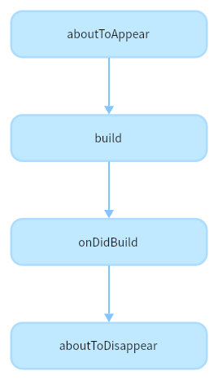
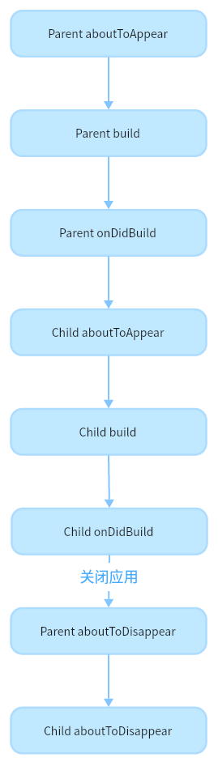

# 自定义组件生命周期
<!--Kit: ArkUI-->
<!--Subsystem: ArkUI-->
<!--Owner: @jiyujia926; @huyisuo-->
<!--Designer: @zhangboren-->
<!--Tester: @TerryTsao-->
<!--Adviser: @zhang_yixin13-->

自定义组件生命周期，即用[@Component](arkts-create-custom-components.md#component)或[@ComponentV2](arkts-new-componentV2.md)装饰的自定义组件的生命周期，提供以下生命周期接口：


- [aboutToAppear](../../reference/apis-arkui/arkui-ts/ts-custom-component-lifecycle.md#abouttoappear)：组件即将出现时回调该接口，具体时机为在创建自定义组件的新实例后，在执行其build函数之前执行。

- [onDidBuild](../../reference/apis-arkui/arkui-ts/ts-custom-component-lifecycle.md#ondidbuild12)：在组件首次渲染触发的build函数执行完成之后回调该接口，后续组件重新渲染将不回调该接口。开发者可以在这个阶段进行埋点数据上报等不影响实际UI的功能。不建议在onDidBuild函数中更改状态变量、使用animateTo等功能，这可能会导致不稳定的UI表现。

- [aboutToDisappear](../../reference/apis-arkui/arkui-ts/ts-custom-component-lifecycle.md#abouttodisappear)：aboutToDisappear函数在自定义组件析构销毁之前执行。不允许在aboutToDisappear函数中改变状态变量，特别是@Link变量的修改可能会导致应用程序行为不稳定。

> **说明：**
>
> 页面生命周期及其相关内容参考[页面路由](../arkts-routing.md#生命周期)。

自定义组件生命周期流程如下图所示。





根据上面的流程图，接下来从自定义组件的初始创建、重新渲染和删除来详细说明。


## 自定义组件的创建和渲染流程

1. 自定义组件的创建：自定义组件的实例由ArkUI框架创建。

2. 初始化自定义组件的成员变量：通过本地默认值或者构造方法传递参数来初始化自定义组件的成员变量，初始化顺序为成员变量的定义顺序。

3. 如果开发者定义了aboutToAppear，则执行build方法之前执行该方法。

4. 在首次渲染的时候，执行build方法渲染系统组件，如果子组件为自定义组件，则创建自定义组件的实例。在首次渲染的过程中，框架会记录状态变量和组件的映射关系，当状态变量改变时，驱动其相关的组件刷新。

5. 如果开发者定义了onDidBuild，则执行build方法之后执行该方法。

## 自定义组件重新渲染

当触发事件（比如点击）改变状态变量时，或者LocalStorage / AppStorage中的属性更改，并导致绑定的状态变量更改其值时：

1. 框架观察到变化，启动重新渲染。

2. 根据框架记录的状态变量和组件的映射关系，仅刷新发生变化的状态变量所关联的组件，实现最小化更新。

## 自定义组件的删除

例如if组件的分支改变或ForEach循环渲染中数组的个数改变，组件将被移除：

1. 在删除组件之前，将调用其aboutToDisappear生命周期函数，标记着该节点将要被销毁。ArkUI的节点删除机制是：后端节点直接从组件树上摘下，后端节点被销毁，对前端节点解引用，前端节点已经没有引用时，将被Ark虚拟机垃圾回收。

2. 自定义组件和它的变量将被删除，如果组件有同步的变量（如[@Link](arkts-link.md)、[@Prop](arkts-prop.md)、[@StorageLink](arkts-appstorage.md#storagelink)），将从[同步源](arkts-state-management-overview.md#基本概念)上取消注册。

不建议在生命周期`aboutToDisappear`中使用`async await`。如果在此生命周期中使用异步操作（如 Promise 或回调方法），自定义组件将被保留在Promise的闭包中，直到回调方法执行完毕，这会阻止自定义组件的垃圾回收。

## 自定义组件嵌套使用与示例

通过以下示例，来详细说明自定义组件在嵌套使用时，自定义组件生命周期的调用时序：

```ts
// Index.ets
@Entry
@Component
struct Parent {
  @State showChild: boolean = true;
  @State btnColor: string = '#FF007DFF';

  // 组件生命周期
  aboutToAppear() {
    console.info('Parent aboutToAppear');
  }

  // 组件生命周期
  onDidBuild() {
    console.info('Parent onDidBuild');
  }

  // 组件生命周期
  aboutToDisappear() {
    console.info('Parent aboutToDisappear');
  }

  build() {
    Column() {
      // this.showChild为true，创建Child子组件，执行Child aboutToAppear
      if (this.showChild) {
        Child()
      }
      Button('delete Child')
        .margin(20)
        .backgroundColor(this.btnColor)
        .onClick(() => {
          // 更改this.showChild为false，删除Child子组件，执行Child aboutToDisappear
          // 更改this.showChild为true，添加Child子组件，执行Child aboutToAppear
          this.showChild = !this.showChild;
        })
    }
  }
}

@Component
struct Child {
  @State title: string = 'Hello World';

  // 组件生命周期
  aboutToDisappear() {
    console.info('Child aboutToDisappear');
  }

  // 组件生命周期
  onDidBuild() {
    console.info('Child onDidBuild');
  }

  // 组件生命周期
  aboutToAppear() {
    console.info('Child aboutToAppear');
  }

  build() {
    Text(this.title)
      .fontSize(50)
      .margin(20)
      .onClick(() => {
        this.title = 'Hello ArkUI';
      })
  }
}
```

以上示例中，Index页面包含两个自定义组件，一个是Parent，一个是Child，Parent及其子组件Child分别声明了各自的自定义组件生命周期函数（aboutToAppear / onDidBuild / aboutToDisappear）。

- 应用冷启动的初始化流程为：Parent aboutToAppear --&gt; Parent build --&gt; Parent onDidBuild --&gt; Child aboutToAppear --&gt; Child build --&gt; Child onDidBuild。此处体现了自定义组件懒展开特性，即Parent执行完onDidBuild之后才会执行Child组件的aboutToAppear。日志输出信息如下：

```ts
Parent aboutToAppear
Parent onDidBuild
Child aboutToAppear
Child onDidBuild
```

- 点击Button按钮，更改showChild为false，删除Child组件，执行Child aboutToDisappear方法。

- 如果直接退出应用，则会触发以下生命周期：Parent aboutToDisappear --&gt; Child aboutToDisappear，此处体现了自定义组件删除顺序也是从父到子。日志输出信息如下：

```ts
Parent aboutToDisappear
Child aboutToDisappear
```

- 最小化应用或者应用进入后台，当前Index页面未被销毁，所以并不会执行组件的aboutToDisappear。

- 如果showChild的默认值为false，则应用冷启动的初始化流程为：Parent aboutToAppear --&gt; Parent build --&gt; Parent onDidBuild。日志输出信息如下：

```ts
Parent aboutToAppear
Parent onDidBuild
```
- 如果showChild的默认值为false，直接退出应用，则只执行Parent aboutToDisappear方法。

- 如果showChild的默认值为false，此时点击Button按钮，更改showChild为true，添加Child组件，添加流程为：Child aboutToAppear --&gt; Child build --&gt; Child onDidBuild。日志输出信息如下：

```ts
Child aboutToAppear
Child onDidBuild
```
当showchild为默认值true时，该示例的生命周期流程图如下所示：

