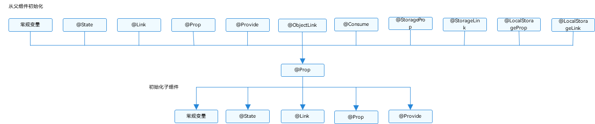

# \@Prop装饰器：父子单向同步

\@Prop装饰的变量可以和父组件建立单向同步关系。\@Prop变量允许在本地修改，但修改后的变化不会同步回父组件。

在阅读\@Prop文档前，建议开发者首先了解[\@State](./arkts-state.md)的基本用法。最佳实践请参考[状态管理最佳实践](https://developer.huawei.com/consumer/cn/doc/best-practices/bpta-status-management)。

> **说明：**
>
> 从API version 9开始，该装饰器支持在ArkTS卡片中使用。
>
> 从API version 11开始，该装饰器支持在原子化服务中使用。

## 概述

\@Prop装饰的变量和父组件建立单向的同步关系：

- \@Prop装饰的变量允许本地修改，但修改不会同步回父组件。

- 当数据源更改时，\@Prop装饰的变量都会更新，并且会覆盖本地所有更改。因此，数值的同步是父组件到子组件（所属组件），子组件数值的变化不会同步到父组件。

## 限制条件

- \@Prop装饰变量时会进行深拷贝，在拷贝的过程中除了基本类型、Map、Set、Date、Array外，都会丢失类型。例如[PixelMap](../../reference/apis-image-kit/js-apis-image.md#pixelmap7)等通过NAPI提供的复杂类型，由于有部分实现在Native侧，因此无法在ArkTS侧通过深拷贝获得完整的数据。

## 装饰器使用规则说明

| \@Prop变量装饰器 | 说明                                       |
| ----------- | ---------------------------------------- |
| 装饰器参数       | 无。                                        |
| 同步类型        | 单向同步。对父组件状态变量值的修改，将同步给子组件\@Prop装饰的变量，子组件\@Prop装饰的变量的修改不会同步到父组件的状态变量上。<br>嵌套类型的场景请参考[观察变化](#观察变化)。 |
| 允许装饰的变量类型   | Object、class、string、number、boolean、enum类型，以及这些类型的数组。<br/>不支持any，支持undefined和null。<br/>支持Date类型。<br/>API11及以上支持Map、Set类型。<br/>支持ArkUI框架定义的联合类型Length、ResourceStr、ResourceColor类型。<br/>必须指定类型。<br/>\@Prop和[数据源](arkts-state-management-overview.md#基本概念)类型需要相同，有以下三种情况：<br/>-&nbsp;\@Prop装饰的变量和\@State以及其他装饰器同步时双方的类型必须相同，示例请参考[父组件@State到子组件@Prop简单数据类型同步](#父组件state到子组件prop简单数据类型同步)。<br/>-&nbsp;\@Prop装饰的变量和\@State以及其他装饰器装饰的数组的项同步时 ，\@Prop的类型需要和\@State装饰的数组的数组项相同，比如\@Prop&nbsp;:&nbsp;T和\@State&nbsp;:&nbsp;Array&lt;T&gt;，示例请参考[父组件@State数组中的项到子组件@Prop简单数据类型同步](#父组件state数组项到子组件prop简单数据类型同步)。<br/>-&nbsp;当父组件状态变量为Object或者class时，\@Prop装饰的变量和父组件状态变量的属性类型相同，示例请参考[从父组件中的@State类对象属性到@Prop简单类型的同步](#从父组件中的state类对象属性到prop简单类型的同步)。<br/>支持类型的场景请参考[观察变化](#观察变化)。<br/>API11及以上支持上述支持类型的联合类型，比如string \| number, string \| undefined 或者 ClassA \| null，示例见[Prop支持联合类型实例](#prop支持联合类型实例)。 <br/>**注意**<br/>当使用undefined和null的时候，建议显式指定类型，遵循TypeScript类型校验，比如：`@Prop a : string \| undefined = undefined`是支持的，不支持`@Prop a: string = undefined`。 |
| 嵌套传递层数        | 在组件复用场景，建议@Prop深度嵌套数据不要超过5层，嵌套太多会导致深拷贝占用的空间过大以及GarbageCollection(垃圾回收)，引起性能问题，此时更建议使用[\@ObjectLink](arkts-observed-and-objectlink.md)。 |
| 被装饰变量的初始值   | 允许本地初始化。如果在API 11中和[\@Require](arkts-require.md)结合使用，则必须父组件构造传参。 |

## 变量的传递/访问规则说明

| 装饰器使用规则          | 说明                                                         |
| ------------------ | ------------------------------------------------------------ |
| 从父组件初始化     | 如果本地有初始化，则是可选的，初始化行为和[\@State](./arkts-state.md#变量的传递访问规则说明)保持一致。没有的话，则必选，支持父组件中的常规变量（常规变量对@Prop赋值，只是数值的初始化，常规变量的变化不会触发UI刷新。只有状态变量才能触发UI刷新）、[\@State](arkts-state.md)、[\@Link](arkts-link.md)、\@Prop、[\@Provide](arkts-provide-and-consume.md)、[\@Consume](arkts-provide-and-consume.md)、[\@ObjectLink](arkts-observed-and-objectlink.md)、[\@StorageLink](arkts-appstorage.md#storagelink)、[\@StorageProp](arkts-appstorage.md#storageprop)、[\@LocalStorageLink](arkts-localstorage.md#localstoragelink)和[\@LocalStorageProp](arkts-localstorage.md#localstorageprop)去初始化子组件中的\@Prop变量。 |
|用于初始化子组件| \@Prop支持初始化子组件中的常规变量、\@State、\@Link、\@Prop、\@Provide。|
| 是否支持组件外访问 | \@Prop装饰的变量是私有的，只能在组件内访问。                 |

 初始化规则图示：



## 观察变化和行为表现

### 观察变化

\@Prop装饰的数据可以观察到以下变化。

- 当装饰的类型是允许的类型，即Object、class、string、number、boolean、enum类型都可以观察到赋值的变化。

  ```ts
  // 简单类型
  @Prop count: number;
  // 赋值的变化可以被观察到
  this.count = 1;
  // 复杂类型
  @Prop title: Model;
  // 可以观察到赋值的变化
  this.title = new Model('Hi');
  ```

- 当装饰的类型是Object或者class复杂类型时，可以观察到第一层的属性的变化，属性即Object.keys(observedObject)返回的所有属性。

```ts
class Info {
  public value: string;
  constructor(value: string) {
    this.value = value;
  }
}
class Model {
  public value: string;
  public info: Info;
  constructor(value: string, info: Info) {
    this.value = value;
    this.info = info;
  }
}

@Prop title: Model;
// 可以观察到第一层的变化
this.title.value = 'Hi';
// 观察不到第二层的变化
this.title.info.value = 'ArkUI';
```

对于嵌套场景，如果class是被\@Observed装饰的，可以观察到class属性的变化，示例请参考[@Prop嵌套场景](#prop嵌套场景)。

- 当装饰的类型是数组的时候，可以观察到数组本身的赋值和数组项的添加、删除和更新。

```ts
// @State装饰的对象为数组时
@Prop title: string[];
// 数组自身的赋值可以观察到
this.title = ['1'];
// 数组项的赋值可以观察到
this.title[0] = '2';
// 删除数组项可以观察到
this.title.pop();
// 新增数组项可以观察到
this.title.push('3');
```

对于\@State和\@Prop的同步场景：

- 使用父组件中\@State变量的值初始化子组件中的\@Prop变量。当\@State变量变化时，该变量值也会同步更新至\@Prop变量。
- \@Prop装饰的变量的修改不会影响其数据源\@State装饰变量的值。
- 除了\@State，数据源也可以用\@Link或\@Prop装饰，对\@Prop的同步机制是相同的。
- 数据源和\@Prop变量的类型需要相同，\@Prop允许简单类型和class类型。

- 当装饰的对象是Date时，可以观察到Date整体的赋值，同时可通过调用Date的接口`setFullYear`, `setMonth`, `setDate`, `setHours`, `setMinutes`, `setSeconds`, `setMilliseconds`, `setTime`, `setUTCFullYear`, `setUTCMonth`, `setUTCDate`, `setUTCHours`, `setUTCMinutes`, `setUTCSeconds`, `setUTCMilliseconds` 更新Date的属性。

```ts
@Component
struct DateComponent {
  @Prop selectedDate: Date = new Date('');

  build() {
    Column() {
      Button('child update the new date')
        .margin(10)
        .onClick(() => {
          this.selectedDate = new Date('2023-09-09');
        })
      Button(`child increase the year by 1`).onClick(() => {
        this.selectedDate.setFullYear(this.selectedDate.getFullYear() + 1);
      })
      DatePicker({
        start: new Date('1970-1-1'),
        end: new Date('2100-1-1'),
        selected: this.selectedDate
      })
    }
  }
}

@Entry
@Component
struct ParentComponent {
  @State parentSelectedDate: Date = new Date('2021-08-08');

  build() {
    Column() {
      Button('parent update the new date')
        .margin(10)
        .onClick(() => {
          this.parentSelectedDate = new Date('2023-07-07');
        })
      Button('parent increase the day by 1')
        .margin(10)
        .onClick(() => {
          this.parentSelectedDate.setDate(this.parentSelectedDate.getDate() + 1);
        })
      DatePicker({
        start: new Date('1970-1-1'),
        end: new Date('2100-1-1'),
        selected: this.parentSelectedDate
      })

      DateComponent({ selectedDate: this.parentSelectedDate })
    }

  }
}
```

- 当装饰的变量是Map时，可以观察到Map整体的赋值，同时可通过调用Map的接口`set`, `clear`, `delete` 更新Map的值。详见[装饰Map类型变量](#装饰map类型变量)。

- 当装饰的变量是Set时，可以观察到Set整体的赋值，同时可通过调用Set的接口`add`, `clear`, `delete` 更新Set的值。详见[装饰Set类型变量](#装饰set类型变量)。

### 框架行为

理解\@Prop变量值初始化和更新机制，需要了解父组件和子组件的渲染和更新流程。

1. 初始渲染：
   1. 执行父组件的build()函数，创建子组件的新实例并传递数据源。
   2. 初始化子组件\@Prop装饰的变量。

2. 更新：
   1. 子组件\@Prop更新时，更新仅停留在当前子组件，不会同步回父组件。
   2. 当父组件的数据源更新时，子组件的\@Prop装饰的变量将被来自父组件的数据源重置，所有@Prop装饰变量的本地修改将被父组件的更新覆盖。

> **说明：**
>
> \@Prop装饰的数据更新依赖其所属自定义组件的重新渲染，所以在应用进入后台后，\@Prop无法刷新，推荐使用\@Link代替。

## 使用场景

### 父组件\@State到子组件\@Prop简单数据类型同步

以下示例是\@State到子组件\@Prop简单数据同步，父组件ParentComponent的状态变量countDownStartValue初始化子组件CountDownComponent中\@Prop装饰的count，点击“Try again”，count的修改仅保留在CountDownComponent，不会同步给父组件ParentComponent。

ParentComponent的状态变量countDownStartValue的变化将重置CountDownComponent的count。

```ts
@Component
struct CountDownComponent {
  @Prop count: number = 0;
  costOfOneAttempt: number = 1;

  build() {
    Column() {
      if (this.count > 0) {
        Text(`You have ${this.count} Nuggets left`)
      } else {
        Text('Game over!')
      }
      // @Prop装饰的变量不会同步给父组件
      Button(`Try again`).onClick(() => {
        this.count -= this.costOfOneAttempt;
      })
    }
  }
}

@Entry
@Component
struct ParentComponent {
  @State countDownStartValue: number = 10;

  build() {
    Column() {
      Text(`Grant ${this.countDownStartValue} nuggets to play.`)
      // 父组件的数据源的修改会同步给子组件
      Button(`+1 - Nuggets in New Game`).onClick(() => {
        this.countDownStartValue += 1;
      })
      // 父组件的修改会同步给子组件
      Button(`-1  - Nuggets in New Game`).onClick(() => {
        this.countDownStartValue -= 1;
      })

      CountDownComponent({ count: this.countDownStartValue, costOfOneAttempt: 2 })
    }
  }
}
```

在上面的示例中：

1. CountDownComponent子组件首次创建时其\@Prop装饰的count变量将从父组件\@State装饰的countDownStartValue变量初始化。

2. 按“+1”或“-1”按钮时，父组件的\@State装饰的countDownStartValue值会变化，这将触发父组件重新渲染，在父组件重新渲染过程中会刷新使用countDownStartValue状态变量的UI组件，并单向同步更新CountDownComponent子组件中的count值。

3. 更新count状态变量值也会触发CountDownComponent的重新渲染，在重新渲染过程中，评估使用count状态变量的if语句条件（this.count &gt; 0），并执行true分支中的使用count状态变量的UI组件相关描述来更新Text组件的UI显示。

4. 当按下子组件CountDownComponent的“Try again”按钮时，其\@Prop变量count将被更改，但是count值的更改不会影响父组件的countDownStartValue值。

5. 父组件的countDownStartValue值变化时，父组件的修改将覆盖掉子组件CountDownComponent中count本地的修改。

### 父组件\@State数组项到子组件\@Prop简单数据类型同步

父组件中@State如果装饰数组类型的变量，其数组项也可以初始化@Prop。以下示例中，父组件Index中@State装饰数组arr，将其数组项初始化子组件Child中@Prop装饰的value。

```ts
@Component
struct Child {
  @Prop value: number = 0;

  build() {
    Text(`${this.value}`)
      .fontSize(50)
      .onClick(() => {
        this.value++;
      })
  }
}

@Entry
@Component
struct Index {
  @State arr: number[] = [1, 2, 3];

  build() {
    Row() {
      Column() {
        Child({ value: this.arr[0] })
        Child({ value: this.arr[1] })
        Child({ value: this.arr[2] })

        Divider().height(5)

        ForEach(this.arr,
          (item: number) => {
            Child({ value: item })
          },
          (item: number) => item.toString()
        )
        Text('replace entire arr')
          .fontSize(50)
          .onClick(() => {
            // 两个数组都包含项“3”。
            this.arr = this.arr[0] == 1 ? [3, 4, 5] : [1, 2, 3];
          })
      }
    }
  }
}
```

初始渲染创建6个子组件实例，每个\@Prop装饰的变量初始化都在本地拷贝了一份数组项。子组件onClick事件处理程序会更改局部变量值。

如果点击界面上的“1”六次，“2”五次、“3”四次，将所有变量的本地取值都变为“7”。

```
7
7
7
----
7
7
7
```

单击replace entire arr后，屏幕将显示以下信息。

```
3
4
5
----
7
4
5
```

- 在子组件Child中做的所有的修改都不会同步回父组件Index组件，所以即使6个组件显示都为7，但在父组件Index中，this.arr保存的值依旧是[1,2,3]。

- 点击replace entire arr，this.arr[0] == 1成立，将this.arr赋值为[3, 4, 5]。

- 因为this.arr[0]已更改，Child({value: this.arr[0]})组件将this.arr[0]更新同步到实例\@Prop装饰的变量。Child({value: this.arr[1]})和Child({value: this.arr[2]})的情况也类似。

- this.arr的更改触发ForEach更新，this.arr更新的前后都有数值为3的数组项：[3, 4, 5] 和[1, 2, 3]。根据diff算法，数组项“3”将被保留，删除“1”和“2”的数组项，添加为“4”和“5”的数组项。这就意味着，数组项“3”的组件不会重新生成，而是将其移动到第一位。所以“3”对应的组件不会更新，此时“3”对应的组件数值为“7”，ForEach最终的渲染结果是“7”，“4”，“5”。

### 从父组件中的\@State类对象属性到\@Prop简单类型的同步

如果图书馆有一本图书和两位用户，每位用户都可以将图书标记为已读，此标记行为不会影响其他用户。从代码角度讲，对\@Prop图书对象的本地更改不会同步给图书馆组件中的\@State图书对象。

在此示例中，图书类可以使用\@Observed装饰器，但不是必须的，只有在嵌套结构时需要此装饰器。这一点会在[从父组件中的\@State数组项到\@Prop class类型的同步](#从父组件中的state数组项到prop-class类型的同步)说明。

```ts
class Book {
  public title: string;
  public pages: number;
  public readIt: boolean = false;

  constructor(title: string, pages: number) {
    this.title = title;
    this.pages = pages;
  }
}

@Component
struct ReaderComp {
  @Prop book: Book = new Book("", 0);

  build() {
    Row() {
      Text(this.book.title)
      Text(`...has${this.book.pages} pages!`)
      Text(`...${this.book.readIt ? "I have read" : 'I have not read it'}`)
        .onClick(() => this.book.readIt = true)
    }
  }
}

@Entry
@Component
struct Library {
  @State book: Book = new Book('100 secrets of C++', 765);

  build() {
    Column() {
      ReaderComp({ book: this.book })
      ReaderComp({ book: this.book })
    }
  }
}
```

### 从父组件中的\@State数组项到\@Prop class类型的同步

以下示例中，更改了\@State装饰的allBooks数组中Book对象的属性，但点击“Mark read for everyone”时，没有触发UI更新。这是因为该属性是第二层的嵌套属性，\@State装饰器只能观察到第一层属性，不会观察到此属性更改，所以框架不会更新ReaderComp。

```ts
let nextId: number = 1;

// @Observed
class Book {
  public id: number;
  public title: string;
  public pages: number;
  public readIt: boolean = false;

  constructor(title: string, pages: number) {
    this.id = nextId++;
    this.title = title;
    this.pages = pages;
  }
}

@Component
struct ReaderComp {
  @Prop book: Book = new Book("", 1);

  build() {
    Row() {
      Text(` ${this.book ? this.book.title : "Book is undefined"}`).fontColor('#e6000000')
      Text(` has ${this.book ? this.book.pages : "Book is undefined"} pages!`).fontColor('#e6000000')
      Text(` ${this.book ? this.book.readIt ? "I have read" : 'I have not read it' : "Book is undefined"}`).fontColor('#e6000000')
        .onClick(() => this.book.readIt = true)
    }
  }
}

@Entry
@Component
struct Library {
  @State allBooks: Book[] = [new Book("C#", 765), new Book("JS", 652), new Book("TS", 765)];

  build() {
    Column() {
      Text('library`s all time favorite')
        .width(312)
        .height(40)
        .backgroundColor('#0d000000')
        .borderRadius(20)
        .margin(12)
        .padding({ left: 20 })
        .fontColor('#e6000000')
      ReaderComp({ book: this.allBooks[2] })
        .backgroundColor('#0d000000')
        .width(312)
        .height(40)
        .padding({ left: 20, top: 10 })
        .borderRadius(20)
        .colorBlend('#e6000000')
      Divider()
      Text('Books on loan to a reader')
        .width(312)
        .height(40)
        .backgroundColor('#0d000000')
        .borderRadius(20)
        .margin(12)
        .padding({ left: 20 })
        .fontColor('#e6000000')
      ForEach(this.allBooks, (book: Book) => {
        ReaderComp({ book: book })
          .margin(12)
          .width(312)
          .height(40)
          .padding({ left: 20, top: 10 })
          .backgroundColor('#0d000000')
          .borderRadius(20)
      },
        (book: Book) => book.id.toString())
      Button('Add new')
        .width(312)
        .height(40)
        .margin(12)
        .fontColor('#FFFFFF 90%')
        .onClick(() => {
          this.allBooks.push(new Book("JA", 512));
        })
      Button('Remove first book')
        .width(312)
        .height(40)
        .margin(12)
        .fontColor('#FFFFFF 90%')
        .onClick(() => {
          if (this.allBooks.length > 0){
            this.allBooks.shift();
          } else {
            console.log("length <= 0");
          }
        })
      Button("Mark read for everyone")
        .width(312)
        .height(40)
        .margin(12)
        .fontColor('#FFFFFF 90%')
        .onClick(() => {
          this.allBooks.forEach((book) => book.readIt = true)
        })
    }
  }
}
```

使用\@Observed装饰class Book，Book的属性变化将被观察。需要注意的是，\@Prop在子组件装饰的状态变量和父组件的数据源是单向同步关系，即ReaderComp中的\@Prop book的修改不会同步给父组件Library。而父组件只会在状态变量发生变化的时候，才会触发UI的重新渲染。

```ts
@Observed
class Book {
  public id: number;
  public title: string;
  public pages: number;
  public readIt: boolean = false;

  constructor(title: string, pages: number) {
    this.id = nextId++;
    this.title = title;
    this.pages = pages;
  }
}
```

\@Observed装饰的类的实例会被不透明的代理对象包装，此代理可以检测到包装对象内的所有属性更改。如果发生这种情况，此时，代理通知\@Prop，\@Prop对象值被更新。


### \@Prop本地初始化不和父组件同步

为了支持\@Component装饰的组件复用场景，\@Prop支持本地初始化，这样可以让\@Prop是否与父组件建立同步关系变得可选。当且仅当\@Prop有本地初始化时，从父组件向子组件传递\@Prop的数据源才是可选的。

下面的示例中，子组件包含两个\@Prop变量：

- \@Prop customCounter没有本地初始化，所以需要父组件提供数据源去初始化\@Prop，并当父组件的数据源变化时，\@Prop也将被更新。

- \@Prop customCounter2有本地初始化，在这种情况下，\@Prop依旧允许但非强制父组件同步数据源给\@Prop。

```ts
@Component
struct MyComponent {
  @Prop customCounter: number;
  @Prop customCounter2: number = 5;

  build() {
    Column() {
      Row() {
        Text(`From Main: ${this.customCounter}`).fontColor('#ff6b6565').margin({ left: -110, top: 12 })
      }

      Row() {
        Button('Click to change locally !')
          .width(288)
          .height(40)
          .margin({ left: 30, top: 12 })
          .fontColor('#FFFFFF，90%')
          .onClick(() => {
            this.customCounter2++;
          })
      }

      Row() {
        Text(`Custom Local: ${this.customCounter2}`).fontColor('#ff6b6565').margin({ left: -110, top: 12 })
      }
    }
  }
}

@Entry
@Component
struct MainProgram {
  @State mainCounter: number = 10;

  build() {
    Column() {
      Row() {
        Column() {
          // customCounter必须从父组件初始化，因为MyComponent的customCounter成员变量缺少本地初始化；此处，customCounter2可以不做初始化。
          MyComponent({ customCounter: this.mainCounter })
          // customCounter2也可以从父组件初始化，父组件初始化的值会覆盖子组件customCounter2的本地初始化的值
          MyComponent({ customCounter: this.mainCounter, customCounter2: this.mainCounter })
        }
      }

      Row() {
        Column() {
          Button('Click to change number')
            .width(288)
            .height(40)
            .margin({ left: 30, top: 12 })
            .fontColor('#FFFFFF，90%')
            .onClick(() => {
              this.mainCounter++;
            })
        }
      }
    }
  }
}
```


### \@Prop嵌套场景

在嵌套场景下，每一层都要用\@Observed装饰，且每一层都要被\@Prop接收，这样才能观察到嵌套场景。

```ts
// 以下是嵌套类对象的数据结构。
@Observed
class Son {
  public title: string;

  constructor(title: string) {
    this.title = title;
  }
}

@Observed
class Father {
  public name: string;
  public son: Son;

  constructor(name: string, son: Son) {
    this.name = name;
    this.son = son;
  }
}
```

以下组件层次结构展示了\@Prop嵌套场景的数据结构。

```ts
@Entry
@Component
struct Person {
  @State person: Father = new Father('Hello', new Son('world'));

  build() {
    Column() {
      Flex({ direction: FlexDirection.Column, alignItems: ItemAlign.Center }) {
        Button('change Father name')
          .width(312)
          .height(40)
          .margin(12)
          .fontColor('#FFFFFF，90%')
          .onClick(() => {
            this.person.name = "Hi";
          })
        Button('change Son title')
          .width(312)
          .height(40)
          .margin(12)
          .fontColor('#FFFFFF，90%')
          .onClick(() => {
            this.person.son.title = "ArkUI";
          })
        Text(this.person.name)
          .fontSize(16)
          .margin(12)
          .width(312)
          .height(40)
          .backgroundColor('#ededed')
          .borderRadius(20)
          .textAlign(TextAlign.Center)
          .fontColor('#e6000000')
          .onClick(() => {
            this.person.name = 'Bye';
          })
        Text(this.person.son.title)
          .fontSize(16)
          .margin(12)
          .width(312)
          .height(40)
          .backgroundColor('#ededed')
          .borderRadius(20)
          .textAlign(TextAlign.Center)
          .onClick(() => {
            this.person.son.title = "openHarmony";
          })
        Child({ child: this.person.son })
      }
    }
  }
}


@Component
struct Child {
  @Prop child: Son = new Son('');

  build() {
    Column() {
      Text(this.child.title)
        .fontSize(16)
        .margin(12)
        .width(312)
        .height(40)
        .backgroundColor('#ededed')
        .borderRadius(20)
        .textAlign(TextAlign.Center)
        .onClick(() => {
          this.child.title = 'Bye Bye';
        })
    }
  }
}
```


### 装饰Map类型变量

> **说明：**
>
> 从API version 11开始，\@Prop支持Map类型。

在下面的示例中，value类型为Map\<number, string\>，点击Button改变message的值，视图会随之刷新。

```ts
@Component
struct Child {
  @Prop value: Map<number, string> = new Map([[0, "a"], [1, "b"], [3, "c"]]);

  build() {
    Column() {
      ForEach(Array.from(this.value.entries()), (item: [number, string]) => {
        Text(`${item[0]}`).fontSize(30)
        Text(`${item[1]}`).fontSize(30)
        Divider()
      })
      Button('child init map').onClick(() => {
        this.value = new Map([[0, "a"], [1, "b"], [3, "c"]]);
      })
      Button('child set new one').onClick(() => {
        this.value.set(4, "d");
      })
      Button('child clear').onClick(() => {
        this.value.clear();
      })
      Button('child replace the first one').onClick(() => {
        this.value.set(0, "aa");
      })
      Button('child delete the first one').onClick(() => {
        this.value.delete(0);
      })
    }
  }
}


@Entry
@Component
struct MapSample {
  @State message: Map<number, string> = new Map([[0, "a"], [1, "b"], [3, "c"]]);

  build() {
    Row() {
      Column() {
        Child({ value: this.message })
      }
      .width('100%')
    }
    .height('100%')
  }
}
```

### 装饰Set类型变量

> **说明：**
>
> 从API version 11开始，\@Prop支持Set类型。

在下面的示例中，message类型为Set\<number\>，点击Button改变message的值，视图会随之刷新。

```ts
@Component
struct Child {
  @Prop message: Set<number> = new Set([0, 1, 2, 3, 4]);

  build() {
    Column() {
      ForEach(Array.from(this.message.entries()), (item: [number, string]) => {
        Text(`${item[0]}`).fontSize(30)
        Divider()
      })
      Button('init set').onClick(() => {
        this.message = new Set([0, 1, 2, 3, 4]);
      })
      Button('set new one').onClick(() => {
        this.message.add(5);
      })
      Button('clear').onClick(() => {
        this.message.clear();
      })
      Button('delete the first one').onClick(() => {
        this.message.delete(0);
      })
    }
    .width('100%')
  }
}


@Entry
@Component
struct SetSample {
  @State message: Set<number> = new Set([0, 1, 2, 3, 4]);

  build() {
    Row() {
      Column() {
        Child({ message: this.message })
      }
      .width('100%')
    }
    .height('100%')
  }
}
```

## Prop支持联合类型实例

@Prop支持联合类型和undefined和null，在下面的示例中，animal类型为Animals | undefined，点击父组件Zoo中的Button改变animal的属性或者类型，Child中也会对应刷新。

```ts
class Animals {
  public name: string;

  constructor(name: string) {
    this.name = name;
  }
}

@Component
struct Child {
  @Prop animal: Animals | undefined;

  build() {
    Column() {
      Text(`Child's animal is  ${this.animal instanceof Animals ? this.animal.name : 'undefined'}`).fontSize(30)

      Button('Child change animals into tigers')
        .onClick(() => {
          // 赋值为Animals的实例
          this.animal = new Animals("Tiger");
        })

      Button('Child change animal to undefined')
        .onClick(() => {
          // 赋值为undefined
          this.animal = undefined;
        })

    }.width('100%')
  }
}

@Entry
@Component
struct Zoo {
  @State animal: Animals | undefined = new Animals("lion");

  build() {
    Column() {
      Text(`Parents' animals are  ${this.animal instanceof Animals ? this.animal.name : 'undefined'}`).fontSize(30)

      Child({animal: this.animal})

      Button('Parents change animals into dogs')
        .onClick(() => {
          // 判断animal的类型，做属性的更新
          if (this.animal instanceof Animals) {
            this.animal.name = "Dog";
          } else {
            console.info('num is undefined, cannot change property');
          }
        })

      Button('Parents change animal to undefined')
        .onClick(() => {
          // 赋值为undefined
          this.animal = undefined;
        })
    }
  }
}
```


## 常见问题

### \@Prop装饰状态变量未初始化错误

\@Prop需要被初始化，如果没有进行本地初始化的，则必须通过父组件进行初始化。如果进行了本地初始化，那么是可以不通过父组件进行初始化的。

【反例】

```ts
@Observed
class Commodity {
  public price: number = 0;

  constructor(price: number) {
    this.price = price;
  }
}

@Component
struct PropChild {
  @Prop fruit: Commodity; // 未进行本地初始化

  build() {
    Text(`PropChild fruit ${this.fruit.price}`)
      .onClick(() => {
        this.fruit.price += 1;
      })
  }
}

@Entry
@Component
struct Parent {
  @State fruit: Commodity[] = [new Commodity(1)];

  build() {
    Column() {
      Text(`Parent fruit ${this.fruit[0].price}`)
        .onClick(() => {
          this.fruit[0].price += 1;
        })

      // @Prop本地没有初始化，也没有从父组件初始化
      PropChild()
    }
  }
}
```

【正例】

```ts
@Observed
class Commodity {
  public price: number = 0;

  constructor(price: number) {
    this.price = price;
  }
}

@Component
struct PropChild1 {
  @Prop fruit: Commodity; // 未进行本地初始化

  build() {
    Text(`PropChild1 fruit ${this.fruit.price}`)
      .onClick(() => {
        this.fruit.price += 1;
      })
  }
}

@Component
struct PropChild2 {
  @Prop fruit: Commodity = new Commodity(1); // 进行本地初始化

  build() {
    Text(`PropChild2 fruit ${this.fruit.price}`)
      .onClick(() => {
        this.fruit.price += 1;
      })
  }
}

@Entry
@Component
struct Parent {
  @State fruit: Commodity[] = [new Commodity(1)];

  build() {
    Column() {
      Text(`Parent fruit ${this.fruit[0].price}`)
        .onClick(() => {
          this.fruit[0].price += 1;
        })

      // @PropChild1本地没有初始化，必须从父组件初始化
      PropChild1({ fruit: this.fruit[0] })
      // @PropChild2本地进行了初始化，可以不从父组件初始化，也可以从父组件初始化
      PropChild2()
      PropChild2({ fruit: this.fruit[0] })
    }
  }
}
```

### 使用a.b(this.object)形式调用，不会触发UI刷新

在build方法内，当@Prop装饰的变量是Object类型、且通过a.b(this.object)形式调用时，b方法内传入的是this.object的原始对象，修改其属性，无法触发UI刷新。如下例中，通过静态方法Score.changeScore1或者this.changeScore2修改自定义组件Child中的this.score.value时，UI不会刷新。

【反例】

```ts
class Score {
  value: number;
  constructor(value: number) {
    this.value = value;
  }

  static changeScore1(param1:Score) {
    param1.value += 1;
  }
}

@Entry
@Component
struct Parent {
  @State score: Score = new Score(1);

  build() {
    Column({space:8}) {
      Text(`The value in Parent is ${this.score.value}.`)
        .fontSize(30)
        .fontColor(Color.Red)
      Child({ score: this.score })
    }
    .width('100%')
    .height('100%')
  }
}

@Component
struct Child {
  @Prop score: Score;

  changeScore2(param2:Score) {
    param2.value += 2;
  }

  build() {
    Column({space:8}) {
      Text(`The value in Child is ${this.score.value}.`)
        .fontSize(30)
      Button(`changeScore1`)
        .onClick(()=>{
          // 通过静态方法调用，无法触发UI刷新
          Score.changeScore1(this.score);
        })
      Button(`changeScore2`)
        .onClick(()=>{
          // 使用this通过自定义组件内部方法调用，无法触发UI刷新
          this.changeScore2(this.score);
        })
    }
  }
}
```

可以通过如下先赋值、再调用新赋值的变量的方式为this.score加上Proxy代理，实现UI刷新。

【正例】

```ts
class Score {
  value: number;
  constructor(value: number) {
    this.value = value;
  }

  static changeScore1(score:Score) {
    score.value += 1;
  }
}

@Entry
@Component
struct Parent {
  @State score: Score = new Score(1);

  build() {
    Column({space:8}) {
      Text(`The value in Parent is ${this.score.value}.`)
        .fontSize(30)
        .fontColor(Color.Red)
      Child({ score: this.score })
    }
    .width('100%')
    .height('100%')
  }
}

@Component
struct Child {
  @Prop score: Score;

  changeScore2(score:Score) {
    score.value += 2;
  }

  build() {
    Column({space:8}) {
      Text(`The value in Child is ${this.score.value}.`)
        .fontSize(30)
      Button(`changeScore1`)
        .onClick(()=>{
          // 通过赋值添加 Proxy 代理
          let score1 = this.score;
          Score.changeScore1(score1);
        })
      Button(`changeScore2`)
        .onClick(()=>{
          // 通过赋值添加 Proxy 代理
          let score2 = this.score;
          this.changeScore2(score2);
        })
    }
  }
}
```
<!--no_check-->
