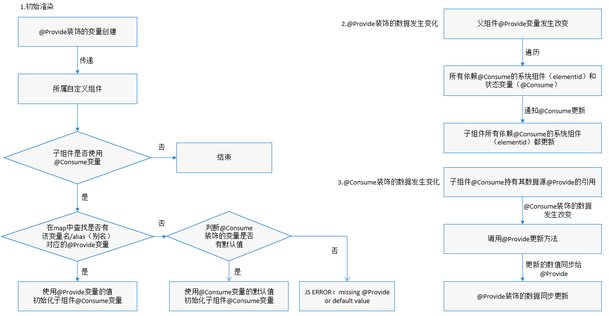

# \@Provide装饰器和\@Consume装饰器：与后代组件双向同步
<!--Kit: ArkUI-->
<!--Subsystem: ArkUI-->
<!--Owner: @liwenzhen3-->
<!--Designer: @zhangboren-->
<!--Tester: @TerryTsao-->
<!--Adviser: @zhang_yixin13-->

[\@Provide](../../reference/apis-arkui/arkui-ts/ts-state-management-provide.md#provide)和[\@Consume](../../reference/apis-arkui/arkui-ts/ts-state-management-consume.md#consume)，应用于与后代组件的双向数据同步、状态数据在多个层级之间传递的场景。不同于上文提到的父子组件之间通过命名参数机制传递，\@Provide和\@Consume摆脱参数传递机制的束缚，实现跨层级传递。

其中\@Provide装饰的变量是在祖先组件中，可以理解为被“提供”给后代的状态变量。\@Consume装饰的变量是在后代组件中，去“消费（绑定）”祖先组件提供的变量。

\@Provide/\@Consume是跨组件层级的双向同步。在阅读\@Provide和\@Consume文档前，建议开发者对UI范式基本语法和自定义组件有基本的了解。建议提前阅读：[基本语法概述](./arkts-basic-syntax-overview.md)，[声明式UI描述](./arkts-declarative-ui-description.md)，[创建自定义组件](./arkts-create-custom-components.md)。最佳实践请参考[状态管理最佳实践](https://developer.huawei.com/consumer/cn/doc/best-practices/bpta-status-management)。常见问题请参考[状态管理常见问题](./arkts-state-management-faq.md)。

> **说明：**
>
> 从API version 9开始，这两个装饰器支持在ArkTS卡片中使用。
>
> 从API version 11开始，这两个装饰器支持在原子化服务中使用。
>
> API version 19及以前，\@Provide和\@Consume双向同步仅支持声明式节点场景。
>
> 从API version 20开始，@Consume装饰的变量支持设置默认值。当查找不到@Provide的匹配结果时，@Consume装饰的变量会使用默认值进行初始化；当查找到@Provide的匹配结果时，@Consume装饰的变量会优先使用@Provide匹配结果的值，默认值不生效。
>
> 从API version 20开始，通过配置[BuilderNode](../../reference/apis-arkui/js-apis-arkui-builderNode.md)的[BuildOptions](../../reference/apis-arkui/js-apis-arkui-builderNode.md#buildoptions12)参数`enableProvideConsumeCrossing`为true，使得\@Provide和\@Consume支持跨[BuilderNode](../../reference/apis-arkui/js-apis-arkui-builderNode.md)双向同步。但需要注意，BuilderNode会在上树前构造节点，所以BuilderNode内部定义的\@Consume需要设置默认值，并在BuilderNode上树后，重新获取最近的\@Provide数据，与之建立双向同步关系。具体可见[\@Consume在跨BuilderNode场景下和\@Provide建立双向同步](#consume在跨buildernode场景下和provide建立双向同步)。

## 概述

\@Provide/\@Consume装饰的状态变量有以下特性：

- \@Provide装饰的状态变量自动对其所有后代组件可用，开发者不需要多次在组件之间传递变量。

- 后代通过使用\@Consume获取\@Provide提供的变量，建立在\@Provide和\@Consume之间的双向数据同步，与[\@State](./arkts-state.md)/[\@Link](./arkts-link.md)不同的是，前者可以更便捷的在多层级父子组件之间传递。

- \@Provide和\@Consume通过变量名或者变量别名绑定，需要类型相同，否则会发生类型隐式转换，从而导致应用行为异常。
```ts
// 通过相同的变量名绑定
@Provide age: number = 0;
@Consume age: number;
   
// 通过相同的变量别名绑定
@Provide('a') id: number = 0;
@Consume('a') age: number;
   
// 通过Provide的变量别名和Consume的变量名相同绑定
@Provide('a') id: number = 0;
@Consume a: number;
   
// 通过Provide的变量名和Consume的变量别名绑定
@Provide id: number = 0;
@Consume('id') a: number;
   
```
当\@Provide指定变量别名时，会同时保存变量名与变量别名，\@Consume在查找时，会优先以变量别名作为查找值去匹配，如果没有别名则用变量名作为查找值，只要\@Consume提供的查找值与\@Provide保存的变量名或别名中任意一项一致，即可成功建立绑定关系。

## 装饰器说明

<!--Table: 25%; 75%-->
| \@Provide变量装饰器 | 说明                                       |
| -------------- | ---------------------------------------- |
| 装饰器参数          | 别名：常量字符串，可选。<br/>如果指定了别名，则通过别名来绑定变量；如果未指定别名，则通过变量名绑定变量。<br/>allowOverride：允许重写，string类型，可选。<br/>如果使用allowOverride指定别名，则别名可以被重写，即可以存在同名的@Provide变量。<br/>未使用allowOverride时则不允许重名。示例见[\@Provide支持allowOverride参数](#provide支持allowoverride参数)。 |
| 允许装饰的变量类型      | Object、class、string、number、boolean、enum类型，以及这些类型的数组。<br/>API version 10开始支持[Date类型](#装饰date类型变量)。<br/>API version 11及以上支持[Map](#装饰map类型变量)、[Set](#装饰set类型变量)类型、undefined和null类型、ArkUI框架定义的联合类型[Length](../../reference/apis-arkui/arkui-ts/ts-types.md#length)、[ResourceStr](../../reference/apis-arkui/arkui-ts/ts-types.md#resourcestr)、[ResourceColor](../../reference/apis-arkui/arkui-ts/ts-types.md#resourcecolor)类型以及这些类型的联合类型，示例见[@Provide和Consume支持联合类型实例](#provide和consume支持联合类型实例)。 |
| 不允许装饰的变量类型 | 不支持装饰Function类型。 |
| 初始化规则 | 必须定义本地默认值。<br/>可以从父组件传入非undefined类型变量，此时使用该传入变量进行初始化。<br/>父组件未传入或传入undefined类型变量时，使用本地默认值进行初始化。 |
| 同步规则        | **在子组件使用时：** <br/>不与父组件中的任何类型变量同步。<br/>父组件传入的外部变量对\@Provide初始化时，仅作为初始值，后续变量的变化不会同步至\@Provide。<br/>**在父组件使用时：** <br/>可以初始化子组件的常规变量、\@State、\@Link、[\@Prop](./arkts-prop.md)、\@Provide。<br/>\@Provide变量的变化会同步给子组件的\@Link、\@Prop变量。<br/>与后代子组件中别名匹配的\@Consume变量双同步。 |

  **图1** \@Provide初始化规则图示  


<!--Table: 25%; 75%-->
| \@Consume变量装饰器  | 说明                                                         |
| -------------------- | ------------------------------------------------------------ |
| 装饰器参数           | 别名：常量字符串，可选。<br/>如果指定了别名，则通过别名来绑定变量；如果未指定别名，则通过变量名绑定变量。 |
| 允许装饰的变量类型   | Object、class、string、number、boolean、enum类型，以及这些类型的数组。<br/>API version 10开始支持[Date类型](#装饰date类型变量)。<br/>API version 11及以上支持[Map](#装饰map类型变量)、[Set](#装饰set类型变量)类型、undefined和null类型、ArkUI框架定义的联合类型[Length](../../reference/apis-arkui/arkui-ts/ts-types.md#length)、[ResourceStr](../../reference/apis-arkui/arkui-ts/ts-types.md#resourcestr)、[ResourceColor](../../reference/apis-arkui/arkui-ts/ts-types.md#resourcecolor)类型以及这些类型的联合类型，示例见[@Provide和Consume支持联合类型实例](#provide和consume支持联合类型实例)。<br/>**说明：** <br/>API version 20之前，\@Consume装饰的变量，在其父组件或者祖先组件上，必须有对应的属性和别名的\@Provide装饰的变量。 |
| 不允许装饰的变量类型 | 不支持装饰Function类型。                                     |
| 初始化规则           | API version 20之前，\@Consume装饰的变量不支持本地设置默认值，必须要有与其匹配的\@Provide装饰的变量。<br/>从API version 20开始，\@Consume支持设置默认值。若存在匹配成功的\@Provide，则会使用\@Provide的变量值作为初始值。若未匹配到\@Provide变量，则使用本地默认值。示例见[\@Consume装饰的变量支持设置默认值](#consume装饰的变量支持设置默认值)。 |
| 同步规则             | **在子组件使用时：** <br/>与祖先组件匹配的\@Provide变量双向同步。<br/>**在父组件使用时：** <br/>可以初始化子组件的常规变量、\@State、\@Link、\@Prop、\@Provide。<br/>@Consume变量的变化会同步给子组件的\@Link、\@Prop变量。 |

  **图2** \@Consume初始化规则图示  


## 观察变化和行为表现

### 观察变化

- 当装饰的数据类型为boolean、string、number类型时，可以观察到数值的变化。

- 当装饰的数据类型为class或者Object的时候，可以观察到赋值和属性赋值的变化（属性为Object.keys(observedObject)返回的所有属性）。

- 当装饰Array时，可以观察到数组本身、数组项的赋值及其API操作带来的变化。详见[装饰Array类型变量](#装饰array类型变量)。

- 当装饰的对象是Date时，可以观察到Date整体的赋值，同时可通过调用Date的接口`setFullYear`, `setMonth`, `setDate`, `setHours`, `setMinutes`, `setSeconds`, `setMilliseconds`, `setTime`, `setUTCFullYear`, `setUTCMonth`, `setUTCDate`, `setUTCHours`, `setUTCMinutes`, `setUTCSeconds`, `setUTCMilliseconds` 更新Date的属性，详见[装饰Date类型变量](#装饰date类型变量)。

- 当装饰的变量是Map时，可以观察到Map整体的赋值，同时可通过调用Map的接口`set`, `clear`, `delete` 更新Map的值。详见[装饰Map类型变量](#装饰map类型变量)。

- 当装饰的变量是Set时，可以观察到Set整体的赋值，同时可通过调用Set的接口`add`, `clear`, `delete` 更新Set的值。详见[装饰Set类型变量](#装饰set类型变量)。

### 框架行为

1. 初始渲染：
   1. \@Provide装饰的变量会以Map的形式，传递给当前\@Provide所属组件的所有子组件。
   2. 子组件中如果使用\@Consume变量，则会在Map中查找是否有该变量名/alias（别名）对应的\@Provide的变量。在API version 20之前，如果查找不到，框架会抛出JS ERROR。从API version 20开始，如果查找不到，会判断\@Consume装饰的变量是否设置了默认值，如果没有设置默认值，框架会抛出JS ERROR。
   3. 在初始化\@Consume变量时，如果在Map中有该变量名/alias（别名）对应的\@Provide的变量，则和\@State/\@Link的流程类似，\@Consume变量会在Map中查找到对应的\@Provide变量进行保存，并把自己注册给\@Provide。
   4. 从API version 20开始，在初始化\@Consume变量时，如果在Map中没有该变量名/alias（别名）对应的\@Provide的变量，而\@Consume的变量设置了默认值时，\@Consume变量会利用默认值创建一个临时的数据源，保证通知链路的连续性。

2. 当\@Provide装饰的数据变化时：
   1. 通过初始渲染的步骤可知，子组件\@Consume已把自己注册给父组件。父组件\@Provide变量变更后，会遍历更新所有依赖它的系统组件（elementid）和状态变量（\@Consume）。
   2. 通知\@Consume更新后，子组件所有依赖\@Consume的系统组件（elementId）都会被通知更新。以此实现\@Provide对\@Consume状态数据同步。

3. 当\@Consume装饰的数据变化时：

   通过初始渲染的步骤可知，子组件\@Consume持有\@Provide的实例。在\@Consume更新后调用\@Provide的更新方法，将更新的数值同步回\@Provide，以此实现\@Consume向\@Provide的同步更新。



## 限制条件

1. \@Provide/\@Consume的参数key必须为string类型，否则编译时会报错。

    ```ts
    // 错误写法，编译报错
    let change: number = 10;
    @Provide(change) message: string = 'Hello';
    
    // 正确写法
    let change: string = 'change';
    @Provide(change) message: string = 'Hello';
    ```

2. \@Consume装饰的变量不能在构造参数中传入初始化，否则编译时会报错。\@Consume仅能通过key来匹配对应的\@Provide变量或者从API version 20开始设置默认值进行初始化。

   【反例】

   ```ts
   @Component
   struct Child {
     @Consume msg: string;
   
     build() {
       Text(this.msg)
     }
   }
   
   @Entry
   @Component
   struct Parent {
     @Provide message: string = 'Hello';
   
     build() {
       Column() {
         // 错误写法，不允许外部传入初始化
         Child({msg: 'Hello'})
       }
     }
   }
   ```

   【正例】
   <!-- @[provide_consume_proper_demo](https://gitcode.com/openharmony/applications_app_samples/blob/master/code/DocsSample/ArkUISample/ParadigmStateManagement/entry/src/main/ets/pages/provideAndConsume/ProvideConsumeProperDemo.ets) --> 
   
   ``` TypeScript
   @Component
   struct Child {
     @Consume num: number;
     // 从API version 20开始，@Consume装饰的变量支持设置默认值
     @Consume num1: number = 17;
   
     build() {
       Column() {
         Text(`Value of num: ${this.num}`)
         Text(`Value of num1: ${this.num1}`)
       }
     }
   }
   
   @Entry
   @Component
   struct Parent {
     @Provide num: number = 10;
   
     build() {
       Column() {
         Text(`Value of num: ${this.num}`)
         Child()
       }
     }
   }
   ```

   

3. \@Provide的key重复定义时，框架会抛出运行时错误，从API version 23开始，将返回错误码[140114](../../reference/apis-arkui/errorcode-stateManagement.md#140114-声明重复key的provide)，提醒开发者重复定义key。如果开发者需要重复key，可以使用[allowOverride](#provide支持allowoverride参数)。

    ```ts
    // 错误写法，a重复定义
    @Provide('a') count: number = 10;
    @Provide('a') num: number = 10;
    
    // 正确写法
    @Provide('a') count: number = 10;
    @Provide('b') num: number = 10;
    ```

4. 在API version 20之前，初始化\@Consume变量时，如果开发者没有定义对应key的\@Provide变量，框架会抛出运行时错误，提示开发者初始化\@Consume变量失败，原因是无法找到其对应key的\@Provide变量。从API version 20开始，初始化\@Consume变量时，如果开发者没有定义对应key的\@Provide变量，同时没有设置默认值，框架会抛出运行时错误，从API version 23开始，将返回错误码[140112](../../reference/apis-arkui/errorcode-stateManagement.md#140112-consume缺失对应的provide)，提示开发者初始化\@Consume变量失败，原因是无法找到其对应key的\@Provide变量同时也没有设置默认值。

   【反例】

    ```ts
    @Component
    struct Child {
      @Consume num: number;
    
      build() {
        Column() {
          Text(`num的值: ${this.num}`)
        }
      }
    }
    
    @Entry
    @Component
    struct Parent {
      // 错误写法，缺少@Provide
      num: number = 10;
    
      build() {
        Column() {
          Text(`num的值: ${this.num}`)
          Child()
        }
      }
    }
    ```

   【正例】
   <!-- @[provide_consume_proper_demo_two](https://gitcode.com/openharmony/applications_app_samples/blob/master/code/DocsSample/ArkUISample/ParadigmStateManagement/entry/src/main/ets/pages/provideAndConsume/ProvideConsumeProperDemoTwo.ets) --> 
   
   ``` TypeScript
   @Component
   struct Child {
     @Consume num: number;
     // 正确写法 从API version 20开始，@Consume装饰的变量支持设置默认值
     @Consume numWithDefaultValue: number = 6;
   
     build() {
       Column() {
         Text(`Value of num: ${this.num}`)
         Text(`Value of numWithDefaultValue: ${this.numWithDefaultValue}`)
       }
     }
   }
   
   @Entry
   @Component
   struct Parent {
     // 正确写法
     @Provide num: number = 10;
   
     build() {
       Column() {
         Text(`Value of num: ${this.num}`)
         Child()
       }
     }
   }
   ```

   

5. \@Provide与\@Consume不支持装饰Function类型的变量，API version 23之前，应用在运行时会出现错误。

   从API version 23开始，在应用编译时添加了相关校验，\@Provide与\@Consume装饰Function类型变量会提示ERROR，应在代码中删除Function类型变量的\@Provide或\@Consume装饰器。

6. 从API version 20开始，支持跨BuilderNode配对\@Provide/\@Consume。在BuilderNode上树时，\@Consume通过key匹配找到最近的\@Provide，两者类型需要一致，如果不一致，则会抛出运行时错误。

   需要注意类型不相等判断，包括类实例的判断，比如：

   ```ts
   class A {}
   class B {}
   // 两个message都为object类型，但其构造函数不同，属于不同类型
   @Provide message: A = new A();
   @Consume message: B = new B();
   ```

   在非BuilderNode场景中，仍建议配对的\@Provide/\@Consume类型一致。虽然在运行时不会有强校验，但在\@Consume装饰的变量初始化时，会隐式转换成\@Provide装饰变量的类型。

   <!-- @[provide_consume_Builder_Node](https://gitcode.com/openharmony/applications_app_samples/blob/master/code/DocsSample/ArkUISample/ParadigmStateManagement/entry/src/main/ets/pages/provideAndConsume/ProvideConsumeBuilderNode.ets) -->
   
   ``` TypeScript
   import { NodeController, BuilderNode, FrameNode, UIContext } from '@kit.ArkUI';
   
   @Builder
   function buildText() {
     Column() {
       Child()
     }
   }
   
   class TextNodeController extends NodeController {
     private builderNode: BuilderNode<[]> | null = null;
   
     constructor() {
       super();
     }
   
     makeNode(context: UIContext): FrameNode | null {
       this.builderNode = new BuilderNode(context);
       // 配置跨BuilderNode支持@Provide/@Consume
       this.builderNode.build(wrapBuilder(buildText), undefined,
         { enableProvideConsumeCrossing: true });
       // 将BuilderNode的根节点挂载到NodeContainer
       return this.builderNode.getFrameNode();
     }
   }
   
   @Entry
   @Component
   struct Index {
     @Provide message: string = 'Hello World';
     controller: TextNodeController = new TextNodeController();
   
     build() {
       Column() {
         Text(`@Provide: ${this.message}`)
         NodeContainer(this.controller)
           .width('100%')
           .height(100)
       }
       .width('100%')
       .height('100%')
     }
   }
   
   @Component
   struct Child {
     // 错误用法：Child通过BuilderNode上树后，@Consume和Index中的@Provide建立连接时发现类型不一致，抛出运行时错误
     // @Consume message: number = 0;
   
     // 正确用法：@Consume和@Provide保持类型一致
     @Consume message: string = 'Hello ArkUI';
   
     build() {
       Column() {
         Text(`@Consume: ${this.message}`)
       }
       .width('100%')
     }
   }
   ```

   

7. 父组件传入undefined时，\@Provide装饰的变量仍使用本地默认值进行初始化。
   
   <!-- @[provide_consume_undefined](https://gitcode.com/openharmony/applications_app_samples/blob/master/code/DocsSample/ArkUISample/ParadigmStateManagement/entry/src/main/ets/pages/provideAndConsume/ProvideConsumeUndefined.ets) -->  
   
   ``` TypeScript
   @Entry
   @Component
   struct Parent {
     @State count: number | undefined = undefined;
   
     build() {
       Column() {
         Text(`Parent count value: ${this.count}`)
           .fontSize(20)
           .margin(10)
         Child({ count: this.count })
       }
     }
   }
   
   @Component
   struct Child {
     // 父组件传入undefined时，@Provide装饰的变量仍使用本地默认值进行初始化
     @Provide count: number | undefined = 0;
   
     build() {
       Column() {
         Text(`Child count value: ${this.count}`)
           .fontSize(20)
           .margin(10)
       }
     }
   }
   ```

   

## 使用场景

### @Provide变量与@Consume变量建立双向绑定

以下示例是@Provide变量与后代组件中@Consume变量进行双向同步的场景。当分别点击ToDo和ToDoItem组件内的Button时，count的更改会双向同步在ToDo和ToDoItem中。

<!-- @[provide_consume_bidirectional_sync](https://gitcode.com/openharmony/applications_app_samples/blob/master/code/DocsSample/ArkUISample/ParadigmStateManagement/entry/src/main/ets/pages/provideAndConsume/ProvideConsumeBidirectionalSync.ets) --> 

``` TypeScript
@Component
struct ToDoItem {
  // @Consume装饰的变量通过相同的属性名绑定其祖先组件ToDo内的@Provide装饰的变量
  @Consume count: number;

  build() {
    Column() {
      Text(`count(${this.count})`)
        .fontSize(15)
        .margin(10)
      Button(`count(${this.count}), count + 1`)
        .onClick(() => this.count += 1)
        .width(150)
        .margin(10)
    }
    .width('50%')
  }
}

@Component
struct ToDoList {
  build() {
    Row({ space: 5 }) {
      ToDoItem()
      ToDoItem()
    }
  }
}

@Component
struct ToDoDemo {
  build() {
    ToDoList()
  }
}

@Entry
@Component
struct ToDo {
  // @Provide装饰的变量count由入口组件ToDo提供其后代组件
  @Provide count: number = 0;

  build() {
    Column() {
      Button(`count(${this.count}), count + 1`)
        .onClick(() => this.count += 1)
        .width(300)
        .margin(10)
      ToDoDemo()
    }
    .width('100%')
  }
}
```


### 装饰Array类型变量

以下示例中，message类型为`number[]`，点击Button改变message的值，视图会随之刷新。

<!-- @[provide_consume_array_sync](https://gitcode.com/openharmony/applications_app_samples/blob/master/code/DocsSample/ArkUISample/ParadigmStateManagement/entry/src/main/ets/pages/provideAndConsume/ProvideConsumeArraySync.ets) --> 

``` TypeScript
@Entry
@Component
struct Index {
  @Provide message: number[] = [0, 1, 2, 3];

  build() {
    Column() {
      ForEach(this.message, (item: number) => {
        Text(`Provide ${item}`)
          .fontSize(20)
          .margin(10)
      })
      // 新增数组元素，触发UI刷新
      Button('Push element')
        .onClick(() => {
          this.message.push(4);
        })
        .width(300)
        .margin(10)
      // 删除数组元素，触发UI刷新
      Button('Pop element')
        .onClick(() => {
          this.message.pop();
        })
        .width(300)
        .margin(10)
      Child()
    }
    .width('100%')
  }
}

@Component
struct Child {
  @Consume message: number[] = [0, 1, 2, 3];

  build() {
    Row() {
      Column() {
        ForEach(this.message, (item: number) => {
          Text(`Consume ${item}`)
            .fontSize(20)
            .margin(10)
        })
        // 对数组整体重新赋值，触发UI刷新
        Button('Reset array')
          .onClick(() => {
            this.message = [9, 8, 7, 6];
          })
          .width(300)
          .margin(10)
        // 更新数组元素，触发UI刷新
        Button('Modify element[0]')
          .onClick(() => {
            this.message[0] = 10;
          })
          .width(300)
          .margin(10)
      }
      .width('100%')
    }
  }
}
```


### 装饰Map类型变量

> **说明：**
>
> 从API version 11开始，\@Provide，\@Consume支持Map类型。

以下示例中，message类型为Map\<number, string\>，点击Button改变message的值，视图会随之刷新。

<!-- @[provide_consume_map_sync](https://gitcode.com/openharmony/applications_app_samples/blob/master/code/DocsSample/ArkUISample/ParadigmStateManagement/entry/src/main/ets/pages/provideAndConsume/ProvideConsumeMapSync.ets) -->  

``` TypeScript
@Component
struct Child {
  @Consume message: Map<number, string>

  build() {
    Column() {
      ForEach(Array.from(this.message.entries()), (item: [number, string]) => {
        Text(`${item[0]}`)
          .fontSize(30)
          .margin(10)
        Text(`${item[1]}`)
          .fontSize(30)
          .margin(10)
        Divider()
      })
      // message被@Consume装饰，可以被观察到Map整体的赋值以及调用Map接口带来的变化
      Button('Consume init Map')
        .onClick(() => {
          this.message = new Map([[0, 'a'], [1, 'b'], [3, 'c']]);
        })
        .width(300)
        .margin(10)
      Button('Consume set new one')
        .onClick(() => {
          this.message.set(4, 'd');
        })
        .width(300)
        .margin(10)
      Button('Consume clear')
        .onClick(() => {
          this.message.clear();
        })
        .width(300)
        .margin(10)
      Button('Consume replace the first item')
        .onClick(() => {
          this.message.set(0, 'aa');
        })
        .width(300)
        .margin(10)
      Button('Consume delete the first item')
        .onClick(() => {
          this.message.delete(0);
        })
        .width(300)
        .margin(10)
    }
    .width('100%')
  }
}


@Entry
@Component
struct MapSample {
  @Provide message: Map<number, string> = new Map([[0, 'a'], [1, 'b'], [3, 'c']])

  build() {
    Row() {
      Column() {
        // message被@Provide装饰，可以被观察到Map整体的赋值以及调用Map接口带来的变化
        Button('Provide init Map')
          .onClick(() => {
            this.message = new Map([[0, 'a'], [1, 'b'], [3, 'c'], [4, 'd']]);
          })
          .width(300)
          .margin(10)
        Child()
      }
      .width('100%')
    }
  }
}
```


### 装饰Set类型变量

> **说明：**
>
> 从API version 11开始，\@Provide，\@Consume支持Set类型。

以下示例中，message类型为Set\<number\>，点击Button改变message的值，视图会随之刷新。

<!-- @[provide_consume_set_sync](https://gitcode.com/openharmony/applications_app_samples/blob/master/code/DocsSample/ArkUISample/ParadigmStateManagement/entry/src/main/ets/pages/provideAndConsume/ProvideConsumeSetSync.ets) -->  

``` TypeScript
@Component
struct Child {
  @Consume message: Set<number>

  build() {
    Column() {
      ForEach(Array.from(this.message.entries()), (item: [number, number]) => {
        Text(`${item[0]}`)
          .fontSize(30)
          .margin(10)
        Divider()
      })
      // message被@Consume装饰，可以被观察到Set整体的赋值以及调用Set接口带来的变化
      Button('Consume init set')
        .onClick(() => {
          this.message = new Set([0, 1, 2, 3, 4]);
        })
        .width(300)
        .margin(10)
      Button('Consume set new one')
        .onClick(() => {
          this.message.add(5);
        })
        .width(300)
        .margin(10)
      Button('Consume clear')
        .onClick(() => {
          this.message.clear();
        })
        .width(300)
        .margin(10)
      Button('Consume delete the first one')
        .onClick(() => {
          this.message.delete(0);
        })
        .width(300)
        .margin(10)
    }
    .width('100%')
  }
}


@Entry
@Component
struct SetSample {
  @Provide message: Set<number> = new Set([0, 1, 2, 3, 4])

  build() {
    Row() {
      Column() {
        // message被@Provide装饰，可以被观察到Set整体的赋值以及调用Set接口带来的变化
        Button('Provide init set')
          .onClick(() => {
            this.message = new Set([0, 1, 2, 3, 4, 5]);
          })
          .width(300)
          .margin(10)
        Child()
      }
      .width('100%')
    }
  }
}
```


### 装饰Date类型变量

以下示例中，selectedDate类型为Date，点击Button改变selectedDate的值，视图会随之刷新。

<!-- @[provide_consume_date_sync](https://gitcode.com/openharmony/applications_app_samples/blob/master/code/DocsSample/ArkUISample/ParadigmStateManagement/entry/src/main/ets/pages/provideAndConsume/ProvideConsumeDateSync.ets) -->  

``` TypeScript
@Component
struct Child {
  @Consume selectedDate: Date;

  build() {
    Column() {
      // selectedDate被@Consume装饰，可以被观察到Date整体的赋值以及调用Date接口带来的变化
      Button(`child increase the day by 1`)
        .onClick(() => {
          this.selectedDate.setDate(this.selectedDate.getDate() + 1);
        })
        .width(300)
        .margin(10)
      Button('child update the new date')
        .margin(10)
        .onClick(() => {
          this.selectedDate = new Date('2023-09-09');
        })
        .width(300)
      DatePicker({
        start: new Date('1970-1-1'),
        end: new Date('2100-1-1'),
        selected: this.selectedDate
      })
    }
    .width('100%')
  }
}

@Entry
@Component
struct Parent {
  @Provide selectedDate: Date = new Date('2021-08-08')

  build() {
    Column() {
      // selectedDate被@Provide装饰，可以被观察到Date整体的赋值以及调用Date接口带来的变化
      Button('parent increase the day by 1')
        .margin(10)
        .onClick(() => {
          this.selectedDate.setDate(this.selectedDate.getDate() + 1);
        })
        .width(300)
      Button('parent update the new date')
        .margin(10)
        .onClick(() => {
          this.selectedDate = new Date('2023-07-07');
        })
        .width(300)
      DatePicker({
        start: new Date('1970-1-1'),
        end: new Date('2100-1-1'),
        selected: this.selectedDate
      })
      Child()
    }
    .width('100%')
  }
}
```


### @Provide和@Consume支持联合类型实例

@Provide和@Consume支持联合类型和undefined和null。以下示例中，count类型为string | undefined，当点击祖先组件Ancestors中的Button改变count的属性或者类型时，Child中也会对应刷新。

<!-- @[provide_consume_Provide_Consume](https://gitcode.com/openharmony/applications_app_samples/blob/master/code/DocsSample/ArkUISample/ParadigmStateManagement/entry/src/main/ets/pages/provideAndConsume/ProvideConsumeFederation.ets) --> 

``` TypeScript
@Component
struct Child {
  // @Consume装饰的变量通过相同的属性名绑定其祖先组件Ancestors内的@Provide装饰的变量
  @Consume count: string | undefined;

  build() {
    Column() {
      Text(`count(${this.count})`)
        .fontSize(20)
        .margin(10)
      Button(`count(${this.count}), Child`)
        .onClick(() => this.count = 'Ancestors')
        .width(300)
        .margin(10)
    }
    .width('50%')
  }
}

@Component
struct Parent {
  build() {
    Row({ space: 5 }) {
      Child()
    }
  }
}

@Entry
@Component
struct Ancestors {
  // @Provide装饰的联合类型count由入口组件Ancestors提供其后代组件
  @Provide count: string | undefined = 'Child';

  build() {
    Column() {
      Button(`count(${this.count}), Child`)
        .onClick(() => this.count = undefined)
        .width(300)
        .margin(10)
      Parent()
    }
    .width('100%')
  }
}
```


### \@Provide支持allowOverride参数

allowOverride：\@Provide重写选项。

> **说明：**
>
> 从API version 11开始使用。

| 名称   | 类型   | 必填 | 说明                                                         |
| ------ | ------ | ---- | ------------------------------------------------------------ |
| allowOverride | string | 否 | 是否允许@Provide重写。允许在同一组件树下通过allowOverride重写同名的@Provide。如果开发者未写allowOverride，定义同名的@Provide，运行时会报错。 |

<!-- @[Provide_Consume_Provide_AllowOverride1](https://gitcode.com/openharmony/applications_app_samples/blob/master/code/DocsSample/ArkUISample/ParadigmStateManagement/entry/src/main/ets/pages/provideAndConsume/ProvideConsumeProvideAllowOverride.ets) -->  

``` TypeScript
@Component
struct MyComponent {
  // 使用allowOverride参数重写同名的@Provide
  @Provide({ allowOverride: 'reviewVotes' }) reviewVotes: number = 10;

  build() {
  }

}
```

完整示例如下：

<!-- @[Provide_Consume_Provide_AllowOverride2](https://gitcode.com/openharmony/applications_app_samples/blob/master/code/DocsSample/ArkUISample/ParadigmStateManagement/entry/src/main/ets/pages/provideAndConsume/ProvideConsumeProvideAllowOverride.ets) --> 

``` TypeScript
@Component
struct GrandSon {
  // @Consume装饰的变量通过相同的属性名绑定其祖先内的@Provide装饰的变量
  @Consume('reviewVotes') reviewVotes: number;

  build() {
    Column() {
      Text(`reviewVotes(${this.reviewVotes})`) // Text显示10
        .fontSize(20)
        .margin(10)
      Button(`reviewVotes(${this.reviewVotes}), give +1`)
        .onClick(() => this.reviewVotes += 1)
        .width(300)
        .margin(10)
    }
    .width('50%')
  }
}

@Component
struct Child {
  @Provide({ allowOverride: 'reviewVotes' }) reviewVotes: number = 10;

  build() {
    Row({ space: 5 }) {
      GrandSon()
    }
  }
}

@Component
struct Parent {
  @Provide({ allowOverride: 'reviewVotes' }) reviewVotes: number = 20;

  build() {
    Child()
  }
}

@Entry
@Component
struct GrandParent {
  @Provide('reviewVotes') reviewVotes: number = 40;

  build() {
    Column() {
      Button(`reviewVotes(${this.reviewVotes}), give +1`)
        .onClick(() => this.reviewVotes += 1)
        .width(300)
        .margin(10)
      Parent()
    }
    .width('100%')
  }
}
```


在上面的示例中：
- GrandParent声明了@Provide('reviewVotes') reviewVotes: number = 40。
- Parent是GrandParent的子组件，声明@Provide为allowOverride，重写父组件GrandParent的@Provide('reviewVotes') reviewVotes: number = 40。如果不设置allowOverride，则会抛出运行时报错，提示@Provide重复定义。Child同理。
- GrandSon在初始化@Consume的时候，@Consume装饰的变量通过相同的属性名绑定其最近的祖先的@Provide装饰的变量。
- GrandSon查找到相同属性名的@Provide在祖先Child中，所以@Consume('reviewVotes') reviewVotes: number初始化数值为10。如果Child中没有定义与@Consume同名的@Provide，则继续向上寻找Parent中的同名@Provide值为20，以此类推。
- 如果查找到根节点还没有找到key对应的@Provide，则会报初始化@Consume找不到@Provide的报错。

### \@Consume装饰的变量支持设置默认值

> **说明：**
>
> 从API version 20开始，\@Consume装饰的变量支持设置默认值。

<!-- @[Provide_Consume_Decorated_Variable1](https://gitcode.com/openharmony/applications_app_samples/blob/master/code/DocsSample/ArkUISample/ParadigmStateManagement/entry/src/main/ets/pages/provideAndConsume/ProvideConsumeDecoratedVariable.ets) -->  

``` TypeScript
@Component
struct MyComponent {
  // @Consume装饰的变量设置默认值
  @Consume('withDefault') defaultValue: number = 10;

  build() {
  }

}
```

完整示例如下：

<!-- @[Provide_Consume_Decorated_Variable2](https://gitcode.com/openharmony/applications_app_samples/blob/master/code/DocsSample/ArkUISample/ParadigmStateManagement/entry/src/main/ets/pages/provideAndConsume/ProvideConsumeDecoratedVariable.ets) --> 

``` TypeScript
@Entry
@Component
struct Parent {
  @Provide('firstKey') provideOne: string | undefined = undefined;
  @Provide('secondKey') provideTwo: string = 'the second provider';

  build() {
    Column() {
      Row() {
        Column() {
          Text(`${this.provideOne}`)
            .fontSize(20)
            .margin(10)
          Text(`${this.provideTwo}`)
            .fontSize(20)
            .margin(10)
        }
        .width('100%')

        Column() {
          // 点击change provideOne按钮，provideOne和子组件中的textOne属性会同时变化
          Button('change provideOne')
            .onClick(() => {
              this.provideOne = undefined;
            })
            .width(300)
            .margin(10)
          // 点击change provideTwo按钮，provideTwo和子组件中的textTwo属性会同时变化
          Button('change provideTwo')
            .onClick(() => {
              this.provideTwo = 'the next provider';
            })
            .width(300)
            .margin(10)
        }
        .width('100%')
      }

      Row() {
        Column() {
          Child()
        }
        .width('100%')
      }
    }
    .width('100%')
  }
}

@Component
struct Child {
  // @Consume装饰的变量通过相同的别名绑定其祖先内的@Provide装饰的变量，同时设置默认值
  @Consume('firstKey') textOne: string | undefined = 'child';
  // @Consume装饰的变量通过相同的别名绑定其祖先内的@Provide装饰的变量，没有设置默认值
  @Consume('secondKey') textTwo: string;
  // @Consume装饰的变量在祖先内没有匹配成功的@Provide装饰的变量，但设置了默认值
  @Consume('thirdKey') textThree: string = 'defaultValue';

  build() {
    Column() {
      Text(`${this.textOne}`)
        .fontSize(20)
        .margin(10)
      Text(`${this.textTwo}`)
        .fontSize(20)
        .margin(10)
      Text(`${this.textThree}`)
        .fontSize(20)
        .margin(10)
      // 点击change textOne按钮，textOne和父组件的provideOne会同时变化
      Button('change textOne')
        .onClick(() => {
          this.textOne = 'not undefined';
        })
        .width(300)
        .margin(10)
      // 点击change textTwo按钮，textTwo和父组件的provideTwo会同时变化
      Button('change textTwo')
        .onClick(() => {
          this.textTwo = 'change textTwo';
        })
        .width(300)
        .margin(10)
    }
    .width('100%')
  }
}
```


在上面的示例中：
- Parent声明了@Provide('firstKey') provideOne: string | undefined = undefined 与 @Provide('secondKey') provideTwo: string = 'the second provider'。
- Child声明了@Consume('firstKey') textOne: string | undefined = 'child'，@Consume('secondKey') textTwo: string 与 @Consume('thirdKey') textThree: string = 'defaultValue'。
- Child是Parent的子组件，Child在初始化@Consume装饰的三个属性时，textOne根据'firstKey'别名绑定Parent中的provideOne属性，provideOne的值会覆盖textOne的默认值，所以textOne初始化的值为undefined；textTwo根据'secondKey'别名绑定Parent中的provideTwo属性，textTwo初始化的值为'the second provider'；textThree在祖先组件中不存在匹配结果，如果@Consume没有设置默认值，则会抛出运行时错误，示例中textThree有默认值'defaultValue'，所以textThree初始化的值为'defaultValue'。
- @Consume装饰的属性设置的默认值仅在祖先组件没有匹配结果时才生效，有匹配结果时无影响。

### \@Consume在跨BuilderNode场景下和\@Provide建立双向同步

> **说明：**
>
> 从API version 20开始，支持跨BuilderNode配对\@Provide/\@Consume。

BuilderNode支持\@Provide/\@Consume，需注意：
1. 在BuilderNode子树中定义的\@Consume需要设置默认值，或者在子树中已存在配对的\@Provide，否则会发生运行时报错。
2. BuilderNode上树后，设置默认值的\@Consume会向上查找\@Provide，根据key的匹配规则找到最近的\@Provide后，会和\@Provide建立双向同步关系。如果找不到配对的\@Provide，则\@Consume仍使用默认值。
3. 建立双向同步的关系后，如果\@Provide装饰变量的值和\@Consume的默认值不同，则会回调\@Consume的[\@Watch](./arkts-watch.md)方法，以及与\@Consume有同步关系的变量的\@Watch方法，例如\@Consume通知与其双向同步的\@Link触发\@Watch方法。
4. BuilderNode下树后，\@Consume会再次试图查找对应的\@Provide，如果发现下树后无法再找到之前配对的\@Provide，则断开和\@Provide的双向同步关系，\@Consume装饰的变量恢复成默认值。
5. \@Consume断开和\@Provide的连接，恢复成默认值时，会判断\@Consume装饰变量的值从和\@Provide变为\@Consume的默认值是否有变化，如果有变化，则会回调\@Consume以及与其有同步关系变量的\@Watch方法。

在下面的例子中：
1. 点击`add Child`:
   - 构建BuilderNode下的子节点`Child`，`Child`中\@Consume未找到\@Provide，使用本地默认值`default value`初始化。
   - BuilderNode上树时，`Child`中\@Consume向上找到最近的`Index`中的\@Provide，将\@Consume从默认值更新为\@Provide的值，并回调\@Consume的\@Watch方法。
2. \@Provide和\@Consume配对后，建立双向同步关系。点击```Text(`@Provide: ${this.message}`)```和```Text(`@Consume ${this.message}`)```，\@Provide和\@Consume绑定的Text组件刷新，并回调\@Provide和\@Consume的\@Watch方法。
3. 点击`remove Child`, BuilderNode子节点下树，`Child`中的\@Consume和`Index`中的\@Provide断开连接，`Child`中的\@Consume恢复成默认值，并回调\@Consume的\@Watch方法。
4. 点击`dispose Child`，释放BuilderNode下子节点，BuilderNode子节点`Child`销毁，执行[aboutToDisappear](../../reference/apis-arkui/arkui-ts/ts-custom-component-lifecycle.md#abouttodisappear)。
<!-- @[provide_consume_Two_Way](https://gitcode.com/openharmony/applications_app_samples/blob/master/code/DocsSample/ArkUISample/ParadigmStateManagement/entry/src/main/ets/pages/provideAndConsume/ProvideConsumeTwoWay.ets) -->  

``` TypeScript
import { NodeController, BuilderNode, FrameNode, UIContext } from '@kit.ArkUI';
import { hilog } from '@kit.PerformanceAnalysisKit';

const DOMAIN = 0x0000;

@Builder
function buildText() {
  Column() {
    Child()
  }
  .width('100%')
}

class TextNodeController extends NodeController {
  private rootNode: FrameNode | null = null;
  private uiContext: UIContext | null = null;
  private builderNode: BuilderNode<[]> | null = null;

  constructor() {
    super();
  }

  makeNode(context: UIContext): FrameNode | null {
    this.rootNode = new FrameNode(context);
    this.uiContext = context;
    // 将rootNode节点挂载在NodeContainer下
    return this.rootNode;
  }

  addBuilderNode(): void {
    if (this.builderNode === null && this.uiContext && this.rootNode) {
      this.builderNode = new BuilderNode(this.uiContext);
      // 配置跨BuilderNode支持@Provide/@Consume
      this.builderNode.build(wrapBuilder(buildText), undefined,
        { enableProvideConsumeCrossing: true });
      // 将BuilderNode的根节点挂载到rootNode节点下
      try {
        this.rootNode.appendChild(this.builderNode.getFrameNode());
      } catch (e) {
        hilog.error(DOMAIN, 'testTag', 'Failed to appendChild %{public}s', JSON.stringify(e) ?? '');
      }
    }
  }

  removeBuilderNode(): void {
    if (this.rootNode && this.builderNode) {
      // 从rootNode节点下的BuildNode节点移除
      try {
        this.rootNode.removeChild(this.builderNode.getFrameNode());
      } catch (e) {
        hilog.error(DOMAIN, 'testTag', 'Failed to removeChild %{public}s', JSON.stringify(e) ?? '');
      }
    }
  }

  disposeNode(): void {
    if (this.rootNode && this.builderNode) {
      // 立即释放当前BuilderNode
      this.builderNode.dispose();
    }
  }
}

@Entry
@Component
struct Index {
  @Provide @Watch('onChange') message: string = 'hello';
  controller: TextNodeController = new TextNodeController();

  onChange() {
    hilog.info(DOMAIN, 'testTag', '%{public}s', `Index Provide change ${this.message}`);
  }

  build() {
    Column() {
      Text(`@Provide: ${this.message}`)
        .fontSize(20)
        .onClick(() => {
          this.message += ' Provide';
        })
        .margin(10)

      // 执行BuilderNode的build方法，构造Child自定义组件
      // 并将BuilderNode挂载在NodeContainer下
      // Child中@Consume可以和当前Index中的@Provide配对
      // @Consume装饰的变量message从default value变为hello，并回调@Consume的@Watch方法
      Button('add Child')
        .onClick(() => {
          this.controller.addBuilderNode();
        })
        .width(300)
        .margin(10)
      // 将BuilderNode下的节点从NodeContainer上移除
      // @Consume修饰的变量message从和@Provide配对的值变为default value，并回调@Consume的@Watch方法
      Button('remove Child')
        .onClick(() => {
          this.controller.removeBuilderNode();
        })
        .width(300)
        .margin(10)

      // 立即释放当前BuilderNode，BuilderNode下节点销毁，Child组件执行aboutToDisappear
      Button('dispose Child')
        .onClick(() => {
          this.controller.disposeNode();
        })
        .width(300)
        .margin(10)
      NodeContainer(this.controller)
        .width('100%')
        .height(100)
        .backgroundColor(Color.Pink)
    }
    .width('100%')
    .height('100%')
  }
}


@Component
struct Child {
  @Consume @Watch('onChange') message: string = 'default value';

  onChange() {
    hilog.info(DOMAIN, 'testTag', '%{public}s', `Child Consume change ${this.message}`);
  }

  aboutToDisappear(): void {
    hilog.info(DOMAIN, 'testTag', '%{public}s', `Child aboutToDisappear`);
  }

  build() {
    Column() {
      Text(`@Consume ${this.message}`)
        .fontSize(20)
        .onClick(() => {
          this.message += ' Consume';
        })
        .margin(10)
    }
    .width('100%')
  }
}
```


## 常见问题

### \@BuilderParam尾随闭包情况下\@Provide未定义错误

在此[尾随闭包](arkts-builderparam.md#尾随闭包初始化组件)场景下，CustomWidget执行this.builder()创建子组件CustomWidgetChild时，this指向的是HomePage。因此找不到CustomWidget的\@Provide变量，所以下面示例会报找不到\@Provide错误，和\@BuilderParam连用的时候要谨慎this的指向。

错误示例：

```ts
class Tmp {
  a: string = '';
}

@Entry
@Component
struct HomePage {
  // 错误点1：HomePage未声明@Provide
  @Builder
  builder2($$: Tmp) {
    Text(`${$$.a}测试`)
  }

  build() {
    Column() {
      // 错误点2：使用尾随闭包的形式将创建CustomWidgetChild的函数传递给CustomWidget，此时尾随闭包中this指向HomePage
      CustomWidget() {
        CustomWidgetChild({ builder: this.builder2 })
      }
    }
  }
}

@Component
struct CustomWidget {
  // 错误点3：@Provide变量声明在CustomWidget中，仅有CustomWidget自身及其子组件能够消费
  @Provide('a') a: string = 'abc';
  @BuilderParam
  builder: () => void;

  build() {
    Column() {
      Button('你好').onClick(() => {
        if (this.a == 'ddd') {
          this.a = 'abc';
        }
        else {
          this.a = 'ddd';
        }

      })
      this.builder()
    }
  }
}

@Component
struct CustomWidgetChild {
  // 错误点4：尝试消费CustomWidget的@Provide('a')，但实际上CustomWidgetChild的父组件为HomePage，无法找到对应的@Provide
  @Consume('a') a: string;
  @BuilderParam
  builder: ($$: Tmp) => void;

  build() {
    Column() {
      this.builder({ a: this.a })
    }
  }
}
```

正确示例：

<!-- @[provide_consume_Two_Way](https://gitcode.com/openharmony/applications_app_samples/blob/master/code/DocsSample/ArkUISample/ParadigmStateManagement/entry/src/main/ets/pages/provideAndConsume/ProvideConsumeProvideError.ets) -->   

``` TypeScript
class Tmp {
  public name: string = '';
}

@Entry
@Component
struct HomePage {
  // 修正点1：将@Provide声明在Entry组件（根作用域），确保子组件能正确消费
  @Provide('name') name: string = 'abc';

  @Builder
  builder2($$: Tmp) {
    Text(`${$$.name} test`)
      .fontSize(20)
      .margin(10)
  }

  build() {
    Column() {
      Button('Hello')
        .onClick(() => {
          if (this.name == 'ddd') {
            this.name = 'abc';
          } else {
            this.name = 'ddd';
          }
          })
          .width(300)
          .margin(10)
      // 修正点2：CustomWidget不再声明@Provide，仅作为容器传递builder
      CustomWidget() {
        CustomWidgetChild({ builder: this.builder2 })
      }
    }
    .width('100%')
  }
}

@Component
struct CustomWidget {
  @BuilderParam
  builder: () => void;

  build() {
    this.builder()
  }
}

@Component
struct CustomWidgetChild {
  // 修正点3：@Consume从根作用域（HomePage）获取@Provide('name')，作用域正确
  @Consume('name') name: string;
  @BuilderParam
  builder: ($$: Tmp) => void;

  build() {
    Column() {
      this.builder({ name: this.name })
    }
    .width('100%')
  }
}
```


