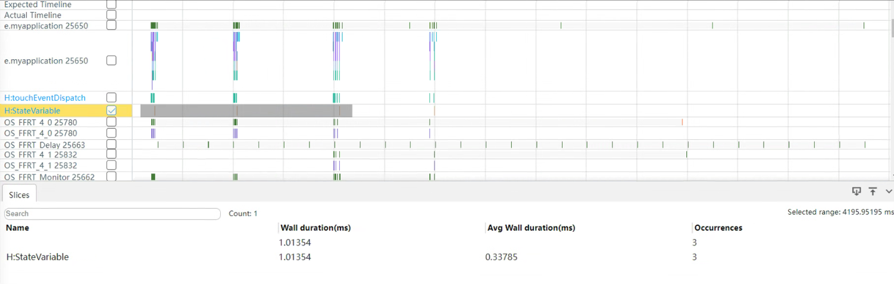

# 状态管理优秀实践

本章节旨在帮助开发者提高ArkUI应用质量，重点提高状态管理效率。章节中列举了常见的低效开发场景及对应解决方案，并通过对比推荐用法与非推荐用法，帮助开发者正确使用状态变量，实现高性能开发。

## 使用@ObjectLink代替@Prop减少不必要的深拷贝

在应用开发中，父组件常向子组件传值。如果子组件不需要修改该状态变量，子组件使用@Prop装饰器会增加组件创建时间并影响性能，此时建议改用@ObjectLink。

【反例】

```ts
@Observed
class MyClass {
  public num: number = 0;

  constructor(num: number) {
    this.num = num;
  }
}

@Component
struct PropChild {
  @Prop testClass: MyClass; // @Prop 装饰状态变量会深拷贝

  build() {
    Text(`PropChild testNum ${this.testClass.num}`)
  }
}

@Entry
@Component
struct Parent {
  @State testClass: MyClass[] = [new MyClass(1)];

  build() {
    Column() {
      Text(`Parent testNum ${this.testClass[0].num}`)
        .onClick(() => {
          this.testClass[0].num += 1;
        })

      // PropChild没有改变@Prop testClass: MyClass的值，所以这时最优的选择是使用@ObjectLink
      PropChild({ testClass: this.testClass[0] })
    }
  }
}
```

在以上示例中，PropChild组件没有改变\@Prop testClass: MyClass的值，因此使用\@ObjectLink更为合适。因为@Prop会深拷贝数据，带来性能开销，而\@ObjectLink是比\@Link和\@Prop更优的选择。

【正例】

```ts
@Observed
class MyClass {
  public num: number = 0;

  constructor(num: number) {
    this.num = num;
  }
}

@Component
struct PropChild {
  @ObjectLink testClass: MyClass; // @ObjectLink 装饰状态变量不会深拷贝

  build() {
    Text(`PropChild testNum ${this.testClass.num}`)
  }
}

@Entry
@Component
struct Parent {
  @State testClass: MyClass[] = [new MyClass(1)];

  build() {
    Column() {
      Text(`Parent testNum ${this.testClass[0].num}`)
        .onClick(() => {
          this.testClass[0].num += 1;
        })

      // 当子组件不需要发生本地改变时，优先使用@ObjectLink，因为@Prop是会深拷贝数据，具有拷贝的性能开销，所以这个时候@ObjectLink是比@Link和@Prop更优的选择
      PropChild({ testClass: this.testClass[0] })
    }
  }
}
```


## 不使用状态变量强行更新非状态变量关联组件

【反例】


```ts
@Entry
@Component
struct MyComponent {
  @State needsUpdate: boolean = true;
  realStateArr: Array<number> = [4, 1, 3, 2]; // 未使用状态变量装饰器
  realState: Color = Color.Yellow;

  updateUIArr(param: Array<number>): Array<number> {
    const triggerAGet = this.needsUpdate;
    return param;
  }
  updateUI(param: Color): Color {
    const triggerAGet = this.needsUpdate;
    return param;
  }
  build() {
    Column({ space: 20 }) {
      ForEach(this.updateUIArr(this.realStateArr),
        (item: Array<number>) => {
          Text(`${item}`)
        })
      Text("add item")
        .onClick(() => {
          // 改变realStateArr不会触发UI视图更新
          this.realStateArr.push(this.realStateArr[this.realStateArr.length-1] + 1);

          // 触发UI视图更新
          this.needsUpdate = !this.needsUpdate;
        })
      Text("chg color")
        .onClick(() => {
          // 改变realState不会触发UI视图更新
          this.realState = this.realState == Color.Yellow ? Color.Red : Color.Yellow;

          // 触发UI视图更新
          this.needsUpdate = !this.needsUpdate;
        })
    }.backgroundColor(this.updateUI(this.realState))
    .width(200).height(500)
  }
}
```

上述示例存在以下问题：

- 应用程序希望控制UI更新逻辑，然而ArkUI的UI更新是由框架检测状态变量的变化触发的。

- this.needsUpdate是一个自定义的状态变量，仅应用于其绑定的UI组件。变量this.realStateArr和this.realState没有被装饰，它们的变化不会触发UI刷新。

- 但是在该应用中，用户试图通过this.needsUpdate的更新来带动常规变量this.realStateArr和this.realState的更新，这种方法不合理且更新性能较差。

【正例】

解决此问题，需用\@State装饰realStateArr和realState成员变量。解决后就不再需要变量needsUpdate。

```ts
@Entry
@Component
struct CompA {
  @State realStateArr: Array<number> = [4, 1, 3, 2];
  @State realState: Color = Color.Yellow;
  build() {
    Column({ space: 20 }) {
      ForEach(this.realStateArr,
        (item: Array<number>) => {
          Text(`${item}`)
        })
      Text("add item")
        .onClick(() => {
          // 改变realStateArr触发UI视图更新
          this.realStateArr.push(this.realStateArr[this.realStateArr.length-1] + 1);
        })
      Text("chg color")
        .onClick(() => {
          // 改变realState触发UI视图更新
          this.realState = this.realState == Color.Yellow ? Color.Red : Color.Yellow;
        })
    }.backgroundColor(this.realState)
    .width(200).height(500)
  }
}
```

## 精准控制状态变量关联的组件数

建议每个状态变量关联的组件数少于20个。精准控制状态变量关联的组件数可减少不必要的组件刷新，提高刷新效率。有时开发者会将同一个状态变量绑定多个同级组件的属性，状态变化时会让这些组件做出相同的改变，导致不必要的刷新，如果存在复杂的组件会显著影响整体性能。相反，将该状态变量绑定在这些组件的父组件上，可以减少需要刷新的组件数，提高性能。

【反例】

```ts
@Observed
class Translate {
  translateX: number = 20;
}
@Component
struct Title {
  @ObjectLink translateObj: Translate;
  build() {
    Row() {
      // 此处'app.media.icon'仅作示例，请开发者自行替换，否则imageSource创建失败会导致后续无法正常执行。
      Image($r('app.media.icon'))
        .width(50)
        .height(50)
        .translate({
          x:this.translateObj.translateX // this.translateObj.translateX 绑定在Image和Text组件上
        })
      Text("Title")
        .fontSize(20)
        .translate({
          x: this.translateObj.translateX
        })
    }
  }
}
@Entry
@Component
struct Page {
  @State translateObj: Translate = new Translate();

  build() {
    Column() {
      Title({
        translateObj: this.translateObj
      })
      Stack() {
      }
      .backgroundColor("black")
      .width(200)
      .height(400)
      .translate({
        x:this.translateObj.translateX //this.translateObj.translateX 绑定在Stack和Button组件上
      })
      Button("move")
        .translate({
          x:this.translateObj.translateX
        })
        .onClick(() => {
          this.getUIContext().animateTo({
            duration: 50
          },()=>{
            this.translateObj.translateX = (this.translateObj.translateX + 50) % 150
          })
        })
    }
  }
}
```

在上面的示例中，状态变量this.translateObj.translateX被用在多个同级的子组件下，当this.translateObj.translateX变化时，会导致所有关联它的组件一起刷新，但实际上由于这些组件的变化是相同的，因此可以将这个属性绑定到他们共同的父组件上，来实现减少组件的刷新数量。经过分析，所有的子组件其实都处于Page下的Column中，因此将所有子组件相同的translate属性统一到Column上，来实现精准控制状态变量关联的组件数。

【正例】

```ts
@Observed
class Translate {
  translateX: number = 20;
}
@Component
struct Title {
  build() {
    Row() {
      // 此处'app.media.icon'仅作示例，请开发者自行替换，否则imageSource创建失败会导致后续无法正常执行。
      Image($r('app.media.icon'))
        .width(50)
        .height(50)
      Text("Title")
        .fontSize(20)
    }
  }
}
@Entry
@Component
struct Page1 {
  @State translateObj: Translate = new Translate();

  build() {
    Column() {
      Title()
      Stack() {
      }
      .backgroundColor("black")
      .width(200)
      .height(400)
      Button("move")
        .onClick(() => {
          this.getUIContext().animateTo({
            duration: 50
          },()=>{
            this.translateObj.translateX = (this.translateObj.translateX + 50) % 150
          })
        })
    }
    .translate({ // 子组件Stack和Button设置了同一个translate属性，可以统一到Column上设置
      x: this.translateObj.translateX
    })
  }
}
```

## 合理控制对象类型状态变量关联的组件数量

如果将一个复杂对象定义为状态变量，需要合理控制其关联的组件数。当对象中某个成员属性发生变化时，会导致该对象关联的所有组件刷新，即使这些组件并未直接使用该属性。为了避免这种“冗余刷新”对性能产生影响，建议合理拆分该复杂对象，控制对象关联的组件数量。具体可参考[精准控制组件的更新范围](https://gitee.com/openharmony/docs/blob/master/zh-cn/application-dev/performance/precisely-control-render-scope.md)和[状态管理合理使用开发指导](properly-use-state-management-to-develope.md)两篇文章。

## 查询状态变量关联的组件数

在应用开发中，可以通过HiDumper查看状态变量关联的组件数，进行性能优化。具体可参考[状态变量组件定位工具实践](https://gitee.com/openharmony/docs/blob/master/zh-cn/application-dev/performance/state_variable_dfx_pratice.md)。

## 避免在for、while等循环逻辑中频繁读取状态变量

在应用开发中，应避免在循环逻辑中频繁读取状态变量，而是应该放在循环外面读取。

【反例】

```ts
import hilog from '@ohos.hilog';

@Entry
@Component
struct Index {
  @State message: string = '';

  build() {
    Column() {
      Button('点击打印日志')
        .onClick(() => {
          for (let i = 0; i < 10; i++) {
            hilog.info(0x0000, 'TAG', '%{public}s', this.message);
          }
        })
        .width('90%')
        .backgroundColor(Color.Blue)
        .fontColor(Color.White)
        .margin({
          top: 10
        })
    }
    .justifyContent(FlexAlign.Start)
    .alignItems(HorizontalAlign.Center)
    .margin({
      top: 15
    })
  }
}
```

【正例】

```ts
import hilog from '@ohos.hilog';

@Entry
@Component
struct Index {
  @State message: string = '';

  build() {
    Column() {
      Button('点击打印日志')
        .onClick(() => {
          let logMessage: string = this.message;
          for (let i = 0; i < 10; i++) {
            hilog.info(0x0000, 'TAG', '%{public}s', logMessage);
          }
        })
        .width('90%')
        .backgroundColor(Color.Blue)
        .fontColor(Color.White)
        .margin({
          top: 10
        })
    }
    .justifyContent(FlexAlign.Start)
    .alignItems(HorizontalAlign.Center)
    .margin({
      top: 15
    })
  }
}
```

## 建议使用临时变量替换状态变量

在应用开发中，应尽量减少对状态变量的直接赋值，通过临时变量完成数据计算操作。

状态变量发生变化时，ArkUI会查询依赖该状态变量的组件并执行该组件的更新方法，完成组件渲染的行为。通过使用临时变量的计算代替直接操作状态变量，可以使ArkUI仅在最后一次状态变量变更时查询并渲染组件，减少不必要的操作，从而提高应用性能。状态变量行为可参考[@State装饰器：组件内状态](arkts-state.md)。

【反例】

```ts
import { hiTraceMeter } from '@kit.PerformanceAnalysisKit';

@Entry
@Component
struct Index {
  @State message: string = '';

  appendMsg(newMsg: string) {
    // 性能打点
    hiTraceMeter.startTrace('StateVariable', 1);
    this.message += newMsg;
    this.message += ';';
    this.message += '<br/>';
    hiTraceMeter.finishTrace('StateVariable', 1);
  }

  build() {
    Column() {
      Button('点击打印日志')
        .onClick(() => {
          this.appendMsg('操作状态变量');
        })
        .width('90%')
        .backgroundColor(Color.Blue)
        .fontColor(Color.White)
        .margin({
          top: 10
        })
    }
    .justifyContent(FlexAlign.Start)
    .alignItems(HorizontalAlign.Center)
    .margin({
      top: 15
    })
  }
}
```

直接操作状态变量，三次触发计算函数，运行耗时结果如下：



【正例】

```ts
import { hiTraceMeter } from '@kit.PerformanceAnalysisKit';

@Entry
@Component
struct Index {
  @State message: string = '';

  appendMsg(newMsg: string) {
    // 性能打点
    hiTraceMeter.startTrace('TemporaryVariable', 2);
    let message = this.message;
    message += newMsg;
    message += ';';
    message += '<br/>';
    this.message = message;
    hiTraceMeter.finishTrace('TemporaryVariable', 2);
  }

  build() {
    Column() {
      Button('点击打印日志')
        .onClick(() => {
          this.appendMsg('操作临时变量');
        })
        .width('90%')
        .backgroundColor(Color.Blue)
        .fontColor(Color.White)
        .margin({
          top: 10
        })
    }
    .justifyContent(FlexAlign.Start)
    .alignItems(HorizontalAlign.Center)
    .margin({
      top: 15
    })
  }
}
```

使用临时变量取代状态变量的计算，三次触发计算函数，运行耗时结果如下：


【总结】
| **计算方式** | **耗时(局限不同设备和场景，数据仅供参考)**  | **说明** |
| ------ | ------- | ------------------------------------- |
| 直接操作状态变量  | 1.01ms | 增加了ArkUI不必要的查询和渲染行为，导致性能劣化 |
| 使用临时变量计算  | 0.63ms | 减少了ArkUI不必要的行为，优化性能 |